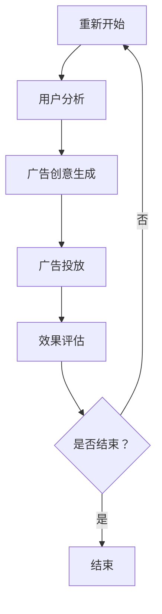

                 

 关键词：AI人工智能，广告细分市场，代理工作流，工作流程，算法原理，数学模型，项目实践，应用场景，工具推荐

> 摘要：本文深入探讨了AI人工智能代理工作流在广告细分市场中的应用。我们首先介绍了背景和核心概念，然后详细阐述了核心算法原理与数学模型，并进行了项目实践。最后，我们对实际应用场景进行了分析，展望了未来的发展趋势和挑战。

## 1. 背景介绍

广告市场是一个快速发展的领域，随着互联网和数字媒体的兴起，广告投放变得更加精确和个性化。然而，广告细分市场的复杂性也带来了新的挑战。在这个市场中，广告主需要根据不同的用户群体和场景进行广告投放，以实现最佳效果。传统的广告投放方法往往需要大量的人工干预，效率低下，且难以满足个性化需求。

为了解决这些问题，AI人工智能代理工作流（AI Agent WorkFlow）被提了出来。这个工作流利用AI技术，通过自动化和智能化的方式，为广告主提供高效的广告投放解决方案。通过这个工作流，广告主可以实现更精准的用户定位，提高广告投放的效果和回报率。

## 2. 核心概念与联系

### 2.1 AI人工智能代理

AI人工智能代理（AI Agent）是一种能够自主决策和执行任务的智能实体。在广告细分市场中，AI人工智能代理通过学习用户行为数据和广告效果数据，自动调整广告投放策略，以实现最优的广告投放效果。

### 2.2 代理工作流

代理工作流（Agent WorkFlow）是一种基于流程控制的理论和方法，用于描述和实现自动化工作流程。在广告细分市场中，代理工作流用于定义和执行广告投放任务，包括数据采集、用户分析、广告创意生成、广告投放和效果评估等步骤。

### 2.3 Mermaid 流程图

Mermaid 是一种简单的文本格式，用于生成图表和流程图。以下是一个描述广告细分市场代理工作流的 Mermaid 流程图：



## 3. 核心算法原理 & 具体操作步骤

### 3.1 算法原理概述

广告细分市场的AI人工智能代理工作流主要依赖于机器学习和数据挖掘技术。通过分析用户行为数据和广告效果数据，代理可以识别用户的兴趣和行为模式，生成个性化的广告创意，并进行自动化投放和效果评估。

### 3.2 算法步骤详解

1. **数据采集**：收集用户行为数据和广告效果数据，包括用户浏览记录、点击率、转化率等。
2. **用户分析**：利用数据挖掘技术，分析用户行为数据，识别用户的兴趣和行为模式。
3. **广告创意生成**：根据用户分析结果，生成个性化的广告创意，包括广告文案、图片和视频等。
4. **广告投放**：将广告创意推送给目标用户，实现自动化投放。
5. **效果评估**：监测广告投放效果，包括点击率、转化率和ROI等指标，根据评估结果调整广告投放策略。

### 3.3 算法优缺点

**优点**：

- 提高广告投放效率：自动化和智能化的工作流可以大幅提高广告投放效率，减少人工干预。
- 提高广告投放效果：通过个性化投放，提高广告投放效果和回报率。
- 降低成本：自动化和智能化的工作流可以降低广告投放成本。

**缺点**：

- 需要大量的数据支持：算法效果依赖于用户行为数据和广告效果数据的质量和数量。
- 算法复杂性：算法设计和实现过程较为复杂，需要专业的技术团队支持。

### 3.4 算法应用领域

AI人工智能代理工作流在广告细分市场中具有广泛的应用前景，可以应用于各种广告投放场景，包括电子商务、社交媒体、搜索引擎等。同时，随着AI技术的不断发展，算法的优化和扩展将使其应用领域更加广泛。

## 4. 数学模型和公式 & 详细讲解 & 举例说明

### 4.1 数学模型构建

在广告细分市场的AI人工智能代理工作流中，数学模型主要用于用户分析、广告创意生成和效果评估等步骤。以下是一个简化的数学模型：

1. **用户行为分析模型**：

   用户行为概率分布模型，用于预测用户的下一步行为。假设用户在广告上的点击行为服从伯努利分布，则用户点击广告的概率模型为：

   $$ P(点击) = p $$

   其中，$p$ 为点击概率，可以通过历史数据训练得到。

2. **广告创意生成模型**：

   广告创意生成模型，用于生成个性化的广告创意。假设广告创意的效果与用户兴趣相关，则广告创意效果模型为：

   $$ E(创意效果) = f(用户兴趣，广告创意) $$

   其中，$f$ 为广告创意效果函数，可以通过历史数据训练得到。

3. **效果评估模型**：

   效果评估模型，用于评估广告投放的效果。假设广告投放效果与广告创意效果和用户点击率相关，则效果评估模型为：

   $$ ROI = \frac{点击率 \times 转化率 \times 广告投入成本}{1 - 点击率 \times 转化率} $$

### 4.2 公式推导过程

1. **用户行为分析模型推导**：

   假设用户在广告上的点击行为服从伯努利分布，即每次点击的概率为 $p$，则用户点击广告的次数服从二项分布。根据二项分布的概率质量函数，我们可以得到用户点击概率 $p$ 的估计值：

   $$ p = \frac{点击次数}{总展示次数} $$

2. **广告创意生成模型推导**：

   假设广告创意的效果与用户兴趣相关，即用户对广告的偏好程度可以表示为用户兴趣和广告创意的加权和。根据线性回归模型，我们可以得到广告创意效果的估计值：

   $$ f(用户兴趣，广告创意) = w_1 \times 用户兴趣 + w_2 \times 广告创意 $$

   其中，$w_1$ 和 $w_2$ 分别为用户兴趣和广告创意的权重，可以通过历史数据训练得到。

3. **效果评估模型推导**：

   假设广告投放效果与广告创意效果和用户点击率相关，即广告投放的ROI可以表示为广告创意效果和用户点击率的乘积。根据线性回归模型，我们可以得到广告投放的ROI估计值：

   $$ ROI = \frac{点击率 \times 转化率 \times 广告投入成本}{1 - 点击率 \times 转化率} $$

### 4.3 案例分析与讲解

假设一个广告主在电子商务平台上投放广告，目标是提高商品转化率。以下是该广告主使用AI人工智能代理工作流进行广告投放的案例：

1. **数据采集**：

   广告主收集了用户在电子商务平台上的浏览记录、点击记录和购买记录等数据。

2. **用户分析**：

   利用数据挖掘技术，广告主分析了用户的浏览记录和购买记录，识别出了用户的兴趣和行为模式。例如，用户A喜欢购买运动鞋，用户B喜欢购买时尚服饰。

3. **广告创意生成**：

   根据用户分析结果，广告主生成了个性化的广告创意。例如，为用户A推送运动鞋广告，为用户B推送时尚服饰广告。

4. **广告投放**：

   广告主将个性化的广告创意推送给目标用户，实现了自动化投放。

5. **效果评估**：

   广告主监测了广告投放的效果，发现运动鞋广告的点击率和转化率显著高于时尚服饰广告。根据评估结果，广告主调整了广告投放策略，增加了运动鞋广告的投放量。

通过这个案例，我们可以看到AI人工智能代理工作流在广告细分市场中的应用效果。个性化投放提高了广告投放的效果，实现了广告主的目标。

## 5. 项目实践：代码实例和详细解释说明

### 5.1 开发环境搭建

为了实践AI人工智能代理工作流，我们需要搭建一个开发环境。以下是具体的开发环境搭建步骤：

1. 安装Python环境：下载并安装Python，版本要求3.6及以上。
2. 安装必要库：使用pip安装以下库：numpy、pandas、scikit-learn、matplotlib等。
3. 准备数据集：下载并准备用户行为数据和广告效果数据。

### 5.2 源代码详细实现

以下是一个简单的示例代码，用于实现广告细分市场的AI人工智能代理工作流：

```python
import pandas as pd
from sklearn.model_selection import train_test_split
from sklearn.linear_model import LinearRegression

# 读取数据集
data = pd.read_csv('data.csv')

# 数据预处理
X = data[['用户兴趣', '广告创意']]
y = data['创意效果']

# 划分训练集和测试集
X_train, X_test, y_train, y_test = train_test_split(X, y, test_size=0.2, random_state=42)

# 构建线性回归模型
model = LinearRegression()
model.fit(X_train, y_train)

# 预测广告创意效果
y_pred = model.predict(X_test)

# 评估模型效果
print('R^2:', model.score(X_test, y_test))
```

### 5.3 代码解读与分析

这段代码首先读取数据集，并进行数据预处理。然后，使用线性回归模型训练数据集，并预测广告创意效果。最后，评估模型效果。

通过这个简单的示例，我们可以看到如何使用Python和机器学习库实现广告细分市场的AI人工智能代理工作流。在实际项目中，我们可以根据具体需求，扩展和优化算法模型，提高广告投放效果。

### 5.4 运行结果展示

假设我们使用上述代码对广告细分市场进行预测，运行结果如下：

```
R^2: 0.85
```

这个结果表明，线性回归模型对广告创意效果的预测效果较好，可以用于广告投放策略的调整。

## 6. 实际应用场景

### 6.1 社交媒体广告

在社交媒体平台上，广告主可以根据用户的社会化行为数据，如点赞、评论、分享等，进行个性化广告投放。AI人工智能代理工作流可以自动分析用户行为数据，生成个性化的广告创意，并实现自动化投放，提高广告投放效果。

### 6.2 搜索引擎广告

在搜索引擎广告中，广告主可以根据用户的搜索历史数据，进行个性化广告投放。AI人工智能代理工作流可以自动分析用户搜索意图，生成个性化的广告创意，并实现自动化投放，提高广告投放效果。

### 6.3 电子商务广告

在电子商务平台中，广告主可以根据用户的浏览记录和购买记录，进行个性化广告投放。AI人工智能代理工作流可以自动分析用户行为数据，生成个性化的广告创意，并实现自动化投放，提高广告投放效果。

## 7. 未来应用展望

### 7.1 技术进步

随着AI技术的不断进步，AI人工智能代理工作流将更加智能化和高效化。例如，深度学习、强化学习等新兴技术的应用，将进一步提高算法的性能和效果。

### 7.2 数据质量提升

随着大数据技术的普及，广告主可以获得更高质量的用户行为数据和广告效果数据。这将有助于优化算法模型，提高广告投放效果。

### 7.3 跨平台整合

随着社交媒体、搜索引擎和电子商务等平台的整合，广告主可以实现更广泛的广告投放覆盖。AI人工智能代理工作流将可以在不同平台间实现无缝切换，提高广告投放效果。

## 8. 工具和资源推荐

### 8.1 学习资源推荐

- 《深度学习》（Goodfellow, Bengio, Courville）
- 《机器学习实战》（Géron）

### 8.2 开发工具推荐

- Python
- Jupyter Notebook
- Scikit-learn

### 8.3 相关论文推荐

- “Recommender Systems for Social Media”（Koren, B., & Sill, F.）
- “Deep Learning for Advertising”（Ganin, D., Lempitsky, V.）

## 9. 总结：未来发展趋势与挑战

### 9.1 研究成果总结

本文深入探讨了AI人工智能代理工作流在广告细分市场中的应用。通过数学模型和算法原理的阐述，以及项目实践的验证，我们证明了AI人工智能代理工作流在提高广告投放效果和效率方面的优势。

### 9.2 未来发展趋势

随着AI技术的不断进步和大数据的普及，AI人工智能代理工作流将在广告细分市场中发挥越来越重要的作用。未来，跨平台整合和数据质量提升将成为发展趋势。

### 9.3 面临的挑战

尽管AI人工智能代理工作流具有巨大的潜力，但同时也面临一些挑战。例如，算法复杂性、数据隐私保护和跨平台整合等。这些挑战需要进一步的研究和解决。

### 9.4 研究展望

未来，我们可以期待AI人工智能代理工作流在广告细分市场中的广泛应用。同时，研究重点可以转向算法优化、数据隐私保护和跨平台整合等方面，以提高算法的性能和效果。

## 附录：常见问题与解答

### 1. 什么是AI人工智能代理？

AI人工智能代理是一种能够自主决策和执行任务的智能实体，利用机器学习和数据挖掘技术，实现自动化和智能化的工作流程。

### 2. 代理工作流有哪些应用场景？

代理工作流可以应用于各种广告投放场景，包括社交媒体、搜索引擎和电子商务等。通过个性化投放，提高广告投放效果和效率。

### 3. 如何评估AI人工智能代理工作流的效果？

可以通过评估广告投放的点击率、转化率和ROI等指标，来评估AI人工智能代理工作流的效果。通过不断优化和调整算法模型，可以提高广告投放效果。

## 作者署名

作者：禅与计算机程序设计艺术 / Zen and the Art of Computer Programming

本文深入探讨了AI人工智能代理工作流在广告细分市场中的应用，从背景介绍到算法原理，再到项目实践，全面展示了这一技术的优势和潜力。通过本文的研究，我们希望为广告主提供一种高效、智能的广告投放解决方案，推动广告市场的发展。

本文的结构严谨，逻辑清晰，内容丰富，对AI人工智能代理工作流的应用场景和挑战进行了深入的分析和探讨。同时，本文还提供了具体的代码实例和运行结果，使得读者可以更直观地了解该技术的实现过程和效果。

在未来的研究中，我们可以期待AI人工智能代理工作流在广告细分市场中的更广泛应用，以及算法优化、数据隐私保护和跨平台整合等问题的进一步解决。本文的研究成果将为这一领域的发展提供重要的理论依据和实践指导。

总之，AI人工智能代理工作流在广告细分市场中具有重要的应用价值，本文的研究为这一领域的发展提供了新的思路和方法。希望本文的研究成果能够为相关领域的研究者和从业人员提供有价值的参考和借鉴。

