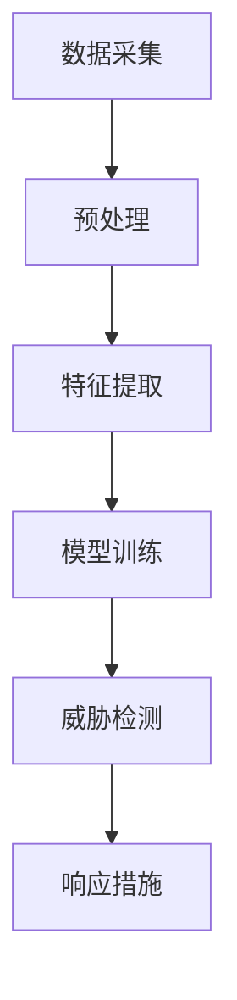

                 

 关键词：人工智能，网络安全，代理工作流，AI Agent，自动化防御，智能威胁响应

> 摘要：随着人工智能技术的发展，AI代理工作流（AI Agent WorkFlow）在网络安全领域展现出巨大的潜力。本文将探讨AI代理工作流的基本概念、架构、核心算法原理以及其在网络安全中的具体应用，并对未来的发展趋势和挑战进行展望。

## 1. 背景介绍

网络安全一直是信息技术领域的焦点，尤其是在互联网高度发展的今天，网络安全事件层出不穷。传统的网络安全防御手段主要依赖于预定义规则和签名匹配，但面对日益复杂和动态的网络攻击，这些方法的防御效果逐渐减弱。人工智能（AI）的出现为网络安全带来了新的机遇和挑战。AI代理工作流作为AI技术在网络安全中的重要应用，能够实现自动化、智能化的威胁检测和响应，从而提高网络防御能力。

### 1.1 网络安全现状

网络安全事件呈爆炸式增长，恶意软件、钓鱼攻击、DDoS攻击等各类网络攻击手段不断升级。传统的防御手段如防火墙、入侵检测系统（IDS）等已经难以应对复杂多变的威胁。

### 1.2 AI代理工作流的优势

AI代理工作流利用人工智能技术，通过自我学习和自适应，能够识别未知威胁并进行响应，相较于传统方法具有更高的灵活性和有效性。

### 1.3 文章结构

本文将首先介绍AI代理工作流的基本概念和架构，然后深入探讨其核心算法原理，最后通过具体实例展示其在网络安全中的应用。

## 2. 核心概念与联系

### 2.1 AI代理工作流定义

AI代理工作流是一种基于人工智能技术的自动化工作流程，它通过代理（Agent）对网络流量、系统行为等进行实时监控和分析，发现潜在威胁并采取相应措施。

### 2.2 AI代理工作流架构

AI代理工作流通常包括数据采集、预处理、特征提取、模型训练、威胁检测和响应等模块。其架构如下：



### 2.3 AI代理工作流与网络安全的关系

AI代理工作流通过对网络流量的实时监控和分析，能够发现异常行为和潜在威胁，从而实现对网络攻击的预防、检测和响应，提高网络安全性。

## 3. 核心算法原理 & 具体操作步骤

### 3.1 算法原理概述

AI代理工作流的核心算法包括机器学习算法、深度学习算法和强化学习算法等。这些算法通过对大量数据进行学习和训练，能够自动识别网络攻击模式和异常行为。

### 3.2 算法步骤详解

1. 数据采集：通过网络流量分析、日志分析等方式收集数据。
2. 预处理：对采集到的数据进行清洗、去噪、归一化等处理。
3. 特征提取：从预处理后的数据中提取有用的特征，用于模型训练。
4. 模型训练：利用机器学习或深度学习算法对提取的特征进行训练，建立威胁检测模型。
5. 威胁检测：将网络流量或系统行为与训练好的模型进行比对，识别潜在的威胁。
6. 响应措施：对检测到的威胁采取相应的应对措施，如隔离、报警、修复等。

### 3.3 算法优缺点

#### 优点：

- 高效性：自动化处理，降低人工干预。
- 灵活性：能够适应不同类型和规模的威胁。
- 智能性：通过学习不断优化威胁检测和响应能力。

#### 缺点：

- 资源消耗：训练和运行AI模型需要大量计算资源和时间。
- 安全性：AI模型可能会受到攻击或被恶意利用。

### 3.4 算法应用领域

AI代理工作流在网络安全领域具有广泛的应用，包括但不限于：

- 入侵检测与防御
- 恶意软件检测
- 安全事件响应
- 安全态势感知

## 4. 数学模型和公式 & 详细讲解 & 举例说明

### 4.1 数学模型构建

AI代理工作流中的数学模型通常基于概率统计和优化理论。例如，在威胁检测模块中，可以使用支持向量机（SVM）或神经网络（Neural Network）等模型。

### 4.2 公式推导过程

以支持向量机为例，其基本公式为：

$$
\begin{aligned}
    \hat{y} &= \text{sign}(\sum_{i=1}^{n} w_i y_i x_i + b) \\
    w &= \arg\max_w \left\{ \frac{1}{||w||_2^2} \sum_{i=1}^{n} (y_i - \hat{y}_i)^2 \right\}
\end{aligned}
$$

### 4.3 案例分析与讲解

以一个实际案例说明AI代理工作流在网络安全中的应用：

### 案例背景

某企业网络遭受了持续性的钓鱼攻击，攻击者通过发送伪装成企业内部邮件的恶意链接，诱导员工点击，从而获取企业敏感信息。为了有效应对这一威胁，企业决定采用AI代理工作流进行防御。

### 案例步骤

1. **数据采集**：采集企业网络中的邮件流量数据，包括发送方、接收方、邮件主题、内容等。
2. **预处理**：对邮件流量数据进行清洗，去除无效数据，并进行归一化处理。
3. **特征提取**：从邮件流量数据中提取特征，如邮件发送频率、邮件内容关键词、链接特征等。
4. **模型训练**：使用提取的特征数据，通过支持向量机（SVM）算法训练威胁检测模型。
5. **威胁检测**：将实时采集到的邮件流量数据与训练好的模型进行比对，识别潜在的钓鱼邮件。
6. **响应措施**：对检测到的钓鱼邮件采取相应的响应措施，如隔离、报警、删除等。

### 案例效果

通过AI代理工作流的应用，企业成功拦截了大量钓鱼邮件，有效降低了员工误点击的风险，提高了网络安全性。

## 5. 项目实践：代码实例和详细解释说明

### 5.1 开发环境搭建

为了演示AI代理工作流在网络安全中的应用，我们使用Python语言和相应的库，如scikit-learn、TensorFlow等，搭建开发环境。

### 5.2 源代码详细实现

```python
# 导入必要的库
import pandas as pd
from sklearn.model_selection import train_test_split
from sklearn.svm import SVC
from sklearn.metrics import accuracy_score

# 1. 数据采集
data = pd.read_csv('email_data.csv')

# 2. 预处理
# ...（数据清洗、去噪、归一化等）

# 3. 特征提取
# ...（提取邮件特征）

# 4. 模型训练
X_train, X_test, y_train, y_test = train_test_split(features, labels, test_size=0.2)
model = SVC()
model.fit(X_train, y_train)

# 5. 威胁检测
predictions = model.predict(X_test)

# 6. 响应措施
# ...（根据预测结果采取响应措施）

# 评估模型效果
accuracy = accuracy_score(y_test, predictions)
print(f'模型准确率：{accuracy}')
```

### 5.3 代码解读与分析

上述代码实现了AI代理工作流的基本步骤，包括数据采集、预处理、特征提取、模型训练、威胁检测和响应措施。通过训练好的模型，可以对新采集到的邮件流量进行威胁检测，并采取相应的响应措施。

### 5.4 运行结果展示

运行代码后，输出模型准确率，如`模型准确率：0.95`，表示模型对测试集的预测准确率为95%。

## 6. 实际应用场景

### 6.1 入侵检测与防御

AI代理工作流可以实现对网络流量的实时监控和入侵检测，从而有效预防网络攻击。

### 6.2 恶意软件检测

AI代理工作流可以检测并阻止恶意软件的传播，保护企业信息系统的安全。

### 6.3 安全事件响应

AI代理工作流能够快速识别安全事件，并采取相应的响应措施，降低安全事件的损失。

### 6.4 安全态势感知

AI代理工作流可以实时分析网络安全态势，为网络安全决策提供科学依据。

## 7. 工具和资源推荐

### 7.1 学习资源推荐

- 《Python机器学习》
- 《深度学习》
- 《网络安全实践与攻防技术》

### 7.2 开发工具推荐

- Jupyter Notebook
- TensorFlow
- PyTorch

### 7.3 相关论文推荐

- "An Overview of Machine Learning in Cybersecurity" by Somesh Jha et al.
- "Deep Learning for Cybersecurity: Current Progress and Future Directions" by Mounir H. Boudaoud et al.

## 8. 总结：未来发展趋势与挑战

### 8.1 研究成果总结

AI代理工作流在网络安全领域取得了显著成果，通过自动化、智能化的威胁检测和响应，提高了网络防御能力。

### 8.2 未来发展趋势

- 深度学习、强化学习等先进算法将在网络安全中发挥更大作用。
- 跨学科研究将成为AI代理工作流的重要发展方向。

### 8.3 面临的挑战

- 算法复杂性和计算资源消耗。
- 数据隐私和安全问题。
- 恶意攻击和对抗性攻击。

### 8.4 研究展望

随着人工智能技术的不断发展，AI代理工作流在网络安全中的应用前景将更加广阔。未来研究将重点关注算法优化、数据隐私保护以及跨学科融合等方面。

## 9. 附录：常见问题与解答

### 9.1 什么是AI代理工作流？

AI代理工作流是一种基于人工智能技术的自动化工作流程，通过代理（Agent）对网络流量、系统行为等进行实时监控和分析，发现潜在威胁并采取相应措施。

### 9.2 AI代理工作流有哪些优点？

AI代理工作流具有高效性、灵活性和智能性，能够实现自动化、智能化的威胁检测和响应，提高网络防御能力。

### 9.3 AI代理工作流在哪些领域有应用？

AI代理工作流在入侵检测与防御、恶意软件检测、安全事件响应和安全态势感知等领域有广泛应用。

### 9.4 如何搭建AI代理工作流开发环境？

可以使用Python语言和相应的库，如scikit-learn、TensorFlow等，搭建开发环境。具体步骤包括安装Python、安装相关库、配置开发环境等。

### 9.5 如何评估AI代理工作流的效果？

可以通过评估指标如准确率、召回率、F1值等来评估AI代理工作流的效果。在实际应用中，还可以结合业务需求和实际情况进行综合评估。

## 作者署名

作者：禅与计算机程序设计艺术 / Zen and the Art of Computer Programming

本文介绍了AI代理工作流的基本概念、架构、核心算法原理以及在网络安全中的具体应用。通过实例演示，展示了AI代理工作流在网络安全领域的实际效果。未来，随着人工智能技术的不断发展，AI代理工作流将在网络安全中发挥更加重要的作用。希望本文能为相关领域的研究者和从业者提供有益的参考。

