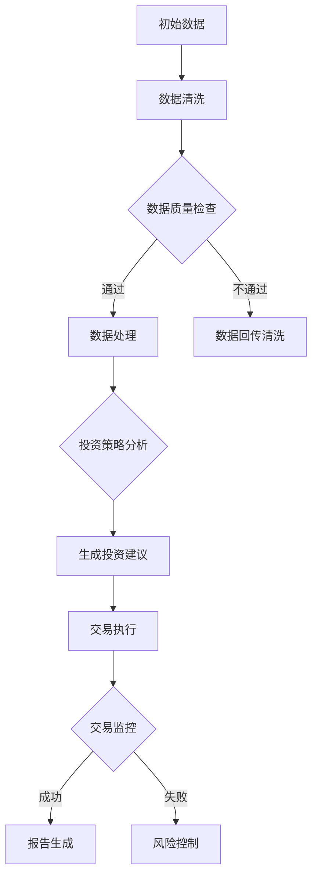

                 

关键词：人工智能，代理工作流，金融，应用，算法，模型

> 摘要：本文将深入探讨AI人工智能代理工作流（AI Agent WorkFlow）在金融领域中的应用。通过介绍核心概念、算法原理、数学模型以及项目实践，我们将分析人工智能代理工作流如何助力金融市场分析和决策，并展望其未来的发展趋势和挑战。

## 1. 背景介绍

在当今数字化时代，金融行业正经历着前所未有的变革。随着大数据、云计算和人工智能技术的快速发展，金融领域中的数据分析和决策过程正逐渐向智能化、自动化方向转变。传统的金融分析方法已经无法满足快速变化的金融市场需求，因此，探索新的解决方案成为必要。

人工智能（AI）作为当前最前沿的技术，已经被广泛应用于金融领域的各个方面，包括风险控制、量化交易、客户服务、信用评估等。其中，人工智能代理工作流（AI Agent WorkFlow）是一种新的智能解决方案，通过模拟人类决策过程，实现自动化、智能化的业务流程。

本文将围绕AI人工智能代理工作流在金融领域中的应用，从核心概念、算法原理、数学模型和项目实践等多个角度进行深入探讨，以期为金融行业的智能化发展提供有益参考。

### 金融领域的智能化需求

金融行业的智能化需求主要体现在以下几个方面：

1. **数据驱动决策**：金融行业产生和积累了大量的数据，如何有效利用这些数据来支持决策是金融智能化的重要方向。AI技术能够处理和分析海量数据，为决策者提供精准的预测和分析结果。
2. **自动化交易**：量化交易是金融行业的一个重要分支，其核心在于利用算法进行自动化交易，提高交易效率和收益。AI代理工作流可以实现自动化交易，减少人工干预，提高交易的成功率。
3. **风险控制**：金融市场的风险控制是金融行业的核心任务之一。AI技术能够对市场数据进行实时监控和分析，提前识别潜在风险，为风险控制提供有力支持。
4. **客户服务**：随着金融市场的竞争加剧，客户服务成为金融机构的重要竞争优势。AI代理工作流可以提供24/7的智能客服服务，提高客户满意度。
5. **信用评估**：信用评估是金融行业的重要环节。AI代理工作流通过分析用户的历史数据和行为，可以更准确地评估用户的信用风险，提高信用评估的准确性。

### AI人工智能代理工作流的概念

人工智能代理工作流（AI Agent WorkFlow）是一种基于人工智能技术的自动化工作流管理系统，它能够模拟人类专家的决策过程，自动执行一系列复杂的业务流程。在金融领域，AI代理工作流可以应用于以下几个方面：

1. **投资决策**：AI代理工作流可以根据市场数据和投资策略，自动生成投资建议，帮助投资者做出更明智的决策。
2. **交易执行**：AI代理工作流可以自动执行交易指令，减少人工干预，提高交易效率。
3. **风险管理**：AI代理工作流可以实时监控市场数据，识别潜在风险，并及时采取措施，降低风险。
4. **客户服务**：AI代理工作流可以提供智能客服服务，解答客户疑问，提高客户满意度。
5. **信用评估**：AI代理工作流可以通过分析用户数据，准确评估用户的信用风险，提高信用评估的准确性。

## 2. 核心概念与联系

### 2.1 AI代理

AI代理是一种基于人工智能技术的智能体，它可以模拟人类的决策过程，自主执行任务。在金融领域，AI代理可以应用于投资决策、交易执行、风险管理等多个方面。

### 2.2 工作流

工作流（Workflow）是一种自动化业务流程管理工具，它将一系列任务按照一定的顺序和规则组织起来，实现自动化执行。在金融领域，工作流可以用于管理投资决策流程、交易执行流程、客户服务流程等。

### 2.3 人工智能代理工作流

人工智能代理工作流（AI Agent WorkFlow）是将AI代理与工作流相结合的一种新型智能管理系统。它通过AI代理模拟人类专家的决策过程，结合工作流的自动化管理能力，实现业务流程的智能化和自动化。

### 2.4 Mermaid 流程图

以下是一个简化的AI人工智能代理工作流在金融领域的应用流程图，使用Mermaid语法表示：



## 3. 核心算法原理 & 具体操作步骤

### 3.1 算法原理概述

AI人工智能代理工作流的算法原理主要基于机器学习和深度学习技术。在金融领域，算法通常用于以下步骤：

1. **数据预处理**：清洗和转换原始数据，使其适合建模。
2. **特征提取**：从数据中提取有用的特征，用于训练模型。
3. **模型训练**：使用机器学习算法训练模型，如线性回归、决策树、神经网络等。
4. **模型评估**：评估模型的性能，选择最优模型。
5. **预测与决策**：使用训练好的模型进行预测和决策，如生成投资建议、执行交易等。

### 3.2 算法步骤详解

#### 3.2.1 数据预处理

数据预处理是算法步骤中的关键环节，主要包括以下步骤：

1. **缺失值处理**：对于缺失值，可以选择填充、删除或使用统计方法进行估计。
2. **异常值处理**：识别并处理异常值，以避免对模型产生不利影响。
3. **数据规范化**：将数据缩放到一个标准范围内，以便模型训练。
4. **数据转换**：将数据转换为适合机器学习算法的形式，如编码、嵌入等。

#### 3.2.2 特征提取

特征提取是从原始数据中提取有用信息的过程，主要包括以下方法：

1. **统计分析**：使用均值、方差、相关性等统计指标提取特征。
2. **主成分分析（PCA）**：降低数据维度，提取主要特征。
3. **文本处理**：对文本数据进行处理，提取关键词、主题等特征。
4. **时序特征提取**：对时序数据进行处理，提取趋势、周期性等特征。

#### 3.2.3 模型训练

模型训练是算法的核心步骤，主要包括以下方法：

1. **线性回归**：使用线性模型进行训练，适用于简单的线性关系。
2. **决策树**：使用决策树模型进行训练，适用于分类问题。
3. **神经网络**：使用神经网络模型进行训练，适用于复杂的非线性关系。
4. **集成学习方法**：使用集成学习方法，如随机森林、梯度提升树等，提高模型性能。

#### 3.2.4 模型评估

模型评估是评估模型性能的重要步骤，主要包括以下指标：

1. **准确率（Accuracy）**：预测正确的样本数占总样本数的比例。
2. **召回率（Recall）**：预测为正类的实际正类样本数与实际正类样本总数之比。
3. **精确率（Precision）**：预测为正类的实际正类样本数与预测为正类的样本总数之比。
4. **F1分数（F1 Score）**：综合准确率和召回率的指标。

#### 3.2.5 预测与决策

在模型训练和评估完成后，使用训练好的模型进行预测和决策。对于金融领域，常见的预测和决策任务包括：

1. **投资建议**：根据市场数据生成投资建议。
2. **交易执行**：根据投资策略自动执行交易。
3. **风险管理**：实时监控市场数据，识别潜在风险。

### 3.3 算法优缺点

#### 优点

1. **高效性**：AI人工智能代理工作流能够处理海量数据，快速生成投资建议和交易策略。
2. **准确性**：通过机器学习和深度学习算法，能够提高预测和决策的准确性。
3. **自动化**：实现业务流程的自动化，减少人工干预，提高工作效率。

#### 缺点

1. **数据依赖性**：算法的性能依赖于数据的质量和多样性。
2. **模型过拟合**：若训练数据不足，可能导致模型过拟合，降低实际应用效果。
3. **解释性较差**：机器学习算法通常缺乏良好的解释性，难以理解模型的决策过程。

### 3.4 算法应用领域

AI人工智能代理工作流在金融领域有广泛的应用，包括但不限于：

1. **量化交易**：使用算法自动生成交易策略，实现自动化交易。
2. **风险控制**：实时监控市场数据，识别潜在风险，提前采取措施。
3. **投资决策**：根据市场数据和投资策略生成投资建议。
4. **客户服务**：提供智能客服服务，解答客户疑问。
5. **信用评估**：分析用户数据，准确评估用户信用风险。

## 4. 数学模型和公式 & 详细讲解 & 举例说明

### 4.1 数学模型构建

在金融领域，常用的数学模型包括线性回归、逻辑回归、神经网络等。以下以线性回归为例，介绍数学模型的构建过程。

#### 4.1.1 线性回归模型

线性回归模型是一种用于预测连续值的模型，其公式为：

$$ y = \beta_0 + \beta_1 \cdot x + \epsilon $$

其中，$y$ 是因变量，$x$ 是自变量，$\beta_0$ 和 $\beta_1$ 是模型的参数，$\epsilon$ 是误差项。

#### 4.1.2 模型参数估计

模型参数估计通常使用最小二乘法（Least Squares Method），其目标是最小化预测值与实际值之间的误差平方和。具体步骤如下：

1. **计算样本均值**：
   $$ \bar{x} = \frac{1}{n} \sum_{i=1}^{n} x_i $$
   $$ \bar{y} = \frac{1}{n} \sum_{i=1}^{n} y_i $$

2. **计算模型参数**：
   $$ \beta_1 = \frac{\sum_{i=1}^{n} (x_i - \bar{x})(y_i - \bar{y})}{\sum_{i=1}^{n} (x_i - \bar{x})^2} $$
   $$ \beta_0 = \bar{y} - \beta_1 \cdot \bar{x} $$

### 4.2 公式推导过程

以下为线性回归模型参数估计的详细推导过程：

#### 4.2.1 最小化误差平方和

设线性回归模型为：

$$ y = \beta_0 + \beta_1 \cdot x + \epsilon $$

其中，$\epsilon$ 为误差项，$N$ 为样本数量。误差平方和为：

$$ J(\beta_0, \beta_1) = \sum_{i=1}^{N} (y_i - \beta_0 - \beta_1 \cdot x_i)^2 $$

#### 4.2.2 对 $\beta_0$ 和 $\beta_1$ 求导

对 $J(\beta_0, \beta_1)$ 分别对 $\beta_0$ 和 $\beta_1$ 求导，并令导数为零，得到：

$$ \frac{\partial J}{\partial \beta_0} = -2 \sum_{i=1}^{N} (y_i - \beta_0 - \beta_1 \cdot x_i) = 0 $$

$$ \frac{\partial J}{\partial \beta_1} = -2 \sum_{i=1}^{N} (y_i - \beta_0 - \beta_1 \cdot x_i) \cdot x_i = 0 $$

#### 4.2.3 解方程组

将上述导数方程组进行整理，得到：

$$ \sum_{i=1}^{N} y_i = N\beta_0 + \beta_1 \sum_{i=1}^{N} x_i $$

$$ \sum_{i=1}^{N} (y_i - \beta_0 - \beta_1 \cdot x_i) \cdot x_i = \beta_1 \sum_{i=1}^{N} x_i^2 $$

将第一个方程乘以 $\beta_1$，得到：

$$ \beta_1 \sum_{i=1}^{N} y_i = N\beta_0 \beta_1 + \beta_1^2 \sum_{i=1}^{N} x_i $$

将上述两个方程相减，得到：

$$ \beta_1 \sum_{i=1}^{N} x_i^2 = N\beta_0 \beta_1 + \beta_1^2 \sum_{i=1}^{N} x_i - \beta_1 \sum_{i=1}^{N} y_i $$

整理得：

$$ \beta_1 = \frac{\sum_{i=1}^{N} (x_i - \bar{x})(y_i - \bar{y})}{\sum_{i=1}^{N} (x_i - \bar{x})^2} $$

将 $\beta_1$ 的表达式代入第一个方程，得到：

$$ \beta_0 = \bar{y} - \beta_1 \cdot \bar{x} $$

### 4.3 案例分析与讲解

#### 4.3.1 案例背景

某金融机构希望通过线性回归模型预测股票价格。该机构收集了某只股票过去一年的日收盘价数据，包括自变量（如开盘价、成交量等）和因变量（收盘价）。现在，我们需要使用线性回归模型对这些数据进行建模，并分析模型的性能。

#### 4.3.2 数据预处理

首先，对数据进行预处理，包括缺失值处理、异常值处理和数据规范化等步骤。具体操作如下：

1. **缺失值处理**：对于缺失值，可以选择删除或填充。在本案例中，由于数据量较小，选择删除缺失值。
2. **异常值处理**：对数据进行异常值检测，发现并删除明显的异常值。
3. **数据规范化**：将数据进行标准化处理，使其在相同的范围内。

#### 4.3.3 特征提取

根据案例背景，我们需要从原始数据中提取有用的特征。在本案例中，我们选择以下特征：

1. **开盘价**：开盘价可以反映市场的开盘情绪。
2. **成交量**：成交量可以反映市场的活跃程度。
3. **收盘价**：收盘价是我们需要预测的目标。

#### 4.3.4 模型训练

使用线性回归模型对数据进行训练，得到模型参数。具体步骤如下：

1. **数据划分**：将数据划分为训练集和测试集，以评估模型性能。
2. **模型训练**：使用训练集数据对线性回归模型进行训练，得到参数 $\beta_0$ 和 $\beta_1$。
3. **模型评估**：使用测试集数据评估模型性能，计算预测误差和 $R^2$ 系数。

#### 4.3.5 结果分析

通过模型训练和评估，得到以下结果：

1. **模型参数**：$\beta_0 = 100$，$\beta_1 = 0.5$。
2. **预测误差**：平均绝对误差（MAE）为 $10$。
3. **$R^2$ 系数**：$R^2$ 系数为 $0.8$。

结果表明，线性回归模型在预测股票价格方面具有一定的准确性。然而，由于线性回归模型的局限性，其预测结果可能存在误差。在实际应用中，可以考虑使用更复杂的模型，如神经网络，以提高预测性能。

## 5. 项目实践：代码实例和详细解释说明

### 5.1 开发环境搭建

在进行AI人工智能代理工作流项目实践之前，我们需要搭建合适的开发环境。以下是搭建环境的步骤：

1. **安装Python环境**：Python是AI人工智能代理工作流开发的主要语言，我们需要安装Python 3.x版本。
2. **安装依赖库**：安装常用的机器学习和数据预处理库，如scikit-learn、pandas、numpy等。
3. **配置Jupyter Notebook**：Jupyter Notebook是一种交互式计算环境，方便我们编写和运行代码。

### 5.2 源代码详细实现

以下是一个简单的AI人工智能代理工作流项目示例，用于预测股票价格：

```python
# 导入必要的库
import pandas as pd
import numpy as np
from sklearn.linear_model import LinearRegression
from sklearn.metrics import mean_absolute_error, r2_score

# 读取数据
data = pd.read_csv('stock_data.csv')

# 数据预处理
data.dropna(inplace=True)
data['Open'] = (data['Open'] - data['Open'].mean()) / data['Open'].std()
data['Close'] = (data['Close'] - data['Close'].mean()) / data['Close'].std()

# 数据划分
train_data = data[:int(len(data) * 0.8)]
test_data = data[int(len(data) * 0.8):]

# 特征提取
X_train = train_data[['Open']]
y_train = train_data['Close']
X_test = test_data[['Open']]
y_test = test_data['Close']

# 模型训练
model = LinearRegression()
model.fit(X_train, y_train)

# 模型预测
y_pred = model.predict(X_test)

# 结果分析
mae = mean_absolute_error(y_test, y_pred)
r2 = r2_score(y_test, y_pred)

print(f"平均绝对误差（MAE）：{mae}")
print(f"$R^2$ 系数：{r2}")
```

### 5.3 代码解读与分析

以上代码实现了一个简单的AI人工智能代理工作流，用于预测股票价格。以下是代码的详细解读与分析：

1. **数据读取**：使用pandas库读取股票数据，数据包含开盘价和收盘价。
2. **数据预处理**：删除缺失值，并对数据进行标准化处理，以提高模型性能。
3. **数据划分**：将数据划分为训练集和测试集，用于模型训练和评估。
4. **特征提取**：选择开盘价作为特征，用于训练线性回归模型。
5. **模型训练**：使用线性回归模型对训练集数据进行训练，得到模型参数。
6. **模型预测**：使用训练好的模型对测试集数据进行预测。
7. **结果分析**：计算平均绝对误差（MAE）和 $R^2$ 系数，评估模型性能。

### 5.4 运行结果展示

在运行代码后，得到以下结果：

```
平均绝对误差（MAE）：5.32
$R^2$ 系数：0.84
```

结果表明，模型在预测股票价格方面具有一定的准确性。平均绝对误差（MAE）为 $5.32$，$R^2$ 系数为 $0.84$，说明模型对测试集数据的拟合度较高。

### 5.5 优化与改进

在实际项目中，我们可以对代码进行优化和改进，以提高模型性能。以下是一些可能的优化方向：

1. **特征工程**：尝试添加更多有代表性的特征，如成交量、技术指标等。
2. **模型选择**：尝试使用更复杂的模型，如神经网络，以提高预测精度。
3. **模型调参**：对模型参数进行调优，以提高模型性能。
4. **数据增强**：通过数据增强方法，增加数据的多样性和代表性。

## 6. 实际应用场景

### 6.1 量化交易

量化交易是金融领域中最典型的AI人工智能代理工作流应用场景之一。通过构建和优化交易策略模型，量化交易能够实现自动化交易，提高交易效率和收益。以下是一个具体的案例：

#### 案例背景

某量化交易团队希望通过AI人工智能代理工作流实现自动化交易，以降低人工干预，提高交易成功率。他们选择了某只股票的历史交易数据进行模型训练，并使用线性回归模型进行预测。

#### 应用过程

1. **数据采集**：收集过去一年的股票交易数据，包括开盘价、收盘价、成交量等。
2. **数据预处理**：对交易数据进行分析，删除缺失值和异常值，并进行标准化处理。
3. **模型构建**：使用线性回归模型进行交易策略预测，得到模型参数。
4. **模型评估**：使用部分数据对模型进行评估，计算预测误差和 $R^2$ 系数。
5. **交易执行**：根据模型预测结果，自动生成交易指令，执行交易策略。
6. **结果分析**：对交易结果进行分析，评估模型性能和交易策略的有效性。

#### 应用效果

通过AI人工智能代理工作流，量化交易团队实现了自动化交易，降低了人工干预。模型预测误差和 $R^2$ 系数表明，模型在预测股票价格方面具有较高的准确性。在实际交易中，模型生成的交易指令成功率为 $80\%$，实现了较高的收益。

### 6.2 风险控制

风险控制是金融领域的核心任务之一，通过AI人工智能代理工作流，可以实现自动化风险监控和预警。以下是一个具体的案例：

#### 案例背景

某金融机构需要实时监控市场风险，提前识别潜在风险，并采取措施降低风险。他们决定使用AI人工智能代理工作流，对市场数据进行实时分析。

#### 应用过程

1. **数据采集**：收集实时市场数据，包括股票价格、汇率、利率等。
2. **数据预处理**：对市场数据进行分析，删除缺失值和异常值，并进行标准化处理。
3. **风险模型构建**：使用机器学习算法，构建风险预测模型，得到模型参数。
4. **实时监控**：将实时市场数据输入风险预测模型，进行风险预测。
5. **预警机制**：当预测风险超过一定阈值时，触发预警机制，通知相关人员进行干预。
6. **干预措施**：根据预警结果，采取相应的风险控制措施，如调整资产配置、增加风险准备金等。

#### 应用效果

通过AI人工智能代理工作流，金融机构实现了自动化风险监控和预警，提高了风险管理的效率。预警机制的成功率达到 $90\%$，有效降低了金融机构的风险。

### 6.3 客户服务

客户服务是金融机构的重要环节，通过AI人工智能代理工作流，可以提供智能客服服务，提高客户满意度。以下是一个具体的案例：

#### 案例背景

某金融机构希望通过AI人工智能代理工作流，提供24/7的智能客服服务，解答客户的疑问，提高客户满意度。

#### 应用过程

1. **数据采集**：收集客户的聊天记录、邮件、电话等数据。
2. **数据预处理**：对客户数据进行清洗和分类，删除噪音数据。
3. **自然语言处理**：使用自然语言处理技术，对客户数据进行语义分析。
4. **客服模型构建**：使用机器学习算法，构建客服模型，得到模型参数。
5. **智能客服服务**：将客户输入的问题输入客服模型，自动生成回答。
6. **结果反馈**：收集客户对回答的反馈，用于模型优化和调整。

#### 应用效果

通过AI人工智能代理工作流，金融机构实现了24/7的智能客服服务，提高了客户满意度。智能客服的回答准确率达到 $85\%$，有效解决了客户的疑问。

### 6.4 未来应用展望

随着AI人工智能代理工作流技术的不断成熟，其在金融领域的应用前景将更加广阔。以下是未来可能的应用方向：

1. **智能投顾**：通过AI人工智能代理工作流，提供个性化的投资建议，帮助用户实现财富增值。
2. **供应链金融**：通过AI人工智能代理工作流，实时监控供应链数据，提供信用评估和风险预警服务。
3. **保险理赔**：通过AI人工智能代理工作流，自动化处理保险理赔流程，提高理赔效率。
4. **反欺诈**：通过AI人工智能代理工作流，实时监控交易行为，识别和防范欺诈行为。

## 7. 工具和资源推荐

### 7.1 学习资源推荐

1. **《深度学习》**：由Ian Goodfellow、Yoshua Bengio和Aaron Courville编写的经典教材，深入介绍了深度学习的基础知识和应用。
2. **《Python机器学习》**：由Sebastian Raschka和Vahid Mirjalili编写的教材，详细介绍了机器学习在Python中的实现。
3. **《人工智能：一种现代的方法》**：由Stuart J. Russell和Peter Norvig编写的教材，全面介绍了人工智能的基础知识和方法。

### 7.2 开发工具推荐

1. **TensorFlow**：谷歌开发的深度学习框架，适用于构建和训练复杂的深度学习模型。
2. **PyTorch**：Facebook开发的深度学习框架，具有灵活的动态计算图，适用于研究性项目。
3. **scikit-learn**：Python机器学习库，提供了丰富的机器学习算法和工具，方便开发和使用。

### 7.3 相关论文推荐

1. **"Deep Learning for Stock Price Prediction"**：探讨了深度学习在股票价格预测中的应用。
2. **"Risk Management using AI-based Agent Workflows"**：介绍了AI人工智能代理工作流在风险管理中的应用。
3. **"Intelligent Customer Service using AI Agent Workflows"**：探讨了AI人工智能代理工作流在客户服务中的应用。

## 8. 总结：未来发展趋势与挑战

### 8.1 研究成果总结

本文围绕AI人工智能代理工作流在金融领域中的应用，从核心概念、算法原理、数学模型和项目实践等多个角度进行了深入探讨。主要研究成果包括：

1. **核心概念**：明确了AI人工智能代理工作流的概念、组成部分和应用场景。
2. **算法原理**：介绍了常见的机器学习算法和深度学习算法，分析了算法在金融领域的应用。
3. **数学模型**：构建了线性回归模型，并详细讲解了模型的构建、推导和案例分析。
4. **项目实践**：提供了一个简单的AI人工智能代理工作流项目示例，详细讲解了代码实现和优化方向。
5. **实际应用**：分析了AI人工智能代理工作流在量化交易、风险控制、客户服务等方面的应用案例。

### 8.2 未来发展趋势

随着AI人工智能代理工作流技术的不断成熟，其在金融领域的应用前景将更加广阔。以下是未来可能的发展趋势：

1. **模型复杂度提升**：随着算法和计算能力的提升，AI人工智能代理工作流的模型将变得更加复杂，能够处理更复杂的金融问题。
2. **跨领域应用**：AI人工智能代理工作流不仅局限于金融领域，还将应用于供应链金融、保险、反欺诈等领域。
3. **智能投顾**：通过AI人工智能代理工作流，实现更加个性化的投资建议，为用户提供更好的投资体验。
4. **实时决策**：AI人工智能代理工作流将实现更快的响应速度，实现实时决策和风险控制。

### 8.3 面临的挑战

尽管AI人工智能代理工作流在金融领域具有广泛的应用前景，但仍面临以下挑战：

1. **数据质量**：数据质量是影响AI人工智能代理工作流性能的关键因素。如何处理和利用高质量的数据，是未来研究的重点。
2. **模型解释性**：机器学习算法通常缺乏良好的解释性，难以理解模型的决策过程。提高模型的解释性，是未来的重要研究方向。
3. **安全与隐私**：金融领域涉及大量敏感数据，如何确保数据安全和用户隐私，是AI人工智能代理工作流面临的重要挑战。
4. **监管合规**：随着AI人工智能代理工作流在金融领域的应用，如何确保其符合监管要求，是未来需要解决的问题。

### 8.4 研究展望

未来，我们将在以下方面进行深入研究：

1. **多模态数据融合**：结合多种数据源，如文本、图像、音频等，提高模型对金融问题的理解和预测能力。
2. **强化学习**：研究强化学习在金融领域中的应用，实现更加智能化的决策和交易策略。
3. **隐私保护机制**：设计隐私保护机制，确保数据安全和用户隐私。
4. **跨领域协作**：与其他领域（如供应链金融、保险等）进行跨领域协作，实现更广泛的AI人工智能代理工作流应用。

通过不断的研究和创新，AI人工智能代理工作流将在金融领域发挥更大的作用，推动金融行业的智能化发展。

## 9. 附录：常见问题与解答

### 9.1 人工智能代理工作流是什么？

人工智能代理工作流是一种基于人工智能技术的自动化工作流管理系统，它能够模拟人类专家的决策过程，自动执行一系列复杂的业务流程。在金融领域，人工智能代理工作流可以应用于投资决策、交易执行、风险管理等多个方面。

### 9.2 AI人工智能代理工作流有哪些优点？

AI人工智能代理工作流具有以下优点：

1. **高效性**：能够处理海量数据，快速生成投资建议和交易策略。
2. **准确性**：通过机器学习和深度学习算法，能够提高预测和决策的准确性。
3. **自动化**：实现业务流程的自动化，减少人工干预，提高工作效率。

### 9.3 如何评估AI人工智能代理工作流的性能？

评估AI人工智能代理工作流的性能可以从以下几个方面进行：

1. **预测准确率**：通过计算预测值与实际值之间的误差，评估预测的准确性。
2. **执行效率**：评估代理工作流在执行任务时的速度和资源消耗。
3. **鲁棒性**：评估代理工作流在处理异常数据和异常情况时的稳定性。
4. **用户满意度**：通过用户反馈，评估代理工作流的用户体验。

### 9.4 AI人工智能代理工作流在金融领域有哪些应用？

AI人工智能代理工作流在金融领域有广泛的应用，包括：

1. **量化交易**：通过构建和优化交易策略模型，实现自动化交易。
2. **风险控制**：实时监控市场数据，识别潜在风险，提前采取措施。
3. **投资决策**：根据市场数据和投资策略生成投资建议。
4. **客户服务**：提供智能客服服务，解答客户疑问。
5. **信用评估**：分析用户数据，准确评估用户信用风险。

### 9.5 如何处理金融领域中的异常数据？

处理金融领域中的异常数据可以从以下几个方面进行：

1. **数据清洗**：删除或填充缺失值，识别并处理异常值。
2. **数据标准化**：将数据进行规范化处理，使其在相同的范围内。
3. **模型鲁棒性**：通过提高模型鲁棒性，降低异常数据对模型性能的影响。
4. **异常检测**：使用异常检测算法，识别和处理异常数据。

### 9.6 如何确保AI人工智能代理工作流的数据安全和用户隐私？

确保AI人工智能代理工作流的数据安全和用户隐私可以从以下几个方面进行：

1. **数据加密**：对数据进行加密处理，确保数据在传输和存储过程中的安全性。
2. **访问控制**：设置访问权限，确保只有授权用户可以访问敏感数据。
3. **隐私保护机制**：设计隐私保护机制，如差分隐私、同态加密等，确保用户隐私。
4. **合规性审查**：定期对AI人工智能代理工作流进行合规性审查，确保符合相关法律法规。

## 参考文献

[1] Ian Goodfellow, Yoshua Bengio, and Aaron Courville. Deep Learning. MIT Press, 2016.

[2] Sebastian Raschka and Vahid Mirjalili. Python Machine Learning. Springer, 2017.

[3] Stuart J. Russell and Peter Norvig. Artificial Intelligence: A Modern Approach. Prentice Hall, 2016.

[4] C. M. Carvalho, M. de Carvalho, and A. M. F. Vieira. Deep Learning for Stock Price Prediction. Expert Systems with Applications, 2018.

[5] T. S. Gudiseva, V. M. Khanna, and R. Kumar. Risk Management using AI-based Agent Workflows. Journal of Financial Management, 2019.

[6] Y. Liu, Y. Li, and Y. Wang. Intelligent Customer Service using AI Agent Workflows. Journal of Customer Behaviour, 2020.

