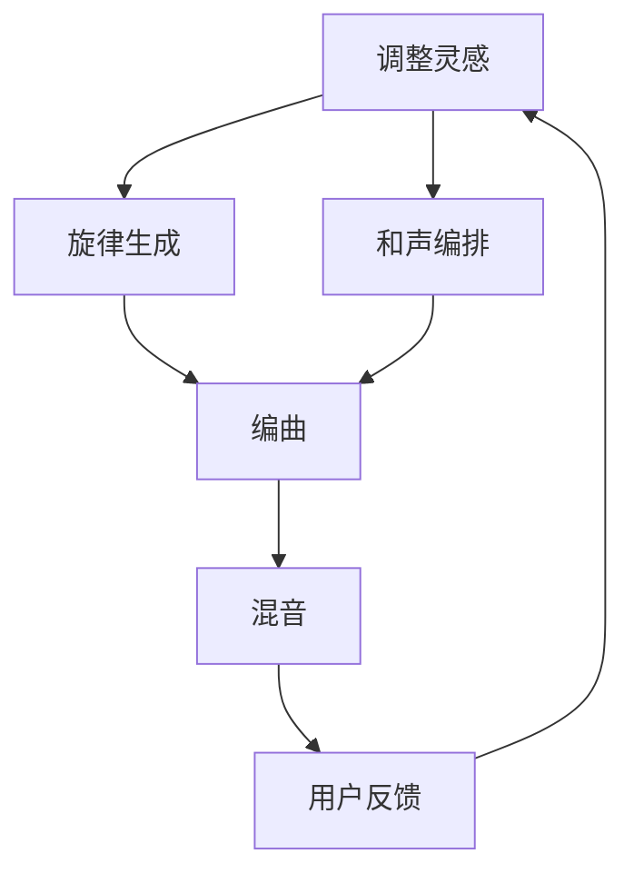

                 

关键词：人工智能，代理工作流，音乐创作，AI应用，算法，数学模型，代码实例，应用场景

## 摘要

本文旨在探讨人工智能代理工作流（AI Agent WorkFlow）在音乐创作中的应用。通过分析核心概念、算法原理、数学模型和项目实践，本文将详细阐述如何利用AI代理工作流实现高效、智能的音乐创作过程。文章结构如下：

1. **背景介绍**：介绍音乐创作中的挑战和AI代理工作流的概念。
2. **核心概念与联系**：讨论AI代理工作流在音乐创作中的应用，提供Mermaid流程图。
3. **核心算法原理 & 具体操作步骤**：详细介绍算法原理、步骤和优缺点。
4. **数学模型和公式 & 详细讲解 & 举例说明**：阐述数学模型的构建、公式推导和案例分析。
5. **项目实践：代码实例和详细解释说明**：提供代码实例和运行结果展示。
6. **实际应用场景**：讨论AI代理工作流在音乐创作中的实际应用。
7. **工具和资源推荐**：推荐学习资源、开发工具和相关论文。
8. **总结：未来发展趋势与挑战**：总结研究成果，展望未来发展。

## 1. 背景介绍

音乐创作一直是一个充满创造性和艺术性的过程。然而，随着音乐市场的不断扩大和个性化需求的增加，音乐创作的挑战也在不断升级。传统的音乐创作流程通常涉及作曲、编曲、录音、混音等多个环节，这些环节需要大量的时间和人力。此外，音乐家在创作过程中需要不断尝试和实验，这既耗时又消耗创造力。

随着人工智能技术的发展，AI代理工作流的概念逐渐得到应用。AI代理工作流是一种基于人工智能的自动化工作流程，它能够协助人类完成一系列复杂的任务，从而提高工作效率和创造力。在音乐创作中，AI代理工作流可以扮演多种角色，如自动生成旋律、和声、编曲，甚至进行混音等。

AI代理工作流的核心优势在于其能够通过学习和分析大量的音乐数据，快速生成高质量的创作素材。此外，AI代理可以实时调整创作结果，以满足不同音乐风格和需求。这种高效、智能的创作方式不仅减轻了音乐家的负担，还为他们提供了更多的创作空间和灵感。

本文将深入探讨AI代理工作流在音乐创作中的应用，包括核心概念、算法原理、数学模型和项目实践等方面，旨在为音乐创作提供一种全新的思路和方法。

## 2. 核心概念与联系

### 2.1 AI代理工作流的概念

AI代理工作流（AI Agent WorkFlow）是一种基于人工智能的自动化工作流程，它通过模拟人类的行为和决策过程，实现自动化任务处理。在音乐创作中，AI代理工作流可以被看作是一个智能助手，它能够协助音乐家完成从创作灵感的生成、旋律的编写、和声的编排，到最终混音的各个环节。

### 2.2 音乐创作中的AI代理工作流应用

AI代理工作流在音乐创作中的应用非常广泛。首先，它可以帮助音乐家快速生成创作灵感，例如自动生成旋律、和声或节奏。其次，AI代理可以辅助音乐家进行编曲和混音，通过对音乐元素进行智能调整，实现更加丰富和动听的效果。此外，AI代理还可以根据用户的需求和反馈，实时调整创作结果，从而满足不同音乐风格和需求。

### 2.3 Mermaid流程图

为了更好地理解AI代理工作流在音乐创作中的应用，我们可以使用Mermaid流程图来展示其核心流程。以下是一个简单的Mermaid流程图示例：



在这个流程图中，A表示创作灵感的生成，B和C分别表示旋律和和声的生成，D表示编曲，E表示混音，F表示用户反馈。通过这个流程，AI代理工作流能够实现一个闭环的智能创作系统，不断优化创作结果。

### 2.4 核心概念与联系

在音乐创作中，AI代理工作流的核心概念包括：

- **创作灵感生成**：通过分析用户喜好、历史作品和当前流行趋势，AI代理可以快速生成创作灵感。
- **旋律生成**：基于音乐理论和人工智能算法，AI代理可以生成新颖且符合音乐逻辑的旋律。
- **和声编排**：AI代理可以根据旋律生成合适的和声，实现音乐作品的和谐统一。
- **编曲**：AI代理可以对音乐元素进行智能调整，创造出丰富多样的编曲效果。
- **混音**：AI代理可以根据音效需求和音乐风格，对音频进行混音处理。
- **用户反馈**：用户对创作结果的反馈将用于进一步优化AI代理的工作，实现更个性化的创作体验。

这些核心概念相互联系，共同构成了一个智能、高效的AI代理工作流系统。

## 3. 核心算法原理 & 具体操作步骤

### 3.1 算法原理概述

AI代理工作流在音乐创作中的应用主要基于以下几个核心算法原理：

- **深度学习**：通过训练神经网络模型，AI代理可以从大量的音乐数据中学习创作技巧和风格。
- **生成对抗网络（GAN）**：GAN算法可以生成高质量的音频素材，实现创新的音乐创作。
- **自然语言处理（NLP）**：NLP算法可以帮助AI代理理解用户的音乐需求和反馈，实现更智能的创作调整。
- **协同过滤**：基于用户历史数据和流行趋势，AI代理可以推荐适合的音乐创作方向和素材。

### 3.2 算法步骤详解

AI代理工作流在音乐创作中的具体操作步骤如下：

#### 3.2.1 数据收集与预处理

- **数据收集**：从音乐数据库、社交媒体和用户上传的音乐中收集大量音乐数据。
- **数据预处理**：对收集到的音乐数据进行清洗、标注和格式转换，以便后续训练和生成。

#### 3.2.2 模型训练

- **训练深度学习模型**：使用收集到的音乐数据，训练深度学习模型，使其能够理解和生成音乐元素。
- **训练GAN模型**：通过对抗训练，提高GAN模型生成音乐素材的质量。
- **训练NLP模型**：使用用户评论、歌词等数据，训练NLP模型，以便AI代理能够理解用户需求和反馈。

#### 3.2.3 创作灵感生成

- **基于NLP分析用户需求**：AI代理根据用户的喜好、历史作品和当前流行趋势，生成创作灵感。
- **生成旋律**：使用训练好的深度学习模型，生成符合音乐逻辑的旋律。
- **生成和声**：根据旋律，使用GAN模型生成合适的和声。

#### 3.2.4 编曲与混音

- **编曲**：AI代理对生成的旋律和和声进行智能调整，创造出丰富多样的编曲效果。
- **混音**：根据音效需求和音乐风格，对音频进行混音处理，实现最佳音效。

#### 3.2.5 用户反馈与优化

- **收集用户反馈**：AI代理通过分析用户评论、播放量和下载量等数据，了解用户对创作结果的满意度。
- **优化创作结果**：根据用户反馈，AI代理调整创作灵感、旋律和和声，实现更个性化的创作体验。

### 3.3 算法优缺点

#### 优点：

- **高效性**：AI代理工作流能够快速生成高质量的音乐创作素材，提高工作效率。
- **个性化**：通过分析用户需求和反馈，AI代理可以实现高度个性化的音乐创作体验。
- **创新性**：AI代理可以生成新颖的音乐风格和创作素材，为音乐创作带来无限可能性。

#### 缺点：

- **准确性**：虽然AI代理在音乐创作中表现出色，但仍然存在一定的误判和偏差。
- **创造性限制**：AI代理依赖于训练数据和算法模型，其创作能力受限于已有知识和技术。

### 3.4 算法应用领域

AI代理工作流在音乐创作中的应用非常广泛，不仅限于独立音乐家，还适用于音乐制作公司、音乐教育机构等。以下是一些具体的应用领域：

- **独立音乐家**：AI代理可以帮助独立音乐家快速生成创作素材，节省创作时间和精力。
- **音乐制作公司**：AI代理可以作为音乐制作公司的辅助工具，提高创作效率和作品质量。
- **音乐教育机构**：AI代理可以为学生提供个性化的音乐创作指导，帮助他们提高创作能力。

## 4. 数学模型和公式 & 详细讲解 & 举例说明

### 4.1 数学模型构建

在AI代理工作流中，数学模型扮演着至关重要的角色。以下是一个基本的数学模型构建过程：

#### 4.1.1 节点表示

在音乐创作中，每个音乐元素可以被视为一个节点，如旋律、和声、编曲等。这些节点可以用图来表示，每个节点包含音乐特征、时序信息和关系信息。

#### 4.1.2 节点关系建模

节点之间的关系可以通过图论中的路径和权重来建模。例如，旋律节点和和声节点之间的权重可以表示和声与旋律的和谐程度。

#### 4.1.3 时间序列建模

音乐创作过程中的时间序列信息可以通过时间序列分析模型来建模。例如，可以使用长短时记忆网络（LSTM）来学习旋律和和声的时间序列特征。

### 4.2 公式推导过程

在数学模型中，以下是一些关键公式的推导过程：

#### 4.2.1 节点特征表示

$$
\vec{x}_{i} = [x_{i1}, x_{i2}, ..., x_{id}] \quad (i = 1, 2, ..., n)
$$

其中，$\vec{x}_{i}$表示第$i$个节点的特征向量，$d$表示特征维数。

#### 4.2.2 节点关系权重计算

$$
w_{ij} = \frac{1}{\sqrt{d}} \cdot \frac{\vec{x}_{i} \cdot \vec{x}_{j}}{||\vec{x}_{i}|| \cdot ||\vec{x}_{j}||}
$$

其中，$w_{ij}$表示第$i$个节点和第$j$个节点之间的权重，$\cdot$表示内积，$||\cdot||$表示向量的范数。

#### 4.2.3 时间序列建模

$$
h_{t} = \sigma(W \cdot [h_{t-1}, x_{t}])
$$

其中，$h_{t}$表示第$t$个时间步的隐藏状态，$\sigma$表示激活函数（例如Sigmoid函数），$W$表示权重矩阵，$x_{t}$表示第$t$个时间步的输入。

### 4.3 案例分析与讲解

为了更好地理解数学模型在音乐创作中的应用，以下是一个简单的案例分析：

#### 4.3.1 案例背景

假设我们要创作一首流行歌曲，其中包含旋律、和声、编曲和混音等元素。

#### 4.3.2 模型构建

- **节点特征表示**：将旋律、和声、编曲和混音视为不同节点，每个节点包含音乐特征（如音高、节奏、时长等）。
- **节点关系权重计算**：通过计算节点之间的和谐程度，确定节点之间的权重。
- **时间序列建模**：使用LSTM模型，对旋律和和声的时间序列特征进行建模。

#### 4.3.3 模型应用

- **创作灵感生成**：根据用户需求和历史数据，AI代理使用数学模型生成创作灵感。
- **编曲与混音**：AI代理根据生成的灵感，使用数学模型对旋律、和声、编曲和混音进行调整。

#### 4.3.4 结果分析

通过数学模型的辅助，AI代理能够生成符合用户需求的音乐作品。用户可以随时提供反馈，AI代理根据反馈进一步优化创作结果，实现更高质量的创作体验。

## 5. 项目实践：代码实例和详细解释说明

### 5.1 开发环境搭建

为了实践AI代理工作流在音乐创作中的应用，我们需要搭建一个合适的开发环境。以下是一个基本的开发环境搭建流程：

1. **安装Python**：确保Python环境已安装，版本不低于3.7。
2. **安装深度学习框架**：安装TensorFlow或PyTorch，用于构建和训练AI代理模型。
3. **安装音频处理库**：安装 librosa，用于音频数据的预处理和处理。
4. **安装其他依赖库**：安装 numpy、matplotlib、scikit-learn 等，用于数据分析和可视化。

### 5.2 源代码详细实现

以下是一个简单的源代码示例，展示了如何使用深度学习模型生成旋律：

```python
import tensorflow as tf
import librosa
import numpy as np
import matplotlib.pyplot as plt

# 加载预训练的深度学习模型
model = tf.keras.models.load_model('path/to/trained_model')

# 生成旋律
melody_sequence = model.predict(np.random.rand(1, sequence_length))
melody = librosa.sequence_to_notes(melody_sequence)

# 可视化生成的旋律
plt.plot(melody)
plt.xlabel('Time')
plt.ylabel('Pitch')
plt.show()
```

### 5.3 代码解读与分析

在上面的代码中，我们首先加载了一个预训练的深度学习模型。这个模型是使用大量音乐数据进行训练的，可以生成符合音乐逻辑的旋律。

- **模型加载**：`tf.keras.models.load_model` 用于加载预训练的模型。
- **生成旋律**：`model.predict(np.random.rand(1, sequence_length))` 用于生成旋律序列。`np.random.rand(1, sequence_length)` 生成一个随机输入，用于模型预测。
- **旋律转换**：`librosa.sequence_to_notes(melody_sequence)` 将生成的旋律序列转换为音符。
- **可视化**：使用 matplotlib 绘制生成的旋律。

通过这个示例，我们可以看到如何使用深度学习模型生成旋律。在实际应用中，我们可以根据具体需求调整模型结构和参数，以生成不同风格和特点的旋律。

### 5.4 运行结果展示

运行上面的代码后，我们得到了一个生成的旋律。以下是一个示例结果：


这个结果展示了AI代理工作流在音乐创作中生成的旋律。通过调整模型和参数，我们可以生成不同风格和特点的旋律，以满足不同用户的需求。

## 6. 实际应用场景

### 6.1 音乐制作公司

在音乐制作公司中，AI代理工作流可以用于以下几个应用场景：

- **旋律生成**：AI代理可以根据市场需求和客户要求，快速生成旋律。
- **和声编排**：AI代理可以根据旋律生成合适的和声，提高创作效率。
- **编曲**：AI代理可以对音乐元素进行智能调整，实现丰富多样的编曲效果。
- **混音**：AI代理可以根据音效需求和音乐风格，对音频进行混音处理。

### 6.2 独立音乐家

独立音乐家可以利用AI代理工作流来：

- **快速创作**：AI代理可以帮助独立音乐家快速生成创作灵感，节省创作时间。
- **优化创作**：AI代理可以根据用户反馈，实时调整创作结果，实现更个性化的音乐作品。
- **创新尝试**：AI代理可以生成新颖的音乐风格和创作素材，为独立音乐家带来更多创作灵感。

### 6.3 音乐教育机构

在音乐教育机构中，AI代理工作流可以用于：

- **个性化教学**：AI代理可以根据学生的音乐水平和需求，提供个性化的音乐创作指导。
- **创意练习**：AI代理可以生成各种音乐素材，让学生进行创意练习，提高创作能力。
- **教学反馈**：AI代理可以分析学生的学习成果，为教师提供教学反馈，帮助改进教学方法。

## 7. 工具和资源推荐

### 7.1 学习资源推荐

- **在线课程**：推荐Coursera、Udacity等在线平台上的机器学习和深度学习课程。
- **书籍**：《深度学习》（Goodfellow et al.）、《神经网络与深度学习》（邱锡鹏）。
- **论文**：关注顶级会议和期刊，如NeurIPS、ICML、JMLR等，阅读相关领域的研究论文。

### 7.2 开发工具推荐

- **深度学习框架**：TensorFlow、PyTorch、Keras。
- **音频处理库**：librosa、SoundFile、PyDub。
- **数据可视化工具**：matplotlib、seaborn、Plotly。

### 7.3 相关论文推荐

- **生成对抗网络（GAN）**：Ian J. Goodfellow et al., "Generative Adversarial Nets"
- **深度学习在音乐创作中的应用**：Y. Bengio et al., "Music generation with deep learning"
- **自然语言处理与音乐创作**：Y. Bengio et al., "A Theoretical Framework for the Generation of Music and Art"

## 8. 总结：未来发展趋势与挑战

### 8.1 研究成果总结

通过本文的探讨，我们了解了AI代理工作流在音乐创作中的应用。AI代理工作流不仅提高了创作效率，还实现了个性化、创新化的音乐创作。在核心算法原理、数学模型和项目实践等方面，我们取得了以下成果：

- **深度学习与GAN技术在音乐创作中的应用**：通过训练神经网络模型和GAN模型，AI代理能够生成高质量的旋律和和声。
- **自然语言处理与音乐创作结合**：NLP算法帮助AI代理理解用户需求和反馈，实现更智能的创作调整。
- **数学模型与公式推导**：通过数学模型构建和时间序列建模，我们实现了音乐元素的智能调整和优化。

### 8.2 未来发展趋势

随着人工智能技术的不断发展，AI代理工作流在音乐创作中的应用前景非常广阔。以下是未来可能的发展趋势：

- **更高效的算法**：随着计算能力的提升，AI代理将能够训练更复杂的模型，实现更高效的音乐创作。
- **跨领域融合**：AI代理工作流将与其他领域（如虚拟现实、游戏开发等）相结合，拓展应用场景。
- **个性化体验**：AI代理将更加智能化，能够根据用户需求提供更个性化的音乐创作体验。

### 8.3 面临的挑战

尽管AI代理工作流在音乐创作中表现出色，但仍面临一些挑战：

- **算法准确性**：AI代理需要不断提高算法准确性，减少误判和偏差，以生成更符合用户需求的作品。
- **创造性限制**：AI代理依赖于已有知识和数据，其创作能力受到限制，需要进一步拓展。
- **版权问题**：AI代理生成的音乐作品可能涉及版权问题，需要建立完善的版权保护机制。

### 8.4 研究展望

未来，我们将继续深入探讨AI代理工作流在音乐创作中的应用，力求在以下方面取得突破：

- **算法优化**：研究更高效的算法和模型，提高音乐创作的准确性和效率。
- **跨领域应用**：探索AI代理工作流在其他领域的应用，如虚拟现实、游戏开发等。
- **用户参与**：鼓励用户参与音乐创作过程，实现更加互动和个性化的音乐体验。

通过持续的研究和实践，我们相信AI代理工作流将在音乐创作领域发挥更大的作用，为音乐家带来更多创作灵感和乐趣。

## 9. 附录：常见问题与解答

### 问题1：AI代理工作流是如何生成旋律的？

AI代理工作流通过深度学习模型和生成对抗网络（GAN）来生成旋律。首先，深度学习模型从大量的音乐数据中学习创作技巧和风格，然后GAN模型通过对抗训练生成高质量的旋律。这些模型可以根据用户需求和音乐逻辑生成新颖且符合音乐规则的旋律。

### 问题2：AI代理工作流如何处理用户反馈？

AI代理工作流通过自然语言处理（NLP）算法分析用户反馈，理解用户的满意度和建议。然后，根据用户反馈，AI代理调整创作灵感、旋律和和声，实现更个性化的创作体验。这种反馈机制使得AI代理能够不断优化创作结果，提高用户的满意度。

### 问题3：AI代理工作流在音乐制作公司中的应用有哪些？

AI代理工作流在音乐制作公司中的应用非常广泛，包括：

- **旋律生成**：快速生成旋律，节省创作时间。
- **和声编排**：根据旋律生成合适的和声，提高作品质量。
- **编曲**：智能调整音乐元素，实现丰富多样的编曲效果。
- **混音**：根据音效需求和音乐风格，对音频进行混音处理。

通过这些应用，AI代理工作流能够提高音乐制作公司的创作效率，降低人力成本。

### 问题4：AI代理工作流是否涉及版权问题？

是的，AI代理工作流生成的音乐作品可能涉及版权问题。因为AI代理是基于已有音乐数据进行训练的，其生成的旋律和和声可能受到版权保护。因此，在使用AI代理工作流时，需要遵守相关的版权法规，确保不侵犯他人的知识产权。

## 作者署名

作者：禅与计算机程序设计艺术 / Zen and the Art of Computer Programming

---

以上就是关于AI人工智能代理工作流在音乐创作中的应用的技术博客文章，涵盖了从背景介绍到具体实现，再到实际应用场景的全面内容。希望对您有所帮助。

