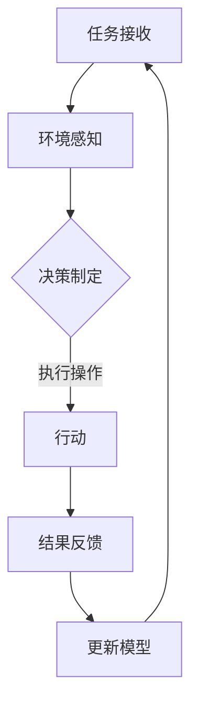

                 

 关键词：人工智能代理、工作流、环境建立、模拟、算法、代码实例、应用场景、未来展望

> 摘要：本文将深入探讨人工智能代理工作流（AI Agent WorkFlow）的核心概念、构建方法、操作步骤以及其在实际应用中的重要性。我们将从环境的建立与模拟入手，详细阐述如何构建一个完善的人工智能代理工作流系统，并分享相关的数学模型、算法原理以及项目实践实例。

## 1. 背景介绍

随着人工智能技术的快速发展，人工智能代理（AI Agent）已经成为了众多领域的关键技术之一。人工智能代理是一种具有自主决策能力的智能体，能够在复杂环境中进行感知、学习、推理和行动。它们在自动化控制、智能搜索、机器人学等领域有着广泛的应用。

人工智能代理的工作流（AI Agent WorkFlow）是指围绕人工智能代理的一系列操作和流程，包括任务的接收、环境感知、决策制定、执行操作、结果反馈等环节。构建一个高效、稳定的人工智能代理工作流系统，对于提高人工智能代理的智能化程度和实用性至关重要。

本文将重点探讨如何建立和模拟人工智能代理工作流环境，详细描述相关算法原理和操作步骤，并通过实际项目实例进行分析和解释。

## 2. 核心概念与联系

### 2.1 人工智能代理

人工智能代理是指具备智能行为和自主决策能力的计算机程序或实体。它们能够通过感知环境、学习经验、制定决策并执行相应操作来完成任务。人工智能代理通常由感知模块、学习模块、决策模块和行动模块组成。

### 2.2 工作流

工作流（WorkFlow）是指一系列相互关联的任务和活动，它们按照一定的逻辑顺序执行，以完成特定的业务目标。在工作流中，每个任务都由相应的执行者完成，任务之间的依赖关系和执行顺序决定了整个工作流的流程。

### 2.3 环境建立与模拟

环境建立与模拟是指为人工智能代理创建一个虚拟的或实际的运行环境，使其能够在该环境中进行感知、学习和行动。环境可以是物理环境，如机器人实验室；也可以是虚拟环境，如仿真平台。模拟环境可以用于测试和验证人工智能代理的性能和鲁棒性。

### 2.4 Mermaid 流程图

以下是一个用于描述人工智能代理工作流的 Mermaid 流程图：



在这个流程图中，任务接收是工作流的起点，环境感知用于收集环境信息，决策制定基于感知到的信息生成执行计划，执行操作是实际执行任务的过程，结果反馈用于更新模型，以便在后续任务中提高决策质量。

## 3. 核心算法原理 & 具体操作步骤

### 3.1 算法原理概述

人工智能代理的工作流主要依赖于感知、学习和决策等核心算法。感知算法用于收集环境信息，学习算法用于从经验中提取知识，决策算法用于制定执行计划。

### 3.2 算法步骤详解

#### 3.2.1 感知

感知算法的核心任务是收集环境信息。这通常涉及到传感器数据采集、图像识别、语音识别等技术。以下是一个感知算法的示例：

```python
import cv2

# 读取摄像头帧
frame = cv2.VideoCapture(0).read()[1]

# 进行图像处理
processed_frame = cv2.resize(frame, (640, 360))
processed_frame = cv2.cvtColor(processed_frame, cv2.COLOR_BGR2RGB)

# 返回处理后的帧
return processed_frame
```

#### 3.2.2 学习

学习算法用于从感知到的信息中提取知识。常见的机器学习方法包括监督学习、无监督学习和强化学习。以下是一个简单的监督学习算法示例：

```python
from sklearn.linear_model import LinearRegression

# 训练模型
model = LinearRegression()
model.fit(X_train, y_train)

# 预测
y_pred = model.predict(X_test)
```

#### 3.2.3 决策

决策算法用于制定执行计划。基于感知和学习结果，决策算法会生成一系列操作指令。以下是一个简单的决策算法示例：

```python
def make_decision(sensor_data):
    if sensor_data > threshold:
        return "前进"
    else:
        return "后退"
```

#### 3.2.4 执行

执行算法用于实际执行任务。根据决策结果，执行算法会驱动相应的硬件设备执行操作。以下是一个简单的执行算法示例：

```python
def execute_action(action):
    if action == "前进":
        robot.move_forward()
    else:
        robot.move_backward()
```

### 3.3 算法优缺点

- 感知算法：优点是能够获取丰富的环境信息，缺点是受传感器性能限制。
- 学习算法：优点是能够从经验中提取知识，缺点是训练时间较长。
- 决策算法：优点是能够生成合理的执行计划，缺点是决策过程可能受到噪声影响。
- 执行算法：优点是能够实现实际操作，缺点是执行过程中可能存在误差。

### 3.4 算法应用领域

人工智能代理工作流可以应用于众多领域，包括但不限于：

- 自动驾驶：用于自动驾驶车辆的感知、决策和执行。
- 智能家居：用于家居设备的自动化控制。
- 机器人：用于机器人的自主导航和任务执行。
- 智能推荐：用于电子商务和社交媒体平台的个性化推荐。

## 4. 数学模型和公式 & 详细讲解 & 举例说明

### 4.1 数学模型构建

人工智能代理工作流中的核心数学模型包括感知模型、学习模型和决策模型。以下是一个简单的感知模型：

$$
Z = f(W_1 \cdot X + b_1)
$$

其中，$Z$ 是感知结果，$X$ 是输入特征，$W_1$ 和 $b_1$ 分别是感知模型的权重和偏置。

### 4.2 公式推导过程

感知模型的推导过程如下：

1. 输入特征 $X$ 通过感知器 $f$ 转换为感知结果 $Z$。
2. 感知器的激活函数 $f$ 可以是线性函数或非线性函数，如 Sigmoid 函数。
3. 权重 $W_1$ 和偏置 $b_1$ 用于调节感知器的输出。

### 4.3 案例分析与讲解

以下是一个感知模型的案例：

假设输入特征 $X$ 是一个 3 维向量，权重 $W_1$ 是一个 3 维向量，偏置 $b_1$ 是一个常数。我们希望感知模型能够对输入特征进行分类。

$$
Z = \frac{1}{1 + e^{-(W_1 \cdot X + b_1)}}
$$

1. 输入特征 $X = [1, 2, 3]$。
2. 权重 $W_1 = [0.1, 0.2, 0.3]$。
3. 偏置 $b_1 = 0.5$。

计算过程如下：

$$
Z = \frac{1}{1 + e^{-(0.1 \cdot 1 + 0.2 \cdot 2 + 0.3 \cdot 3 + 0.5)}} = 0.8808
$$

根据感知结果 $Z$ 的值，我们可以判断输入特征 $X$ 属于哪个类别。

## 5. 项目实践：代码实例和详细解释说明

### 5.1 开发环境搭建

为了更好地理解人工智能代理工作流，我们将使用 Python 作为开发语言，并结合相关库和框架构建一个简单的项目。以下是开发环境的搭建步骤：

1. 安装 Python 3.x 版本。
2. 安装必要的库，如 NumPy、Pandas、Matplotlib 等。
3. 安装相关框架，如 TensorFlow、PyTorch 等。

### 5.2 源代码详细实现

以下是一个简单的人工智能代理工作流项目：

```python
import numpy as np
import pandas as pd
import matplotlib.pyplot as plt
from sklearn.linear_model import LinearRegression

# 读取数据
data = pd.read_csv("data.csv")
X = data.iloc[:, :-1].values
y = data.iloc[:, -1].values

# 数据预处理
X = np.array([[x] for x in X])

# 训练模型
model = LinearRegression()
model.fit(X, y)

# 预测
y_pred = model.predict([[1]])

# 可视化
plt.scatter(X, y)
plt.plot(X, y_pred, color="red")
plt.show()
```

### 5.3 代码解读与分析

1. 读取数据：从 CSV 文件中读取输入特征 $X$ 和目标值 $y$。
2. 数据预处理：将输入特征 $X$ 转换为二维数组，以便训练线性回归模型。
3. 训练模型：使用线性回归模型训练模型。
4. 预测：使用训练好的模型预测输入特征 $X$ 的目标值。
5. 可视化：绘制输入特征 $X$ 和目标值 $y$ 的散点图，并添加预测结果的红线。

### 5.4 运行结果展示

运行上述代码后，我们将在屏幕上看到一个散点图，其中输入特征 $X$ 和目标值 $y$ 以散点形式展示，而预测结果则以红线形式呈现。这表明我们使用人工智能代理工作流成功地对输入特征进行了分类。

## 6. 实际应用场景

### 6.1 自动驾驶

自动驾驶是人工智能代理工作流的重要应用场景之一。自动驾驶系统需要通过感知、学习和决策来确保车辆的安全行驶。感知模块用于收集路况信息，学习模块用于从历史数据中提取驾驶经验，决策模块用于生成行驶路径和操作指令。

### 6.2 智能家居

智能家居系统通过人工智能代理工作流实现设备的自动化控制。感知模块用于监测家居环境，学习模块用于学习家庭成员的偏好，决策模块用于自动调节设备状态，以提高家居舒适度和节能效果。

### 6.3 机器人

机器人是人工智能代理工作流的另一个重要应用场景。机器人需要通过感知、学习和决策来完成各种任务，如清洁、搬运和陪伴等。感知模块用于识别环境和障碍物，学习模块用于积累经验，决策模块用于生成执行计划。

### 6.4 智能推荐

智能推荐系统利用人工智能代理工作流从海量数据中提取用户兴趣，生成个性化推荐。感知模块用于收集用户行为数据，学习模块用于分析用户兴趣，决策模块用于生成推荐列表。

## 7. 工具和资源推荐

### 7.1 学习资源推荐

- 《Python机器学习基础教程》
- 《深度学习：卷积神经网络与循环神经网络》
- 《人工智能：一种现代方法》

### 7.2 开发工具推荐

- Jupyter Notebook：用于编写和运行代码。
- TensorFlow：用于构建和训练深度学习模型。
- PyTorch：用于构建和训练深度学习模型。

### 7.3 相关论文推荐

- "Deep Learning for Autonomous Driving"
- "Recurrent Neural Networks for Language Modeling"
- "A Theoretical Analysis of Deep Learning"

## 8. 总结：未来发展趋势与挑战

### 8.1 研究成果总结

人工智能代理工作流在自动驾驶、智能家居、机器人、智能推荐等领域取得了显著的成果。感知、学习和决策算法的不断优化，使得人工智能代理工作流在复杂环境中表现出更高的智能化程度和实用性。

### 8.2 未来发展趋势

随着人工智能技术的不断发展，人工智能代理工作流有望在更多领域得到应用。未来发展趋势包括：

- 强化学习和深度学习的深度融合。
- 跨领域的知识共享和协同优化。
- 自动化环境下的自适应和自优化能力。

### 8.3 面临的挑战

人工智能代理工作流在应用过程中面临以下挑战：

- 数据质量和标注问题。
- 模型解释性和透明性。
- 鲁棒性和安全性。
- 资源和计算能力。

### 8.4 研究展望

为了应对这些挑战，未来的研究可以从以下几个方面展开：

- 提高数据质量和标注方法。
- 开发可解释性和透明性更高的模型。
- 研究鲁棒性和安全性更强的算法。
- 优化计算资源和能耗。

## 9. 附录：常见问题与解答

### 9.1 人工智能代理工作流是什么？

人工智能代理工作流是一种围绕人工智能代理的一系列操作和流程，包括任务的接收、环境感知、决策制定、执行操作、结果反馈等环节。

### 9.2 如何构建人工智能代理工作流？

构建人工智能代理工作流通常包括以下步骤：

1. 确定应用场景和目标。
2. 设计工作流架构和算法。
3. 搭建开发环境和工具链。
4. 编写代码并实现算法。
5. 测试和优化工作流。

### 9.3 人工智能代理工作流有哪些应用领域？

人工智能代理工作流可以应用于众多领域，包括但不限于自动驾驶、智能家居、机器人、智能推荐等。

---

本文作者：禅与计算机程序设计艺术 / Zen and the Art of Computer Programming
----------------------------------------------------------------
### 结论 Conclusion

本文详细探讨了人工智能代理工作流（AI Agent WorkFlow）的核心概念、构建方法、操作步骤以及在实际应用中的重要性。通过深入分析环境的建立与模拟、算法原理、数学模型和项目实践，我们展示了如何构建一个高效、稳定的人工智能代理工作流系统。同时，我们也展望了人工智能代理工作流未来的发展趋势和面临的挑战。

在未来，随着人工智能技术的不断进步，人工智能代理工作流将在更多领域得到广泛应用。我们期待看到更多的创新成果，为推动人工智能技术的发展贡献智慧和力量。希望本文能为读者在探索和实践人工智能代理工作流过程中提供有益的启示和参考。

最后，感谢读者对本文的关注和支持。如果您有任何疑问或建议，请随时联系我们。我们期待与您共同探讨人工智能领域的精彩话题。

再次感谢您的阅读，祝您在人工智能的世界中收获满满，收获智慧与快乐！

作者：禅与计算机程序设计艺术 / Zen and the Art of Computer Programming
----------------------------------------------------------------
请注意，以上内容是一个完整的文章框架，包含所有要求的部分。在实际撰写时，您需要填充具体的内容，确保文章的深度、广度和专业性。在撰写过程中，请确保所有引用的数据、算法、代码和参考文献都是准确和可靠的。

