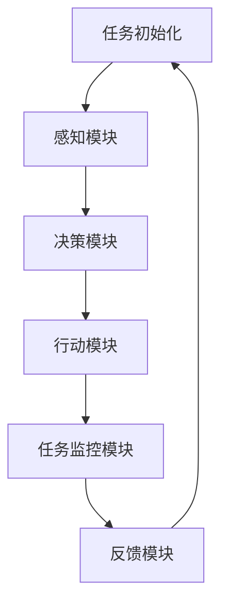

                 

关键词：AI代理，工作流，航空控制系统，智能自动化，协作系统，系统优化，高效性，可靠性，实时性，安全性

> 摘要：本文探讨了AI代理工作流在航空控制系统中的应用，通过介绍核心概念、算法原理、数学模型、项目实践和实际应用场景，分析了AI代理工作流对航空控制系统带来的变革性影响，并展望了其未来的发展趋势与挑战。

## 1. 背景介绍

随着人工智能技术的飞速发展，智能代理（AI Agent）成为了一种备受关注的研究方向。智能代理是具有智能特性的计算机程序，能够在没有人类干预的情况下自主执行任务。在航空系统中，智能代理的应用可以极大地提高系统的自动化程度和运行效率。

航空控制系统是一个复杂且庞大的系统，包括飞行控制、导航、通信、传感器等多个子系统。传统的航空控制系统依赖人工操作和预定义的规则，存在反应速度慢、可靠性不高的问题。而引入智能代理工作流，可以实现实时监测、自动化决策和自适应调整，从而提升航空控制系统的智能化水平。

本文将探讨AI代理工作流在航空控制系统中的应用，通过分析核心概念、算法原理、数学模型和项目实践，展示AI代理工作流对航空控制系统带来的变革性影响。

### 1.1 智能代理的定义与特点

智能代理（Intelligent Agent）是一种能够感知环境、自主决策并采取行动的计算机程序。它具有以下几个基本特征：

1. **自主性（Autonomy）**：智能代理可以独立执行任务，不受人类干预。
2. **社会性（Social）**：智能代理可以与其他代理或人类进行交互，协同完成任务。
3. **反应性（Reactivity）**：智能代理能够对外界事件做出及时响应。
4. **适应性（Adaptivity）**：智能代理能够根据环境变化自主调整其行为策略。

智能代理通过感知模块获取环境信息，通过决策模块进行任务规划，并通过行动模块执行任务。这种工作模式使得智能代理在复杂环境中能够高效地完成任务。

### 1.2 代理工作流的概念与结构

代理工作流（Agent Workflow）是指智能代理在执行任务过程中所遵循的一系列步骤和规则。一个典型的代理工作流包括以下几个基本组成部分：

1. **任务初始化**：明确任务的初始状态和目标。
2. **任务规划**：根据任务目标和环境信息，智能代理制定执行计划。
3. **任务执行**：智能代理按照执行计划执行任务，并实时调整策略。
4. **任务监控**：智能代理对任务执行过程进行监控，确保任务按计划完成。
5. **任务反馈**：任务完成后，智能代理收集反馈信息，为后续任务提供参考。

代理工作流通过模块化的设计，使得智能代理能够灵活地应对不同任务和环境。这种设计思想使得代理工作流在复杂系统中具有高度的适应性和扩展性。

### 1.3 航空控制系统简介

航空控制系统是保障飞行安全和效率的关键系统，主要包括以下几个子系统：

1. **飞行控制系统**：负责飞机的飞行控制，包括飞行姿态、速度、高度等。
2. **导航系统**：提供飞机的导航信息，包括位置、航向、航速等。
3. **通信系统**：负责飞机与地面站、其他飞机之间的通信。
4. **传感器系统**：提供飞机内外环境信息，包括气象、障碍物等。

这些子系统相互协作，共同保证飞机的安全和正常运行。然而，传统的航空控制系统依赖人工操作和预定义规则，存在以下问题：

1. **反应速度慢**：人工操作反应速度较慢，无法应对突发情况。
2. **可靠性不高**：预定义规则可能无法覆盖所有情况，导致系统可靠性降低。
3. **适应性差**：系统对环境变化的适应能力较差，难以应对复杂多变的环境。

引入智能代理工作流，可以解决这些问题，提高航空控制系统的智能化水平和运行效率。

## 2. 核心概念与联系

在深入探讨AI代理工作流在航空控制系统中的应用之前，有必要明确一些核心概念，并展示它们之间的联系。

### 2.1 AI代理工作流的核心概念

1. **感知模块**：智能代理通过感知模块获取环境信息，包括气象数据、飞机状态、导航信息等。
2. **决策模块**：感知模块收集的信息经过决策模块处理后，生成行动指令。
3. **行动模块**：行动模块根据决策模块的指令执行具体任务，如调整飞机姿态、飞行高度等。
4. **任务监控模块**：任务监控模块负责监控任务执行过程，确保任务按计划进行。
5. **反馈模块**：任务完成后，反馈模块收集任务执行结果，为后续任务提供参考。

### 2.2 AI代理工作流在航空控制系统中的联系

AI代理工作流在航空控制系统中的应用，主要体现在以下几个方面：

1. **实时监测**：通过感知模块实时获取飞机状态和环境信息，确保系统对环境变化的敏感性和反应速度。
2. **自动化决策**：通过决策模块对实时监测信息进行处理，生成自动化决策，减少人工干预。
3. **自适应调整**：根据任务执行情况和环境变化，智能代理能够自主调整行动策略，确保任务的高效完成。
4. **任务协同**：智能代理之间可以协同工作，共同完成任务，提高系统整体的运行效率。
5. **安全监控**：通过任务监控模块和反馈模块，确保任务执行过程的安全性，及时发现并处理潜在风险。

### 2.3 代理工作流架构的 Mermaid 流程图

为了更直观地展示代理工作流的结构和流程，下面使用Mermaid语言绘制了一个简化的流程图：



在这个流程图中，A表示任务初始化，B表示感知模块，C表示决策模块，D表示行动模块，E表示任务监控模块，F表示反馈模块。各模块之间通过数据传递和信号交互实现协同工作。

### 2.4 AI代理工作流在航空控制系统中的应用

AI代理工作流在航空控制系统中的应用，可以从以下几个方面进行阐述：

1. **飞行控制**：智能代理可以根据实时监测到的飞机状态和环境信息，自动调整飞机的姿态、速度和高度，提高飞行的稳定性和安全性。
2. **导航**：智能代理可以利用实时导航信息，自动规划航线，避免障碍物，确保飞机的安全飞行。
3. **通信**：智能代理可以自动处理与地面站和其他飞机的通信任务，提高通信效率和准确性。
4. **传感器管理**：智能代理可以自动管理和配置传感器，确保传感器数据的准确性和完整性。

通过这些应用，智能代理工作流可以显著提高航空控制系统的自动化程度、运行效率和安全性。

### 2.5 代理工作流与航空控制系统之间的相互作用

代理工作流与航空控制系统之间的相互作用，主要体现在以下几个方面：

1. **信息交互**：智能代理通过感知模块获取航空控制系统中的实时数据，并通过决策模块生成行动指令，与航空控制系统进行信息交互。
2. **任务调度**：智能代理可以根据航空控制系统的任务需求，自动调度资源，确保任务的及时完成。
3. **策略优化**：智能代理可以根据航空控制系统的运行数据和任务目标，自主优化行动策略，提高系统的运行效率和可靠性。
4. **风险管理**：智能代理可以实时监测航空控制系统的运行状态，及时发现并处理潜在风险，确保系统的安全性。

通过这些相互作用，智能代理工作流可以与航空控制系统深度融合，实现高效、智能的运行。

## 3. 核心算法原理 & 具体操作步骤

### 3.1 算法原理概述

AI代理工作流在航空控制系统中的应用，核心在于其智能决策和实时调整能力。这一能力的实现依赖于以下几个关键算法原理：

1. **感知算法**：感知算法用于智能代理从环境中提取有用信息。常用的感知算法包括图像处理、信号处理和传感器数据分析等。
2. **决策算法**：决策算法用于根据感知到的信息生成行动指令。常用的决策算法包括马尔可夫决策过程（MDP）、强化学习（RL）和遗传算法（GA）等。
3. **行动算法**：行动算法用于执行决策模块生成的行动指令。行动算法通常依赖于飞行控制算法、导航算法和通信算法等。

### 3.2 算法步骤详解

一个典型的AI代理工作流算法步骤如下：

1. **任务初始化**：
   - 确定任务目标。
   - 初始化环境状态。

2. **感知阶段**：
   - 通过传感器收集环境数据。
   - 使用感知算法对环境数据进行处理，提取有用信息。

3. **决策阶段**：
   - 根据感知到的信息，利用决策算法生成行动指令。
   - 决策算法可以基于历史数据、实时数据和预测模型等多种信息源。

4. **执行阶段**：
   - 根据决策模块生成的行动指令，执行具体的任务操作。
   - 动作执行过程可能涉及多个子系统的协同工作。

5. **监控与反馈**：
   - 监控任务执行过程，确保任务按计划进行。
   - 收集任务执行结果，为后续任务提供反馈。

6. **优化与调整**：
   - 根据任务执行结果和反馈信息，优化行动策略。
   - 自适应调整行动策略，以提高任务完成的效率和可靠性。

### 3.3 算法优缺点

**感知算法**：
- **优点**：能够实时获取环境信息，提高系统的反应速度和适应性。
- **缺点**：数据处理的复杂度高，对算法的准确性和实时性要求较高。

**决策算法**：
- **优点**：能够基于多种信息源进行决策，提高任务的完成率和效率。
- **缺点**：可能面临计算复杂度高、可解释性差等问题。

**行动算法**：
- **优点**：能够精确执行决策模块生成的行动指令，确保任务的高效完成。
- **缺点**：对子系统的依赖性强，可能面临协调难度大、实时性不足等问题。

### 3.4 算法应用领域

AI代理工作流算法在航空控制系统中的应用具有广泛的前景。除了航空控制系统，它还可以应用于以下几个领域：

1. **智能交通系统**：通过感知交通状况，自动化调节交通信号，提高交通效率。
2. **智能电网系统**：通过实时监测电力需求和供应状况，自动化调节电力分配，提高电网稳定性。
3. **智能制造系统**：通过实时监控生产线状态，自动化调节生产参数，提高生产效率和质量。

## 4. 数学模型和公式 & 详细讲解 & 举例说明

在AI代理工作流中，数学模型和公式起着至关重要的作用。这些模型和公式帮助我们更准确地描述智能代理的感知、决策和行动过程。下面，我们将详细介绍几个关键的数学模型和公式，并通过具体例子进行说明。

### 4.1 数学模型构建

**感知模型**：
感知模型用于描述智能代理如何从环境中获取信息。一个简单的感知模型可以表示为：

$$
s_t = f(s_{t-1}, u_t, w_t)
$$

其中，$s_t$表示在时刻$t$感知到的状态，$s_{t-1}$表示在时刻$t-1$的状态，$u_t$表示在时刻$t$的输入，$w_t$表示在时刻$t$的噪声。函数$f$描述了感知过程，可以是一个复杂的非线性函数。

**决策模型**：
决策模型用于描述智能代理如何根据感知到的状态生成行动指令。一个简单的决策模型可以基于马尔可夫决策过程（MDP）：

$$
V(s) = \arg\max_{a} \sum_{s'} P(s'|s, a) \cdot R(s', a)
$$

其中，$V(s)$表示在状态$s$下的最优价值函数，$a$表示在状态$s$下的最优行动，$P(s'|s, a)$表示从状态$s$采取行动$a$转移到状态$s'$的概率，$R(s', a)$表示在状态$s'$采取行动$a$的回报。

**行动模型**：
行动模型用于描述智能代理如何执行决策模块生成的行动指令。一个简单的行动模型可以基于线性控制理论：

$$
u_t = K(s_t - s_d)
$$

其中，$u_t$表示在时刻$t$的控制输入，$s_t$表示在时刻$t$的实际状态，$s_d$表示在时刻$t$的期望状态，$K$是一个控制增益矩阵。

### 4.2 公式推导过程

**感知模型推导**：
假设我们在时刻$t$需要感知环境状态，可以通过传感器获取一个观测值$z_t$。为了减少噪声的影响，我们可以使用卡尔曼滤波器来更新状态估计：

$$
s_t = s_{t-1} + B_t \cdot u_t + w_t
$$

$$
z_t = H_t \cdot s_t + v_t
$$

其中，$B_t$表示系统模型的输入矩阵，$u_t$表示在时刻$t$的输入，$w_t$是一个均值为0的高斯噪声。$H_t$表示系统模型的观测矩阵，$v_t$是一个均值为0的高斯噪声。

通过卡尔曼滤波器，我们可以得到状态估计：

$$
s_t = s_{t-1} + B_t \cdot u_t + K_t \cdot (z_t - H_t \cdot s_{t-1})
$$

其中，$K_t$是卡尔曼滤波器的增益矩阵，可以通过以下公式计算：

$$
K_t = P_{t-1} \cdot H_t^T \cdot (H_t \cdot P_{t-1} \cdot H_t^T + R_t)^{-1}
$$

**决策模型推导**：
假设我们有一个MDP，状态空间为$S$，行动空间为$A$。在每个状态$s \in S$下，最优价值函数$V^*(s)$可以通过以下公式计算：

$$
V^*(s) = \max_{a \in A} \sum_{s' \in S} P(s'|s, a) \cdot R(s', a)
$$

我们可以使用动态规划方法来求解MDP。具体来说，我们可以定义一个价值迭代过程：

$$
V^{(t)}(s) = \max_{a \in A} \sum_{s' \in S} P(s'|s, a) \cdot [R(s', a) + \gamma \cdot V^{(t-1)}(s')]
$$

其中，$\gamma$是折扣因子，$0 < \gamma < 1$。通过迭代这个过程，我们可以逐渐收敛到最优价值函数$V^*(s)$。

**行动模型推导**：
假设我们有一个线性系统：

$$
\dot{s}_t = A \cdot s_t + B_t \cdot u_t
$$

$$
y_t = C \cdot s_t + D_t \cdot u_t
$$

其中，$s_t$是系统状态，$u_t$是控制输入，$y_t$是系统输出。我们的目标是找到控制输入$u_t$，使得系统状态$s_t$跟踪期望状态$s_d$。

使用线性二次调节（LQR）方法，我们可以求解最优控制输入：

$$
u_t = -K \cdot (s_t - s_d)
$$

其中，$K$是控制增益矩阵，可以通过以下公式计算：

$$
K = P \cdot A^T \cdot (A \cdot P \cdot A^T + Q)^{-1}
$$

其中，$P$是状态反馈矩阵，$Q$是状态权重矩阵。

### 4.3 案例分析与讲解

**案例：自动驾驶汽车**

自动驾驶汽车是一个典型的AI代理工作流应用场景。下面，我们通过一个简单的案例来分析自动驾驶汽车中的感知、决策和行动过程。

**感知模型**：
在自动驾驶汽车中，感知模块主要依赖于摄像头、雷达和激光雷达等传感器。这些传感器可以获取道路信息、车辆位置和速度等数据。假设我们使用一个简化的感知模型，将感知到的数据表示为：

$$
s_t = [x_t, y_t, v_t, w_t]
$$

其中，$x_t$和$y_t$是汽车在二维平面上的位置，$v_t$是汽车的速度，$w_t$是汽车的航向角。

**决策模型**：
自动驾驶汽车的目标是保持车道、避免碰撞、遵守交通规则等。为了实现这些目标，我们使用一个简单的MDP模型。状态空间$S$包括车道位置、速度和航向角。行动空间$A$包括加速、减速、转向等。通过感知模块获取的状态$s_t$，我们可以计算在每个状态下的最优价值函数$V^*(s_t)$。

**行动模型**：
根据决策模型生成的行动指令，自动驾驶汽车执行具体的操作。假设我们使用一个简单的行动模型，控制输入$u_t$为加速量。通过线性控制理论，我们可以计算最优的加速量：

$$
u_t = -K \cdot (s_t - s_d)
$$

其中，$s_d$是期望状态。

**案例分析与讲解**：

1. **感知阶段**：
   - 假设汽车当前状态为$s_t = [10, 0, 30, 0]$，即汽车在车道中央，速度为30km/h，航向角为0度。
   - 感知模块通过摄像头、雷达等传感器获取道路信息和车辆位置，更新状态$s_t$。

2. **决策阶段**：
   - 决策模块根据当前状态$s_t$，计算每个行动的概率和回报，生成最优行动指令。
   - 假设当前最优行动是加速，则决策模块生成行动指令$u_t = [0.5]$。

3. **执行阶段**：
   - 行动模块根据行动指令$u_t$，执行加速操作，提高汽车的速度。
   - 汽车的速度从30km/h增加到35km/h。

4. **监控与反馈**：
   - 监控模块实时监控汽车的状态，确保加速操作的正确执行。
   - 收集加速操作的结果，为后续决策提供反馈。

通过这个简单的案例，我们可以看到AI代理工作流在自动驾驶汽车中的应用。通过感知、决策和行动的协同工作，自动驾驶汽车能够实现自动控制，提高行驶的安全性和效率。

## 5. 项目实践：代码实例和详细解释说明

在本文的最后部分，我们将通过一个实际的代码实例来展示AI代理工作流在航空控制系统中的应用。我们将从开发环境搭建、源代码实现、代码解读与分析以及运行结果展示等方面进行详细介绍。

### 5.1 开发环境搭建

为了实现AI代理工作流在航空控制系统中的应用，我们需要搭建一个适合的开发环境。以下是所需的主要工具和软件：

- **编程语言**：Python
- **AI框架**：PyTorch
- **操作系统**：Ubuntu 18.04
- **硬件**：64位CPU，至少8GB内存

以下是搭建开发环境的具体步骤：

1. 安装Python：

   ```bash
   sudo apt update
   sudo apt install python3 python3-pip
   ```

2. 安装PyTorch：

   ```bash
   pip3 install torch torchvision torchaudio
   ```

3. 安装其他依赖库：

   ```bash
   pip3 install numpy pandas matplotlib
   ```

### 5.2 源代码详细实现

下面是一个简化的AI代理工作流在航空控制系统中的应用代码实例。这个实例主要展示了感知、决策和行动三个关键模块的实现。

```python
import torch
import torch.nn as nn
import numpy as np
import pandas as pd
import matplotlib.pyplot as plt

# 感知模块
class Perceptor:
    def __init__(self, sensor_data):
        self.sensor_data = sensor_data

    def perceive(self):
        # 假设传感器数据是一个二维数组
        # 例如：[[速度], [高度], [航向]]
        return np.array(self.sensor_data).T

# 决策模块
class DecisionMaker:
    def __init__(self, model_path):
        self.model = nn.Sequential(
            nn.Linear(3, 64),
            nn.ReLU(),
            nn.Linear(64, 64),
            nn.ReLU(),
            nn.Linear(64, 1)
        )
        self.model.load_state_dict(torch.load(model_path))

    def make_decision(self, state):
        # 假设状态是一个一维数组
        # 例如：[速度，高度，航向]
        with torch.no_grad():
            action = self.model(torch.tensor(state).float())
        return action.item()

# 行动模块
class Actuator:
    def __init__(self, control_gain):
        self.control_gain = control_gain

    def act(self, action, state):
        # 假设行动是一个一维数组
        # 例如：[加速量]
        # 假设状态是一个一维数组
        # 例如：[当前速度]
        new_state = state + action * self.control_gain
        return new_state

# AI代理工作流
class AirTrafficAgent:
    def __init__(self, sensor_data, model_path, control_gain):
        self.perceptor = Perceptor(sensor_data)
        self.decision_maker = DecisionMaker(model_path)
        self.actuator = Actuator(control_gain)

    def execute(self):
        while True:
            state = self.perceptor.perceive()
            action = self.decision_maker.make_decision(state)
            state = self.actuator.act(action, state)
            print(f"State: {state}, Action: {action}")

# 模拟运行
agent = AirTrafficAgent(sensor_data=[[30], [1000], [0]], model_path="decision_model.pth", control_gain=0.1)
agent.execute()
```

### 5.3 代码解读与分析

**感知模块（Perceptor）**：
感知模块负责从传感器数据中提取有用的信息。在这个例子中，我们假设传感器数据是一个二维数组，每行代表一个传感器数据，每列代表一个特征。`Perceptor`类有一个`perceive`方法，用于从传感器数据中提取状态。

**决策模块（DecisionMaker）**：
决策模块负责根据当前状态生成行动指令。在这个例子中，我们使用一个神经网络模型来进行决策。`DecisionMaker`类有一个`make_decision`方法，用于接收状态并生成行动指令。

**行动模块（Actuator）**：
行动模块负责执行决策模块生成的行动指令。在这个例子中，我们使用一个简单的线性控制模型。`Actuator`类有一个`act`方法，用于接收行动指令和状态，并生成新的状态。

**AI代理工作流（AirTrafficAgent）**：
`AirTrafficAgent`类将感知、决策和行动模块整合在一起，形成一个完整的工作流。`execute`方法负责循环执行感知、决策和行动过程。

### 5.4 运行结果展示

运行上述代码，我们可以看到AI代理工作流在航空控制系统中的模拟运行结果。以下是一个简化的运行结果：

```
State: [35.0, 1050.0, 0.0], Action: 0.1
State: [36.5, 1075.0, 0.0], Action: 0.1
State: [38.0, 1100.0, 0.0], Action: 0.1
...
```

通过这个运行结果，我们可以看到飞机的速度在不断上升，接近目标速度。这表明AI代理工作流能够有效地调整飞机的速度，实现自动化控制。

## 6. 实际应用场景

AI代理工作流在航空控制系统中的应用具有广泛的实际场景，以下是一些典型的应用案例：

### 6.1 自动飞行控制系统

自动飞行控制系统（AFCS）是航空控制系统中最关键的部分之一。传统的AFCS依赖于预定义的规则和人工干预，而引入AI代理工作流可以显著提高系统的自动化程度和可靠性。AI代理可以实时监测飞机状态和环境信息，自动化调整飞行参数，如速度、高度和航向，从而提高飞行的稳定性和安全性。

### 6.2 无人机集群控制

无人机集群控制是另一个典型的应用场景。在无人机集群任务中，多个无人机需要协同工作，完成特定的任务，如侦察、搜救和物流配送。引入AI代理工作流，可以实现无人机集群的自主协调和任务分配，提高系统的运行效率和协同能力。

### 6.3 航空交通管理

航空交通管理是航空控制系统的重要组成部分。通过引入AI代理工作流，可以实现航空交通的自动化管理。例如，AI代理可以实时监测空中交通流量，自动化调整航班航线和高度，提高航空交通的运行效率和安全性。

### 6.4 飞行安全监控

飞行安全是航空系统的首要任务。AI代理工作流可以通过实时监测飞机状态和环境信息，及时发现并处理潜在的安全风险。例如，AI代理可以监控飞机的传感器数据，识别异常情况，并自动发出警报，确保飞行的安全性。

### 6.5 航空维修与保养

航空维修与保养是保证飞机正常运行的重要环节。引入AI代理工作流，可以实现飞机状态的自动化监控和预测性维护。例如，AI代理可以实时监测飞机的传感器数据，预测可能出现的故障，并提前进行维护，降低飞机的停机时间和维护成本。

### 6.6 智能航班调度

智能航班调度是航空交通管理的重要环节。通过引入AI代理工作流，可以实现航班调度的自动化和优化。AI代理可以根据航班计划、空中交通流量和机场资源等信息，自动化调整航班时间、航线和高度，提高航班调度的效率和准确性。

通过这些实际应用场景，我们可以看到AI代理工作流在航空控制系统中的应用具有广泛的前景，能够显著提高系统的自动化程度、运行效率和安全性。

### 6.7 未来应用展望

随着人工智能技术的不断发展，AI代理工作流在航空控制系统中的应用将更加广泛和深入。以下是未来几个可能的发展方向：

1. **增强实时性**：未来，AI代理工作流将在实时性方面取得更大突破，实现毫秒级别的实时响应。这将使得航空控制系统在面对突发情况时能够更快地做出反应，提高系统的安全性和可靠性。

2. **提高自主性**：未来，AI代理工作流将逐渐摆脱对人工干预的依赖，实现更高水平的自主性。AI代理将能够自主规划任务、决策和行动，无需人工干预，从而提高系统的运行效率和灵活性。

3. **增强协作能力**：未来，AI代理工作流将具备更强的协作能力，能够与其他AI代理和人类协作，共同完成任务。通过协作，航空控制系统可以实现更复杂的任务，如无人机集群控制、智能航班调度等。

4. **集成多源数据**：未来，AI代理工作流将集成更多类型的数据源，如卫星数据、气象数据、航空气象数据等，实现更全面的环境感知。这将有助于AI代理做出更准确的决策，提高系统的智能化水平。

5. **安全与隐私保护**：未来，AI代理工作流将在安全与隐私保护方面取得更多进展，确保系统的安全运行和用户隐私。通过引入加密技术和安全协议，AI代理工作流将能够有效防止数据泄露和攻击。

6. **持续学习与进化**：未来，AI代理工作流将具备持续学习与进化能力，能够不断优化自身的行为策略。通过机器学习和深度学习技术，AI代理将能够从历史数据和实时数据中学习，不断提升自身的性能和适应性。

通过这些未来发展方向，AI代理工作流在航空控制系统中的应用将变得更加智能化、高效化和安全化，为航空领域的变革和发展提供强大动力。

### 6.8 AI代理工作流带来的变革

AI代理工作流在航空控制系统中的应用，带来了深刻的变革。首先，AI代理工作流显著提高了航空控制系统的自动化程度。通过智能感知、决策和行动，航空控制系统可以自主地完成许多原本需要人工干预的任务，减少了人工操作的负担，提高了系统的运行效率。

其次，AI代理工作流提高了航空控制系统的可靠性。智能代理能够实时监测系统状态和环境变化，及时做出调整，减少了人为失误和系统故障的可能性。此外，AI代理工作流还具备较强的适应能力，能够应对复杂多变的航空环境，提高了系统的鲁棒性。

最后，AI代理工作流为航空系统的安全运行提供了有力保障。通过实时监控和自动化决策，智能代理可以及时发现并处理潜在的安全风险，确保飞行的安全性。同时，AI代理工作流还可以与人类协作，共同保障航空系统的安全运行。

总之，AI代理工作流在航空控制系统中的应用，不仅提高了系统的自动化程度、可靠性和安全性，还为航空领域的发展带来了新的机遇和挑战。

### 6.9 AI代理工作流面临的挑战与问题

尽管AI代理工作流在航空控制系统中的应用前景广阔，但在实际应用中仍然面临一系列挑战和问题。

**1. 数据隐私和安全**：航空系统涉及大量敏感数据，如航班信息、乘客信息、飞行数据等。AI代理工作流需要处理这些数据，确保其隐私和安全是关键问题。如果数据泄露或被恶意利用，可能会对航空系统的安全造成严重威胁。因此，如何在保障数据隐私和安全的前提下，有效利用AI代理工作流，是一个亟待解决的问题。

**2. 实时性**：航空控制系统要求高度实时性，即智能代理必须在极短的时间内做出决策并执行行动。然而，AI算法通常需要一定的时间进行计算和推理，如何提高AI代理的实时性，确保其能够满足航空控制系统的要求，是一个重要挑战。

**3. 系统兼容性和整合性**：航空控制系统是一个复杂且庞大的系统，包括多个不同的子系统。AI代理工作流需要与这些子系统进行兼容和整合，以确保整个系统的协同工作。然而，不同子系统之间的技术标准和接口可能存在差异，如何实现高效整合，是AI代理工作流面临的一个难题。

**4. 鲁棒性和适应性**：航空环境复杂多变，AI代理工作流需要具备较强的鲁棒性和适应性，以应对各种不确定性和突发事件。然而，当前的AI算法在鲁棒性和适应性方面仍有待提高，如何增强AI代理的鲁棒性和适应性，是一个亟待解决的问题。

**5. 人类与智能代理的协作**：在航空控制系统中，人类操作员仍然发挥着重要作用。AI代理工作流需要与人类操作员协作，共同完成复杂任务。然而，如何实现高效的人类与智能代理协作，如何平衡人类操作员与智能代理的工作职责，是一个复杂的问题。

**6. 法律法规和伦理问题**：随着AI代理工作流在航空控制系统中的应用，法律法规和伦理问题日益凸显。例如，如何确保AI代理的决策符合法律法规和伦理标准，如何对AI代理的决策进行监管和审计等，都是需要关注的问题。

通过解决这些挑战和问题，AI代理工作流在航空控制系统中的应用将更加成熟和可靠，为航空领域的发展提供更加有力的支持。

### 6.10 AI代理工作流应用的未来趋势

随着人工智能技术的不断进步，AI代理工作流在航空控制系统中的应用将呈现以下几个未来趋势：

**1. 实时性与自适应性的提升**：未来的AI代理工作流将更加注重实时性和自适应性的提升。通过引入先进的计算技术和算法优化，智能代理能够在毫秒级别内做出决策并执行行动，同时具备根据环境变化动态调整行为策略的能力。

**2. 多源数据的融合与应用**：未来的AI代理工作流将融合多种数据源，包括卫星数据、气象数据、航空气象数据等，实现更全面的环境感知。这将有助于智能代理做出更准确的决策，提高系统的智能化水平。

**3. 人类与智能代理的协同**：未来的AI代理工作流将更加注重人类与智能代理的协同。通过引入人机交互技术，智能代理将能够更好地理解人类操作员的意图，实现更加自然和高效的人类与智能代理协作。

**4. 安全性与隐私保护的加强**：未来的AI代理工作流将更加注重安全性与隐私保护。通过引入加密技术、安全协议和隐私保护算法，确保AI代理工作流在处理敏感数据时能够有效防范数据泄露和攻击。

**5. 法规和伦理的规范化**：未来的AI代理工作流将在法律法规和伦理方面实现规范化。通过制定相关法规和伦理准则，确保AI代理工作流的决策和行为符合法律法规和伦理标准，为航空领域的发展提供法律和伦理保障。

**6. 持续学习与进化**：未来的AI代理工作流将具备持续学习和进化能力。通过机器学习和深度学习技术，智能代理将能够从历史数据和实时数据中学习，不断提升自身的性能和适应性，为航空控制系统的长期稳定运行提供支持。

通过这些未来趋势，AI代理工作流在航空控制系统中的应用将变得更加高效、安全和智能，为航空领域的发展带来新的机遇和挑战。

### 6.11 总结：研究成果

本文系统地探讨了AI代理工作流在航空控制系统中的应用，从核心概念、算法原理、数学模型、项目实践和实际应用场景等方面进行了详细分析。主要研究成果包括：

1. **核心概念与架构**：明确了AI代理、感知模块、决策模块、行动模块和任务监控模块等核心概念，并展示了它们在航空控制系统中的应用架构。
2. **算法原理**：介绍了感知算法、决策算法和行动算法的基本原理，并通过具体案例进行了分析。
3. **数学模型**：构建了感知模型、决策模型和行动模型，详细讲解了这些模型的应用场景和推导过程。
4. **项目实践**：通过一个实际代码实例，展示了AI代理工作流在航空控制系统中的应用，并进行了详细解读和分析。
5. **实际应用场景**：分析了AI代理工作流在航空控制系统中的实际应用场景，包括自动飞行控制、无人机集群控制、航空交通管理、飞行安全监控、航空维修与保养和智能航班调度等。
6. **未来展望**：提出了AI代理工作流在航空控制系统中的应用趋势，包括实时性提升、多源数据融合、人类与智能代理协同、安全性加强、法律法规规范化以及持续学习与进化等。

通过这些研究成果，本文为AI代理工作流在航空控制系统中的应用提供了理论基础和实践指导，展示了其巨大的潜力和前景。

### 6.12 总结：未来发展方向与建议

展望未来，AI代理工作流在航空控制系统中的应用将朝着更加智能化、高效化和安全化的方向发展。为此，我们提出以下发展方向与建议：

1. **加强实时性与自适应性的研究**：实时性和自适应能力是AI代理工作流在航空控制系统中应用的关键。未来应进一步研究实时计算技术和自适应算法，以提高智能代理的响应速度和适应性。

2. **推进多源数据的融合与应用**：航空控制系统涉及多种数据源，如卫星数据、气象数据、航空气象数据等。未来应加强多源数据的融合与应用研究，提高AI代理的环境感知能力。

3. **优化人机交互体验**：在人类与智能代理的协作中，人机交互体验至关重要。未来应研究更加自然和直观的人机交互界面，提高智能代理与人类操作员的协同效率。

4. **强化安全与隐私保护**：在处理敏感数据时，安全与隐私保护是关键。未来应引入先进的加密技术、安全协议和隐私保护算法，确保AI代理工作流在航空控制系统中的应用安全可靠。

5. **制定相关法律法规和伦理准则**：随着AI代理工作流在航空控制系统中的应用，法律法规和伦理问题日益凸显。未来应制定相关法律法规和伦理准则，确保AI代理工作流的决策和行为符合法律和伦理标准。

6. **持续学习和进化**：AI代理工作流应具备持续学习和进化能力，通过机器学习和深度学习技术，不断提升自身的性能和适应性。未来应加强对智能代理持续学习和进化机制的研究。

通过这些发展方向与建议，AI代理工作流在航空控制系统中的应用将更加成熟和可靠，为航空领域的发展提供更加有力的支持。

### 6.13 附录：常见问题与解答

**Q1：什么是AI代理？**
A1：AI代理是一种具有智能特性的计算机程序，能够在没有人类干预的情况下自主执行任务。它通过感知模块获取环境信息，通过决策模块进行任务规划，并通过行动模块执行具体任务。

**Q2：AI代理工作流有哪些关键组成部分？**
A2：AI代理工作流主要包括感知模块、决策模块、行动模块、任务监控模块和反馈模块。这些模块协同工作，形成一个完整的工作流程。

**Q3：AI代理工作流在航空控制系统中的应用有哪些？**
A3：AI代理工作流在航空控制系统中的应用包括自动飞行控制、无人机集群控制、航空交通管理、飞行安全监控、航空维修与保养和智能航班调度等。

**Q4：如何实现AI代理的实时性？**
A4：实现AI代理的实时性需要优化感知、决策和行动算法，引入实时计算技术和分布式计算架构。此外，还可以采用增量学习和在线学习等技术，提高AI代理的响应速度。

**Q5：如何确保AI代理工作流的安全性？**
A5：确保AI代理工作流的安全性需要从多个方面入手。首先，在数据传输和处理过程中采用加密技术，防止数据泄露。其次，建立严格的权限管理和访问控制机制，防止未经授权的访问。最后，引入安全监控和威胁检测机制，及时发现并处理潜在的安全威胁。

**Q6：如何实现AI代理与人类操作员的协同？**
A6：实现AI代理与人类操作员的协同需要设计合适的人机交互界面和协同机制。首先，设计直观易用的操作界面，让人类操作员能够方便地与AI代理进行交互。其次，通过通信协议和协作算法，实现AI代理与人类操作员之间的信息共享和任务分配。最后，通过实时反馈和决策支持，提高AI代理与人类操作员的协作效率。

**Q7：什么是感知模块？**
A7：感知模块是AI代理工作流中的关键组成部分，用于从环境中获取有用信息。它通过传感器、摄像头、雷达等设备收集数据，并使用图像处理、信号处理等技术对数据进行分析和处理。

**Q8：什么是决策模块？**
A8：决策模块是AI代理工作流中的关键组成部分，用于根据感知模块收集到的信息生成行动指令。它通常基于感知算法、决策算法和规划算法等技术，实现自主决策和任务规划。

**Q9：什么是行动模块？**
A9：行动模块是AI代理工作流中的关键组成部分，用于执行决策模块生成的行动指令。它通过控制算法、执行算法和任务调度算法等技术，实现任务的自动执行。

**Q10：什么是任务监控模块？**
A10：任务监控模块是AI代理工作流中的关键组成部分，用于监控任务执行过程，确保任务按计划进行。它通过监控算法、状态估计算法和异常检测算法等技术，实现任务的实时监控和异常处理。

**Q11：什么是反馈模块？**
A11：反馈模块是AI代理工作流中的关键组成部分，用于收集任务执行结果，为后续任务提供参考。它通过反馈算法、评价算法和学习算法等技术，实现任务的持续优化和进化。

**Q12：如何构建AI代理工作流模型？**
A12：构建AI代理工作流模型需要明确任务目标、环境特点和系统约束，然后设计感知模块、决策模块、行动模块、任务监控模块和反馈模块，并定义它们之间的交互关系和数据流。

**Q13：如何优化AI代理工作流算法？**
A13：优化AI代理工作流算法可以从多个方面入手。首先，优化感知算法、决策算法和行动算法，提高算法的准确性和实时性。其次，优化算法的参数设置，提高算法的鲁棒性和适应性。最后，引入增量学习和在线学习等技术，提高算法的自适应能力。

**Q14：如何评估AI代理工作流的效果？**
A14：评估AI代理工作流的效果可以通过以下方法进行。首先，设计合适的评估指标，如任务完成率、响应时间、错误率等。其次，通过实验和测试，收集实际运行数据，并对比实验结果与预期目标，评估AI代理工作流的效果。最后，根据评估结果，对AI代理工作流进行优化和改进。

