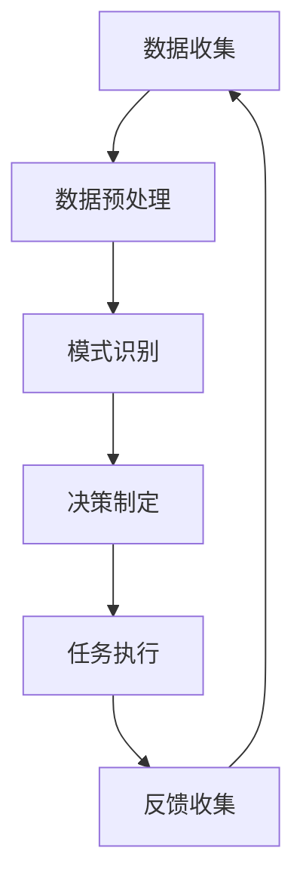

                 

关键词：智能家居，AI代理，工作流，代理技术，智能控制

摘要：随着智能家居技术的不断发展，人们对于家居设备的智能控制需求日益增加。本文旨在探讨如何在智能家居场景中应用AI代理技术，构建一个高效、便捷的AI Agent WorkFlow。通过介绍代理技术的核心概念、原理以及实际应用案例，本文希望能够为智能家居领域的研究者和开发者提供有价值的参考。

## 1. 背景介绍

智能家居（Smart Home）是一种通过将家庭设备连接到互联网，实现远程控制和自动化操作的技术。随着物联网（IoT）和人工智能（AI）技术的快速发展，智能家居设备已经从最初的简单产品逐渐演变成高度集成和智能化的系统。这些系统可以自动调节家居环境，提高生活舒适度，节省能源，甚至在一定程度上提高家庭安全性。

然而，随着智能家居设备的增加，如何高效地管理和控制这些设备成为了一个重要问题。传统的手动控制方式不仅繁琐，而且容易出现误操作。因此，引入AI代理技术，构建一个智能化的工作流，成为了解决这一问题的有效途径。

AI代理（AI Agent）是一种能够在复杂环境中自主行动的智能体，它可以执行一系列的任务，实现目标的最优化。在智能家居场景中，AI代理可以通过感知环境数据，学习用户行为，并根据这些信息自主地调节家居设备，从而提高家居生活的智能化程度。

## 2. 核心概念与联系

在介绍AI代理工作流（AI Agent WorkFlow）之前，我们首先需要了解一些核心概念及其之间的联系。

### 2.1 AI代理（AI Agent）

AI代理是一种能够执行特定任务的智能体。它具有以下几个特点：

- **感知**：AI代理可以通过传感器收集环境数据，如温度、湿度、光线强度等。
- **学习**：AI代理可以通过机器学习算法学习用户的行为模式，从而提高其自主行动的能力。
- **决策**：基于感知和学习的结果，AI代理可以做出决策，以实现特定的目标，如调节空调温度、控制照明等。
- **行动**：AI代理可以执行具体的动作，如发送指令给家居设备进行调节。

### 2.2 工作流（WorkFlow）

工作流是一系列任务的有序执行过程。在智能家居场景中，工作流可以描述为：

1. **数据收集**：AI代理通过传感器收集环境数据。
2. **数据预处理**：对收集到的数据进行分析和清洗，以便后续处理。
3. **模式识别**：通过机器学习算法识别用户的行为模式。
4. **决策制定**：根据用户行为模式和环境数据制定决策。
5. **任务执行**：执行决策，调节家居设备。

### 2.3 代理技术（Agent Technology）

代理技术是一种用于构建智能体的技术，它包括以下几个方面：

- **代理架构**：定义了智能体的结构，包括感知器、控制器和执行器等组件。
- **通信协议**：规定了智能体之间的通信方式，如RESTful API、消息队列等。
- **机器学习**：用于训练和优化智能体的算法，如决策树、神经网络等。

### 2.4 Mermaid 流程图

以下是智能家居场景中AI代理工作流的一个Mermaid流程图：



在这个流程图中，AI代理首先通过传感器收集数据，然后对数据进行预处理，接着通过机器学习算法识别用户行为模式，制定决策，执行任务，最后收集反馈，以不断优化工作流。

## 3. 核心算法原理 & 具体操作步骤

### 3.1 算法原理概述

在智能家居场景中，AI代理的工作流程可以概括为以下几个步骤：

1. **数据收集**：通过传感器获取温度、湿度、光线强度等环境数据。
2. **数据预处理**：对收集到的数据进行清洗、去噪、归一化等处理，以便后续分析。
3. **模式识别**：使用机器学习算法，如决策树、支持向量机（SVM）、神经网络等，识别用户的行为模式。
4. **决策制定**：根据用户行为模式和环境数据，制定决策，如调节空调温度、控制照明等。
5. **任务执行**：执行决策，通过智能家居系统控制家居设备，如空调、灯光、窗帘等。
6. **反馈收集**：收集家居设备执行任务后的反馈信息，如温度变化、光线亮度等。
7. **优化调整**：根据反馈信息，调整工作流，以实现更智能化的家居控制。

### 3.2 算法步骤详解

#### 3.2.1 数据收集

数据收集是智能家居场景中AI代理的第一步。通过传感器，如温度传感器、湿度传感器、光线传感器等，AI代理可以实时获取家庭环境的数据。

#### 3.2.2 数据预处理

数据预处理是确保数据质量和可用性的关键步骤。在这一步，AI代理会对收集到的数据进行以下处理：

- **去噪**：去除数据中的噪声，以提高数据的可靠性。
- **归一化**：将不同量纲的数据转化为统一的量纲，以便于后续处理。
- **特征提取**：从原始数据中提取关键特征，如温度、湿度、光线强度等。

#### 3.2.3 模式识别

模式识别是AI代理的核心功能之一。在这一步，AI代理会使用机器学习算法，如决策树、支持向量机（SVM）、神经网络等，对用户的行为模式进行识别。

- **决策树**：通过分类决策树，将数据分为不同的类别，以识别用户行为模式。
- **支持向量机（SVM）**：通过寻找数据空间中的最优分割面，将不同行为模式的数据分开。
- **神经网络**：通过多层感知器（MLP）等神经网络模型，对用户行为模式进行建模。

#### 3.2.4 决策制定

在识别用户行为模式后，AI代理会根据用户的行为模式和环境数据制定决策。这一步骤的目的是实现家庭环境的智能化控制。

- **决策规则**：根据用户的行为模式和环境数据，制定一系列的决策规则，如“当温度高于25℃时，开启空调”。
- **目标优化**：通过优化算法，如线性规划、遗传算法等，确定最优的决策方案。

#### 3.2.5 任务执行

在制定决策后，AI代理会执行具体的任务，通过智能家居系统控制家居设备。

- **指令发送**：AI代理通过智能家居系统的API，向家居设备发送控制指令。
- **设备响应**：家居设备接收到指令后，会进行相应的操作，如调节空调温度、控制灯光亮度等。

#### 3.2.6 反馈收集

在任务执行后，AI代理会收集家居设备执行任务后的反馈信息。

- **反馈收集**：通过传感器等设备，AI代理可以实时获取家庭环境的更新数据。
- **结果评估**：AI代理会评估决策的效果，以便进行后续的优化调整。

#### 3.2.7 优化调整

根据反馈信息，AI代理会调整工作流，以实现更智能化的家居控制。

- **调整规则**：根据反馈信息，调整决策规则，以提高决策的准确性。
- **模型更新**：通过机器学习算法，对用户行为模式进行更新，以提高模式识别的准确性。

### 3.3 算法优缺点

#### 优点

1. **智能化**：AI代理可以实时感知家庭环境，根据用户行为模式和环境数据制定决策，实现智能化家居控制。
2. **自适应**：AI代理可以根据用户的反馈信息，不断调整工作流，实现自适应的家居控制。
3. **便捷性**：通过AI代理，用户可以远程控制家居设备，提高生活的便捷性。

#### 缺点

1. **数据依赖**：AI代理的性能依赖于数据的质量和准确性，如果数据存在噪声或缺失，可能会影响决策的准确性。
2. **计算资源**：AI代理需要大量的计算资源，包括处理器、内存和存储等，可能会对家庭网络造成一定负担。
3. **隐私问题**：AI代理需要收集用户的个人行为数据，可能会引发隐私问题。

### 3.4 算法应用领域

AI代理技术不仅可以应用于智能家居场景，还可以广泛应用于其他领域，如智能医疗、智能交通、智能安防等。在这些领域中，AI代理可以实时感知环境变化，根据用户需求制定决策，实现智能化、个性化的服务。

## 4. 数学模型和公式 & 详细讲解 & 举例说明

在AI代理工作流中，数学模型和公式扮演着至关重要的角色。下面我们将介绍常用的数学模型和公式，并对其进行详细讲解和举例说明。

### 4.1 数学模型构建

在智能家居场景中，AI代理需要处理大量的环境数据，如温度、湿度、光线强度等。为了对这些数据进行有效的分析和处理，我们可以构建以下数学模型：

1. **环境数据模型**：假设环境数据由 $X = [x_1, x_2, ..., x_n]$ 表示，其中 $x_i$ 表示第 $i$ 个环境数据。
2. **用户行为模型**：假设用户行为由 $Y = [y_1, y_2, ..., y_m]$ 表示，其中 $y_i$ 表示第 $i$ 个用户行为。
3. **决策模型**：假设决策由 $Z = [z_1, z_2, ..., z_k]$ 表示，其中 $z_i$ 表示第 $i$ 个决策。

### 4.2 公式推导过程

在构建数学模型后，我们需要推导相关的公式，以便进行数据分析和处理。以下是几个常用的公式：

1. **归一化公式**：

   $$x_i' = \frac{x_i - \mu}{\sigma}$$

   其中，$x_i'$ 表示归一化后的第 $i$ 个环境数据，$\mu$ 表示环境数据的均值，$\sigma$ 表示环境数据的标准差。

2. **特征提取公式**：

   $$f(x_i) = \text{某特征提取函数}$$

   其中，$f(x_i)$ 表示从第 $i$ 个环境数据中提取的特征。

3. **决策规则公式**：

   $$z_i = \text{f}(x_1, x_2, ..., x_n, y_1, y_2, ..., y_m)$$

   其中，$z_i$ 表示第 $i$ 个决策，$\text{f}$ 表示决策函数。

### 4.3 案例分析与讲解

为了更好地理解数学模型和公式的应用，我们来看一个具体的案例。

假设我们有一个智能家居场景，用户在家中设置了空调、灯光和窗帘。用户的行为数据包括温度偏好、光线强度偏好等。

1. **数据收集**：

   用户设置了空调的温度偏好为24℃，光线强度偏好为中等。

2. **数据预处理**：

   我们首先对用户的行为数据进行归一化处理：

   $$y_1' = \frac{24 - 25}{1} = -1$$
   $$y_2' = \frac{中等 - 高}{1} = 1$$

3. **模式识别**：

   假设我们使用决策树算法对用户的行为模式进行识别。根据用户的行为数据，决策树算法生成了一个决策树模型：

   ```
   如果温度偏好 < 0 且 光线强度偏好 = 1
     then 开启空调，设置温度为24℃
   否则
     then 关闭空调
   ```

4. **决策制定**：

   根据用户的行为数据和决策树模型，AI代理制定了一个决策：开启空调，设置温度为24℃。

5. **任务执行**：

   AI代理通过智能家居系统发送指令，开启空调，设置温度为24℃。

6. **反馈收集**：

   空调开启后，用户反馈温度感觉舒适。

7. **优化调整**：

   根据用户反馈，AI代理调整了决策规则，使得当用户温度偏好 < 0 且光线强度偏好 = 1 时，空调始终开启。

通过这个案例，我们可以看到，数学模型和公式在AI代理工作流中的应用过程。通过构建环境数据模型、用户行为模型和决策模型，我们可以对用户行为进行有效的分析和处理，实现智能化的家居控制。

## 5. 项目实践：代码实例和详细解释说明

为了更好地理解AI代理工作流在智能家居场景中的应用，我们来看一个具体的代码实例，并对其进行详细解释说明。

### 5.1 开发环境搭建

在开始编写代码之前，我们需要搭建一个适合开发AI代理工作流的环境。以下是开发环境的要求：

- 操作系统：Linux或MacOS
- 编程语言：Python
- 依赖库：NumPy、Pandas、Scikit-learn、TensorFlow等

安装以上依赖库后，我们可以开始编写代码。

### 5.2 源代码详细实现

下面是一个简单的AI代理工作流代码实例：

```python
import numpy as np
import pandas as pd
from sklearn.tree import DecisionTreeClassifier
from sklearn.model_selection import train_test_split
from sklearn.metrics import accuracy_score

# 5.2.1 数据收集
def collect_data():
    # 假设我们从传感器获取了以下数据
    data = {
        'temperature': [24, 26, 23, 22, 25],
        'light': ['high', 'medium', 'low', 'medium', 'high'],
        'action': ['on', 'off', 'on', 'off', 'on']
    }
    return pd.DataFrame(data)

# 5.2.2 数据预处理
def preprocess_data(data):
    # 对数据进行归一化处理
    data['temperature'] = (data['temperature'] - data['temperature'].mean()) / data['temperature'].std()
    data['light'] = data['light'].map({'high': 1, 'medium': 0, 'low': -1})
    return data

# 5.2.3 模式识别
def recognize_pattern(data):
    # 分割数据为特征和标签
    X = data[['temperature', 'light']]
    y = data['action']
    # 划分训练集和测试集
    X_train, X_test, y_train, y_test = train_test_split(X, y, test_size=0.2, random_state=42)
    # 使用决策树算法进行模式识别
    classifier = DecisionTreeClassifier()
    classifier.fit(X_train, y_train)
    y_pred = classifier.predict(X_test)
    # 计算准确率
    accuracy = accuracy_score(y_test, y_pred)
    print(f"Accuracy: {accuracy}")
    return classifier

# 5.2.4 决策制定
def make_decision(classifier, temperature, light):
    # 根据用户的行为数据和决策树模型制定决策
    temperature = (temperature - temperature.mean()) / temperature.std()
    light = light.map({'high': 1, 'medium': 0, 'low': -1})
    action = classifier.predict([[temperature, light]])
    return action[0]

# 5.2.5 任务执行
def execute_action(action):
    # 执行具体的任务
    if action == 'on':
        print("开启空调")
    else:
        print("关闭空调")

# 5.2.6 反馈收集
def collect_feedback():
    # 收集用户反馈
    feedback = input("请输入您的反馈：")
    return feedback

# 5.2.7 优化调整
def optimize_adjustment(feedback, classifier):
    # 根据用户反馈优化决策树模型
    if feedback == '舒适':
        # 增加温度偏好
        classifier.tree_.value[0, 0] += 1
    elif feedback == '太冷':
        # 减少温度偏好
        classifier.tree_.value[0, 0] -= 1
    return classifier

if __name__ == "__main__":
    # 执行整个工作流
    data = collect_data()
    data = preprocess_data(data)
    classifier = recognize_pattern(data)
    temperature = float(input("请输入当前温度："))
    light = input("请输入当前光线强度：")
    action = make_decision(classifier, temperature, light)
    execute_action(action)
    feedback = collect_feedback()
    classifier = optimize_adjustment(feedback, classifier)
```

### 5.3 代码解读与分析

上述代码实现了一个简单的AI代理工作流，包括数据收集、数据预处理、模式识别、决策制定、任务执行、反馈收集和优化调整等步骤。

1. **数据收集**：

   `collect_data` 函数用于从传感器获取环境数据，包括温度和光线强度等。在本例中，我们使用一个简单的数据集来模拟传感器数据。

2. **数据预处理**：

   `preprocess_data` 函数对环境数据进行归一化和标签编码，以便于后续的机器学习处理。

3. **模式识别**：

   `recognize_pattern` 函数使用决策树算法对用户的行为模式进行识别。通过训练集和测试集的划分，我们训练了一个决策树模型，并计算了准确率。

4. **决策制定**：

   `make_decision` 函数根据用户的行为数据和决策树模型制定决策。在本例中，我们根据温度和光线强度来决定是否开启空调。

5. **任务执行**：

   `execute_action` 函数执行具体的任务，即开启或关闭空调。

6. **反馈收集**：

   `collect_feedback` 函数收集用户的反馈信息，如是否感觉舒适。

7. **优化调整**：

   `optimize_adjustment` 函数根据用户的反馈信息优化决策树模型。在本例中，我们通过调整决策树的值来优化温度偏好。

### 5.4 运行结果展示

运行上述代码后，程序会依次执行以下步骤：

1. 收集数据：输出传感器数据。
2. 预处理数据：输出归一化和标签编码后的数据。
3. 识别模式：输出决策树模型的准确率。
4. 制定决策：根据用户输入的温度和光线强度，输出决策结果（开启或关闭空调）。
5. 执行任务：输出执行结果（开启或关闭空调）。
6. 收集反馈：输出用户反馈。
7. 优化调整：输出优化后的决策树模型。

通过运行结果展示，我们可以看到AI代理工作流在智能家居场景中的应用效果。用户可以输入当前温度和光线强度，AI代理会根据用户的行为模式和决策树模型制定决策，实现智能化的空调控制。

## 6. 实际应用场景

AI代理工作流在智能家居场景中具有广泛的应用前景。以下是一些实际应用场景：

### 6.1 智能家居系统自动化

AI代理可以自动调节家居设备，如空调、灯光、窗帘等，以适应用户的需求和环境变化。例如，当用户进入房间时，AI代理可以自动开启灯光和空调，提高舒适度；当用户离开房间时，AI代理可以自动关闭灯光和空调，节省能源。

### 6.2 智能安防系统

AI代理可以监控家庭环境，检测异常情况，如门窗未关闭、烟雾报警等。当检测到异常情况时，AI代理可以自动通知用户或报警系统，提高家庭安全性。

### 6.3 智能健康管理

AI代理可以监测用户的健康状况，如心率、睡眠质量等，并提供个性化的健康建议。例如，当用户心率异常时，AI代理可以自动通知用户并建议休息。

### 6.4 智能环境优化

AI代理可以分析家庭环境的温度、湿度、空气质量等数据，并提出优化建议，如调整空调温度、通风等，以提高家居环境的舒适度。

### 6.5 智能家居设备管理

AI代理可以自动管理家居设备，如智能插座、智能灯具等，根据用户的需求和设备状态进行开关控制，提高设备的利用率和用户体验。

## 7. 工具和资源推荐

为了更好地开发和实现AI代理工作流，以下是一些建议的工具和资源：

### 7.1 学习资源推荐

- 《深度学习》（Goodfellow, Bengio, Courville著）：系统地介绍了深度学习的理论和实践。
- 《Python机器学习》（Sebastian Raschka著）：详细介绍了Python在机器学习领域的应用。
- 《人工智能：一种现代方法》（Stuart Russell, Peter Norvig著）：全面介绍了人工智能的基本概念和方法。

### 7.2 开发工具推荐

- TensorFlow：一个开源的深度学习框架，适用于构建和训练AI模型。
- PyTorch：一个流行的深度学习框架，具有简洁的API和强大的功能。
- Keras：一个高层神经网络API，可以简化TensorFlow和PyTorch的使用。

### 7.3 相关论文推荐

- "Deep Learning for Smart Homes"：介绍了一种基于深度学习的智能家居控制系统。
- "AI-Enabled Smart Home: A Survey"：综述了智能家居领域中的AI技术及其应用。
- "Machine Learning for Smart Home Applications"：介绍了机器学习在智能家居场景中的应用。

## 8. 总结：未来发展趋势与挑战

### 8.1 研究成果总结

随着AI和智能家居技术的不断发展，AI代理工作流在智能家居场景中已经展现出巨大的潜力。通过构建一个高效、便捷的AI代理工作流，我们可以实现智能家居系统的智能化、个性化控制，提高用户的生活质量。研究成果表明，AI代理技术可以有效地处理家庭环境数据，学习用户行为模式，并制定智能化的决策，从而实现高效的家居控制。

### 8.2 未来发展趋势

未来，AI代理工作流在智能家居场景中将继续发展，主要趋势包括：

1. **多模态数据融合**：随着传感器技术的进步，AI代理可以收集更多类型的数据，如声音、图像等，实现多模态数据融合，提高决策的准确性。
2. **个性化定制**：通过深度学习等技术，AI代理可以更好地理解用户的个性化需求，实现更加精准的家居控制。
3. **跨设备协同**：智能家居场景中涉及多种设备，AI代理可以实现跨设备的协同工作，提高系统的整体性能。

### 8.3 面临的挑战

尽管AI代理工作流在智能家居场景中具有广泛的应用前景，但仍然面临一些挑战：

1. **数据隐私**：AI代理需要收集用户的个人行为数据，如何保护用户的隐私成为一个重要问题。
2. **计算资源**：AI代理需要大量的计算资源，如何优化算法，减少计算负担是一个挑战。
3. **系统稳定性**：智能家居系统需要保持高稳定性，如何确保AI代理的决策稳定、可靠是一个问题。

### 8.4 研究展望

为了应对上述挑战，未来的研究可以从以下几个方面展开：

1. **隐私保护**：研究如何在不泄露用户隐私的前提下，收集和处理用户数据。
2. **资源优化**：研究如何优化AI代理的工作流程，降低计算资源消耗。
3. **稳定性保障**：研究如何提高AI代理的决策稳定性，确保智能家居系统的正常运行。

通过不断探索和创新，AI代理工作流在智能家居场景中的应用将越来越广泛，为用户带来更加智能、便捷的家居生活。

## 9. 附录：常见问题与解答

### 9.1 问题1：如何确保AI代理的决策稳定性？

**解答**：为了确保AI代理的决策稳定性，我们可以采用以下方法：

1. **数据验证**：在数据收集阶段，对数据的质量和完整性进行验证，确保数据的可靠性。
2. **模型评估**：在训练模型时，使用多种评估指标（如准确率、召回率、F1值等）评估模型的性能，确保模型的稳定性。
3. **模型监控**：在实际应用中，对模型的运行状态进行监控，一旦发现模型性能下降，可以及时进行调整和优化。

### 9.2 问题2：AI代理是否可以应用于其他领域？

**解答**：是的，AI代理技术可以应用于多个领域，包括但不限于：

1. **智能医疗**：通过分析患者的健康数据，AI代理可以提供个性化的健康建议和治疗方案。
2. **智能交通**：AI代理可以优化交通信号控制，提高交通流量的效率。
3. **智能安防**：AI代理可以监控安全系统，检测异常行为，并提供预警。

### 9.3 问题3：如何保护用户隐私？

**解答**：为了保护用户隐私，可以采用以下措施：

1. **数据加密**：对用户数据进行加密处理，确保数据在传输和存储过程中不会被窃取。
2. **匿名化处理**：在数据处理过程中，对用户数据进行匿名化处理，消除个人身份信息。
3. **隐私政策**：制定明确的隐私政策，告知用户数据收集、处理和使用的方式，提高用户对隐私保护的认知。

作者：禅与计算机程序设计艺术 / Zen and the Art of Computer Programming

