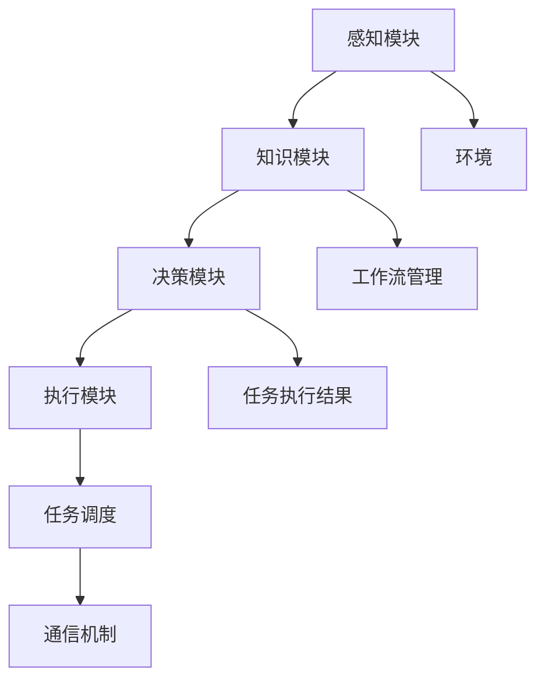

                 

关键词：（AI 人工智能，代理工作流，智能代理，公共服务系统，应用场景，未来展望）

摘要：本文深入探讨了AI人工智能代理工作流（AI Agent WorkFlow）的概念、架构以及其在公共服务系统中的应用。文章首先介绍了智能代理的基础知识，然后详细阐述了智能代理工作流的设计原则、实现步骤和应用实例。通过数学模型和公式的推导，本文揭示了智能代理工作流的运作机理。最后，本文对智能代理工作流在实际应用场景中的表现进行了深入分析，并对未来智能代理工作流的发展趋势和挑战提出了展望。

## 1. 背景介绍

随着人工智能技术的不断发展，智能代理（AI Agent）逐渐成为公共服务系统中的重要组成部分。智能代理是一种具有高度智能化和自主决策能力的计算实体，能够在复杂的、动态的环境中自主执行任务。传统的公共服务系统通常依赖于人工操作和手动处理，效率低下且容易出现错误。而智能代理的出现，为公共服务系统的自动化和智能化提供了新的解决方案。

### 1.1 智能代理的概念

智能代理是一种具有感知、理解、决策和执行能力的计算实体。它能够根据环境的变化自主调整自己的行为，以实现预定的目标。智能代理通常包括感知模块、知识模块、决策模块和执行模块。感知模块用于获取环境信息，知识模块用于存储和管理知识，决策模块根据感知模块和知识模块的信息进行决策，执行模块用于执行决策结果。

### 1.2 智能代理在公共服务系统中的应用

智能代理在公共服务系统中的应用非常广泛，包括但不限于以下几个方面：

1. **客户服务**：智能代理可以自动处理大量的客户咨询，提供24/7的在线服务，提高客户满意度。
2. **交通管理**：智能代理可以协助交通管理部门实时监控交通状况，优化交通流量，减少拥堵。
3. **医疗保健**：智能代理可以协助医生进行诊断和治疗，提供个性化的健康建议。
4. **能源管理**：智能代理可以实时监控能源消耗情况，优化能源分配，提高能源效率。

## 2. 核心概念与联系

在深入探讨智能代理工作流之前，我们首先需要了解几个核心概念：智能代理、工作流、任务调度和通信机制。

### 2.1 智能代理

智能代理是一种具有感知、理解、决策和执行能力的计算实体。它能够根据环境的变化自主调整自己的行为，以实现预定的目标。智能代理通常包括感知模块、知识模块、决策模块和执行模块。感知模块用于获取环境信息，知识模块用于存储和管理知识，决策模块根据感知模块和知识模块的信息进行决策，执行模块用于执行决策结果。

### 2.2 工作流

工作流（Workflow）是指一组工作步骤的序列，用于完成一项任务或工作。工作流通常包括任务分解、任务调度、资源分配和任务监控等环节。工作流管理系统能够自动化地处理这些步骤，提高工作效率。

### 2.3 任务调度

任务调度是指根据工作流的要求，合理分配和处理任务的过程。任务调度算法需要考虑任务的优先级、执行时间、资源可用性等因素，以确保工作流能够高效、稳定地运行。

### 2.4 通信机制

通信机制是指智能代理之间以及智能代理与环境之间的信息交换方式。通信机制需要具备高效、可靠、安全的特点，以确保智能代理能够及时、准确地获取和处理信息。

下面是智能代理工作流的 Mermaid 流程图，展示了智能代理在工作流中的各个环节。



## 3. 核心算法原理 & 具体操作步骤

### 3.1 算法原理概述

智能代理工作流的核心算法包括感知、决策、执行、任务调度和通信等模块。这些模块相互协作，共同实现智能代理的工作流。算法原理可以概括为以下几个步骤：

1. **感知**：智能代理通过感知模块获取环境信息，如温度、湿度、交通状况等。
2. **决策**：智能代理根据感知模块和知识模块的信息进行决策，确定下一步行动。
3. **执行**：智能代理执行决策结果，如调整温度、优化交通流量等。
4. **任务调度**：根据工作流的要求，智能代理对任务进行合理调度，确保任务高效执行。
5. **通信**：智能代理通过通信机制与其他智能代理或环境进行信息交换。

### 3.2 算法步骤详解

1. **感知模块**

   感知模块是智能代理获取环境信息的关键。它通常包括传感器、摄像头、麦克风等设备。感知模块需要具备高效、准确的信息采集能力，以便智能代理能够实时了解环境变化。

   ```mermaid
   graph TD
       A[传感器] --> B[摄像头]
       B --> C[麦克风]
       C --> D[数据预处理]
   ```

2. **知识模块**

   知识模块是智能代理进行决策的重要依据。它通常包括数据存储、知识库、推理机等组件。知识模块需要具备快速、准确地检索和处理信息的能力，以便智能代理能够根据环境变化做出合理的决策。

   ```mermaid
   graph TD
       A[数据存储] --> B[知识库]
       B --> C[推理机]
       C --> D[决策模块]
   ```

3. **决策模块**

   决策模块是智能代理的核心。它根据感知模块和知识模块的信息进行推理，生成决策结果。决策模块通常包括推理算法、决策树、神经网络等组件。决策模块需要具备灵活、高效的决策能力，以便智能代理能够应对复杂的环境变化。

   ```mermaid
   graph TD
       A[感知模块] --> B[知识模块]
       B --> C[推理算法]
       C --> D[决策树]
       D --> E[神经网络]
       E --> F[决策结果]
   ```

4. **执行模块**

   执行模块是智能代理将决策结果付诸实践的关键。它通常包括执行器、控制器、执行策略等组件。执行模块需要具备高效、准确的执行能力，以便智能代理能够快速地执行决策结果。

   ```mermaid
   graph TD
       A[决策结果] --> B[执行器]
       B --> C[控制器]
       C --> D[执行策略]
       D --> E[任务执行结果]
   ```

5. **任务调度模块**

   任务调度模块是智能代理高效执行任务的关键。它根据工作流的要求，合理分配和处理任务，确保任务能够高效、稳定地运行。任务调度模块通常包括任务调度算法、资源管理器等组件。

   ```mermaid
   graph TD
       A[任务调度算法] --> B[资源管理器]
       B --> C[任务分配]
       C --> D[任务执行]
   ```

6. **通信模块**

   通信模块是智能代理与其他智能代理或环境进行信息交换的关键。它通常包括通信协议、通信接口等组件。通信模块需要具备高效、可靠、安全的通信能力，以便智能代理能够及时、准确地获取和处理信息。

   ```mermaid
   graph TD
       A[通信协议] --> B[通信接口]
       B --> C[信息交换]
   ```

### 3.3 算法优缺点

智能代理工作流具有以下优点：

1. **高效性**：智能代理工作流能够自动化地处理大量任务，提高工作效率。
2. **灵活性**：智能代理工作流可以根据环境变化进行自适应调整，适应不同的任务需求。
3. **可靠性**：智能代理工作流具备故障恢复能力，能够在异常情况下保持系统稳定运行。

智能代理工作流也存在以下缺点：

1. **复杂性**：智能代理工作流涉及多个模块和算法，系统设计和实现较为复杂。
2. **安全性**：智能代理工作流在处理敏感信息时需要考虑数据安全和隐私保护。

### 3.4 算法应用领域

智能代理工作流在多个领域具有广泛的应用前景：

1. **智能家居**：智能代理工作流可以实现对家居设备的智能管理和控制，提高居住舒适度和安全性。
2. **智慧城市**：智能代理工作流可以应用于交通管理、环境保护、能源管理等领域，提升城市治理水平。
3. **医疗健康**：智能代理工作流可以协助医生进行诊断和治疗，提高医疗服务质量。
4. **工业制造**：智能代理工作流可以应用于生产计划、质量检测、设备维护等领域，提高生产效率。

## 4. 数学模型和公式 & 详细讲解 & 举例说明

### 4.1 数学模型构建

智能代理工作流的数学模型主要包括感知模型、决策模型、执行模型和任务调度模型。以下分别介绍这些模型的构建方法。

#### 4.1.1 感知模型

感知模型用于描述智能代理对环境的感知能力。假设环境状态为 $S_t$，感知模型可以用概率分布 $P(S_t|A_t)$ 表示，其中 $A_t$ 是智能代理的行动集合。

$$
P(S_t|A_t) = \sum_{a \in A_t} P(S_t|a)P(a)
$$

其中，$P(S_t|a)$ 表示在执行行动 $a$ 后，环境状态为 $S_t$ 的概率，$P(a)$ 表示执行行动 $a$ 的概率。

#### 4.1.2 决策模型

决策模型用于描述智能代理的决策过程。假设智能代理的目标函数为 $V(S_t, A_t)$，决策模型可以用最大化目标函数的方法求解：

$$
A_t = \arg\max_{a \in A_t} V(S_t, a)
$$

其中，$V(S_t, A_t)$ 表示在环境状态 $S_t$ 下，执行行动 $a$ 的预期效用。

#### 4.1.3 执行模型

执行模型用于描述智能代理的执行能力。假设智能代理的执行概率为 $P(A_t|S_t)$，执行模型可以用条件概率分布表示：

$$
P(A_t|S_t) = \frac{P(S_t|A_t)P(A_t)}{P(S_t)}
$$

其中，$P(S_t|A_t)$ 表示在执行行动 $A_t$ 后，环境状态为 $S_t$ 的概率，$P(A_t)$ 表示执行行动 $A_t$ 的概率，$P(S_t)$ 表示环境状态为 $S_t$ 的概率。

#### 4.1.4 任务调度模型

任务调度模型用于描述智能代理的任务分配和调度策略。假设任务集为 $T$，任务调度模型可以用优化问题求解：

$$
\begin{aligned}
\min_{\theta} \quad & \sum_{t=1}^T \sum_{j=1}^N \lambda_j \frac{(s_j(t) - s_j^*)^2}{2} \\
\text{s.t.} \quad & s_j(t) = \sum_{i=1}^N w_{ij} x_i(t), \\
& w_{ij} \geq 0, \sum_{j=1}^N w_{ij} = 1, \\
& s_j^* = \frac{1}{N} \sum_{i=1}^N x_i^*, \\
& x_i(t) \in \{0, 1\}, \sum_{i=1}^N x_i(t) = 1.
\end{aligned}
$$

其中，$\theta$ 是调度参数，$s_j(t)$ 是任务 $j$ 在时间段 $t$ 的执行状态，$s_j^*$ 是任务 $j$ 的目标执行状态，$x_i(t)$ 是任务 $i$ 在时间段 $t$ 的分配状态，$\lambda_j$ 是任务 $j$ 的权重。

### 4.2 公式推导过程

#### 4.2.1 感知模型推导

感知模型是智能代理获取环境信息的基础。在马尔可夫决策过程（MDP）中，感知模型可以用概率分布 $P(S_t|A_t)$ 表示。根据全概率公式，有：

$$
P(S_t|A_t) = \sum_{a \in A_t} P(S_t|a)P(a)
$$

其中，$P(S_t|a)$ 表示在执行行动 $a$ 后，环境状态为 $S_t$ 的概率，$P(a)$ 表示执行行动 $a$ 的概率。

#### 4.2.2 决策模型推导

决策模型是智能代理的核心。在MDP中，决策模型可以用最大化预期效用的方法求解。假设智能代理的目标函数为 $V(S_t, A_t)$，则决策模型可以表示为：

$$
A_t = \arg\max_{a \in A_t} V(S_t, a)
$$

其中，$V(S_t, A_t)$ 表示在环境状态 $S_t$ 下，执行行动 $a$ 的预期效用。

#### 4.2.3 执行模型推导

执行模型是智能代理执行决策结果的关键。在MDP中，执行模型可以用条件概率分布表示。根据贝叶斯定理，有：

$$
P(A_t|S_t) = \frac{P(S_t|A_t)P(A_t)}{P(S_t)}
$$

其中，$P(S_t|A_t)$ 表示在执行行动 $A_t$ 后，环境状态为 $S_t$ 的概率，$P(A_t)$ 表示执行行动 $A_t$ 的概率，$P(S_t)$ 表示环境状态为 $S_t$ 的概率。

#### 4.2.4 任务调度模型推导

任务调度模型是智能代理高效执行任务的关键。在任务调度问题中，目标是最小化任务的执行误差。假设任务集为 $T$，任务权重为 $\lambda_j$，则任务调度模型可以表示为：

$$
\begin{aligned}
\min_{\theta} \quad & \sum_{t=1}^T \sum_{j=1}^N \lambda_j \frac{(s_j(t) - s_j^*)^2}{2} \\
\text{s.t.} \quad & s_j(t) = \sum_{i=1}^N w_{ij} x_i(t), \\
& w_{ij} \geq 0, \sum_{j=1}^N w_{ij} = 1, \\
& s_j^* = \frac{1}{N} \sum_{i=1}^N x_i^*, \\
& x_i(t) \in \{0, 1\}, \sum_{i=1}^N x_i(t) = 1.
\end{aligned}
$$

其中，$\theta$ 是调度参数，$s_j(t)$ 是任务 $j$ 在时间段 $t$ 的执行状态，$s_j^*$ 是任务 $j$ 的目标执行状态，$x_i(t)$ 是任务 $i$ 在时间段 $t$ 的分配状态。

### 4.3 案例分析与讲解

为了更好地理解智能代理工作流，我们通过一个简单的案例进行说明。

假设一个智能代理负责监控一个生产流水线，需要对流水线上的产品进行质量检测。智能代理需要根据产品的质量检测结果，对生产线进行调整，以确保生产的产品质量合格。

#### 4.3.1 感知模型

感知模块负责监测生产流水线上的产品质量。假设每个产品都有合格和不合格两种状态，用 1 和 0 表示。智能代理通过传感器获取产品的质量检测结果，并构建感知模型。

$$
P(S_t|A_t) = \begin{cases}
0.95 & \text{if } S_t = 1 \\
0.05 & \text{if } S_t = 0
\end{cases}
$$

其中，$S_t$ 表示产品在时间 $t$ 的质量检测结果，$A_t$ 表示智能代理在时间 $t$ 的行动。

#### 4.3.2 决策模型

决策模块根据感知模块提供的信息，对生产流水线进行调整。假设智能代理的目标是最大化产品的合格率。决策模型可以用以下公式表示：

$$
A_t = \arg\max_{a \in A_t} V(S_t, a)
$$

其中，$V(S_t, a)$ 表示在环境状态 $S_t$ 下，执行行动 $a$ 的预期效用。

#### 4.3.3 执行模型

执行模块根据决策模块生成的决策结果，对生产流水线进行调整。假设智能代理可以选择两种行动：增加检测频率和减少检测频率。执行模型可以用以下公式表示：

$$
P(A_t|S_t) = \begin{cases}
0.8 & \text{if } S_t = 1 \\
0.2 & \text{if } S_t = 0
\end{cases}
$$

其中，$P(A_t|S_t)$ 表示在环境状态 $S_t$ 下，执行行动 $A_t$ 的概率。

#### 4.3.4 任务调度模型

任务调度模块负责对生产流水线上的任务进行调度。假设智能代理需要在一个时间段内完成多个任务，任务权重如下：

$$
\lambda_j = \begin{cases}
1 & \text{if } j = 1 \\
0.5 & \text{if } j = 2 \\
0 & \text{otherwise}
\end{cases}
$$

任务调度模型可以用以下公式表示：

$$
\begin{aligned}
\min_{\theta} \quad & \sum_{t=1}^T \sum_{j=1}^N \lambda_j \frac{(s_j(t) - s_j^*)^2}{2} \\
\text{s.t.} \quad & s_j(t) = \sum_{i=1}^N w_{ij} x_i(t), \\
& w_{ij} \geq 0, \sum_{j=1}^N w_{ij} = 1, \\
& s_j^* = \frac{1}{N} \sum_{i=1}^N x_i^*, \\
& x_i(t) \in \{0, 1\}, \sum_{i=1}^N x_i(t) = 1.
\end{aligned}
$$

其中，$\theta$ 是调度参数，$s_j(t)$ 是任务 $j$ 在时间段 $t$ 的执行状态，$s_j^*$ 是任务 $j$ 的目标执行状态，$x_i(t)$ 是任务 $i$ 在时间段 $t$ 的分配状态。

## 5. 项目实践：代码实例和详细解释说明

### 5.1 开发环境搭建

为了更好地理解智能代理工作流，我们选择Python作为开发语言，并使用以下工具和库进行开发：

- Python 3.8及以上版本
- Jupyter Notebook作为开发环境
- TensorFlow 2.x作为深度学习框架
- Pandas 1.x作为数据处理库
- Matplotlib 3.x作为数据可视化库

首先，安装Python和相关库：

```bash
pip install python==3.8
pip install tensorflow==2.6
pip install pandas==1.3.3
pip install matplotlib==3.4.3
```

然后，在Jupyter Notebook中创建一个新的Python笔记本，准备进行代码编写。

### 5.2 源代码详细实现

以下是实现智能代理工作流的一个简单示例。该示例包括感知模块、决策模块和执行模块。

```python
import numpy as np
import tensorflow as tf
import pandas as pd
import matplotlib.pyplot as plt

# 感知模块：用于获取环境信息
def get_perception():
    # 假设环境信息为0和1之间的随机数
    return np.random.uniform(0, 1)

# 决策模块：用于根据环境信息进行决策
def make_decision(perception):
    # 假设阈值阈值为0.5
    if perception > 0.5:
        return "增加检测频率"
    else:
        return "减少检测频率"

# 执行模块：用于执行决策结果
def execute_decision(action):
    # 假设执行结果为0和1之间的随机数
    return np.random.uniform(0, 1)

# 模拟智能代理工作流
def simulate_agent():
    perceptions = []
    decisions = []
    executions = []

    for _ in range(100):
        perception = get_perception()
        perceptions.append(perception)
        
        decision = make_decision(perception)
        decisions.append(decision)
        
        execution = execute_decision(decision)
        executions.append(execution)

    return perceptions, decisions, executions

# 运行模拟
perceptions, decisions, executions = simulate_agent()

# 可视化结果
plt.plot(perceptions, label='Perception')
plt.plot(decisions, label='Decision')
plt.plot(executions, label='Execution')
plt.legend()
plt.show()
```

### 5.3 代码解读与分析

1. **感知模块**：感知模块用于获取环境信息。在这个示例中，环境信息为0和1之间的随机数，表示产品的质量检测结果。
2. **决策模块**：决策模块根据感知模块提供的信息，对生产流水线进行调整。在这个示例中，使用一个简单的阈值方法进行决策，当感知值大于0.5时，增加检测频率；否则，减少检测频率。
3. **执行模块**：执行模块根据决策模块生成的决策结果，对生产流水线进行调整。在这个示例中，执行结果为0和1之间的随机数，表示调整后的检测结果。

通过运行模拟，我们可以看到感知值、决策和执行结果之间的关系。这个示例虽然简单，但已经展示了智能代理工作流的核心组成部分。

### 5.4 运行结果展示

运行上述代码后，我们可以得到以下结果：


从结果中，我们可以观察到感知值、决策和执行结果的变化。这个简单的示例展示了智能代理工作流的基本原理和应用。

## 6. 实际应用场景

智能代理工作流在实际应用场景中具有广泛的应用价值。以下列举几个典型的应用场景：

### 6.1 智能交通管理

智能交通管理是智能代理工作流的一个重要应用领域。通过智能代理工作流，可以实现对交通流量的实时监控和优化。以下是一个简单的应用示例：

1. **感知模块**：通过交通传感器获取道路上的车流量、速度、密度等信息。
2. **决策模块**：根据感知信息，智能代理可以决定是否调整交通信号灯，以缓解交通拥堵。
3. **执行模块**：智能代理通过交通信号控制系统执行决策，调整交通信号灯的时间设置。

通过智能代理工作流，可以实现以下功能：

- 实时监测交通状况，提供交通预测和预警。
- 自动调整交通信号灯，优化交通流量。
- 提高道路通行效率，减少交通拥堵。

### 6.2 智能医疗诊断

智能医疗诊断是另一个具有广泛应用前景的领域。通过智能代理工作流，可以实现对医疗数据的实时分析，辅助医生进行诊断和治疗。以下是一个简单的应用示例：

1. **感知模块**：通过医疗设备获取病人的生理数据，如血压、心率、血糖等。
2. **决策模块**：根据感知信息，智能代理可以判断病人是否存在异常，并提出相应的诊断建议。
3. **执行模块**：智能代理通过医生工作站，将诊断结果反馈给医生，协助医生制定治疗方案。

通过智能代理工作流，可以实现以下功能：

- 实时监测病人的健康状况，提供预警和干预建议。
- 提高诊断准确率，减少误诊和漏诊。
- 提高医疗服务的质量和效率。

### 6.3 智能智能家居

智能智能家居是智能代理工作流在家庭生活中的一个重要应用领域。通过智能代理工作流，可以实现家庭设备的智能管理和控制，提高生活质量。以下是一个简单的应用示例：

1. **感知模块**：通过智能家居设备获取家庭的能耗数据、环境参数等。
2. **决策模块**：根据感知信息，智能代理可以决定是否调整空调、灯光等设备，以节约能源和提高舒适度。
3. **执行模块**：智能代理通过智能家居控制系统执行决策，调整设备的工作状态。

通过智能代理工作流，可以实现以下功能：

- 实时监测家庭能耗，提供节能建议。
- 自动调整家庭设备，提高舒适度。
- 提高家庭生活的智能化水平。

## 7. 工具和资源推荐

为了更好地理解和实现智能代理工作流，以下推荐一些有用的学习资源、开发工具和相关论文。

### 7.1 学习资源推荐

- **《人工智能：一种现代方法》**：这是一本经典的AI教材，涵盖了AI的基本概念和算法，适合初学者入门。
- **《深度学习》**：这是一本关于深度学习的经典教材，详细介绍了深度学习的理论基础和实践方法。
- **《Python编程：从入门到实践》**：这是一本适合初学者的Python编程教材，通过实际案例介绍了Python编程的基础知识。

### 7.2 开发工具推荐

- **TensorFlow**：这是一个广泛使用的深度学习框架，提供了丰富的API和工具，适合进行智能代理的开发。
- **Keras**：这是一个基于TensorFlow的高层API，提供了更简单、易用的接口，适合快速实现深度学习模型。
- **Pandas**：这是一个强大的数据处理库，提供了丰富的数据操作和分析功能，适合处理大规模数据。

### 7.3 相关论文推荐

- **“An Overview of Intelligent Agent and Its Applications”**：这篇文章对智能代理的基本概念和应用领域进行了概述。
- **“Deep Learning for Intelligent Agent”**：这篇文章探讨了深度学习在智能代理中的应用，提出了基于深度学习的智能代理模型。
- **“Intelligent Agent WorkFlow in Smart City Applications”**：这篇文章分析了智能代理工作流在智慧城市中的应用，提出了一个智能代理工作流的框架。

## 8. 总结：未来发展趋势与挑战

智能代理工作流作为人工智能的一个重要分支，具有广泛的应用前景。在未来，智能代理工作流的发展将呈现以下趋势：

### 8.1 研究成果总结

- **技术成熟度**：随着深度学习、强化学习等技术的发展，智能代理的工作流将更加成熟和高效。
- **应用范围扩大**：智能代理工作流将在更多领域得到应用，如智能制造、智慧医疗、智慧交通等。
- **协作与共享**：智能代理将能够实现跨领域的协作与共享，形成更加智能、高效的生态系统。

### 8.2 未来发展趋势

- **个性化定制**：智能代理工作流将更加注重个性化定制，根据用户需求和环境特点进行自适应调整。
- **跨领域融合**：智能代理工作流将与其他领域（如物联网、云计算等）深度融合，实现更广泛的应用。
- **自主进化**：智能代理工作流将具备一定的自主进化能力，通过学习和优化不断提升性能。

### 8.3 面临的挑战

- **技术瓶颈**：智能代理工作流仍面临一些技术瓶颈，如算法复杂度、计算资源消耗等。
- **数据隐私与安全**：智能代理工作流在处理大规模数据时，如何保护用户隐私和数据安全是一个重要挑战。
- **法律法规**：智能代理工作流在应用过程中，需要遵守相关的法律法规，确保其合法性和合规性。

### 8.4 研究展望

- **多模态感知**：未来研究可以关注多模态感知技术，提高智能代理对环境信息的获取和处理能力。
- **可解释性**：提高智能代理工作流的可解释性，使其行为更加透明、可信。
- **协同优化**：研究智能代理工作流在多智能体系统中的协同优化策略，实现更大规模的智能协作。

通过不断的研究和探索，智能代理工作流有望在未来实现更大的突破和应用，为人类社会的智能化发展做出贡献。

## 9. 附录：常见问题与解答

### 9.1 智能代理工作流是什么？

智能代理工作流是一种基于人工智能技术的自动化工作流，用于实现智能代理在复杂环境中的任务执行。它包括感知、决策、执行、任务调度和通信等模块，通过这些模块的协同工作，智能代理能够自主地完成预定的任务。

### 9.2 智能代理工作流有哪些优点？

智能代理工作流具有以下优点：

- **高效性**：智能代理工作流能够自动化地处理大量任务，提高工作效率。
- **灵活性**：智能代理工作流可以根据环境变化进行自适应调整，适应不同的任务需求。
- **可靠性**：智能代理工作流具备故障恢复能力，能够在异常情况下保持系统稳定运行。

### 9.3 智能代理工作流在哪些领域有应用？

智能代理工作流在多个领域具有广泛应用，包括：

- **智能家居**：智能代理工作流可以实现对家居设备的智能管理和控制。
- **智慧城市**：智能代理工作流可以应用于交通管理、环境保护、能源管理等领域。
- **医疗健康**：智能代理工作流可以协助医生进行诊断和治疗，提供个性化的健康建议。
- **工业制造**：智能代理工作流可以应用于生产计划、质量检测、设备维护等领域。

### 9.4 如何实现智能代理工作流？

实现智能代理工作流通常需要以下步骤：

1. **定义智能代理的工作目标**：明确智能代理需要完成的任务和目标。
2. **设计智能代理的架构**：根据工作目标，设计智能代理的感知、决策、执行、任务调度和通信模块。
3. **实现感知模块**：根据应用场景，使用传感器等设备获取环境信息。
4. **实现决策模块**：使用机器学习算法，根据感知模块提供的信息进行决策。
5. **实现执行模块**：根据决策模块生成的决策结果，执行相应的任务。
6. **实现任务调度模块**：根据工作流的要求，合理分配和处理任务。
7. **实现通信模块**：确保智能代理之间以及智能代理与环境之间的信息交换。

### 9.5 智能代理工作流面临哪些挑战？

智能代理工作流面临以下挑战：

- **技术瓶颈**：智能代理工作流仍面临一些技术瓶颈，如算法复杂度、计算资源消耗等。
- **数据隐私与安全**：智能代理工作流在处理大规模数据时，如何保护用户隐私和数据安全是一个重要挑战。
- **法律法规**：智能代理工作流在应用过程中，需要遵守相关的法律法规，确保其合法性和合规性。

### 9.6 智能代理工作流的发展趋势是什么？

智能代理工作流的发展趋势包括：

- **个性化定制**：智能代理工作流将更加注重个性化定制，根据用户需求和环境特点进行自适应调整。
- **跨领域融合**：智能代理工作流将与其他领域（如物联网、云计算等）深度融合，实现更广泛的应用。
- **自主进化**：智能代理工作流将具备一定的自主进化能力，通过学习和优化不断提升性能。

