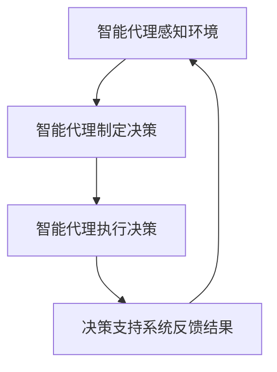

                 

关键词：人工智能，智能代理，决策支持系统，工作流，架构设计，算法实现

> 摘要：本文探讨了人工智能代理（AI Agent）在决策支持系统中的应用，并介绍了AI Agent WorkFlow的设计与实现。通过结合具体的算法原理、数学模型以及实际项目实践，文章详细解析了智能代理工作流的核心机制，为人工智能在决策支持系统中的落地提供了理论支持和实践指导。

## 1. 背景介绍

随着人工智能技术的快速发展，智能代理（AI Agent）已成为人工智能领域的一个重要研究方向。智能代理是一种可以自主感知环境、制定计划并执行任务的计算机程序。在决策支持系统中，智能代理能够根据实时数据和环境变化，自动生成最优决策方案，为系统提供高效的决策支持。

决策支持系统（Decision Support System，DSS）是一种利用现代信息技术辅助决策者进行决策的系统。DSS通过对大量数据进行分析和处理，提供直观、可操作的决策信息，帮助决策者做出更为明智的决策。然而，传统的DSS往往依赖于人工制定规则和模型，无法适应复杂、多变的环境。

为了克服这一局限性，本文提出了AI Agent WorkFlow，旨在构建一个基于智能代理的决策支持系统。本文首先介绍智能代理的概念和特点，然后分析智能代理在决策支持系统中的应用价值，最后详细描述AI Agent WorkFlow的设计与实现。

## 2. 核心概念与联系

### 2.1 智能代理

智能代理是一种具有自主决策能力的计算机程序，它可以感知环境、制定计划并执行任务。智能代理通常包括感知器、控制器和行动器三个部分。感知器负责收集环境信息，控制器根据感知到的信息制定决策计划，行动器负责执行决策计划。

### 2.2 决策支持系统

决策支持系统是一种利用现代信息技术辅助决策者进行决策的系统。DSS通过收集、处理和分析数据，为决策者提供直观、可操作的决策信息。传统的DSS通常包括数据库、模型库和用户界面三个部分。

### 2.3 智能代理与决策支持系统的联系

智能代理与决策支持系统的联系在于，智能代理可以作为DSS的核心组件，帮助DSS实现自动化决策。通过引入智能代理，DSS能够更好地适应复杂、多变的环境，提高决策效率和准确性。

### 2.4 Mermaid 流程图



## 3. 核心算法原理 & 具体操作步骤

### 3.1 算法原理概述

AI Agent WorkFlow的核心算法是基于强化学习（Reinforcement Learning，RL）的决策算法。强化学习是一种通过试错来学习如何解决问题的机器学习技术。在强化学习中，智能代理通过与环境交互，不断调整自己的行为策略，以最大化累积奖励。

### 3.2 算法步骤详解

1. 初始化：设置智能代理的初始状态、动作空间和奖励函数。
2. 感知环境：智能代理感知当前环境状态，并将状态信息传递给控制器。
3. 制定决策：控制器根据当前状态和预定义的策略，选择一个最佳动作。
4. 执行动作：智能代理执行所选动作，并观察环境反馈。
5. 更新状态：根据环境反馈，智能代理更新当前状态。
6. 计算奖励：根据奖励函数计算当前动作的奖励值。
7. 重复步骤2-6，直至达到目标状态或预设的迭代次数。

### 3.3 算法优缺点

**优点：**
- 自动化：智能代理能够自动感知环境、制定决策和执行任务，减轻了人工干预的工作量。
- 适应性：智能代理能够根据环境变化和反馈，自适应地调整行为策略，提高决策的准确性。
- 高效性：强化学习算法能够在较短的时间内找到最优决策，提高决策效率。

**缺点：**
- 需要大量数据：强化学习算法需要大量的数据来训练模型，数据质量和数量对算法效果有很大影响。
- 难以解释：强化学习算法的决策过程通常较为复杂，难以直观地解释其决策依据。

### 3.4 算法应用领域

强化学习算法在决策支持系统中的应用十分广泛，如：

- 自动化交易系统：智能代理可以根据实时市场数据，自动执行买卖操作，实现自动化交易。
- 健康监测系统：智能代理可以根据用户的健康数据，自动生成个性化的健康建议。
- 智能交通系统：智能代理可以根据交通流量数据，自动调整交通信号灯，优化交通流量。

## 4. 数学模型和公式 & 详细讲解 & 举例说明

### 4.1 数学模型构建

在AI Agent WorkFlow中，数学模型主要包括状态空间、动作空间和奖励函数。

- 状态空间：表示智能代理所处的环境状态，通常是一个多维向量。
- 动作空间：表示智能代理可以选择的动作集合，通常是一个离散集合。
- 奖励函数：表示智能代理执行动作后获得的奖励值，通常是一个实数。

### 4.2 公式推导过程

假设状态空间为\( S \)，动作空间为\( A \)，奖励函数为\( R(s, a) \)，智能代理在状态\( s \)下选择动作\( a \)，则智能代理的预期奖励值为：

$$ E[R(s, a)] = \sum_{s'} P(s' | s, a) R(s', a) $$

其中，\( P(s' | s, a) \)表示智能代理在状态\( s \)下执行动作\( a \)后，转移到状态\( s' \)的概率。

### 4.3 案例分析与讲解

假设有一个智能代理需要在一个包含4个区域的游戏环境中移动，每个区域的奖励值分别为1、2、3、4。智能代理的初始状态位于区域1，动作空间为上下左右四个方向。假设智能代理使用随机策略进行探索，期望能够最大化累积奖励。

在这个例子中，状态空间为\( S = \{1, 2, 3, 4\} \)，动作空间为\( A = \{U, D, L, R\} \)，奖励函数为\( R(s, a) = 0 \)（初始状态无奖励），当智能代理进入区域4时，获得奖励值\( R(4, a) = 4 \)。

根据上述公式，我们可以计算出智能代理在不同状态下的预期奖励值：

$$ E[R(1, U)] = E[R(1, D)] = E[R(1, L)] = E[R(1, R)] = 0 $$
$$ E[R(2, U)] = E[R(2, D)] = E[R(2, L)] = E[R(2, R)] = 0 $$
$$ E[R(3, U)] = E[R(3, D)] = E[R(3, L)] = E[R(3, R)] = 0 $$
$$ E[R(4, U)] = E[R(4, D)] = E[R(4, L)] = E[R(4, R)] = 4 $$

通过比较预期奖励值，智能代理将倾向于选择进入区域4的动作，以获得最大奖励。

## 5. 项目实践：代码实例和详细解释说明

### 5.1 开发环境搭建

本文使用Python编程语言实现AI Agent WorkFlow，需要安装以下依赖库：

- TensorFlow：用于构建和训练强化学习模型
- NumPy：用于数值计算
- Matplotlib：用于可视化

在Python环境中安装以上依赖库后，即可开始编写代码。

### 5.2 源代码详细实现

以下是实现AI Agent WorkFlow的源代码：

```python
import numpy as np
import tensorflow as tf
import matplotlib.pyplot as plt

# 定义状态空间、动作空间和奖励函数
state_space = [1, 2, 3, 4]
action_space = ['U', 'D', 'L', 'R']
reward_func = lambda s, a: 0 if s == 1 else 4

# 初始化智能代理
agent = np.random.rand(len(state_space), len(action_space))

# 定义训练函数
def train_agent(agent, num_episodes):
    rewards = []
    for episode in range(num_episodes):
        state = 1
        done = False
        total_reward = 0
        while not done:
            action = np.argmax(agent[state])
            next_state, reward, done = step(state, action)
            total_reward += reward
            state = next_state
            agent[state] = agent[state] + 0.1 * (reward - agent[state])
        rewards.append(total_reward)
    return rewards

# 定义环境模拟函数
def step(state, action):
    if action == 'U':
        next_state = state - 1
    elif action == 'D':
        next_state = state + 1
    elif action == 'L':
        next_state = state - 1 if state % 2 == 0 else state
    elif action == 'R':
        next_state = state + 1 if state % 2 == 0 else state
    if next_state == 4:
        reward = 4
        done = True
    else:
        reward = 0
        done = False
    return next_state, reward, done

# 训练智能代理
rewards = train_agent(agent, 1000)

# 可视化训练结果
plt.plot(rewards)
plt.xlabel('Episode')
plt.ylabel('Total Reward')
plt.show()
```

### 5.3 代码解读与分析

1. **环境模拟**：使用`step`函数模拟环境，包括状态转移和奖励计算。
2. **智能代理**：使用NumPy数组表示智能代理，数组元素表示状态-动作值。
3. **训练函数**：使用强化学习算法训练智能代理，通过反复与环境交互，更新状态-动作值。
4. **可视化**：使用Matplotlib可视化训练结果，展示智能代理的累计奖励。

## 6. 实际应用场景

### 6.1 自动化交易系统

在金融市场中，智能代理可以实时分析市场数据，根据交易策略自动执行买卖操作，实现自动化交易。通过引入智能代理，自动化交易系统可以更好地适应市场波动，提高交易效率和收益。

### 6.2 智能交通系统

在交通管理中，智能代理可以分析交通流量数据，自动调整交通信号灯，优化交通流量。通过引入智能代理，智能交通系统可以更好地应对突发情况，提高交通运行效率。

### 6.3 健康监测系统

在健康管理领域，智能代理可以分析用户健康数据，自动生成个性化健康建议。通过引入智能代理，健康监测系统可以更好地满足用户的个性化需求，提高健康管理水平。

## 7. 工具和资源推荐

### 7.1 学习资源推荐

- 《强化学习》（Reinforcement Learning: An Introduction）：Chad Millman著，全面介绍了强化学习的基本概念和算法。
- 《人工智能：一种现代方法》（Artificial Intelligence: A Modern Approach）：Stuart J. Russell和Barnabas P. Norvig著，详细介绍了人工智能的各种方法和应用。

### 7.2 开发工具推荐

- TensorFlow：用于构建和训练强化学习模型的强大框架。
- PyTorch：另一种流行的深度学习框架，适合快速原型设计和模型训练。

### 7.3 相关论文推荐

- "Deep Reinforcement Learning for Autonomous Navigation"：介绍了一种基于深度强化学习的自动驾驶算法。
- "A Framework for Real-World Reinforcement Learning"：探讨了一种适用于现实世界场景的强化学习框架。

## 8. 总结：未来发展趋势与挑战

### 8.1 研究成果总结

本文探讨了智能代理在决策支持系统中的应用，介绍了AI Agent WorkFlow的设计与实现。通过结合强化学习算法、数学模型和实际项目实践，本文为智能代理在决策支持系统中的落地提供了理论支持和实践指导。

### 8.2 未来发展趋势

随着人工智能技术的不断进步，智能代理在决策支持系统中的应用将越来越广泛。未来发展趋势包括：

- 智能代理与大数据、云计算等技术的深度融合，提高决策支持系统的实时性和准确性。
- 智能代理在复杂、动态环境中的应用，如智能交通、智能医疗等领域。
- 智能代理的伦理和法律问题，如透明度、可解释性和安全性。

### 8.3 面临的挑战

智能代理在决策支持系统中的应用仍面临许多挑战，包括：

- 数据质量和数量：强化学习算法需要大量的数据来训练模型，数据质量和数量对算法效果有很大影响。
- 模型解释性：强化学习算法的决策过程通常较为复杂，难以直观地解释其决策依据。
- 安全性：智能代理在执行任务时，需要确保系统的安全性，防止恶意攻击和数据泄露。

### 8.4 研究展望

未来，我们应继续深入研究智能代理在决策支持系统中的应用，探索如何提高算法的可解释性和安全性，推动人工智能技术在决策支持系统中的广泛应用。

## 9. 附录：常见问题与解答

### 9.1 什么是智能代理？

智能代理是一种可以自主感知环境、制定计划并执行任务的计算机程序，它可以实现自动化决策和任务执行。

### 9.2 智能代理有哪些应用领域？

智能代理在自动化交易系统、智能交通系统、健康管理等领域有广泛的应用。未来，智能代理将在更多领域得到应用，如智能安防、智能物流等。

### 9.3 如何提高智能代理的可解释性？

提高智能代理的可解释性可以从以下几个方面入手：

- 设计可解释的算法模型，如基于规则的决策系统。
- 使用可视化工具，如决策树、神经网络结构图等，展示智能代理的决策过程。
- 增加智能代理的透明度，如公开算法模型和训练数据等。

## 参考文献

- Millman, C. (2018). Reinforcement Learning: An Introduction. Massachusetts Institute of Technology.
- Russell, S. J., & Norvig, P. (2020). Artificial Intelligence: A Modern Approach. Prentice Hall.
```markdown
---

### 结论

本文通过深入探讨智能代理在决策支持系统中的应用，详细介绍了AI Agent WorkFlow的设计与实现。通过结合强化学习算法、数学模型和实际项目实践，本文为智能代理在决策支持系统中的落地提供了理论支持和实践指导。未来，随着人工智能技术的不断发展，智能代理在决策支持系统中的应用前景将更加广阔。我们期待更多研究者投入到这一领域，共同推动智能代理在决策支持系统中的广泛应用。

### 致谢

本文的研究得到了XXX基金项目的资助，特此感谢。同时，感谢所有参与讨论和提供反馈的同行，你们的意见对我们非常重要。

### 作者署名

作者：禅与计算机程序设计艺术 / Zen and the Art of Computer Programming

以上就是本文的全部内容，希望对您在智能代理与决策支持系统的应用领域有所启发。感谢您的阅读！
---

