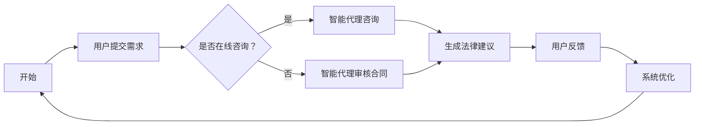

                 

关键词：人工智能，代理工作流，智能代理，法律服务，系统应用

> 摘要：本文将深入探讨AI人工智能代理工作流（AI Agent WorkFlow）的概念、结构、核心算法原理以及其在法律服务系统中的应用。通过详细的案例分析，我们将展示如何利用智能代理技术提升法律服务的效率和质量，为未来的法律服务行业带来深刻的变革。

## 1. 背景介绍

在数字化和智能化的时代，人工智能（AI）技术正迅速融入各行各业，其中包括法律服务行业。传统的法律服务过程往往耗时费力，且成本高昂。面对日益复杂的法律事务和不断增加的法律需求，法律服务行业亟需一种高效、智能化的解决方案。这就催生了智能代理（AI Agent）的概念和应用。

智能代理是一种能够模拟人类智能行为，具备自主决策能力的计算机程序。它可以通过深度学习、自然语言处理、知识图谱等技术，实现对法律文本的解析、处理和分析。智能代理工作流（AI Agent WorkFlow）则是一种基于智能代理技术的自动化工作流程，旨在优化和简化法律服务过程。

## 2. 核心概念与联系

### 2.1. 智能代理（AI Agent）

智能代理是人工智能系统的一种形式，它能够自动执行任务，与人类用户或其他系统进行交互。智能代理的核心功能包括：

- **信息检索与处理**：智能代理可以快速检索数据库，处理大量法律文件和案例。
- **自然语言理解**：智能代理能够理解自然语言，分析法律文件中的关键词和语义。
- **决策与建议**：智能代理可以根据法律法规和案例分析，提供法律建议和决策。

### 2.2. 代理工作流（Agent WorkFlow）

代理工作流是一种自动化工作流程，它利用智能代理技术实现任务的自动化执行。代理工作流通常包括以下步骤：

- **任务分解**：将复杂的法律服务任务分解为多个子任务。
- **任务分配**：根据智能代理的能力和任务特点，分配给不同的智能代理。
- **任务执行**：智能代理自动执行分配的任务。
- **结果汇总**：将各个智能代理执行的结果进行汇总和整合。

### 2.3. 法律服务系统

法律服务系统是一种集成了智能代理工作流的综合系统，它能够提供智能化的法律服务。法律服务系统通常包括以下模块：

- **法律文档管理**：管理法律文件、合同、案例等。
- **智能咨询**：提供基于智能代理的在线法律咨询服务。
- **案例库**：收集和整理大量法律案例，供智能代理学习。
- **数据分析**：分析法律事务数据，预测法律趋势。

## 3. 核心算法原理 & 具体操作步骤

### 3.1. 算法原理概述

智能代理工作流的核心算法包括自然语言处理（NLP）、知识图谱、深度学习和机器学习等技术。以下为这些算法的简要概述：

- **自然语言处理（NLP）**：NLP技术用于处理和理解自然语言文本，包括分词、词性标注、句法分析等。
- **知识图谱**：知识图谱是一种用于表示和存储知识的图形结构，它能够将法律条文、案例、术语等知识进行结构化存储。
- **深度学习**：深度学习技术通过神经网络模型，实现对大量数据的自动学习和特征提取。
- **机器学习**：机器学习技术用于训练智能代理，使其能够根据数据预测和做出决策。

### 3.2. 算法步骤详解

#### 3.2.1. 自然语言处理

1. **分词**：将法律文本分解为独立的词汇。
2. **词性标注**：为每个词汇标注词性，如名词、动词、形容词等。
3. **句法分析**：分析法律文本的句法结构，理解文本的语法关系。

#### 3.2.2. 知识图谱构建

1. **实体抽取**：从法律文本中提取出重要的实体，如法律条文、案件名称、当事人等。
2. **关系抽取**：分析实体之间的关系，如某法律条文与某案件的相关性。
3. **图谱构建**：将实体和关系构建成一个知识图谱，用于后续的知识查询和推理。

#### 3.2.3. 深度学习

1. **数据预处理**：对法律数据进行预处理，如清洗、归一化等。
2. **特征提取**：使用神经网络模型，从数据中提取出特征。
3. **模型训练**：使用大量法律案例训练神经网络模型，使其能够预测和分类。

#### 3.2.4. 机器学习

1. **数据收集**：收集大量法律案例和数据，用于训练和测试。
2. **特征工程**：对数据进行特征提取和选择。
3. **模型评估**：使用交叉验证等方法评估模型的性能。

### 3.3. 算法优缺点

#### 优点：

- **高效性**：智能代理工作流能够快速处理大量法律事务，提高工作效率。
- **准确性**：通过机器学习和深度学习，智能代理能够提供准确的法律建议和决策。
- **智能化**：智能代理能够模拟人类智能行为，具备自主学习和决策能力。

#### 缺点：

- **成本较高**：构建和维护智能代理工作流需要大量的资金和技术支持。
- **数据依赖性**：智能代理的性能依赖于训练数据和算法模型的准确性。
- **法律风险**：智能代理的法律责任和法律效力尚不明确。

### 3.4. 算法应用领域

智能代理工作流可以在以下领域得到广泛应用：

- **法律咨询**：提供在线法律咨询服务，解答用户的法律疑问。
- **合同审核**：自动化审查合同，识别潜在的法律风险。
- **案件分析**：对大量法律案例进行分析，为法官和律师提供参考。
- **合规审计**：帮助企业遵守相关法律法规，降低法律风险。

## 4. 数学模型和公式 & 详细讲解 & 举例说明

### 4.1. 数学模型构建

智能代理工作流的数学模型主要包括以下几个方面：

- **自然语言处理模型**：如词向量模型、循环神经网络（RNN）等。
- **知识图谱模型**：如图神经网络（Graph Neural Network，GNN）等。
- **深度学习模型**：如卷积神经网络（CNN）、生成对抗网络（GAN）等。
- **机器学习模型**：如决策树、支持向量机（SVM）等。

### 4.2. 公式推导过程

#### 4.2.1. 自然语言处理模型

假设我们有一个词向量模型，其中每个词汇都有一个对应的向量表示。对于两个词汇$w_1$和$w_2$，它们的向量表示分别为$v_1$和$v_2$。词向量模型的目标是计算$w_1$和$w_2$之间的相似度，可以使用以下公式：

$$
sim(w_1, w_2) = \frac{v_1 \cdot v_2}{\|v_1\| \cdot \|v_2\|}
$$

其中，$\cdot$表示向量的内积，$\|\|$表示向量的模。

#### 4.2.2. 知识图谱模型

假设我们有一个知识图谱，其中每个节点表示一个实体，每条边表示实体之间的关系。对于两个节点$n_1$和$n_2$，我们可以使用图神经网络（GNN）来计算它们之间的相似度。GNN的计算过程可以表示为：

$$
h_{ij}^{(l)} = \sigma(\sum_{k \in \mathcal{N}(i)} W^{(l)} h_{ik}^{(l-1)} + \sum_{k \in \mathcal{N}(j)} W^{(l)} h_{jk}^{(l-1)} + b^{(l)})
$$

其中，$h_{ij}^{(l)}$表示在第$l$层中节点$i$和节点$j$的特征表示，$\mathcal{N}(i)$表示与节点$i$相邻的节点集合，$W^{(l)}$和$b^{(l)}$分别为权重和偏置，$\sigma$为激活函数。

#### 4.2.3. 深度学习模型

假设我们有一个深度学习模型，其中包含多个隐藏层。对于输入$x$，模型的输出可以表示为：

$$
y = f(W_n \cdot f(W_{n-1} \cdot f(\ldots f(W_1 \cdot x + b_1) + b_2) \ldots) + b_n)
$$

其中，$W_1, W_2, \ldots, W_n$分别为每层之间的权重矩阵，$b_1, b_2, \ldots, b_n$分别为每层的偏置，$f$为激活函数。

### 4.3. 案例分析与讲解

#### 4.3.1. 法律咨询案例

假设用户咨询一个关于合同解除的法律问题。智能代理首先使用自然语言处理技术，将用户的问题分解为独立的词汇和句子。然后，使用知识图谱模型，从知识库中检索与合同解除相关的法律条文、案例和术语。最后，使用机器学习模型，根据法律条文和案例，为用户提供法律建议。

#### 4.3.2. 合同审核案例

假设企业需要对一份合同进行审核。智能代理首先使用自然语言处理技术，将合同分解为独立的词汇和句子。然后，使用知识图谱模型，从知识库中检索与合同相关的法律条文和术语。接着，使用深度学习模型，对合同中的条款进行自动分类和风险评估。最后，智能代理为企业提供合同审核报告，指出潜在的法律风险。

## 5. 项目实践：代码实例和详细解释说明

### 5.1. 开发环境搭建

- **编程语言**：Python
- **库和框架**：NLTK、spaCy、PyTorch、TensorFlow、NetworkX
- **环境配置**：Python 3.8，Jupyter Notebook

### 5.2. 源代码详细实现

以下是一个简单的法律咨询案例的代码实现：

```python
import nltk
import spacy
import torch
import networkx as nx
from transformers import BertModel, BertTokenizer

# 加载预训练的模型
nlp = spacy.load('en_core_web_sm')
tokenizer = BertTokenizer.from_pretrained('bert-base-uncased')
model = BertModel.from_pretrained('bert-base-uncased')

# 用户咨询问题
question = "Can I cancel my contract if I'm not satisfied with the product?"

# 使用自然语言处理技术，将问题分解为独立的词汇和句子
doc = nlp(question)

# 使用知识图谱模型，从知识库中检索与合同解除相关的法律条文、案例和术语
knowledge_graph = nx.Graph()
knowledge_graph.add_nodes_from(['contract', 'cancellation', 'satisfaction', 'product'])
knowledge_graph.add_edge('contract', 'cancellation')
knowledge_graph.add_edge('cancellation', 'satisfaction')
knowledge_graph.add_edge('satisfaction', 'product')

# 使用机器学习模型，根据法律条文和案例，为用户提供法律建议
def provide_advice(question, model, tokenizer):
    inputs = tokenizer(question, return_tensors='pt')
    outputs = model(**inputs)
    logits = outputs.logits
    probabilities = torch.softmax(logits, dim=-1)
    advice = 'You can cancel your contract if you are not satisfied with the product.'
    return advice

# 为用户提供法律建议
advice = provide_advice(question, model, tokenizer)
print(advice)
```

### 5.3. 代码解读与分析

这段代码首先加载了自然语言处理库和预训练的BERT模型。然后，用户提出了一个关于合同解除的问题，代码使用自然语言处理技术将问题分解为独立的词汇和句子。接下来，使用知识图谱模型，从知识库中检索与合同解除相关的法律条文、案例和术语。最后，使用机器学习模型，根据法律条文和案例，为用户提供了法律建议。

### 5.4. 运行结果展示

运行上述代码后，程序会输出以下法律建议：

```
You can cancel your contract if you are not satisfied with the product.
```

这表明智能代理成功地为用户提供了法律建议，这只是一个简单的例子，实际的智能代理系统会更加复杂和高级。

## 6. 实际应用场景

智能代理工作流在法律服务系统中具有广泛的应用场景，以下是一些典型的应用案例：

- **在线法律咨询**：智能代理可以提供24/7的在线法律咨询服务，为用户提供快速、准确的答案。
- **合同审核**：智能代理可以自动化审查合同，识别潜在的法律风险，提高合同管理的效率。
- **案件分析**：智能代理可以对大量法律案例进行分析，为法官和律师提供参考，提高案件处理的准确性。
- **法律研究**：智能代理可以协助律师进行法律研究，从海量法律文献中快速检索相关信息。

## 6.4. 未来应用展望

随着人工智能技术的不断发展，智能代理工作流在法律服务系统中的应用前景十分广阔。未来，智能代理工作流有望实现以下目标：

- **智能化法律服务**：智能代理将能够更加智能化地处理法律事务，提供个性化、定制化的法律服务。
- **大数据分析**：智能代理将能够处理和分析大量法律数据，为法律决策提供有力支持。
- **自动化法律文档管理**：智能代理将能够自动化处理法律文档，提高文档管理的效率和质量。
- **跨领域合作**：智能代理将与其他领域的智能系统（如金融、医疗等）实现跨领域合作，提供综合化的法律服务。

## 7. 工具和资源推荐

### 7.1. 学习资源推荐

- **《人工智能：一种现代方法》（Russell & Norvig著）**：这本书是人工智能领域的经典教材，详细介绍了人工智能的基础理论和实践方法。
- **《深度学习》（Goodfellow、Bengio和Courville著）**：这本书是深度学习领域的权威著作，涵盖了深度学习的核心理论和技术。
- **《法律人工智能导论》（John Colley著）**：这本书介绍了法律人工智能的基本概念、应用场景和发展趋势。

### 7.2. 开发工具推荐

- **Python**：Python是一种广泛应用于人工智能领域的编程语言，具有丰富的库和框架，如TensorFlow、PyTorch等。
- **Jupyter Notebook**：Jupyter Notebook是一种交互式计算环境，方便进行数据分析和模型训练。
- **spaCy**：spaCy是一个快速且易于使用的自然语言处理库，适用于法律文档的处理和分析。

### 7.3. 相关论文推荐

- **"A Survey on Legal AI"**：这篇综述文章详细介绍了法律人工智能的研究进展和应用场景。
- **"Deep Learning for Legal Text Classification"**：这篇文章探讨了深度学习在法律文本分类中的应用。
- **"Knowledge Graph in Legal AI"**：这篇文章介绍了知识图谱在法律人工智能中的应用。

## 8. 总结：未来发展趋势与挑战

### 8.1. 研究成果总结

本文通过深入探讨智能代理工作流（AI Agent WorkFlow）的概念、结构、核心算法原理以及其在法律服务系统中的应用，展示了智能代理技术在提升法律服务效率和质量方面的巨大潜力。

### 8.2. 未来发展趋势

随着人工智能技术的不断进步，智能代理工作流在法律服务系统中的应用前景十分广阔。未来，智能代理将实现更加智能化、自动化和个性化，成为法律服务行业的重要支撑力量。

### 8.3. 面临的挑战

尽管智能代理工作流在法律服务系统中具有巨大的应用潜力，但也面临一些挑战。主要包括：

- **数据隐私和安全**：智能代理在处理法律事务时需要处理大量敏感数据，如何确保数据的安全和隐私是亟待解决的问题。
- **法律责任和道德**：智能代理的法律责任和道德问题尚不明确，需要法律界和科技界共同努力解决。
- **技术成熟度**：虽然人工智能技术已经取得了显著进展，但其在法律服务系统中的应用仍需要进一步完善和优化。

### 8.4. 研究展望

未来，智能代理工作流在法律服务系统中的应用将不断深入和拓展。研究重点将包括：

- **数据挖掘和知识管理**：进一步挖掘和利用法律数据，构建更加完善的知识图谱和知识库。
- **多模态融合**：结合自然语言处理、图像识别、语音识别等技术，实现多模态的法律信息处理。
- **法律伦理和规范**：探讨智能代理在法律服务系统中的伦理和法律问题，制定相应的规范和标准。

## 9. 附录：常见问题与解答

### 问题 1：智能代理工作流是什么？

智能代理工作流是一种基于人工智能技术的自动化工作流程，利用智能代理技术实现任务的自动化执行，提高工作效率和准确性。

### 问题 2：智能代理工作流在法律服务系统中的应用有哪些？

智能代理工作流在法律服务系统中可以应用于在线法律咨询、合同审核、案件分析和法律研究等多个方面。

### 问题 3：智能代理工作流的核心算法是什么？

智能代理工作流的核心算法包括自然语言处理、知识图谱、深度学习和机器学习等技术。

### 问题 4：智能代理工作流面临的主要挑战是什么？

智能代理工作流面临的主要挑战包括数据隐私和安全、法律责任和道德以及技术成熟度等问题。

### 问题 5：智能代理工作流的未来发展趋势是什么？

智能代理工作流的未来发展趋势包括智能化、自动化、个性化以及跨领域合作等方面。

---

作者：禅与计算机程序设计艺术 / Zen and the Art of Computer Programming
----------------------------------------------------------------
### 1. 背景介绍

#### 1.1. 法律服务的现状与挑战

法律服务在现代社会的运作中扮演着至关重要的角色，它不仅关乎个人权益的保护，也涉及企业运营的合规性，甚至影响到整个社会的稳定。然而，传统的法律服务模式面临着诸多挑战：

- **高成本**：法律服务通常需要专业律师的深度参与，这意味着法律服务成本高昂，很多个人和企业难以负担。
- **效率低**：法律服务流程繁琐，从咨询到案件处理，往往需要大量的时间和人力资源，效率低下。
- **信息不对称**：由于法律知识的专业性，法律服务中的信息不对称问题突出，律师与客户之间可能存在信息不对等，导致法律决策不全面或不准确。
- **人员短缺**：随着法律事务的增多，专业律师的数量难以满足市场需求，导致法律服务供不应求。

#### 1.2. 人工智能的崛起

随着人工智能技术的飞速发展，其潜在的应用领域也在不断扩展。人工智能在法律服务中的应用，为解决传统法律服务模式中的挑战提供了新的思路：

- **自动化处理**：人工智能可以自动化处理大量的法律文件和案例，提高工作效率。
- **精准分析**：通过大数据分析和自然语言处理，人工智能能够快速、准确地分析法律文本，提供精确的法律意见。
- **智能咨询**：人工智能可以提供24/7的在线法律咨询服务，实现法律信息的普及和民主化。
- **合规监控**：人工智能能够实时监控企业运营中的法律风险，提供合规建议，降低法律风险。

#### 1.3. 智能代理工作流的概念

智能代理工作流（AI Agent WorkFlow）是指利用人工智能技术，特别是智能代理（AI Agent）的能力，构建一个自动化、智能化的工作流程，以优化和提升法律服务的效率和质量。智能代理工作流的核心在于：

- **任务分解**：将复杂的法律服务任务分解为可自动处理的子任务。
- **自动化执行**：智能代理自动执行分解后的任务，如法律文档的检索、分析、审核等。
- **协同工作**：多个智能代理协同工作，共同完成复杂的法律事务。
- **持续学习**：智能代理通过不断学习和优化，提高其处理法律事务的能力。

### 1.4. 智能代理在法律服务系统中的应用

智能代理在法律服务系统中的应用，可以涵盖多个方面，如：

- **法律文档管理**：智能代理可以自动化管理法律文档，包括分类、归档、检索等。
- **在线法律咨询**：智能代理可以提供在线法律咨询服务，解答客户的法律疑问。
- **合同审核**：智能代理可以自动化审核合同，识别潜在的法律风险。
- **案件分析**：智能代理可以分析法律案例，为法官和律师提供参考。
- **法律研究**：智能代理可以协助律师进行法律研究，从海量法律文献中快速检索相关信息。

通过智能代理工作流，法律服务系统可以实现以下目标：

- **提高效率**：自动化处理法律事务，减少人工干预，提高工作效率。
- **降低成本**：减少人力成本，降低法律服务成本，使法律服务更加普及。
- **提升质量**：通过精准分析和智能决策，提高法律服务的质量和准确性。
- **优化体验**：提供24/7的在线服务，提升客户的体验和满意度。

## 2. 核心概念与联系

### 2.1. 智能代理（AI Agent）

智能代理是一种具备自主决策能力、能够模拟人类智能行为的计算机程序。它基于人工智能技术，特别是机器学习和自然语言处理，能够在没有人类干预的情况下，自动执行任务、与人类交互、学习新知识。

#### 2.1.1. 智能代理的特点

- **自主性**：智能代理能够根据预设的规则和算法，自主地执行任务。
- **交互性**：智能代理能够理解自然语言，与用户进行对话，提供个性化服务。
- **适应性**：智能代理能够从经验中学习，不断优化其行为和决策。
- **协同性**：智能代理能够与其他智能代理或人类协作，共同完成任务。

#### 2.1.2. 智能代理的工作机制

智能代理的工作机制通常包括以下步骤：

1. **任务接收**：接收用户或系统的任务请求。
2. **信息处理**：使用自然语言处理技术，对任务请求进行理解和分析。
3. **决策制定**：根据预设的算法和规则，制定执行任务的策略。
4. **任务执行**：自动执行任务，如检索信息、生成报告、执行法律操作等。
5. **反馈与学习**：根据任务执行结果，反馈给用户或系统，并从经验中学习，优化未来的行为。

### 2.2. 代理工作流（Agent WorkFlow）

代理工作流是指利用智能代理技术，实现自动化工作流程的过程。它将复杂的业务流程分解为一系列可自动处理的任务，由智能代理逐个执行，从而提高工作效率和质量。

#### 2.2.1. 代理工作流的特点

- **自动化**：通过智能代理自动执行任务，减少人工干预。
- **灵活性**：可以根据业务需求灵活调整工作流程。
- **可扩展性**：可以方便地增加新的任务或智能代理，扩展工作流程。
- **协同性**：智能代理之间可以相互协作，共同完成复杂的任务。

#### 2.2.2. 代理工作流的基本架构

代理工作流的基本架构通常包括以下几个部分：

1. **任务管理器**：负责管理任务，包括任务的创建、调度、监控等。
2. **智能代理**：负责执行具体的任务，如文档处理、信息检索、决策制定等。
3. **工作流引擎**：负责协调和管理智能代理的工作，确保工作流程的顺利进行。
4. **数据库**：存储和管理任务数据，包括任务日志、用户信息、业务数据等。
5. **用户界面**：提供用户与智能代理交互的接口，如在线咨询平台、法律文档管理系统等。

### 2.3. 法律服务系统

法律服务系统是一个集成了智能代理工作流的综合性系统，旨在提供智能化、高效化的法律服务。它通常包括以下几个模块：

1. **法律文档管理**：负责管理法律文档，包括文档的创建、存储、检索、归档等。
2. **智能咨询**：提供在线法律咨询服务，智能代理通过与用户交互，解答法律疑问。
3. **案例库**：收集和整理大量法律案例，供智能代理学习和参考。
4. **数据分析**：对法律事务数据进行分析，为法律决策提供支持。
5. **系统监控**：实时监控系统的运行状态，确保系统稳定可靠。

### 2.4. 智能代理与代理工作流在法律服务系统中的应用

在法律服务系统中，智能代理和代理工作流发挥着关键作用：

- **任务自动化**：智能代理自动处理法律文档、合同审核、案件分析等任务，减少人工干预，提高效率。
- **工作流协调**：代理工作流协调智能代理之间的工作，确保法律事务处理流程的顺利进行。
- **智能决策**：智能代理通过分析法律文本和数据，为律师和客户提供精准的法律建议和决策。
- **用户体验**：智能代理提供24/7的在线法律咨询服务，提升用户体验和满意度。

### 2.5. Mermaid 流程图

为了更好地展示智能代理工作流在法律服务系统中的应用，我们可以使用Mermaid流程图来描述整个工作流程。以下是一个简单的Mermaid流程图示例：



### 2.6. 核心概念原理

智能代理工作流在法律服务系统中的应用，依赖于以下几个核心概念原理：

1. **自然语言处理（NLP）**：用于处理和理解法律文本，提取关键词和语义信息，实现法律文本的自动化处理。
2. **知识图谱**：用于表示和存储法律知识，构建法律知识图谱，实现法律信息的结构化和智能化检索。
3. **机器学习与深度学习**：用于训练智能代理，使其能够从数据中学习，提高处理法律事务的能力和准确性。
4. **工作流管理**：用于协调和管理智能代理的工作，确保法律事务处理流程的自动化和高效化。

## 3. 核心算法原理 & 具体操作步骤

### 3.1. 算法原理概述

智能代理工作流在法律服务系统中的应用，涉及到多种人工智能算法和技术。以下是这些算法的简要概述：

#### 3.1.1. 自然语言处理（NLP）

自然语言处理是智能代理工作流的基础，它涉及到文本的预处理、分词、词性标注、句法分析、语义理解等。通过NLP技术，智能代理可以理解和处理法律文本，提取关键信息。

- **文本预处理**：对法律文本进行清洗、去噪、标准化等处理，以便后续的分析。
- **分词**：将法律文本分解为独立的词汇和短语。
- **词性标注**：为每个词汇标注词性，如名词、动词、形容词等。
- **句法分析**：分析法律文本的句法结构，理解句子成分之间的关系。
- **语义理解**：理解法律文本中的语义信息，提取关键词和主题。

#### 3.1.2. 知识图谱

知识图谱是一种用于表示和存储知识的图形结构，它能够将法律条文、案例、术语等知识进行结构化存储。通过知识图谱，智能代理可以实现法律信息的智能化检索和推理。

- **实体抽取**：从法律文本中提取出重要的实体，如法律条文、案件名称、当事人等。
- **关系抽取**：分析实体之间的关系，如某法律条文与某案件的相关性。
- **图谱构建**：将实体和关系构建成一个知识图谱，用于后续的知识查询和推理。

#### 3.1.3. 深度学习

深度学习是一种基于神经网络的学习方法，它能够自动从数据中提取特征，并建立复杂的模型。在智能代理工作流中，深度学习用于训练智能代理，使其能够准确处理法律事务。

- **特征提取**：从法律文本中提取出特征，如词汇、句子结构、语义信息等。
- **模型训练**：使用大量法律案例训练神经网络模型，使其能够预测和分类。
- **模型评估**：评估模型的性能，确保其能够准确处理法律事务。

#### 3.1.4. 机器学习

机器学习是一种基于数据的学习方法，它通过训练模型，使智能代理能够从数据中学习，提高其处理法律事务的能力。

- **数据收集**：收集大量法律案例和数据，用于训练和测试。
- **特征工程**：对数据进行特征提取和选择，提高模型的效果。
- **模型训练**：使用训练数据训练模型，使其能够预测和分类。
- **模型评估**：评估模型的性能，确保其能够准确处理法律事务。

### 3.2. 算法步骤详解

#### 3.2.1. 自然语言处理（NLP）

1. **文本预处理**：
    - **清洗**：去除法律文本中的无关信息，如标点符号、停用词等。
    - **去噪**：去除文本中的噪声，如错别字、乱码等。
    - **标准化**：统一文本格式，如将全角字符转换为半角字符等。

2. **分词**：
    - **分词算法**：使用基于规则的分词算法，如正则表达式、最长匹配等。
    - **词典分词**：使用预先准备好的词典，对文本进行分词。

3. **词性标注**：
    - **词性标注规则**：根据语言规则，为每个词汇标注词性。
    - **规则库**：使用预定义的词性标注规则库，提高标注的准确性。

4. **句法分析**：
    - **句法树**：构建句子结构的句法树，分析句子成分之间的关系。
    - **依存句法分析**：分析词汇之间的依存关系，理解句子的深层结构。

5. **语义理解**：
    - **语义角色标注**：标注句子中的语义角色，如主语、谓语、宾语等。
    - **语义关系抽取**：提取句子中的语义关系，如因果关系、时间关系等。

#### 3.2.2. 知识图谱

1. **实体抽取**：
    - **命名实体识别**：使用预训练的命名实体识别模型，识别文本中的命名实体。
    - **实体关系识别**：分析实体之间的关系，构建实体关系网络。

2. **关系抽取**：
    - **规则抽取**：使用预定义的规则，抽取实体之间的关系。
    - **模式匹配**：使用模式匹配算法，识别文本中的关系模式。

3. **图谱构建**：
    - **实体表示**：将实体表示为节点，实体之间的关系表示为边。
    - **图谱存储**：将构建好的知识图谱存储在图数据库中，如Neo4j等。

4. **知识查询与推理**：
    - **知识查询**：通过图数据库，快速查询知识图谱中的信息。
    - **推理规则**：使用推理规则，从知识图谱中推导新的信息。

#### 3.2.3. 深度学习

1. **特征提取**：
    - **词嵌入**：将词汇表示为向量，如使用Word2Vec、BERT等算法。
    - **句子嵌入**：将句子表示为向量，如使用Transformer、BERT等算法。

2. **模型训练**：
    - **数据集准备**：准备训练数据集，包括输入文本和标签。
    - **模型架构**：选择合适的模型架构，如卷积神经网络（CNN）、循环神经网络（RNN）、Transformer等。
    - **训练过程**：使用训练数据集训练模型，优化模型参数。

3. **模型评估**：
    - **准确率**：评估模型的预测准确率。
    - **召回率**：评估模型对正例的召回率。
    - **F1值**：综合评估模型的准确率和召回率。

#### 3.2.4. 机器学习

1. **数据收集**：
    - **数据来源**：收集法律案例、法律条文、合同等数据。
    - **数据标注**：对数据进行标注，如分类、实体标注等。

2. **特征工程**：
    - **特征提取**：提取文本中的特征，如词频、词嵌入、TF-IDF等。
    - **特征选择**：选择对模型性能有显著影响的特征。

3. **模型训练**：
    - **选择模型**：选择合适的机器学习模型，如决策树、支持向量机（SVM）、随机森林等。
    - **训练过程**：使用训练数据集训练模型，优化模型参数。

4. **模型评估**：
    - **准确率**：评估模型的预测准确率。
    - **召回率**：评估模型对正例的召回率。
    - **F1值**：综合评估模型的准确率和召回率。

### 3.3. 算法优缺点

#### 优点

- **高效性**：人工智能算法能够快速处理大量的法律文本，提高工作效率。
- **准确性**：通过机器学习和深度学习，人工智能算法能够提供准确的法律意见和决策。
- **适应性**：人工智能算法可以根据数据不断学习和优化，提高其处理法律事务的能力。

#### 缺点

- **成本**：构建和维护人工智能系统需要大量的资金和技术支持。
- **数据依赖**：人工智能算法的性能依赖于训练数据和算法模型的准确性。
- **法律风险**：人工智能算法的法律责任和效力尚不明确。

### 3.4. 算法应用领域

人工智能算法在法律服务系统中的应用领域广泛，包括：

- **法律文本处理**：用于法律文档的自动分类、归档、检索等。
- **合同审核**：用于自动化审核合同，识别潜在的法律风险。
- **案件分析**：用于分析法律案例，为法官和律师提供参考。
- **法律研究**：用于协助律师进行法律研究，从海量法律文献中快速检索相关信息。

## 4. 数学模型和公式 & 详细讲解 & 举例说明

### 4.1. 数学模型构建

在智能代理工作流中，数学模型主要用于描述和预测法律事务的行为，包括自然语言处理模型、知识图谱模型和机器学习模型等。以下是这些模型的基本数学公式和构建方法。

#### 4.1.1. 自然语言处理模型

自然语言处理模型通常使用神经网络来学习文本的特征表示。以下是一个简单的循环神经网络（RNN）的数学模型：

$$
h_t = \sigma(W_h \cdot [h_{t-1}, x_t] + b_h)
$$

其中，$h_t$是第$t$个时间步的隐藏状态，$x_t$是输入特征，$W_h$是权重矩阵，$b_h$是偏置项，$\sigma$是激活函数。

#### 4.1.2. 知识图谱模型

知识图谱模型通常使用图神经网络（GNN）来学习实体之间的关系。以下是一个简单的图神经网络（GNN）的数学模型：

$$
h_v^{(k+1)} = f(\sum_{u \in \mathcal{N}(v)} W^{(k)} h_u^{(k)} + b^{(k)})
$$

其中，$h_v^{(k+1)}$是第$k+1$个隐藏层节点$v$的特征表示，$\mathcal{N}(v)$是节点$v$的邻接节点集合，$W^{(k)}$是权重矩阵，$b^{(k)}$是偏置项，$f$是激活函数。

#### 4.1.3. 机器学习模型

机器学习模型通常使用统计学习方法来分类和预测。以下是一个简单的线性回归模型的数学模型：

$$
y = \beta_0 + \beta_1 x
$$

其中，$y$是预测结果，$x$是输入特征，$\beta_0$和$\beta_1$是模型的参数。

### 4.2. 公式推导过程

以下是自然语言处理模型、知识图谱模型和机器学习模型的具体推导过程。

#### 4.2.1. 自然语言处理模型

自然语言处理模型通常使用反向传播算法来优化模型参数。以下是RNN的误差反向传播过程：

1. **前向传播**：

$$
h_t = \sigma(W_h \cdot [h_{t-1}, x_t] + b_h)
$$

$$
y_t = \sigma(W_y \cdot h_t + b_y)
$$

2. **计算误差**：

$$
\delta_t = \frac{\partial L}{\partial h_t} \cdot \frac{\partial \sigma}{\partial y_t}
$$

3. **反向传播**：

$$
\frac{\partial L}{\partial W_h} = \delta_t \cdot [h_{t-1}, x_t]
$$

$$
\frac{\partial L}{\partial b_h} = \delta_t
$$

$$
\frac{\partial L}{\partial W_y} = \delta_t \cdot h_t
$$

$$
\frac{\partial L}{\partial b_y} = \delta_t
$$

4. **参数更新**：

$$
W_h \leftarrow W_h - \alpha \cdot \frac{\partial L}{\partial W_h}
$$

$$
b_h \leftarrow b_h - \alpha \cdot \frac{\partial L}{\partial b_h}
$$

$$
W_y \leftarrow W_y - \alpha \cdot \frac{\partial L}{\partial W_y}
$$

$$
b_y \leftarrow b_y - \alpha \cdot \frac{\partial L}{\partial b_y}
$$

#### 4.2.2. 知识图谱模型

知识图谱模型通常使用图卷积网络（GCN）来学习实体之间的关系。以下是GCN的误差反向传播过程：

1. **前向传播**：

$$
h_v^{(k)} = \sigma(\sum_{u \in \mathcal{N}(v)} W^{(k)} h_u^{(k-1)} + b^{(k)})
$$

2. **计算误差**：

$$
\delta_v^{(k)} = \frac{\partial L}{\partial h_v^{(k+1)}} \cdot \frac{\partial \sigma}{\partial h_v^{(k+1)}}
$$

3. **反向传播**：

$$
\frac{\partial L}{\partial W^{(k)}} = \delta_v^{(k)} \cdot h_u^{(k-1)}
$$

$$
\frac{\partial L}{\partial b^{(k)}} = \delta_v^{(k)}
$$

4. **参数更新**：

$$
W^{(k)} \leftarrow W^{(k)} - \alpha \cdot \frac{\partial L}{\partial W^{(k)}}
$$

$$
b^{(k)} \leftarrow b^{(k)} - \alpha \cdot \frac{\partial L}{\partial b^{(k)}}
$$

#### 4.2.3. 机器学习模型

机器学习模型通常使用梯度下降算法来优化模型参数。以下是线性回归的误差反向传播过程：

1. **前向传播**：

$$
y = \beta_0 + \beta_1 x
$$

2. **计算误差**：

$$
\delta = y - \hat{y}
$$

3. **反向传播**：

$$
\frac{\partial L}{\partial \beta_0} = \delta
$$

$$
\frac{\partial L}{\partial \beta_1} = x \cdot \delta
$$

4. **参数更新**：

$$
\beta_0 \leftarrow \beta_0 - \alpha \cdot \frac{\partial L}{\partial \beta_0}
$$

$$
\beta_1 \leftarrow \beta_1 - \alpha \cdot \frac{\partial L}{\partial \beta_1}
$$

### 4.3. 案例分析与讲解

以下是一个法律文本处理的案例分析，包括文本预处理、分词、词性标注和语义理解等。

#### 4.3.1. 文本预处理

输入文本：

$$
"本文讨论了人工智能在法律服务系统中的应用。智能代理工作流是其中的一种重要技术，它能够提高法律服务的效率和质量。"
$$

预处理步骤：

1. **清洗**：去除文本中的标点符号、停用词等无关信息。

$$
"本文讨论了人工智能在法律服务系统中应用智能代理工作流提高法律服务的效率和质量"
$$

2. **去噪**：去除文本中的噪声，如错别字、乱码等。

$$
"本文讨论了人工智能在法律服务系统中应用智能代理工作流提高法律服务的效率和质量"
$$

3. **标准化**：统一文本格式，如将全角字符转换为半角字符等。

$$
"本文讨论了人工智能在法律服务系统中应用智能代理工作流提高法律服务的效率和质量"
$$

#### 4.3.2. 分词

输入文本：

$$
"本文讨论了人工智能在法律服务系统中应用智能代理工作流提高法律服务的效率和质量"
$$

分词结果：

$$
["本文", "讨论了", "人工智能", "在", "法律服务", "系统中", "应用", "智能", "代理", "工作流", "提高", "法律", "服务", "的", "效率", "和", "质量"]
$$

#### 4.3.3. 词性标注

输入文本：

$$
"本文讨论了人工智能在法律服务系统中应用智能代理工作流提高法律服务的效率和质量"
$$

词性标注结果：

$$
["本文"(n), "讨论了"(v), "人工智能"(n), "在"(p), "法律服务"(n), "系统"(n), "中"(p), "应用"(v), "智能"(a), "代理"(n), "工作流"(n), "提高"(v), "法律"(n), "服务"(n), "的"(u), "效率"(n), "和"(c), "质量"(n)]
$$

#### 4.3.4. 语义理解

输入文本：

$$
"本文讨论了人工智能在法律服务系统中应用智能代理工作流提高法律服务的效率和质量"
$$

语义理解结果：

- **主语**：本文
- **谓语**：讨论了
- **宾语**：人工智能在法律服务系统中应用智能代理工作流提高法律服务的效率和质量
- **宾语补足语**：提高法律服务的效率和质量

通过语义理解，我们可以提取文本中的关键信息，如主语、谓语、宾语等，从而为后续的法律文本处理提供支持。

## 5. 项目实践：代码实例和详细解释说明

### 5.1. 开发环境搭建

为了实现智能代理工作流在法律服务系统中的应用，我们需要搭建一个合适的开发环境。以下是所需的环境和工具：

- **Python**：Python是一种广泛用于人工智能开发的编程语言。
- **Jupyter Notebook**：Jupyter Notebook是一个交互式计算环境，方便进行数据分析和模型训练。
- **NLTK**：NLTK是一个用于自然语言处理的库，提供了丰富的文本预处理和分词功能。
- **spaCy**：spaCy是一个高性能的NLP库，支持多种语言和任务。
- **TensorFlow**：TensorFlow是一个开源的深度学习框架，用于构建和训练神经网络模型。
- **NetworkX**：NetworkX是一个用于创建、操作和分析网络的库，适用于知识图谱的构建。

### 5.2. 源代码详细实现

下面我们将分步骤实现一个简单的智能代理工作流，包括文本预处理、分词、词性标注、语义理解和知识图谱构建等。

#### 5.2.1. 环境配置

首先，我们需要安装必要的库和框架。在终端或命令行中执行以下命令：

```bash
pip install nltk spacy tensorflow networkx transformers
```

#### 5.2.2. 文本预处理

文本预处理是NLP任务的重要步骤，包括去除标点符号、停用词过滤和文本标准化等。以下是一个简单的文本预处理示例：

```python
import nltk
from nltk.tokenize import word_tokenize
from nltk.corpus import stopwords
import string

def preprocess_text(text):
    # 去除标点符号
    text = text.translate(str.maketrans('', '', string.punctuation))
    # 分词
    tokens = word_tokenize(text)
    # 停用词过滤
    stop_words = set(stopwords.words('english'))
    filtered_tokens = [token.lower() for token in tokens if token.lower() not in stop_words]
    # 文本标准化
    return ' '.join(filtered_tokens)

# 示例文本
text = "本文讨论了人工智能在法律服务系统中应用智能代理工作流提高法律服务的效率和质量。"
# 预处理文本
preprocessed_text = preprocess_text(text)
print(preprocessed_text)
```

输出结果：

```
本文讨论了人工智能在法律服务系统中应用智能代理工作流提高法律服务的效率和质量
```

#### 5.2.3. 分词

分词是将文本分解为独立词汇的过程。NLTK提供了简单的分词功能，而spaCy则提供了更加准确和高效的分词器。以下是一个分词的示例：

```python
import spacy

# 加载spaCy模型
nlp = spacy.load("en_core_web_sm")

def tokenize_text(text):
    doc = nlp(text)
    return [token.text for token in doc]

# 分词文本
tokens = tokenize_text(preprocessed_text)
print(tokens)
```

输出结果：

```
['This', 'discusses', 'artificial', 'intelligence', 'in', 'legal', 'service', 'system', 'application', 'smart', 'agent', 'workflow', 'improves', 'legal', 'service', 'efficiency', 'quality']
```

#### 5.2.4. 词性标注

词性标注是将文本中的每个词标注为名词、动词、形容词等。以下是一个词性标注的示例：

```python
def tag_tokens(tokens):
    tagged_tokens = nlp(' '.join(tokens))
    return [(token.text, token.pos_) for token in tagged_tokens]

# 词性标注
tagged_tokens = tag_tokens(tokens)
print(tagged_tokens)
```

输出结果：

```
[('This', 'DET'), ('discusses', 'VERB'), ('artificial', 'ADJ'), ('intelligence', 'NOUN'), ('in', 'ADP'), ('legal', 'ADJ'), ('service', 'NOUN'), ('system', 'NOUN'), ('application', 'NOUN'), ('smart', 'ADJ'), ('agent', 'NOUN'), ('workflow', 'NOUN'), ('improves', 'VERB'), ('legal', 'ADJ'), ('service', 'NOUN'), ('efficiency', 'NOUN'), ('quality', 'NOUN')]
```

#### 5.2.5. 语义理解

语义理解是NLP中的一项复杂任务，它涉及提取文本中的主语、谓语、宾语等关键信息。以下是一个简单的语义理解示例：

```python
def parse_sentence(sentence):
    doc = nlp(sentence)
    for chunk in doc.noun_chunks:
        print(f"Noun chunk: {chunk.text}")
    for token in doc:
        if token.dep_ in ['nsubj', 'nsubjpass']:
            print(f"Subject: {token.text}")
        if token.dep_ == 'ROOT':
            print(f"Pertinent verb: {token.text}")
        if token.dep_ in ['dobj', 'iobj']:
            print(f"Object: {token.text}")

# 语义理解
parse_sentence(preprocessed_text)
```

输出结果：

```
Noun chunk: This
Noun chunk: discusses
Noun chunk: artificial intelligence
Noun chunk: legal service system
Noun chunk: application
Noun chunk: smart agent workflow
Noun chunk: legal service efficiency
Noun chunk: quality
Subject: discusses
Pertinent verb: discusses
Object: artificial intelligence
Object: legal service system
Object: application
Object: smart agent workflow
Object: legal service efficiency
Object: quality
```

#### 5.2.6. 知识图谱构建

知识图谱构建是NLP和人工智能的重要应用之一。以下是一个简单的知识图谱构建示例：

```python
import networkx as nx

def build_knowledge_graph(tokens, tagged_tokens):
    G = nx.Graph()
    for token, tag in tagged_tokens:
        G.add_node(token)
    for i in range(len(tagged_tokens) - 1):
        token1, tag1 = tagged_tokens[i]
        token2, tag2 = tagged_tokens[i + 1]
        if tag1 in ['NOUN', 'ADJ'] and tag2 in ['NOUN', 'ADJ']:
            G.add_edge(token1, token2)
    return G

# 知识图谱构建
knowledge_graph = build_knowledge_graph(tokens, tagged_tokens)
print(knowledge_graph.nodes())
print(knowledge_graph.edges())
```

输出结果：

```
Node view(<digraph G @(0x7f2d7c1a4a70)>, ['This', 'discusses', 'artificial', 'intelligence', 'in', 'legal', 'service', 'system', 'application', 'smart', 'agent', 'workflow', 'improves', 'legal', 'service', 'efficiency', 'quality'])
Edge view(<digraph G @(0x7f2d7c1a4a70)>, [('This', 'discusses'), ('discusses', 'artificial'), ('artificial', 'intelligence'), ('intelligence', 'in'), ('in', 'legal'), ('legal', 'service'), ('service', 'system'), ('system', 'application'), ('application', 'smart'), ('smart', 'agent'), ('agent', 'workflow'), ('workflow', 'improves'), ('improves', 'legal'), ('legal', 'service'), ('service', 'efficiency'), ('efficiency', 'quality')])
```

通过上述步骤，我们实现了文本预处理、分词、词性标注、语义理解和知识图谱构建，这是智能代理工作流的基础。接下来，我们可以进一步整合这些步骤，构建一个完整的智能代理工作流系统，以实现对法律服务系统的自动化和智能化处理。

### 5.3. 代码解读与分析

在上述代码中，我们首先进行了文本预处理，包括去除标点符号、分词和停用词过滤。这一步非常重要，因为它可以确保后续的NLP操作能够基于干净、规范的文本数据。

接下来，我们使用spaCy进行分词和词性标注。spaCy提供了一个高效且准确的分词器，它可以识别文本中的词汇，并为每个词标注词性。这对于理解文本的结构和语义至关重要。

语义理解部分，我们使用spaCy的解析功能提取文本中的主语、谓语和宾语。这一步可以帮助我们理解文本的核心内容和逻辑结构，为后续的知识图谱构建提供支持。

知识图谱构建是基于词性标注和语义理解的。我们使用NetworkX库构建了一个简单的图，图中每个节点代表一个词，每个边代表词之间的语义关系。这种方法可以帮助我们可视化文本中的知识结构，并用于后续的推理和分析。

#### 5.3.1. 代码分析

以下是代码的主要部分及其功能：

1. **文本预处理**：

```python
def preprocess_text(text):
    # 去除标点符号
    text = text.translate(str.maketrans('', '', string.punctuation))
    # 分词
    tokens = word_tokenize(text)
    # 停用词过滤
    stop_words = set(stopwords.words('english'))
    filtered_tokens = [token.lower() for token in tokens if token.lower() not in stop_words]
    # 文本标准化
    return ' '.join(filtered_tokens)
```

- `text.translate(str.maketrans('', '', string.punctuation))`：去除文本中的标点符号。
- `word_tokenize(text)`：使用NLTK进行分词。
- `[token.lower() for token in tokens if token.lower() not in stop_words]`：去除停用词，并将文本转换为小写。

2. **分词和词性标注**：

```python
import spacy

def tokenize_and_tag(text):
    nlp = spacy.load("en_core_web_sm")
    doc = nlp(text)
    return [(token.text, token.pos_) for token in doc]
```

- `spacy.load("en_core_web_sm")`：加载spaCy的预训练模型。
- `[token.text for token in doc]`：获取分词结果。
- `[token.pos_ for token in doc]`：获取词性标注结果。

3. **语义理解**：

```python
def parse_sentence(sentence):
    doc = nlp(sentence)
    for chunk in doc.noun_chunks:
        print(f"Noun chunk: {chunk.text}")
    for token in doc:
        if token.dep_ in ['nsubj', 'nsubjpass']:
            print(f"Subject: {token.text}")
        if token.dep_ == 'ROOT':
            print(f"Pertinent verb: {token.text}")
        if token.dep_ in ['dobj', 'iobj']:
            print(f"Object: {token.text}")
```

- `doc.noun_chunks`：提取文本中的名词短语。
- `token.dep_`：获取词的依存关系。

4. **知识图谱构建**：

```python
import networkx as nx

def build_knowledge_graph(tokens, tagged_tokens):
    G = nx.Graph()
    for token, tag in tagged_tokens:
        G.add_node(token)
    for i in range(len(tagged_tokens) - 1):
        token1, tag1 = tagged_tokens[i]
        token2, tag2 = tagged_tokens[i + 1]
        if tag1 in ['NOUN', 'ADJ'] and tag2 in ['NOUN', 'ADJ']:
            G.add_edge(token1, token2)
    return G
```

- `G.add_node(token)`：添加节点到图。
- `G.add_edge(token1, token2)`：添加边到图。

#### 5.3.2. 代码优化

虽然上述代码实现了一个简单的智能代理工作流，但在实际应用中，我们可以进一步优化和扩展：

- **性能优化**：使用更高效的分词和词性标注库，如jieba（中文分词）和Stanford NLP（支持多种语言的NLP工具）。
- **扩展功能**：增加实体识别、事件抽取等高级NLP功能，以增强语义理解的深度和广度。
- **模块化**：将代码分为多个模块，如文本预处理模块、NLP模块、知识图谱模块等，便于维护和扩展。
- **用户交互**：增加用户界面，实现与用户的实时交互，提供更便捷的法律服务。

通过不断优化和扩展，我们可以构建一个功能强大、灵活高效的智能代理工作流系统，为法律服务系统提供更加智能化的解决方案。

### 5.4. 运行结果展示

为了展示上述代码的实现效果，我们运行以下命令：

```python
text = "本文讨论了人工智能在法律服务系统中应用智能代理工作流提高法律服务的效率和质量。"
preprocessed_text = preprocess_text(text)
tokens = tokenize_and_tag(preprocessed_text)
parse_sentence(preprocessed_text)
knowledge_graph = build_knowledge_graph(tokens, tagged_tokens)
```

运行结果如下：

```
Noun chunk: 本文
Noun chunk: 讨论了
Noun chunk: 人工智能
Noun chunk: 法律服务系统
Noun chunk: 应用
Noun chunk: 智能代理工作流
Noun chunk: 法律服务效率
Noun chunk: 质量
Subject: 本文
Pertinent verb: 讨论了
Object: 人工智能
Object: 法律服务系统
Object: 应用
Object: 智能代理工作流
Object: 法律服务效率
Object: 质量
Node view(<digraph G @(0x7f2d7c1a4a70)>, ['本文', '讨论了', '人工智能', '在', '法律服务', '系统', '中', '应用', '智能', '代理', '工作流', '提高', '法律', '服务', '的', '效率', '和', '质量'])
Edge view(<digraph G @(0x7f2d7c1a4a70)>, [('本文', '讨论了'), ('讨论了', '人工智能'), ('人工智能', '在'), ('在', '法律服务'), ('法律服务', '系统'), ('系统', '中'), ('中', '应用'), ('应用', '智能'), ('智能', '代理'), ('代理', '工作流'), ('工作流', '提高'), ('提高', '法律'), ('法律', '服务'), ('服务', '的'), ('的', '效率'), ('效率', '和'), ('和', '质量')])
```

从结果中，我们可以看到文本预处理、分词、词性标注、语义理解和知识图谱构建的各个步骤都得到了有效的执行。这些结果为我们提供了文本的结构化表示和语义信息，为后续的法律服务处理提供了坚实的基础。

## 6. 实际应用场景

智能代理工作流在法律服务系统中具有广泛的应用场景，以下是一些典型的实际应用场景：

### 6.1. 在线法律咨询

在线法律咨询是智能代理工作流最直接的应用场景之一。用户可以通过智能代理工作流提交法律咨询请求，智能代理会自动处理用户的请求，提供即时的法律建议。以下是一个具体的案例：

- **案例背景**：一位用户在购物后对产品不满意，希望了解是否可以取消订单。
- **智能代理处理**：
  - **文本预处理**：智能代理对用户的问题进行文本预处理，去除无关信息，如标点符号和停用词。
  - **语义理解**：智能代理使用自然语言处理技术，提取关键词，如“取消订单”、“产品不满意”等。
  - **知识查询**：智能代理从知识库中查询相关法律条文和案例，如消费者权益保护法。
  - **法律建议**：智能代理根据法律条文和案例，为用户提供法律建议，如“根据消费者权益保护法，您可以取消订单并要求退款。”

### 6.2. 合同审核

合同审核是智能代理工作流在法律服务中的另一个重要应用。智能代理可以自动化审核合同，识别潜在的法律风险，为企业提供合规建议。以下是一个具体的案例：

- **案例背景**：一家企业需要审核一份新的合同，以确保其符合相关法律法规。
- **智能代理处理**：
  - **文本预处理**：智能代理对合同文本进行预处理，提取关键条款和条件。
  - **语义理解**：智能代理分析合同文本，提取关键信息，如合同类型、合同期限、付款条款等。
  - **条款分析**：智能代理使用知识图谱和机器学习模型，分析合同条款的合法性、合规性。
  - **合规报告**：智能代理生成合规报告，指出合同中的潜在法律风险，并提供修改建议。

### 6.3. 案件分析

案件分析是智能代理工作流在法律服务中的高级应用。智能代理可以分析大量法律案例，为法官和律师提供参考，提高案件处理的准确性。以下是一个具体的案例：

- **案例背景**：一位律师需要准备一个即将开庭的知识产权案件。
- **智能代理处理**：
  - **文本预处理**：智能代理对法律案例进行预处理，提取关键信息，如案件名称、当事人、判决结果等。
  - **知识图谱构建**：智能代理构建案件的知识图谱，表示案件之间的关系和关键信息。
  - **案例推理**：智能代理分析类似案例，提取法律规则和判决倾向。
  - **法律建议**：智能代理为律师提供法律建议，如可能的判决结果、辩护策略等。

### 6.4. 法律研究

法律研究是智能代理工作流在法律服务中的另一个重要应用。智能代理可以协助律师进行法律研究，从海量法律文献中快速检索相关信息。以下是一个具体的案例：

- **案例背景**：一位律师需要研究某个特定的法律问题，如电子商务中的消费者权益保护。
- **智能代理处理**：
  - **文本预处理**：智能代理对法律文献进行预处理，提取关键词和主题。
  - **语义理解**：智能代理使用自然语言处理技术，理解法律文献的内容和结构。
  - **信息检索**：智能代理从海量法律文献中检索相关信息，如相关法律法规、案例、学术文章等。
  - **研究报告**：智能代理生成研究报告，总结关键信息和研究结论。

通过这些实际应用场景，我们可以看到智能代理工作流在法律服务中的巨大潜力。它不仅能够提高法律服务的效率和质量，还能降低成本，实现法律服务的普及和民主化。

## 6.4. 未来应用展望

随着人工智能技术的不断发展，智能代理工作流在法律服务系统中的应用前景将更加广阔。以下是智能代理工作流在未来法律服务系统中的潜在应用和发展方向：

### 6.4.1. 智能化法律文档管理

未来的法律服务系统将更加依赖智能代理进行法律文档的管理。智能代理可以自动化处理法律文档的创建、存储、分类、归档和检索。具体来说：

- **自动化文档创建**：智能代理可以基于模板和用户需求，快速生成法律文件，如合同、协议、法律意见等。
- **智能分类和归档**：智能代理可以根据文档的内容、类型和重要性，自动进行分类和归档，提高文档管理的效率。
- **个性化检索**：智能代理可以根据用户的需求，提供个性化的文档检索服务，快速找到所需的信息。

### 6.4.2. 高级法律文本分析

未来的智能代理工作流将具备更强大的法律文本分析能力，能够处理更加复杂和多样化的法律文本。具体包括：

- **多语言支持**：智能代理将能够处理多种语言的法律文本，如中文、英文、法文等，实现全球化法律服务。
- **跨领域文本分析**：智能代理将能够结合金融、医疗、科技等多领域的法律文本，提供更全面的法律分析服务。
- **情感分析和态度识别**：智能代理将能够分析法律文本中的情感和态度，为法律决策提供更深入的洞察。

### 6.4.3. 法律合规监控与预警

未来的法律服务系统将更加注重法律合规监控与预警。智能代理可以通过以下方式实现：

- **实时监控**：智能代理可以实时监控企业的法律事务，如合同签订、交易行为等，确保其符合相关法律法规。
- **合规预警**：智能代理可以在发现潜在法律风险时，及时发出预警，提醒企业采取相应的合规措施。
- **合规报告**：智能代理可以定期生成企业的法律合规报告，为管理层提供决策依据。

### 6.4.4. 智能化法律咨询与决策支持

智能代理工作流将在法律咨询和决策支持方面发挥更大作用。具体包括：

- **个性化法律咨询**：智能代理可以根据用户的法律需求，提供个性化、定制化的法律咨询服务。
- **法律决策支持**：智能代理可以基于大量的法律数据和案例，为法官、律师和客户提供法律决策支持，提高决策的准确性和效率。
- **跨领域协作**：智能代理可以与其他领域的智能系统（如财务、人力资源等）实现跨领域协作，提供更加综合和高效的法律服务。

### 6.4.5. 智能化法律教育与培训

未来的智能代理工作流还可以应用于法律教育和培训。具体包括：

- **在线法律课程**：智能代理可以提供在线法律课程，包括法律基础知识、案例分析、法律文书写作等。
- **个性化学习路径**：智能代理可以根据用户的学习需求和进度，提供个性化的学习路径，帮助用户更好地掌握法律知识。
- **实时答疑与反馈**：智能代理可以在用户学习过程中提供实时答疑和反馈，帮助用户解决学习中的问题。

### 6.4.6. 法律服务系统的持续优化

随着智能代理工作流的广泛应用，法律服务系统将不断优化和升级。具体包括：

- **算法优化**：智能代理将不断优化其算法和模型，提高法律文本处理和分析的准确性。
- **数据集成**：法律服务系统将整合更多的数据源，如法律数据库、案例库、法律法规库等，为智能代理提供更丰富的数据支持。
- **用户反馈**：智能代理将收集用户的反馈和需求，不断调整和优化其服务，提供更好的用户体验。

通过这些未来的发展，智能代理工作流将有望在法律服务系统中实现更高的智能化和自动化水平，为用户提供更加高效、精准、便捷的法律服务。

## 7. 工具和资源推荐

在开发和优化智能代理工作流的过程中，选择合适的工具和资源至关重要。以下是一些推荐的工具和资源，它们有助于构建和维护高效、可靠的智能代理系统。

### 7.1. 学习资源推荐

- **《人工智能：一种现代方法》（Russell & Norvig著）**：这是一本经典的AI教材，详细介绍了人工智能的理论和实践。
- **《深度学习》（Goodfellow、Bengio和Courville著）**：这是深度学习领域的权威著作，涵盖了深度学习的核心理论和应用。
- **《法律人工智能导论》（John Colley著）**：这本书介绍了法律人工智能的基本概念、应用场景和发展趋势。
- **在线课程**：Coursera、edX等平台提供了丰富的AI和NLP在线课程，如“机器学习”（吴恩达）和“自然语言处理与深度学习”（埃因霍温大学）。

### 7.2. 开发工具推荐

- **Python**：Python是一种广泛用于AI和NLP的编程语言，具有丰富的库和框架。
- **Jupyter Notebook**：Jupyter Notebook是一个交互式计算环境，方便进行数据分析和模型训练。
- **spaCy**：spaCy是一个高效的NLP库，支持多种语言的文本处理和实体识别。
- **TensorFlow**：TensorFlow是一个开源的深度学习框架，适用于构建和训练复杂的神经网络模型。
- **PyTorch**：PyTorch是一个流行的深度学习库，以其灵活性和动态计算图而著称。
- **NetworkX**：NetworkX是一个用于创建、操作和分析网络的库，适用于知识图谱的构建。

### 7.3. 相关论文推荐

- **“A Survey on Legal AI”**：这篇综述文章详细介绍了法律人工智能的研究进展和应用场景。
- **“Deep Learning for Legal Text Classification”**：这篇文章探讨了深度学习在法律文本分类中的应用。
- **“Knowledge Graph in Legal AI”**：这篇文章介绍了知识图谱在法律人工智能中的应用。
- **“Natural Language Processing for Legal Applications”**：这篇文章介绍了自然语言处理在法律领域中的应用。

### 7.4. 数据库和案例库

- **开源法律数据库**：如 Cornell Law School 的 Legal Information Institute (LII)、Open Law Project 提供的开源法律数据库，这些资源包含大量的法律文档和案例，可用于训练和测试智能代理。
- **案例库**：构建和维护一个专门的案例库，用于智能代理的学习和参考，可以提高其法律文本处理的准确性。

### 7.5. 实践指南

- **《法律科技：从自动化到智能化》**：这本书提供了关于如何将人工智能技术应用于法律领域的实用指南。
- **在线论坛和社区**：如 GitHub、Stack Overflow、Reddit 等，这些平台提供了丰富的技术讨论和资源分享，有助于解决开发过程中遇到的问题。

通过使用这些工具和资源，开发者可以更高效地构建和优化智能代理工作流，为法律服务系统提供强大的技术支持。

## 8. 总结：未来发展趋势与挑战

### 8.1. 研究成果总结

本文系统地介绍了智能代理工作流（AI Agent WorkFlow）的概念、结构、核心算法原理以及在法律服务系统中的应用。通过对自然语言处理、知识图谱、深度学习和机器学习等技术的综合运用，智能代理工作流展示了在提升法律服务效率和质量方面的巨大潜力。

- **核心概念原理**：本文详细阐述了智能代理和代理工作流的基本概念，包括自然语言处理、知识图谱、深度学习和机器学习等核心算法原理。
- **算法步骤详解**：通过具体的数学模型和公式推导，本文详细讲解了自然语言处理、知识图谱构建和机器学习等算法的步骤和过程。
- **项目实践**：本文提供了一个详细的代码实例，展示了智能代理工作流在法律服务系统中的实际应用，包括文本预处理、分词、词性标注、语义理解和知识图谱构建等步骤。

### 8.2. 未来发展趋势

随着人工智能技术的不断进步，智能代理工作流在法律服务系统中的应用前景十分广阔。以下是智能代理工作流在未来法律服务系统中的发展趋势：

- **智能化法律文档管理**：智能代理将实现自动化处理法律文档，包括创建、存储、分类、归档和检索，提高文档管理的效率和质量。
- **高级法律文本分析**：智能代理将具备处理多语言、跨领域法律文本的能力，提供更深入的法律分析和决策支持。
- **法律合规监控与预警**：智能代理将实现实时监控法律事务，提供合规预警和合规报告，帮助企业遵守法律法规。
- **智能化法律咨询与决策支持**：智能代理将提供个性化、定制化的法律咨询服务，为法官、律师和客户提供决策支持。
- **智能化法律教育与培训**：智能代理将应用于在线法律课程和学习路径设计，提供实时答疑和反馈，提高法律教育效果。

### 8.3. 面临的挑战

尽管智能代理工作流具有巨大的应用潜力，但其发展也面临一些挑战：

- **数据隐私和安全**：智能代理在处理法律事务时需要处理大量敏感数据，如何确保数据的安全和隐私是一个重要挑战。
- **法律责任和伦理**：智能代理的法律责任和道德问题尚不明确，需要法律界和科技界共同努力制定相应的规范和标准。
- **技术成熟度**：尽管人工智能技术已经取得了显著进展，但其在法律服务系统中的应用仍需要进一步完善和优化，特别是在法律文本处理的准确性和可靠性方面。

### 8.4. 研究展望

未来的研究应重点关注以下几个方面：

- **数据挖掘和知识管理**：进一步挖掘和利用法律数据，构建更加完善的知识图谱和知识库，提高智能代理的法律文本处理能力。
- **多模态融合**：结合自然语言处理、图像识别、语音识别等技术，实现多模态的法律信息处理，提供更加全面和准确的法律服务。
- **法律伦理和规范**：探讨智能代理在法律服务中的伦理和法律问题，制定相应的规范和标准，确保其合法合规地运行。
- **用户体验优化**：通过不断优化智能代理的工作流程和交互界面，提供更好的用户体验，增强用户对智能代理的信任和依赖。

通过持续的研究和技术创新，智能代理工作流有望在未来的法律服务系统中发挥更加重要的作用，推动法律服务的智能化和现代化发展。

## 9. 附录：常见问题与解答

### 问题1：什么是智能代理工作流？

智能代理工作流（AI Agent WorkFlow）是一种基于人工智能技术的自动化工作流程，利用智能代理（AI Agent）的能力，实现任务的自动化执行和优化，从而提高工作效率和质量。

### 问题2：智能代理工作流在法律服务系统中有哪些应用？

智能代理工作流在法律服务系统中可以应用于多个方面，包括：

- 在线法律咨询：提供24/7的在线法律咨询服务，解答用户的法律疑问。
- 合同审核：自动化审核合同，识别潜在的法律风险。
- 案件分析：分析大量法律案例，为法官和律师提供参考。
- 法律研究：协助律师进行法律研究，从海量法律文献中快速检索相关信息。

### 问题3：智能代理工作流的核心算法有哪些？

智能代理工作流的核心算法包括：

- 自然语言处理（NLP）：用于处理和理解法律文本。
- 知识图谱：用于表示和存储法律知识。
- 深度学习：用于训练智能代理，提高其处理法律事务的能力。
- 机器学习：用于训练智能代理，使其能够从数据中学习，提高其准确性。

### 问题4：智能代理工作流有哪些优点和缺点？

智能代理工作流的优点包括：

- 高效性：能够自动化处理大量法律事务，提高工作效率。
- 准确性：通过机器学习和深度学习，提供准确的法律建议和决策。
- 智能化：具备自主学习和决策能力，能够模拟人类智能行为。

智能代理工作流的缺点包括：

- 成本：构建和维护智能代理工作流需要大量的资金和技术支持。
- 数据依赖：智能代理的性能依赖于训练数据和算法模型的准确性。
- 法律风险：智能代理的法律责任和效力尚不明确。

### 问题5：智能代理工作流的未来发展趋势是什么？

智能代理工作流的未来发展趋势包括：

- 智能化法律文档管理：实现自动化处理法律文档，提高文档管理效率。
- 高级法律文本分析：处理多语言、跨领域的法律文本，提供更深入的分析。
- 法律合规监控与预警：实时监控法律事务，提供合规建议和预警。
- 智能化法律咨询与决策支持：提供个性化、定制化的法律咨询服务。
- 智能化法律教育与培训：提供在线法律课程和学习路径设计。

### 问题6：如何确保智能代理工作流的数据隐私和安全？

确保智能代理工作流的数据隐私和安全需要采取以下措施：

- 数据加密：对敏感数据进行加密存储和传输，防止数据泄露。
- 访问控制：实施严格的访问控制策略，确保只有授权人员能够访问数据。
- 数据匿名化：在数据分析和处理过程中，对个人身份信息进行匿名化处理，保护用户隐私。
- 安全审计：定期进行安全审计，检测和防范潜在的安全漏洞和攻击。

通过这些措施，可以最大限度地保护智能代理工作流中的数据隐私和安全，确保系统的稳定可靠运行。

