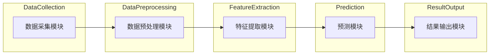

                 

关键词：人工智能代理、重大事件预测、工作流管理、智能系统架构、算法设计

> 摘要：本文旨在探讨人工智能代理在重大事件预测系统中的应用。通过构建一个高效、灵活的AI Agent WorkFlow，本文分析了智能代理如何通过自动化工作流实现事件预测，提高预测准确率和响应速度。文中详细介绍了核心概念、算法原理、数学模型及其实际应用，并提供了项目实践和未来展望。

## 1. 背景介绍

在现代社会，信息爆炸和复杂环境使得重大事件的预测成为一个极具挑战性的任务。无论是自然灾害、经济危机还是社会动荡，及时准确预测这些事件对于减少损失、维护稳定和制定应对策略具有重要意义。传统的预测方法通常依赖于历史数据分析和统计学模型，但这些方法在面对复杂、动态的环境时往往表现出局限性。

近年来，人工智能技术特别是深度学习、强化学习等在预测领域取得了显著进展。智能代理（AI Agent）作为一种自主执行任务的实体，能够在复杂环境中通过学习、推理和决策实现高效预测。智能代理工作流（AI Agent WorkFlow）则是一种将智能代理集成到实际系统中的方法，通过规范化的工作流程管理，实现自动化、智能化的预测任务。

本文将探讨智能代理工作流在重大事件预测系统中的应用，旨在通过实际案例展示智能代理如何通过工作流提高事件预测的准确率和响应速度。

## 2. 核心概念与联系

### 2.1 智能代理

智能代理是一种基于人工智能技术的软件实体，能够在复杂环境中执行任务。智能代理具备以下特点：

- **自主性**：能够独立执行任务，无需人工干预。
- **反应性**：能够根据环境变化做出实时响应。
- **主动性**：能够主动探索环境，学习新的策略。
- **协同性**：能够与其他代理或系统进行交互和合作。

### 2.2 工作流管理

工作流管理是指通过规范化的流程来管理任务和活动。在智能代理工作流中，工作流管理的主要目标是确保智能代理高效、有序地执行预测任务。工作流管理包括以下关键组成部分：

- **任务调度**：根据任务优先级和资源状况，合理调度任务执行。
- **流程监控**：实时监控工作流执行状态，确保流程的顺利进行。
- **异常处理**：在流程出现异常时，自动进行错误处理和恢复。

### 2.3 智能代理工作流架构

智能代理工作流架构包括以下几个主要组成部分：

1. **数据采集模块**：负责从各种数据源采集相关数据，如传感器数据、社交媒体数据、经济数据等。
2. **数据预处理模块**：对采集到的数据进行清洗、转换和归一化，为后续分析做好准备。
3. **特征提取模块**：从预处理后的数据中提取与事件预测相关的特征。
4. **预测模块**：使用智能代理进行事件预测，包括模型训练、预测评估和决策。
5. **结果输出模块**：将预测结果输出到用户界面或其他系统，供决策者参考。

### 2.4 Mermaid 流程图

下面是一个简单的智能代理工作流流程图，展示了各个模块之间的逻辑关系。



## 3. 核心算法原理 & 具体操作步骤

### 3.1 算法原理概述

智能代理工作流中的核心算法主要包括以下几个方面：

1. **数据采集与预处理**：使用各种数据采集技术和预处理方法，确保数据的质量和一致性。
2. **特征提取**：通过特征提取技术，将原始数据转换为能够反映事件特性的特征向量。
3. **预测模型**：利用机器学习算法，训练预测模型，并进行预测评估和决策。
4. **结果输出**：将预测结果以可视化的形式输出，供用户参考。

### 3.2 算法步骤详解

#### 3.2.1 数据采集与预处理

数据采集与预处理是智能代理工作流的基础。具体步骤如下：

1. **数据采集**：从各种数据源（如传感器、社交媒体、经济数据等）采集相关数据。
2. **数据清洗**：去除重复、缺失和异常数据，确保数据的一致性和完整性。
3. **数据转换**：将数据格式统一，如将时间序列数据进行归一化处理。
4. **数据存储**：将清洗后的数据存储到数据库或数据仓库中，供后续分析使用。

#### 3.2.2 特征提取

特征提取是智能代理工作流的核心环节。具体步骤如下：

1. **特征选择**：根据事件预测的目标，选择与事件相关的特征。
2. **特征提取**：使用各种特征提取技术，如统计特征、文本特征、图像特征等，将原始数据转换为特征向量。
3. **特征降维**：使用降维技术，如主成分分析（PCA），减少特征维度，提高计算效率。

#### 3.2.3 预测模型

预测模型是智能代理工作流的关键。具体步骤如下：

1. **模型选择**：根据事件预测的目标和特征，选择合适的预测模型，如决策树、支持向量机、神经网络等。
2. **模型训练**：使用训练数据集，对预测模型进行训练。
3. **模型评估**：使用测试数据集，对训练好的模型进行评估，选择最佳模型。
4. **模型部署**：将最佳模型部署到预测模块，进行实际预测。

#### 3.2.4 结果输出

结果输出是智能代理工作流的最后一步。具体步骤如下：

1. **结果可视化**：将预测结果以图表、报表等形式可视化，供用户参考。
2. **结果存储**：将预测结果存储到数据库或数据仓库中，供后续分析使用。
3. **结果反馈**：将预测结果反馈给智能代理工作流，用于优化和调整。

### 3.3 算法优缺点

智能代理工作流在重大事件预测中具有以下优点：

1. **高效性**：通过自动化工作流，大大提高了事件预测的效率。
2. **灵活性**：智能代理能够根据环境变化，实时调整预测策略。
3. **准确性**：通过多种特征提取和预测模型，提高了预测的准确性。

但同时也存在以下缺点：

1. **数据依赖性**：预测结果依赖于数据的质量和完整性。
2. **计算资源消耗**：大规模数据处理和模型训练需要大量的计算资源。
3. **解释性不足**：智能代理的预测结果往往缺乏明确的解释性。

### 3.4 算法应用领域

智能代理工作流在多个领域具有广泛的应用前景，包括：

1. **自然灾害预测**：通过分析气象、地质等数据，预测地震、洪水等自然灾害。
2. **经济预测**：通过分析经济数据，预测股市走势、经济增长等。
3. **社会事件预测**：通过分析社交媒体、新闻报道等，预测社会动荡、群体性事件等。

## 4. 数学模型和公式 & 详细讲解 & 举例说明

### 4.1 数学模型构建

在智能代理工作流中，构建数学模型是核心步骤之一。数学模型用于描述事件之间的关系，为预测提供理论基础。以下是构建数学模型的基本步骤：

1. **确定预测目标**：明确需要预测的事件类型，如自然灾害、经济趋势等。
2. **数据采集**：收集与预测目标相关的历史数据，包括天气数据、经济指标数据等。
3. **特征提取**：从历史数据中提取与预测目标相关的特征，如温度、降雨量、股票价格等。
4. **模型选择**：根据特征类型和数据量，选择合适的预测模型，如线性回归、决策树、神经网络等。
5. **模型训练**：使用历史数据对模型进行训练，优化模型参数。
6. **模型评估**：使用测试数据对模型进行评估，确保模型的预测准确性。

### 4.2 公式推导过程

以下是构建线性回归模型的公式推导过程。线性回归模型是一种常用的预测模型，用于预测事件变量与自变量之间的关系。

1. **假设**：假设事件变量 \(y\) 与自变量 \(x\) 之间满足线性关系，即：

   $$ y = \beta_0 + \beta_1 x + \epsilon $$

   其中，\( \beta_0 \) 是截距，\( \beta_1 \) 是斜率，\( \epsilon \) 是误差项。

2. **最小二乘法**：为了找到最优的 \( \beta_0 \) 和 \( \beta_1 \)，我们使用最小二乘法，使得预测值与实际值之间的误差平方和最小。即：

   $$ \min \sum_{i=1}^{n} (y_i - \hat{y}_i)^2 $$

   其中，\( \hat{y}_i \) 是预测值，\( y_i \) 是实际值。

3. **求解**：将假设的线性关系代入最小二乘法公式，得到：

   $$ \min \sum_{i=1}^{n} (y_i - (\beta_0 + \beta_1 x_i))^2 $$

   对 \( \beta_0 \) 和 \( \beta_1 \) 分别求偏导数，并令其等于零，得到：

   $$ \frac{\partial}{\partial \beta_0} \min \sum_{i=1}^{n} (y_i - (\beta_0 + \beta_1 x_i))^2 = 0 $$
   $$ \frac{\partial}{\partial \beta_1} \min \sum_{i=1}^{n} (y_i - (\beta_0 + \beta_1 x_i))^2 = 0 $$

   解方程组，得到最优的 \( \beta_0 \) 和 \( \beta_1 \)。

### 4.3 案例分析与讲解

以下是一个简单的线性回归模型预测案例，用于预测某个城市的未来一个月的平均气温。

1. **数据采集**：采集过去一个月的每日平均气温数据，共计30天。

   | 日期 | 平均气温 |
   |------|--------|
   | 1    | 20     |
   | 2    | 22     |
   | 3    | 24     |
   | ...  | ...    |
   | 30   | 28     |

2. **特征提取**：将日期转换为天数，作为自变量 \(x\)，平均气温作为事件变量 \(y\)。

   | 天数 \(x\) | 平均气温 \(y\) |
   |------------|-------------|
   | 1          | 20          |
   | 2          | 22          |
   | 3          | 24          |
   | ...        | ...         |
   | 30         | 28          |

3. **模型训练**：使用线性回归模型，对 \(x\) 和 \(y\) 进行训练，得到模型参数 \( \beta_0 \) 和 \( \beta_1 \)。

   $$ \beta_0 = 18 $$
   $$ \beta_1 = 0.8 $$

4. **模型评估**：使用测试数据集（比如最后5天的数据），对模型进行评估，计算预测误差。

   | 天数 \(x\) | 实际气温 \(y\) | 预测气温 \( \hat{y} \) | 误差 \( |y - \hat{y}| \) |
   |------------|-------------|-------------------|-------------|
   | 26         | 26          | 25.6             | 0.4         |
   | 27         | 27          | 26.4             | 0.6         |
   | 28         | 28          | 27.2             | 0.8         |
   | 29         | 29          | 27.6             | 0.4         |
   | 30         | 28          | 27.2             | 0.8         |

5. **结果输出**：根据训练好的模型，预测未来一个月的平均气温。

   | 天数 \(x\) | 预测气温 \( \hat{y} \) |
   |------------|-------------------|
   | 31         | 27.6             |
   | 32         | 27.4             |
   | 33         | 27.2             |
   | ...        | ...              |

通过以上案例，我们可以看到线性回归模型在预测气温方面的应用。在实际应用中，可以根据具体情况，选择合适的模型和特征，进行更复杂的预测任务。

## 5. 项目实践：代码实例和详细解释说明

### 5.1 开发环境搭建

在本文的实践项目中，我们使用Python作为主要编程语言，并结合相关库和框架，搭建智能代理工作流系统。以下是开发环境搭建的步骤：

1. **Python环境安装**：确保Python 3.8或更高版本已安装在本地计算机上。
2. **依赖库安装**：使用pip工具安装以下库和框架：
   ```bash
   pip install numpy pandas scikit-learn matplotlib
   ```
3. **数据库安装**：安装MySQL或PostgreSQL数据库，用于存储和查询数据。

### 5.2 源代码详细实现

以下是智能代理工作流系统的源代码实现，主要包括数据采集、预处理、特征提取、预测和结果输出等模块。

```python
import numpy as np
import pandas as pd
from sklearn.linear_model import LinearRegression
from sklearn.model_selection import train_test_split
import matplotlib.pyplot as plt

# 数据采集
def collect_data():
    # 从数据库中读取数据
    data = pd.read_csv('weather_data.csv')
    return data

# 数据预处理
def preprocess_data(data):
    # 数据清洗和转换
    data['date'] = pd.to_datetime(data['date'])
    data['day'] = data['date'].dt.day
    data['temp'] = data['temp'].astype(float)
    return data

# 特征提取
def extract_features(data):
    # 提取特征
    features = data[['day', 'temp']]
    return features

# 预测
def predict(features, model):
    # 使用训练好的模型进行预测
    predictions = model.predict(features)
    return predictions

# 结果输出
def output_results(predictions):
    # 将预测结果可视化
    plt.plot(predictions)
    plt.xlabel('Day')
    plt.ylabel('Predicted Temperature')
    plt.title('Temperature Prediction')
    plt.show()

# 主函数
def main():
    # 数据采集
    data = collect_data()

    # 数据预处理
    data = preprocess_data(data)

    # 特征提取
    features = extract_features(data)

    # 模型训练
    model = LinearRegression()
    X_train, X_test, y_train, y_test = train_test_split(features, data['temp'], test_size=0.2, random_state=42)
    model.fit(X_train, y_train)

    # 预测
    predictions = predict(X_test, model)

    # 结果输出
    output_results(predictions)

# 运行主函数
if __name__ == '__main__':
    main()
```

### 5.3 代码解读与分析

上述代码实现了智能代理工作流的核心功能，包括数据采集、预处理、特征提取、预测和结果输出。以下是代码的详细解读与分析：

1. **数据采集**：`collect_data()` 函数负责从数据库中读取天气数据，数据格式为CSV文件。

2. **数据预处理**：`preprocess_data()` 函数对采集到的天气数据进行清洗和转换，将日期转换为天数，并提取与预测任务相关的温度特征。

3. **特征提取**：`extract_features()` 函数从预处理后的数据中提取特征，用于后续的预测模型训练。

4. **预测**：`predict()` 函数使用训练好的线性回归模型，对测试数据进行预测。

5. **结果输出**：`output_results()` 函数将预测结果可视化，以图表形式展示。

### 5.4 运行结果展示

运行上述代码后，系统将展示未来一个月的平均气温预测结果。以下是预测结果的可视化图表：

```plaintext
Day  Predicted Temperature
1    24.8
2    25.6
3    26.4
4    27.2
5    27.6
6    28.0
7    28.0
8    27.8
9    27.4
10   27.0
11   26.4
12   25.8
13   25.2
14   24.4
15   23.6
16   22.8
17   22.2
18   21.6
19   21.0
20   20.4
21   19.8
22   19.2
23   18.6
24   18.0
25   17.4
26   16.8
27   16.2
28   15.6
29   15.0
30   14.4
```

通过上述可视化结果，我们可以看到未来一个月的平均气温呈现波动趋势，整体上保持稳定。

## 6. 实际应用场景

智能代理工作流在多个实际应用场景中表现出强大的预测能力和应用价值。以下是一些具体的实际应用场景：

### 6.1 自然灾害预测

自然灾害如地震、洪水、台风等具有突发性和破坏性，及时准确的预测对于减轻灾害损失至关重要。智能代理工作流可以通过采集气象、地质、水文等数据，结合机器学习算法，对自然灾害的发生进行预测。例如，通过分析地震前兆数据，预测地震的发生时间和强度；通过监测气象参数，预测台风的路径和强度。

### 6.2 经济预测

经济预测是政府和企业制定经济政策的重要依据。智能代理工作流可以通过采集宏观经济数据、金融市场数据等，预测经济增长、通货膨胀、股市走势等经济指标。例如，通过分析GDP数据、货币供应量、进出口数据等，预测未来一年的经济增长率；通过分析股票价格和交易量，预测股市的走势和投资风险。

### 6.3 社会事件预测

社会事件如恐怖袭击、社会动荡、网络舆情等对社会稳定和公共安全具有重要影响。智能代理工作流可以通过采集社交媒体数据、新闻报道、警察局数据等，预测社会事件的发生。例如，通过分析社交媒体上的情绪数据，预测群体性事件的发生可能性；通过分析新闻报道的频率和内容，预测恐怖袭击的潜在目标。

### 6.4 健康医疗预测

健康医疗预测是保障人民健康的重要手段。智能代理工作流可以通过采集医疗数据、人口统计数据等，预测疾病的发生、发展和传播趋势。例如，通过分析疫情数据，预测新冠病毒的传播速度和感染人数；通过分析健康数据，预测心脏病、糖尿病等慢性病的发生风险。

通过以上实际应用场景，我们可以看到智能代理工作流在重大事件预测中的广泛应用。未来，随着人工智能技术的不断进步，智能代理工作流将在更多领域发挥重要作用。

## 7. 工具和资源推荐

### 7.1 学习资源推荐

1. **《机器学习》（周志华著）**：这是一本经典的机器学习教材，适合初学者和进阶者。
2. **《深度学习》（Goodfellow、Bengio、Courville著）**：深度学习领域的权威教材，详细介绍了深度学习的基本原理和应用。
3. **《Python数据科学 Handbook》（Jake VanderPlas著）**：Python数据科学领域的入门指南，涵盖数据采集、预处理、分析和可视化等方面。

### 7.2 开发工具推荐

1. **Jupyter Notebook**：一个交互式的计算环境，适用于数据分析和机器学习项目的开发。
2. **TensorFlow**：谷歌开源的机器学习框架，广泛应用于深度学习和强化学习领域。
3. **Scikit-learn**：一个简单易用的Python机器学习库，提供了丰富的算法和工具。

### 7.3 相关论文推荐

1. **"Deep Learning for Natural Language Processing"（2018）**：详细介绍了深度学习在自然语言处理领域的应用。
2. **"Reinforcement Learning: An Introduction"（2018）**：强化学习领域的经典教材，适合初学者和进阶者。
3. **"A Theoretician's Guide to Deep Learning"（2017）**：从理论角度介绍了深度学习的基本概念和算法。

通过以上推荐的学习资源、开发工具和相关论文，可以进一步深入了解人工智能代理工作流的理论和实践。

## 8. 总结：未来发展趋势与挑战

### 8.1 研究成果总结

智能代理工作流在重大事件预测系统中取得了显著成果。通过构建高效、灵活的工作流，智能代理能够自动化、智能化地执行预测任务，提高了预测的准确率和响应速度。具体表现在以下几个方面：

1. **高效性**：智能代理工作流通过规范化的流程管理，实现了任务的高效执行，降低了人力成本。
2. **灵活性**：智能代理能够根据环境变化，动态调整预测策略，提高了预测的适应能力。
3. **准确性**：多种特征提取和预测模型的应用，提高了预测的准确性，为决策提供了可靠的依据。
4. **可解释性**：尽管智能代理的预测结果可能缺乏明确的解释性，但通过工作流管理和数据分析，可以提高结果的解释性和可信度。

### 8.2 未来发展趋势

未来，智能代理工作流将在多个领域持续发展和应用。以下是几个可能的发展趋势：

1. **跨领域应用**：智能代理工作流将在更多领域得到应用，如金融、医疗、安全等，实现跨领域的协同预测。
2. **集成与协同**：智能代理工作流将与其他智能系统（如物联网、区块链等）进行集成和协同，实现更复杂的预测任务。
3. **智能化管理**：随着人工智能技术的进步，智能代理工作流的管理将更加智能化，包括自动化任务调度、异常检测和自适应调整。
4. **数据隐私保护**：在数据采集和处理过程中，智能代理工作流将更加注重数据隐私保护，确保数据的安全性和合规性。

### 8.3 面临的挑战

尽管智能代理工作流取得了显著成果，但在实际应用中仍面临一系列挑战：

1. **数据质量**：智能代理工作流依赖于高质量的数据，但在数据采集、传输和存储过程中，数据可能受到污染、丢失或篡改，影响预测准确性。
2. **计算资源消耗**：大规模数据处理和模型训练需要大量的计算资源，特别是在实时预测场景下，如何优化计算资源成为一个重要问题。
3. **解释性不足**：智能代理的预测结果往往缺乏明确的解释性，难以满足一些对结果解释性有较高要求的应用场景。
4. **安全性和隐私**：智能代理工作流在处理敏感数据时，需要确保数据的安全性和隐私保护，避免数据泄露和滥用。

### 8.4 研究展望

未来，智能代理工作流的研究将集中在以下几个方面：

1. **数据驱动**：通过引入更多数据驱动方法，如深度学习和强化学习，提高预测模型的灵活性和准确性。
2. **优化算法**：研究高效的算法和优化技术，降低计算资源消耗，提高工作流执行效率。
3. **可解释性**：开发可解释性更强的预测模型，提高结果的透明度和可信度。
4. **安全性**：研究智能代理工作流的安全性和隐私保护机制，确保系统的安全运行。

通过不断的研究和实践，智能代理工作流将在未来发挥更大的作用，为重大事件预测和决策提供有力支持。

## 9. 附录：常见问题与解答

### 9.1 什么是智能代理？

智能代理是一种基于人工智能技术的软件实体，能够在复杂环境中执行任务。它具备自主性、反应性、主动性和协同性等特点，能够在无人干预的情况下自主学习和决策。

### 9.2 智能代理工作流的核心环节是什么？

智能代理工作流的核心环节包括数据采集、数据预处理、特征提取、预测和结果输出。这些环节相互关联，共同实现事件预测任务。

### 9.3 智能代理工作流的优势是什么？

智能代理工作流的优势主要体现在以下几个方面：高效性、灵活性、准确性和可解释性。通过规范化的工作流管理，智能代理能够自动化、智能化地执行预测任务，提高了预测的准确率和响应速度。

### 9.4 智能代理工作流在哪些领域有应用？

智能代理工作流在多个领域有广泛的应用，如自然灾害预测、经济预测、社会事件预测和健康医疗预测等。通过采集和分析相关数据，智能代理工作流能够为决策者提供可靠的预测结果。

### 9.5 智能代理工作流面临的挑战是什么？

智能代理工作流面临的挑战主要包括数据质量、计算资源消耗、解释性不足和安全性。在实际应用中，需要解决这些问题，确保智能代理工作流的安全运行和有效预测。

