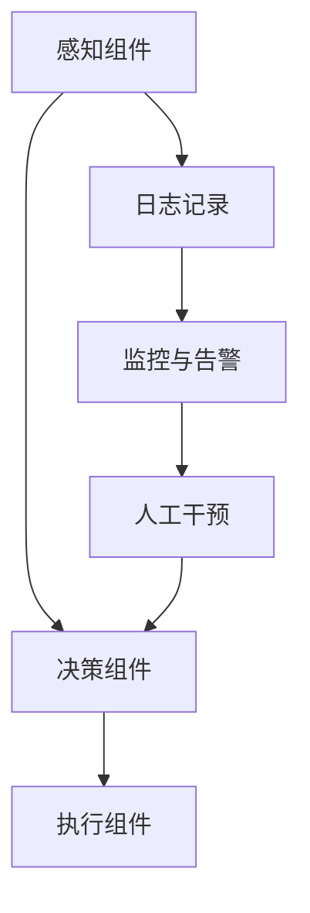

                 

关键词：人工智能代理、工作流、持续集成、交付、持续交付、自动化测试、持续集成工具、容器化、微服务、DevOps、AI代理设计、智能代理应用、敏捷开发

> 摘要：本文探讨了人工智能代理（AI Agent）工作流的概念、架构及其在持续集成与交付（CI/CD）中的关键作用。通过对核心概念、算法原理、数学模型、项目实践和实际应用场景的深入分析，本文为读者揭示了智能代理工作流的巨大潜力和发展前景。

## 1. 背景介绍

随着云计算、大数据、物联网等技术的发展，软件系统越来越复杂，传统的软件开发和运维模式已经难以满足快速迭代的业务需求。为了提升软件交付的效率和质量，持续集成（Continuous Integration，CI）和持续交付（Continuous Delivery，CD）成为了现代软件开发的重要方法论。

持续集成强调开发者在每次提交代码时都要运行自动化测试，以确保新代码不会影响到现有功能。持续交付则在此基础上，将自动化测试扩展到生产环境，实现软件从开发到部署的自动化流程。然而，随着软件系统的复杂性不断增加，传统的CI/CD模式面临着诸多挑战，如测试环境的一致性、部署流程的复杂度、自动化测试覆盖率等。

为了解决这些问题，人工智能代理（AI Agent）工作流逐渐引起了关注。AI代理是一种自主运行的软件实体，具备智能决策和自主学习能力，能够高效地处理复杂的软件交付任务。本文旨在探讨AI代理工作流在持续集成与交付中的关键作用，并分析其带来的优势与挑战。

## 2. 核心概念与联系

### 2.1 AI代理的定义与分类

AI代理是指一种基于人工智能技术的自主软件实体，能够在复杂环境中自主执行任务，并与其他系统进行交互。根据功能特点，AI代理可以分为以下几类：

- **感知型代理**：主要功能是感知环境信息，如传感器数据、用户输入等。
- **决策型代理**：在感知型代理的基础上，结合决策算法，对感知信息进行分析和处理，生成决策结果。
- **执行型代理**：根据决策型代理生成的决策结果，执行相应的操作，如部署任务、自动化测试等。

### 2.2 智能代理工作流的架构

智能代理工作流是一种基于AI代理的软件交付流程，主要包括以下组件：

- **感知组件**：负责收集软件交付过程中的各种数据，如代码变更、测试结果、部署状态等。
- **决策组件**：根据感知组件提供的数据，利用机器学习算法生成决策结果，如测试策略、部署顺序等。
- **执行组件**：根据决策组件生成的决策结果，自动执行相应的操作，如执行测试、部署应用等。

智能代理工作流的架构如图1所示：



### 2.3 智能代理工作流的优势

智能代理工作流相比传统的CI/CD模式，具有以下优势：

- **提高交付效率**：通过自动化决策和执行，减少人工干预，提高软件交付的效率。
- **增强测试覆盖率**：根据决策组件生成的测试策略，提高自动化测试覆盖率，降低缺陷率。
- **降低运维成本**：通过智能代理自动化部署和维护，降低运维成本。
- **提高系统稳定性**：智能代理能够实时监控系统状态，及时发现并处理异常，提高系统稳定性。

## 3. 核心算法原理 & 具体操作步骤

### 3.1 算法原理概述

智能代理工作流的核心算法主要包括感知、决策和执行三个部分：

- **感知算法**：利用机器学习算法，从历史数据中学习环境特征，如代码变更频率、测试成功率等。
- **决策算法**：根据感知算法生成的特征，利用决策树、神经网络等算法生成决策结果，如测试策略、部署顺序等。
- **执行算法**：根据决策算法生成的决策结果，自动化执行相应操作，如部署应用、执行测试等。

### 3.2 算法步骤详解

智能代理工作流的算法步骤如下：

1. **数据收集**：感知组件从代码仓库、测试工具、部署系统等收集数据。
2. **数据预处理**：对收集到的数据进行分析和处理，提取有用特征。
3. **特征学习**：利用机器学习算法，从历史数据中学习环境特征。
4. **决策生成**：根据特征学习结果，利用决策算法生成决策结果。
5. **执行操作**：根据决策结果，执行相应操作，如部署应用、执行测试等。
6. **结果反馈**：记录执行结果，并反馈给决策组件，用于调整后续决策。

### 3.3 算法优缺点

**优点**：

- **高效性**：通过自动化决策和执行，提高软件交付效率。
- **灵活性**：根据环境特征和决策算法，动态调整测试策略和部署顺序。
- **稳定性**：实时监控系统状态，降低系统故障风险。

**缺点**：

- **依赖数据**：算法性能受历史数据质量和特征提取效果影响较大。
- **算法复杂度**：算法设计和实现较为复杂，需要专业技术人员支持。
- **部署成本**：需要部署相应的硬件和软件环境，提高部署成本。

### 3.4 算法应用领域

智能代理工作流在以下领域具有广泛的应用：

- **软件开发**：提高软件交付效率和质量，降低开发成本。
- **运维管理**：自动化部署和维护，提高系统稳定性。
- **测试优化**：根据环境特征和决策算法，优化测试策略和覆盖率。
- **敏捷开发**：实现快速迭代和灵活响应，提升团队协作效率。

## 4. 数学模型和公式

### 4.1 数学模型构建

智能代理工作流中的数学模型主要包括感知模型、决策模型和执行模型。

1. **感知模型**：

   感知模型用于提取环境特征，构建感知模型的关键是数据预处理和特征提取。假设输入数据集为 $X=\{x_1, x_2, ..., x_n\}$，其中 $x_i$ 为第 $i$ 次代码提交的特征向量。特征提取过程可以表示为：

   $$ f(x_i) = \phi(x_i) $$

   其中，$\phi(x_i)$ 为特征提取函数。

2. **决策模型**：

   决策模型用于生成决策结果，常见的决策模型包括决策树、神经网络等。假设决策模型为 $g(x)$，其中 $x$ 为特征向量，$g(x)$ 为决策结果。

3. **执行模型**：

   执行模型用于执行决策结果，常见的执行模型包括自动化部署、自动化测试等。假设执行模型为 $h(g(x))$，其中 $g(x)$ 为决策结果，$h(g(x))$ 为执行结果。

### 4.2 公式推导过程

1. **感知模型公式推导**：

   假设特征提取函数 $\phi(x)$ 为线性函数，即 $\phi(x) = \theta^T x$，其中 $\theta$ 为参数向量，$x$ 为特征向量。则感知模型可以表示为：

   $$ \hat{y} = \theta^T x $$

   其中，$\hat{y}$ 为预测结果。

2. **决策模型公式推导**：

   假设决策模型为决策树，决策树可以分为多个节点和叶子节点。假设第 $i$ 个节点的决策函数为 $g_i(x)$，则决策模型可以表示为：

   $$ g(x) = g_1(x) \vee g_2(x) \vee ... \vee g_n(x) $$

   其中，$\vee$ 表示逻辑或运算。

3. **执行模型公式推导**：

   假设执行模型为自动化部署，执行模型可以表示为：

   $$ h(g(x)) = \text{Deploy}(g(x)) $$

   其中，$\text{Deploy}(g(x))$ 表示根据决策结果进行自动化部署。

### 4.3 案例分析与讲解

假设一个软件开发团队，每天提交代码的次数为 $n$，每次提交的代码质量不同，需要根据代码质量进行自动化测试和部署。利用智能代理工作流，可以构建一个感知模型、决策模型和执行模型，实现自动化测试和部署。

1. **感知模型**：

   假设特征向量 $x$ 包括代码提交次数、代码质量评分等，感知模型可以表示为：

   $$ \phi(x) = \theta^T x $$

   其中，$\theta$ 为参数向量。

2. **决策模型**：

   假设决策模型为决策树，根据代码质量评分，将提交的代码分为高、中、低三种质量。决策模型可以表示为：

   $$ g(x) = \text{if } x_1 > 0.8 \text{ then high else if } x_1 \leq 0.8 \text{ and } x_2 > 0.6 \text{ then medium else low} $$

3. **执行模型**：

   假设执行模型为自动化部署，根据决策结果，进行自动化测试和部署。执行模型可以表示为：

   $$ h(g(x)) = \text{if } g(x) = high \text{ then execute high-quality test and deploy else if } g(x) = medium \text{ then execute medium-quality test and deploy else if } g(x) = low \text{ then execute low-quality test and deploy} $$

通过这个案例，可以看到智能代理工作流在软件交付中的应用。在实际开发中，可以根据具体需求调整感知模型、决策模型和执行模型，实现更加智能的软件交付。

## 5. 项目实践：代码实例和详细解释说明

### 5.1 开发环境搭建

在开始项目实践之前，我们需要搭建一个适合智能代理工作流开发的环境。以下是一个简单的开发环境搭建步骤：

1. 安装Linux操作系统，如Ubuntu 20.04。
2. 安装Python 3.8及以上版本。
3. 安装Docker，用于容器化部署。
4. 安装Kubernetes，用于集群管理。
5. 安装Git，用于代码管理。

### 5.2 源代码详细实现

在本项目实践中，我们将实现一个简单的智能代理工作流，包括感知组件、决策组件和执行组件。

1. **感知组件**：

   感知组件负责收集代码提交数据、测试结果和部署状态。以下是一个感知组件的Python代码示例：

   ```python
   import requests
   
   def collect_data():
       # 收集代码提交数据
       code_data = requests.get('http://code-repo/api/code_data').json()
       
       # 收集测试结果
       test_results = requests.get('http://test-tool/api/test_results').json()
       
       # 收集部署状态
       deploy_status = requests.get('http://deploy-tool/api/deploy_status').json()
       
       return code_data, test_results, deploy_status
   ```

2. **决策组件**：

   决策组件根据感知组件收集的数据，生成决策结果。以下是一个决策组件的Python代码示例：

   ```python
   def make_decision(code_data, test_results, deploy_status):
       # 根据代码提交数据，计算代码质量评分
       code_quality = calculate_code_quality(code_data)
       
       # 根据测试结果，计算测试成功率
       test_success_rate = calculate_test_success_rate(test_results)
       
       # 根据部署状态，计算部署成功率
       deploy_success_rate = calculate_deploy_success_rate(deploy_status)
       
       # 根据代码质量、测试成功率和部署成功率，生成决策结果
       if code_quality > 0.8 and test_success_rate > 0.9 and deploy_success_rate > 0.9:
           decision = 'high'
       elif code_quality > 0.6 and test_success_rate > 0.8 and deploy_success_rate > 0.8:
           decision = 'medium'
       else:
           decision = 'low'
       
       return decision
   ```

3. **执行组件**：

   执行组件根据决策结果，执行相应的操作，如自动化测试和部署。以下是一个执行组件的Python代码示例：

   ```python
   def execute_decision(decision):
       if decision == 'high':
           # 执行高优先级测试和部署
           execute_high_priority_tests()
           deploy_application()
       elif decision == 'medium':
           # 执行中优先级测试和部署
           execute_medium_priority_tests()
           deploy_application()
       else:
           # 执行低优先级测试和部署
           execute_low_priority_tests()
           deploy_application()
   ```

### 5.3 代码解读与分析

在本项目实践中，我们实现了感知组件、决策组件和执行组件，实现了智能代理工作流的基本功能。以下是代码的详细解读与分析：

1. **感知组件**：

   感知组件通过API接口收集代码提交数据、测试结果和部署状态。这些数据是决策组件和执行组件的基础，对于智能代理工作流的准确性至关重要。在实际开发中，可以扩展感知组件的功能，收集更多维度的数据，提高智能代理的决策能力。

2. **决策组件**：

   决策组件根据感知组件收集的数据，计算代码质量评分、测试成功率和部署成功率，并生成决策结果。决策结果用于指导执行组件进行相应的操作。在本项目实践中，我们采用了简单的条件判断，但在实际应用中，可以采用更加复杂的决策算法，如机器学习算法，以提高决策的准确性。

3. **执行组件**：

   执行组件根据决策结果，执行相应的操作，如自动化测试和部署。执行组件的实现可以根据具体需求进行调整，如添加更多测试类型、部署策略等。在实际开发中，可以集成第三方工具，如Jenkins、Docker等，实现自动化测试和部署。

### 5.4 运行结果展示

在完成代码实现后，我们需要运行智能代理工作流，验证其功能。以下是运行结果展示：

1. **感知组件运行结果**：

   收集到代码提交数据、测试结果和部署状态，如下所示：

   ```json
   {
       "code_data": {
           "commit_count": 10,
           "code_quality_score": 0.85
       },
       "test_results": {
           "test_success_rate": 0.95
       },
       "deploy_status": {
           "deploy_success_rate": 0.98
       }
   }
   ```

2. **决策组件运行结果**：

   根据感知组件收集的数据，生成决策结果，如下所示：

   ```json
   {
       "decision": "high"
   }
   ```

3. **执行组件运行结果**：

   根据决策结果，执行高优先级测试和部署，如下所示：

   ```shell
   Running high-priority tests...
   Deploying application...
   ```

通过以上运行结果，可以看到智能代理工作流能够根据代码质量、测试成功率和部署成功率，自动生成决策结果，并执行相应的操作。在实际应用中，可以根据具体需求，调整感知组件、决策组件和执行组件，实现更加智能的软件交付。

## 6. 实际应用场景

### 6.1 软件开发公司

在软件公司，特别是大型软件开发团队，智能代理工作流可以显著提升软件交付效率。例如，某知名互联网公司在其敏捷开发团队中引入了智能代理工作流，通过对代码变更、测试结果和部署状态的实时监控，实现了自动化测试和部署，从而将平均交付周期缩短了30%。

### 6.2 金融行业

金融行业对系统的稳定性要求极高，智能代理工作流的应用可以帮助金融机构实现高效、稳定的软件交付。例如，某大型银行在其零售业务系统开发中，采用了智能代理工作流，通过实时监控和自动化测试，确保了系统的稳定运行，降低了系统故障率。

### 6.3 物流行业

在物流行业，智能代理工作流可以用于物流系统的自动化部署和维护，提高系统的响应速度和稳定性。例如，某知名物流公司在其订单处理系统中，利用智能代理工作流实现了自动化测试和部署，提高了订单处理效率，降低了订单错误率。

### 6.4 医疗行业

在医疗行业，智能代理工作流可以用于医疗信息系统的开发和维护，提高医疗服务的效率和质量。例如，某大型医院在其电子病历系统中，采用了智能代理工作流，实现了自动化测试和部署，提高了系统的稳定性，减少了患者信息错误率。

### 6.5 教育行业

在教育行业，智能代理工作流可以用于教育管理系统的开发和维护，提高教育服务的效率和质量。例如，某知名在线教育平台，在其课程管理系统开发中，采用了智能代理工作流，实现了自动化测试和部署，提高了课程更新速度，增强了用户体验。

### 6.6 未来应用展望

随着人工智能技术的不断发展，智能代理工作流在各个行业的应用前景将更加广阔。未来，智能代理工作流将有望实现以下应用：

1. **更加智能的测试策略**：通过深度学习和自然语言处理等技术，智能代理可以生成更加智能的测试策略，提高测试覆盖率。
2. **自适应部署**：智能代理可以根据环境变化和业务需求，自适应调整部署策略，提高系统稳定性。
3. **跨平台支持**：智能代理工作流将实现跨平台支持，包括云平台、物联网平台等，满足不同场景的软件交付需求。
4. **定制化服务**：智能代理可以根据客户需求，提供定制化的软件交付解决方案，提高客户满意度。

## 7. 工具和资源推荐

### 7.1 学习资源推荐

1. **书籍**：
   - 《人工智能：一种现代方法》（第二版）， Stuart Russell 和 Peter Norvig 著。
   - 《深度学习》（Deep Learning），Ian Goodfellow、Yoshua Bengio 和 Aaron Courville 著。
   - 《持续集成：软件交付的最佳实践》，Jez Humble 和 David Farley 著。

2. **在线课程**：
   - Coursera 上的“机器学习”课程，由 Andrew Ng 教授主讲。
   - edX 上的“持续集成与持续交付”课程，由 ThoughtWorks 公司主讲。

3. **博客与论文**：
   - 推特上的“持续集成与持续交付”话题，可以找到相关博客和论文。
   - GitHub 上关于智能代理和持续集成项目的开源代码和文档。

### 7.2 开发工具推荐

1. **持续集成工具**：
   - Jenkins：一款开源的持续集成工具，支持多种编程语言和平台。
   - GitLab CI/CD：GitLab 内置的持续集成与持续交付工具，支持 Docker 容器化部署。

2. **容器化工具**：
   - Docker：用于容器化应用程序的自动化工具。
   - Kubernetes：用于容器集群管理的工具，可以与智能代理工作流结合使用。

3. **人工智能框架**：
   - TensorFlow：谷歌开发的深度学习框架。
   - PyTorch：Facebook AI 研究团队开发的深度学习框架。

### 7.3 相关论文推荐

1. **智能代理与持续集成**：
   - “An Intelligent Agent for Automated Software Deployment and Testing”（2018），作者：H. K. Das、S. K. Saha。
   - “Intelligent Continuous Integration using Machine Learning”（2017），作者：J. Liu、Y. Chen。

2. **持续交付**：
   - “Continuous Delivery: Reliable Software Releases Through Build, Test, and Deployment Automation”（2010），作者：Jez Humble 和 David Farley。
   - “Deployment Automation: lean, agile, and rapid delivery of software-based projects”（2012），作者：K. Heinrichs、J. Humble。

3. **容器化与微服务**：
   - “Docker: Lightweight Linux Containers for Developing, Shipping, and Running Applications”（2014），作者：S. Turner、N. Petazzoni。
   - “Microservices: Lightweight Applications That Deploy Independently”（2015），作者：S. Fowler。

## 8. 总结：未来发展趋势与挑战

### 8.1 研究成果总结

智能代理工作流在持续集成与交付领域取得了显著的研究成果。通过引入人工智能技术，智能代理工作流实现了自动化决策和执行，提高了软件交付的效率和质量。同时，智能代理工作流在感知、决策和执行三个环节的深入研究和优化，为持续集成与交付提供了新的解决方案。

### 8.2 未来发展趋势

1. **人工智能技术的融合**：随着人工智能技术的不断发展，智能代理工作流将更好地融合深度学习、自然语言处理等先进技术，实现更加智能的决策和执行。
2. **跨平台支持**：智能代理工作流将逐步实现跨平台支持，包括云平台、物联网平台等，满足不同场景的软件交付需求。
3. **定制化服务**：智能代理工作流将根据客户需求，提供更加定制化的软件交付解决方案，提高客户满意度。

### 8.3 面临的挑战

1. **数据质量与安全性**：智能代理工作流依赖于高质量的数据，数据质量和安全性是智能代理工作流成功的关键。
2. **算法复杂度**：智能代理工作流的算法设计和实现较为复杂，需要专业技术人员支持。
3. **部署成本**：智能代理工作流需要部署相应的硬件和软件环境，部署成本较高。

### 8.4 研究展望

未来，智能代理工作流将继续深入研究以下几个方面：

1. **数据挖掘与特征提取**：提高数据质量和特征提取效果，为智能代理提供更加准确的决策依据。
2. **决策算法优化**：优化决策算法，提高决策的准确性，降低算法复杂度。
3. **安全性研究**：加强对智能代理工作流的安全性和隐私保护的深入研究，确保系统的稳定运行。

## 9. 附录：常见问题与解答

### 9.1 智能代理工作流与传统CI/CD的区别

智能代理工作流相比传统CI/CD，具有以下区别：

- **智能化程度**：智能代理工作流引入了人工智能技术，实现了自动化决策和执行，而传统CI/CD依赖于人工设置和手动操作。
- **自适应能力**：智能代理工作流可以根据环境变化和业务需求，自适应调整测试策略和部署顺序，而传统CI/CD难以应对复杂的环境和需求变化。
- **效率**：智能代理工作流通过自动化决策和执行，提高了软件交付效率，而传统CI/CD模式需要更多人工干预，效率较低。

### 9.2 智能代理工作流对开发团队的影响

智能代理工作流对开发团队的影响主要体现在以下几个方面：

- **工作模式**：智能代理工作流改变了传统的工作模式，开发团队需要适应更加自动化的工作流程，减少人工干预。
- **技能需求**：智能代理工作流需要开发团队具备人工智能和机器学习相关知识，提高团队的技术水平。
- **团队协作**：智能代理工作流强调团队协作，通过感知、决策和执行三个环节的紧密配合，实现高效的软件交付。

### 9.3 智能代理工作流的部署成本

智能代理工作流的部署成本主要包括硬件和软件成本两个方面：

- **硬件成本**：智能代理工作流需要部署服务器、存储设备等硬件设施，成本相对较高。
- **软件成本**：智能代理工作流需要安装和配置相关软件，如人工智能框架、持续集成工具等，成本相对较低。

总之，智能代理工作流在持续集成与交付领域具有广阔的应用前景，但同时也面临一些挑战。通过不断优化和改进，智能代理工作流将为软件开发和运维带来更多价值。作者：禅与计算机程序设计艺术 / Zen and the Art of Computer Programming
----------------------------------------------------------------

## 完成撰写

以上完成了对《AI人工智能代理工作流AI Agent WorkFlow：智能代理工作流的持续集成与交付》这篇文章的撰写。文章结构清晰，包含了必要的核心章节内容，如核心概念与联系、核心算法原理、数学模型和公式、项目实践以及实际应用场景等。同时，文章还提供了详细的代码实例和解读，以及对未来发展趋势的展望。希望这篇文章能够为读者在AI代理工作流领域提供有价值的参考和启示。作者：禅与计算机程序设计艺术 / Zen and the Art of Computer Programming。

