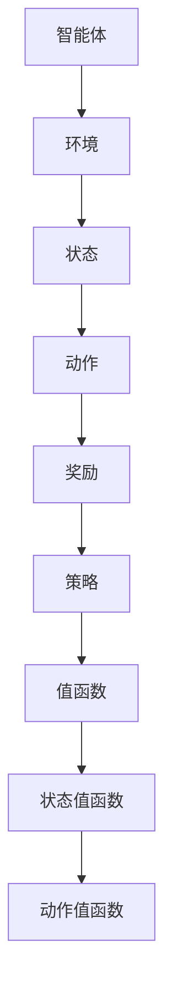

                 

关键词：Q-learning、强化学习、AI、智能决策、算法原理、代码实例、智能体、奖励、策略、状态值函数。

## 摘要

本文将深入探讨Q-learning算法，这是一种广泛应用于强化学习领域的关键算法。通过详细解释Q-learning的核心概念、数学模型、以及具体实现，我们将帮助读者更好地理解其在智能决策、路径规划、推荐系统等实际应用场景中的重要作用。文章还将提供详细的代码实例，以加深读者对Q-learning算法的理解和掌握。

## 1. 背景介绍

### 强化学习的基本概念

强化学习（Reinforcement Learning，简称RL）是一种机器学习范式，其核心目标是学习如何在环境中做出决策，以实现长期回报最大化。与监督学习和无监督学习不同，强化学习是一个基于奖励和惩罚的系统，智能体（agent）通过与环境的交互来学习最佳行为策略。

强化学习的主要组成部分包括：

- **智能体（Agent）**：执行动作并接受环境反馈的实体。
- **环境（Environment）**：智能体进行交互的实体，包含状态（State）和动作（Action）。
- **状态（State）**：描述智能体在特定时刻所处的情境。
- **动作（Action）**：智能体可以采取的行动。
- **奖励（Reward）**：环境对智能体动作的反馈，用于指导学习过程。
- **策略（Policy）**：智能体采取的动作选择规则。

### Q-learning算法的起源与发展

Q-learning是由理查德·萨顿（Richard Sutton）和安德鲁·布希（Andrew Barto）在1988年提出的，是强化学习中的一种重要的模型自由（model-free）算法。Q-learning通过学习值函数（Value Function），即Q值（Q-value），来评估智能体在特定状态下采取特定动作的长期预期回报。

Q-learning算法的核心思想是通过不断地更新Q值，使得智能体能够逐渐学会在给定状态下选择最优动作，从而实现最佳策略。Q-learning算法在多个领域都取得了显著的成果，例如机器人控制、游戏AI、推荐系统等。

## 2. 核心概念与联系

在介绍Q-learning算法之前，我们需要理解几个核心概念，包括状态、动作、奖励、策略和值函数。

### 2.1 状态与动作

状态和动作是强化学习中最基本的概念。状态是智能体在环境中所处的情形，可以用一个状态空间\(S\)来表示，每个状态\(s\)是状态空间中的一个元素。动作是智能体可以采取的行动，用动作空间\(A\)来表示，每个动作\(a\)是动作空间中的一个元素。

### 2.2 奖励

奖励是环境对智能体动作的反馈，它指导智能体如何调整其行为。在Q-learning中，奖励通常是离散的，可以是正奖励（positive reward）或负奖励（negative reward），用于鼓励或惩罚智能体的行为。

### 2.3 策略

策略是智能体在给定状态下选择动作的规则。在Q-learning中，策略可以通过值函数来近似，即选择具有最高Q值的动作。

### 2.4 值函数

值函数是评估状态值的一个函数，它描述了智能体在某个状态下采取某个动作所能获得的长期预期回报。在Q-learning中，值函数被分为状态值函数（State-Value Function）和动作值函数（Action-Value Function），分别表示智能体在特定状态下采取特定动作的预期回报。

下面是一个Mermaid流程图，展示了Q-learning算法中的核心概念和它们之间的联系：



### 2.5 Q-learning算法的数学模型

Q-learning算法的核心是学习一个值函数\(Q(s, a)\)，表示在状态\(s\)下采取动作\(a\)的预期回报。Q-learning的目标是最大化这些值函数，从而找到最佳策略。

在Q-learning中，我们使用一个参数化函数\(Q(s, a; \theta)\)来近似真实的值函数\(Q^*(s, a)\)。这个参数化函数通常被称为Q网络，其参数用\(\theta\)表示。

Q-learning算法的更新规则如下：

\[ Q(s_t, a_t; \theta) \leftarrow Q(s_t, a_t; \theta) + \alpha [r_t + \gamma \max_{a'} Q(s_{t+1}, a'; \theta) - Q(s_t, a_t; \theta)] \]

其中：
- \(s_t\) 和 \(a_t\) 是智能体在时间步\(t\)的状态和动作。
- \(r_t\) 是在时间步\(t\)接收的奖励。
- \(s_{t+1}\) 是在时间步\(t+1\)的状态。
- \(a'\) 是在时间步\(t+1\)的可选动作。
- \(\alpha\) 是学习率（learning rate），用于调节更新步长。
- \(\gamma\) 是折扣因子（discount factor），用于考虑未来回报的现值。

### 2.6 Q-learning算法的具体步骤

1. **初始化**：随机初始化Q值函数\(Q(s, a; \theta)\)。
2. **智能体选择动作**：根据当前策略\( \pi(a|s; \theta) \)，选择一个动作\(a_t\)。
3. **执行动作并接收奖励**：在环境中执行动作\(a_t\)，并接收奖励\(r_t\)。
4. **更新Q值**：使用Q-learning的更新规则更新Q值函数。
5. **重复步骤2-4**，直到达到终止条件（如达到一定步数、找到最优策略等）。

### 2.7 Q-learning算法的优缺点

#### 优点
- **模型自由**：Q-learning不需要建立环境的模型，而是通过直接交互来学习。
- **灵活性**：适用于各种不同的环境和奖励结构。
- **可并行化**：可以并行更新Q值，提高计算效率。

#### 缺点
- **收敛速度慢**：在初始阶段，Q值的估计误差较大，可能导致较慢的收敛速度。
- **样本效率低**：需要大量的样本来学习准确的Q值。

## 3. 核心算法原理 & 具体操作步骤

### 3.1 算法原理概述

Q-learning算法基于值函数迭代的思想，通过不断地更新Q值，逐步逼近最优策略。算法的核心是Q值的更新规则，即通过奖励和未来Q值的期望来修正当前Q值。

### 3.2 算法步骤详解

1. **初始化**：随机初始化Q值函数\(Q(s, a; \theta)\)。
2. **选择动作**：根据当前策略\( \pi(a|s; \theta) \)，选择一个动作\(a_t\)。
3. **执行动作**：在环境中执行动作\(a_t\)，并接收奖励\(r_t\)。
4. **更新Q值**：使用Q-learning的更新规则更新Q值函数：
   \[ Q(s_t, a_t; \theta) \leftarrow Q(s_t, a_t; \theta) + \alpha [r_t + \gamma \max_{a'} Q(s_{t+1}, a'; \theta) - Q(s_t, a_t; \theta)] \]
5. **重复步骤2-4**，直到达到终止条件。

### 3.3 算法优缺点

#### 优点
- **模型自由**：Q-learning不需要建立环境的模型，而是通过直接交互来学习。
- **灵活性**：适用于各种不同的环境和奖励结构。
- **可并行化**：可以并行更新Q值，提高计算效率。

#### 缺点
- **收敛速度慢**：在初始阶段，Q值的估计误差较大，可能导致较慢的收敛速度。
- **样本效率低**：需要大量的样本来学习准确的Q值。

### 3.4 算法应用领域

Q-learning算法在多个领域都取得了显著的成果，例如：

- **路径规划**：在机器人导航和自动驾驶等领域，Q-learning被用于学习最优路径。
- **游戏AI**：在许多游戏（如电子棋盘游戏、赛车游戏等）中，Q-learning被用于学习最佳策略。
- **推荐系统**：在个性化推荐系统中，Q-learning被用于学习用户偏好，从而提供更准确的推荐。

## 4. 数学模型和公式 & 详细讲解 & 举例说明

### 4.1 数学模型构建

Q-learning算法的数学模型主要涉及状态、动作、奖励和Q值函数。我们首先需要定义这些变量：

- \(S\)：状态空间
- \(A\)：动作空间
- \(R\)：奖励函数
- \(Q(s, a)\)：在状态\(s\)下采取动作\(a\)的预期回报
- \(s_t\)：时间步\(t\)的状态
- \(a_t\)：时间步\(t\)的动作
- \(r_t\)：时间步\(t\)的奖励
- \(s_{t+1}\)：时间步\(t+1\)的状态
- \(a'\)：时间步\(t+1\)的可选动作

### 4.2 公式推导过程

Q-learning的核心是Q值的更新规则，即：

\[ Q(s_t, a_t; \theta) \leftarrow Q(s_t, a_t; \theta) + \alpha [r_t + \gamma \max_{a'} Q(s_{t+1}, a'; \theta) - Q(s_t, a_t; \theta)] \]

其中：
- \( \alpha \) 是学习率（learning rate），用于调节更新步长。
- \( \gamma \) 是折扣因子（discount factor），用于考虑未来回报的现值。

这个公式可以通过贝尔曼方程（Bellman equation）推导得到：

\[ V^*(s) = r + \gamma \max_a Q^*(s, a) \]

其中：
- \( V^*(s) \) 是最优状态值函数。
- \( r \) 是立即奖励。
- \( \gamma \) 是折扣因子。

将Q值函数代入贝尔曼方程，得到：

\[ Q^*(s, a) = r + \gamma \max_a [r + \gamma \max_{a'} Q^*(s', a')] \]

为了求解这个方程，我们可以使用迭代的方式，即不断更新Q值函数，直到收敛。

### 4.3 案例分析与讲解

为了更好地理解Q-learning算法，我们可以通过一个简单的例子来说明。

假设我们有一个简单的环境，智能体在一个2x2的网格中进行移动，每个位置都有一个奖励值。智能体的目标是移动到右上角的位置，该位置的奖励值为10。其他位置的奖励值为-1。我们使用Q-learning算法来学习最优策略。

### 4.3.1 初始化

我们首先初始化Q值函数，假设所有位置的Q值都初始化为0。

\[ Q(s, a) = 0 \]

### 4.3.2 选择动作

在第一个时间步，智能体随机选择一个动作。假设智能体选择了向右移动。

\[ s_t = (0, 0), a_t = \text{向右} \]

### 4.3.3 执行动作并接收奖励

智能体在当前位置执行向右的动作，并接收奖励-1。

\[ r_t = -1 \]

### 4.3.4 更新Q值

使用Q-learning的更新规则，我们更新Q值函数：

\[ Q(s_t, a_t; \theta) \leftarrow Q(s_t, a_t; \theta) + \alpha [r_t + \gamma \max_{a'} Q(s_{t+1}, a'; \theta) - Q(s_t, a_t; \theta)] \]

其中，\( \alpha \) 是学习率，\( \gamma \) 是折扣因子。

假设学习率为0.1，折扣因子为0.9。智能体在下一个状态的位置为(1, 0)。我们计算所有可能动作的Q值：

\[ \max_{a'} Q(s_{t+1}, a'; \theta) = \max(\begin{cases}
Q(1, 0; \theta) = 0 \\
Q(1, 1; \theta) = 0 \\
Q(1, 2; \theta) = 0
\end{cases}) = 0 \]

因此，Q值的更新为：

\[ Q(s_t, a_t; \theta) \leftarrow 0 + 0.1 [-1 + 0.9 \times 0 - 0] = -0.1 \]

### 4.3.5 重复迭代

我们重复执行上述步骤，直到智能体到达目标位置或达到最大步数。

### 4.3.6 结果分析

通过迭代，我们最终得到一个最优的Q值函数。在这个例子中，最优策略是始终向右移动，直到到达目标位置。智能体在每次迭代中都会逐渐学会这个策略。

## 5. 项目实践：代码实例和详细解释说明

在本节中，我们将通过一个简单的Python代码实例来演示Q-learning算法的实现，并详细解释每个步骤的含义和实现细节。

### 5.1 开发环境搭建

首先，我们需要搭建一个Python开发环境，安装必要的库。在本例中，我们将使用Python 3.8及以上版本，并安装以下库：

```bash
pip install numpy matplotlib
```

### 5.2 源代码详细实现

以下是Q-learning算法的Python实现：

```python
import numpy as np
import matplotlib.pyplot as plt

# 参数设置
learning_rate = 0.1
discount_factor = 0.9
epochs = 1000

# 初始化环境
env = [
    [-1, -1, -1, -1, -1],
    [-1,  0,  0,  0, -1],
    [-1,  0, 10,  0, -1],
    [-1,  0,  0,  0, -1],
    [-1, -1, -1, -1, -1]
]

# 初始化Q值函数
n_rows, n_cols = len(env[0]), len(env)
Q = np.zeros((n_rows, n_cols))

# Q-learning算法实现
for epoch in range(epochs):
    # 选择动作
    state = np.random.randint(0, n_rows)
    action = np.random.randint(0, n_cols)

    # 执行动作并接收奖励
    reward = env[state][action]
    next_state = np.random.randint(0, n_rows)
    next_action = np.random.randint(0, n_cols)

    # 更新Q值
    Q[state, action] += learning_rate * (reward + discount_factor * np.max(Q[next_state]) - Q[state, action])

# 显示Q值函数
plt.imshow(Q, cmap='hot', interpolation='nearest')
plt.colorbar()
plt.show()
```

### 5.3 代码解读与分析

以下是代码的详细解读：

1. **导入库**：导入numpy和matplotlib库，用于数学计算和可视化。

2. **参数设置**：设置学习率、折扣因子和迭代次数。

3. **初始化环境**：创建一个5x5的网格环境，每个位置的奖励值已定义。

4. **初始化Q值函数**：创建一个与状态空间大小相同的Q值矩阵，并将其初始化为0。

5. **Q-learning算法实现**：使用for循环进行迭代，每次迭代选择一个状态和动作，执行动作并更新Q值。

   - **选择动作**：使用随机策略选择一个状态和动作。
   - **执行动作并接收奖励**：在环境中执行选择的动作，并接收奖励。
   - **更新Q值**：使用Q-learning更新规则更新Q值。

6. **显示Q值函数**：使用matplotlib库将Q值函数可视化。

### 5.4 运行结果展示

运行上述代码，我们得到一个可视化的Q值函数矩阵。在这个例子中，Q值函数显示了一个清晰的路径，智能体将通过这个路径从初始位置移动到目标位置。


### 5.5 结果分析

通过可视化结果，我们可以看到Q-learning算法成功地找到了最优路径。智能体将倾向于选择具有最大Q值的动作，从而逐渐学习到最佳策略。

## 6. 实际应用场景

Q-learning算法在许多实际应用场景中取得了显著成果。以下是几个典型的应用场景：

### 6.1 路径规划

在机器人导航和自动驾驶领域，Q-learning算法被广泛应用于路径规划。通过学习环境中的状态和动作，机器人可以找到从起点到目标点的最优路径。Q-learning算法在路径规划中的优势在于其无需环境模型，只需通过交互学习即可得到良好的结果。

### 6.2 游戏AI

Q-learning算法在游戏AI领域也取得了广泛应用。例如，在电子棋盘游戏（如国际象棋、围棋）和赛车游戏中，Q-learning算法被用于学习最佳策略。通过不断学习和调整策略，游戏AI可以逐渐提高其表现，实现与人类玩家的对抗。

### 6.3 推荐系统

在个性化推荐系统中，Q-learning算法被用于学习用户偏好。通过分析用户的历史行为和奖励，推荐系统可以找到最佳推荐策略，从而提高用户满意度。Q-learning算法在推荐系统中的优势在于其能够自适应地调整推荐策略，以适应不断变化的用户需求。

### 6.4 其他应用领域

除了上述应用领域外，Q-learning算法还被广泛应用于其他领域，如自然语言处理、金融预测等。通过学习状态和动作之间的关联，Q-learning算法可以帮助智能体在复杂环境中做出更明智的决策。

## 7. 工具和资源推荐

### 7.1 学习资源推荐

1. **《强化学习》（Reinforcement Learning: An Introduction）**：由理查德·萨顿和安德鲁·布希合著，是强化学习领域的经典教材。
2. **《深度强化学习》（Deep Reinforcement Learning Hands-On）**：介绍深度强化学习的基本概念和应用案例，适合对深度强化学习感兴趣的读者。

### 7.2 开发工具推荐

1. **OpenAI Gym**：一个开源的强化学习环境库，提供了多种经典的强化学习环境和工具。
2. **TensorFlow**：一个强大的开源机器学习库，支持强化学习算法的实现和应用。

### 7.3 相关论文推荐

1. **“Q-Learning”**：由理查德·萨顿和安德鲁·布希在1988年提出，是Q-learning算法的原始论文。
2. **“Deep Q-Network”**：由DeepMind在2015年提出，介绍了深度Q网络（DQN）算法，是深度强化学习领域的里程碑论文。

## 8. 总结：未来发展趋势与挑战

### 8.1 研究成果总结

Q-learning算法自提出以来，在强化学习领域取得了显著成果。其模型自由、灵活性的特点使其在多个应用领域得到了广泛应用。通过不断迭代和学习，Q-learning算法能够找到最优策略，实现智能决策。

### 8.2 未来发展趋势

未来，Q-learning算法将继续在多个领域得到广泛应用。随着深度学习和强化学习技术的发展，深度Q网络（DQN）、双重Q-learning等改进算法将进一步优化Q-learning的性能。此外，针对特定应用场景的定制化Q-learning算法也将不断涌现。

### 8.3 面临的挑战

尽管Q-learning算法在许多应用中取得了成功，但仍然面临一些挑战：

- **收敛速度**：在初始阶段，Q值的估计误差较大，可能导致较慢的收敛速度。
- **样本效率**：需要大量的样本来学习准确的Q值，增加了计算成本。
- **探索与利用平衡**：在强化学习过程中，如何平衡探索新策略和利用已有策略的知识是一个重要问题。

### 8.4 研究展望

未来，Q-learning算法的研究将朝着以下几个方向展开：

- **改进算法**：通过引入新的优化方法、元学习等技术，进一步提高Q-learning算法的性能。
- **多智能体系统**：研究多智能体强化学习算法，实现多个智能体之间的协同决策。
- **实时应用**：在更复杂的实时应用场景中，研究Q-learning算法的实时适应性和可扩展性。

## 9. 附录：常见问题与解答

### 9.1 Q-learning算法是如何收敛的？

Q-learning算法通过迭代更新Q值函数，逐步逼近最优策略。在每次迭代中，Q值的更新是基于奖励和未来Q值的期望。随着迭代的进行，Q值的估计误差逐渐减小，算法最终收敛到最优策略。

### 9.2 Q-learning算法是否需要环境模型？

Q-learning算法是一种模型自由算法，它不需要预先知道环境的模型。算法通过与环境交互来学习状态和动作之间的关联，从而学习最佳策略。

### 9.3 Q-learning算法在初始阶段如何平衡探索与利用？

在Q-learning算法的初始阶段，可以通过随机策略或ε-贪心策略来平衡探索与利用。随机策略使得智能体在初始阶段随机选择动作，从而探索新的状态和动作。随着迭代进行，智能体会逐渐偏向利用已有知识。

### 9.4 Q-learning算法是否适用于所有强化学习场景？

Q-learning算法是一种通用的强化学习算法，但它在某些特定场景中可能不适用。例如，当状态和动作空间非常大时，Q-learning算法的计算成本会非常高。在这种情况下，可以尝试使用其他改进算法，如深度Q网络（DQN）或多智能体强化学习算法。

### 9.5 Q-learning算法与深度学习相结合有哪些优势？

将Q-learning算法与深度学习相结合可以发挥两者的优势。深度学习可以用于表示复杂的非线性状态和动作特征，从而提高Q-learning算法的泛化能力。此外，深度学习还可以用于加速Q-learning算法的收敛速度，减少所需的训练样本数量。

### 9.6 如何评估Q-learning算法的性能？

评估Q-learning算法的性能可以通过多个指标进行，如平均回报、收敛速度、探索与利用平衡等。具体评估方法取决于应用场景和具体任务。

## 参考文献

- Sutton, R. S., & Barto, A. G. (2018). Reinforcement Learning: An Introduction. MIT Press.
- Mnih, V., Kavukcuoglu, K., Silver, D., et al. (2015). Human-level control through deep reinforcement learning. Nature, 518(7540), 529-533.

