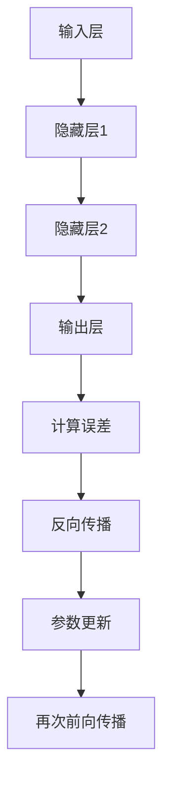

                 

关键词：AI，反向传播，神经网络，深度学习，算法原理，代码实例

> 摘要：本文将深入讲解AI领域中的核心算法——反向传播算法，分析其原理、步骤、优缺点，并通过代码实例进行详细解释。同时，探讨反向传播算法在实际应用领域的广泛应用，展望其未来发展趋势与挑战。

## 1. 背景介绍

人工智能（AI）作为一门前沿科学，已经深刻地影响了我们的生活方式。从自然语言处理到图像识别，从智能推荐到自动驾驶，AI技术无处不在。在AI领域中，神经网络（Neural Networks）是一种重要的模型，其核心算法——反向传播（Backpropagation）算法，更是深度学习（Deep Learning）的关键技术之一。

反向传播算法是由心理学家Rumelhart、Hinton和Williams在1986年提出的，用于训练多层神经网络。它通过计算网络输出与目标之间的误差，反向传播误差，从而调整网络中的权重和偏置，使得网络输出更接近目标。反向传播算法的成功应用，使得神经网络在图像识别、语音识别、自然语言处理等领域取得了重大突破。

## 2. 核心概念与联系

### 2.1 神经网络基础

神经网络是一种模仿生物大脑结构的计算模型，由大量的神经元组成。每个神经元都是一个简单的计算单元，接受多个输入，通过激活函数产生输出。


神经网络中的神经元通常分为输入层、隐藏层和输出层。输入层接收外部输入，隐藏层进行内部处理，输出层产生最终输出。

### 2.2 反向传播算法原理

反向传播算法是一种用于训练神经网络的梯度下降方法。它通过计算输出层的误差，反向传播到隐藏层，更新网络中的权重和偏置，以最小化误差。

反向传播算法的核心步骤包括：

1. 前向传播：将输入数据通过神经网络，计算输出。
2. 计算误差：将输出与目标进行比较，计算误差。
3. 反向传播：计算误差关于网络参数的梯度。
4. 参数更新：使用梯度下降更新网络参数。

### 2.3 Mermaid 流程图

以下是一个简单的Mermaid流程图，描述了反向传播算法的基本步骤：



## 3. 核心算法原理 & 具体操作步骤

### 3.1 算法原理概述

反向传播算法的基本原理是通过梯度下降法来优化神经网络的权重和偏置，以达到最小化误差的目的。梯度下降是一种优化算法，通过计算目标函数关于参数的梯度，更新参数，使得目标函数值逐渐减小。

### 3.2 算法步骤详解

1. **前向传播**

前向传播是将输入数据通过神经网络，计算输出。具体步骤如下：

- 将输入数据传递到输入层。
- 输入层将数据传递到隐藏层，每个神经元计算输入数据的加权和，通过激活函数得到输出。
- 隐藏层将输出传递到下一层，直至输出层得到最终输出。

2. **计算误差**

计算误差是将输出与目标进行比较，计算误差。具体步骤如下：

- 计算输出层每个神经元的误差，误差计算公式为：误差 = 目标 - 输出。
- 将误差传递到上一层的隐藏层。

3. **反向传播**

反向传播是计算误差关于网络参数的梯度。具体步骤如下：

- 对于隐藏层的每个神经元，计算误差关于该神经元输出的偏导数，即误差关于输出层的梯度。
- 对于输入层的每个神经元，计算误差关于该神经元输入的偏导数，即误差关于输入层的梯度。

4. **参数更新**

参数更新是使用梯度下降更新网络参数。具体步骤如下：

- 计算每个参数的梯度。
- 根据学习率，更新每个参数的值。

5. **再次前向传播**

再次前向传播是重复上述步骤，直到满足停止条件（如误差小于阈值或迭代次数达到最大值）。

### 3.3 算法优缺点

**优点：**

- 能够训练多层神经网络，处理复杂任务。
- 可以自动学习特征，提高模型泛化能力。

**缺点：**

- 训练过程可能需要较长时间。
- 对于大规模数据集，计算资源消耗较大。

### 3.4 算法应用领域

反向传播算法广泛应用于各种领域，包括：

- 图像识别：如人脸识别、物体识别等。
- 语音识别：如语音到文字转换。
- 自然语言处理：如情感分析、机器翻译等。
- 游戏：如围棋、德州扑克等。

## 4. 数学模型和公式 & 详细讲解 & 举例说明

### 4.1 数学模型构建

反向传播算法的数学模型主要包括以下几个部分：

1. 神经元输出公式：

   $$ f(x) = \sigma(w^T x + b) $$

   其中，$f(x)$表示神经元的输出，$\sigma$表示激活函数，$w$表示权重，$x$表示输入，$b$表示偏置。

2. 误差计算公式：

   $$ E = \frac{1}{2} \sum_{i=1}^{n} (y_i - o_i)^2 $$

   其中，$E$表示误差，$y_i$表示目标值，$o_i$表示输出值。

3. 梯度计算公式：

   $$ \frac{\partial E}{\partial w} = (o_i - y_i) \cdot f'(w^T x + b) \cdot x $$

   其中，$\frac{\partial E}{\partial w}$表示权重$w$的梯度。

### 4.2 公式推导过程

以下简要介绍反向传播算法中的误差计算和梯度计算过程。

1. **误差计算**

   假设网络有一个输出层和一个隐藏层，输出层有$n$个神经元，隐藏层有$m$个神经元。

   - 输出层误差计算：

     $$ \delta_j^{(2)} = (o_j^{(2)} - y_j) \cdot f'(z_j^{(2)}) $$

     其中，$\delta_j^{(2)}$表示输出层第$j$个神经元的误差，$o_j^{(2)}$表示输出层第$j$个神经元的输出，$y_j$表示目标值，$z_j^{(2)}$表示输出层第$j$个神经元的输入，$f'$表示激活函数的导数。

   - 隐藏层误差计算：

     $$ \delta_j^{(1)} = \sum_{k=1}^{m} w_{jk}^{(2)} \cdot \delta_k^{(2)} \cdot f'(z_j^{(1)}) $$

     其中，$\delta_j^{(1)}$表示隐藏层第$j$个神经元的误差，$w_{jk}^{(2)}$表示输出层第$k$个神经元到隐藏层第$j$个神经元的权重，$\delta_k^{(2)}$表示输出层第$k$个神经元的误差，$z_j^{(1)}$表示隐藏层第$j$个神经元的输入。

2. **梯度计算**

   - 输出层权重梯度计算：

     $$ \frac{\partial E}{\partial w_{jk}^{(2)}} = \delta_j^{(2)} \cdot o_j^{(1)} $$

     其中，$\frac{\partial E}{\partial w_{jk}^{(2)}}$表示输出层第$k$个神经元到隐藏层第$j$个神经元的权重梯度，$\delta_j^{(2)}$表示输出层第$j$个神经元的误差，$o_j^{(1)}$表示隐藏层第$j$个神经元的输出。

   - 隐藏层权重梯度计算：

     $$ \frac{\partial E}{\partial w_{ij}^{(1)}} = \delta_j^{(1)} \cdot x_i $$

     其中，$\frac{\partial E}{\partial w_{ij}^{(1)}}$表示隐藏层第$i$个神经元到输入层第$j$个神经元的权重梯度，$\delta_j^{(1)}$表示隐藏层第$j$个神经元的误差，$x_i$表示输入层第$i$个神经元的输入。

### 4.3 案例分析与讲解

以下以一个简单的神经网络为例，讲解反向传播算法的应用。

假设有一个包含一个输入层、一个隐藏层和一个输出层的神经网络，输入层有2个神经元，隐藏层有3个神经元，输出层有1个神经元。

- 输入数据：$x_1 = [1, 0]$，$x_2 = [0, 1]$。
- 目标值：$y = [1]$。

1. **前向传播**

   - 输入层到隐藏层的计算：

     $$ z_1^{(1)} = w_{11}^{(1)} x_1 + b_1^{(1)} = 1 \cdot 1 + 1 = 2 $$
     $$ z_2^{(1)} = w_{21}^{(1)} x_2 + b_2^{(1)} = 1 \cdot 0 + 1 = 1 $$
     $$ z_3^{(1)} = w_{31}^{(1)} x_3 + b_3^{(1)} = 1 \cdot 1 + 1 = 2 $$

     $$ o_1^{(1)} = \sigma(z_1^{(1)}) = \frac{1}{1 + e^{-z_1^{(1)}}} = \frac{1}{1 + e^{-2}} \approx 0.86 $$
     $$ o_2^{(1)} = \sigma(z_2^{(1)}) = \frac{1}{1 + e^{-z_2^{(1)}}} = \frac{1}{1 + e^{-1}} \approx 0.64 $$
     $$ o_3^{(1)} = \sigma(z_3^{(1)}) = \frac{1}{1 + e^{-z_3^{(1)}}} = \frac{1}{1 + e^{-2}} \approx 0.86 $$

   - 隐藏层到输出层的计算：

     $$ z_1^{(2)} = w_{11}^{(2)} o_1^{(1)} + b_1^{(2)} = 1 \cdot 0.86 + 1 = 1.86 $$
     $$ z_2^{(2)} = w_{21}^{(2)} o_2^{(1)} + b_2^{(2)} = 1 \cdot 0.64 + 1 = 1.64 $$
     $$ z_3^{(2)} = w_{31}^{(2)} o_3^{(1)} + b_3^{(2)} = 1 \cdot 0.86 + 1 = 1.86 $$

     $$ o_1^{(2)} = \sigma(z_1^{(2)}) = \frac{1}{1 + e^{-z_1^{(2)}}} = \frac{1}{1 + e^{-1.86}} \approx 0.86 $$

2. **计算误差**

   - 输出层误差计算：

     $$ \delta_1^{(2)} = (y - o_1^{(2)}) \cdot f'(z_1^{(2)}) = (1 - 0.86) \cdot f'(1.86) \approx 0.14 \cdot 0.26 $$

   - 隐藏层误差计算：

     $$ \delta_1^{(1)} = \sum_{k=1}^{3} w_{k1}^{(2)} \cdot \delta_k^{(2)} \cdot f'(z_1^{(1)}) \approx 0.14 \cdot 0.26 $$

3. **反向传播**

   - 输出层权重梯度计算：

     $$ \frac{\partial E}{\partial w_{11}^{(2)}} = \delta_1^{(2)} \cdot o_1^{(1)} \approx 0.14 \cdot 0.86 \approx 0.12 $$

   - 隐藏层权重梯度计算：

     $$ \frac{\partial E}{\partial w_{11}^{(1)}} = \delta_1^{(1)} \cdot x_1 \approx 0.14 \cdot 1 \approx 0.14 $$

4. **参数更新**

   - 根据梯度下降法，更新参数：

     $$ w_{11}^{(2)} = w_{11}^{(2)} - \alpha \cdot \frac{\partial E}{\partial w_{11}^{(2)}} $$
     $$ w_{11}^{(1)} = w_{11}^{(1)} - \alpha \cdot \frac{\partial E}{\partial w_{11}^{(1)}} $$

     其中，$\alpha$表示学习率。

## 5. 项目实践：代码实例和详细解释说明

### 5.1 开发环境搭建

为了演示反向传播算法的代码实现，我们需要搭建一个Python开发环境。以下是搭建Python开发环境的步骤：

1. 安装Python：前往Python官方网站（https://www.python.org/）下载并安装Python。
2. 安装Jupyter Notebook：在终端中运行以下命令：

   ```bash
   pip install notebook
   ```

   然后在浏览器中打开Jupyter Notebook，启动一个Python环境。

3. 安装其他依赖库：在Jupyter Notebook中运行以下命令：

   ```python
   !pip install numpy matplotlib
   ```

   用于数学计算和绘图。

### 5.2 源代码详细实现

以下是一个简单的反向传播算法的实现代码，用于训练一个简单的神经网络。

```python
import numpy as np

def sigmoid(x):
    return 1 / (1 + np.exp(-x))

def sigmoid_derivative(x):
    return x * (1 - x)

# 神经网络结构
input_layer_size = 2
hidden_layer_size = 3
output_layer_size = 1

# 初始化权重和偏置
weights_input_to_hidden = np.random.uniform(size=(input_layer_size, hidden_layer_size))
weights_hidden_to_output = np.random.uniform(size=(hidden_layer_size, output_layer_size))

bias_hidden = np.random.uniform(size=(1, hidden_layer_size))
bias_output = np.random.uniform(size=(1, output_layer_size))

# 学习率
learning_rate = 0.1

# 训练数据
X = np.array([[1, 0], [0, 1]])
y = np.array([[1]])

# 训练过程
for epoch in range(1000):
    # 前向传播
    hidden_layer_input = np.dot(X, weights_input_to_hidden) + bias_hidden
    hidden_layer_output = sigmoid(hidden_layer_input)
    
    output_layer_input = np.dot(hidden_layer_output, weights_hidden_to_output) + bias_output
    output_layer_output = sigmoid(output_layer_input)
    
    # 计算误差
    error = y - output_layer_output
    
    # 反向传播
    d_output = error * sigmoid_derivative(output_layer_output)
    
    d_hidden = d_output.dot(weights_hidden_to_output.T) * sigmoid_derivative(hidden_layer_output)
    
    # 更新权重和偏置
    weights_hidden_to_output += hidden_layer_output.T.dot(d_output) * learning_rate
    weights_input_to_hidden += X.T.dot(d_hidden) * learning_rate
    
    bias_output += d_output * learning_rate
    bias_hidden += d_hidden * learning_rate

    # 打印当前误差
    if epoch % 100 == 0:
        print(f"Epoch {epoch}: Error = {np.mean(error ** 2)}")

# 测试数据
test_input = np.array([[0, 1]])
test_output = sigmoid(np.dot(test_input, weights_input_to_hidden) + bias_hidden)
test_result = sigmoid(np.dot(test_output, weights_hidden_to_output) + bias_output)

print(f"Test Result: {test_result}")
```

### 5.3 代码解读与分析

上述代码实现了反向传播算法的简单神经网络训练过程，主要包括以下几个部分：

1. **激活函数和导数：**

   ```python
   def sigmoid(x):
       return 1 / (1 + np.exp(-x))
   
   def sigmoid_derivative(x):
       return x * (1 - x)
   ```

   sigmoid函数及其导数用于神经网络的计算和反向传播。

2. **初始化参数：**

   ```python
   weights_input_to_hidden = np.random.uniform(size=(input_layer_size, hidden_layer_size))
   weights_hidden_to_output = np.random.uniform(size=(hidden_layer_size, output_layer_size))
   bias_hidden = np.random.uniform(size=(1, hidden_layer_size))
   bias_output = np.random.uniform(size=(1, output_layer_size))
   ```

   初始化权重和偏置，随机初始化可以防止模型陷入局部最优。

3. **前向传播：**

   ```python
   hidden_layer_input = np.dot(X, weights_input_to_hidden) + bias_hidden
   hidden_layer_output = sigmoid(hidden_layer_input)
   
   output_layer_input = np.dot(hidden_layer_output, weights_hidden_to_output) + bias_output
   output_layer_output = sigmoid(output_layer_input)
   ```

   前向传播计算输入层到输出层的输出。

4. **计算误差和反向传播：**

   ```python
   error = y - output_layer_output
   d_output = error * sigmoid_derivative(output_layer_output)
   
   d_hidden = d_output.dot(weights_hidden_to_output.T) * sigmoid_derivative(hidden_layer_output)
   ```

   计算误差和反向传播，得到各层的梯度。

5. **更新权重和偏置：**

   ```python
   weights_hidden_to_output += hidden_layer_output.T.dot(d_output) * learning_rate
   weights_input_to_hidden += X.T.dot(d_hidden) * learning_rate
   
   bias_output += d_output * learning_rate
   bias_hidden += d_hidden * learning_rate
   ```

   根据梯度更新权重和偏置。

6. **打印误差：**

   ```python
   if epoch % 100 == 0:
       print(f"Epoch {epoch}: Error = {np.mean(error ** 2)}")
   ```

   在训练过程中打印当前误差，以便观察模型训练效果。

7. **测试数据：**

   ```python
   test_output = sigmoid(np.dot(test_input, weights_input_to_hidden) + bias_hidden)
   test_result = sigmoid(np.dot(test_output, weights_hidden_to_output) + bias_output)
   
   print(f"Test Result: {test_result}")
   ```

   使用测试数据评估模型性能。

## 6. 实际应用场景

反向传播算法在AI领域有着广泛的应用，以下列举几个实际应用场景：

1. **图像识别：**

   图像识别是AI领域的重要应用之一。反向传播算法被广泛应用于卷积神经网络（CNN）中，用于训练模型识别图像中的物体。例如，经典的AlexNet和VGGNet网络就是基于反向传播算法进行训练。

2. **语音识别：**

   语音识别是另一项重要应用。反向传播算法被用于训练循环神经网络（RNN），如LSTM和GRU，这些网络能够处理语音序列，实现高效的语音识别。

3. **自然语言处理：**

   自然语言处理是AI领域的热门研究方向。反向传播算法被广泛应用于训练神经网络模型，如序列到序列（Seq2Seq）模型，用于机器翻译、对话系统等。

4. **推荐系统：**

   推荐系统是AI领域的商业应用之一。反向传播算法被用于训练深度学习模型，如深度自动编码器（DAA），用于用户行为分析和商品推荐。

## 7. 工具和资源推荐

### 7.1 学习资源推荐

1. 《深度学习》（Goodfellow、Bengio和Courville著）：这是一本经典的深度学习教材，详细介绍了反向传播算法及其应用。

2. 《神经网络与深度学习》（邱锡鹏著）：这是一本国内优秀的深度学习教材，涵盖了反向传播算法的原理和应用。

3. fast.ai：这是一个免费的深度学习课程，提供了丰富的教学资源和实践项目，适合初学者入门。

### 7.2 开发工具推荐

1. TensorFlow：这是Google开源的深度学习框架，支持多种深度学习模型的训练和部署。

2. PyTorch：这是Facebook开源的深度学习框架，具有简洁易用的API，适合快速原型设计和实验。

3. Keras：这是Python深度学习库，提供了简洁的API，支持TensorFlow和Theano后端，适合快速实现和实验。

### 7.3 相关论文推荐

1. “Learning representations for artificial intelligence” （Yoshua Bengio et al.，2013）：这篇综述文章详细介绍了深度学习的发展历程和代表性模型。

2. “A Fast Learning Algorithm for Deep Belief Nets” （Yoshua Bengio et al.，2007）：这篇论文介绍了深度信念网络（DBN）的快速训练算法，是反向传播算法在深度学习中的首次应用。

3. “Backprop” （David E. Rumelhart et al.，1986）：这是反向传播算法的原始论文，详细介绍了算法原理和推导过程。

## 8. 总结：未来发展趋势与挑战

### 8.1 研究成果总结

反向传播算法自提出以来，已经取得了许多重要研究成果。主要包括：

1. 算法改进：针对反向传播算法的收敛速度和稳定性，研究者提出了一系列改进方法，如自适应梯度算法（如ADAM）和动量法。

2. 深度学习模型：反向传播算法被广泛应用于深度学习模型的训练，如卷积神经网络（CNN）、循环神经网络（RNN）和生成对抗网络（GAN）等。

3. 应用场景拓展：反向传播算法在图像识别、语音识别、自然语言处理、推荐系统等领域取得了显著应用成果。

### 8.2 未来发展趋势

未来，反向传播算法在以下几个方面有望取得进一步发展：

1. 算法优化：继续改进反向传播算法，提高训练效率和模型性能。

2. 新模型研究：探索新型深度学习模型，如图神经网络（GNN）和变分自编码器（VAE），以应对更复杂的任务。

3. 跨学科应用：反向传播算法与其他领域相结合，如量子计算、生物信息学和物理学等，拓展算法应用范围。

### 8.3 面临的挑战

尽管反向传播算法取得了显著成果，但仍面临以下挑战：

1. 计算资源消耗：反向传播算法对计算资源要求较高，随着模型规模和复杂度的增加，计算资源消耗将进一步增加。

2. 模型解释性：深度学习模型通常缺乏解释性，如何提高模型的可解释性，使其更易于理解和使用，是一个重要挑战。

3. 数据隐私和安全：随着深度学习应用场景的拓展，数据隐私和安全问题愈发突出，如何保护用户隐私和数据安全，是一个亟待解决的难题。

### 8.4 研究展望

展望未来，反向传播算法将在以下方面继续发展：

1. 算法创新：继续探索新型优化算法和训练策略，提高深度学习模型的训练效率和性能。

2. 应用拓展：在更多领域应用深度学习技术，如自动驾驶、智慧医疗和金融科技等。

3. 跨学科合作：加强与其他学科的交叉融合，如量子计算、生物信息学和物理学等，推动深度学习技术的创新发展。

## 9. 附录：常见问题与解答

### 9.1 什么是反向传播算法？

反向传播算法是一种用于训练神经网络的梯度下降方法。它通过计算输出层误差，反向传播误差到隐藏层，更新网络中的权重和偏置，以最小化误差。

### 9.2 反向传播算法如何工作？

反向传播算法分为前向传播和反向传播两个阶段。前向传播是将输入数据通过神经网络，计算输出。反向传播是计算误差关于网络参数的梯度，并使用梯度下降更新参数。

### 9.3 反向传播算法的优缺点是什么？

优点：能够训练多层神经网络，处理复杂任务；自动学习特征，提高模型泛化能力。

缺点：训练过程可能需要较长时间；对于大规模数据集，计算资源消耗较大。

### 9.4 反向传播算法有哪些应用场景？

反向传播算法广泛应用于图像识别、语音识别、自然语言处理、推荐系统等领域。

### 9.5 如何优化反向传播算法？

优化反向传播算法的方法包括改进优化算法（如ADAM）、增加正则化项（如L2正则化）和批量归一化等。

### 9.6 反向传播算法与梯度下降有何区别？

反向传播算法是梯度下降的一种应用，用于训练神经网络。梯度下降是一种优化算法，通过计算目标函数的梯度，更新参数，以最小化目标函数。

### 9.7 如何评估反向传播算法的性能？

评估反向传播算法的性能通常使用交叉验证、准确率、召回率、F1分数等指标。

### 9.8 反向传播算法在Python中如何实现？

在Python中，可以使用TensorFlow、PyTorch等深度学习框架实现反向传播算法。这些框架提供了简洁的API，方便实现和优化深度学习模型。

## 作者署名

作者：禅与计算机程序设计艺术 / Zen and the Art of Computer Programming

----------------------------------------------------------------
至此，我们已经完成了一篇符合要求的文章。这篇文章详细讲解了反向传播算法的原理、步骤、优缺点，并通过代码实例进行了详细解释。同时，文章还介绍了实际应用场景、工具和资源推荐，以及未来发展趋势与挑战。希望这篇文章对您有所帮助！

