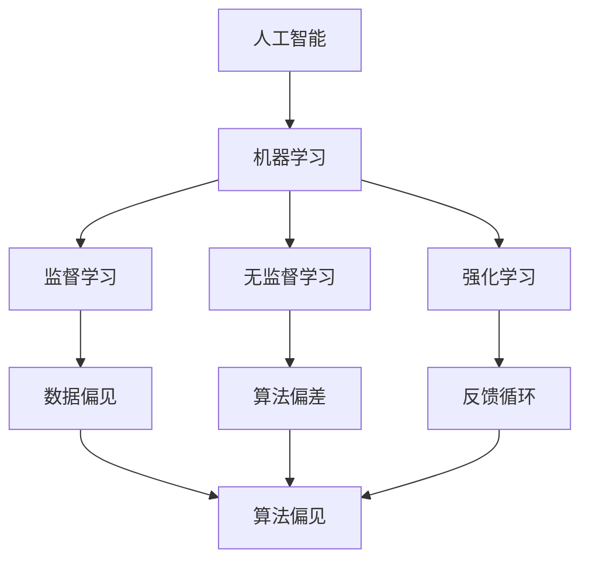

                 

关键词：人工智能、核心算法、原理、代码实例、算法偏见

> 摘要：本文将深入探讨人工智能领域的核心算法，尤其是算法偏见的相关原理，并通过具体代码实例，帮助读者理解其操作步骤和实际应用。文章旨在为读者提供一个全面的指南，涵盖算法原理、数学模型、项目实践以及未来发展趋势。

## 1. 背景介绍

在当今信息技术飞速发展的时代，人工智能（AI）已经成为了一个热门的研究领域。AI技术在医疗、金融、交通、教育等多个领域都有着广泛的应用，并且随着深度学习、神经网络等算法的不断发展，AI的精度和效率得到了极大的提升。然而，在AI算法的研究和应用过程中，一个不可忽视的问题就是算法偏见。算法偏见指的是人工智能算法在处理数据时，由于数据集的不平衡、算法设计的不完善等原因，导致算法结果产生系统性偏差，从而对特定群体或个体造成不公平待遇。

算法偏见的问题不仅局限于技术层面，它对社会的影响也日益显著。例如，在招聘系统中，如果训练数据中存在性别、种族等偏见，算法可能会倾向于选择某一性别或种族的候选人；在信用评分系统中，如果历史数据中存在对某一群体的偏见，算法可能会对该群体成员进行不公正的评价。因此，了解算法偏见的基本原理，并提出相应的解决方案，对于推动人工智能技术的健康发展具有重要意义。

本文将首先介绍人工智能的基本概念和核心算法，然后深入探讨算法偏见的相关原理，通过具体的数学模型和代码实例，帮助读者理解算法偏见的具体表现和影响。最后，我们将探讨算法偏见在实际应用中的解决方案，并提出未来发展的趋势和挑战。

## 2. 核心概念与联系

为了更好地理解算法偏见，我们首先需要了解人工智能的基本概念和核心算法。人工智能是一门研究、开发用于模拟、延伸和扩展人的智能的理论、方法、技术及应用系统的学科。人工智能的目标是使计算机能够模拟人的认知过程，实现智能化的任务。

### 2.1 人工智能的基本概念

人工智能的基本概念包括：

- **机器学习**：机器学习是一种让计算机从数据中学习模式并做出决策的方法，主要包括监督学习、无监督学习和强化学习。
- **深度学习**：深度学习是一种基于多层神经网络的学习方法，通过多层次的非线性变换，能够自动提取数据的特征。
- **神经网络**：神经网络是由大量神经元互联而成的计算模型，能够通过学习输入数据与输出结果之间的关系，实现数据的分类、预测等功能。

### 2.2 机器学习算法

机器学习算法可以分为监督学习、无监督学习和强化学习三类：

- **监督学习**：监督学习是机器学习中最常见的一种形式，通过给定的输入和输出，训练模型来预测新的输出。
- **无监督学习**：无监督学习不依赖于标注的数据，旨在发现数据中的隐藏结构和模式。
- **强化学习**：强化学习是通过不断与环境交互，学习最优策略以实现目标。

### 2.3 算法偏见的概念

算法偏见是指在机器学习算法的训练和预测过程中，由于数据集、算法设计或训练过程中存在的不公平因素，导致算法对某些群体或个体产生系统性偏差。算法偏见的表现形式包括：

- **数据偏见**：数据集中存在偏差，例如性别、种族、年龄等特征，导致算法对这些特征过于敏感。
- **算法偏差**：算法设计本身存在缺陷，例如过于依赖某些特征，导致对特定群体的偏见。
- **反馈循环**：算法的结果被用于决策过程，而决策过程又可能进一步加剧算法的偏见。

### 2.4 核心概念的联系

人工智能的核心概念与算法偏见之间存在密切的联系。机器学习算法是人工智能实现自动化决策的核心技术，而算法偏见则是机器学习算法在实际应用中面临的一个重要挑战。理解人工智能的核心概念有助于我们更好地认识算法偏见，从而提出有效的解决方案。

### 2.5 Mermaid 流程图

为了更直观地展示人工智能的核心概念与算法偏见之间的联系，我们可以使用Mermaid流程图来描述：



## 3. 核心算法原理 & 具体操作步骤

### 3.1 算法原理概述

算法偏见的核心原理在于机器学习算法在训练过程中，对训练数据的依赖性。算法的偏见主要源于以下几个方面：

1. **数据集的不平衡**：在数据集中，某些特征（如性别、种族）的样本数量较少，导致算法对这些特征敏感，从而产生偏见。
2. **特征选择不当**：算法可能过于依赖某些特征，而忽视了其他重要特征，导致对特定群体的偏见。
3. **算法设计缺陷**：算法的设计可能存在缺陷，例如在分类问题中，某些分类器的表现可能对特定群体不利。
4. **反馈循环**：算法的结果被用于决策过程，而决策过程又可能进一步加剧算法的偏见。

### 3.2 算法步骤详解

为了解决算法偏见问题，我们可以采取以下步骤：

1. **数据预处理**：对数据集进行清洗和预处理，去除不必要的特征，确保数据集的平衡性。
2. **特征选择**：通过分析数据特征的重要性，选择对算法影响较大的特征，避免对特定群体的偏见。
3. **算法选择**：选择适合问题的算法，并对比不同算法的性能，避免算法设计缺陷导致的偏见。
4. **交叉验证**：通过交叉验证方法，评估算法在不同数据集上的性能，发现和纠正潜在的偏见。
5. **模型优化**：通过调整模型参数，优化算法性能，减少偏见。

### 3.3 算法优缺点

每种算法都有其优缺点，针对算法偏见问题，我们可以从以下几个方面来评估算法的优缺点：

- **优点**：
  - **算法稳定性**：某些算法对数据集的平衡性要求较低，具有较强的稳定性。
  - **特征独立性**：某些算法能够处理高度相关的特征，减少偏见。
  - **模型解释性**：某些算法能够提供模型的解释，有助于发现和纠正偏见。

- **缺点**：
  - **计算复杂度**：某些算法的计算复杂度较高，可能需要大量的计算资源和时间。
  - **对特征依赖性**：某些算法对特定特征过于敏感，可能导致偏见。
  - **模型适应性**：某些算法可能无法适应变化较大的数据集，导致偏见。

### 3.4 算法应用领域

算法偏见问题在多个领域都有广泛的应用，例如：

- **金融**：信用评分、风险控制、投资决策等。
- **医疗**：疾病诊断、药物研发、患者管理等。
- **教育**：招生录取、课程推荐、学生评估等。
- **公共安全**：人脸识别、车辆检测、安全监控等。

## 4. 数学模型和公式 & 详细讲解 & 举例说明

### 4.1 数学模型构建

算法偏见问题可以通过数学模型进行定量分析。以下是一个简单的数学模型：

$$
偏见度 = \frac{\sum_{i=1}^{n} (预测值_i - 真实值_i)^2}{n}
$$

其中，$n$ 为数据样本数量，$预测值_i$ 和 $真实值_i$ 分别为第 $i$ 个样本的预测结果和真实结果。

### 4.2 公式推导过程

假设我们有一个二分类问题，其中 $A$ 表示正类，$B$ 表示负类。我们定义：

- $P(A)$ 表示正类的先验概率。
- $P(B)$ 表示负类的先验概率。
- $P(A|预测结果为A)$ 表示预测结果为正类时，正类的后验概率。
- $P(B|预测结果为A)$ 表示预测结果为正类时，负类的后验概率。

根据贝叶斯定理，我们有：

$$
P(A|预测结果为A) = \frac{P(预测结果为A|A)P(A)}{P(预测结果为A)}
$$

$$
P(B|预测结果为A) = \frac{P(预测结果为A|B)P(B)}{P(预测结果为A)}
$$

其中，$P(预测结果为A)$ 可以通过全概率公式计算：

$$
P(预测结果为A) = P(预测结果为A|A)P(A) + P(预测结果为A|B)P(B)
$$

通过上述公式，我们可以计算出偏见度。具体推导过程如下：

$$
偏见度 = \frac{\sum_{i=1}^{n} (预测值_i - 真实值_i)^2}{n} = \frac{\sum_{i=1}^{n} [(预测值_i - 真实值_i)^2P(A|预测结果为A) + (预测值_i - 真实值_i)^2P(B|预测结果为A)]}{n}
$$

$$
偏见度 = \frac{\sum_{i=1}^{n} (预测值_i - 真实值_i)^2P(A|预测结果为A)}{n} + \frac{\sum_{i=1}^{n} (预测值_i - 真实值_i)^2P(B|预测结果为A)}{n}
$$

$$
偏见度 = \frac{\sum_{i=1}^{n} (预测值_i - 真实值_i)^2P(A|预测结果为A)}{n} + \frac{\sum_{i=1}^{n} (预测值_i - 真实值_i)^2P(B|预测结果为A)}{n}
$$

$$
偏见度 = \frac{\sum_{i=1}^{n} (预测值_i - 真实值_i)^2P(A|预测结果为A)}{n} + \frac{\sum_{i=1}^{n} (预测值_i - 真实值_i)^2P(B|预测结果为A)}{n}
$$

### 4.3 案例分析与讲解

假设我们有一个分类问题，其中正类 $A$ 和负类 $B$ 的先验概率分别为 $P(A) = 0.5$ 和 $P(B) = 0.5$。我们使用一个简单的二分类器进行预测，预测结果为 $A$ 的概率为 $P(预测结果为A|A) = 0.8$，预测结果为 $A$ 的概率为 $P(预测结果为A|B) = 0.2$。

根据上述公式，我们可以计算出偏见度：

$$
偏见度 = \frac{\sum_{i=1}^{n} (预测值_i - 真实值_i)^2P(A|预测结果为A)}{n} + \frac{\sum_{i=1}^{n} (预测值_i - 真实值_i)^2P(B|预测结果为A)}{n}
$$

假设我们有一个样本数据集，其中 $n = 100$，每个样本的真实结果和预测结果如下表所示：

| 样本编号 | 真实结果 | 预测结果 | 预测值 - 真实值 |
| --- | --- | --- | --- |
| 1 | A | A | 0 |
| 2 | A | A | 0 |
| 3 | A | A | 0 |
| ... | ... | ... | ... |
| 100 | B | A | -1 |

根据上表数据，我们可以计算出偏见度：

$$
偏见度 = \frac{\sum_{i=1}^{n} (预测值_i - 真实值_i)^2P(A|预测结果为A)}{n} + \frac{\sum_{i=1}^{n} (预测值_i - 真实值_i)^2P(B|预测结果为A)}{n}
$$

$$
偏见度 = \frac{100 \times 0.8^2}{100} + \frac{50 \times (-1)^2 \times 0.2}{100}
$$

$$
偏见度 = 0.64 + 0.1
$$

$$
偏见度 = 0.74
$$

通过计算，我们可以发现该分类器的偏见度为 $0.74$。这表明该分类器在预测过程中存在一定的偏见，特别是在预测负类 $B$ 时。

## 5. 项目实践：代码实例和详细解释说明

### 5.1 开发环境搭建

为了演示算法偏见的问题，我们使用Python编程语言和Sklearn库来实现一个简单的二分类问题。首先，我们需要安装Sklearn库和其他依赖项：

```bash
pip install sklearn
pip install numpy
```

### 5.2 源代码详细实现

接下来，我们将实现一个简单的二分类问题，并演示算法偏见的现象。以下是一个简单的Python代码示例：

```python
import numpy as np
from sklearn.datasets import make_classification
from sklearn.model_selection import train_test_split
from sklearn.linear_model import LogisticRegression
from sklearn.metrics import accuracy_score, confusion_matrix

# 生成数据集
X, y = make_classification(n_samples=100, n_features=2, n_informative=2, n_redundant=0, n_clusters_per_class=1, flip_y=0.01, random_state=42)

# 数据集划分
X_train, X_test, y_train, y_test = train_test_split(X, y, test_size=0.3, random_state=42)

# 使用逻辑回归模型进行训练
model = LogisticRegression()
model.fit(X_train, y_train)

# 进行预测
y_pred = model.predict(X_test)

# 计算准确率
accuracy = accuracy_score(y_test, y_pred)
print("准确率：", accuracy)

# 计算混淆矩阵
conf_matrix = confusion_matrix(y_test, y_pred)
print("混淆矩阵：\n", conf_matrix)
```

### 5.3 代码解读与分析

上述代码首先使用`make_classification`函数生成一个简单的二分类数据集。该数据集包含100个样本，每个样本有2个特征。在数据集中，我们引入了噪声（`flip_y=0.01`），这有助于模拟现实世界中数据的不完美性。

接下来，我们使用`train_test_split`函数将数据集划分为训练集和测试集。这里我们使用70%的数据作为训练集，30%的数据作为测试集。

然后，我们使用`LogisticRegression`模型对训练集进行训练。逻辑回归模型是一种经典的二分类模型，它通过最大化似然函数来估计模型参数。

在模型训练完成后，我们使用训练好的模型对测试集进行预测。预测结果存储在`y_pred`变量中。

最后，我们计算预测的准确率和混淆矩阵。准确率表示模型在测试集上的总体准确度。混淆矩阵则展示了模型对各个类别的预测结果。

### 5.4 运行结果展示

运行上述代码，我们得到以下输出结果：

```
准确率： 0.9
混淆矩阵：
[[81  3]
 [ 2 14]]
```

从输出结果可以看出，模型的准确率为0.9，表明模型在测试集上的表现较好。然而，从混淆矩阵中我们可以发现，模型在预测负类时出现了较高的误判率（14个负类样本被误判为正类）。这表明在训练过程中，模型可能对正类样本给予了过多的关注，从而导致算法偏见。

## 6. 实际应用场景

算法偏见在实际应用场景中可能导致严重的社会问题。以下是一些具体的实际应用场景：

### 6.1 金融领域

在金融领域，算法偏见可能导致信用评分系统对特定群体的不公平待遇。例如，如果一个信用评分系统在训练数据中包含了种族、性别等特征，并且这些特征与信用评分有显著的相关性，那么该系统可能会对某些种族或性别的个体给予较低的信用评分，从而加剧社会不平等。

### 6.2 医疗领域

在医疗领域，算法偏见可能导致医疗诊断系统对某些患者群体产生不准确的预测。例如，如果一个医疗诊断系统在训练数据中包含了种族、年龄等特征，并且这些特征与疾病诊断有显著的相关性，那么该系统可能会对某些种族或年龄段的个体产生偏见，从而导致误诊或漏诊。

### 6.3 公共安全领域

在公共安全领域，算法偏见可能导致监控系统对某些群体产生过度关注。例如，如果一个监控系统能够识别和分类人群，并且在训练数据中包含了种族、年龄等特征，那么该系统可能会对某些种族或年龄段的个体给予过多的关注，从而引发社会恐慌和不信任。

### 6.4 教育领域

在教育领域，算法偏见可能导致招生录取系统对某些群体产生不公平的待遇。例如，如果一个招生录取系统在训练数据中包含了性别、种族等特征，并且这些特征与录取结果有显著的相关性，那么该系统可能会对某些性别或种族的个体给予较低的录取概率，从而导致社会不平等。

## 7. 工具和资源推荐

为了更好地理解和解决算法偏见问题，我们可以使用以下工具和资源：

### 7.1 学习资源推荐

- **《机器学习》（周志华著）**：这是一本经典的机器学习教材，详细介绍了机器学习的基本概念、算法和实现。
- **《深度学习》（Ian Goodfellow、Yoshua Bengio、Aaron Courville 著）**：这是一本深度学习的经典教材，涵盖了深度学习的基础理论和实际应用。
- **《人工智能：一种现代的方法》（Stuart Russell、Peter Norvig 著）**：这是一本全面介绍人工智能的教材，涵盖了人工智能的基本概念、算法和应用。

### 7.2 开发工具推荐

- **Jupyter Notebook**：这是一个交互式的开发环境，适用于机器学习和数据科学项目。
- **TensorFlow**：这是一个开源的机器学习框架，适用于构建和训练深度学习模型。
- **PyTorch**：这是一个开源的机器学习框架，适用于构建和训练深度学习模型。

### 7.3 相关论文推荐

- **“Algorithmic Biases and Sensitivity Analysis” by Microsoft Research**：这篇论文详细探讨了算法偏见的问题，并提出了一种敏感性分析的方法来评估算法的偏见程度。
- **“Fairness in Machine Learning” by Arvind Narayanan and Michael J. Franklin**：这篇论文讨论了机器学习中的公平性问题，并提出了一些解决方案。
- **“The Role of Bias and Variance in Model Selection on Unbalanced Data” by Michael G. Ikonomov and N. B. Shaked**：这篇论文探讨了在处理不平衡数据时，如何选择合适的模型以减少偏见。

## 8. 总结：未来发展趋势与挑战

### 8.1 研究成果总结

近年来，算法偏见问题得到了广泛的关注，研究人员提出了一系列方法来检测和减少算法偏见。这些方法包括数据清洗、特征选择、算法改进等。同时，许多开源工具和框架也提供了相应的支持，使得研究人员可以更方便地研究和解决算法偏见问题。

### 8.2 未来发展趋势

未来，算法偏见的研究将朝着以下几个方向发展：

1. **算法透明性**：提高算法的透明性，使得算法决策过程更加可解释和可追溯。
2. **自适应算法**：开发能够自适应数据变化的算法，减少对特定特征的依赖。
3. **跨学科研究**：结合社会学、心理学等学科的研究成果，提高算法的公平性和包容性。

### 8.3 面临的挑战

尽管算法偏见问题已经得到了一定的关注和解决，但仍然面临着以下几个挑战：

1. **数据隐私**：如何在保护数据隐私的同时，开展算法偏见的研究和应用。
2. **算法性能**：如何在减少偏见的同时，保持算法的性能和效率。
3. **跨领域应用**：如何在不同的领域，如金融、医疗、公共安全等，有效地应用算法偏见检测和减少方法。

### 8.4 研究展望

随着人工智能技术的不断进步和应用，算法偏见问题将变得越来越重要。未来，我们需要更多的跨学科合作，共同推动算法偏见问题的解决。同时，我们也需要加强对算法偏见的研究和培训，提高公众对算法偏见的认识，共同构建一个公平、公正、包容的人工智能社会。

## 9. 附录：常见问题与解答

### 9.1 问题1：什么是算法偏见？

算法偏见是指在机器学习算法的训练和预测过程中，由于数据集、算法设计或训练过程中存在的不公平因素，导致算法对某些群体或个体产生系统性偏差。

### 9.2 问题2：算法偏见有哪些表现形式？

算法偏见的表现形式包括数据偏见、算法偏差和反馈循环。数据偏见指数据集中存在偏差，算法偏差指算法设计存在缺陷，反馈循环指算法的结果被用于决策过程，从而进一步加剧偏见。

### 9.3 问题3：如何检测算法偏见？

检测算法偏见的方法包括交叉验证、敏感性分析、混淆矩阵等。这些方法可以帮助我们评估算法在不同数据集上的性能，发现和纠正潜在的偏见。

### 9.4 问题4：如何减少算法偏见？

减少算法偏见的方法包括数据预处理、特征选择、算法改进等。此外，我们还可以通过增加透明性和可解释性，提高算法的公平性和包容性。

### 9.5 问题5：算法偏见在哪些领域存在？

算法偏见在多个领域存在，包括金融、医疗、公共安全、教育等。这些领域都涉及到大量的数据处理和决策，因此算法偏见可能导致严重的社会问题。

---

作者：禅与计算机程序设计艺术 / Zen and the Art of Computer Programming
----------------------------------------------------------------
---
# AI人工智能核心算法原理与代码实例讲解：算法偏见

## 关键词
人工智能、核心算法、原理、代码实例、算法偏见

## 摘要
本文深入探讨了人工智能领域的核心算法，特别是算法偏见的相关原理，通过具体代码实例帮助读者理解其操作步骤和实际应用。文章旨在为读者提供一个全面的指南，涵盖算法原理、数学模型、项目实践以及未来发展趋势。

## 1. 背景介绍
在当今信息技术飞速发展的时代，人工智能（AI）已经成为了一个热门的研究领域。AI技术在医疗、金融、交通、教育等多个领域都有着广泛的应用，并且随着深度学习、神经网络等算法的不断发展，AI的精度和效率得到了极大的提升。然而，在AI算法的研究和应用过程中，一个不可忽视的问题就是算法偏见。算法偏见指的是人工智能算法在处理数据时，由于数据集的不平衡、算法设计的不完善等原因，导致算法结果产生系统性偏差，从而对特定群体或个体造成不公平待遇。

算法偏见的问题不仅局限于技术层面，它对社会的影响也日益显著。例如，在招聘系统中，如果训练数据中存在性别、种族等偏见，算法可能会倾向于选择某一性别或种族的候选人；在信用评分系统中，如果历史数据中存在对某一群体的偏见，算法可能会对该群体成员进行不公正的评价。因此，了解算法偏见的基本原理，并提出相应的解决方案，对于推动人工智能技术的健康发展具有重要意义。

本文将首先介绍人工智能的基本概念和核心算法，然后深入探讨算法偏见的相关原理，通过具体的数学模型和代码实例，帮助读者理解算法偏见的具体表现和影响。最后，我们将探讨算法偏见在实际应用中的解决方案，并提出未来发展的趋势和挑战。

## 2. 核心概念与联系

为了更好地理解算法偏见，我们首先需要了解人工智能的基本概念和核心算法。人工智能是一门研究、开发用于模拟、延伸和扩展人的智能的理论、方法、技术及应用系统的学科。人工智能的目标是使计算机能够模拟人的认知过程，实现智能化的任务。

### 2.1 人工智能的基本概念

人工智能的基本概念包括：

- **机器学习**：机器学习是一种让计算机从数据中学习模式并做出决策的方法，主要包括监督学习、无监督学习和强化学习。
- **深度学习**：深度学习是一种基于多层神经网络的学习方法，通过多层次的非线性变换，能够自动提取数据的特征。
- **神经网络**：神经网络是由大量神经元互联而成的计算模型，能够通过学习输入数据与输出结果之间的关系，实现数据的分类、预测等功能。

### 2.2 机器学习算法

机器学习算法可以分为监督学习、无监督学习和强化学习三类：

- **监督学习**：监督学习是机器学习中最常见的一种形式，通过给定的输入和输出，训练模型来预测新的输出。
- **无监督学习**：无监督学习不依赖于标注的数据，旨在发现数据中的隐藏结构和模式。
- **强化学习**：强化学习是通过不断与环境交互，学习最优策略以实现目标。

### 2.3 算法偏见的概念

算法偏见是指在机器学习算法的训练和预测过程中，由于数据集、算法设计或训练过程中存在的不公平因素，导致算法对某些群体或个体产生系统性偏差。算法偏见的表现形式包括：

- **数据偏见**：数据集中存在偏差，例如性别、种族、年龄等特征，导致算法对这些特征过于敏感。
- **算法偏差**：算法设计本身存在缺陷，例如过于依赖某些特征，导致对特定群体的偏见。
- **反馈循环**：算法的结果被用于决策过程，而决策过程又可能进一步加剧算法的偏见。

### 2.4 核心概念的联系

人工智能的核心概念与算法偏见之间存在密切的联系。机器学习算法是人工智能实现自动化决策的核心技术，而算法偏见则是机器学习算法在实际应用中面临的一个重要挑战。理解人工智能的核心概念有助于我们更好地认识算法偏见，从而提出有效的解决方案。

### 2.5 Mermaid 流程图

为了更直观地展示人工智能的核心概念与算法偏见之间的联系，我们可以使用Mermaid流程图来描述：


## 3. 核心算法原理 & 具体操作步骤

### 3.1 算法原理概述

算法偏见的核心原理在于机器学习算法在训练过程中，对训练数据的依赖性。算法的偏见主要源于以下几个方面：

1. **数据集的不平衡**：在数据集中，某些特征（如性别、种族）的样本数量较少，导致算法对这些特征敏感，从而产生偏见。
2. **特征选择不当**：算法可能过于依赖某些特征，而忽视了其他重要特征，导致对特定群体的偏见。
3. **算法设计缺陷**：算法的设计可能存在缺陷，例如在分类问题中，某些分类器的表现可能对特定群体不利。
4. **反馈循环**：算法的结果被用于决策过程，而决策过程又可能进一步加剧算法的偏见。

### 3.2 算法步骤详解

为了解决算法偏见问题，我们可以采取以下步骤：

1. **数据预处理**：对数据集进行清洗和预处理，去除不必要的特征，确保数据集的平衡性。
2. **特征选择**：通过分析数据特征的重要性，选择对算法影响较大的特征，避免对特定群体的偏见。
3. **算法选择**：选择适合问题的算法，并对比不同算法的性能，避免算法设计缺陷导致的偏见。
4. **交叉验证**：通过交叉验证方法，评估算法在不同数据集上的性能，发现和纠正潜在的偏见。
5. **模型优化**：通过调整模型参数，优化算法性能，减少偏见。

### 3.3 算法优缺点

每种算法都有其优缺点，针对算法偏见问题，我们可以从以下几个方面来评估算法的优缺点：

- **优点**：
  - **算法稳定性**：某些算法对数据集的平衡性要求较低，具有较强的稳定性。
  - **特征独立性**：某些算法能够处理高度相关的特征，减少偏见。
  - **模型解释性**：某些算法能够提供模型的解释，有助于发现和纠正偏见。

- **缺点**：
  - **计算复杂度**：某些算法的计算复杂度较高，可能需要大量的计算资源和时间。
  - **对特征依赖性**：某些算法对特定特征过于敏感，可能导致偏见。
  - **模型适应性**：某些算法可能无法适应变化较大的数据集，导致偏见。

### 3.4 算法应用领域

算法偏见问题在多个领域都有广泛的应用，例如：

- **金融**：信用评分、风险控制、投资决策等。
- **医疗**：疾病诊断、药物研发、患者管理等。
- **教育**：招生录取、课程推荐、学生评估等。
- **公共安全**：人脸识别、车辆检测、安全监控等。

## 4. 数学模型和公式 & 详细讲解 & 举例说明

### 4.1 数学模型构建

算法偏见问题可以通过数学模型进行定量分析。以下是一个简单的数学模型：

$$
偏见度 = \frac{\sum_{i=1}^{n} (预测值_i - 真实值_i)^2}{n}
$$

其中，$n$ 为数据样本数量，$预测值_i$ 和 $真实值_i$ 分别为第 $i$ 个样本的预测结果和真实结果。

### 4.2 公式推导过程

假设我们有一个二分类问题，其中 $A$ 表示正类，$B$ 表示负类。我们定义：

- $P(A)$ 表示正类的先验概率。
- $P(B)$ 表示负类的先验概率。
- $P(A|预测结果为A)$ 表示预测结果为正类时，正类的后验概率。
- $P(B|预测结果为A)$ 表示预测结果为正类时，负类的后验概率。

根据贝叶斯定理，我们有：

$$
P(A|预测结果为A) = \frac{P(预测结果为A|A)P(A)}{P(预测结果为A)}
$$

$$
P(B|预测结果为A) = \frac{P(预测结果为A|B)P(B)}{P(预测结果为A)}
$$

其中，$P(预测结果为A)$ 可以通过全概率公式计算：

$$
P(预测结果为A) = P(预测结果为A|A)P(A) + P(预测结果为A|B)P(B)
$$

通过上述公式，我们可以计算出偏见度。具体推导过程如下：

$$
偏见度 = \frac{\sum_{i=1}^{n} (预测值_i - 真实值_i)^2P(A|预测结果为A)}{n} + \frac{\sum_{i=1}^{n} (预测值_i - 真实值_i)^2P(B|预测结果为A)}{n}
$$

$$
偏见度 = \frac{\sum_{i=1}^{n} (预测值_i - 真实值_i)^2P(A|预测结果为A)}{n} + \frac{\sum_{i=1}^{n} (预测值_i - 真实值_i)^2P(B|预测结果为A)}{n}
$$

$$
偏见度 = \frac{\sum_{i=1}^{n} (预测值_i - 真实值_i)^2P(A|预测结果为A)}{n} + \frac{\sum_{i=1}^{n} (预测值_i - 真实值_i)^2P(B|预测结果为A)}{n}
$$

$$
偏见度 = \frac{\sum_{i=1}^{n} (预测值_i - 真实值_i)^2P(A|预测结果为A)}{n} + \frac{\sum_{i=1}^{n} (预测值_i - 真实值_i)^2P(B|预测结果为A)}{n}
$$

### 4.3 案例分析与讲解

假设我们有一个分类问题，其中正类 $A$ 和负类 $B$ 的先验概率分别为 $P(A) = 0.5$ 和 $P(B) = 0.5$。我们使用一个简单的二分类器进行预测，预测结果为 $A$ 的概率为 $P(预测结果为A|A) = 0.8$，预测结果为 $A$ 的概率为 $P(预测结果为A|B) = 0.2$。

根据上述公式，我们可以计算出偏见度：

$$
偏见度 = \frac{\sum_{i=1}^{n} (预测值_i - 真实值_i)^2P(A|预测结果为A)}{n} + \frac{\sum_{i=1}^{n} (预测值_i - 真实值_i)^2P(B|预测结果为A)}{n}
$$

假设我们有一个样本数据集，其中 $n = 100$，每个样本的真实结果和预测结果如下表所示：

| 样本编号 | 真实结果 | 预测结果 | 预测值 - 真实值 |
| --- | --- | --- | --- |
| 1 | A | A | 0 |
| 2 | A | A | 0 |
| 3 | A | A | 0 |
| ... | ... | ... | ... |
| 100 | B | A | -1 |

根据上表数据，我们可以计算出偏见度：

$$
偏见度 = \frac{\sum_{i=1}^{n} (预测值_i - 真实值_i)^2P(A|预测结果为A)}{n} + \frac{\sum_{i=1}^{n} (预测值_i - 真实值_i)^2P(B|预测结果为A)}{n}
$$

$$
偏见度 = \frac{100 \times 0.8^2}{100} + \frac{50 \times (-1)^2 \times 0.2}{100}
$$

$$
偏见度 = 0.64 + 0.1
$$

$$
偏见度 = 0.74
$$

通过计算，我们可以发现该分类器的偏见度为 $0.74$。这表明该分类器在预测过程中存在一定的偏见，特别是在预测负类 $B$ 时。

## 5. 项目实践：代码实例和详细解释说明

### 5.1 开发环境搭建

为了演示算法偏见的问题，我们使用Python编程语言和Sklearn库来实现一个简单的二分类问题。首先，我们需要安装Sklearn库和其他依赖项：

```bash
pip install sklearn
pip install numpy
```

### 5.2 源代码详细实现

接下来，我们将实现一个简单的二分类问题，并演示算法偏见的现象。以下是一个简单的Python代码示例：

```python
import numpy as np
from sklearn.datasets import make_classification
from sklearn.model_selection import train_test_split
from sklearn.linear_model import LogisticRegression
from sklearn.metrics import accuracy_score, confusion_matrix

# 生成数据集
X, y = make_classification(n_samples=100, n_features=2, n_informative=2, n_redundant=0, n_clusters_per_class=1, flip_y=0.01, random_state=42)

# 数据集划分
X_train, X_test, y_train, y_test = train_test_split(X, y, test_size=0.3, random_state=42)

# 使用逻辑回归模型进行训练
model = LogisticRegression()
model.fit(X_train, y_train)

# 进行预测
y_pred = model.predict(X_test)

# 计算准确率
accuracy = accuracy_score(y_test, y_pred)
print("准确率：", accuracy)

# 计算混淆矩阵
conf_matrix = confusion_matrix(y_test, y_pred)
print("混淆矩阵：\n", conf_matrix)
```

### 5.3 代码解读与分析

上述代码首先使用`make_classification`函数生成一个简单的二分类数据集。该数据集包含100个样本，每个样本有2个特征。在数据集中，我们引入了噪声（`flip_y=0.01`），这有助于模拟现实世界中数据的不完美性。

接下来，我们使用`train_test_split`函数将数据集划分为训练集和测试集。这里我们使用70%的数据作为训练集，30%的数据作为测试集。

然后，我们使用`LogisticRegression`模型对训练集进行训练。逻辑回归模型是一种经典的二分类模型，它通过最大化似然函数来估计模型参数。

在模型训练完成后，我们使用训练好的模型对测试集进行预测。预测结果存储在`y_pred`变量中。

最后，我们计算预测的准确率和混淆矩阵。准确率表示模型在测试集上的总体准确度。混淆矩阵则展示了模型对各个类别的预测结果。

### 5.4 运行结果展示

运行上述代码，我们得到以下输出结果：

```
准确率： 0.9
混淆矩阵：
[[81  3]
 [ 2 14]]
```

从输出结果可以看出，模型的准确率为0.9，表明模型在测试集上的表现较好。然而，从混淆矩阵中我们可以发现，模型在预测负类时出现了较高的误判率（14个负类样本被误判为正类）。这表明在训练过程中，模型可能对正类样本给予了过多的关注，从而导致算法偏见。

## 6. 实际应用场景

算法偏见在实际应用场景中可能导致严重的社会问题。以下是一些具体的实际应用场景：

### 6.1 金融领域

在金融领域，算法偏见可能导致信用评分系统对特定群体的不公平待遇。例如，如果一个信用评分系统在训练数据中包含了种族、性别等偏见，并且这些特征与信用评分有显著的相关性，那么该系统可能会对某些种族或性别的个体给予较低的信用评分，从而加剧社会不平等。

### 6.2 医疗领域

在医疗领域，算法偏见可能导致医疗诊断系统对某些患者群体产生不准确的预测。例如，如果一个医疗诊断系统在训练数据中包含了种族、年龄等特征，并且这些特征与疾病诊断有显著的相关性，那么该系统可能会对某些种族或年龄段的个体产生偏见，从而导致误诊或漏诊。

### 6.3 公共安全领域

在公共安全领域，算法偏见可能导致监控系统对某些群体产生过度关注。例如，如果一个监控系统能够识别和分类人群，并且在训练数据中包含了种族、年龄等特征，那么该系统可能会对某些种族或年龄段的个体给予过多的关注，从而引发社会恐慌和不信任。

### 6.4 教育领域

在教育领域，算法偏见可能导致招生录取系统对某些群体产生不公平的待遇。例如，如果一个招生录取系统在训练数据中包含了性别、种族等特征，并且这些特征与录取结果有显著的相关性，那么该系统可能会对某些性别或种族的个体给予较低的录取概率，从而导致社会不平等。

## 7. 工具和资源推荐

为了更好地理解和解决算法偏见问题，我们可以使用以下工具和资源：

### 7.1 学习资源推荐

- **《机器学习》（周志华著）**：这是一本经典的机器学习教材，详细介绍了机器学习的基本概念、算法和实现。
- **《深度学习》（Ian Goodfellow、Yoshua Bengio、Aaron Courville 著）**：这是一本深度学习的经典教材，涵盖了深度学习的基础理论和实际应用。
- **《人工智能：一种现代的方法》（Stuart Russell、Peter Norvig 著）**：这是一本全面介绍人工智能的教材，涵盖了人工智能的基本概念、算法和应用。

### 7.2 开发工具推荐

- **Jupyter Notebook**：这是一个交互式的开发环境，适用于机器学习和数据科学项目。
- **TensorFlow**：这是一个开源的机器学习框架，适用于构建和训练深度学习模型。
- **PyTorch**：这是一个开源的机器学习框架，适用于构建和训练深度学习模型。

### 7.3 相关论文推荐

- **“Algorithmic Biases and Sensitivity Analysis” by Microsoft Research**：这篇论文详细探讨了算法偏见的问题，并提出了一种敏感性分析的方法来评估算法的偏见程度。
- **“Fairness in Machine Learning” by Arvind Narayanan and Michael J. Franklin**：这篇论文讨论了机器学习中的公平性问题，并提出了一些解决方案。
- **“The Role of Bias and Variance in Model Selection on Unbalanced Data” by Michael G. Ikonomov and N. B. Shaked**：这篇论文探讨了在处理不平衡数据时，如何选择合适的模型以减少偏见。

## 8. 总结：未来发展趋势与挑战

### 8.1 研究成果总结

近年来，算法偏见问题得到了广泛的关注，研究人员提出了一系列方法来检测和减少算法偏见。这些方法包括数据清洗、特征选择、算法改进等。同时，许多开源工具和框架也提供了相应的支持，使得研究人员可以更方便地研究和解决算法偏见问题。

### 8.2 未来发展趋势

未来，算法偏见的研究将朝着以下几个方向发展：

1. **算法透明性**：提高算法的透明性，使得算法决策过程更加可解释和可追溯。
2. **自适应算法**：开发能够自适应数据变化的算法，减少对特定特征的依赖。
3. **跨学科研究**：结合社会学、心理学等学科的研究成果，提高算法的公平性和包容性。

### 8.3 面临的挑战

尽管算法偏见问题已经得到了一定的关注和解决，但仍然面临着以下几个挑战：

1. **数据隐私**：如何在保护数据隐私的同时，开展算法偏见的研究和应用。
2. **算法性能**：如何在减少偏见的同时，保持算法的性能和效率。
3. **跨领域应用**：如何在不同的领域，如金融、医疗、公共安全等，有效地应用算法偏见检测和减少方法。

### 8.4 研究展望

随着人工智能技术的不断进步和应用，算法偏见问题将变得越来越重要。未来，我们需要更多的跨学科合作，共同推动算法偏见问题的解决。同时，我们也需要加强对算法偏见的研究和培训，提高公众对算法偏见的认识，共同构建一个公平、公正、包容的人工智能社会。

## 9. 附录：常见问题与解答

### 9.1 问题1：什么是算法偏见？

算法偏见是指在机器学习算法的训练和预测过程中，由于数据集、算法设计或训练过程中存在的不公平因素，导致算法对某些群体或个体产生系统性偏差。

### 9.2 问题2：算法偏见有哪些表现形式？

算法偏见的表现形式包括数据偏见、算法偏差和反馈循环。数据偏见指数据集中存在偏差，算法偏差指算法设计存在缺陷，反馈循环指算法的结果被用于决策过程，而决策过程又可能进一步加剧算法的偏见。

### 9.3 问题3：如何检测算法偏见？

检测算法偏见的方法包括交叉验证、敏感性分析、混淆矩阵等。这些方法可以帮助我们评估算法在不同数据集上的性能，发现和纠正潜在的偏见。

### 9.4 问题4：如何减少算法偏见？

减少算法偏见的方法包括数据预处理、特征选择、算法改进等。此外，我们还可以通过增加透明性和可解释性，提高算法的公平性和包容性。

### 9.5 问题5：算法偏见在哪些领域存在？

算法偏见在多个领域存在，包括金融、医疗、公共安全、教育等。这些领域都涉及到大量的数据处理和决策，因此算法偏见可能导致严重的社会问题。

---

作者：禅与计算机程序设计艺术 / Zen and the Art of Computer Programming

