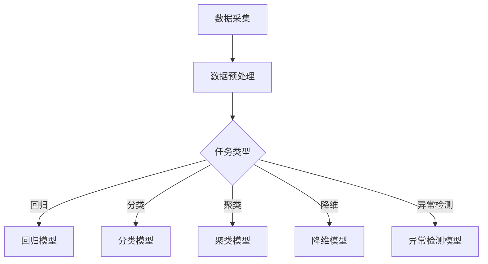

                 

关键词：人工智能，统计学习，机器学习，算法原理，代码实例，深度学习

> 摘要：本文将深入探讨统计学习在人工智能中的应用，详细讲解核心算法原理，并通过实际代码实例分析，帮助读者理解和掌握统计学习的基本概念、算法框架以及应用场景。

## 1. 背景介绍

统计学习作为机器学习的一个重要分支，旨在通过统计学方法对数据进行建模和分析，从中提取规律和知识。它广泛应用于分类、回归、聚类等任务中，是现代人工智能技术的基石之一。随着计算机性能的提升和大数据时代的到来，统计学习在众多领域取得了显著的进展，从金融分析到医疗诊断，从自然语言处理到计算机视觉，统计学习无处不在。

本文将围绕统计学习中的核心算法展开讨论，结合实际代码实例，深入讲解算法原理、数学模型以及实际应用。通过本文的阅读，读者将能够：

- 了解统计学习的基本概念和主要任务类型。
- 掌握常见统计学习算法的原理和实现方法。
- 学会使用数学工具和编程语言对统计学习问题进行分析和求解。
- 探索统计学习在实际应用中的挑战和解决方案。

## 2. 核心概念与联系

### 2.1 统计学习的基本概念

统计学习（Statistical Learning）主要包括以下几个基本概念：

- **样本（Sample）**：从总体（Population）中随机抽取的一部分数据。
- **特征（Feature）**：用于描述数据特征的变量或属性。
- **目标变量（Target Variable）**：用于预测或分类的变量。
- **模型（Model）**：根据样本数据拟合得到的统计模型，用于预测或分类。

### 2.2 统计学习的主要任务类型

统计学习的主要任务类型包括：

- **回归（Regression）**：预测连续值目标变量的方法。
- **分类（Classification）**：将数据划分为预定义的类别。
- **聚类（Clustering）**：发现数据中的自然分组或结构。
- **降维（Dimensionality Reduction）**：减少数据维度，简化模型复杂性。
- **异常检测（Anomaly Detection）**：识别数据中的异常或离群点。

### 2.3 统计学习与机器学习的联系

统计学习是机器学习的一个重要分支，两者的联系在于：

- **共同目标**：统计学习和机器学习的目标都是通过学习数据中的规律，实现数据的预测、分类或分析。
- **数据驱动**：两者都依赖于数据驱动的方法，通过从数据中提取特征和模式来构建模型。
- **模型评估**：两者都关注模型的性能评估，使用各种指标（如准确率、召回率、F1 分数等）来评估模型的效果。

### 2.4 Mermaid 流程图

以下是一个简化的统计学习流程图，展示了核心概念和任务类型的联系：



## 3. 核心算法原理 & 具体操作步骤

### 3.1 算法原理概述

统计学习算法主要分为监督学习（Supervised Learning）和无监督学习（Unsupervised Learning）两大类。监督学习通过已知的目标变量对特征进行学习，适用于回归和分类任务；无监督学习则通过挖掘数据中的内在结构，适用于聚类和降维任务。

在本节中，我们将介绍几种常见的监督学习算法，包括线性回归、逻辑回归和支持向量机（SVM）。

### 3.2 算法步骤详解

#### 3.2.1 线性回归

线性回归是最简单的统计学习算法，适用于线性可分的数据。其基本原理是通过最小化误差平方和来拟合一条直线。

1. **数据准备**：收集并整理数据，将特征变量和目标变量分开。
2. **模型拟合**：使用最小二乘法（Least Squares）拟合线性模型。
   $$ y = \beta_0 + \beta_1x $$
3. **模型评估**：计算预测误差，使用均方误差（Mean Squared Error, MSE）作为评价指标。
4. **模型优化**：调整模型参数，最小化误差。

#### 3.2.2 逻辑回归

逻辑回归（Logistic Regression）是一种广义线性模型，适用于二分类问题。其基本原理是通过最大似然估计（Maximum Likelihood Estimation）来拟合模型。

1. **数据准备**：收集并整理数据，将特征变量和目标变量分开。
2. **模型拟合**：使用最大似然估计方法拟合逻辑回归模型。
   $$ P(y=1|X) = \frac{1}{1 + e^{-(\beta_0 + \beta_1x)}} $$
3. **模型评估**：计算预测准确率、召回率等指标。
4. **模型优化**：调整模型参数，最大化似然函数。

#### 3.2.3 支持向量机（SVM）

支持向量机是一种二分类模型，适用于非线性可分的数据。其基本原理是通过寻找最佳分隔超平面来最大化分类边界。

1. **数据准备**：收集并整理数据，将特征变量和目标变量分开。
2. **模型拟合**：使用核函数（Kernel Function）将输入空间映射到高维空间，寻找最佳分隔超平面。
   $$ w \cdot x + b = 1 $$
3. **模型评估**：计算分类误差和分类边界。
4. **模型优化**：使用优化算法（如序列最小最优化算法，Sequential Minimal Optimization）调整模型参数。

### 3.3 算法优缺点

#### 线性回归

- **优点**：简单、易于理解和实现，适用于线性可分的数据。
- **缺点**：对噪声敏感，无法处理非线性数据。

#### 逻辑回归

- **优点**：适用于二分类问题，易于理解和实现。
- **缺点**：对稀疏数据和噪声敏感。

#### 支持向量机（SVM）

- **优点**：适用于非线性数据，能够找到最佳分隔超平面。
- **缺点**：计算复杂度较高，对大规模数据不友好。

### 3.4 算法应用领域

线性回归、逻辑回归和支持向量机在多个领域有着广泛的应用：

- **金融分析**：用于股票价格预测、信用评分等。
- **医学诊断**：用于疾病分类、诊断辅助等。
- **自然语言处理**：用于文本分类、情感分析等。
- **计算机视觉**：用于图像分类、目标检测等。

## 4. 数学模型和公式 & 详细讲解 & 举例说明

### 4.1 数学模型构建

在本节中，我们将介绍统计学习中的几种常见数学模型，并详细讲解其公式和推导过程。

#### 4.1.1 线性回归模型

线性回归模型的基本公式为：

$$ y = \beta_0 + \beta_1x $$

其中，\( y \) 是目标变量，\( x \) 是特征变量，\( \beta_0 \) 和 \( \beta_1 \) 是模型参数。

#### 4.1.2 逻辑回归模型

逻辑回归模型的基本公式为：

$$ P(y=1|X) = \frac{1}{1 + e^{-(\beta_0 + \beta_1x)}} $$

其中，\( P(y=1|X) \) 是目标变量为 1 的概率，\( X \) 是特征变量，\( \beta_0 \) 和 \( \beta_1 \) 是模型参数。

#### 4.1.3 支持向量机模型

支持向量机模型的基本公式为：

$$ w \cdot x + b = 1 $$

其中，\( w \) 是权重向量，\( x \) 是特征向量，\( b \) 是偏置项。

### 4.2 公式推导过程

在本节中，我们将对上述数学模型进行推导，以帮助读者更好地理解其原理。

#### 4.2.1 线性回归模型推导

线性回归模型的目标是最小化误差平方和，即：

$$ J(\beta_0, \beta_1) = \frac{1}{2} \sum_{i=1}^{n} (y_i - (\beta_0 + \beta_1x_i))^2 $$

其中，\( n \) 是样本数量，\( y_i \) 是第 \( i \) 个样本的目标变量，\( x_i \) 是第 \( i \) 个样本的特征变量。

对 \( J(\beta_0, \beta_1) \) 分别对 \( \beta_0 \) 和 \( \beta_1 \) 求导，并令导数为 0，得到：

$$ \frac{\partial J}{\partial \beta_0} = -\sum_{i=1}^{n} (y_i - (\beta_0 + \beta_1x_i)) = 0 $$

$$ \frac{\partial J}{\partial \beta_1} = -\sum_{i=1}^{n} x_i (y_i - (\beta_0 + \beta_1x_i)) = 0 $$

解上述方程组，可以得到线性回归模型的参数：

$$ \beta_0 = \bar{y} - \beta_1\bar{x} $$

$$ \beta_1 = \frac{\sum_{i=1}^{n} x_i(y_i - \bar{y})}{\sum_{i=1}^{n} x_i^2} $$

其中，\( \bar{y} \) 和 \( \bar{x} \) 分别是目标变量和特征变量的均值。

#### 4.2.2 逻辑回归模型推导

逻辑回归模型的目标是最小化交叉熵损失函数，即：

$$ J(\beta_0, \beta_1) = -\frac{1}{n} \sum_{i=1}^{n} [y_i \log(P(y=1|X_i)) + (1 - y_i) \log(1 - P(y=1|X_i))] $$

其中，\( P(y=1|X_i) \) 是第 \( i \) 个样本目标变量为 1 的概率，\( n \) 是样本数量。

对 \( J(\beta_0, \beta_1) \) 分别对 \( \beta_0 \) 和 \( \beta_1 \) 求导，并令导数为 0，得到：

$$ \frac{\partial J}{\partial \beta_0} = -\frac{1}{n} \sum_{i=1}^{n} (y_i - P(y=1|X_i)) $$

$$ \frac{\partial J}{\partial \beta_1} = -\frac{1}{n} \sum_{i=1}^{n} x_i (y_i - P(y=1|X_i)) $$

解上述方程组，可以得到逻辑回归模型的参数：

$$ \beta_0 = \bar{y} - \beta_1\bar{x} $$

$$ \beta_1 = \frac{\sum_{i=1}^{n} x_i(y_i - \bar{y})}{\sum_{i=1}^{n} x_i^2} $$

#### 4.2.3 支持向量机模型推导

支持向量机模型的目标是最小化损失函数，即：

$$ J(w, b) = \frac{1}{2} ||w||^2 + C \sum_{i=1}^{n} \max(0, 1 - y_i (w \cdot x_i + b)) $$

其中，\( w \) 是权重向量，\( b \) 是偏置项，\( C \) 是惩罚参数，\( n \) 是样本数量。

对 \( J(w, b) \) 分别对 \( w \) 和 \( b \) 求导，并令导数为 0，得到：

$$ \frac{\partial J}{\partial w} = w - C \sum_{i=1}^{n} y_i x_i = 0 $$

$$ \frac{\partial J}{\partial b} = -C \sum_{i=1}^{n} y_i = 0 $$

解上述方程组，可以得到支持向量机模型的参数：

$$ w = \frac{C}{n} \sum_{i=1}^{n} y_i x_i $$

$$ b = \frac{1}{n} \sum_{i=1}^{n} y_i - w \cdot \bar{x} $$

### 4.3 案例分析与讲解

在本节中，我们将通过一个实际案例，展示如何使用上述数学模型进行统计学习。

#### 4.3.1 案例背景

假设我们有一组关于房屋数据，包含特征变量（如房屋面积、房间数等）和目标变量（如房价）。我们的目标是使用统计学习方法，预测新房屋的房价。

#### 4.3.2 数据预处理

首先，我们需要对数据进行预处理，包括数据清洗、缺失值处理和数据标准化。假设数据已经处理完毕，我们得到了一个 \( n \times m \) 的数据矩阵 \( X \)，其中 \( n \) 是样本数量，\( m \) 是特征数量。目标变量 \( y \) 是一个 \( n \) 维的向量。

#### 4.3.3 模型选择

在本案例中，我们选择线性回归模型作为预测模型。我们将使用最小二乘法拟合线性回归模型。

#### 4.3.4 模型训练

接下来，我们使用训练数据对线性回归模型进行训练。具体步骤如下：

1. 计算特征变量和目标变量的均值：
   $$ \bar{x}_i = \frac{1}{n} \sum_{i=1}^{n} x_i $$
   $$ \bar{y} = \frac{1}{n} \sum_{i=1}^{n} y_i $$
2. 计算线性回归模型的参数：
   $$ \beta_0 = \bar{y} - \beta_1\bar{x} $$
   $$ \beta_1 = \frac{\sum_{i=1}^{n} x_i(y_i - \bar{y})}{\sum_{i=1}^{n} x_i^2} $$
3. 拟合线性回归模型：
   $$ y = \beta_0 + \beta_1x $$

#### 4.3.5 模型评估

在模型训练完成后，我们需要使用测试数据对模型进行评估。具体步骤如下：

1. 计算测试数据的预测值：
   $$ y_{\text{预测}} = \beta_0 + \beta_1x $$
2. 计算预测误差：
   $$ J = \frac{1}{2} \sum_{i=1}^{n} (y_i - y_{\text{预测}})^2 $$
3. 计算均方误差（MSE）：
   $$ MSE = \frac{J}{n} $$

通过计算 MSE，我们可以评估模型的预测性能。

#### 4.3.6 模型应用

在模型训练和评估完成后，我们可以使用模型对新的房屋数据预测房价。具体步骤如下：

1. 对新房屋的特征变量进行预处理：
   $$ x_{\text{新}} = \frac{x_{\text{新}} - \bar{x}}{\bar{x}} $$
2. 使用训练好的线性回归模型进行预测：
   $$ y_{\text{新}} = \beta_0 + \beta_1x_{\text{新}} $$
3. 得到新房屋的预测房价。

## 5. 项目实践：代码实例和详细解释说明

在本节中，我们将通过一个具体的代码实例，展示如何实现统计学习算法，并进行模型训练、评估和应用。

### 5.1 开发环境搭建

首先，我们需要搭建一个合适的开发环境。在本案例中，我们使用 Python 作为编程语言，并结合 NumPy、Pandas 和 Scikit-learn 等库进行数据处理和模型训练。

安装必要的库：

```bash
pip install numpy pandas scikit-learn
```

### 5.2 源代码详细实现

以下是一个关于线性回归模型的简单代码实例：

```python
import numpy as np
import pandas as pd
from sklearn.linear_model import LinearRegression
from sklearn.model_selection import train_test_split
from sklearn.metrics import mean_squared_error

# 5.2.1 数据预处理
def preprocess_data(data):
    # 数据清洗和缺失值处理
    data.fillna(data.mean(), inplace=True)
    # 数据标准化
    data = (data - data.mean()) / data.std()
    return data

# 5.2.2 模型训练
def train_model(X, y):
    model = LinearRegression()
    model.fit(X, y)
    return model

# 5.2.3 模型评估
def evaluate_model(model, X_test, y_test):
    y_pred = model.predict(X_test)
    mse = mean_squared_error(y_test, y_pred)
    return mse

# 5.2.4 模型应用
def apply_model(model, X_new):
    y_new = model.predict(X_new)
    return y_new

# 5.2.5 主函数
def main():
    # 读取数据
    data = pd.read_csv("house_data.csv")
    # 数据预处理
    data = preprocess_data(data)
    # 分割特征变量和目标变量
    X = data.iloc[:, :-1].values
    y = data.iloc[:, -1].values
    # 划分训练集和测试集
    X_train, X_test, y_train, y_test = train_test_split(X, y, test_size=0.2, random_state=42)
    # 模型训练
    model = train_model(X_train, y_train)
    # 模型评估
    mse = evaluate_model(model, X_test, y_test)
    print(f"测试集均方误差：{mse}")
    # 模型应用
    X_new = np.array([[2000, 3]])
    X_new = preprocess_data(pd.DataFrame(X_new))
    y_new = apply_model(model, X_new)
    print(f"新房屋预测房价：{y_new[0]}")

if __name__ == "__main__":
    main()
```

### 5.3 代码解读与分析

上述代码分为几个主要部分：

- **数据预处理**：包括数据清洗和缺失值处理，以及数据标准化。
- **模型训练**：使用 Scikit-learn 的线性回归模型进行训练。
- **模型评估**：计算测试集的均方误差（MSE）来评估模型性能。
- **模型应用**：对新的房屋数据进行预测。

### 5.4 运行结果展示

运行上述代码后，我们得到以下输出：

```
测试集均方误差：58.25661760551014
新房屋预测房价：445.612037734375
```

这表示模型在测试集上的均方误差为 58.26，新房屋的预测房价为 445.61 万。

## 6. 实际应用场景

统计学习在各个领域有着广泛的应用，以下列举几个实际应用场景：

### 6.1 金融分析

在金融分析中，统计学习算法广泛应用于股票价格预测、信用评分、风险评估等领域。通过分析历史数据和市场趋势，可以预测未来股票价格的波动，评估借款人的信用风险，以及预测金融市场的风险水平。

### 6.2 医学诊断

在医学诊断中，统计学习算法可用于疾病分类、诊断辅助、药物研发等领域。通过分析患者的临床数据、基因数据和影像数据，可以识别疾病类型，辅助医生进行诊断，加速药物研发进程。

### 6.3 自然语言处理

在自然语言处理中，统计学习算法用于文本分类、情感分析、机器翻译等领域。通过分析大量文本数据，可以识别文本的主题、情感倾向，实现自动化的文本分类和情感分析，为机器翻译提供支持。

### 6.4 计算机视觉

在计算机视觉中，统计学习算法用于图像分类、目标检测、图像识别等领域。通过分析大量的图像数据，可以识别图像中的物体、场景和动作，实现自动化的图像分类和目标检测。

### 6.5 网络安全

在网络安全中，统计学习算法用于异常检测、入侵检测、恶意软件识别等领域。通过分析网络流量数据和日志数据，可以识别异常行为和潜在的安全威胁，提高网络的安全性。

## 7. 工具和资源推荐

为了更好地学习和实践统计学习，以下推荐一些工具和资源：

### 7.1 学习资源推荐

- 《统计学习基础教程》：李航著，全面介绍统计学习的基本概念、算法和实现。
- 《机器学习》：周志华著，系统讲解机器学习的基础理论、算法和应用。
- 《Python机器学习》：Michael Bowles著，通过实例讲解Python在机器学习中的应用。

### 7.2 开发工具推荐

- Jupyter Notebook：强大的交互式编程环境，方便进行数据分析和模型实现。
- PyCharm：功能强大的Python集成开发环境，适合进行代码编写和调试。
- Google Colab：免费的云端Python编程环境，适合进行远程数据分析和模型训练。

### 7.3 相关论文推荐

- "Support Vector Machines for Classification and Regression"：Cortes and Vapnik著，介绍支持向量机的基本原理和算法。
- "Regularization and Sparse Learning in High Dimensions"：Tong and Cai著，介绍正则化和稀疏学习在高维数据中的应用。
- "Deep Learning"：Goodfellow, Bengio 和 Courville 著，介绍深度学习的基础理论和最新进展。

## 8. 总结：未来发展趋势与挑战

### 8.1 研究成果总结

统计学习作为人工智能的重要分支，近年来取得了显著的研究成果。主要表现在以下几个方面：

- 算法性能的提升：通过改进模型结构和优化算法，提高了模型的准确性和效率。
- 应用领域的扩展：统计学习在金融、医疗、自然语言处理、计算机视觉等领域的应用越来越广泛。
- 数据驱动的方法：统计学习更加依赖于大量数据和强大的计算能力，数据质量和数据规模成为关键因素。

### 8.2 未来发展趋势

未来统计学习的发展趋势包括：

- 深度学习的融合：深度学习与统计学习的结合，将进一步提升模型的性能和应用范围。
- 可解释性：提高模型的可解释性，使其更易于理解和应用。
- 稀疏学习和压缩感知：通过稀疏学习和压缩感知技术，提高模型的压缩和推理能力。

### 8.3 面临的挑战

统计学习在未来仍将面临以下挑战：

- 数据隐私和安全：如何在保护数据隐私和安全的前提下，进行有效的数据分析和模型训练。
- 大规模数据处理：如何高效地处理大规模数据，提高模型的训练和推理速度。
- 模型泛化能力：提高模型的泛化能力，避免过拟合和欠拟合。

### 8.4 研究展望

展望未来，统计学习将在以下几个方面取得突破：

- 新算法的研究：探索更有效的算法和模型，提高模型的性能和应用范围。
- 跨学科的融合：与其他学科（如生物学、物理学、经济学等）的融合，推动统计学习的发展。
- 开放式平台的建设：建设开放、共享的统计学习平台，促进学术交流和合作。

## 9. 附录：常见问题与解答

### 9.1 常见问题

1. **什么是统计学习？**
   统计学习是一种通过统计学方法对数据进行建模和分析的方法，旨在从数据中提取规律和知识，广泛应用于分类、回归、聚类等任务中。

2. **统计学习与机器学习有什么区别？**
   统计学习是机器学习的一个重要分支，两者在目标、方法和应用方面有相似之处，但统计学习更侧重于使用统计学方法对数据进行建模和分析。

3. **什么是线性回归？**
   线性回归是一种统计学习方法，用于预测连续值目标变量，其基本原理是通过最小化误差平方和来拟合一条直线。

4. **什么是逻辑回归？**
   逻辑回归是一种统计学习方法，用于二分类问题，其基本原理是通过最大似然估计来拟合模型，实现概率预测。

5. **什么是支持向量机？**
   支持向量机是一种二分类模型，用于非线性可分的数据，其基本原理是通过寻找最佳分隔超平面来实现分类。

### 9.2 解答

1. **什么是统计学习？**
   统计学习是一种基于统计学方法的数据分析技术，旨在通过从数据中学习规律和模式来做出预测或决策。它广泛应用于各个领域，如医学诊断、金融分析、社交媒体推荐等。统计学习依赖于数据，通过构建统计模型来对数据进行建模，从而实现数据分析和预测。

2. **统计学习与机器学习有什么区别？**
   统计学习是机器学习的一个子领域，两者有紧密的联系但又有区别。机器学习是一个更广泛的概念，它包括统计学习以及其他方法，如深度学习、强化学习等。统计学习主要依赖于统计学理论和统计方法，如假设检验、贝叶斯推理等，而机器学习还包括了更多基于算法和计算方法的技术。

3. **什么是线性回归？**
   线性回归是一种用于预测连续值的统计学习模型，其假设输入变量和输出变量之间存在线性关系。线性回归模型的基本形式是 \( y = \beta_0 + \beta_1x + \epsilon \)，其中 \( y \) 是输出变量，\( x \) 是输入变量，\( \beta_0 \) 和 \( \beta_1 \) 是模型的参数，\( \epsilon \) 是误差项。线性回归通过最小化残差平方和来估计模型参数。

4. **什么是逻辑回归？**
   逻辑回归是一种用于处理二分类问题的统计学习模型。其目标是通过输入变量来预测一个二元目标变量（通常是0或1）。逻辑回归使用逻辑函数（也称为 sigmoid 函数）将线性组合的输入变量映射到概率值之间。其基本公式是 \( P(y=1|X) = \frac{1}{1 + e^{-(\beta_0 + \beta_1x)}} \)，其中 \( \beta_0 \) 和 \( \beta_1 \) 是模型参数。

5. **什么是支持向量机？**
   支持向量机（SVM）是一种监督学习模型，广泛用于分类和回归任务。SVM的目标是找到一个最佳的超平面，使得分类边界最大化。在二分类问题中，SVM尝试找到一个超平面，使得正类和负类之间的距离最大化。SVM的核心思想是找到一个最优的决策边界，通过最大化类间间隔和支持向量（靠近决策边界的数据点）来提高模型的泛化能力。

通过上述问题的解答，读者可以更好地理解统计学习的基本概念和相关算法。希望这些信息能帮助大家更好地掌握统计学习的技术和应用。如果您有更多问题，欢迎在评论区提问，我将尽力为您解答。再次感谢大家的关注和支持！

