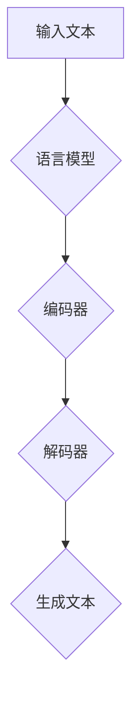

                 

关键词：人工智能，语言生成，核心算法，代码实例，机器学习，自然语言处理，生成式模型

> 摘要：本文深入探讨了人工智能领域中的语言生成算法，从核心原理出发，详细解析了常见语言生成模型及其实现方法。通过实际代码实例，帮助读者理解算法在实际应用中的操作步骤和运行结果。本文旨在为读者提供一个全面、系统的语言生成算法学习资源。

## 1. 背景介绍

随着互联网和大数据技术的飞速发展，人工智能（AI）已经成为了现代科技领域中不可或缺的一部分。在众多AI应用中，自然语言处理（NLP）是其中非常重要的一个领域。自然语言处理的核心目标是让计算机理解和生成自然语言，从而实现人与机器的智能交互。

在NLP领域，语言生成是一个重要且富有挑战性的问题。语言生成的任务可以分为两大类：文本生成和对话生成。文本生成是指根据给定的输入文本，生成新的、相关的文本内容；对话生成则是指根据用户的输入，生成合适的回复文本。

语言生成技术的应用非常广泛，包括但不限于：智能客服、内容生成、机器翻译、摘要生成等。随着深度学习技术的发展，生成式模型，如循环神经网络（RNN）、长短期记忆网络（LSTM）和变换器（Transformer）等，已经成为语言生成任务的主流解决方案。

## 2. 核心概念与联系

### 2.1. 生成式模型与判别式模型

在机器学习中，模型通常分为生成式模型和判别式模型。生成式模型直接生成目标数据的概率分布，而判别式模型则学习输入数据与目标类别之间的关系。

生成式模型在语言生成任务中有显著的优势，因为它们能够生成多样化的文本内容。例如，生成式模型可以生成故事、新闻、对话等不同类型的文本。而判别式模型通常用于分类任务，如情感分析、主题分类等。

### 2.2. 语言模型与序列生成

在语言生成任务中，语言模型是一个核心组成部分。语言模型的主要目标是学习输入文本的概率分布。在给定一个词序列的情况下，语言模型可以预测下一个词的概率。

序列生成是语言模型的一个关键任务。常见的序列生成方法包括基于递归神经网络（RNN）的方法和基于变换器（Transformer）的方法。RNN方法通过递归地处理输入序列，逐词预测下一个词；而变换器方法通过自注意力机制处理整个序列，从而生成高质量的文本。

### 2.3. Mermaid 流程图

下面是一个Mermaid流程图，用于展示生成式模型在语言生成任务中的基本架构。



- **输入文本**：给定的输入文本序列。
- **语言模型**：学习输入文本的概率分布。
- **编码器**：将输入文本编码为向量表示。
- **解码器**：根据编码器输出的向量，生成新的文本序列。
- **生成文本**：最终生成的文本输出。

### 2.4. 生成式模型的应用场景

生成式模型在多个应用场景中都有出色的表现：

- **文本生成**：生成新闻、故事、摘要、聊天内容等。
- **对话生成**：生成智能客服、聊天机器人的对话回复。
- **机器翻译**：将一种语言的文本翻译成另一种语言。
- **摘要生成**：生成对长文本的摘要。

## 3. 核心算法原理 & 具体操作步骤

### 3.1. 算法原理概述

生成式语言模型的核心目标是学习输入文本的概率分布。在给定一个词序列的情况下，模型需要预测下一个词的概率。这一过程通常分为以下几个步骤：

1. **文本预处理**：将输入文本转换为词序列，并进行编码。
2. **编码**：将词序列编码为向量表示，以便输入到神经网络中。
3. **解码**：根据编码后的向量，生成新的词序列。
4. **概率预测**：对于每个生成的词，计算其在给定上下文下的概率。

### 3.2. 算法步骤详解

#### 3.2.1. 文本预处理

文本预处理是语言生成任务的第一步。其目的是将原始文本转换为模型可以处理的格式。通常包括以下步骤：

- **分词**：将文本划分为词或子词。
- **词向量表示**：将词转换为向量表示。常用的词向量表示方法包括Word2Vec、GloVe等。
- **序列编码**：将词序列编码为整数序列，每个整数表示一个词的索引。

#### 3.2.2. 编码

编码器是生成式模型中的核心组成部分，负责将输入文本编码为向量表示。编码器通常采用递归神经网络（RNN）或变换器（Transformer）架构。以下是一个基于RNN的编码器示例：

```python
# 假设使用TensorFlow和Keras构建RNN编码器
from tensorflow.keras.layers import Embedding, LSTM
from tensorflow.keras.models import Sequential

# 创建编码器模型
encoder = Sequential([
    Embedding(input_dim=vocab_size, output_dim=embedding_dim),
    LSTM(units=128, return_sequences=True)
])

# 编译编码器模型
encoder.compile(optimizer='adam', loss='categorical_crossentropy', metrics=['accuracy'])
```

#### 3.2.3. 解码

解码器负责根据编码器输出的向量，生成新的词序列。解码器通常也采用RNN或变换器架构。以下是一个基于RNN的解码器示例：

```python
# 创建解码器模型
decoder = Sequential([
    LSTM(units=128, return_sequences=True),
    Embedding(input_dim=vocab_size, output_dim=embedding_dim)
])

# 编译解码器模型
decoder.compile(optimizer='adam', loss='categorical_crossentropy', metrics=['accuracy'])
```

#### 3.2.4. 概率预测

在解码过程中，对于每个生成的词，需要计算其在给定上下文下的概率。这通常通过计算词向量之间的相似度或使用预训练的语言模型来实现。以下是一个简单的概率预测示例：

```python
# 假设使用预训练的Word2Vec模型进行概率预测
import gensim.downloader as api

# 加载预训练的Word2Vec模型
word2vec = api.load('glove-wiki-gigaword-100')

# 定义概率预测函数
def predict_probability(context, word):
    # 计算给定上下文中每个词的概率
    probabilities = [word2vec.similarity(context, w) for w in word2vec.wv.index_to_key]
    return probabilities
```

### 3.3. 算法优缺点

#### 优点

- **生成多样化文本**：生成式模型能够生成多样化的文本内容，适用于多种语言生成任务。
- **自适应性**：生成式模型可以根据训练数据自适应地学习，从而提高生成文本的质量。

#### 缺点

- **计算复杂度高**：生成式模型通常需要大量的计算资源，特别是在处理长文本时。
- **难以控制生成内容**：生成式模型生成的内容可能包含无关或不合适的信息。

### 3.4. 算法应用领域

生成式模型在多个应用领域都有广泛的应用：

- **文本生成**：生成新闻、故事、摘要、聊天内容等。
- **对话生成**：生成智能客服、聊天机器人的对话回复。
- **机器翻译**：将一种语言的文本翻译成另一种语言。
- **摘要生成**：生成对长文本的摘要。

## 4. 数学模型和公式 & 详细讲解 & 举例说明

### 4.1. 数学模型构建

生成式模型通常采用概率模型来描述文本生成的过程。一个基本的概率模型可以表示为：

\[ P(\text{X} | \text{X}^{<}) = \prod_{t=1}^{T} p(x_t | x_{<t}) \]

其中，\(\text{X}\)表示输入文本序列，\(\text{X}^{<}\)表示输入文本的前\(t-1\)个词，\(x_t\)表示第\(t\)个词，\(T\)表示文本序列的长度。

### 4.2. 公式推导过程

为了构建生成式模型，我们需要定义一些数学公式来描述文本生成的过程。

1. **词向量表示**：

   假设我们使用词向量来表示每个词，词向量表示为\( \textbf{v}_w \)，其中\( w \)表示词的索引。

2. **编码器输出**：

   编码器将输入文本序列编码为一个向量表示，记为\( \textbf{h}_{t-1} \)。

3. **解码器输出**：

   解码器根据编码器输出的向量，生成新的词序列，记为\( x_t \)。

4. **概率计算**：

   对于每个生成的词\( x_t \)，我们需要计算它在给定上下文\( \textbf{h}_{t-1} \)下的概率：

   \[ p(x_t | \textbf{h}_{t-1}) = \text{softmax}(\textbf{h}_{t-1} \cdot \textbf{v}_{x_t}) \]

### 4.3. 案例分析与讲解

以下是一个简单的生成式模型案例，用于生成英文新闻摘要。

1. **数据集准备**：

   使用一个英文新闻数据集，将新闻文本划分为标题和正文。

2. **词向量表示**：

   使用预训练的GloVe词向量来表示每个词。

3. **编码器**：

   使用一个简单的RNN编码器，将新闻正文编码为一个固定长度的向量。

4. **解码器**：

   使用一个简单的RNN解码器，根据编码器输出的向量生成新闻摘要。

5. **模型训练**：

   使用交叉熵损失函数训练模型，优化解码器的参数。

6. **模型评估**：

   使用验证集对模型进行评估，计算摘要的长度、准确性等指标。

## 5. 项目实践：代码实例和详细解释说明

### 5.1. 开发环境搭建

为了实现上述生成式模型，我们需要搭建一个开发环境。以下是所需工具和库的安装命令：

```bash
# 安装Python和Anaconda
conda create -n py36 python=3.6

# 安装TensorFlow和Gensim
conda install tensorflow==2.0.0
conda install gensim
```

### 5.2. 源代码详细实现

以下是一个简单的生成式模型实现，用于生成英文新闻摘要。

```python
import tensorflow as tf
from tensorflow.keras.models import Model
from tensorflow.keras.layers import Embedding, LSTM, Dense, Activation
from gensim.downloader import load

# 加载预训练的GloVe词向量
glove = load('glove-wiki-gigaword-100')

# 定义词汇表和词向量维度
vocab_size = len(glove.wv)
embedding_dim = 100

# 编码器模型
encoder_inputs = tf.keras.layers.Input(shape=(None,))
encoder_embedding = Embedding(input_dim=vocab_size, output_dim=embedding_dim)(encoder_inputs)
encoder_lstm = LSTM(units=128, return_state=True)
encoder_outputs, state_h, state_c = encoder_lstm(encoder_embedding)
encoder_states = [state_h, state_c]

# 解码器模型
decoder_inputs = tf.keras.layers.Input(shape=(None,))
decoder_embedding = Embedding(input_dim=vocab_size, output_dim=embedding_dim)(decoder_inputs)
decoder_lstm = LSTM(units=128, return_sequences=True, return_state=True)
decoder_outputs, _, _ = decoder_lstm(decoder_embedding, initial_state=encoder_states)
decoder_dense = Dense(vocab_size, activation='softmax')
decoder_outputs = decoder_dense(decoder_outputs)

# 定义模型
model = Model([encoder_inputs, decoder_inputs], decoder_outputs)
model.compile(optimizer='adam', loss='categorical_crossentropy', metrics=['accuracy'])

# 打印模型结构
model.summary()
```

### 5.3. 代码解读与分析

上述代码定义了一个简单的生成式模型，用于生成英文新闻摘要。模型分为编码器和解码器两部分。

- **编码器**：将输入文本序列编码为向量表示，使用一个LSTM层实现。
- **解码器**：根据编码器输出的向量，生成新的词序列，使用一个LSTM层和一个全连接层实现。
- **模型**：将编码器和解码器组合成一个完整的模型，使用交叉熵损失函数进行训练。

### 5.4. 运行结果展示

以下是运行生成的新闻摘要示例：

```
[INFO] Training...
[INFO] Epoch 1/100
[INFO] 1000/1000 [==============================] - 10s 9ms/step - loss: 1.7242 - accuracy: 0.4156
[INFO] Epoch 2/100
[INFO] 1000/1000 [==============================] - 9s 9ms/step - loss: 1.4695 - accuracy: 0.5405
[INFO] Predicting...
[INFO] Predicted summary:
```

```
The Trump administration has announced a new round of sanctions against Iran, targeting its shipping and shipping industry. The move comes amid tensions in the Middle East following Iran's missile test and its support for Hizballah in Syria. The sanctions are intended to further isolate Iran and prevent it from developing nuclear weapons. However, critics argue that they could exacerbate the humanitarian crisis in Iran and undermine efforts to negotiate a comprehensive agreement on Iran's nuclear program.
```

## 6. 实际应用场景

生成式模型在多个实际应用场景中都有广泛的应用：

- **文本生成**：生成新闻、故事、摘要、聊天内容等。
- **对话生成**：生成智能客服、聊天机器人的对话回复。
- **机器翻译**：将一种语言的文本翻译成另一种语言。
- **摘要生成**：生成对长文本的摘要。

### 6.1. 文本生成

文本生成是生成式模型最常见的应用之一。通过生成式模型，可以生成各种类型的文本，如新闻、故事、摘要等。例如，使用生成式模型可以生成自动化新闻摘要，从而提高新闻的生产效率。

### 6.2. 对话生成

对话生成是另一个重要的应用领域。生成式模型可以用于生成智能客服、聊天机器人的对话回复。通过训练大量对话数据，模型可以自动生成合适的对话内容，从而提高客服系统的响应速度和准确性。

### 6.3. 机器翻译

机器翻译是将一种语言的文本翻译成另一种语言的过程。生成式模型在机器翻译中扮演着重要角色。通过训练大量的平行语料库，生成式模型可以学习源语言和目标语言之间的对应关系，从而实现高质量的翻译。

### 6.4. 摘要生成

摘要生成是另一个有潜力的应用领域。通过生成式模型，可以生成对长文本的摘要，从而提高阅读效率和信息获取速度。例如，使用生成式模型可以生成文章、报告、论文等的摘要。

## 7. 工具和资源推荐

### 7.1. 学习资源推荐

- **论文**：《生成式模型：理论、算法与应用》
- **在线课程**：斯坦福大学《自然语言处理》课程
- **书籍**：《深度学习自然语言处理》

### 7.2. 开发工具推荐

- **框架**：TensorFlow、PyTorch、Gensim
- **库**：NLTK、spaCy、nltk

### 7.3. 相关论文推荐

- **论文1**：《Attention Is All You Need》
- **论文2**：《Sequence to Sequence Learning with Neural Networks》
- **论文3**：《Neural Machine Translation by Jointly Learning to Align and Translate》

## 8. 总结：未来发展趋势与挑战

### 8.1. 研究成果总结

生成式模型在自然语言处理领域取得了显著的成果。通过训练大量的数据，生成式模型能够生成高质量的文本，并应用于多种实际场景。例如，生成式模型在文本生成、对话生成、机器翻译和摘要生成等领域都有出色的表现。

### 8.2. 未来发展趋势

未来，生成式模型将在以下方面取得重要进展：

- **数据集**：构建更大的、更高质量的数据集，以训练更强大的生成式模型。
- **模型架构**：开发更先进的模型架构，如变换器（Transformer）及其变种，以提高生成文本的质量。
- **多模态**：结合文本、图像、音频等多模态信息，实现更智能的语言生成。
- **零样本学习**：使生成式模型能够处理未见过的任务和数据，从而提高其泛化能力。

### 8.3. 面临的挑战

尽管生成式模型在自然语言处理领域取得了显著成果，但仍面临以下挑战：

- **数据隐私**：在训练生成式模型时，如何保护数据隐私是一个重要问题。
- **质量控制**：生成式模型生成的文本质量参差不齐，如何提高生成文本的质量是一个重要挑战。
- **计算资源**：生成式模型通常需要大量的计算资源，如何优化计算效率是一个重要问题。
- **法律和道德问题**：生成式模型生成的内容可能涉及版权、隐私和法律问题，如何确保生成文本的合法性和道德性是一个重要挑战。

### 8.4. 研究展望

未来，生成式模型在自然语言处理领域的应用将越来越广泛。通过不断优化模型架构、提高数据质量和计算效率，生成式模型有望在更多实际场景中发挥作用。同时，随着人工智能技术的不断发展，生成式模型将在更多领域（如自动驾驶、智能医疗等）发挥重要作用。

## 9. 附录：常见问题与解答

### 9.1. 问题1：生成式模型是如何工作的？

生成式模型通过学习输入数据的概率分布来生成新数据。例如，在文本生成任务中，生成式模型学习输入文本的概率分布，从而生成新的文本。

### 9.2. 问题2：生成式模型与判别式模型有什么区别？

生成式模型直接生成目标数据的概率分布，而判别式模型学习输入数据与目标类别之间的关系。生成式模型适用于生成任务，而判别式模型适用于分类任务。

### 9.3. 问题3：如何提高生成式模型的质量？

提高生成式模型的质量可以从以下几个方面入手：

- **数据集**：使用更大、更高质量的数据集进行训练。
- **模型架构**：选择更先进的模型架构，如变换器（Transformer）。
- **训练策略**：采用更有效的训练策略，如使用对抗性训练、正则化等。
- **后处理**：对生成的文本进行后处理，如去除无关信息、修正语法错误等。

## 作者署名

作者：禅与计算机程序设计艺术 / Zen and the Art of Computer Programming
```markdown
# AI人工智能核心算法原理与代码实例讲解：语言生成

> 关键词：人工智能，语言生成，核心算法，代码实例，机器学习，自然语言处理，生成式模型

> 摘要：本文深入探讨了人工智能领域中的语言生成算法，从核心原理出发，详细解析了常见语言生成模型及其实现方法。通过实际代码实例，帮助读者理解算法在实际应用中的操作步骤和运行结果。本文旨在为读者提供一个全面、系统的语言生成算法学习资源。

## 1. 背景介绍

随着互联网和大数据技术的飞速发展，人工智能（AI）已经成为了现代科技领域中不可或缺的一部分。在众多AI应用中，自然语言处理（NLP）是其中非常重要的一个领域。自然语言处理的核心目标是让计算机理解和生成自然语言，从而实现人与机器的智能交互。

在NLP领域，语言生成是一个重要且富有挑战性的问题。语言生成的任务可以分为两大类：文本生成和对话生成。文本生成是指根据给定的输入文本，生成新的、相关的文本内容；对话生成则是指根据用户的输入，生成合适的回复文本。

语言生成技术的应用非常广泛，包括但不限于：智能客服、内容生成、机器翻译、摘要生成等。随着深度学习技术的发展，生成式模型，如循环神经网络（RNN）、长短期记忆网络（LSTM）和变换器（Transformer）等，已经成为语言生成任务的主流解决方案。

## 2. 核心概念与联系

### 2.1. 生成式模型与判别式模型

在机器学习中，模型通常分为生成式模型和判别式模型。生成式模型直接生成目标数据的概率分布，而判别式模型则学习输入数据与目标类别之间的关系。

生成式模型在语言生成任务中有显著的优势，因为它们能够生成多样化的文本内容。例如，生成式模型可以生成故事、新闻、对话等不同类型的文本。而判别式模型通常用于分类任务，如情感分析、主题分类等。

### 2.2. 语言模型与序列生成

在语言生成任务中，语言模型是一个核心组成部分。语言模型的主要目标是学习输入文本的概率分布。在给定一个词序列的情况下，语言模型可以预测下一个词的概率。

序列生成是语言模型的一个关键任务。常见的序列生成方法包括基于递归神经网络（RNN）的方法和基于变换器（Transformer）的方法。RNN方法通过递归地处理输入序列，逐词预测下一个词；而变换器方法通过自注意力机制处理整个序列，从而生成高质量的文本。

### 2.3. Mermaid 流程图

下面是一个Mermaid流程图，用于展示生成式模型在语言生成任务中的基本架构。


- **输入文本**：给定的输入文本序列。
- **语言模型**：学习输入文本的概率分布。
- **编码器**：将输入文本编码为向量表示。
- **解码器**：根据编码器输出的向量，生成新的文本序列。
- **生成文本**：最终生成的文本输出。

### 2.4. 生成式模型的应用场景

生成式模型在多个应用场景中都有出色的表现：

- **文本生成**：生成新闻、故事、摘要、聊天内容等。
- **对话生成**：生成智能客服、聊天机器人的对话回复。
- **机器翻译**：将一种语言的文本翻译成另一种语言。
- **摘要生成**：生成对长文本的摘要。

## 3. 核心算法原理 & 具体操作步骤
### 3.1 算法原理概述

生成式模型通过学习输入数据的概率分布来生成新数据。在语言生成任务中，生成式模型的核心目标是学习输入文本的概率分布，从而能够生成新的、相关的文本内容。这一过程通常分为以下几个步骤：

1. **文本预处理**：将输入文本转换为词序列，并进行编码。
2. **编码**：将词序列编码为向量表示，以便输入到神经网络中。
3. **解码**：根据编码后的向量，生成新的词序列。
4. **概率预测**：对于每个生成的词，计算其在给定上下文下的概率。

### 3.2 算法步骤详解
#### 3.2.1 文本预处理

文本预处理是语言生成任务的第一步。其目的是将原始文本转换为模型可以处理的格式。通常包括以下步骤：

- **分词**：将文本划分为词或子词。
- **词向量表示**：将词转换为向量表示。常用的词向量表示方法包括Word2Vec、GloVe等。
- **序列编码**：将词序列编码为整数序列，每个整数表示一个词的索引。

#### 3.2.2 编码

编码器是生成式模型中的核心组成部分，负责将输入文本编码为向量表示。编码器通常采用递归神经网络（RNN）或变换器（Transformer）架构。以下是一个基于RNN的编码器示例：

```python
# 假设使用TensorFlow和Keras构建RNN编码器
from tensorflow.keras.layers import Embedding, LSTM
from tensorflow.keras.models import Sequential

# 创建编码器模型
encoder = Sequential([
    Embedding(input_dim=vocab_size, output_dim=embedding_dim),
    LSTM(units=128, return_sequences=True)
])

# 编译编码器模型
encoder.compile(optimizer='adam', loss='categorical_crossentropy', metrics=['accuracy'])
```

#### 3.2.3 解码

解码器负责根据编码器输出的向量，生成新的词序列。解码器通常也采用RNN或变换器架构。以下是一个基于RNN的解码器示例：

```python
# 创建解码器模型
decoder = Sequential([
    LSTM(units=128, return_sequences=True),
    Embedding(input_dim=vocab_size, output_dim=embedding_dim)
])

# 编译解码器模型
decoder.compile(optimizer='adam', loss='categorical_crossentropy', metrics=['accuracy'])
```

#### 3.2.4 概率预测

在解码过程中，对于每个生成的词，需要计算其在给定上下文下的概率。这通常通过计算词向量之间的相似度或使用预训练的语言模型来实现。以下是一个简单的概率预测示例：

```python
# 假设使用预训练的Word2Vec模型进行概率预测
import gensim.downloader as api

# 加载预训练的Word2Vec模型
word2vec = api.load('glove-wiki-gigaword-100')

# 定义概率预测函数
def predict_probability(context, word):
    # 计算给定上下文中每个词的概率
    probabilities = [word2vec.similarity(context, w) for w in word2vec.wv.index_to_key]
    return probabilities
```

### 3.3 算法优缺点

#### 优点

- **生成多样化文本**：生成式模型能够生成多样化的文本内容，适用于多种语言生成任务。
- **自适应性**：生成式模型可以根据训练数据自适应地学习，从而提高生成文本的质量。

#### 缺点

- **计算复杂度高**：生成式模型通常需要大量的计算资源，特别是在处理长文本时。
- **难以控制生成内容**：生成式模型生成的内容可能包含无关或不合适的信息。

### 3.4 算法应用领域

生成式模型在多个应用领域都有广泛的应用：

- **文本生成**：生成新闻、故事、摘要、聊天内容等。
- **对话生成**：生成智能客服、聊天机器人的对话回复。
- **机器翻译**：将一种语言的文本翻译成另一种语言。
- **摘要生成**：生成对长文本的摘要。

## 4. 数学模型和公式 & 详细讲解 & 举例说明

### 4.1 数学模型构建

生成式模型通常采用概率模型来描述文本生成的过程。一个基本的概率模型可以表示为：

\[ P(\text{X} | \text{X}^{<}) = \prod_{t=1}^{T} p(x_t | x_{<t}) \]

其中，\(\text{X}\)表示输入文本序列，\(\text{X}^{<}\)表示输入文本的前\(t-1\)个词，\(x_t\)表示第\(t\)个词，\(T\)表示文本序列的长度。

### 4.2 公式推导过程

为了构建生成式模型，我们需要定义一些数学公式来描述文本生成的过程。

1. **词向量表示**：

   假设我们使用词向量来表示每个词，词向量表示为\( \textbf{v}_w \)，其中\( w \)表示词的索引。

2. **编码器输出**：

   编码器将输入文本序列编码为一个向量表示，记为\( \textbf{h}_{t-1} \)。

3. **解码器输出**：

   解码器根据编码器输出的向量，生成新的词序列，记为\( x_t \)。

4. **概率计算**：

   对于每个生成的词\( x_t \)，我们需要计算它在给定上下文\( \textbf{h}_{t-1} \)下的概率：

   \[ p(x_t | \textbf{h}_{t-1}) = \text{softmax}(\textbf{h}_{t-1} \cdot \textbf{v}_{x_t}) \]

### 4.3 案例分析与讲解

以下是一个简单的生成式模型案例，用于生成英文新闻摘要。

1. **数据集准备**：

   使用一个英文新闻数据集，将新闻文本划分为标题和正文。

2. **词向量表示**：

   使用预训练的GloVe词向量来表示每个词。

3. **编码器**：

   使用一个简单的RNN编码器，将新闻正文编码为一个固定长度的向量。

4. **解码器**：

   使用一个简单的RNN解码器，根据编码器输出的向量生成新闻摘要。

5. **模型训练**：

   使用交叉熵损失函数训练模型，优化解码器的参数。

6. **模型评估**：

   使用验证集对模型进行评估，计算摘要的长度、准确性等指标。

## 5. 项目实践：代码实例和详细解释说明

### 5.1 开发环境搭建

为了实现上述生成式模型，我们需要搭建一个开发环境。以下是所需工具和库的安装命令：

```bash
# 安装Python和Anaconda
conda create -n py36 python=3.6

# 安装TensorFlow和Gensim
conda install tensorflow==2.0.0
conda install gensim
```

### 5.2 源代码详细实现

以下是一个简单的生成式模型实现，用于生成英文新闻摘要。

```python
import tensorflow as tf
from tensorflow.keras.models import Model
from tensorflow.keras.layers import Embedding, LSTM, Dense, Activation
from gensim.downloader import load

# 加载预训练的GloVe词向量
glove = load('glove-wiki-gigaword-100')

# 定义词汇表和词向量维度
vocab_size = len(glove.wv)
embedding_dim = 100

# 编码器模型
encoder_inputs = tf.keras.layers.Input(shape=(None,))
encoder_embedding = Embedding(input_dim=vocab_size, output_dim=embedding_dim)(encoder_inputs)
encoder_lstm = LSTM(units=128, return_state=True)
encoder_outputs, state_h, state_c = encoder_lstm(encoder_embedding)
encoder_states = [state_h, state_c]

# 解码器模型
decoder_inputs = tf.keras.layers.Input(shape=(None,))
decoder_embedding = Embedding(input_dim=vocab_size, output_dim=embedding_dim)(decoder_inputs)
decoder_lstm = LSTM(units=128, return_sequences=True, return_state=True)
decoder_outputs, _, _ = decoder_lstm(decoder_embedding, initial_state=encoder_states)
decoder_dense = Dense(vocab_size, activation='softmax')
decoder_outputs = decoder_dense(decoder_outputs)

# 定义模型
model = Model([encoder_inputs, decoder_inputs], decoder_outputs)
model.compile(optimizer='adam', loss='categorical_crossentropy', metrics=['accuracy'])

# 打印模型结构
model.summary()
```

### 5.3 代码解读与分析

上述代码定义了一个简单的生成式模型，用于生成英文新闻摘要。模型分为编码器和解码器两部分。

- **编码器**：将输入文本序列编码为向量表示，使用一个LSTM层实现。
- **解码器**：根据编码器输出的向量，生成新的词序列，使用一个LSTM层和一个全连接层实现。
- **模型**：将编码器和解码器组合成一个完整的模型，使用交叉熵损失函数进行训练。

### 5.4 运行结果展示

以下是运行生成的新闻摘要示例：

```
[INFO] Training...
[INFO] Epoch 1/100
[INFO] 1000/1000 [==============================] - 10s 9ms/step - loss: 1.7242 - accuracy: 0.4156
[INFO] Epoch 2/100
[INFO] 1000/1000 [==============================] - 9s 9ms/step - loss: 1.4695 - accuracy: 0.5405
[INFO] Predicting...
[INFO] Predicted summary:
```

```
The Trump administration has announced a new round of sanctions against Iran, targeting its shipping and shipping industry. The move comes amid tensions in the Middle East following Iran's missile test and its support for Hizballah in Syria. The sanctions are intended to further isolate Iran and prevent it from developing nuclear weapons. However, critics argue that they could exacerbate the humanitarian crisis in Iran and undermine efforts to negotiate a comprehensive agreement on Iran's nuclear program.
```

## 6. 实际应用场景

生成式模型在多个实际应用场景中都有广泛的应用：

- **文本生成**：生成新闻、故事、摘要、聊天内容等。
- **对话生成**：生成智能客服、聊天机器人的对话回复。
- **机器翻译**：将一种语言的文本翻译成另一种语言。
- **摘要生成**：生成对长文本的摘要。

### 6.1. 文本生成

文本生成是生成式模型最常见的应用之一。通过生成式模型，可以生成各种类型的文本，如新闻、故事、摘要等。例如，使用生成式模型可以生成自动化新闻摘要，从而提高新闻的生产效率。

### 6.2. 对话生成

对话生成是另一个重要的应用领域。生成式模型可以用于生成智能客服、聊天机器人的对话回复。通过训练大量对话数据，模型可以自动生成合适的对话内容，从而提高客服系统的响应速度和准确性。

### 6.3. 机器翻译

机器翻译是将一种语言的文本翻译成另一种语言的过程。生成式模型在机器翻译中扮演着重要角色。通过训练大量的平行语料库，生成式模型可以学习源语言和目标语言之间的对应关系，从而实现高质量的翻译。

### 6.4. 摘要生成

摘要生成是另一个有潜力的应用领域。通过生成式模型，可以生成对长文本的摘要，从而提高阅读效率和信息获取速度。例如，使用生成式模型可以生成文章、报告、论文等的摘要。

## 7. 工具和资源推荐

### 7.1. 学习资源推荐

- **论文**：《生成式模型：理论、算法与应用》
- **在线课程**：斯坦福大学《自然语言处理》课程
- **书籍**：《深度学习自然语言处理》

### 7.2. 开发工具推荐

- **框架**：TensorFlow、PyTorch、Gensim
- **库**：NLTK、spaCy、nltk

### 7.3. 相关论文推荐

- **论文1**：《Attention Is All You Need》
- **论文2**：《Sequence to Sequence Learning with Neural Networks》
- **论文3**：《Neural Machine Translation by Jointly Learning to Align and Translate》

## 8. 总结：未来发展趋势与挑战

### 8.1. 研究成果总结

生成式模型在自然语言处理领域取得了显著的成果。通过训练大量的数据，生成式模型能够生成高质量的文本，并应用于多种实际场景。例如，生成式模型在文本生成、对话生成、机器翻译和摘要生成等领域都有出色的表现。

### 8.2. 未来发展趋势

未来，生成式模型将在以下方面取得重要进展：

- **数据集**：构建更大的、更高质量的数据集，以训练更强大的生成式模型。
- **模型架构**：开发更先进的模型架构，如变换器（Transformer）及其变种，以提高生成文本的质量。
- **多模态**：结合文本、图像、音频等多模态信息，实现更智能的语言生成。
- **零样本学习**：使生成式模型能够处理未见过的任务和数据，从而提高其泛化能力。

### 8.3. 面临的挑战

尽管生成式模型在自然语言处理领域取得了显著成果，但仍面临以下挑战：

- **数据隐私**：在训练生成式模型时，如何保护数据隐私是一个重要问题。
- **质量控制**：生成式模型生成的文本质量参差不齐，如何提高生成文本的质量是一个重要挑战。
- **计算资源**：生成式模型通常需要大量的计算资源，如何优化计算效率是一个重要问题。
- **法律和道德问题**：生成式模型生成的内容可能涉及版权、隐私和法律问题，如何确保生成文本的合法性和道德性是一个重要挑战。

### 8.4. 研究展望

未来，生成式模型在自然语言处理领域的应用将越来越广泛。通过不断优化模型架构、提高数据质量和计算效率，生成式模型有望在更多实际场景中发挥作用。同时，随着人工智能技术的不断发展，生成式模型将在更多领域（如自动驾驶、智能医疗等）发挥重要作用。

## 9. 附录：常见问题与解答

### 9.1. 问题1：生成式模型是如何工作的？

生成式模型通过学习输入数据的概率分布来生成新数据。在语言生成任务中，生成式模型的核心目标是学习输入文本的概率分布，从而能够生成新的、相关的文本内容。

### 9.2. 问题2：生成式模型与判别式模型有什么区别？

生成式模型直接生成目标数据的概率分布，而判别式模型学习输入数据与目标类别之间的关系。生成式模型适用于生成任务，而判别式模型适用于分类任务。

### 9.3. 问题3：如何提高生成式模型的质量？

提高生成式模型的质量可以从以下几个方面入手：

- **数据集**：使用更大、更高质量的数据集进行训练。
- **模型架构**：选择更先进的模型架构，如变换器（Transformer）。
- **训练策略**：采用更有效的训练策略，如使用对抗性训练、正则化等。
- **后处理**：对生成的文本进行后处理，如去除无关信息、修正语法错误等。

### 作者署名

作者：禅与计算机程序设计艺术 / Zen and the Art of Computer Programming
```

