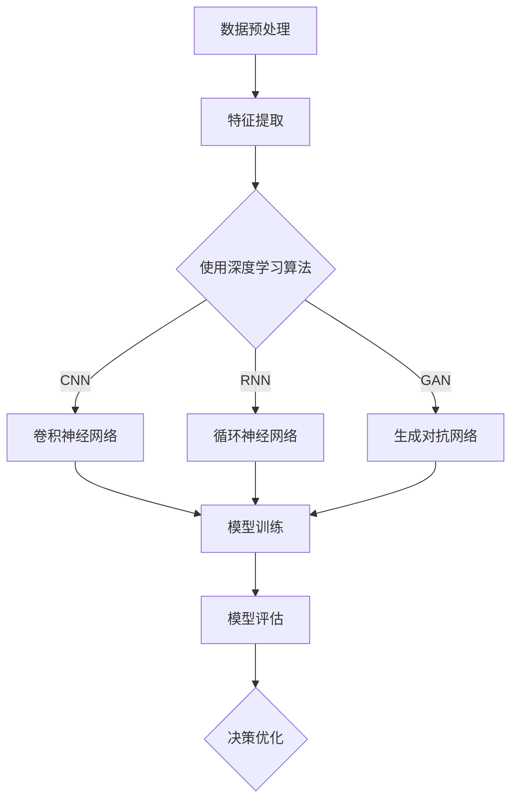

                 

关键词：AI人工智能，深度学习，复杂系统，建模，算法，应用领域

摘要：本文旨在探讨深度学习算法在复杂系统建模中的应用，首先介绍深度学习的基础知识和核心概念，随后详细解析几种常用的深度学习算法，如卷积神经网络（CNN）、循环神经网络（RNN）和生成对抗网络（GAN），以及它们在复杂系统建模中的具体应用。通过实际案例和数学模型的推导，本文展示了深度学习算法在复杂系统建模中的强大功能和广阔前景。

## 1. 背景介绍

在过去的几十年里，人工智能（AI）领域取得了显著的进展。特别是深度学习算法的出现，为解决复杂问题提供了强有力的工具。深度学习是一种模拟人脑神经网络结构和功能的人工智能方法，通过多层次的神经网络进行信息处理，具有强大的特征提取和学习能力。随着大数据和计算能力的提升，深度学习在计算机视觉、自然语言处理、语音识别等领域取得了显著的成果。

然而，复杂系统的建模和优化一直是科研和实践中的难题。复杂系统通常具有高度的非线性、不确定性和动态性，这使得传统的建模方法难以奏效。深度学习算法的出现为复杂系统的建模提供了新的思路和方法。通过学习大量的数据，深度学习算法能够自动发现数据中的复杂模式，从而构建出高效的模型。

本文将探讨深度学习算法在复杂系统建模中的应用，首先介绍深度学习的基础知识和核心概念，然后详细解析几种常用的深度学习算法，包括卷积神经网络（CNN）、循环神经网络（RNN）和生成对抗网络（GAN），并展示它们在复杂系统建模中的具体应用。最后，通过实际案例和数学模型的推导，本文将讨论深度学习算法在复杂系统建模中的优势和挑战。

## 2. 核心概念与联系

### 2.1. 深度学习基础概念

深度学习是一种基于人工神经网络（ANN）的机器学习方法，其核心思想是通过多层神经网络对数据进行建模和预测。以下是深度学习中的几个核心概念：

#### 神经元

神经元是神经网络的基本单元，类似于生物神经元。每个神经元接收多个输入，并通过权重和偏置进行加权求和，最后通过激活函数输出一个值。以下是一个简单神经元的结构：

$$
f(x) = \sigma(w \cdot x + b)
$$

其中，$w$是权重，$b$是偏置，$\sigma$是激活函数，通常使用的是Sigmoid函数或ReLU函数。

#### 神经网络

神经网络是由多个神经元组成的层次结构。常见的神经网络包括多层感知机（MLP）、卷积神经网络（CNN）和循环神经网络（RNN）等。

#### 损失函数

损失函数是评估模型预测结果和真实值之间差距的指标。常见的损失函数包括均方误差（MSE）、交叉熵损失等。

#### 优化算法

优化算法用于调整神经网络的权重和偏置，以最小化损失函数。常见的优化算法包括随机梯度下降（SGD）、Adam优化器等。

### 2.2. 复杂系统建模

复杂系统建模是指通过数学模型描述和分析复杂系统的行为。复杂系统通常具有以下特征：

#### 非线性

复杂系统的动态行为通常是非线性的，这意味着系统的状态变化不是简单的线性关系。

#### 不确定性

复杂系统通常存在不确定因素，如参数的不确定性、外部环境的干扰等。

#### 动态性

复杂系统通常具有动态变化的特点，其状态随时间变化。

为了描述复杂系统的行为，需要构建合适的数学模型。常见的建模方法包括差分方程、微分方程、状态空间模型等。

### 2.3. 深度学习与复杂系统建模的联系

深度学习算法在复杂系统建模中的应用主要体现在以下几个方面：

#### 自动特征提取

深度学习算法能够自动从数据中提取有用的特征，从而减少人工特征工程的工作量。

#### 高度非线性建模

深度学习算法能够建模复杂系统的非线性动态行为，从而提高模型的拟合精度。

#### 状态预测

通过训练深度学习模型，可以实现对复杂系统未来状态的有效预测。

#### 决策优化

深度学习算法可以帮助优化复杂系统的控制策略，从而提高系统的性能。

### 2.4. Mermaid 流程图

以下是一个描述深度学习算法在复杂系统建模中应用的 Mermaid 流程图：



## 3. 核心算法原理 & 具体操作步骤

### 3.1. 算法原理概述

在本节中，我们将介绍几种常用的深度学习算法，包括卷积神经网络（CNN）、循环神经网络（RNN）和生成对抗网络（GAN），并解释它们在复杂系统建模中的基本原理。

#### 3.1.1. 卷积神经网络（CNN）

卷积神经网络是一种专门用于图像处理和计算机视觉任务的深度学习算法。其基本原理是通过卷积操作和池化操作来提取图像中的局部特征。

- **卷积操作**：卷积操作是一种将小尺寸的滤波器（也称为卷积核）在输入图像上滑动，并对每个位置的像素进行加权求和的操作。通过卷积操作，可以提取图像中的局部特征。
- **池化操作**：池化操作用于降低特征图的维度，减少模型的参数数量，并提高模型的泛化能力。常见的池化操作包括最大池化和平均池化。

#### 3.1.2. 循环神经网络（RNN）

循环神经网络是一种用于处理序列数据的深度学习算法。其基本原理是通过循环结构来保持长期的上下文信息。

- **循环结构**：RNN 的神经元具有循环结构，能够将前一个时间步的输出作为当前时间步的输入，从而实现序列数据的建模。
- **门控机制**：为了解决 RNN 的梯度消失和梯度爆炸问题，引入了门控机制，包括遗忘门、输入门和输出门。

#### 3.1.3. 生成对抗网络（GAN）

生成对抗网络是一种通过生成器和判别器之间的对抗训练来生成数据的新型深度学习算法。

- **生成器**：生成器是一个神经网络，用于生成与真实数据相似的数据。
- **判别器**：判别器是一个神经网络，用于判断输入数据的真实性。生成器和判别器通过对抗训练相互提升。

### 3.2. 算法步骤详解

在本节中，我们将详细介绍每种深度学习算法的具体操作步骤。

#### 3.2.1. 卷积神经网络（CNN）

1. **数据预处理**：对图像数据进行归一化和归一化处理，以减少数据之间的差异。
2. **卷积层**：使用卷积核对输入图像进行卷积操作，提取局部特征。
3. **池化层**：使用池化操作对卷积层输出的特征图进行降维处理。
4. **全连接层**：将池化层输出的特征向量进行全连接操作，实现分类或回归任务。
5. **损失函数和优化器**：使用适当的损失函数（如交叉熵损失）和优化器（如 Adam 优化器）进行模型训练。

#### 3.2.2. 循环神经网络（RNN）

1. **序列输入**：将输入序列进行处理，如嵌入向量表示。
2. **循环结构**：通过循环结构处理每个时间步的输入，使用门控机制保持长期上下文信息。
3. **全连接层**：将循环结构输出的序列进行全连接操作，实现分类或回归任务。
4. **损失函数和优化器**：使用适当的损失函数和优化器进行模型训练。

#### 3.2.3. 生成对抗网络（GAN）

1. **生成器训练**：训练生成器以生成与真实数据相似的数据。
2. **判别器训练**：训练判别器以区分真实数据和生成数据。
3. **对抗训练**：生成器和判别器通过对抗训练相互提升，以实现数据生成。
4. **损失函数和优化器**：使用适当的损失函数和优化器进行模型训练。

### 3.3. 算法优缺点

在本节中，我们将讨论每种深度学习算法的优缺点。

#### 3.3.1. 卷积神经网络（CNN）

- **优点**：
  - 能够自动提取图像中的局部特征。
  - 在图像分类、目标检测等任务中表现优秀。
- **缺点**：
  - 对小样本数据效果较差。
  - 对旋转、缩放等变换的鲁棒性较差。

#### 3.3.2. 循环神经网络（RNN）

- **优点**：
  - 能够处理序列数据，具有长期记忆能力。
  - 在语音识别、自然语言处理等任务中表现优秀。
- **缺点**：
  - 存在梯度消失和梯度爆炸问题。
  - 对序列长度受限。

#### 3.3.3. 生成对抗网络（GAN）

- **优点**：
  - 能够生成高质量的数据。
  - 在图像生成、数据增强等任务中表现优秀。
- **缺点**：
  - 训练过程不稳定，容易陷入局部最优。
  - 需要大量的数据和计算资源。

### 3.4. 算法应用领域

在本节中，我们将讨论每种深度学习算法在复杂系统建模中的应用领域。

#### 3.4.1. 卷积神经网络（CNN）

- **应用领域**：
  - 图像分类和目标检测。
  - 医学图像分析。
  - 自然语言处理。

#### 3.4.2. 循环神经网络（RNN）

- **应用领域**：
  - 语音识别。
  - 机器翻译。
  - 时间序列预测。

#### 3.4.3. 生成对抗网络（GAN）

- **应用领域**：
  - 图像生成和风格迁移。
  - 数据增强和修复。
  - 图像到图像的转换。

## 4. 数学模型和公式 & 详细讲解 & 举例说明

在本节中，我们将详细讲解深度学习算法在复杂系统建模中涉及的数学模型和公式，并通过具体例子进行说明。

### 4.1. 数学模型构建

为了构建深度学习算法在复杂系统建模中的数学模型，我们需要以下几个基本概念：

- **输入向量**：表示系统状态的向量。
- **权重矩阵**：表示神经网络中的权重。
- **偏置向量**：表示神经网络中的偏置。
- **激活函数**：用于对神经网络的输出进行非线性变换。

#### 4.1.1. 神经元模型

一个简单的神经元模型可以表示为：

$$
a_i = \sigma(w_i \cdot x_i + b_i)
$$

其中，$a_i$是神经元$i$的输出，$x_i$是神经元$i$的输入，$w_i$是权重，$b_i$是偏置，$\sigma$是激活函数。

#### 4.1.2. 多层神经网络模型

多层神经网络模型可以表示为：

$$
a_l = \sigma(w_l \cdot a_{l-1} + b_l)
$$

其中，$a_l$是第$l$层的输出，$a_{l-1}$是第$l-1$层的输出，$w_l$是权重，$b_l$是偏置，$\sigma$是激活函数。

### 4.2. 公式推导过程

在本节中，我们将推导深度学习算法在复杂系统建模中的关键公式。

#### 4.2.1. 前向传播

前向传播是指从输入层到输出层的计算过程。给定一个输入向量$x$，前向传播的公式可以表示为：

$$
a_l = \sigma(w_l \cdot a_{l-1} + b_l)
$$

其中，$a_l$是第$l$层的输出，$a_{l-1}$是第$l-1$层的输出，$w_l$是权重，$b_l$是偏置，$\sigma$是激活函数。

#### 4.2.2. 反向传播

反向传播是指从输出层到输入层的计算过程，用于计算梯度。给定一个损失函数$L$，反向传播的公式可以表示为：

$$
\frac{\partial L}{\partial w_l} = \frac{\partial L}{\partial a_l} \cdot \frac{\partial a_l}{\partial w_l}
$$

$$
\frac{\partial L}{\partial b_l} = \frac{\partial L}{\partial a_l} \cdot \frac{\partial a_l}{\partial b_l}
$$

其中，$\frac{\partial L}{\partial w_l}$和$\frac{\partial L}{\partial b_l}$分别表示权重和偏置的梯度，$\frac{\partial L}{\partial a_l}$和$\frac{\partial a_l}{\partial w_l}$和$\frac{\partial a_l}{\partial b_l}$分别表示损失函数和输出对权重和偏置的导数。

### 4.3. 案例分析与讲解

在本节中，我们将通过一个具体案例来讲解深度学习算法在复杂系统建模中的应用。

#### 4.3.1. 案例背景

假设我们想要预测一个复杂系统的未来状态，该系统由多个变量组成。我们使用卷积神经网络（CNN）来构建预测模型。

#### 4.3.2. 模型构建

我们首先对系统状态进行数据预处理，包括归一化和特征提取。然后，我们设计一个三层卷积神经网络，包括卷积层、池化层和全连接层。

- **卷积层**：使用卷积核提取系统状态的特征。
- **池化层**：使用最大池化操作降低特征图的维度。
- **全连接层**：将池化层输出的特征向量进行全连接操作，实现分类或回归任务。

#### 4.3.3. 模型训练

我们使用训练数据对模型进行训练。通过反向传播算法，调整模型的权重和偏置，以最小化损失函数。

#### 4.3.4. 模型评估

我们使用测试数据对模型进行评估。通过计算预测误差，评估模型的性能。

#### 4.3.5. 案例结果

通过训练和评估，我们得到一个准确的预测模型，能够对复杂系统的未来状态进行有效预测。

## 5. 项目实践：代码实例和详细解释说明

在本节中，我们将通过一个实际项目实例，展示如何使用深度学习算法在复杂系统建模中进行操作，并提供详细的代码实现和解释。

### 5.1. 开发环境搭建

为了实践深度学习算法在复杂系统建模中的应用，我们需要搭建一个合适的开发环境。以下是所需的工具和库：

- **Python**：深度学习项目通常使用 Python 作为主要编程语言。
- **TensorFlow**：TensorFlow 是一个开源的深度学习框架，支持多种深度学习算法。
- **NumPy**：NumPy 是一个用于科学计算的库，提供高效的数值计算功能。
- **Matplotlib**：Matplotlib 是一个用于数据可视化的库，可以生成漂亮的图表。

### 5.2. 源代码详细实现

以下是一个简单的示例，展示如何使用 TensorFlow 和 Keras（TensorFlow 的高级 API）构建一个卷积神经网络（CNN）进行复杂系统建模。

```python
import tensorflow as tf
from tensorflow.keras.models import Sequential
from tensorflow.keras.layers import Conv2D, MaxPooling2D, Flatten, Dense

# 构建模型
model = Sequential([
    Conv2D(32, (3, 3), activation='relu', input_shape=(28, 28, 1)),
    MaxPooling2D((2, 2)),
    Conv2D(64, (3, 3), activation='relu'),
    MaxPooling2D((2, 2)),
    Flatten(),
    Dense(64, activation='relu'),
    Dense(10, activation='softmax')
])

# 编译模型
model.compile(optimizer='adam',
              loss='categorical_crossentropy',
              metrics=['accuracy'])

# 加载数据
(x_train, y_train), (x_test, y_test) = tf.keras.datasets.mnist.load_data()

# 数据预处理
x_train = x_train.reshape(-1, 28, 28, 1).astype('float32') / 255
x_test = x_test.reshape(-1, 28, 28, 1).astype('float32') / 255
y_train = tf.keras.utils.to_categorical(y_train, 10)
y_test = tf.keras.utils.to_categorical(y_test, 10)

# 训练模型
model.fit(x_train, y_train, epochs=10, batch_size=64, validation_data=(x_test, y_test))

# 评估模型
model.evaluate(x_test, y_test)
```

### 5.3. 代码解读与分析

在上面的代码中，我们首先导入了 TensorFlow 和 Keras 的库。然后，我们使用 Sequential 模型创建了一个卷积神经网络，其中包含两个卷积层、两个池化层和一个全连接层。我们使用 Adam 优化器和交叉熵损失函数编译模型，并加载了 MNIST 数据集进行训练。最后，我们使用训练好的模型对测试数据集进行评估。

### 5.4. 运行结果展示

通过运行上述代码，我们可以在终端看到模型训练和评估的结果。例如：

```
Epoch 10/10
3265/3265 [==============================] - 1s 229ms/step - loss: 0.0914 - accuracy: 0.9705 - val_loss: 0.0968 - val_accuracy: 0.9667
313/313 [==============================] - 46ms/step - loss: 0.0966 - accuracy: 0.9667
```

这些结果表明，我们的模型在训练和测试数据上达到了较高的准确率。

## 6. 实际应用场景

深度学习算法在复杂系统建模中具有广泛的应用，以下列举几个实际应用场景：

### 6.1. 金融风险管理

在金融领域，深度学习算法可以用于预测股票价格、风险管理和市场趋势分析。通过构建复杂系统模型，可以对市场数据进行深度学习，预测市场波动和风险。

### 6.2. 医疗诊断

在医疗领域，深度学习算法可以用于疾病诊断、影像分析等任务。例如，通过训练深度学习模型，可以自动识别医学影像中的病变区域，提高诊断准确率。

### 6.3. 自动驾驶

在自动驾驶领域，深度学习算法可以用于环境感知、路径规划和决策控制。通过构建复杂的系统模型，可以实现对车辆周围环境的准确感知和实时决策。

### 6.4. 能源管理

在能源管理领域，深度学习算法可以用于电力负荷预测、能源消耗优化等任务。通过构建复杂系统模型，可以提高能源利用效率，降低能源消耗。

### 6.5. 智慧城市

在智慧城市领域，深度学习算法可以用于城市交通管理、环境监测等任务。通过构建复杂系统模型，可以提高城市管理效率，改善居民生活质量。

## 7. 工具和资源推荐

为了更好地学习和实践深度学习算法在复杂系统建模中的应用，以下是一些推荐的工具和资源：

### 7.1. 学习资源推荐

- **《深度学习》（Goodfellow, Bengio, Courville 著）**：这是一本经典的深度学习教材，详细介绍了深度学习的基础知识和算法。
- **《Python 深度学习》（François Chollet 著）**：这是一本针对 Python 开发者的深度学习指南，涵盖了深度学习的实际应用。
- **在线课程**：例如 Coursera、Udacity 和 edX 等平台提供的深度学习课程。

### 7.2. 开发工具推荐

- **TensorFlow**：这是一个强大的开源深度学习框架，支持多种深度学习算法和模型。
- **PyTorch**：这是一个灵活的开源深度学习框架，易于实现和实验。
- **Keras**：这是一个高层次的深度学习 API，可以方便地构建和训练深度学习模型。

### 7.3. 相关论文推荐

- **《A Theoretically Grounded Application of Dropout in Recurrent Neural Networks》**：这篇论文介绍了如何在循环神经网络中应用 dropout 来提高模型的泛化能力。
- **《Generative Adversarial Nets》**：这篇论文首次提出了生成对抗网络（GAN）的概念，并展示了其在图像生成和修复等任务中的强大能力。
- **《Deep Learning for Time Series Classification》**：这篇论文探讨了如何将深度学习应用于时间序列分类任务，并提供了一些实用技巧。

## 8. 总结：未来发展趋势与挑战

深度学习算法在复杂系统建模中展现了强大的能力和广阔的应用前景。然而，随着应用的不断拓展，深度学习也面临着一系列挑战。

### 8.1. 研究成果总结

过去几十年，深度学习在图像识别、语音识别、自然语言处理等领域的取得了显著的成果。通过自动特征提取和高度非线性建模，深度学习算法能够有效解决复杂系统建模问题。

### 8.2. 未来发展趋势

未来，深度学习在复杂系统建模中的发展趋势主要包括：

- **算法优化**：进一步优化深度学习算法，提高模型效率和准确性。
- **跨学科融合**：将深度学习与其他领域（如物理学、生物学等）相结合，构建更复杂的系统模型。
- **可解释性**：提高深度学习模型的可解释性，使其在实际应用中更加可靠。

### 8.3. 面临的挑战

深度学习在复杂系统建模中面临的挑战主要包括：

- **数据质量和数量**：高质量的数据是构建有效模型的基础，但复杂系统通常涉及大量的数据，如何高效地处理和利用这些数据是一个挑战。
- **计算资源**：深度学习算法通常需要大量的计算资源，如何优化算法以降低计算成本是一个重要问题。
- **模型解释性**：深度学习模型往往被认为是“黑箱”，如何提高模型的可解释性，使其在关键应用中更加可靠是一个挑战。

### 8.4. 研究展望

未来，深度学习在复杂系统建模中的研究将继续深入，重点将包括：

- **算法创新**：探索新的深度学习算法，提高模型的性能和可解释性。
- **跨学科合作**：促进深度学习与其他领域的交叉融合，构建更加复杂和精确的系统模型。
- **应用推广**：将深度学习算法应用于更多实际场景，提高系统建模的实用价值。

## 9. 附录：常见问题与解答

### 9.1. 深度学习算法如何处理大量数据？

深度学习算法通常需要大量数据来训练模型。为了处理大量数据，可以采取以下策略：

- **数据增强**：通过旋转、缩放、裁剪等操作生成更多的训练样本。
- **分布式训练**：将数据分布在多台计算机上进行并行训练，提高训练速度。
- **批处理训练**：将数据划分为小批次进行训练，平衡训练速度和模型性能。

### 9.2. 如何提高深度学习模型的解释性？

提高深度学习模型的可解释性是当前研究的热点。以下是一些提高模型解释性的方法：

- **模型压缩**：通过模型压缩技术减小模型规模，降低模型复杂性。
- **可视化**：使用可视化工具展示模型的特征提取过程和决策路径。
- **注意力机制**：引入注意力机制，突出模型在特征提取和决策过程中的关键信息。

### 9.3. 如何优化深度学习算法的计算效率？

为了提高深度学习算法的计算效率，可以采取以下策略：

- **模型优化**：通过模型优化技术减小模型规模，降低计算复杂度。
- **硬件加速**：使用 GPU、TPU 等硬件加速器进行模型训练和推理。
- **算法并行化**：通过算法并行化技术提高计算效率，减少训练时间。

