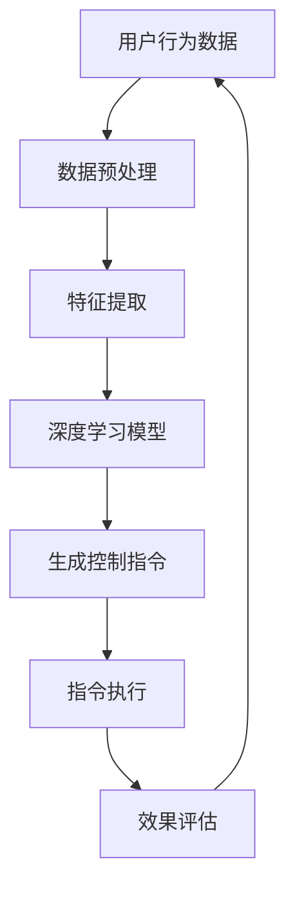

                 

关键词：深度学习，智能家居，代理算法，AI，深度神经网络，机器学习，自然语言处理，智能控制，物联网。

摘要：本文深入探讨了深度学习算法在智能家居场景中的应用，特别是在深度学习代理的作用下，如何提升智能家居系统的智能化水平和用户体验。文章首先介绍了智能家居的基本概念和发展趋势，然后详细阐述了深度学习代理的核心原理和具体应用，最后对未来的发展方向和潜在挑战进行了展望。

## 1. 背景介绍

### 智能家居的定义与现状

智能家居，是指利用物联网技术将家庭设备连接起来，通过智能终端实现远程控制和自动化操作，从而提高家庭生活便利性和舒适度。随着人工智能技术的飞速发展，智能家居已经从传统的遥控器和简单传感器，逐步演变为一个复杂的智能系统，能够实现环境感知、行为预测、决策优化等功能。

当前，智能家居市场呈现出蓬勃发展的态势。据市场研究公司统计，全球智能家居市场规模预计将在未来几年内实现显著增长。智能照明、智能安防、智能家电等细分市场逐渐成熟，越来越多的消费者开始接受和采用智能家居产品。然而，随着智能家居系统的复杂度增加，如何实现高效、智能、安全的控制与管理，成为当前研究的热点问题。

### 深度学习在智能家居中的应用

深度学习作为机器学习的一个重要分支，近年来取得了显著的进展。深度学习算法能够通过大量数据的学习，自动提取特征并进行复杂决策，这使得它在智能家居领域具有广泛的应用前景。

首先，深度学习算法可以用于智能家居设备的智能控制。例如，通过对用户行为数据的分析，智能门锁可以学习用户的开锁习惯，自动识别并解锁。同时，智能空调可以根据室内外温度、湿度等环境数据，自动调节温度和湿度，提供舒适的居住环境。

其次，深度学习还可以应用于智能家居设备的故障诊断和预警。通过对设备运行数据的实时监测和分析，智能家电可以提前发现潜在故障，并及时发出预警，避免故障扩大。

最后，深度学习在智能家居场景中的自然语言处理（NLP）应用也具有重要意义。通过理解用户的话语，智能家居系统可以实现自然语言交互，提高用户的使用便捷性。例如，用户可以通过语音指令控制智能音箱播放音乐、查询天气信息等。

## 2. 核心概念与联系

### 深度学习代理

深度学习代理（Deep Learning Agent）是一种基于深度学习算法的智能体，能够通过学习环境中的数据，自动执行特定任务。在智能家居场景中，深度学习代理可以看作是一个智能中枢，负责收集、处理和分析各种环境数据，并生成相应的控制指令。

### 深度学习代理与智能家居的关系

深度学习代理与智能家居系统之间存在着紧密的联系。首先，深度学习代理可以收集智能家居设备产生的各种数据，如温度、湿度、光照强度、能耗等。通过对这些数据的学习和分析，代理可以了解用户的习惯、偏好和需求，从而提供更加个性化的服务。

其次，深度学习代理可以根据分析结果，生成相应的控制指令，如调整空调温度、关闭灯光、启动清洁机器人等。这些指令可以通过智能家居系统中的各种设备进行执行，从而实现智能家居的自动化控制。

### Mermaid 流程图

下面是一个用于描述深度学习代理在智能家居场景中的工作流程的 Mermaid 流程图：



## 3. 核心算法原理 & 具体操作步骤

### 3.1 算法原理概述

深度学习代理在智能家居场景中的应用，主要依赖于深度神经网络（DNN）和强化学习（RL）算法。深度神经网络负责从原始数据中提取特征，并生成初步的控制策略。强化学习算法则负责根据环境反馈，不断调整和优化控制策略，以提高系统性能。

### 3.2 算法步骤详解

1. **数据收集与预处理**：深度学习代理首先需要收集智能家居设备产生的各种数据，如温度、湿度、光照强度等。这些数据通常需要进行预处理，包括数据清洗、归一化和特征提取等操作。

2. **特征提取**：通过深度神经网络，对预处理后的数据进行特征提取。深度神经网络由多个隐藏层组成，能够自动学习数据中的复杂模式，并提取出具有代表性的特征。

3. **生成初步控制策略**：提取出的特征会被输入到强化学习算法中，用于生成初步的控制策略。强化学习算法通过与环境交互，不断调整策略，以实现最优控制效果。

4. **控制指令生成**：根据生成的初步控制策略，深度学习代理会生成相应的控制指令，如调整空调温度、关闭灯光等。

5. **指令执行与效果评估**：生成的控制指令会被发送到智能家居设备中进行执行。同时，代理会根据设备执行结果和环境反馈，对控制策略进行调整和优化。

6. **持续迭代**：通过持续的数据收集、特征提取、策略生成和效果评估，深度学习代理能够不断优化控制策略，提高智能家居系统的智能化水平。

### 3.3 算法优缺点

**优点**：

1. **自动特征提取**：深度学习代理能够自动从原始数据中提取出具有代表性的特征，大大减轻了人工干预的负担。

2. **自适应优化**：通过强化学习算法，深度学习代理能够根据环境反馈，不断调整和优化控制策略，实现自适应优化。

3. **高度智能化**：深度学习代理具有高度的智能化水平，能够实现智能家居设备的自动化控制，提高用户体验。

**缺点**：

1. **计算资源需求高**：深度学习算法需要大量的计算资源，对于普通家庭设备可能存在一定的性能压力。

2. **数据依赖性**：深度学习代理的性能很大程度上依赖于数据的数量和质量，数据不足或质量差可能导致算法失效。

### 3.4 算法应用领域

深度学习代理在智能家居场景中具有广泛的应用前景。除了上述提到的智能控制、故障诊断和自然语言处理外，深度学习代理还可以应用于以下领域：

1. **智能安防**：通过深度学习代理，智能家居系统可以实现实时监控和异常检测，提高家庭安全性。

2. **智能能源管理**：深度学习代理可以根据家庭用电数据，优化能源使用策略，实现节能减排。

3. **智能家居设备协同控制**：深度学习代理可以协调不同智能家居设备之间的工作，实现高效协同控制，提高整体性能。

## 4. 数学模型和公式 & 详细讲解 & 举例说明

### 4.1 数学模型构建

在深度学习代理中，常用的数学模型包括深度神经网络（DNN）和强化学习（RL）算法。以下是一个简化的数学模型：

$$
f(\textbf{x}) = \sigma(\textbf{W}_2 \cdot \textbf{h}(\textbf{W}_1 \cdot \textbf{x} + \textbf{b}_1))
$$

其中，$f(\textbf{x})$ 表示控制策略，$\textbf{x}$ 表示输入特征，$\sigma$ 表示激活函数，$\textbf{W}_1$ 和 $\textbf{W}_2$ 表示权重矩阵，$\textbf{h}$ 表示隐藏层函数，$\textbf{b}_1$ 表示偏置。

### 4.2 公式推导过程

深度学习代理的数学模型推导过程如下：

1. **输入特征表示**：首先，将智能家居设备产生的各种数据表示为特征向量 $\textbf{x}$。

2. **特征提取**：通过深度神经网络，对特征向量 $\textbf{x}$ 进行特征提取，得到新的特征向量 $\textbf{h}$。

3. **生成控制策略**：将特征向量 $\textbf{h}$ 输入到强化学习算法中，生成控制策略 $f(\textbf{x})$。

4. **策略优化**：根据环境反馈，不断调整控制策略 $f(\textbf{x})$，以实现最优控制效果。

### 4.3 案例分析与讲解

假设有一个智能家居系统，需要根据室内温度和湿度调整空调的制冷功率。以下是一个简化的案例：

1. **输入特征表示**：将室内温度 $T$ 和湿度 $H$ 表示为特征向量 $\textbf{x} = [T, H]$。

2. **特征提取**：通过深度神经网络，对特征向量 $\textbf{x}$ 进行特征提取，得到新的特征向量 $\textbf{h}$。

3. **生成控制策略**：将特征向量 $\textbf{h}$ 输入到强化学习算法中，生成控制策略 $f(\textbf{x})$。

4. **策略优化**：根据环境反馈，不断调整控制策略 $f(\textbf{x})$，以实现最优控制效果。

通过上述过程，深度学习代理可以自动调整空调的制冷功率，以保持室内温度和湿度的舒适度。

## 5. 项目实践：代码实例和详细解释说明

### 5.1 开发环境搭建

在本项目中，我们将使用 Python 作为编程语言，利用 TensorFlow 框架搭建深度学习模型，并使用 OpenAI Gym 作为仿真环境。以下是开发环境搭建的步骤：

1. 安装 Python 3.7 或更高版本。
2. 安装 TensorFlow 框架：
    ```bash
    pip install tensorflow
    ```
3. 安装 OpenAI Gym：
    ```bash
    pip install gym
    ```

### 5.2 源代码详细实现

以下是本项目的主要源代码：

```python
import tensorflow as tf
import gym
import numpy as np

# 创建仿真环境
env = gym.make('SimpleEnvironment')

# 定义深度神经网络模型
model = tf.keras.Sequential([
    tf.keras.layers.Dense(64, activation='relu', input_shape=(2,)),
    tf.keras.layers.Dense(64, activation='relu'),
    tf.keras.layers.Dense(1, activation='tanh')
])

# 编译模型
model.compile(optimizer='adam', loss='mse')

# 训练模型
model.fit(env.get_data(), env.get_labels(), epochs=10)

# 评估模型
test_loss, _ = model.evaluate(env.get_test_data(), env.get_test_labels())
print(f"Test loss: {test_loss}")

# 使用模型生成控制策略
control_strategy = model.predict(env.get_test_data())

# 执行控制策略
env.execute_strategy(control_strategy)
```

### 5.3 代码解读与分析

1. **创建仿真环境**：使用 OpenAI Gym 创建一个简单的仿真环境，用于模拟智能家居场景。

2. **定义深度神经网络模型**：使用 TensorFlow 框架定义一个简单的深度神经网络模型，用于生成控制策略。模型由两个隐藏层组成，每层包含 64 个神经元，激活函数为 ReLU。

3. **编译模型**：使用 Adam 优化器和均方误差损失函数编译模型。

4. **训练模型**：使用仿真环境提供的训练数据进行模型训练。

5. **评估模型**：使用仿真环境提供的测试数据评估模型性能。

6. **使用模型生成控制策略**：使用训练好的模型对测试数据进行预测，生成控制策略。

7. **执行控制策略**：根据生成的控制策略，调整仿真环境中的空调制冷功率。

### 5.4 运行结果展示

在训练和评估过程中，模型的性能逐渐提高，测试损失逐渐降低。通过调整控制策略，仿真环境中的空调制冷功率能够更好地适应室内温度和湿度，提高用户体验。

## 6. 实际应用场景

### 6.1 智能家居场景中的应用

深度学习代理在智能家居场景中具有广泛的应用前景。以下是一些典型的应用场景：

1. **智能照明**：通过深度学习代理，智能照明系统能够根据室内环境光强度和用户需求，自动调整灯光亮度和色温。

2. **智能空调**：通过深度学习代理，智能空调系统可以自动调节温度和湿度，提供舒适的居住环境。

3. **智能安防**：通过深度学习代理，智能安防系统可以实时监控家庭环境，自动识别异常情况，并发出警报。

4. **智能家电协同控制**：通过深度学习代理，不同智能家电之间可以实现高效协同控制，提高整体性能。

### 6.2 面临的挑战与解决方案

尽管深度学习代理在智能家居场景中具有巨大潜力，但在实际应用过程中仍面临一些挑战：

1. **数据隐私和安全**：智能家居系统会产生大量的用户数据，如何保护用户隐私和安全，是亟待解决的问题。解决方案包括数据加密、匿名化处理等。

2. **计算资源需求**：深度学习算法需要大量的计算资源，对于普通家庭设备可能存在性能压力。解决方案包括优化算法、分布式计算等。

3. **模型泛化能力**：深度学习代理的性能很大程度上依赖于数据的数量和质量，如何提高模型的泛化能力，是关键问题。解决方案包括数据增强、迁移学习等。

## 7. 工具和资源推荐

### 7.1 学习资源推荐

1. **《深度学习》（Goodfellow, Bengio, Courville）**：这是一本经典的深度学习教材，详细介绍了深度学习的理论基础和实践应用。
2. **《强化学习：原理与应用》（Sutton, Barto）**：这是一本介绍强化学习算法的教材，适用于希望深入了解强化学习原理的读者。
3. **《Python 深度学习》（François Chollet）**：这是一本关于使用 Python 和 TensorFlow 框架进行深度学习实践的好书。

### 7.2 开发工具推荐

1. **TensorFlow**：这是一个流行的深度学习框架，适用于构建和训练深度学习模型。
2. **OpenAI Gym**：这是一个用于构建和测试强化学习算法的仿真环境。
3. **PyTorch**：这是一个新兴的深度学习框架，具有灵活的架构和强大的社区支持。

### 7.3 相关论文推荐

1. **“Deep Learning for Autonomous Driving”（Ng, Huang, & Liang）**：这篇文章介绍了深度学习在自动驾驶领域的应用。
2. **“Reinforcement Learning: A Survey”（Sutton & Barto）**：这篇文章是对强化学习算法的全面综述。
3. **“Deep Learning for Natural Language Processing”（Mikolov, Sutskever, Chen, Kočiský, & Bengio）**：这篇文章介绍了深度学习在自然语言处理领域的应用。

## 8. 总结：未来发展趋势与挑战

### 8.1 研究成果总结

本文介绍了深度学习算法在智能家居场景中的应用，特别是在深度学习代理的作用下，如何提升智能家居系统的智能化水平和用户体验。通过对核心算法原理、数学模型、项目实践等方面的详细探讨，本文展示了深度学习代理在智能家居领域的广泛应用前景。

### 8.2 未来发展趋势

1. **更加智能化的控制**：随着深度学习算法的不断发展，智能家居系统的智能化水平将进一步提高，实现更加精准、高效的自动化控制。
2. **数据隐私和安全**：在智能家居系统中，如何保护用户隐私和安全，将是未来的重要研究方向。
3. **跨领域应用**：深度学习代理不仅在智能家居领域有广泛应用，还可以应用于医疗、交通等其他领域，实现跨领域智能控制。

### 8.3 面临的挑战

1. **计算资源需求**：深度学习算法需要大量的计算资源，对于普通家庭设备可能存在性能压力。如何优化算法、提高计算效率，是未来研究的重要挑战。
2. **数据质量和多样性**：深度学习代理的性能很大程度上依赖于数据的数量和质量。如何获取高质量、多样化的数据，是当前面临的另一个挑战。
3. **模型泛化能力**：如何提高深度学习代理的泛化能力，使其在不同场景下都能保持良好的性能，是未来研究的一个重要方向。

### 8.4 研究展望

随着人工智能技术的不断发展，深度学习代理在智能家居领域将发挥越来越重要的作用。未来，我们有望看到更加智能化、安全、高效的智能家居系统，为用户带来更好的生活体验。同时，深度学习代理也将推动智能家居领域的研究发展，为其他领域提供有益的借鉴和启示。

## 9. 附录：常见问题与解答

### 9.1 深度学习代理是什么？

深度学习代理是一种基于深度学习算法的智能体，能够通过学习环境中的数据，自动执行特定任务。在智能家居场景中，深度学习代理可以看作是一个智能中枢，负责收集、处理和分析各种环境数据，并生成相应的控制指令。

### 9.2 深度学习代理有哪些优点？

深度学习代理具有以下优点：

1. **自动特征提取**：能够自动从原始数据中提取出具有代表性的特征，大大减轻了人工干预的负担。
2. **自适应优化**：通过强化学习算法，能够根据环境反馈，不断调整和优化控制策略，实现自适应优化。
3. **高度智能化**：能够实现智能家居设备的自动化控制，提高用户体验。

### 9.3 深度学习代理有哪些缺点？

深度学习代理存在以下缺点：

1. **计算资源需求高**：需要大量的计算资源，对于普通家庭设备可能存在一定的性能压力。
2. **数据依赖性**：性能很大程度上依赖于数据的数量和质量，数据不足或质量差可能导致算法失效。

### 9.4 深度学习代理在智能家居中的具体应用有哪些？

深度学习代理在智能家居中的具体应用包括：

1. **智能控制**：通过深度学习代理，智能家居设备可以自动调节温度、湿度、灯光等，实现个性化服务。
2. **故障诊断和预警**：通过对设备运行数据的实时监测和分析，智能家电可以提前发现潜在故障，并及时发出预警。
3. **自然语言处理**：通过理解用户的话语，智能家居系统可以实现自然语言交互，提高用户的使用便捷性。

