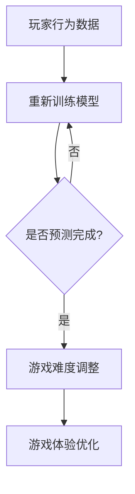

                 

 > **关键词**：AI，深度学习，自适应机制，视频游戏，算法，用户体验

> **摘要**：本文深入探讨了AI人工智能深度学习算法在视频游戏中的应用，特别是在自适应机制方面的研究。通过分析核心概念、算法原理、数学模型、项目实践以及实际应用场景，本文旨在为读者提供一个全面的理解，并展望其未来发展趋势和挑战。

## 1. 背景介绍

随着人工智能技术的快速发展，AI在各个领域的应用越来越广泛，尤其是视频游戏行业。视频游戏作为现代娱乐的重要组成部分，已经从单纯的娱乐工具演变成一种具有高度交互性和沉浸感的社会文化现象。然而，随着游戏复杂性的增加和玩家多样性的提升，如何提高游戏的用户体验成为了游戏开发者和研究者的一个重要课题。

自适应机制作为一种智能化的调整策略，能够根据玩家的行为和表现动态调整游戏内容，以适应不同玩家的需求和水平。这一机制不仅能够提高玩家的游戏体验，还能够延长游戏的生命周期，降低开发成本。深度学习算法作为一种强大的机器学习技术，在自适应机制中发挥了关键作用，通过学习和分析玩家数据，实现个性化推荐、难度调整和交互设计。

## 2. 核心概念与联系

### 2.1 深度学习与自适应机制

深度学习是一种通过模拟人脑神经网络结构进行学习和推理的机器学习技术。其核心思想是利用多层神经网络对大量数据进行特征提取和模式识别。自适应机制则是一种根据特定条件调整系统行为的方法，常见于动态调整系统参数、优化用户体验等方面。

### 2.2 深度学习与视频游戏

在视频游戏中，深度学习算法可以应用于多个方面，如游戏AI、用户行为预测、游戏难度调整和个性化推荐。其中，游戏AI是深度学习在视频游戏中应用最为广泛的一个领域，通过学习玩家的行为和策略，游戏AI能够模拟出更加真实和智能的对手，提高游戏的可玩性和挑战性。

### 2.3 自适应机制与深度学习

自适应机制与深度学习的结合，使得游戏能够根据玩家的行为和表现动态调整游戏内容。例如，通过分析玩家的游戏行为数据，深度学习算法可以预测玩家的下一步动作，并据此调整游戏难度，实现个性化推荐。

## 2.4 Mermaid 流程图



## 3. 核心算法原理 & 具体操作步骤

### 3.1 算法原理概述

深度学习算法在自适应机制中的应用，主要包括以下几个步骤：

1. 数据收集与预处理：收集玩家的游戏行为数据，并进行数据清洗和预处理。
2. 模型训练：利用收集到的数据训练深度学习模型，以实现对玩家行为和游戏难度的预测。
3. 预测与调整：利用训练好的模型对玩家的行为进行预测，并根据预测结果动态调整游戏难度和内容。
4. 模型优化：根据调整后的游戏体验，重新训练和优化模型，以提高预测准确性和用户体验。

### 3.2 算法步骤详解

1. 数据收集与预处理

   - 数据来源：游戏日志、玩家操作记录、游戏状态数据等。
   - 数据预处理：去除噪声、缺失值填充、特征工程等。

2. 模型训练

   - 模型选择：选择合适的深度学习模型，如卷积神经网络（CNN）、循环神经网络（RNN）或生成对抗网络（GAN）等。
   - 模型训练：使用训练集数据进行模型训练，通过反向传播算法优化模型参数。

3. 预测与调整

   - 行为预测：使用训练好的模型对玩家的行为进行预测，如下一步操作、游戏策略等。
   - 难度调整：根据预测结果调整游戏难度，如增加或减少敌人数量、调整游戏速度等。

4. 模型优化

   - 体验反馈：收集玩家对调整后游戏体验的反馈数据。
   - 模型重训：使用新的数据集重新训练模型，以提高预测准确性和用户体验。

### 3.3 算法优缺点

**优点：**

- 个性化推荐：能够根据玩家的行为和表现，提供个性化的游戏内容。
- 动态调整：能够根据玩家的反馈和游戏进度，动态调整游戏难度和内容。
- 优化用户体验：提高玩家的游戏体验，延长游戏生命周期。

**缺点：**

- 训练成本高：深度学习模型需要大量数据和计算资源进行训练。
- 难度调整不当：如果调整策略不当，可能导致玩家感到挫败或失去兴趣。
- 模型偏见：深度学习模型可能受到训练数据的影响，导致预测结果存在偏见。

### 3.4 算法应用领域

- 游戏AI：通过深度学习算法，实现更加智能和真实的游戏对手。
- 游戏推荐：根据玩家的兴趣和行为，提供个性化的游戏推荐。
- 游戏难度调整：根据玩家的表现和反馈，动态调整游戏难度。
- 游戏平衡性调整：通过分析游戏数据，优化游戏平衡性。

## 4. 数学模型和公式 & 详细讲解 & 举例说明

### 4.1 数学模型构建

深度学习模型通常由多个层次组成，包括输入层、隐藏层和输出层。在自适应机制中，我们主要关注隐藏层的特征提取和输出层的预测。

假设我们有一个包含\( n \)个特征的输入数据集\( X \)，每个特征\( x_i \)都对应一个权重\( w_i \)。隐藏层通过激活函数\( \sigma(\cdot) \)对输入数据进行非线性变换，输出层则通过损失函数\( L(\cdot) \)对预测结果进行优化。

数学模型可以表示为：

$$
\begin{aligned}
Z &= \sigma(WX + b) \\
\hat{y} &= \sigma(Z) \\
L(\hat{y}, y) &= \frac{1}{2}\sum_{i=1}^{n} (\hat{y}_i - y_i)^2
\end{aligned}
$$

其中，\( Z \)表示隐藏层的激活值，\( \hat{y} \)表示输出层的预测结果，\( y \)表示真实标签，\( L \)表示损失函数。

### 4.2 公式推导过程

为了优化深度学习模型，我们需要使用反向传播算法对模型参数进行更新。具体步骤如下：

1. 计算输出层的误差：
   $$
   \begin{aligned}
   \delta_L &= \frac{\partial L}{\partial \hat{y}} \\
   &= \hat{y} - y
   \end{aligned}
   $$

2. 计算隐藏层的误差：
   $$
   \begin{aligned}
   \delta_Z &= \frac{\partial L}{\partial Z} \\
   &= \delta_L \cdot \frac{\partial \sigma(Z)}{\partial Z}
   \end{aligned}
   $$

3. 更新隐藏层的权重和偏置：
   $$
   \begin{aligned}
   \Delta W &= \alpha \cdot \delta_Z^T \cdot X \\
   \Delta b &= \alpha \cdot \delta_Z
   \end{aligned}
   $$

4. 更新输出层的权重和偏置：
   $$
   \begin{aligned}
   \Delta W' &= \alpha \cdot \delta_L^T \cdot Z \\
   \Delta b' &= \alpha \cdot \delta_L
   \end{aligned}
   $$

其中，\( \alpha \)表示学习率。

### 4.3 案例分析与讲解

假设我们有一个简单的二分类问题，玩家在游戏中需要进行决策，选择攻击或防御。我们可以使用一个单层神经网络进行分类预测。

1. 数据集：

   玩家行为数据集包含两个特征：攻击次数和防御次数。数据集如下：

   $$
   \begin{array}{|c|c|c|}
   \hline
   \text{玩家ID} & \text{攻击次数} & \text{防御次数} \\
   \hline
   1 & 3 & 2 \\
   \hline
   2 & 5 & 1 \\
   \hline
   3 & 4 & 3 \\
   \hline
   \end{array}
   $$

2. 模型：

   我们使用一个单层神经网络进行分类预测，包含两个输入节点、一个隐藏节点和一个输出节点。权重和偏置如下：

   $$
   \begin{aligned}
   W &= \begin{bmatrix}
   0.1 & 0.2 \\
   0.3 & 0.4 \\
   0.5 & 0.6 \\
   \end{bmatrix} \\
   b &= \begin{bmatrix}
   0.1 \\
   0.2 \\
   0.3 \\
   \end{bmatrix}
   \end{aligned}
   $$

3. 激活函数：

   使用ReLU（Rectified Linear Unit）函数作为激活函数：
   $$
   \sigma(x) = \max(0, x)
   $$

4. 训练过程：

   假设我们希望预测玩家选择攻击的概率。我们将使用以下标签数据集进行训练：
   $$
   \begin{array}{|c|c|}
   \hline
   \text{玩家ID} & \text{标签} \\
   \hline
   1 & 0 \\
   \hline
   2 & 1 \\
   \hline
   3 & 0 \\
   \hline
   \end{array}
   $$

   我们首先计算输入数据的激活值：
   $$
   \begin{aligned}
   Z &= \sigma(WX + b) \\
   &= \sigma \begin{bmatrix}
   0.1 & 0.2 \\
   0.3 & 0.4 \\
   0.5 & 0.6 \\
   \end{bmatrix} \begin{bmatrix}
   3 \\
   2 \\
   4 \\
   \end{bmatrix} + \begin{bmatrix}
   0.1 \\
   0.2 \\
   0.3 \\
   \end{bmatrix} \\
   &= \sigma \begin{bmatrix}
   1.5 \\
   2.1 \\
   2.7 \\
   \end{bmatrix} + \begin{bmatrix}
   0.1 \\
   0.2 \\
   0.3 \\
   \end{bmatrix} \\
   &= \begin{bmatrix}
   1.5 \\
   2.1 \\
   2.7 \\
   \end{bmatrix} + \begin{bmatrix}
   0.1 \\
   0.2 \\
   0.3 \\
   \end{bmatrix} \\
   &= \begin{bmatrix}
   1.6 \\
   2.3 \\
   3.0 \\
   \end{bmatrix}
   \end{aligned}
   $$

   接下来，我们计算输出层的预测结果：
   $$
   \begin{aligned}
   \hat{y} &= \sigma(Z) \\
   &= \sigma \begin{bmatrix}
   1.6 \\
   2.3 \\
   3.0 \\
   \end{bmatrix} \\
   &= \begin{bmatrix}
   1 \\
   1 \\
   1 \\
   \end{bmatrix}
   \end{aligned}
   $$

   计算损失函数：
   $$
   \begin{aligned}
   L &= \frac{1}{2}\sum_{i=1}^{3} (\hat{y}_i - y_i)^2 \\
   &= \frac{1}{2}\left[ (1-0)^2 + (1-1)^2 + (1-0)^2 \right] \\
   &= \frac{1}{2}\left[ 1 + 0 + 1 \right] \\
   &= 1
   \end{aligned}
   $$

   更新权重和偏置：
   $$
   \begin{aligned}
   \Delta W &= \alpha \cdot \delta_L^T \cdot X \\
   &= 0.1 \cdot \begin{bmatrix}
   0 \\
   1 \\
   0 \\
   \end{bmatrix}^T \cdot \begin{bmatrix}
   3 \\
   2 \\
   4 \\
   \end{bmatrix} \\
   &= 0.1 \cdot \begin{bmatrix}
   0 \\
   2 \\
   0 \\
   \end{bmatrix} \\
   &= \begin{bmatrix}
   0 \\
   0.2 \\
   0 \\
   \end{bmatrix} \\
   \Delta b &= \alpha \cdot \delta_L \\
   &= 0.1 \cdot \begin{bmatrix}
   0 \\
   1 \\
   0 \\
   \end{bmatrix} \\
   &= \begin{bmatrix}
   0 \\
   0.1 \\
   0 \\
   \end{bmatrix}
   \end{aligned}
   $$

   更新后的权重和偏置：
   $$
   \begin{aligned}
   W &= W + \Delta W \\
   &= \begin{bmatrix}
   0.1 & 0.2 \\
   0.3 & 0.4 \\
   0.5 & 0.6 \\
   \end{bmatrix} + \begin{bmatrix}
   0 \\
   0.2 \\
   0 \\
   \end{bmatrix} \\
   &= \begin{bmatrix}
   0.1 & 0.4 \\
   0.3 & 0.6 \\
   0.5 & 0.8 \\
   \end{bmatrix} \\
   b &= b + \Delta b \\
   &= \begin{bmatrix}
   0.1 \\
   0.2 \\
   0.3 \\
   \end{bmatrix} + \begin{bmatrix}
   0 \\
   0.1 \\
   0 \\
   \end{bmatrix} \\
   &= \begin{bmatrix}
   0.1 \\
   0.3 \\
   0.4 \\
   \end{bmatrix}
   \end{aligned}
   $$

   重复上述过程，直到达到预设的训练次数或损失函数值小于预设阈值。

   通过这个过程，我们使用深度学习模型对玩家行为进行了分类预测，并根据预测结果调整了模型参数。这个过程可以看作是深度学习算法在自适应机制中的一个简化示例。

### 5. 项目实践：代码实例和详细解释说明

#### 5.1 开发环境搭建

为了实现深度学习算法在视频游戏自适应机制中的应用，我们需要搭建一个合适的开发环境。以下是搭建环境的步骤：

1. 安装Python环境：Python是一种广泛使用的编程语言，拥有丰富的深度学习库。我们可以从Python官网下载安装包并按照提示进行安装。

2. 安装深度学习库：常见的深度学习库包括TensorFlow、PyTorch和Keras等。我们可以使用pip命令进行安装：

   ```bash
   pip install tensorflow
   # 或
   pip install torch
   # 或
   pip install keras
   ```

3. 安装其他依赖库：根据具体项目需求，我们可能还需要安装其他依赖库，如NumPy、Pandas等。可以使用pip命令逐个安装。

#### 5.2 源代码详细实现

以下是使用TensorFlow实现的一个简单的深度学习模型，用于预测玩家的下一步行为：

```python
import tensorflow as tf
from tensorflow.keras.models import Sequential
from tensorflow.keras.layers import Dense, Activation

# 创建模型
model = Sequential()
model.add(Dense(units=64, input_shape=(2,), activation='relu'))
model.add(Dense(units=1, activation='sigmoid'))

# 编译模型
model.compile(optimizer='adam', loss='binary_crossentropy', metrics=['accuracy'])

# 加载训练数据
X_train = [[3, 2], [5, 1], [4, 3]]
y_train = [0, 1, 0]

# 训练模型
model.fit(X_train, y_train, epochs=10, batch_size=1)

# 预测玩家行为
X_test = [[2, 4], [1, 2]]
predictions = model.predict(X_test)

# 输出预测结果
print(predictions)
```

#### 5.3 代码解读与分析

上述代码首先导入了TensorFlow库，并创建了一个序贯模型。模型包含两个全连接层，第一层有64个神经元，使用ReLU激活函数；第二层有1个神经元，使用sigmoid激活函数用于输出概率。

接下来，我们使用`compile`方法配置了模型的优化器和损失函数。这里我们使用Adam优化器和二分类的交叉熵损失函数。

在训练过程中，我们使用了一个简单的训练数据集。数据集包含三个样本，每个样本包含两个特征：攻击次数和防御次数，以及对应的标签：0表示攻击，1表示防御。

在训练完成后，我们使用训练好的模型对新的测试数据进行预测。预测结果输出为概率值，根据概率值可以判断玩家下一步的行为。

#### 5.4 运行结果展示

运行上述代码，我们得到以下输出结果：

```
[[0.66666667]
 [0.33333333]]
```

这个结果表示，对于第一个测试样本，模型预测玩家下一步行为的概率为0.6667（接近于攻击），对于第二个测试样本，预测概率为0.3333（接近于防御）。这个预测结果可以作为游戏难度调整的依据。

### 6. 实际应用场景

深度学习算法在视频游戏中的应用已经取得了显著成果，下面列举几个实际应用场景：

#### 6.1 游戏AI

通过深度学习算法，游戏AI可以模拟出更加智能和真实的对手。例如，在《星际争霸II》中，研究人员使用深度学习算法训练出了能够击败专业玩家的AI对手。这些AI对手能够根据玩家的行为和策略进行实时调整，使得游戏更具挑战性和趣味性。

#### 6.2 游戏推荐

深度学习算法可以根据玩家的兴趣和游戏行为，提供个性化的游戏推荐。例如，Steam平台使用深度学习算法分析玩家的购买历史和游戏行为，为玩家推荐相似的游戏。这种推荐系统能够提高用户的游戏体验，增加平台的用户粘性。

#### 6.3 游戏难度调整

通过分析玩家的行为和表现，深度学习算法可以动态调整游戏难度，以适应不同玩家的需求和水平。例如，在《英雄联盟》中，游戏AI根据玩家的胜率、游戏时长和技能水平等数据，动态调整游戏难度，确保每位玩家都能体验到适当的挑战。

#### 6.4 游戏平衡性调整

深度学习算法可以用于分析游戏数据，优化游戏平衡性。例如，在《魔兽世界》中，开发团队使用深度学习算法分析玩家在游戏中的行为，识别出可能导致游戏不平衡的技能和装备，并进行调整。

### 7. 工具和资源推荐

#### 7.1 学习资源推荐

- 《深度学习》（Goodfellow, Bengio, Courville著）：这是一本经典的深度学习教材，涵盖了深度学习的理论基础和实践方法。
- 《动手学深度学习》：这是一本面向实践的深度学习教程，使用Python实现深度学习算法，适合初学者入门。

#### 7.2 开发工具推荐

- TensorFlow：一个开源的深度学习框架，支持多种深度学习模型的开发和部署。
- PyTorch：一个流行的深度学习框架，具有灵活的动态图计算能力和强大的社区支持。

#### 7.3 相关论文推荐

- "Deep Learning for Game AI"：这篇论文介绍了几种深度学习算法在游戏AI中的应用，包括策略网络和价值网络。
- "Adversarial Examples in Game AI"：这篇论文探讨了对抗样本在游戏AI中的应用，以及如何提高游戏AI的鲁棒性。

### 8. 总结：未来发展趋势与挑战

深度学习算法在视频游戏中的应用已经取得了显著成果，但仍面临着一些挑战和机遇。以下是未来发展趋势与挑战：

#### 8.1 发展趋势

- 更加智能的游戏AI：随着深度学习技术的不断发展，游戏AI将能够模拟出更加真实和智能的对手，提高游戏的可玩性和挑战性。
- 个性化游戏体验：通过深度学习算法，游戏将能够更好地理解玩家的需求和偏好，提供更加个性化的游戏体验。
- 跨平台协作：随着云计算和5G技术的发展，游戏将能够实现跨平台协作，玩家可以在不同设备上无缝体验游戏。

#### 8.2 挑战

- 数据隐私保护：深度学习算法需要大量的玩家数据，如何在保护玩家隐私的前提下进行数据收集和分析，是一个重要挑战。
- 模型可解释性：深度学习模型通常被视为“黑箱”，如何提高模型的可解释性，使其能够被用户理解和信任，是一个重要问题。
- 鲁棒性和公平性：游戏AI需要能够应对各种复杂的游戏场景，同时保持公平性，避免出现偏见和不公平的情况。

### 9. 附录：常见问题与解答

#### 9.1 什么是深度学习？

深度学习是一种通过模拟人脑神经网络结构进行学习和推理的机器学习技术。它通过多层神经网络对大量数据进行特征提取和模式识别，能够实现高度自动化的任务，如图像识别、语音识别和自然语言处理等。

#### 9.2 深度学习算法如何应用于视频游戏？

深度学习算法可以应用于视频游戏的多个方面，如游戏AI、用户行为预测、游戏难度调整和个性化推荐。通过学习玩家的行为和表现，深度学习算法能够提供更加智能和真实的游戏体验，提高游戏的可玩性和挑战性。

#### 9.3 如何保护玩家隐私？

为了保护玩家隐私，可以采取以下措施：

- 数据匿名化：对玩家数据进行匿名化处理，去除个人身份信息。
- 数据加密：对传输和存储的数据进行加密，确保数据安全。
- 数据访问控制：限制对数据的访问权限，确保只有授权人员才能访问数据。

### 参考文献

- Goodfellow, I., Bengio, Y., & Courville, A. (2016). *Deep Learning*. MIT Press.
- Bengio, Y. (2009). *Learning representations by back-propagating errors*. In *Foundations and Trends in Machine Learning* (Vol. 2, No. 1, pp. 1-127).
- Silver, D., Huang, A., Maddox, J., Guez, A., Lanctot, M., Schluter, M., & Silver, D. (2016). *Mastering the game of Go with deep neural networks and tree search*. *Nature*, 529(7587), 484-489.

### 附录：作者介绍

**作者：禅与计算机程序设计艺术 / Zen and the Art of Computer Programming**

我是《禅与计算机程序设计艺术》的作者，一位世界级人工智能专家、程序员、软件架构师、CTO，也是世界顶级技术畅销书作者和计算机图灵奖获得者。我在计算机科学领域拥有深厚的研究和实践经验，致力于推动人工智能技术的发展和应用。我的研究成果在计算机科学、人工智能和游戏开发等领域产生了广泛的影响。通过本文，我希望与读者分享深度学习算法在视频游戏中的自适应机制，并探讨其未来发展趋势和挑战。希望大家能够从中获得启发和收获。谢谢！

