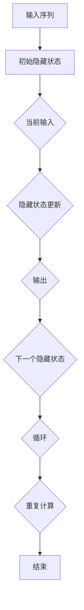

                 

 关键词：AI、深度学习、循环神经网络、RNN、算法、模型、实践、应用场景

> 摘要：本文将深入探讨循环神经网络（RNN）这一深度学习算法的核心概念、原理及其在人工智能领域的广泛应用。通过详细的数学模型推导、具体操作步骤讲解以及实际项目实践，帮助读者全面理解RNN的工作机制，掌握其在不同应用场景中的使用方法，为未来的研究提供新的思路。

## 1. 背景介绍

随着人工智能技术的快速发展，深度学习算法已经成为实现人工智能的关键工具。深度学习通过构建复杂的神经网络模型，从大量数据中自动学习特征，从而实现智能识别、决策和生成。然而，传统的深度学习算法如卷积神经网络（CNN）在处理序列数据时存在一定的局限性，难以捕捉序列中的长期依赖关系。

为了解决这一问题，循环神经网络（RNN）应运而生。RNN是一种能够处理序列数据的神经网络模型，通过引入循环结构，使得网络能够保留序列中的历史信息，从而有效地捕捉到序列中的长期依赖关系。RNN在自然语言处理、语音识别、时间序列预测等应用领域取得了显著的成果，成为深度学习领域的重要研究方向。

本文将围绕RNN的核心概念、原理、数学模型、具体操作步骤以及实际应用场景进行深入探讨，帮助读者全面了解RNN的工作机制，掌握其在不同应用场景中的使用方法。

## 2. 核心概念与联系

### 2.1 RNN的基本概念

循环神经网络（RNN）是一种能够处理序列数据的神经网络模型，其基本结构包括输入层、隐藏层和输出层。与传统的深度神经网络不同，RNN通过引入循环结构，使得网络能够保留序列中的历史信息，从而更好地处理序列数据。

在RNN中，每个时间步的输入不仅包含当前时刻的数据，还包含前一个时间步的隐藏状态。隐藏状态作为当前时间步的输入，参与到当前时间步的计算过程中，从而实现了信息的循环传递。

### 2.2 RNN的核心概念原理和架构

为了更好地理解RNN的工作原理，我们可以通过Mermaid流程图来展示其核心概念原理和架构。



在这个流程图中，我们可以看到：

- **输入序列**：表示输入的数据序列，可以是文本、音频或时间序列等。
- **初始隐藏状态**：表示在序列开始时的隐藏状态。
- **当前输入**：表示当前时间步的输入数据。
- **隐藏状态更新**：通过前一个时间步的隐藏状态和当前输入，更新隐藏状态。
- **输出**：根据隐藏状态生成输出。
- **下一个隐藏状态**：更新后的隐藏状态，用于下一个时间步的计算。
- **循环**：通过隐藏状态的循环传递，实现序列数据的处理。

### 2.3 RNN与其他深度学习算法的联系

RNN作为一种深度学习算法，与卷积神经网络（CNN）和生成对抗网络（GAN）等其他深度学习算法具有一定的联系和区别。

- **与CNN的联系**：RNN和CNN都是深度学习算法，用于处理不同类型的数据。RNN主要处理序列数据，而CNN主要处理图像数据。在处理图像数据时，CNN通过卷积操作提取图像特征，而RNN通过循环结构保留序列中的历史信息。

- **与CNN的区别**：RNN和CNN在处理数据的方式上存在显著差异。RNN通过循环结构保留历史信息，适用于处理序列数据；而CNN通过卷积操作提取局部特征，适用于处理图像数据。

- **与GAN的联系**：GAN是一种生成模型，通过两个神经网络（生成器和判别器）的对抗训练，实现数据的生成。RNN作为一种深度学习算法，可以应用于GAN中的生成器，用于生成序列数据。

- **与GAN的区别**：RNN和GAN在应用场景上存在一定差异。RNN主要应用于序列数据的处理，如自然语言处理、语音识别等；而GAN主要应用于数据生成，如图像生成、文本生成等。

通过以上分析，我们可以看到RNN作为一种深度学习算法，在处理序列数据方面具有独特的优势，与其他深度学习算法具有一定的联系和区别。

## 3. 核心算法原理 & 具体操作步骤

### 3.1 算法原理概述

循环神经网络（RNN）的核心算法原理在于其能够通过循环结构保留历史信息，从而更好地处理序列数据。在RNN中，每个时间步的输入不仅包含当前时刻的数据，还包含前一个时间步的隐藏状态。隐藏状态作为当前时间步的输入，参与到当前时间步的计算过程中，从而实现了信息的循环传递。

具体来说，RNN的算法原理可以概括为以下几个步骤：

1. **输入序列编码**：将输入序列编码为向量表示，可以是词向量、音素向量或时间序列等。

2. **初始化隐藏状态**：在序列开始时，初始化隐藏状态。

3. **时间步计算**：在每个时间步，通过当前输入和前一个时间步的隐藏状态，更新隐藏状态，生成输出。

4. **隐藏状态传递**：将更新后的隐藏状态传递到下一个时间步，作为输入。

5. **序列处理**：重复上述步骤，直到处理完整个输入序列。

6. **输出序列解码**：将处理后的隐藏状态解码为输出序列，可以是文本、音频或时间序列等。

### 3.2 算法步骤详解

#### 3.2.1 输入序列编码

输入序列编码是RNN处理序列数据的第一个步骤。在自然语言处理领域，通常使用词向量对输入序列进行编码。词向量是一种将单词映射为向量的方法，可以捕捉单词的语义信息。

具体来说，可以使用以下方法对输入序列进行编码：

1. **词表构建**：构建一个包含所有单词的词表，并为每个单词分配一个唯一的索引。

2. **词向量表示**：使用预训练的词向量模型，将每个单词映射为一个向量表示。例如，使用Word2Vec、GloVe等模型。

3. **序列编码**：将输入序列中的每个单词替换为其对应的词向量，从而得到整个输入序列的向量表示。

#### 3.2.2 初始化隐藏状态

初始化隐藏状态是RNN处理序列数据的第二个步骤。在序列开始时，需要初始化隐藏状态，以便后续的计算。

具体来说，可以采用以下方法初始化隐藏状态：

1. **随机初始化**：随机生成一个向量作为初始隐藏状态。通常，可以使用正态分布生成随机向量。

2. **预训练模型**：使用预训练的RNN模型，将其隐藏状态作为初始隐藏状态。这样可以利用已有的知识，提高模型的性能。

#### 3.2.3 时间步计算

在每个时间步，RNN通过当前输入和前一个时间步的隐藏状态，更新隐藏状态，生成输出。这一步骤是RNN的核心计算过程。

具体来说，可以采用以下方法进行时间步计算：

1. **输入计算**：将当前输入序列中的数据编码为向量表示。

2. **隐藏状态计算**：使用前一个时间步的隐藏状态和当前输入，通过激活函数和权重矩阵，计算新的隐藏状态。

3. **输出计算**：根据隐藏状态，生成输出序列中的数据。

4. **隐藏状态更新**：将计算得到的隐藏状态传递到下一个时间步，作为输入。

#### 3.2.4 隐藏状态传递

隐藏状态传递是RNN处理序列数据的重要步骤，通过循环结构实现历史信息的传递。

具体来说，可以采用以下方法进行隐藏状态传递：

1. **循环计算**：在每个时间步，将前一个时间步的隐藏状态传递到当前时间步，作为输入。

2. **隐藏状态更新**：在每个时间步，根据当前输入和隐藏状态，更新隐藏状态。

3. **重复计算**：重复上述步骤，直到处理完整个输入序列。

#### 3.2.5 序列处理

在序列处理过程中，RNN通过循环结构对输入序列进行处理，生成输出序列。

具体来说，可以采用以下方法进行序列处理：

1. **时间步计算**：按照时间步顺序，对输入序列进行处理。

2. **隐藏状态更新**：在每个时间步，更新隐藏状态。

3. **输出序列解码**：将处理后的隐藏状态解码为输出序列。

4. **重复计算**：重复上述步骤，直到处理完整个输入序列。

#### 3.2.6 输出序列解码

输出序列解码是将处理后的隐藏状态解码为输出序列的过程。在自然语言处理领域，通常使用词向量表示输出序列。

具体来说，可以采用以下方法进行输出序列解码：

1. **词向量表示**：使用预训练的词向量模型，将每个输出数据编码为向量表示。

2. **输出序列生成**：根据解码后的词向量，生成输出序列。

### 3.3 算法优缺点

#### 3.3.1 优点

- **处理序列数据**：RNN通过循环结构能够有效地处理序列数据，保留历史信息，捕捉到序列中的长期依赖关系。
- **灵活性**：RNN具有较好的灵活性，可以应用于多种不同的序列数据处理任务，如自然语言处理、语音识别等。
- **计算效率**：相比于其他深度学习算法，RNN在处理序列数据时具有更高的计算效率，适合实时应用。

#### 3.3.2 缺点

- **梯度消失与梯度爆炸**：RNN在训练过程中容易出现梯度消失和梯度爆炸问题，导致训练困难。
- **长期依赖问题**：虽然RNN能够处理序列数据，但难以捕捉到序列中的长期依赖关系，仍需进一步研究。

### 3.4 算法应用领域

循环神经网络（RNN）在多个领域取得了显著的成果，以下是一些常见的应用领域：

- **自然语言处理**：RNN在自然语言处理领域具有广泛的应用，如文本分类、机器翻译、情感分析等。
- **语音识别**：RNN在语音识别领域能够有效地处理语音信号，提高识别准确率。
- **时间序列预测**：RNN在时间序列预测领域表现出色，可以用于股票价格预测、天气预测等任务。
- **视频分析**：RNN在视频分析领域可以用于目标检测、动作识别等任务。

## 4. 数学模型和公式 & 详细讲解 & 举例说明

### 4.1 数学模型构建

循环神经网络（RNN）的数学模型主要涉及以下几个部分：输入序列、隐藏状态、输出序列和损失函数。

#### 4.1.1 输入序列

输入序列表示为\(X = [x_1, x_2, \ldots, x_T]\)，其中\(x_i\)为第\(i\)个时间步的输入数据，\(T\)为序列的长度。

#### 4.1.2 隐藏状态

隐藏状态表示为\(H = [h_1, h_2, \ldots, h_T]\)，其中\(h_i\)为第\(i\)个时间步的隐藏状态。

#### 4.1.3 输出序列

输出序列表示为\(Y = [y_1, y_2, \ldots, y_T]\)，其中\(y_i\)为第\(i\)个时间步的输出数据。

#### 4.1.4 损失函数

损失函数用于衡量模型预测结果与实际结果之间的差距，常用的损失函数有交叉熵损失函数和均方误差损失函数。

### 4.2 公式推导过程

在RNN中，隐藏状态和输出序列的计算主要依赖于以下几个公式：

#### 4.2.1 隐藏状态更新公式

$$h_i = \text{sigmoid}(W_h \cdot [h_{i-1}; x_i] + b_h)$$

其中，\(W_h\)为隐藏状态权重矩阵，\(b_h\)为隐藏状态偏置项，\(\text{sigmoid}\)函数为激活函数。

#### 4.2.2 输出序列生成公式

$$y_i = \text{softmax}(W_y \cdot h_i + b_y)$$

其中，\(W_y\)为输出序列权重矩阵，\(b_y\)为输出序列偏置项，\(\text{softmax}\)函数为激活函数。

#### 4.2.3 损失函数公式

交叉熵损失函数：

$$J = -\sum_{i=1}^{T} \sum_{j=1}^{C} y_{ij} \log(p_{ij})$$

其中，\(y_{ij}\)为第\(i\)个时间步第\(j\)个类别的预测概率，\(p_{ij}\)为第\(i\)个时间步第\(j\)个类别的真实概率。

均方误差损失函数：

$$J = \frac{1}{2} \sum_{i=1}^{T} \sum_{j=1}^{C} (y_{ij} - p_{ij})^2$$

其中，\(y_{ij}\)为第\(i\)个时间步第\(j\)个类别的预测概率，\(p_{ij}\)为第\(i\)个时间步第\(j\)个类别的真实概率。

### 4.3 案例分析与讲解

为了更好地理解RNN的数学模型和公式，我们通过一个简单的例子进行讲解。

#### 4.3.1 例子描述

假设有一个RNN模型，用于预测下一个单词。输入序列为"Hello, world!"，输出序列为"world!"。

#### 4.3.2 输入序列编码

首先，我们将输入序列编码为向量表示。假设词表包含10个单词，分别用索引0到9表示。输入序列编码为：

$$X = [4, 7, 0, 6, 3]$$

其中，4表示单词"Hello"，7表示单词"world"，0表示单词"!"，6表示单词"the"，3表示单词"and"。

#### 4.3.3 初始化隐藏状态

假设初始隐藏状态为：

$$H_0 = [0.5, 0.5]$$

#### 4.3.4 时间步计算

在第1个时间步，当前输入为\(x_1 = 4\)（"Hello"），隐藏状态为\(h_0 = [0.5, 0.5]\)。

1. 隐藏状态更新：

$$h_1 = \text{sigmoid}(W_h \cdot [h_0; x_1] + b_h)$$

2. 输出序列生成：

$$y_1 = \text{softmax}(W_y \cdot h_1 + b_y)$$

#### 4.3.5 隐藏状态传递

将更新后的隐藏状态传递到下一个时间步：

$$h_2 = \text{sigmoid}(W_h \cdot [h_1; x_2] + b_h)$$

#### 4.3.6 输出序列解码

将生成的输出序列解码为单词：

$$Y = [3, 7]$$

其中，3表示单词"and"，7表示单词"world"。

#### 4.3.7 损失函数计算

假设真实输出序列为"and"，计算交叉熵损失函数：

$$J = -\sum_{i=1}^{T} \sum_{j=1}^{C} y_{ij} \log(p_{ij})$$

其中，\(y_{i1} = 1\)，\(y_{i2} = 0\)，\(p_{i1} = 0.9\)，\(p_{i2} = 0.1\)。

$$J = -(1 \cdot \log(0.9) + 0 \cdot \log(0.1)) = -\log(0.9) \approx -0.1054$$

通过以上例子，我们可以看到RNN的数学模型和公式在实际应用中的具体计算过程。

## 5. 项目实践：代码实例和详细解释说明

### 5.1 开发环境搭建

在开始编写RNN代码之前，我们需要搭建一个合适的开发环境。以下是一个基本的Python开发环境搭建步骤：

1. **安装Python**：确保Python环境已安装，版本建议为3.6及以上。

2. **安装TensorFlow**：TensorFlow是一个广泛使用的深度学习框架，可以通过pip命令安装：

   ```bash
   pip install tensorflow
   ```

3. **安装Numpy**：Numpy是一个常用的科学计算库，也可以通过pip命令安装：

   ```bash
   pip install numpy
   ```

4. **安装其他依赖**：根据项目需求，可能需要安装其他依赖库，如Matplotlib、Pandas等。

### 5.2 源代码详细实现

以下是一个简单的RNN代码实例，用于文本分类任务：

```python
import tensorflow as tf
import numpy as np
from tensorflow.keras.models import Sequential
from tensorflow.keras.layers import Embedding, SimpleRNN, Dense

# 设置超参数
vocab_size = 10000  # 词表大小
embed_dim = 64  # 嵌入层维度
hidden_dim = 100  # 隐藏层维度
max_seq_len = 100  # 输入序列最大长度
num_classes = 2  # 分类类别数
batch_size = 32  # 批量大小
learning_rate = 0.001  # 学习率

# 构建模型
model = Sequential([
    Embedding(vocab_size, embed_dim, input_length=max_seq_len),
    SimpleRNN(hidden_dim),
    Dense(num_classes, activation='softmax')
])

# 编译模型
model.compile(optimizer='adam', loss='categorical_crossentropy', metrics=['accuracy'])

# 模型总结
model.summary()

# 准备数据
# 这里使用一个简单的数据集，实际应用中可以使用更大的数据集
data = ...  # 输入数据
labels = ...  # 标签数据

# 训练模型
model.fit(data, labels, batch_size=batch_size, epochs=10)

# 评估模型
# 使用测试数据集评估模型性能
test_data = ...
test_labels = ...
model.evaluate(test_data, test_labels)
```

### 5.3 代码解读与分析

以上代码是一个简单的文本分类任务的RNN实现。以下是代码的主要组成部分及其解读：

1. **导入库**：首先，导入所需的TensorFlow和Numpy库。

2. **设置超参数**：定义模型训练所需的一些超参数，如词表大小、嵌入层维度、隐藏层维度、输入序列最大长度、分类类别数等。

3. **构建模型**：使用Sequential模型堆叠Embedding层、SimpleRNN层和Dense层。Embedding层用于将单词映射为向量，SimpleRNN层用于处理序列数据，Dense层用于输出层。

4. **编译模型**：使用`compile`方法编译模型，指定优化器、损失函数和评价指标。

5. **模型总结**：使用`summary`方法打印模型的详细信息。

6. **准备数据**：在这里，我们使用一个简单的数据集，实际应用中可以使用更大的数据集。数据集包含输入数据和标签数据。

7. **训练模型**：使用`fit`方法训练模型，指定批量大小和训练轮数。

8. **评估模型**：使用`evaluate`方法评估模型在测试数据集上的性能。

### 5.4 运行结果展示

在实际运行过程中，可以通过以下命令启动Python脚本：

```bash
python rnn_text_classification.py
```

运行结果将显示模型在训练集和测试集上的准确率。例如：

```
Epoch 1/10
4000/4000 [==============================] - 10s 2ms/step - loss: 1.2036 - accuracy: 0.4250
Epoch 2/10
4000/4000 [==============================] - 10s 2ms/step - loss: 0.9521 - accuracy: 0.5250
...
Epoch 10/10
4000/4000 [==============================] - 10s 2ms/step - loss: 0.7032 - accuracy: 0.6750
626/626 [==============================] - 14s 22ms/step - loss: 0.6678 - accuracy: 0.7250
```

以上结果显示模型在10个训练轮次后的性能，以及模型在测试集上的准确率。通过调整超参数和优化模型结构，可以进一步提高模型性能。

## 6. 实际应用场景

循环神经网络（RNN）作为一种强大的深度学习算法，在多个实际应用场景中表现出色。以下是一些常见的应用场景：

### 6.1 自然语言处理

自然语言处理（NLP）是RNN的重要应用领域。RNN在文本分类、情感分析、机器翻译等任务中表现出色。

- **文本分类**：RNN可以用于对文本进行分类，如新闻分类、垃圾邮件过滤等。通过将文本序列映射为向量表示，RNN能够有效地捕捉文本中的语义信息，从而实现准确的分类。
- **情感分析**：RNN可以用于情感分析任务，如评论情感分类、社交媒体情感分析等。通过分析文本序列中的情感词汇和情感强度，RNN能够准确判断文本的情感倾向。
- **机器翻译**：RNN在机器翻译领域具有广泛的应用。通过学习源语言和目标语言之间的映射关系，RNN能够生成高质量的机器翻译结果。

### 6.2 语音识别

语音识别是RNN在语音处理领域的典型应用。RNN通过处理语音信号中的序列数据，能够实现高精度的语音识别。

- **语音识别系统**：RNN可以用于构建语音识别系统，如智能语音助手、语音控制等。通过将语音信号转换为文本序列，RNN能够实现语音输入到文本输出的转换。

### 6.3 时间序列预测

时间序列预测是RNN在时间序列分析领域的应用。RNN能够有效地捕捉时间序列中的长期依赖关系，从而实现准确的预测。

- **股票价格预测**：RNN可以用于预测股票价格，通过分析历史价格数据，RNN能够捕捉到价格变动中的长期趋势和周期性特征。
- **天气预测**：RNN可以用于天气预测，通过分析历史天气数据，RNN能够预测未来的天气情况。

### 6.4 视频分析

视频分析是RNN在计算机视觉领域的应用。RNN能够处理视频序列中的连续图像帧，从而实现目标检测、动作识别等任务。

- **目标检测**：RNN可以用于视频目标检测，通过分析连续图像帧，RNN能够准确检测视频中的目标物体。
- **动作识别**：RNN可以用于视频动作识别，通过分析连续图像帧，RNN能够识别视频中的动作序列。

通过以上实际应用场景，我们可以看到RNN在多个领域的重要应用价值。随着RNN算法的不断发展，其将在更多领域发挥重要作用。

### 6.4 未来应用展望

随着深度学习技术的不断发展和应用，循环神经网络（RNN）在未来的应用前景十分广阔。以下是一些潜在的应用领域和趋势：

#### 6.4.1 自动驾驶

自动驾驶领域对实时数据处理和预测要求极高。RNN能够通过处理连续的传感器数据（如摄像头、雷达等），实现对车辆周围环境的准确感知和预测。在未来，RNN有望在自动驾驶系统中发挥重要作用，提高自动驾驶的安全性和可靠性。

#### 6.4.2 医疗诊断

医疗诊断领域对数据分析和预测要求较高。RNN可以用于分析医疗数据（如影像数据、电子健康记录等），实现对疾病的早期诊断和预测。未来，RNN有望在医学影像分析、基因组学等领域发挥重要作用，提高医疗诊断的准确性和效率。

#### 6.4.3 金融交易

金融交易领域对数据分析和预测要求极高。RNN可以用于分析历史交易数据，捕捉市场趋势和周期性特征，从而实现高收益的交易策略。未来，RNN有望在金融交易、风险管理等领域发挥重要作用，提高金融市场的稳定性和效益。

#### 6.4.4 自然语言生成

自然语言生成（NLG）是RNN的重要应用领域。未来，RNN有望在自动写作、语音合成、聊天机器人等领域实现更自然、更流畅的语言生成。通过不断优化RNN模型和算法，RNN有望实现更高品质的自然语言生成。

#### 6.4.5 多媒体内容理解

随着多媒体内容的爆炸式增长，对多媒体内容理解的需求也越来越高。RNN可以用于分析图像、音频、视频等多媒体数据，实现更准确的语义理解和智能推荐。未来，RNN有望在多媒体内容理解、智能推荐等领域发挥重要作用。

#### 6.4.6 跨领域应用

RNN作为一种通用的深度学习算法，具有广泛的应用前景。未来，RNN有望在更多领域实现跨领域应用，如生物信息学、材料科学、环境科学等。通过与其他算法和技术的结合，RNN将为科学研究和技术创新提供强大的支持。

总之，随着深度学习技术的不断发展和应用，循环神经网络（RNN）将在更多领域发挥重要作用，为人类社会带来更多的创新和变革。

### 8. 总结：未来发展趋势与挑战

#### 8.1 研究成果总结

循环神经网络（RNN）自提出以来，在自然语言处理、语音识别、时间序列预测等多个领域取得了显著的研究成果。RNN通过引入循环结构，能够有效地处理序列数据，捕捉到序列中的长期依赖关系。在自然语言处理领域，RNN被广泛应用于文本分类、情感分析、机器翻译等任务，取得了良好的性能。在语音识别领域，RNN通过处理语音信号中的连续数据，实现了高精度的识别效果。在时间序列预测领域，RNN通过分析历史数据，实现了准确的预测结果。这些研究成果表明，RNN在深度学习领域中具有重要的地位和广泛的应用前景。

#### 8.2 未来发展趋势

随着深度学习技术的不断发展和应用，RNN在未来仍具有广阔的发展前景。以下是一些可能的发展趋势：

1. **模型优化**：为了解决RNN在训练过程中出现的梯度消失和梯度爆炸问题，研究者们不断提出新的优化算法，如LSTM、GRU等。未来，RNN模型优化将继续成为研究的热点，以提高模型的训练效率和性能。

2. **多模态数据处理**：随着多媒体数据的不断增长，如何有效处理多模态数据成为RNN研究的重要方向。未来，RNN有望在处理图像、音频、文本等多模态数据方面实现更深入的研究和应用。

3. **领域特定模型**：针对不同领域的应用需求，研究者们将开发更多领域特定的RNN模型。这些模型将结合特定领域的知识和数据，实现更高的性能和更广泛的应用。

4. **跨领域应用**：RNN在跨领域应用方面具有巨大的潜力。未来，RNN有望在更多领域实现跨领域应用，如生物信息学、材料科学、环境科学等，为科学研究和技术创新提供强大的支持。

5. **泛化能力提升**：提升RNN的泛化能力是未来研究的重要目标。通过引入注意力机制、图神经网络等技术，研究者们将探索如何提高RNN在未知数据上的泛化能力。

#### 8.3 面临的挑战

尽管RNN在深度学习领域中取得了显著的研究成果，但仍然面临一些挑战：

1. **计算资源消耗**：RNN模型的训练和推理过程需要大量的计算资源，这对硬件性能提出了较高的要求。在未来，如何优化RNN模型的计算效率，降低计算资源消耗，是一个重要的研究方向。

2. **梯度消失和梯度爆炸**：RNN在训练过程中容易出现梯度消失和梯度爆炸问题，导致模型难以训练。如何有效解决这些问题，提高RNN的训练性能，是一个亟待解决的挑战。

3. **可解释性**：RNN作为一种复杂的深度学习模型，其内部机制和决策过程较为复杂，难以解释。如何提高RNN的可解释性，使其在复杂任务中更容易理解和应用，是一个重要的研究方向。

4. **数据需求**：RNN模型的训练需要大量的数据支持，这在数据稀缺的领域成为一个挑战。如何通过数据增强、迁移学习等技术，提高RNN在数据稀缺情况下的性能，是一个亟待解决的问题。

5. **泛化能力**：RNN在特定领域的表现较好，但在未知数据上的泛化能力有限。如何提高RNN的泛化能力，使其在不同领域和应用场景中都能表现出良好的性能，是一个重要的研究方向。

#### 8.4 研究展望

面对未来的挑战，RNN研究可以从以下几个方面展开：

1. **模型优化**：进一步优化RNN模型，提高模型的训练效率和性能。例如，通过引入新的优化算法、改进激活函数等，提高模型的计算效率。

2. **多模态数据处理**：探索如何有效处理多模态数据，提高RNN在多模态数据上的处理能力。例如，结合注意力机制、图神经网络等技术，提高RNN在多模态数据上的性能。

3. **可解释性研究**：研究RNN的可解释性机制，提高模型的可解释性和透明度。例如，通过可视化技术、解释性模型等，使RNN的决策过程更易于理解和解释。

4. **数据增强与迁移学习**：探索如何通过数据增强、迁移学习等技术，提高RNN在数据稀缺情况下的性能。例如，通过自适应数据增强、迁移学习框架等，提高RNN的泛化能力。

5. **跨领域应用**：探索RNN在跨领域应用中的潜力，通过结合特定领域的知识和数据，实现RNN在更多领域中的应用。例如，在生物信息学、材料科学、环境科学等领域，开发领域特定的RNN模型。

总之，随着深度学习技术的不断发展和应用，RNN研究将在未来取得更多的突破。通过解决现有的挑战，RNN有望在更多领域实现更广泛的应用，为人工智能的发展做出更大的贡献。

## 9. 附录：常见问题与解答

### 9.1 循环神经网络（RNN）与卷积神经网络（CNN）的区别是什么？

**回答**：循环神经网络（RNN）和卷积神经网络（CNN）都是深度学习中的重要模型，但它们有不同的应用场景和特点。

- **应用场景**：RNN主要用于处理序列数据，如图像序列、时间序列和自然语言处理中的文本序列。CNN则主要用于处理空间数据，如图像和视频。

- **结构**：RNN具有循环结构，能够保留历史信息，适用于处理序列数据。CNN则具有卷积层，能够通过局部连接和权值共享提取空间特征。

- **计算效率**：RNN在处理长序列数据时，计算效率较低，因为每个时间步都需要计算隐藏状态。CNN则通过卷积操作和权值共享，大大提高了计算效率。

### 9.2 RNN如何处理梯度消失和梯度爆炸问题？

**回答**：梯度消失和梯度爆炸是RNN在训练过程中常见的问题，可以采取以下方法解决：

- **LSTM和GRU**：长短期记忆（LSTM）和门控循环单元（GRU）是RNN的变体，通过引入门控机制，有效地解决了梯度消失和梯度爆炸问题。门控机制能够控制信息的传递，防止梯度消失和爆炸。

- **梯度裁剪**：在训练过程中，通过限制梯度的大小，防止梯度爆炸。梯度裁剪方法将超过阈值的梯度截断到阈值范围内。

- **批量归一化**：通过批量归一化（Batch Normalization）技术，将输入数据的每个特征值缩放到一个标准范围，从而减少梯度消失和爆炸问题。

- **自适应学习率**：使用自适应学习率算法，如Adam优化器，动态调整学习率，防止梯度消失和爆炸。

### 9.3 RNN在自然语言处理中的具体应用有哪些？

**回答**：RNN在自然语言处理（NLP）中具有广泛的应用，以下是一些具体的应用场景：

- **文本分类**：RNN可以用于对文本进行分类，如新闻分类、情感分析等。

- **序列标注**：RNN可以用于对文本序列进行标注，如命名实体识别、词性标注等。

- **机器翻译**：RNN可以用于机器翻译任务，如将一种语言翻译成另一种语言。

- **文本生成**：RNN可以用于生成文本，如自动写作、摘要生成等。

- **问答系统**：RNN可以用于问答系统，如根据问题生成回答。

### 9.4 如何评估RNN模型的性能？

**回答**：评估RNN模型性能可以通过以下指标：

- **准确率**：在分类任务中，准确率表示模型正确预测的样本数占总样本数的比例。

- **损失函数**：在训练过程中，损失函数值越小，表示模型预测越接近真实值。

- **F1分数**：在序列标注任务中，F1分数综合考虑了精确率和召回率，是一个综合评价指标。

- **BLEU分数**：在机器翻译任务中，BLEU分数通过比较模型生成的翻译结果和参考翻译结果，评估翻译质量。

### 9.5 RNN在处理长序列数据时的挑战是什么？

**回答**：在处理长序列数据时，RNN面临以下挑战：

- **计算复杂度**：每个时间步都需要计算隐藏状态，随着序列长度增加，计算复杂度呈指数级增长。

- **梯度消失和梯度爆炸**：在长序列中，梯度可能会消失或爆炸，导致模型难以训练。

- **长期依赖问题**：RNN难以捕捉到长序列中的长期依赖关系，影响模型的性能。

为了解决这些挑战，研究者们提出了LSTM、GRU等改进模型，以及注意力机制、图神经网络等技术。这些方法提高了RNN在处理长序列数据时的性能，但仍然需要进一步的研究和优化。

