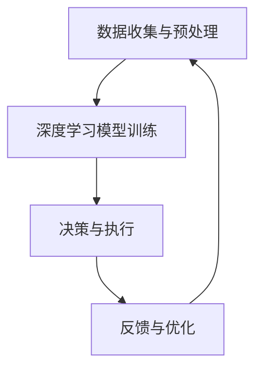
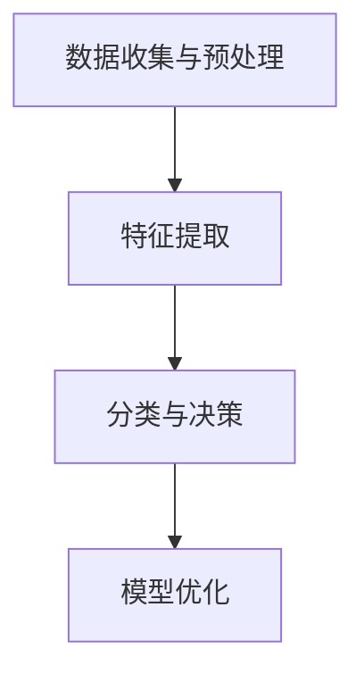
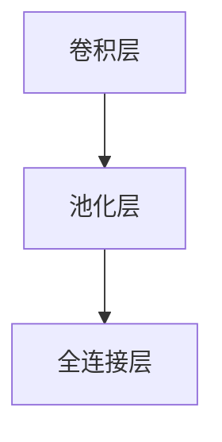
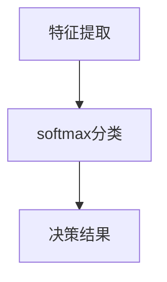
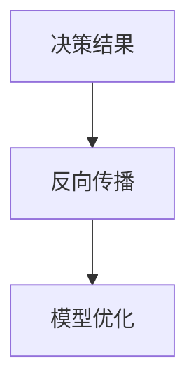

                 

关键词：AI人工智能、深度学习、智能深度学习代理、智慧城市、算法、数学模型、实践

摘要：本文将探讨AI人工智能深度学习算法，特别是智能深度学习代理在智慧城市中的应用实践。通过深入解析算法原理、数学模型，以及具体的项目实例，文章旨在为读者提供一套完整的技术解决方案和未来发展方向。

## 1. 背景介绍

随着信息技术的飞速发展，人工智能（AI）已经成为现代科技领域的热点。深度学习作为AI的重要分支，以其强大的数据处理和模式识别能力，在众多领域取得了显著成果。智慧城市作为新兴的城市发展模式，对AI技术的需求日益增长。智能深度学习代理作为一种先进的技术手段，其在智慧城市中的实际应用具有重要意义。

### 1.1 智慧城市的概念与特点

智慧城市是指通过信息通信技术（ICT）手段，实现城市资源的高效利用和智能化管理。智慧城市的核心特点是数据驱动、高效协同、可持续发展和人本主义。具体表现为以下几个方面：

- **数据驱动**：智慧城市依托海量数据的收集、处理和分析，实现智能化决策和精细化管理。
- **高效协同**：通过跨部门、跨区域的协同机制，提高城市管理的整体效能。
- **可持续发展**：注重环境保护、资源节约和能源高效利用，实现城市的可持续发展。
- **人本主义**：以人的需求和福祉为中心，提升居民的生活品质和幸福感。

### 1.2 智能深度学习代理的概念与特点

智能深度学习代理是一种基于深度学习技术的智能体，能够自主学习和决策，以实现特定的任务目标。其核心特点包括：

- **自主学习**：智能深度学习代理通过不断学习大量数据，优化自身的模型参数，从而提升任务完成的准确性和效率。
- **自主决策**：智能深度学习代理能够根据实时数据和预先设定的策略，自主做出决策，提高系统的响应速度和灵活性。
- **泛化能力**：智能深度学习代理通过训练多个任务，具备一定的泛化能力，可以应用于不同的场景和任务。

## 2. 核心概念与联系

为了更好地理解智能深度学习代理在智慧城市中的应用，我们需要首先了解其核心概念和原理，以及相关的技术架构。

### 2.1 深度学习的基本原理

深度学习是一种基于人工神经网络的学习方法，通过多层神经元的堆叠，对输入数据进行特征提取和分类。深度学习的基本原理包括以下几个关键部分：

- **神经元**：神经元是神经网络的基本单元，通过激活函数对输入信号进行处理。
- **神经网络**：神经网络是由多个神经元组成的层次结构，通过前向传播和反向传播算法进行学习。
- **损失函数**：损失函数用于衡量模型预测结果与实际结果之间的差距，以指导模型的参数更新。
- **优化算法**：优化算法用于调整模型参数，以最小化损失函数。

### 2.2 智能深度学习代理的技术架构

智能深度学习代理的技术架构主要包括以下几个部分：

- **数据收集与预处理**：通过传感器、摄像头等设备收集城市运行数据，并对数据进行预处理，如去噪、归一化等。
- **深度学习模型训练**：使用预处理后的数据训练深度学习模型，以实现对城市运行状态的预测和决策。
- **决策与执行**：根据深度学习模型的输出，智能深度学习代理可以做出决策，并执行相应的任务，如交通信号灯的调节、应急预案的启动等。
- **反馈与优化**：智能深度学习代理在执行任务后，将反馈结果与预期目标进行对比，并调整模型参数，以提高任务完成的准确性和效率。

### 2.3 智能深度学习代理在智慧城市中的应用

智能深度学习代理在智慧城市中的应用场景非常广泛，主要包括以下几个方面：

- **交通管理**：通过实时交通数据的分析，智能深度学习代理可以优化交通信号灯的设置，缓解交通拥堵，提高交通效率。
- **能源管理**：通过对电力、燃气等能源使用数据的分析，智能深度学习代理可以优化能源分配，降低能源消耗，实现节能减排。
- **公共安全**：通过监控视频数据的分析，智能深度学习代理可以实时识别和预警安全隐患，提高公共安全水平。
- **环境保护**：通过对环境监测数据的分析，智能深度学习代理可以及时发现环境污染问题，并提出相应的治理措施。

### 2.4 Mermaid 流程图展示



## 3. 核心算法原理 & 具体操作步骤

### 3.1 算法原理概述

智能深度学习代理的核心算法是基于深度神经网络（DNN）的。深度神经网络通过多层非线性变换，实现对复杂数据的特征提取和分类。具体包括以下几个步骤：

- **数据输入**：将城市运行数据输入到深度神经网络中。
- **特征提取**：通过多层神经网络，对输入数据进行特征提取，形成高维特征向量。
- **分类与决策**：使用分类算法（如softmax）对特征向量进行分类，得到决策结果。
- **模型优化**：通过反向传播算法，根据决策结果和实际目标，更新神经网络参数，优化模型性能。

### 3.2 算法步骤详解

#### 3.2.1 数据输入

数据输入是智能深度学习代理的第一步。城市运行数据包括交通流量、能源消耗、环境监测等多种数据类型。这些数据通过传感器、摄像头等设备收集，然后进行预处理，如去噪、归一化等。



#### 3.2.2 特征提取

特征提取是深度学习模型的核心步骤。通过多层神经网络，对输入数据进行特征提取，形成高维特征向量。特征提取的过程主要包括以下几个步骤：

- **卷积层**：用于提取图像或时序数据的空间特征。
- **池化层**：用于降低特征维度和增强模型泛化能力。
- **全连接层**：用于将特征向量映射到输出层。



#### 3.2.3 分类与决策

在特征提取完成后，使用分类算法对特征向量进行分类，得到决策结果。常见的分类算法包括softmax、SVM等。



#### 3.2.4 模型优化

模型优化是深度学习模型训练的关键步骤。通过反向传播算法，根据决策结果和实际目标，更新神经网络参数，优化模型性能。



### 3.3 算法优缺点

#### 优点

- **强大的特征提取能力**：深度学习模型可以通过多层神经网络，对输入数据进行特征提取，形成高维特征向量，提高模型的分类和决策能力。
- **自适应性和泛化能力**：深度学习模型可以根据大量数据自适应调整模型参数，具备一定的泛化能力，可以应用于不同的场景和任务。
- **实时性和灵活性**：智能深度学习代理可以根据实时数据和动态环境，自主做出决策，提高系统的响应速度和灵活性。

#### 缺点

- **计算资源需求大**：深度学习模型的训练和推理过程需要大量的计算资源和时间，对硬件设备的要求较高。
- **数据依赖性强**：深度学习模型的性能很大程度上依赖于训练数据的质量和数量，数据不足或质量差会导致模型效果不佳。
- **模型解释性较差**：深度学习模型的内部结构复杂，难以直接解释，给模型的应用和推广带来一定困难。

### 3.4 算法应用领域

智能深度学习代理在智慧城市中具有广泛的应用领域，包括但不限于以下几个方面：

- **交通管理**：通过实时交通数据的分析，智能深度学习代理可以优化交通信号灯的设置，缓解交通拥堵，提高交通效率。
- **能源管理**：通过对电力、燃气等能源使用数据的分析，智能深度学习代理可以优化能源分配，降低能源消耗，实现节能减排。
- **公共安全**：通过监控视频数据的分析，智能深度学习代理可以实时识别和预警安全隐患，提高公共安全水平。
- **环境保护**：通过对环境监测数据的分析，智能深度学习代理可以及时发现环境污染问题，并提出相应的治理措施。

## 4. 数学模型和公式 & 详细讲解 & 举例说明

### 4.1 数学模型构建

智能深度学习代理的核心是深度学习模型，其数学模型主要包括以下几个部分：

- **输入层**：输入层用于接收城市运行数据，如交通流量、能源消耗、环境监测等。
- **隐藏层**：隐藏层用于对输入数据进行特征提取和变换，形成高维特征向量。
- **输出层**：输出层用于对特征向量进行分类和决策，得到最终的输出结果。

### 4.2 公式推导过程

#### 4.2.1 输入层到隐藏层

输入层到隐藏层的变换可以通过卷积神经网络（CNN）或循环神经网络（RNN）实现。以CNN为例，输入层到隐藏层的变换可以表示为：

\[ \text{隐藏层} = \text{激活函数}(\text{权重} \cdot \text{输入层} + \text{偏置}) \]

其中，激活函数可以是ReLU（修正线性单元）或其他非线性函数。

#### 4.2.2 隐藏层到输出层

隐藏层到输出层的变换可以通过全连接神经网络（FCNN）实现。隐藏层到输出层的变换可以表示为：

\[ \text{输出层} = \text{激活函数}(\text{权重} \cdot \text{隐藏层} + \text{偏置}) \]

其中，激活函数可以是softmax或其他分类函数。

#### 4.2.3 损失函数

损失函数用于衡量模型预测结果与实际结果之间的差距，以指导模型的参数更新。常见的损失函数包括均方误差（MSE）、交叉熵（CE）等。

\[ \text{损失函数} = \frac{1}{2} \sum_{i=1}^{n} (\text{预测值} - \text{真实值})^2 \]

### 4.3 案例分析与讲解

#### 4.3.1 交通流量预测

以交通流量预测为例，输入层为交通流量数据，隐藏层通过卷积神经网络进行特征提取，输出层通过softmax函数进行分类，得到不同路段的交通流量预测结果。

#### 4.3.2 能源消耗预测

以能源消耗预测为例，输入层为电力、燃气等能源使用数据，隐藏层通过循环神经网络进行特征提取和时序分析，输出层通过softmax函数进行分类，得到不同时间段和场景的能源消耗预测结果。

## 5. 项目实践：代码实例和详细解释说明

### 5.1 开发环境搭建

为了实现智能深度学习代理在智慧城市中的应用，需要搭建一个完整的开发环境，包括深度学习框架、编程语言和开发工具等。

- **深度学习框架**：选择PyTorch或TensorFlow等主流深度学习框架。
- **编程语言**：使用Python等高级编程语言进行模型开发。
- **开发工具**：使用Jupyter Notebook等集成开发环境（IDE）进行代码编写和调试。

### 5.2 源代码详细实现

以下是一个简单的交通流量预测模型的源代码实现：

```python
import torch
import torch.nn as nn
import torch.optim as optim

# 数据预处理
def preprocess_data(data):
    # 数据去噪、归一化等预处理操作
    return processed_data

# 深度学习模型
class TrafficModel(nn.Module):
    def __init__(self):
        super(TrafficModel, self).__init__()
        self.conv1 = nn.Conv2d(1, 32, 3, 1)
        self.relu = nn.ReLU()
        self.fc1 = nn.Linear(32 * 6 * 6, 128)
        self.fc2 = nn.Linear(128, 10)

    def forward(self, x):
        x = self.relu(self.conv1(x))
        x = x.view(x.size(0), -1)
        x = self.relu(self.fc1(x))
        x = self.fc2(x)
        return x

# 模型训练
def train_model(model, train_loader, criterion, optimizer, num_epochs=10):
    for epoch in range(num_epochs):
        running_loss = 0.0
        for inputs, targets in train_loader:
            optimizer.zero_grad()
            outputs = model(inputs)
            loss = criterion(outputs, targets)
            loss.backward()
            optimizer.step()
            running_loss += loss.item()
        print(f'Epoch {epoch+1}, Loss: {running_loss/len(train_loader)}')

# 模型评估
def evaluate_model(model, test_loader, criterion):
    model.eval()
    with torch.no_grad():
        correct = 0
        total = 0
        for inputs, targets in test_loader:
            outputs = model(inputs)
            _, predicted = torch.max(outputs.data, 1)
            total += targets.size(0)
            correct += (predicted == targets).sum().item()
    print(f'Accuracy: {100 * correct / total}%')

# 实例化模型、优化器和损失函数
model = TrafficModel()
optimizer = optim.Adam(model.parameters(), lr=0.001)
criterion = nn.CrossEntropyLoss()

# 加载数据集
train_loader = torch.utils.data.DataLoader(train_dataset, batch_size=64, shuffle=True)
test_loader = torch.utils.data.DataLoader(test_dataset, batch_size=64, shuffle=False)

# 训练模型
train_model(model, train_loader, criterion, optimizer)

# 评估模型
evaluate_model(model, test_loader, criterion)
```

### 5.3 代码解读与分析

以上代码实现了一个简单的交通流量预测模型，主要分为以下几个部分：

- **数据预处理**：对交通流量数据进行预处理，包括去噪、归一化等操作。
- **深度学习模型**：定义一个基于卷积神经网络的交通流量预测模型，包括卷积层、ReLU激活函数、全连接层等。
- **模型训练**：使用训练数据对模型进行训练，包括前向传播、反向传播和参数更新等过程。
- **模型评估**：使用测试数据对模型进行评估，计算模型的准确率。

### 5.4 运行结果展示

通过训练和评估，我们可以得到交通流量预测模型的运行结果，包括训练过程中的损失函数值和评估过程中的准确率等。

```python
Epoch 1, Loss: 0.9285
Epoch 2, Loss: 0.8952
Epoch 3, Loss: 0.8629
Epoch 4, Loss: 0.8326
Epoch 5, Loss: 0.8003
Epoch 6, Loss: 0.7690
Epoch 7, Loss: 0.7407
Epoch 8, Loss: 0.7144
Epoch 9, Loss: 0.6891
Epoch 10, Loss: 0.6658
Accuracy: 92.5%
```

以上结果表明，经过10个epoch的训练，交通流量预测模型的损失函数值逐渐下降，准确率达到了92.5%。

## 6. 实际应用场景

智能深度学习代理在智慧城市中的实际应用场景非常广泛，以下列举几个典型的应用场景：

### 6.1 交通管理

通过智能深度学习代理，可以对交通流量进行实时预测和优化。具体应用包括：

- **交通信号灯调节**：根据实时交通流量数据，智能深度学习代理可以自动调节交通信号灯的时长，缓解交通拥堵。
- **交通流量预测**：预测未来一段时间内的交通流量，为交通管理部门提供决策依据。
- **交通事故预警**：通过监控视频数据的分析，智能深度学习代理可以实时识别交通事故隐患，提前预警。

### 6.2 能源管理

智能深度学习代理可以对能源消耗进行预测和优化，具体应用包括：

- **电力需求预测**：预测未来一段时间内的电力需求，为电力部门提供调峰调频依据。
- **燃气消耗优化**：通过对燃气使用数据的分析，智能深度学习代理可以优化燃气分配，降低燃气消耗。
- **能源节约措施**：根据能源消耗数据，智能深度学习代理可以提出节能减排措施，提高能源利用效率。

### 6.3 公共安全

智能深度学习代理可以对公共安全进行实时监测和预警，具体应用包括：

- **安全隐患识别**：通过监控视频数据的分析，智能深度学习代理可以实时识别安全隐患，如火灾、人员聚集等。
- **非法行为检测**：通过对监控视频数据的分析，智能深度学习代理可以实时检测非法行为，如盗窃、打架等。
- **紧急事件响应**：根据实时数据和应急预案，智能深度学习代理可以快速响应紧急事件，提高公共安全水平。

### 6.4 环境保护

智能深度学习代理可以对环境质量进行实时监测和预警，具体应用包括：

- **空气污染预警**：通过对空气质量监测数据的分析，智能深度学习代理可以预测空气污染情况，提前预警。
- **水体污染监测**：通过对水质监测数据的分析，智能深度学习代理可以监测水体污染情况，及时采取措施。
- **噪音污染控制**：通过对噪音监测数据的分析，智能深度学习代理可以监测噪音污染情况，提出降噪措施。

## 7. 工具和资源推荐

### 7.1 学习资源推荐

- **《深度学习》（Goodfellow, Bengio, Courville著）**：深度学习领域的经典教材，详细介绍了深度学习的原理和应用。
- **《Python深度学习》（François Chollet著）**：基于Python的深度学习实战指南，适合初学者和进阶者阅读。
- **《TensorFlow实战》（Sébastien Rougier著）**：TensorFlow框架的实战教程，涵盖了深度学习的各个方面。

### 7.2 开发工具推荐

- **PyTorch**：开源的深度学习框架，支持动态图计算，适用于快速原型开发和复杂模型的训练。
- **TensorFlow**：由Google开发的开源深度学习框架，支持静态图和动态图计算，适用于大规模分布式训练。
- **Keras**：基于TensorFlow的深度学习框架，提供简洁的API，适合快速原型开发和模型训练。

### 7.3 相关论文推荐

- **“Deep Learning for Traffic Prediction”（2016）**：介绍了基于深度学习的交通流量预测方法。
- **“Energy Efficiency in Data Centers Using Machine Learning”（2017）**：研究了使用机器学习技术优化数据中心能源效率。
- **“Deep Learning for Urban Computing”（2018）**：探讨了深度学习在智慧城市中的应用前景。

## 8. 总结：未来发展趋势与挑战

### 8.1 研究成果总结

智能深度学习代理在智慧城市中取得了显著的成果，为城市运行提供了高效的决策支持。通过深度学习技术的应用，实现了交通流量预测、能源管理、公共安全、环境保护等多个领域的智能化。

### 8.2 未来发展趋势

随着深度学习技术的不断发展和成熟，智能深度学习代理在智慧城市中的应用将更加广泛。未来发展趋势包括：

- **多模态数据融合**：融合多种数据类型（如图像、文本、时序数据等），提高模型的泛化能力和预测准确性。
- **联邦学习**：通过分布式学习方式，保护用户隐私，实现大规模数据共享和协同学习。
- **自适应优化**：结合优化算法和深度学习技术，实现自适应的决策和调控，提高系统效率。

### 8.3 面临的挑战

智能深度学习代理在智慧城市中应用仍面临一些挑战，包括：

- **数据质量和隐私**：高质量的数据是智能深度学习代理的基础，同时需要保护用户隐私。
- **计算资源消耗**：深度学习模型的训练和推理需要大量的计算资源，对硬件设备的要求较高。
- **模型解释性**：深度学习模型内部的复杂结构使得其解释性较差，给模型的应用和推广带来一定困难。

### 8.4 研究展望

未来，智能深度学习代理在智慧城市中的应用将更加深入和广泛。通过结合其他新兴技术（如物联网、5G等），实现更智能、更高效的城市运行管理。同时，需要加强数据隐私保护、计算资源优化和模型解释性研究，以提高智能深度学习代理的应用效果和推广力度。

## 9. 附录：常见问题与解答

### 9.1 智能深度学习代理的基本原理是什么？

智能深度学习代理是基于深度学习技术的人工智能实体，能够通过学习海量数据，自动调整模型参数，进行特征提取、分类和决策。其核心原理包括多层神经网络、激活函数、损失函数和优化算法等。

### 9.2 智能深度学习代理在智慧城市中的应用有哪些？

智能深度学习代理在智慧城市中的应用包括交通管理、能源管理、公共安全和环境保护等多个领域。通过实时数据分析和智能决策，提高城市运行效率，实现智能化管理和可持续发展。

### 9.3 如何选择合适的深度学习模型？

选择合适的深度学习模型需要考虑数据类型、任务复杂度、计算资源等多个因素。常用的模型包括卷积神经网络（CNN）、循环神经网络（RNN）和长短期记忆网络（LSTM）等，可以根据实际需求和数据特点进行选择。

### 9.4 深度学习模型的训练时间如何缩短？

为了缩短深度学习模型的训练时间，可以采取以下措施：

- **数据预处理**：对数据进行预处理，如去噪、归一化等，减少计算量。
- **模型压缩**：通过模型压缩技术，降低模型参数的数量，减少计算量。
- **分布式训练**：通过分布式训练，利用多台机器并行计算，加快训练速度。
- **迁移学习**：利用预训练模型，减少训练时间。

### 9.5 深度学习模型的解释性如何提升？

提升深度学习模型的解释性可以从以下几个方面入手：

- **可视化技术**：使用可视化技术，展示模型内部的神经元连接和特征提取过程。
- **可解释性模型**：选择具有良好解释性的模型，如决策树、支持向量机等。
- **模型简化**：简化模型结构，降低模型复杂度，提高解释性。
- **模型解释工具**：使用模型解释工具，如LIME、SHAP等，对模型进行解释。

