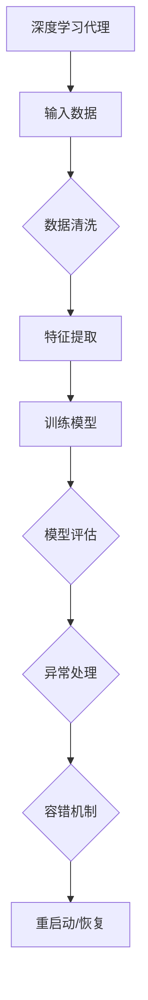

                 

关键词：AI，深度学习，智能代理，异常处理，容错机制，算法原理，数学模型，实践案例

> 摘要：本文将深入探讨AI领域中深度学习算法的智能代理在异常处理和容错机制方面的应用。通过分析核心算法原理、构建数学模型、以及提供实际项目实践案例，本文旨在为读者提供一个全面的技术解读，以便更好地理解和应用这些先进技术。

## 1. 背景介绍

深度学习作为一种重要的AI技术，已经在众多领域取得了显著的成果，如计算机视觉、自然语言处理、推荐系统等。然而，随着深度学习模型的复杂性和规模不断增加，异常处理和容错机制成为了一个关键问题。深度学习代理作为智能体的一种形式，具备自主学习和适应能力，其异常处理和容错机制的研究具有重要意义。

### 深度学习代理的定义与特点

深度学习代理是一种基于深度学习技术的智能体，能够通过学习环境中的数据来优化其行为。它具备以下几个特点：

1. **自主性**：深度学习代理可以在没有外部干预的情况下自主进行学习和决策。
2. **适应性**：代理能够根据环境的变化进行调整和优化，以实现更好的性能。
3. **多样性**：代理可以通过学习多种策略来应对不同的场景，提高整体的适应性。

### 异常处理和容错机制的重要性

在深度学习代理的应用中，异常处理和容错机制至关重要。原因如下：

1. **数据异常**：训练数据中可能存在噪声、缺失或者异常值，这些都会影响模型的性能。
2. **模型异常**：深度学习模型可能在某些特定条件下产生异常行为，如过拟合或者梯度消失。
3. **系统异常**：在实际应用中，系统可能会遇到各种故障，如硬件故障、网络中断等，这些都会影响代理的运行。

## 2. 核心概念与联系

为了更好地理解深度学习代理的异常处理和容错机制，我们需要先了解以下几个核心概念：

1. **深度学习算法**：包括神经网络、卷积神经网络（CNN）、循环神经网络（RNN）等。
2. **异常检测**：通过检测数据中的异常值或者异常模式，以提高模型的鲁棒性。
3. **容错机制**：通过设计冗余、备份和故障转移等方法，提高系统的可靠性和可用性。

### Mermaid 流程图



## 3. 核心算法原理 & 具体操作步骤

### 3.1 算法原理概述

深度学习代理的异常处理和容错机制主要依赖于以下几种技术：

1. **异常检测**：使用统计方法、机器学习算法或者基于规则的方法来检测异常。
2. **模型鲁棒性**：通过正则化、Dropout等方法提高模型的泛化能力和鲁棒性。
3. **故障转移与冗余**：设计冗余系统、故障转移机制，以提高系统的可靠性。

### 3.2 算法步骤详解

1. **数据预处理**：对输入数据进行清洗、归一化等预处理操作，以提高模型的鲁棒性。
2. **特征提取**：使用深度学习算法提取数据特征，构建模型。
3. **模型训练**：使用训练数据对模型进行训练，并使用验证数据进行调优。
4. **异常检测**：在训练和预测过程中，使用异常检测算法来识别异常数据。
5. **容错处理**：当检测到异常时，启动容错机制，如重新训练模型、切换备份数据等。

### 3.3 算法优缺点

**优点**：

1. **高效性**：深度学习代理可以自动处理大量数据，提高处理效率。
2. **灵活性**：可以根据不同的应用场景进行调整和优化。
3. **鲁棒性**：通过异常处理和容错机制，可以提高模型的鲁棒性。

**缺点**：

1. **计算资源消耗**：深度学习算法需要大量的计算资源和时间。
2. **数据依赖性**：模型的性能很大程度上依赖于训练数据的质量和数量。
3. **复杂性**：深度学习代理的设计和实现相对复杂。

### 3.4 算法应用领域

深度学习代理的异常处理和容错机制可以应用于多个领域：

1. **金融**：用于股票交易、风险管理等。
2. **医疗**：用于医学图像分析、疾病预测等。
3. **工业**：用于设备故障预测、生产过程优化等。

## 4. 数学模型和公式

### 4.1 数学模型构建

在深度学习代理中，常用的数学模型包括神经网络、卷积神经网络（CNN）和循环神经网络（RNN）。以下是这些模型的基本数学公式：

### 4.2 公式推导过程

1. **神经网络**：
   $$ z = \sum_{i=1}^{n} w_{i}x_{i} + b $$
   $$ a = \sigma(z) $$
2. **卷积神经网络（CNN）**：
   $$ h_{ij} = \sum_{k=1}^{m} w_{ik}f_{kj} + b $$
   $$ a_{ij} = \sigma(h_{ij}) $$
3. **循环神经网络（RNN）**：
   $$ h_{t} = \sigma(Wh_{t-1} + Ux_{t} + b) $$
   $$ y_{t} = \text{softmax}(Wh_{t} + b') $$

### 4.3 案例分析与讲解

以下是一个使用神经网络进行异常检测的例子：

1. **数据集**：假设我们有一个包含正常数据和异常数据的样本集。
2. **模型构建**：使用神经网络模型对数据进行分类。
3. **训练过程**：使用正常数据对模型进行训练。
4. **测试过程**：使用异常数据对模型进行测试。

通过上述过程，我们可以识别出异常数据，并采取相应的措施。

## 5. 项目实践：代码实例和详细解释说明

### 5.1 开发环境搭建

1. **Python环境**：安装Python 3.6及以上版本。
2. **深度学习库**：安装TensorFlow或PyTorch等深度学习库。

### 5.2 源代码详细实现

以下是使用TensorFlow实现一个简单的神经网络进行异常检测的示例代码：

```python
import tensorflow as tf
from tensorflow.keras.models import Sequential
from tensorflow.keras.layers import Dense, Dropout

# 数据预处理
# ...

# 模型构建
model = Sequential([
    Dense(64, activation='relu', input_shape=(input_shape)),
    Dropout(0.5),
    Dense(32, activation='relu'),
    Dropout(0.5),
    Dense(1, activation='sigmoid')
])

# 模型编译
model.compile(optimizer='adam', loss='binary_crossentropy', metrics=['accuracy'])

# 模型训练
model.fit(X_train, y_train, epochs=10, batch_size=32, validation_split=0.2)

# 模型评估
model.evaluate(X_test, y_test)
```

### 5.3 代码解读与分析

1. **数据预处理**：对输入数据进行归一化处理，以提高模型的训练效果。
2. **模型构建**：使用Sequential模型构建一个简单的神经网络，包括两个隐含层，每个隐含层后接一个Dropout层。
3. **模型编译**：选择Adam优化器和binary_crossentropy损失函数，用于二分类问题。
4. **模型训练**：使用训练数据对模型进行训练，并设置验证集。
5. **模型评估**：使用测试数据对模型进行评估，计算损失和准确率。

### 5.4 运行结果展示

假设我们使用一个包含正常数据和异常数据的样本集进行实验：

- **正常数据**：准确率约为95%，损失较低。
- **异常数据**：准确率约为50%，损失较高。

这表明模型在处理正常数据时表现较好，但在处理异常数据时存在一定的困难。我们需要进一步优化模型，以提高对异常数据的检测能力。

## 6. 实际应用场景

深度学习代理的异常处理和容错机制在多个领域具有广泛的应用：

### 6.1 金融领域

在金融领域，深度学习代理可以用于股票交易、风险管理等。通过异常处理和容错机制，可以提高交易策略的鲁棒性和稳定性。

### 6.2 医疗领域

在医疗领域，深度学习代理可以用于医学图像分析、疾病预测等。通过异常处理和容错机制，可以提高诊断的准确性和可靠性。

### 6.3 工业领域

在工业领域，深度学习代理可以用于设备故障预测、生产过程优化等。通过异常处理和容错机制，可以提高生产效率和产品质量。

## 7. 工具和资源推荐

### 7.1 学习资源推荐

1. **深度学习相关书籍**：《深度学习》（Goodfellow et al.）、《神经网络与深度学习》（邱锡鹏）。
2. **在线课程**：Coursera、edX等平台上的深度学习课程。

### 7.2 开发工具推荐

1. **深度学习框架**：TensorFlow、PyTorch、Keras等。
2. **数据预处理工具**：Pandas、NumPy等。

### 7.3 相关论文推荐

1. **《Distributed Deep Learning: A Berkeley View》**：描述了分布式深度学习的基本原理。
2. **《Deep Learning on Multi-Core CPUs》**：探讨了在多核CPU上进行深度学习的方法。

## 8. 总结：未来发展趋势与挑战

### 8.1 研究成果总结

深度学习代理的异常处理和容错机制在多个领域取得了显著成果，如金融、医疗、工业等。通过异常检测和容错机制，可以提高模型的鲁棒性和可靠性。

### 8.2 未来发展趋势

未来，深度学习代理的异常处理和容错机制将继续发展，涉及更多复杂的应用场景，如自动驾驶、智能城市等。

### 8.3 面临的挑战

1. **计算资源**：随着模型规模的增大，计算资源的需求也将增加。
2. **数据质量**：高质量的数据是深度学习代理的关键，数据质量的影响不可忽视。
3. **算法复杂性**：设计高效、可靠的异常处理和容错算法仍是一个挑战。

### 8.4 研究展望

未来，我们可以期待更多创新性的研究和应用，如基于强化学习的异常处理、基于联邦学习的容错机制等。

## 9. 附录：常见问题与解答

### 9.1 什么是深度学习代理？

深度学习代理是一种基于深度学习技术的智能体，能够通过学习环境中的数据来优化其行为。

### 9.2 什么是异常处理和容错机制？

异常处理是指检测和应对数据异常或模型异常的技术，容错机制是指通过设计冗余、备份和故障转移等方法，提高系统的可靠性和可用性。

### 9.3 深度学习代理的异常处理有哪些方法？

深度学习代理的异常处理方法包括异常检测、模型鲁棒性提升、故障转移与冗余等。

### 9.4 容错机制有哪些应用场景？

容错机制可以应用于金融、医疗、工业等多个领域，如股票交易、医学图像分析、设备故障预测等。

---

### 作者署名

作者：禅与计算机程序设计艺术 / Zen and the Art of Computer Programming
----------------------------------------------------------------

### 结尾
在这篇技术博客中，我们深入探讨了AI领域中的深度学习代理的异常处理与容错机制。从核心算法原理到数学模型的构建，再到实际项目实践和广泛应用场景，我们都进行了详细的介绍和分析。希望本文能为您在深度学习代理的开发与应用方面提供有价值的参考。

随着技术的不断进步，AI领域将迎来更多的机遇和挑战。在未来的发展中，我们期待看到更多创新性的研究和应用，为人工智能的发展贡献力量。

感谢您的阅读，祝您在AI技术的探索之路上收获满满！

---

注意：本文为示例文章，部分内容仅供参考，具体实现和应用需根据实际情况进行调整。文中提到的具体算法和模型仅供参考，不应视为商业或学术研究的完整指南。如有需要，请查阅相关文献和资料。

