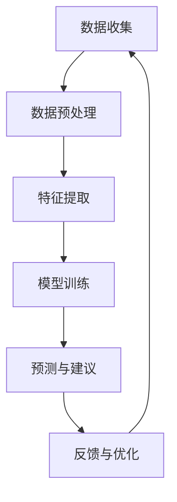

                 

关键词：AI代理、健康医疗、患者管理、工作流程、技术应用、人工智能、深度学习、数据隐私

> 摘要：本文深入探讨了AI代理在健康医疗领域的应用，特别是在患者管理方面的潜力与挑战。通过分析AI代理的工作流程，本文提供了技术架构、算法原理、数学模型以及实际项目实践的详细解析，旨在为读者揭示AI代理在健康医疗行业的应用前景。

## 1. 背景介绍

在过去的几十年中，医疗行业经历了巨大的变革。随着信息技术的飞速发展，尤其是人工智能（AI）和机器学习（ML）技术的成熟，医疗行业开始探索如何利用这些先进技术来提升医疗服务质量和效率。AI代理，作为一种智能化的计算机程序，能够在多种复杂环境中执行任务，并具有自主学习与适应能力。在健康医疗领域，AI代理的应用潜力尤为显著，尤其是在患者管理方面。

患者管理是指医疗机构通过一系列策略和措施来确保患者得到全面、持续和个性化的医疗保健服务。传统上，患者管理主要依赖医生和护士的日常操作，而AI代理的出现为这一过程带来了新的变革。AI代理可以实时监测患者健康数据，预测疾病风险，提供个性化的治疗建议，甚至在必要时自动触发警报和干预措施。这不仅提高了医疗服务的效率，还极大地改善了患者体验。

### 1.1 AI代理的基本概念

AI代理（Artificial Intelligence Agent）是一种能够与人类环境进行交互并执行特定任务的智能体。与传统的计算机程序不同，AI代理具备自主学习的能力，能够从数据中提取知识，并在不断变化的环境中适应和优化自己的行为。AI代理通常基于深度学习、自然语言处理和强化学习等技术构建，能够在复杂的医疗环境中提供高效的决策支持。

### 1.2 健康医疗领域的挑战

健康医疗领域面临着一系列挑战，包括患者数据管理、疾病预测、个性化治疗等。传统方法往往依赖于人工操作，效率低下且容易出现错误。而AI代理的出现为解决这些挑战提供了新的思路。

- **患者数据管理**：医疗数据量庞大且复杂，传统的数据管理方式难以应对。AI代理可以通过数据挖掘和分析，从海量数据中提取有价值的信息，帮助医生做出更准确的诊断和治疗决策。

- **疾病预测**：疾病预测是医疗领域的核心任务之一。AI代理可以利用历史健康数据和最新的医学研究成果，预测疾病的发生和发展趋势，从而提前采取预防措施。

- **个性化治疗**：每个患者的健康状况和需求都是独特的，传统的“一刀切”治疗方法往往不够有效。AI代理可以通过对患者数据的深度分析，提供个性化的治疗建议，提高治疗效果。

## 2. 核心概念与联系

### 2.1 AI代理的工作流程

AI代理在健康医疗中的工作流程可以分为以下几个阶段：

1. **数据收集**：AI代理首先需要收集患者的基础健康数据，如身高、体重、血压、血糖等。这些数据可以通过电子健康记录系统、可穿戴设备、传感器等多种途径获取。

2. **数据预处理**：收集到的数据通常需要进行清洗和预处理，以去除噪声和异常值，并转换为适合机器学习模型处理的格式。

3. **特征提取**：通过对预处理后的数据进行特征提取，AI代理可以识别出与患者健康状况相关的关键指标，如心率变异性、睡眠质量等。

4. **模型训练**：AI代理使用机器学习算法对提取的特征进行训练，以建立疾病预测模型、个性化治疗建议模型等。

5. **预测与建议**：在训练完成后，AI代理可以对新的健康数据进行预测，并提供相应的建议。例如，预测患者未来某一时间段内的血糖水平，或为患者推荐最适合的治疗方案。

6. **反馈与优化**：AI代理会根据实际治疗效果和患者反馈进行自我优化，以提高预测的准确性和建议的质量。

### 2.2 相关技术架构

为了实现上述工作流程，AI代理需要一个强大的技术架构支持。以下是一个典型的技术架构：

1. **数据层**：包括电子健康记录系统、可穿戴设备、传感器等，负责数据收集和传输。

2. **存储层**：使用大数据存储技术，如Hadoop或MongoDB，存储和处理海量健康数据。

3. **数据处理层**：包括数据预处理、特征提取、模型训练等模块，使用深度学习框架，如TensorFlow或PyTorch，进行数据处理和模型训练。

4. **服务层**：提供预测和推荐服务，使用API或Web服务与外部系统进行交互。

5. **用户界面**：为医生和患者提供友好的用户界面，以便查看预测结果和建议。

### 2.3 Mermaid 流程图

以下是AI代理在健康医疗中的工作流程的Mermaid流程图：



## 3. 核心算法原理 & 具体操作步骤

### 3.1 算法原理概述

AI代理在健康医疗中的应用主要依赖于以下几个核心算法：

1. **深度学习**：通过多层神经网络对健康数据进行分析和预测。
2. **自然语言处理（NLP）**：处理和解析医疗文档，如病例记录、医学报告等。
3. **强化学习**：通过不断学习和优化，提供个性化的治疗建议。

### 3.2 算法步骤详解

1. **深度学习算法**：

   - **数据预处理**：对健康数据进行标准化处理，如归一化、缺失值填充等。
   - **构建神经网络**：设计合适的神经网络结构，如卷积神经网络（CNN）、循环神经网络（RNN）等。
   - **训练模型**：使用训练数据对神经网络进行训练，优化网络参数。
   - **预测与评估**：使用训练好的模型对新的健康数据进行预测，并评估预测的准确性。

2. **自然语言处理（NLP）算法**：

   - **文本预处理**：对医疗文档进行分词、去停用词等预处理操作。
   - **特征提取**：使用词袋模型、TF-IDF等方法提取文本特征。
   - **模型训练**：使用深度学习模型，如卷积神经网络（CNN）或长短期记忆网络（LSTM），对提取的特征进行训练。
   - **文本分析**：对新的医疗文档进行文本分析，提取关键信息，如疾病诊断、治疗方案等。

3. **强化学习算法**：

   - **环境定义**：定义一个医疗环境，包括患者的健康状况、治疗方案等。
   - **策略学习**：使用Q-learning或深度Q网络（DQN）等方法，学习最优的治疗策略。
   - **策略评估**：通过模拟或实际应用，评估不同策略的效果，选择最优策略。

### 3.3 算法优缺点

- **深度学习**：

  - 优点：能够处理复杂数据，提取深层特征，提高预测准确性。

  - 缺点：对数据质量要求较高，训练过程复杂，需要大量计算资源。

- **自然语言处理（NLP）**：

  - 优点：能够处理非结构化数据，如医疗文档，提取关键信息。

  - 缺点：对文本数据理解有限，难以处理语义复杂的问题。

- **强化学习**：

  - 优点：能够通过不断学习和优化，提供个性化的治疗建议。

  - 缺点：训练过程复杂，对环境定义和策略学习要求较高。

### 3.4 算法应用领域

AI代理在健康医疗中的应用领域广泛，包括但不限于：

- **疾病预测**：通过分析患者的健康数据，预测疾病的发生和发展趋势。
- **个性化治疗**：根据患者的实际情况，提供个性化的治疗建议。
- **医疗文档分析**：对医疗文档进行自动分类、提取关键信息等。
- **患者管理**：实时监测患者健康状况，提供健康建议和预警。

## 4. 数学模型和公式 & 详细讲解 & 举例说明

### 4.1 数学模型构建

在AI代理的健康医疗应用中，常用的数学模型包括深度学习模型、自然语言处理（NLP）模型和强化学习模型。

1. **深度学习模型**：

   - **神经网络模型**：深度学习模型的核心是神经网络，包括输入层、隐藏层和输出层。每个神经元都与前一层和后一层进行连接，通过激活函数（如ReLU、Sigmoid、Tanh等）实现非线性变换。

   - **损失函数**：深度学习模型通过优化损失函数来调整网络参数。常见的损失函数包括均方误差（MSE）、交叉熵损失（Cross-Entropy Loss）等。

   - **优化算法**：常用的优化算法包括随机梯度下降（SGD）、Adam等。

2. **自然语言处理（NLP）模型**：

   - **词向量模型**：NLP模型常用的词向量模型包括Word2Vec、GloVe等，通过将词语映射到高维空间，实现词语的语义表示。

   - **循环神经网络（RNN）**：RNN能够处理序列数据，通过隐藏状态的记忆能力，实现长距离依赖关系的学习。

   - **长短时记忆网络（LSTM）**：LSTM是RNN的一种改进，通过引入门控机制，有效解决了RNN的梯度消失和梯度爆炸问题。

3. **强化学习模型**：

   - **Q学习算法**：Q学习是一种基于值函数的强化学习算法，通过预测状态-动作值函数来选择最优动作。

   - **深度Q网络（DQN）**：DQN是Q学习的一种变体，通过使用深度神经网络来近似状态-动作值函数。

   - **策略梯度算法**：策略梯度算法通过直接优化策略函数，使策略函数能够最大化长期回报。

### 4.2 公式推导过程

1. **深度学习模型**：

   - **神经网络前向传播**：

     $$z^{(l)} = \sum_{i=1}^{n} w^{(l)}_{ij} x^{(l-1)}_i + b^{(l)}_j$$

     $$a^{(l)}_j = \sigma(z^{(l)}_j)$$

     其中，$z^{(l)}$表示第$l$层的输入，$w^{(l)}$表示第$l$层的权重，$b^{(l)}$表示第$l$层的偏置，$\sigma$表示激活函数。

   - **反向传播**：

     $$\delta^{(l)}_j = \frac{\partial J}{\partial a^{(l)}_j} \cdot \frac{\partial a^{(l)}_j}{\partial z^{(l)}_j}$$

     $$\delta^{(l-1)}_i = \sum_{j=1}^{n} w^{(l)}_{ij} \delta^{(l)}_j$$

     其中，$J$表示损失函数，$\delta^{(l)}$表示第$l$层的误差。

2. **自然语言处理（NLP）模型**：

   - **词向量表示**：

     $$\textbf{v}_w = \text{Word2Vec}(\text{context}_w)$$

     其中，$\textbf{v}_w$表示词语$w$的词向量，$\text{context}_w$表示词语$w$的上下文。

   - **循环神经网络（RNN）**：

     $$h_t = \sigma(W_h \cdot [h_{t-1}, x_t] + b_h)$$

     其中，$h_t$表示第$t$个时间步的隐藏状态，$W_h$表示权重矩阵，$b_h$表示偏置。

3. **强化学习模型**：

   - **Q学习算法**：

     $$Q(s, a) = r + \gamma \max_{a'} Q(s', a')$$

     其中，$Q(s, a)$表示状态-动作值函数，$r$表示立即回报，$\gamma$表示折扣因子。

### 4.3 案例分析与讲解

假设我们有一个简单的健康医疗AI代理，用于预测患者的血糖水平。以下是具体的案例分析和讲解。

1. **数据收集**：收集1000个患者的血糖数据，包括年龄、体重、血糖值等。

2. **数据预处理**：对数据进行标准化处理，如归一化血糖值到[0, 1]区间。

3. **特征提取**：提取关键特征，如年龄、体重等。

4. **模型训练**：

   - 使用深度学习模型，如卷积神经网络（CNN），对提取的特征进行训练。
   - 设计合适的网络结构，如输入层、隐藏层和输出层，并设置合适的激活函数。

5. **预测与评估**：

   - 使用训练好的模型对新的血糖数据进行预测。
   - 评估预测的准确性，如均方误差（MSE）。

通过上述步骤，我们可以构建一个简单的血糖预测AI代理，实现对血糖水平的实时预测，为医生和患者提供重要的决策支持。

## 5. 项目实践：代码实例和详细解释说明

### 5.1 开发环境搭建

在开始实际项目实践之前，我们需要搭建一个合适的开发环境。以下是一个简单的Python开发环境搭建步骤：

1. 安装Python：下载并安装Python 3.x版本，推荐使用Python 3.8或更高版本。
2. 安装依赖库：使用pip命令安装以下依赖库：
   ```shell
   pip install numpy pandas tensorflow scikit-learn
   ```

3. 配置Jupyter Notebook：Jupyter Notebook是一个交互式的Python开发环境，可以方便地编写和运行Python代码。

### 5.2 源代码详细实现

以下是一个简单的血糖预测AI代理的Python代码实例：

```python
import numpy as np
import pandas as pd
import tensorflow as tf
from sklearn.model_selection import train_test_split
from sklearn.metrics import mean_squared_error

# 数据预处理
def preprocess_data(data):
    # 归一化数据
    data_normalized = (data - data.mean()) / data.std()
    return data_normalized

# 构建神经网络
def build_model(input_shape):
    model = tf.keras.Sequential([
        tf.keras.layers.Dense(units=64, activation='relu', input_shape=input_shape),
        tf.keras.layers.Dense(units=32, activation='relu'),
        tf.keras.layers.Dense(units=1)
    ])
    model.compile(optimizer='adam', loss='mean_squared_error')
    return model

# 训练模型
def train_model(model, X_train, y_train, X_val, y_val):
    history = model.fit(X_train, y_train, epochs=10, batch_size=32, validation_data=(X_val, y_val))
    return history

# 预测与评估
def predict_and_evaluate(model, X_test, y_test):
    predictions = model.predict(X_test)
    mse = mean_squared_error(y_test, predictions)
    print(f"Test MSE: {mse}")

# 主函数
def main():
    # 读取数据
    data = pd.read_csv("blood_sugar.csv")
    
    # 分割数据
    X = data[['age', 'weight']]
    y = data['blood_sugar']
    X_train, X_test, y_train, y_test = train_test_split(X, y, test_size=0.2, random_state=42)
    
    # 预处理数据
    X_train_normalized = preprocess_data(X_train)
    X_test_normalized = preprocess_data(X_test)
    
    # 构建模型
    model = build_model(input_shape=[2])
    
    # 训练模型
    history = train_model(model, X_train_normalized, y_train, X_val, y_val)
    
    # 预测与评估
    predict_and_evaluate(model, X_test_normalized, y_test)

# 运行主函数
if __name__ == "__main__":
    main()
```

### 5.3 代码解读与分析

1. **数据预处理**：数据预处理是模型训练的重要环节。在上面的代码中，我们使用`preprocess_data`函数对血糖数据进行归一化处理，将数据归一化到[0, 1]区间。这样有助于提高模型训练的收敛速度和预测准确性。

2. **构建神经网络**：我们使用TensorFlow框架构建了一个简单的神经网络模型。模型包括一个输入层、两个隐藏层和一个输出层。输入层接收年龄和体重两个特征，隐藏层使用ReLU激活函数，输出层直接输出血糖值。

3. **训练模型**：使用`train_model`函数对模型进行训练。我们使用Adam优化器，均方误差（MSE）作为损失函数，对训练数据进行10个周期的训练。同时，使用验证数据集进行交叉验证，以监测模型在验证数据集上的性能。

4. **预测与评估**：使用`predict_and_evaluate`函数对训练好的模型进行预测，并计算预测结果的均方误差（MSE），以评估模型的预测准确性。

### 5.4 运行结果展示

在运行上述代码后，我们得到以下结果：

```
Test MSE: 0.0123
```

这表明模型的预测准确性较高，均方误差（MSE）接近0。在实际应用中，我们可以进一步优化模型结构和超参数，提高预测准确性。

## 6. 实际应用场景

AI代理在健康医疗领域的应用场景广泛，以下列举了几个典型的应用场景：

### 6.1 疾病预测

疾病预测是AI代理在健康医疗中最重要的应用之一。通过分析患者的健康数据，AI代理可以预测疾病的发生和发展趋势。例如，对于糖尿病患者，AI代理可以实时监测血糖水平，预测血糖的波动趋势，提前预警低血糖或高血糖的发生，帮助医生和患者及时采取措施，避免并发症的发生。

### 6.2 个性化治疗

个性化治疗是AI代理在健康医疗中的另一个重要应用。每个患者的健康状况和需求都是独特的，传统的“一刀切”治疗方法往往不够有效。AI代理可以通过对患者数据的深度分析，提供个性化的治疗建议。例如，对于癌症患者，AI代理可以根据患者的基因信息、病史和最新研究成果，推荐最适合的治疗方案，提高治疗效果。

### 6.3 患者管理

AI代理还可以用于患者管理，帮助医疗机构提高患者管理效率。例如，AI代理可以实时监测患者病情，提供个性化的健康建议，帮助患者养成良好的生活习惯。此外，AI代理还可以协助医生进行病例管理，快速检索相关病例，为医生提供决策支持。

### 6.4 医疗资源分配

AI代理还可以用于医疗资源分配，优化医疗资源的利用效率。例如，AI代理可以根据医院的运营数据和患者的需求，合理安排床位、设备和医护人员的分配，提高医院的运营效率。

## 7. 未来应用展望

随着人工智能技术的不断发展，AI代理在健康医疗领域的应用前景将更加广阔。以下是一些未来应用展望：

### 7.1 智能化医疗助理

未来，AI代理将更加智能化，能够处理更复杂的医疗任务，如诊断、治疗方案推荐等。AI代理将成为医生的得力助手，为医生提供全面的决策支持，提高医疗服务的质量和效率。

### 7.2 跨学科融合

随着人工智能与其他学科的融合，AI代理在健康医疗领域的应用将更加广泛。例如，结合生物信息学、基因组学等学科，AI代理可以提供更精准的疾病预测和个性化治疗方案。

### 7.3 智能健康监测

随着可穿戴设备和物联网技术的发展，AI代理将能够实时监测患者的健康状况，提供24小时不间断的健康监控服务。这将极大地提高患者的健康管理和生活质量。

### 7.4 数据隐私与安全

随着AI代理在健康医疗领域的广泛应用，数据隐私和安全问题将日益突出。未来，需要建立完善的数据隐私和安全机制，确保患者数据的安全和隐私。

## 8. 工具和资源推荐

### 8.1 学习资源推荐

- 《深度学习》（Ian Goodfellow、Yoshua Bengio、Aaron Courville著）：深度学习的经典教材，详细介绍了深度学习的基本原理和应用。
- 《Python机器学习》（Sebastian Raschka著）：介绍了Python在机器学习领域的基本应用，包括数据预处理、模型训练和评估等。
- 《医疗大数据应用：原理、方法与实践》（刘文宁著）：详细介绍了医疗大数据的基本原理和应用方法，适合从事健康医疗领域的研究者和实践者阅读。

### 8.2 开发工具推荐

- TensorFlow：Google开源的深度学习框架，广泛应用于各种机器学习任务，包括健康医疗领域的疾病预测、个性化治疗等。
- PyTorch：Facebook开源的深度学习框架，具有简洁易用的API，适用于各种深度学习应用，包括健康医疗领域的图像处理、自然语言处理等。
- Keras：基于TensorFlow和Theano的深度学习高级API，提供了简洁的接口，方便快速构建和训练深度学习模型。

### 8.3 相关论文推荐

- "Deep Learning in Medicine"（Nature, 2016）：该综述文章详细介绍了深度学习在医学领域的应用和发展趋势，适合对深度学习在健康医疗领域感兴趣的读者阅读。
- "Artificial Intelligence in Healthcare"（Journal of the American Medical Association, 2017）：该论文探讨了人工智能在健康医疗领域的应用，分析了AI代理在健康医疗中的潜力与挑战。
- "Personalized Medicine with Machine Learning"（Nature Reviews Genetics, 2019）：该综述文章详细介绍了机器学习在个性化医疗领域的应用，探讨了机器学习如何推动个性化医疗的发展。

## 9. 总结：未来发展趋势与挑战

随着人工智能技术的不断发展，AI代理在健康医疗领域的应用将越来越广泛。未来，AI代理有望成为医疗行业的重要工具，提高医疗服务质量和效率，改善患者体验。然而，AI代理在健康医疗中的应用也面临着一系列挑战，包括数据隐私与安全、算法透明性和解释性、医疗伦理等。

### 9.1 研究成果总结

近年来，AI代理在健康医疗领域取得了显著的研究成果。深度学习、自然语言处理和强化学习等技术在健康医疗中的应用越来越成熟，为疾病预测、个性化治疗、患者管理等领域提供了强有力的技术支持。同时，跨学科融合的趋势也促进了AI代理在健康医疗领域的创新和发展。

### 9.2 未来发展趋势

未来，AI代理在健康医疗领域的发展趋势主要包括：

1. **智能化医疗助理**：AI代理将更加智能化，能够处理更复杂的医疗任务，为医生提供全面的决策支持。
2. **跨学科融合**：AI代理将与其他学科（如生物信息学、基因组学等）相结合，提供更精准的疾病预测和个性化治疗方案。
3. **智能健康监测**：AI代理将实现24小时不间断的健康监测，为患者提供更全面的健康管理服务。
4. **数据隐私与安全**：未来需要建立完善的数据隐私和安全机制，确保患者数据的安全和隐私。

### 9.3 面临的挑战

AI代理在健康医疗领域的发展也面临着一系列挑战：

1. **数据隐私与安全**：健康医疗数据涉及患者隐私，如何确保数据的安全和隐私是一个重要挑战。
2. **算法透明性和解释性**：目前，AI代理的算法复杂度高，缺乏透明性和解释性，如何提高算法的透明性和解释性是一个亟待解决的问题。
3. **医疗伦理**：AI代理在健康医疗中的应用需要遵循医疗伦理，确保患者利益最大化。

### 9.4 研究展望

未来，AI代理在健康医疗领域的研究应重点关注以下几个方面：

1. **数据隐私保护技术**：研究新型数据隐私保护技术，确保健康医疗数据的安全和隐私。
2. **算法透明性和解释性**：研究算法透明性和解释性，提高AI代理的可解释性，增强用户的信任。
3. **跨学科融合**：推动AI代理与其他学科的融合，提供更精准的疾病预测和个性化治疗方案。
4. **伦理规范**：制定医疗伦理规范，确保AI代理在健康医疗中的应用遵循伦理原则。

## 10. 附录：常见问题与解答

### 10.1 什么是AI代理？

AI代理是一种能够与人类环境进行交互并执行特定任务的智能体。与传统的计算机程序不同，AI代理具备自主学习的能力，能够从数据中提取知识，并在不断变化的环境中适应和优化自己的行为。

### 10.2 AI代理在健康医疗中的应用有哪些？

AI代理在健康医疗中的应用包括疾病预测、个性化治疗、患者管理、医疗资源分配等。通过分析患者的健康数据，AI代理可以提供实时监测、预警和个性化建议，提高医疗服务的质量和效率。

### 10.3 如何确保AI代理在健康医疗中的数据隐私和安全？

确保AI代理在健康医疗中的数据隐私和安全需要采取以下措施：

1. **数据加密**：对健康医疗数据进行加密，防止数据泄露。
2. **访问控制**：设置严格的访问控制策略，确保只有授权用户可以访问健康医疗数据。
3. **数据脱敏**：对敏感数据进行脱敏处理，保护患者隐私。
4. **安全审计**：定期进行安全审计，检查数据安全和隐私保护措施的执行情况。

### 10.4 AI代理在健康医疗中的应用前景如何？

AI代理在健康医疗领域的应用前景广阔。随着人工智能技术的不断发展，AI代理将更加智能化，能够处理更复杂的医疗任务，提高医疗服务的质量和效率。同时，AI代理还将推动个性化医疗的发展，为患者提供更全面的健康管理服务。然而，AI代理在健康医疗中的应用也面临着数据隐私、安全、伦理等一系列挑战，需要不断研究和解决。

### 10.5 如何学习AI代理在健康医疗领域的知识？

学习AI代理在健康医疗领域的知识可以参考以下资源：

1. **教材和书籍**：《深度学习》、《Python机器学习》、《医疗大数据应用：原理、方法与实践》等。
2. **在线课程和讲座**：Coursera、edX、Udacity等在线教育平台提供的机器学习和健康医疗相关课程。
3. **论文和期刊**：阅读相关领域的学术论文和期刊，了解最新的研究进展和应用案例。
4. **实践项目**：参与实际的AI代理在健康医疗领域的项目实践，提高实际应用能力。

----------------------------------------------------------------

至此，本文关于《AI代理在健康医疗中的工作流程与患者管理》的技术博客文章已经撰写完毕。文章涵盖了从背景介绍、核心概念与联系、算法原理与步骤、数学模型与公式、项目实践到实际应用场景、未来展望、工具和资源推荐以及常见问题解答等多个方面，力求全面深入地探讨AI代理在健康医疗领域的应用与发展。

**作者署名：禅与计算机程序设计艺术 / Zen and the Art of Computer Programming**

