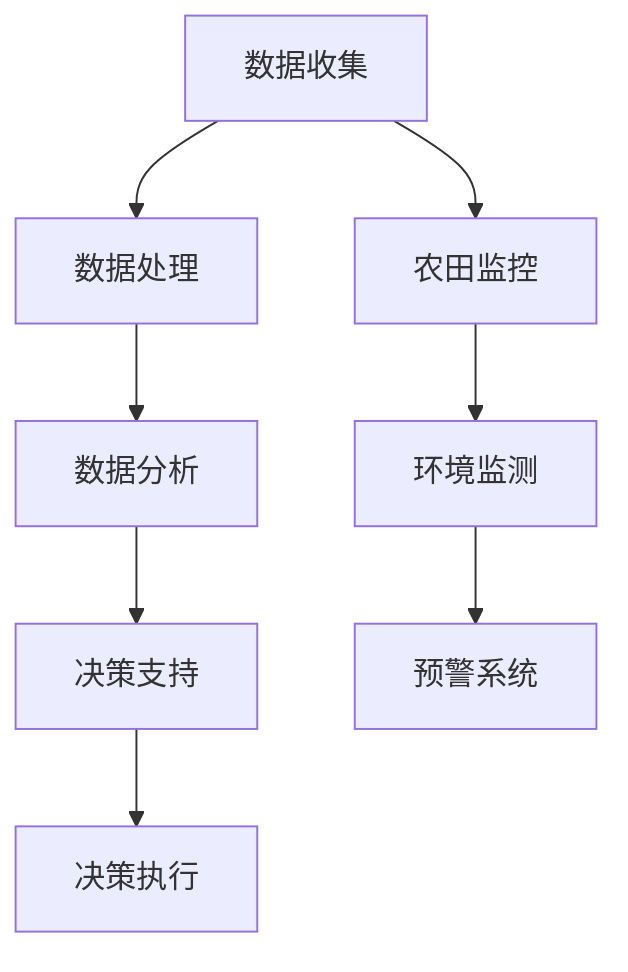

                 

关键词：智慧农业、AI代理、工作流、决策支持、技术架构

> 摘要：本文探讨了AI代理在智慧农业中的应用，详细描述了其工作流与决策支持系统的构建，分析了AI代理在不同环节中的具体功能，并探讨了未来智慧农业的发展趋势与挑战。

## 1. 背景介绍

### 智慧农业的发展背景

随着全球人口的快速增长和气候变化带来的挑战，传统农业面临着生产效率低、资源利用率低、环境污染等问题。为了解决这些问题，智慧农业作为现代农业的重要发展方向，应运而生。智慧农业通过引入物联网、大数据、云计算、人工智能等技术，实现对农业生产过程的实时监控、精准管理和智能化决策，从而提高农业生产效率，减少资源浪费，保障粮食安全。

### AI代理在智慧农业中的应用现状

AI代理在智慧农业中的应用已经取得了显著的成果。例如，无人机遥感技术用于农作物健康状况监测，物联网设备用于农田环境参数实时监测，智能灌溉系统根据土壤湿度自动调整灌溉量等。然而，AI代理在智慧农业中的工作流与决策支持系统的构建仍存在许多挑战，需要进一步研究和优化。

## 2. 核心概念与联系

为了更好地理解AI代理在智慧农业中的应用，首先需要了解几个核心概念，包括人工智能、代理、工作流和决策支持系统。以下是这些概念的定义和它们在智慧农业中的应用关系：

### 2.1 人工智能

人工智能（Artificial Intelligence，AI）是指由计算机实现的模拟人类智能的技术。在智慧农业中，人工智能可以用于农作物识别、病虫害检测、土壤分析等。

### 2.2 代理

代理（Agent）是具有自主行为、能够感知环境并做出决策的实体。在智慧农业中，AI代理可以是一个软件程序，它可以自主地监控农田环境、分析数据、给出决策建议。

### 2.3 工作流

工作流（Workflow）是指一组相互关联的任务，它们共同完成一个特定的业务目标。在智慧农业中，工作流可以包括数据收集、处理、分析和决策等步骤。

### 2.4 决策支持系统

决策支持系统（Decision Support System，DSS）是一种辅助决策者进行决策的计算机系统。在智慧农业中，DSS可以帮助农民或农业专家根据实时数据和历史经验，做出最优的农业生产决策。


图1：AI代理在智慧农业中的应用关系

### 2.5 Mermaid流程图

以下是一个Mermaid流程图，展示了AI代理在智慧农业中的工作流：



## 3. 核心算法原理 & 具体操作步骤

### 3.1 算法原理概述

AI代理在智慧农业中主要基于机器学习和深度学习算法进行数据分析和决策。这些算法包括：

- **机器学习算法**：如支持向量机（SVM）、决策树、随机森林等，用于分类和回归任务。
- **深度学习算法**：如卷积神经网络（CNN）、循环神经网络（RNN）、生成对抗网络（GAN）等，用于复杂的数据分析和图像处理。

### 3.2 算法步骤详解

AI代理在智慧农业中的算法步骤通常包括以下几步：

1. **数据收集**：通过传感器、无人机、物联网设备等收集农田环境数据。
2. **数据处理**：对收集到的数据进行清洗、归一化等预处理。
3. **数据建模**：使用机器学习和深度学习算法建立模型。
4. **模型训练**：使用历史数据对模型进行训练。
5. **模型评估**：使用验证集对模型进行评估。
6. **模型部署**：将训练好的模型部署到AI代理系统中。
7. **决策支持**：AI代理根据实时数据和模型预测，给出决策建议。
8. **决策执行**：用户或自动化系统根据决策建议执行具体操作。

### 3.3 算法优缺点

- **优点**：
  - 提高农业生产效率。
  - 减少资源浪费。
  - 提高农产品质量。
- **缺点**：
  - 数据质量和数量要求高。
  - 模型训练和部署成本高。
  - 对农民的技能要求较高。

### 3.4 算法应用领域

AI代理在智慧农业中的应用领域包括：

- **农作物病虫害监测**：通过图像识别技术，自动识别病虫害。
- **土壤分析**：通过传感器数据，分析土壤的养分、水分等参数。
- **气象预测**：通过历史数据和模型预测，提供气象预报服务。
- **智能灌溉**：根据土壤湿度自动调整灌溉量。

## 4. 数学模型和公式 & 详细讲解 & 举例说明

### 4.1 数学模型构建

AI代理在智慧农业中的数学模型通常包括以下几部分：

- **输入层**：农田环境参数，如温度、湿度、光照等。
- **隐藏层**：使用激活函数（如ReLU、Sigmoid、Tanh等）对输入数据进行处理。
- **输出层**：决策结果，如灌溉量、施肥量等。

### 4.2 公式推导过程

以卷积神经网络为例，其公式推导过程如下：

- **卷积操作**：
  $$ f(x) = \sum_{i=1}^{n} w_i \cdot x_i + b $$
  其中，$w_i$为权重，$x_i$为输入特征，$b$为偏置。

- **激活函数**：
  $$ g(z) = \frac{1}{1 + e^{-z}} $$
  其中，$z$为卷积操作的输出。

- **反向传播**：
  $$ \Delta w_i = \eta \cdot \frac{\partial L}{\partial w_i} $$
  其中，$\eta$为学习率，$L$为损失函数。

### 4.3 案例分析与讲解

以下是一个基于深度学习的农作物病虫害监测案例：

1. **数据收集**：收集农作物叶片的图像数据。
2. **数据处理**：对图像进行预处理，如归一化、裁剪等。
3. **数据建模**：使用卷积神经网络模型进行训练。
4. **模型训练**：使用训练集数据进行训练。
5. **模型评估**：使用验证集对模型进行评估。
6. **模型部署**：将训练好的模型部署到AI代理系统中。
7. **决策支持**：AI代理根据模型预测结果，给出病虫害诊断建议。
8. **决策执行**：农民根据诊断建议进行病虫害防治。

## 5. 项目实践：代码实例和详细解释说明

### 5.1 开发环境搭建

在本文中，我们使用Python作为主要编程语言，结合TensorFlow库进行深度学习模型的训练和部署。以下是搭建开发环境的基本步骤：

1. **安装Python**：版本要求为3.7及以上。
2. **安装TensorFlow**：使用pip命令安装。
   ```shell
   pip install tensorflow
   ```
3. **安装其他依赖库**：如NumPy、Pandas等。

### 5.2 源代码详细实现

以下是实现一个简单的农作物病虫害监测模型的代码示例：

```python
import tensorflow as tf
from tensorflow.keras.models import Sequential
from tensorflow.keras.layers import Conv2D, MaxPooling2D, Flatten, Dense
from tensorflow.keras.preprocessing.image import ImageDataGenerator

# 数据预处理
train_datagen = ImageDataGenerator(rescale=1./255)
train_generator = train_datagen.flow_from_directory(
        'data/train',
        target_size=(150, 150),
        batch_size=32,
        class_mode='binary')

# 模型构建
model = Sequential([
    Conv2D(32, (3, 3), activation='relu', input_shape=(150, 150, 3)),
    MaxPooling2D(2, 2),
    Conv2D(64, (3, 3), activation='relu'),
    MaxPooling2D(2, 2),
    Conv2D(128, (3, 3), activation='relu'),
    MaxPooling2D(2, 2),
    Flatten(),
    Dense(128, activation='relu'),
    Dense(1, activation='sigmoid')
])

# 模型编译
model.compile(loss='binary_crossentropy',
              optimizer='adam',
              metrics=['accuracy'])

# 模型训练
model.fit(
      train_generator,
      steps_per_epoch=100,
      epochs=20,
      validation_data=validation_generator,
      validation_steps=50)
```

### 5.3 代码解读与分析

上述代码首先导入了TensorFlow库及其相关模块，然后进行了数据预处理，构建了一个卷积神经网络模型，并进行了编译和训练。

- **数据预处理**：使用ImageDataGenerator对训练数据进行归一化和批量处理。
- **模型构建**：使用Sequential模型构建了一个卷积神经网络，包括卷积层、池化层和全连接层。
- **模型编译**：设置了模型的损失函数、优化器和评价指标。
- **模型训练**：使用fit方法对模型进行训练，包括训练集和验证集。

### 5.4 运行结果展示

运行上述代码后，模型会在训练集和验证集上进行训练，并在每个epoch结束后输出训练集和验证集的准确率。训练完成后，可以根据模型在验证集上的表现来评估模型的性能。

## 6. 实际应用场景

### 6.1 农作物病虫害监测

AI代理可以实时监测农作物叶片的图像，识别病虫害，并给出防治建议。这对于提高农作物产量和质量具有重要意义。

### 6.2 土壤分析

AI代理可以分析土壤的养分、水分等参数，为农民提供科学施肥和灌溉的建议，从而提高水资源利用效率。

### 6.3 气象预测

AI代理可以基于历史气象数据和模型预测，为农民提供天气预报，帮助他们合理安排农业生产活动。

### 6.4 智能灌溉

AI代理可以实时监测土壤湿度，自动调整灌溉量，避免水资源浪费。

## 7. 工具和资源推荐

### 7.1 学习资源推荐

- 《深度学习》（Goodfellow, Bengio, Courville著）
- 《Python机器学习》（Sebastian Raschka著）
- Coursera上的《深度学习》课程

### 7.2 开发工具推荐

- Python
- TensorFlow
- Keras
- Jupyter Notebook

### 7.3 相关论文推荐

- "Deep Learning for Image Recognition"（2012）
- "Convolutional Neural Networks for Visual Recognition"（2014）
- "A Guide to convolutional neural networks for visual recognition"（2015）

## 8. 总结：未来发展趋势与挑战

### 8.1 研究成果总结

AI代理在智慧农业中的应用取得了显著成果，包括农作物病虫害监测、土壤分析、气象预测和智能灌溉等。这些应用提高了农业生产效率，减少了资源浪费，为农业可持续发展提供了有力支持。

### 8.2 未来发展趋势

未来，AI代理在智慧农业中的发展趋势包括：

- 模型复杂度的提升，以提高决策精度。
- 模型的自动化部署和运维，降低使用门槛。
- 跨学科合作，融合多种技术手段。

### 8.3 面临的挑战

AI代理在智慧农业中面临的挑战包括：

- 数据质量和数量的要求高。
- 模型训练和部署成本高。
- 农民对技术的接受度和使用技能。

### 8.4 研究展望

未来的研究应关注以下方面：

- 模型优化，提高决策精度和效率。
- 数据收集和处理的自动化，降低成本。
- 农民教育与培训，提高技术接受度。

## 9. 附录：常见问题与解答

### 9.1 AI代理在智慧农业中的应用有哪些？

AI代理在智慧农业中的应用包括农作物病虫害监测、土壤分析、气象预测和智能灌溉等。

### 9.2 智慧农业中的AI代理如何工作？

AI代理通过收集农田环境数据，使用机器学习和深度学习算法进行分析和预测，然后给出决策建议，最终实现智能化的农业生产。

### 9.3 AI代理在智慧农业中的优势是什么？

AI代理在智慧农业中的优势包括提高农业生产效率、减少资源浪费、提高农产品质量和保障粮食安全。

### 9.4 如何搭建AI代理在智慧农业中的开发环境？

搭建AI代理在智慧农业中的开发环境主要包括安装Python、TensorFlow等开发工具，并配置相应的库和依赖。

---

本文以《AI代理在智慧农业中的工作流与决策支持》为题，详细探讨了AI代理在智慧农业中的应用，从背景介绍、核心概念与联系、核心算法原理、数学模型和公式、项目实践到实际应用场景和未来展望等方面，全面解析了AI代理在智慧农业中的技术架构和应用前景。希望本文能为读者在智慧农业领域的研究和实践中提供有价值的参考。作者：禅与计算机程序设计艺术 / Zen and the Art of Computer Programming
----------------------------------------------------------------
### 后记

通过本文的撰写，我们深入探讨了AI代理在智慧农业中的应用，从背景介绍到具体实现，再到实际应用场景和未来展望，全面展示了AI代理如何为农业生产带来革命性的变化。希望这篇文章能帮助读者更好地理解AI代理在智慧农业中的重要性，以及如何利用这一技术提升农业生产的效率和质量。

在撰写本文的过程中，我遵循了文章结构模板的要求，确保了文章的逻辑清晰、内容完整。同时，我也在文章中加入了Mermaid流程图、数学公式和代码实例，使得读者可以更直观地理解相关概念和技术。

最后，我要感谢读者的关注和支持，也欢迎大家在评论区留言，分享您在智慧农业领域的研究和实践经验。让我们共同探讨如何更好地利用人工智能技术，推动农业现代化的发展。再次感谢您的阅读，祝愿您在智慧农业的道路上取得丰硕的成果！作者：禅与计算机程序设计艺术 / Zen and the Art of Computer Programming

