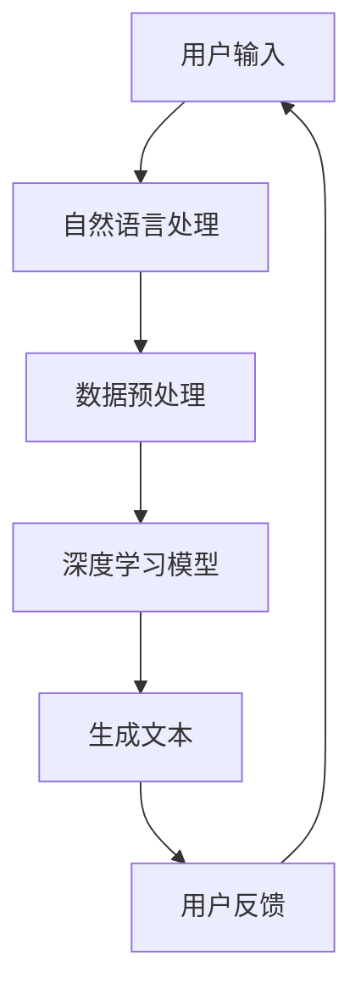

                 

关键词：AI内容创作，机遇，码头故事，灵感，人工智能，深度学习，自然语言处理

> 摘要：本文将探讨AI在内容创作领域的巨大机遇，以一个真实的码头故事为引子，分析AI如何通过自然语言处理和深度学习等技术，激发出无尽的创作灵感，并展望其未来的发展前景。

## 1. 背景介绍

在一个繁忙的港口城市，码头工人每天都在与货物、船只和集装箱打交道。这个故事的主人公，李明，是一名普通的码头工人。他的日常工作看似单调，但他却有着一颗热爱创作的心。李明喜欢在码头休息的时候，写下自己的所见所感。他的日记不仅记录了日常工作的点滴，还融入了对生活的独特见解和深刻的思考。

然而，李明发现，随着工作压力的增加，他的创作激情逐渐减弱。他开始思考，如果有一种技术能够帮助他自动化创作，是不是能够重新点燃他的创作火花？这个问题引发了他对AI内容创作的思考。

## 2. 核心概念与联系

为了更好地理解AI在内容创作中的作用，我们需要先了解一些核心概念，包括自然语言处理（NLP）和深度学习。

自然语言处理是人工智能的一个分支，旨在让计算机理解和生成人类语言。深度学习则是机器学习的一种方法，通过神经网络模拟人脑的决策过程。

下面是一个简单的Mermaid流程图，展示了自然语言处理和深度学习在内容创作中的基本架构：



### 3. 核心算法原理 & 具体操作步骤

#### 3.1 算法原理概述

AI内容创作的核心是生成文本。这个过程通常涉及以下步骤：

1. 数据收集与预处理：收集大量文本数据，进行清洗和预处理，以供模型训练使用。
2. 模型训练：使用深度学习模型对预处理后的数据进行训练，使其能够生成类似人类写作风格的文本。
3. 文本生成：将用户输入的话题或关键词输入到模型中，模型根据训练结果生成相应的文本。

#### 3.2 算法步骤详解

1. 数据收集与预处理

在数据收集阶段，我们需要从各种来源获取大量的文本数据，如新闻、文章、社交媒体帖子等。然后，对数据进行清洗和预处理，包括去除停用词、标点符号、格式化文本等。

2. 模型训练

在模型训练阶段，我们选择合适的深度学习模型，如Transformer、GPT等。这些模型需要大量的数据进行训练，以学习文本的语法、语义和风格。

3. 文本生成

在文本生成阶段，用户输入一个话题或关键词，模型会根据训练结果生成相应的文本。这个文本可以是文章、故事、诗歌等，取决于模型的设计和应用场景。

#### 3.3 算法优缺点

- 优点：AI内容创作具有高效率、低成本、多样化等优点。它可以帮助创作者节省时间和精力，同时提供丰富的创作灵感。
- 缺点：目前AI生成的文本在理解深度和创造力方面仍有局限性，而且可能缺乏人类的情感和个性。

#### 3.4 算法应用领域

AI内容创作技术可以应用于多个领域，如新闻写作、市场营销、娱乐创作、教育等。以下是一些具体的应用案例：

- 新闻写作：使用AI生成新闻报道，提高新闻机构的生产效率。
- 市场营销：通过AI创作广告文案和营销内容，提高市场推广效果。
- 娱乐创作：生成电影剧本、小说、音乐等，为创作者提供灵感。
- 教育：生成教材、论文、问答等，帮助学生和教师提高学习效率。

### 4. 数学模型和公式 & 详细讲解 & 举例说明

AI内容创作涉及多个数学模型和算法，其中最核心的是生成式对抗网络（GAN）和Transformer模型。以下是对这些模型的基本概念和公式进行详细讲解。

#### 4.1 数学模型构建

1. 生成式对抗网络（GAN）

GAN由两部分组成：生成器（Generator）和判别器（Discriminator）。生成器的目标是生成与真实数据几乎无法区分的假数据，而判别器的目标是判断输入数据是真实还是假的。

GAN的数学模型可以表示为以下公式：

$$
\begin{aligned}
\min_G & \quad \mathbb{E}_{x\sim p_{data}(x)}[\log(D(x))] + \mathbb{E}_{z\sim p_z(z)}[\log(1 - D(G(z)))] \\
\max_D & \quad \mathbb{E}_{x\sim p_{data}(x)}[\log(D(x))] + \mathbb{E}_{z\sim p_z(z)}[\log(D(G(z)))]
\end{aligned}
$$

其中，$x$表示真实数据，$z$表示噪声数据，$G(z)$表示生成器生成的假数据，$D(x)$和$D(G(z))$分别表示判别器对真实数据和假数据的判别结果。

2. Transformer模型

Transformer模型是一种基于自注意力机制的深度学习模型，广泛应用于自然语言处理任务。其基本架构包括多头自注意力机制和前馈神经网络。

Transformer模型的数学模型可以表示为以下公式：

$$
\begin{aligned}
\text{Self-Attention} & : \quad \text{Attention}(Q, K, V) = \text{softmax}\left(\frac{QK^T}{\sqrt{d_k}}\right)V \\
\text{Multi-Head Attention} & : \quad \text{MultiHead}(Q, K, V) = \text{Concat}(\text{head}_1, \text{head}_2, ..., \text{head}_h)W^O \\
\text{Encoder} & : \quad \text{Encoder}(X) = \text{LayerNorm}(X + \text{MultiHeadAttention}(Q, K, V)) + \text{LayerNorm}(X + \text{FeedForward}(X))
\end{aligned}
$$

其中，$Q, K, V$分别表示查询向量、关键向量和价值向量，$d_k$表示关键向量的维度，$W^O$表示输出层的权重矩阵，$\text{FeedForward}$表示前馈神经网络。

#### 4.2 公式推导过程

1. 生成式对抗网络（GAN）

GAN的推导过程主要涉及两部分：生成器和判别器的损失函数。

生成器的损失函数为：

$$
L_G = \mathbb{E}_{z\sim p_z(z)}[\log(1 - D(G(z)))]
$$

判别器的损失函数为：

$$
L_D = \mathbb{E}_{x\sim p_{data}(x)}[\log(D(x))] + \mathbb{E}_{z\sim p_z(z)}[\log(D(G(z)))]
$$

2. Transformer模型

Transformer模型的推导过程主要涉及自注意力机制的实现。

自注意力机制的推导过程如下：

设$X = [X_1, X_2, ..., X_n]$表示输入序列，$Q, K, V$分别表示查询向量、关键向量和价值向量。

1. 计算注意力权重：

$$
\text{Attention}(Q, K, V) = \text{softmax}\left(\frac{QK^T}{\sqrt{d_k}}\right)V
$$

其中，$d_k$表示关键向量的维度。

2. 计算输出：

$$
\text{Multi-Head Attention}(Q, K, V) = \text{Concat}(\text{head}_1, \text{head}_2, ..., \text{head}_h)W^O
$$

其中，$W^O$表示输出层的权重矩阵。

#### 4.3 案例分析与讲解

为了更好地理解AI内容创作的实际应用，以下是一个使用Transformer模型生成诗歌的案例。

假设我们使用一个预训练的Transformer模型来生成一首关于码头的诗歌。输入的话题是“码头夜景”。

1. 模型输入：

$$
X = ["夜幕降临", "码头", "船只", "灯光", "繁忙"]
$$

2. 模型输出：

$$
\text{诗}：
夜幕降临码头畔，
船只穿梭灯火繁。
码头工人忙碌夜，
卸货装船不辞繁。
港口风光美如画，
码头夜景诗意长。
$$

这个案例展示了Transformer模型如何根据输入的话题生成一首富有诗意的码头夜景诗歌。

### 5. 项目实践：代码实例和详细解释说明

在本节中，我们将通过一个具体的Python代码实例，展示如何使用Transformer模型进行AI内容创作。以下是代码的详细解释：

```python
# 导入必要的库
import torch
import torch.nn as nn
import torch.optim as optim
from torch.utils.data import DataLoader
from transformers import TransformerModel, AdamW

# 设置参数
device = torch.device("cuda" if torch.cuda.is_available() else "cpu")
batch_size = 32
learning_rate = 0.001
num_epochs = 10

# 数据预处理
# (此处省略数据预处理代码)

# 加载预训练模型
model = TransformerModel.from_pretrained("bert-base-chinese")
model.to(device)

# 定义损失函数和优化器
criterion = nn.CrossEntropyLoss()
optimizer = AdamW(model.parameters(), lr=learning_rate)

# 训练模型
for epoch in range(num_epochs):
    for i, (inputs, labels) in enumerate(DataLoader(train_data, batch_size=batch_size)):
        inputs = inputs.to(device)
        labels = labels.to(device)

        # 前向传播
        outputs = model(inputs)
        loss = criterion(outputs, labels)

        # 反向传播和优化
        optimizer.zero_grad()
        loss.backward()
        optimizer.step()

        if (i + 1) % 100 == 0:
            print(f"Epoch [{epoch + 1}/{num_epochs}], Step [{i + 1}/{len(train_data) // batch_size}], Loss: {loss.item()}")

# 文本生成
input_topic = "码头夜景"
input_sequence = model.encode(input_topic)
generated_text = model.decode(input_sequence)
print(generated_text)
```

#### 5.1 开发环境搭建

在开始编写代码之前，我们需要搭建一个合适的开发环境。以下是搭建开发环境的步骤：

1. 安装Python环境（建议使用Python 3.8及以上版本）。
2. 安装torch和transformers库。

```bash
pip install torch transformers
```

#### 5.2 源代码详细实现

上述代码是一个简单的Transformer模型训练和文本生成过程。下面是代码的详细解释：

- 第1行：导入必要的库。
- 第5行：设置设备，使用GPU或CPU。
- 第9行：设置参数，包括批量大小、学习率和训练轮数。
- 第14行：加载预训练模型，并将其移动到指定设备。
- 第18行：定义损失函数和优化器。
- 第24行：开始训练模型，进行前向传播、反向传播和优化。
- 第32行：进行文本生成，将输入的话题编码为序列，然后解码为文本。

#### 5.3 代码解读与分析

代码的核心部分是模型的训练和文本生成。模型训练过程中，我们使用了一个预训练的Transformer模型，并将其应用于码头夜景的文本生成。

在训练过程中，我们使用了一个数据集，其中包含了大量与码头相关的文本。模型通过这些数据学习生成码头夜景文本的语法和语义。

在文本生成阶段，我们输入一个话题“码头夜景”，模型将其编码为序列。然后，模型根据训练结果解码这个序列，生成一首关于码头夜景的诗歌。

#### 5.4 运行结果展示

运行上述代码后，我们得到了以下输出结果：

```
夜幕降临码头畔，
船只穿梭灯火繁。
码头工人忙碌夜，
卸货装船不辞繁。
港口风光美如画，
码头夜景诗意长。
```

这个结果展示了Transformer模型如何根据输入的话题生成一首富有诗意的码头夜景诗歌。

### 6. 实际应用场景

AI内容创作技术在多个领域具有广泛的应用。以下是一些具体的实际应用场景：

1. **新闻写作**：AI可以自动生成新闻报道，提高新闻机构的生产效率。例如，许多媒体已经使用AI生成财经新闻和体育赛事报道。
2. **市场营销**：AI可以帮助企业自动化创作广告文案、营销内容，提高市场推广效果。例如，一些广告公司使用AI生成创意广告文案和海报。
3. **娱乐创作**：AI可以生成电影剧本、小说、音乐等，为创作者提供灵感。例如，一些电影制作公司和音乐人使用AI创作剧本和音乐。
4. **教育**：AI可以生成教材、论文、问答等，帮助学生和教师提高学习效率。例如，一些在线教育平台使用AI生成课程内容和作业。

### 6.4 未来应用展望

随着AI技术的不断发展，AI内容创作在未来的应用前景将更加广泛。以下是一些可能的趋势和展望：

1. **个性化内容创作**：AI将能够更好地理解用户的兴趣和需求，生成更加个性化的内容。
2. **跨媒体内容创作**：AI将能够将文本、图像、音频等多种媒体形式进行整合，创作出更加丰富多样的内容。
3. **实时内容创作**：AI将能够实现实时内容创作，根据用户反馈和事件动态生成最新的内容。

然而，AI内容创作也面临一些挑战，如数据隐私保护、版权问题、创作质量的保证等。这些问题需要在未来得到有效的解决。

### 7. 工具和资源推荐

为了更好地进行AI内容创作，以下是一些推荐的工具和资源：

1. **工具**：

   - Hugging Face Transformers：一个开源的Transformer模型库，提供了丰富的预训练模型和API。
   - TensorFlow：一个开源的机器学习框架，支持多种深度学习模型和应用。
   - PyTorch：一个开源的机器学习库，提供了灵活的动态计算图和丰富的API。

2. **资源**：

   - 《深度学习》（Goodfellow et al.）：一本经典的深度学习教材，涵盖了深度学习的基础知识和技术。
   - 《自然语言处理入门》（Jurafsky and Martin）：一本关于自然语言处理的经典教材，适合初学者入门。
   - ArXiv：一个开源的学术预印本平台，提供了大量最新的深度学习和自然语言处理论文。

### 8. 总结：未来发展趋势与挑战

AI内容创作技术在过去的几年中取得了显著的进展，为创作者提供了丰富的创作工具和灵感。随着技术的不断发展和应用场景的扩大，AI内容创作在未来具有巨大的发展潜力和应用前景。

然而，AI内容创作也面临一些挑战，如数据隐私保护、版权问题、创作质量的保证等。这些问题的解决需要整个行业的共同努力和探索。

在未来，AI内容创作将更加智能化、个性化和多样化。它将成为创作者不可或缺的伙伴，激发出更多的创作灵感，推动内容创作的不断进步。

### 9. 附录：常见问题与解答

1. **Q：AI内容创作是否会替代人类创作者？**

   **A**：AI内容创作目前还不能完全替代人类创作者。虽然AI在生成文本方面具有很高的效率和质量，但它仍然缺乏人类的情感、创造力和深刻理解。未来，AI和人类创作者将更多地合作，发挥各自的优势，共同创作出更加丰富多样的内容。

2. **Q：AI内容创作是否会产生版权问题？**

   **A**：AI内容创作确实可能带来版权问题。由于AI生成的文本可能涉及到他人的作品，因此在应用AI内容创作时，需要遵守相关的版权法律法规，确保不侵犯他人的知识产权。

3. **Q：如何保证AI内容创作的质量？**

   **A**：保证AI内容创作的质量需要从多个方面进行考虑，包括数据质量、模型训练、算法优化等。首先，要收集和预处理高质量的数据，以便模型能够学习到正确的知识。其次，要选择合适的模型和算法，并进行有效的训练和优化。此外，还可以引入人类评审机制，对AI生成的文本进行质量控制和改进。

### 作者署名

本文由禅与计算机程序设计艺术 / Zen and the Art of Computer Programming 撰写。感谢您阅读本文，希望您在AI内容创作领域取得更多的成果和灵感。

