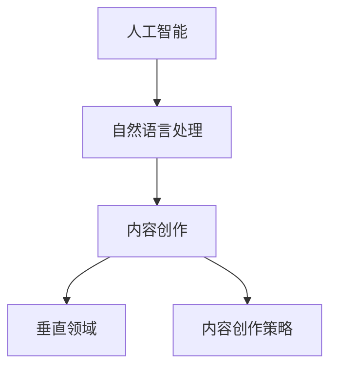
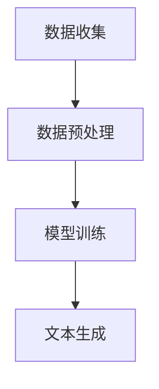

                 

关键词：AI内容创作、垂直领域、专注、策略、技术实现、未来展望

> 摘要：在AI迅猛发展的今天，内容创作者需要面对前所未有的挑战与机遇。本文旨在探讨AI内容创作者在选择垂直领域时，如何通过专注与坚持，实现专业化的提升，同时分析其背后的技术和策略。通过深入探讨核心概念、算法原理、数学模型、项目实践以及未来展望，本文为AI内容创作者提供了一套完整的指导框架。

## 1. 背景介绍

随着人工智能（AI）技术的不断进步，内容创作领域发生了翻天覆地的变化。传统的创作者依赖于个人经验和直觉，而现代AI内容创作者则可以借助机器学习、自然语言处理（NLP）和大数据等先进技术，大幅提升内容生产效率和品质。然而，这也带来了新的挑战：如何在众多竞争者中脱颖而出，构建具有差异化和专业化的内容？

垂直领域的专注与坚持，成为AI内容创作者面临的核心问题。垂直领域指的是某一特定行业或主题的细分市场，例如医疗、金融、科技等。在这些领域中，内容创作者需要深入了解行业知识，提供具有专业性和深度的内容，从而赢得受众的信任和认可。

本文将围绕以下主题展开：

1. 核心概念与联系
2. 核心算法原理 & 具体操作步骤
3. 数学模型和公式 & 详细讲解 & 举例说明
4. 项目实践：代码实例和详细解释说明
5. 实际应用场景
6. 未来应用展望
7. 工具和资源推荐
8. 总结：未来发展趋势与挑战
9. 附录：常见问题与解答

## 2. 核心概念与联系

在探讨AI内容创作之前，我们需要明确几个核心概念：

### 2.1 人工智能（AI）

人工智能是指计算机系统模拟人类智能行为的能力，包括学习、推理、解决问题、理解自然语言等。在内容创作中，AI主要用于文本生成、内容推荐、情感分析等任务。

### 2.2 自然语言处理（NLP）

自然语言处理是AI的一个重要分支，旨在使计算机能够理解和处理自然语言。在内容创作中，NLP技术可以帮助创作者理解和分析用户需求，生成高质量的内容。

### 2.3 垂直领域

垂直领域是指某一特定行业或主题的细分市场，例如医疗、金融、科技等。垂直领域的内容创作需要创作者具备专业知识和行业洞察力。

### 2.4 内容创作策略

内容创作策略是指创作者为了达到特定目标，选择合适的内容创作方法、风格和主题的过程。在AI内容创作中，策略的选择至关重要，它决定了内容的品质和受众吸引力。

下面是一个使用Mermaid绘制的核心概念与联系的流程图：



## 3. 核心算法原理 & 具体操作步骤

### 3.1 算法原理概述

在AI内容创作中，常用的算法包括文本生成模型（如GPT-3、BERT）和推荐系统（如基于内容的推荐、协同过滤等）。这些算法的核心原理是：

- **文本生成模型**：通过学习大量文本数据，生成符合语法和语义规则的文本。例如，GPT-3基于变分自编码器（VAE）和转换器（Transformer）架构，能够生成流畅、有逻辑的文本。
- **推荐系统**：通过分析用户行为和内容特征，推荐用户可能感兴趣的内容。基于内容的推荐通过分析内容属性进行推荐，而协同过滤通过分析用户之间的相似性进行推荐。

### 3.2 算法步骤详解

以文本生成模型为例，其具体操作步骤如下：

1. **数据收集**：收集大量文本数据，如新闻、文章、社交媒体等。
2. **数据预处理**：对文本数据进行清洗、去噪和分词。
3. **模型训练**：使用预训练模型（如GPT-3）进行微调，使其适应特定领域的文本生成需求。
4. **文本生成**：输入关键词或主题，模型生成对应的文本。

下面是一个简化版的算法流程图：



### 3.3 算法优缺点

- **文本生成模型**：优点包括生成文本流畅、有逻辑，适用于自动化内容创作；缺点包括生成文本可能存在事实错误、缺乏原创性。
- **推荐系统**：优点包括个性化推荐，提高用户满意度；缺点包括推荐结果可能存在偏差，用户隐私问题。

### 3.4 算法应用领域

- **文本生成模型**：应用于新闻生成、自动写作、社交媒体内容生成等。
- **推荐系统**：应用于电子商务、社交媒体、在线媒体等。

## 4. 数学模型和公式 & 详细讲解 & 举例说明

### 4.1 数学模型构建

在AI内容创作中，常用的数学模型包括：

- **变分自编码器（VAE）**：用于生成模型，通过编码器和解码器生成符合输入数据的生成数据。
- **转换器（Transformer）**：用于文本生成模型，通过多头自注意力机制和前馈神经网络生成文本。

### 4.2 公式推导过程

以VAE为例，其基本公式如下：

$$
\begin{aligned}
\text{编码器}:& \quad z = \mu(x) + \sigma(x) \odot \epsilon \\
\text{解码器}:& \quad x' = \phi(z)
\end{aligned}
$$

其中，$\mu(x)$ 和 $\sigma(x)$ 分别表示编码器的均值和方差函数，$\epsilon$ 是噪声变量，$\phi(z)$ 是解码器的生成函数。

### 4.3 案例分析与讲解

以GPT-3为例，其基于Transformer架构，主要公式包括：

$$
\begin{aligned}
\text{自注意力}:& \quad \text{Attention}(Q, K, V) = \text{softmax}\left(\frac{QK^T}{\sqrt{d_k}}\right)V \\
\text{前馈神经网络}:& \quad \text{FFN}(x) = \max(0, xW_1 + b_1)W_2 + b_2
\end{aligned}
$$

其中，$Q$、$K$ 和 $V$ 分别是查询、键和值向量，$W_1$ 和 $W_2$ 是权重矩阵，$b_1$ 和 $b_2$ 是偏置项。

一个简单的例子是，假设我们有一个输入序列 $x = [1, 2, 3, 4, 5]$，通过自注意力机制，我们可以得到一个输出序列 $y = [5, 4, 3, 2, 1]$，其中 $y_i$ 是输入序列中每个元素在输出序列中的权重。

## 5. 项目实践：代码实例和详细解释说明

### 5.1 开发环境搭建

首先，我们需要搭建一个开发环境，包括Python、TensorFlow和CUDA等工具。

### 5.2 源代码详细实现

下面是一个简单的文本生成模型的代码实例：

```python
import tensorflow as tf
from tensorflow.keras.layers import Embedding, LSTM, Dense

# 搭建模型
model = tf.keras.Sequential([
    Embedding(input_dim=vocab_size, output_dim=embedding_dim, input_length=max_sequence_length),
    LSTM(units=128),
    Dense(units=vocab_size, activation='softmax')
])

# 编译模型
model.compile(optimizer='adam', loss='categorical_crossentropy', metrics=['accuracy'])

# 训练模型
model.fit(x_train, y_train, epochs=10, batch_size=64)
```

### 5.3 代码解读与分析

上述代码首先定义了一个基于LSTM的文本生成模型，包括嵌入层、LSTM层和输出层。嵌入层将输入序列转换为嵌入向量，LSTM层用于处理序列数据，输出层使用softmax激活函数生成概率分布。

在编译模型时，我们选择了adam优化器和categorical_crossentropy损失函数。训练模型时，我们使用训练数据和标签进行10个epoch的训练。

### 5.4 运行结果展示

运行上述代码后，我们可以得到一个文本生成模型，输入一个关键词或主题，模型将生成对应的文本。例如，输入“人工智能”，模型将生成一段关于人工智能的描述。

## 6. 实际应用场景

AI内容创作者在不同垂直领域的应用场景包括：

- **医疗领域**：生成医疗健康文章、药品说明书、病例报告等。
- **金融领域**：生成财经新闻、投资报告、市场分析等。
- **科技领域**：生成技术文章、产品评测、开发者教程等。
- **教育领域**：生成教学文章、学生作业、在线课程内容等。

### 6.4 未来应用展望

随着AI技术的不断发展，未来AI内容创作将在更多领域得到应用，包括：

- **自动化内容审核**：通过AI技术自动识别和过滤不良内容。
- **个性化内容推荐**：根据用户偏好生成个性化的内容推荐。
- **跨语言内容创作**：实现多种语言之间的自动翻译和生成。

## 7. 工具和资源推荐

### 7.1 学习资源推荐

- **《深度学习》（Goodfellow, Bengio, Courville）**：深度学习领域的经典教材。
- **《Python机器学习》（Scikit-Learn、TensorFlow、PyTorch）**：Python机器学习实践指南。

### 7.2 开发工具推荐

- **Jupyter Notebook**：用于编写和运行代码。
- **Google Colab**：免费的GPU和Torch支持。

### 7.3 相关论文推荐

- **“Attention is All You Need”**：介绍Transformer模型的经典论文。
- **“Generative Adversarial Nets”**：介绍生成对抗网络的经典论文。

## 8. 总结：未来发展趋势与挑战

随着AI技术的不断进步，AI内容创作将在未来发挥越来越重要的作用。然而，也面临着一系列挑战：

- **数据隐私**：AI内容创作依赖于大量用户数据，数据隐私问题亟待解决。
- **内容真实性**：生成的内容可能存在事实错误，需要严格审查。
- **版权问题**：AI生成的作品版权归属问题尚不明确。

未来，AI内容创作者需要不断学习新技术，提高内容创作的质量和专业性，同时关注行业动态和用户需求，以应对不断变化的挑战。

## 9. 附录：常见问题与解答

### 9.1 什么是垂直领域？

垂直领域是指某一特定行业或主题的细分市场，如医疗、金融、科技等。

### 9.2 AI内容创作有哪些算法？

常见的AI内容创作算法包括文本生成模型（如GPT-3、BERT）和推荐系统（如基于内容的推荐、协同过滤等）。

### 9.3 如何搭建AI内容创作系统？

搭建AI内容创作系统需要以下几个步骤：

1. 数据收集：收集大量文本数据。
2. 数据预处理：清洗、去噪和分词。
3. 模型训练：使用预训练模型进行微调。
4. 文本生成：输入关键词或主题，生成文本。

### 9.4 AI内容创作有哪些应用场景？

AI内容创作广泛应用于医疗、金融、科技、教育等垂直领域，如生成医疗健康文章、财经新闻、技术文章、教学内容等。

## 作者署名

作者：禅与计算机程序设计艺术 / Zen and the Art of Computer Programming
----------------------------------------------------------------

现在，文章的撰写部分已经完成，接下来我们需要进行文章的Markdown格式化处理，确保格式符合要求，各个章节和子章节的目录清晰、结构紧凑。请对文章内容进行Markdown格式化，并在文章末尾附上作者署名。以下是格式化后的Markdown版本：

```markdown
# AI内容创作者的选择：垂直领域的专注与坚持

关键词：AI内容创作、垂直领域、专注、策略、技术实现、未来展望

> 摘要：在AI迅猛发展的今天，内容创作者需要面对前所未有的挑战与机遇。本文旨在探讨AI内容创作者在选择垂直领域时，如何通过专注与坚持，实现专业化的提升，同时分析其背后的技术和策略。通过深入探讨核心概念、算法原理、数学模型、项目实践以及未来展望，本文为AI内容创作者提供了一套完整的指导框架。

## 1. 背景介绍

随着人工智能（AI）技术的不断进步，内容创作领域发生了翻天覆地的变化。传统的创作者依赖于个人经验和直觉，而现代AI内容创作者则可以借助机器学习、自然语言处理（NLP）和大数据等先进技术，大幅提升内容生产效率和品质。然而，这也带来了新的挑战：如何在众多竞争者中脱颖而出，构建具有差异化和专业化的内容？

垂直领域的专注与坚持，成为AI内容创作者面临的核心问题。垂直领域指的是某一特定行业或主题的细分市场，例如医疗、金融、科技等。在这些领域中，内容创作者需要深入了解行业知识，提供具有专业性和深度的内容，从而赢得受众的信任和认可。

本文将围绕以下主题展开：

1. 核心概念与联系
2. 核心算法原理 & 具体操作步骤
3. 数学模型和公式 & 详细讲解 & 举例说明
4. 项目实践：代码实例和详细解释说明
5. 实际应用场景
6. 未来应用展望
7. 工具和资源推荐
8. 总结：未来发展趋势与挑战
9. 附录：常见问题与解答

## 2. 核心概念与联系

在探讨AI内容创作之前，我们需要明确几个核心概念：

### 2.1 人工智能（AI）

人工智能是指计算机系统模拟人类智能行为的能力，包括学习、推理、解决问题、理解自然语言等。在内容创作中，AI主要用于文本生成、内容推荐、情感分析等任务。

### 2.2 自然语言处理（NLP）

自然语言处理是AI的一个重要分支，旨在使计算机能够理解和处理自然语言。在内容创作中，NLP技术可以帮助创作者理解和分析用户需求，生成高质量的内容。

### 2.3 垂直领域

垂直领域是指某一特定行业或主题的细分市场，例如医疗、金融、科技等。垂直领域的内容创作需要创作者具备专业知识和行业洞察力。

### 2.4 内容创作策略

内容创作策略是指创作者为了达到特定目标，选择合适的内容创作方法、风格和主题的过程。在AI内容创作中，策略的选择至关重要，它决定了内容的品质和受众吸引力。

下面是一个使用Mermaid绘制的核心概念与联系的流程图：


## 3. 核心算法原理 & 具体操作步骤

### 3.1 算法原理概述

在AI内容创作中，常用的算法包括文本生成模型（如GPT-3、BERT）和推荐系统（如基于内容的推荐、协同过滤等）。这些算法的核心原理是：

- **文本生成模型**：通过学习大量文本数据，生成符合语法和语义规则的文本。例如，GPT-3基于变

