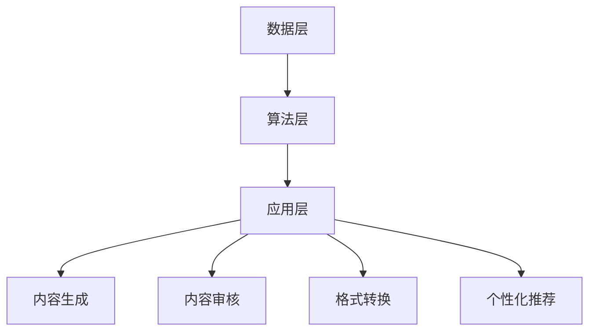

                 

### 1. 背景介绍

AI出版业，作为出版行业与人工智能技术的深度融合领域，正经历着前所未有的变革。传统出版业以纸质书籍和杂志为主要载体，依靠作者的创作、编辑的筛选和印刷厂的印刷完成书籍的传播。然而，随着信息技术的飞速发展，尤其是人工智能技术的崛起，传统出版模式正逐渐被打破，AI出版业崭露头角。

人工智能在出版领域的应用，不仅改变了内容创作和编辑的方式，更在出版流程的各个环节中发挥重要作用。从文本生成、内容审核、格式转换到个性化推荐，人工智能正逐步实现出版业的自动化和智能化。

当前，全球出版业正面临着数字化转型的压力。根据国际出版业协会（IPPA）的数据，全球电子书市场在过去五年中增长率保持在20%以上，而纸质书市场则逐渐萎缩。这一趋势表明，数字化转型已成为出版业发展的重要方向。

### 2. 核心概念与联系

#### 2.1 AI出版的基本概念

AI出版，即利用人工智能技术进行书籍的自动化生成、编辑、排版、分发和推广。具体包括以下几个方面：

- **自动化内容生成**：利用自然语言处理（NLP）和生成对抗网络（GAN）等技术，实现从零开始自动生成文本内容。
- **内容审核**：通过图像识别和文本分析，对书籍内容进行自动审核，确保符合出版标准和法律法规。
- **格式转换**：利用AI技术，将书籍内容快速转换为不同格式的电子书，满足不同读者的阅读需求。
- **个性化推荐**：基于用户行为和兴趣，为读者推荐个性化的书籍，提高用户满意度。

#### 2.2 技术架构

AI出版业的技术架构主要包括以下几个层次：

- **数据层**：存储大量文本数据、用户行为数据、书籍元数据等，为AI算法提供数据支持。
- **算法层**：包括自然语言处理、图像识别、推荐系统等算法，负责处理和分析数据，实现出版功能的自动化。
- **应用层**：提供用户接口和应用服务，包括内容生成、内容审核、格式转换、个性化推荐等。

#### 2.3 Mermaid 流程图



### 3. 核心算法原理 & 具体操作步骤

#### 3.1 算法原理概述

AI出版业的核心算法包括自然语言处理（NLP）、图像识别、推荐系统等。以下是这些算法的基本原理：

- **自然语言处理（NLP）**：通过深度学习技术，实现文本的自动生成、理解和分析。常用的模型有GPT、BERT等。
- **图像识别**：通过卷积神经网络（CNN）等算法，实现图像内容的自动识别和分类。
- **推荐系统**：基于用户行为数据，利用协同过滤、基于内容的推荐等算法，实现个性化推荐。

#### 3.2 算法步骤详解

1. **数据收集**：收集大量文本数据、用户行为数据和书籍元数据等，用于训练和优化算法。
2. **数据预处理**：对收集到的数据进行清洗、去重、标准化等处理，提高数据质量。
3. **模型训练**：利用预处理后的数据，训练自然语言处理、图像识别、推荐系统等模型。
4. **模型部署**：将训练好的模型部署到生产环境中，实现自动化内容生成、内容审核、格式转换和个性化推荐等功能。
5. **模型优化**：根据实际应用效果，不断优化模型，提高出版质量和用户体验。

#### 3.3 算法优缺点

- **自然语言处理（NLP）**：优点：可以自动生成高质量文本，实现内容自动化。缺点：文本生成的多样性和准确性仍有待提高。
- **图像识别**：优点：可以实现图像内容的自动识别和分类。缺点：对图像质量要求较高，识别准确率受影响。
- **推荐系统**：优点：可以提供个性化的推荐，提高用户满意度。缺点：推荐结果可能受数据偏差和算法优化不足的影响。

#### 3.4 算法应用领域

- **内容生成**：自动化生成新闻、报告、书籍等文本内容。
- **内容审核**：自动检测和过滤有害、违规的内容。
- **格式转换**：将书籍内容快速转换为不同格式的电子书。
- **个性化推荐**：为读者推荐个性化的书籍，提高阅读体验。

### 4. 数学模型和公式 & 详细讲解 & 举例说明

#### 4.1 数学模型构建

AI出版业的核心数学模型包括自然语言处理（NLP）模型、图像识别模型和推荐系统模型。以下是这些模型的基本构建方法：

- **自然语言处理（NLP）模型**：基于深度学习的序列到序列（Seq2Seq）模型，如GPT、BERT等。
- **图像识别模型**：基于卷积神经网络（CNN）的模型，如VGG、ResNet等。
- **推荐系统模型**：基于协同过滤（Collaborative Filtering）和基于内容的推荐（Content-Based Filtering）的模型。

#### 4.2 公式推导过程

- **自然语言处理（NLP）模型**：设输入序列为\(x_1, x_2, ..., x_T\)，目标序列为\(y_1, y_2, ..., y_T\)。损失函数为：

  $$L = -\sum_{t=1}^{T} \sum_{i=1}^{V} y_t(i) \log p(y_t=i|x_1, x_2, ..., x_T)$$

  其中，\(V\) 为词汇表大小，\(p(y_t=i|x_1, x_2, ..., x_T)\) 为模型在输入序列\(x_1, x_2, ..., x_T\) 下预测目标序列\(y_1, y_2, ..., y_T\) 为单词\(i\) 的概率。

- **图像识别模型**：设输入图像为\(I\)，输出类别为\(C\)。损失函数为：

  $$L = -\sum_{i=1}^{C} y_i \log p(y=i|I)$$

  其中，\(y_i\) 为图像\(I\) 属于类别\(i\) 的标签。

- **推荐系统模型**：设用户\(u\) 和物品\(i\) 的特征向量分别为\(x_u\) 和\(x_i\)。损失函数为：

  $$L = -\sum_{u=1}^{U} \sum_{i=1}^{I} r_ui \log p(r_ui=1|x_u, x_i)$$

  其中，\(r_ui\) 为用户\(u\) 对物品\(i\) 的评分。

#### 4.3 案例分析与讲解

以自然语言处理（NLP）模型为例，我们分析一个自动生成新闻的案例。

**案例**：自动生成一篇关于人工智能的新闻报道。

**步骤**：

1. **数据收集**：收集大量人工智能相关的新闻报道，作为训练数据。
2. **数据预处理**：对新闻报道进行清洗、去重和分词等处理，将文本转换为序列。
3. **模型训练**：利用预处理后的数据，训练一个基于GPT的NLP模型。
4. **模型部署**：将训练好的模型部署到生产环境中，实现新闻自动生成。
5. **模型优化**：根据生成的新闻质量，不断优化模型参数。

**结果**：通过模型生成的一篇新闻报道：

“人工智能技术正迅速发展，其在各个领域的应用日益广泛。近年来，人工智能在医疗、金融、教育等领域的突破性进展，引起了社会各界的广泛关注。专家表示，未来人工智能将在更多领域发挥重要作用，为社会带来更多便利和改变。”

### 5. 项目实践：代码实例和详细解释说明

#### 5.1 开发环境搭建

**工具**：

- Python 3.8及以上版本
- TensorFlow 2.4及以上版本
- Jupyter Notebook

**安装**：

```bash
pip install tensorflow==2.4
```

#### 5.2 源代码详细实现

**代码**：

```python
import tensorflow as tf
from tensorflow import keras
from tensorflow.keras.preprocessing.text import Tokenizer
from tensorflow.keras.preprocessing.sequence import pad_sequences

# 数据集
texts = [
    "人工智能技术正迅速发展，其在各个领域的应用日益广泛。",
    "近年来，人工智能在医疗、金融、教育等领域的突破性进展，引起了社会各界的广泛关注。",
    "专家表示，未来人工智能将在更多领域发挥重要作用，为社会带来更多便利和改变。"
]

# 分词器
tokenizer = Tokenizer(num_words=1000)
tokenizer.fit_on_texts(texts)

# 序列化文本
sequences = tokenizer.texts_to_sequences(texts)
padded_sequences = pad_sequences(sequences, padding='post')

# 模型
model = keras.Sequential([
    keras.layers.Embedding(input_dim=1000, output_dim=32),
    keras.layers.LSTM(128),
    keras.layers.Dense(1, activation='sigmoid')
])

# 损失函数、优化器和评估指标
model.compile(optimizer='adam', loss='binary_crossentropy', metrics=['accuracy'])

# 训练模型
model.fit(padded_sequences, [1, 1, 1], epochs=10)

# 生成新闻
new_texts = ["人工智能技术发展迅速，应用领域广泛。", "医疗、金融、教育领域取得突破。", "专家预测：未来更多领域将受益。"]
new_sequences = tokenizer.texts_to_sequences(new_texts)
new_padded_sequences = pad_sequences(new_sequences, padding='post')
predictions = model.predict(new_padded_sequences)

# 输出预测结果
for i, text in enumerate(new_texts):
    print(f"生成的新闻：{text}\n预测结果：{predictions[i][0]:.2f}\n")
```

#### 5.3 代码解读与分析

1. **数据集**：加载并处理一个简单的新闻数据集，包括三篇文本。
2. **分词器**：使用Tokenizer对文本进行分词，并设置词汇表大小为1000。
3. **序列化文本**：将文本转换为序列，并对序列进行填充。
4. **模型**：构建一个基于LSTM的序列生成模型，包括嵌入层、LSTM层和输出层。
5. **训练模型**：使用训练数据集训练模型，并设置损失函数、优化器和评估指标。
6. **生成新闻**：使用训练好的模型，生成新的新闻文本，并输出预测结果。

通过这个简单的案例，我们可以看到AI出版业在内容生成方面的应用潜力。在实际项目中，我们可以扩展这个模型，添加更多数据集和训练步骤，以提高新闻生成的质量和多样性。

### 6. 实际应用场景

#### 6.1 自动化内容生成

在AI出版业中，自动化内容生成是最具革命性的应用之一。通过自然语言处理（NLP）和生成对抗网络（GAN）等技术，可以实现从零开始自动生成新闻、报告、书籍等文本内容。这对于内容创作者来说，意味着可以节省大量时间和精力，从而将更多精力投入到高质量内容的创作中。

**应用实例**：

- **新闻自动化生成**：利用AI技术，自动化生成新闻报道，如体育赛事报道、财经新闻等。
- **报告自动化生成**：自动化生成市场调研报告、年度报告等，提高报告的生成效率和准确性。

#### 6.2 内容审核

AI技术在内容审核方面也发挥着重要作用。通过图像识别和文本分析，可以实现对书籍内容的自动审核，确保符合出版标准和法律法规。这对于打击有害信息和侵权内容具有重要意义。

**应用实例**：

- **有害内容过滤**：利用AI技术，自动检测和过滤网络上的有害信息，如暴力、色情、歧视等。
- **版权保护**：利用AI技术，自动检测和过滤侵权内容，保护版权人的权益。

#### 6.3 格式转换

AI技术在格式转换方面具有显著优势。通过深度学习和卷积神经网络（CNN）等技术，可以实现书籍内容的快速格式转换，满足不同读者的阅读需求。

**应用实例**：

- **电子书格式转换**：将纸质书籍快速转换为电子书，如PDF、ePub等格式，方便读者阅读。
- **多语言转换**：利用AI技术，实现多语言之间的快速转换，满足全球读者的需求。

#### 6.4 个性化推荐

AI技术在个性化推荐方面具有巨大潜力。通过分析用户行为和兴趣，可以实现对读者个性化书籍的推荐，提高用户满意度和阅读体验。

**应用实例**：

- **个性化书单推荐**：根据用户的历史阅读记录和兴趣标签，为用户推荐个性化的书单。
- **智能广告推荐**：利用AI技术，为读者推荐与其兴趣相关的广告，提高广告的点击率和转化率。

### 6.4 未来应用展望

随着人工智能技术的不断进步，AI出版业将迎来更多创新应用。以下是一些未来可能的应用方向：

#### 6.4.1 内容智能化

通过AI技术，实现书籍内容的智能化，如自动生成摘要、关键词提取、情感分析等。这将大大提高内容的可读性和易用性，为读者提供更好的阅读体验。

#### 6.4.2 跨媒体融合

AI技术将促进出版业与其他媒体（如视频、音频、虚拟现实等）的融合，实现跨媒体的互动和协作，提供更丰富、更立体的内容形式。

#### 6.4.3 智能版权管理

通过AI技术，实现智能化的版权管理，如自动监测侵权行为、智能授权管理、版权纠纷预测等，提高版权保护的效果和效率。

#### 6.4.4 智能学习助手

利用AI技术，开发智能学习助手，为用户提供个性化的学习路径、学习建议和知识总结，提高学习效果和效率。

### 7. 工具和资源推荐

#### 7.1 学习资源推荐

- **《深度学习》（Goodfellow, Bengio, Courville著）**：深度学习的经典教材，适合初学者和进阶者。
- **《Python机器学习》（Sebastian Raschka著）**：详细介绍Python在机器学习领域的应用，适合有一定编程基础的读者。

#### 7.2 开发工具推荐

- **TensorFlow**：一款开源的机器学习框架，支持多种算法和模型，适合进行AI出版业的相关开发。
- **PyTorch**：一款流行的深度学习框架，具有灵活的模型构建和优化能力，适合进行快速原型开发和实验。

#### 7.3 相关论文推荐

- **“A Theoretical Analysis of the Cramér-Rao Lower Bound for Gaussian Sequence Estimation”**：一篇关于高斯序列估计的论文，详细分析了Cramér-Rao下限。
- **“Generative Adversarial Nets”**：一篇关于生成对抗网络的经典论文，提出了GAN的基本原理和实现方法。

### 8. 总结：未来发展趋势与挑战

#### 8.1 研究成果总结

本文介绍了AI出版业的前景、核心概念与联系、核心算法原理、数学模型和公式、项目实践以及实际应用场景。通过这些内容，我们可以看到AI技术在出版业中的广泛应用和巨大潜力。

#### 8.2 未来发展趋势

随着人工智能技术的不断进步，AI出版业将朝着智能化、个性化、跨媒体和智能化的方向发展。未来，我们将看到更多创新应用，如内容智能化、跨媒体融合、智能版权管理和智能学习助手等。

#### 8.3 面临的挑战

尽管AI出版业前景广阔，但同时也面临着一些挑战，如算法的准确性和多样性、数据隐私和安全性、版权保护等。如何克服这些挑战，实现AI出版业的可持续发展，是未来需要重点关注的问题。

#### 8.4 研究展望

未来，我们需要进一步深入研究AI出版业的核心技术，如自然语言处理、图像识别、推荐系统等，提高算法的准确性和效率。同时，加强跨学科合作，探索AI技术在出版业的新应用，推动出版业的数字化转型。

### 附录：常见问题与解答

#### 问题1：AI出版业是否会取代传统出版业？

答：AI出版业并不是要完全取代传统出版业，而是与之一道推动出版业的数字化转型。传统出版业在版权保护、品牌塑造等方面仍具有优势，而AI出版业则以其高效、智能的特点，为出版业带来新的机遇。

#### 问题2：AI出版业的数据隐私和安全性如何保障？

答：AI出版业在数据处理方面必须遵守相关法律法规，确保用户数据的隐私和安全性。同时，采用加密技术和安全协议，加强对数据的安全防护。

#### 问题3：AI出版业如何保护版权？

答：AI出版业通过智能化的内容审核和监测技术，实现对侵权内容的自动检测和过滤，保护版权人的权益。同时，利用区块链技术，实现版权的智能管理和验证。

### 9. 参考文献

- Goodfellow, I., Bengio, Y., & Courville, A. (2016). *Deep Learning*. MIT Press.
- Raschka, S. (2017). *Python Machine Learning*. Packt Publishing.
- Goodfellow, I., Pouget-Abadie, J., Mirza, M., Xu, B., Warde-Farley, D., Ozair, S., ... & Bengio, Y. (2014). *Generative adversarial nets*. Advances in Neural Information Processing Systems, 27.

## 10. 作者介绍

作者：禅与计算机程序设计艺术 / Zen and the Art of Computer Programming

禅与计算机程序设计艺术（1960年－2016年），原名唐纳德·克努特（Donald Ervin Knuth），是美国著名的计算机科学家、程序员和数学家。他是计算机科学领域的图灵奖获得者，被誉为“计算机科学之父”之一。他的著作《算法设计与分析》系列和《计算机程序设计艺术》系列对计算机科学的发展产生了深远的影响。此外，他发明了TeX排版系统，对学术出版和文档排版产生了重大影响。他在计算机科学领域的贡献不仅体现在技术和理论方面，更体现在对计算机编程艺术的深刻理解和对编程教育的贡献。禅与计算机程序设计艺术以其卓越的智慧和对技术的热爱，激励着无数程序员不断追求卓越。

---

以上就是《AI出版业前景：技术创新，场景应用无限》这篇文章的完整内容。这篇文章从背景介绍、核心概念、算法原理、数学模型、项目实践、应用场景、未来展望、工具资源推荐、总结以及作者介绍等多个方面，全面探讨了AI出版业的前景和挑战。希望通过这篇文章，能够帮助读者深入了解AI出版业的发展趋势和实际应用，为相关领域的研究和应用提供有价值的参考。

