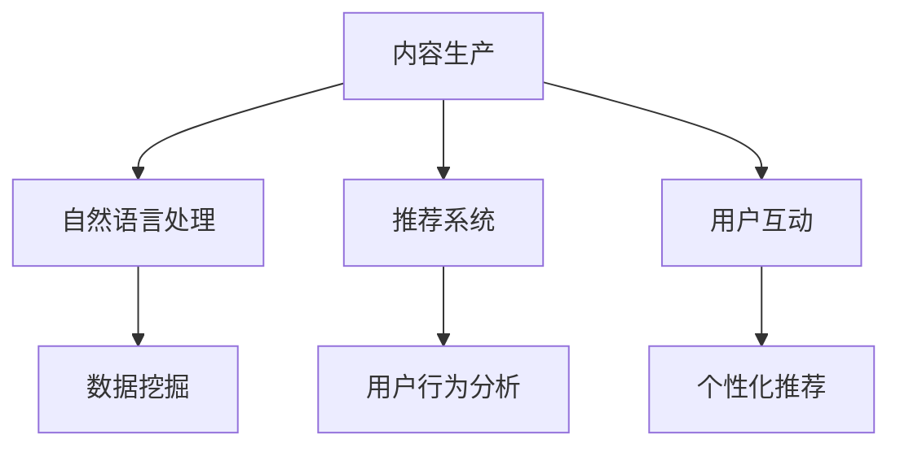

                 

关键词：人工智能、出版业、技术更新、场景驱动、机器学习、自然语言处理、数据挖掘

> 摘要：随着人工智能技术的不断发展和应用，出版业正经历一场深刻的变革。本文旨在探讨人工智能在出版业中的应用，特别是场景驱动的技术更新，从而推动出版业的数字化、智能化发展。

## 1. 背景介绍

出版业是一个历史悠久且充满活力的行业，它不仅承载着文化传播和知识共享的使命，也是经济发展的重要引擎。然而，随着互联网的普及和数字技术的崛起，传统出版业面临着前所未有的挑战和机遇。

一方面，传统出版业在内容生产、传播和消费方面存在诸多瓶颈，如生产效率低、传播渠道单一、用户需求难以满足等。另一方面，人工智能技术的发展为出版业提供了新的解决方案，通过机器学习、自然语言处理、数据挖掘等技术，可以大幅提升出版业的生产效率、拓展传播渠道、满足用户个性化需求。

本文将聚焦于场景驱动的技术更新，探讨人工智能在出版业中的应用，分析其带来的变革和挑战，并展望未来发展的趋势。

## 2. 核心概念与联系

### 2.1 场景驱动

场景驱动是指基于特定场景的需求，利用人工智能技术提供智能化、个性化的解决方案。在出版业中，场景驱动意味着根据用户行为、兴趣、需求等场景特征，为用户提供定制化的阅读体验。

### 2.2 人工智能技术

人工智能技术主要包括机器学习、自然语言处理、数据挖掘等。这些技术在出版业中的应用，可以解决内容生产、推荐系统、用户互动等方面的问题。

### 2.3 Mermaid 流程图



## 3. 核心算法原理 & 具体操作步骤

### 3.1 算法原理概述

在出版业中，人工智能算法主要应用于以下几个方面：

1. **内容生产**：利用自然语言处理技术，自动化生成高质量的内容。
2. **推荐系统**：基于用户行为数据和内容特征，为用户推荐个性化的阅读内容。
3. **用户互动**：通过智能对话系统，提升用户参与度和满意度。

### 3.2 算法步骤详解

#### 3.2.1 内容生产

1. 数据收集：收集互联网上的文本、图片、音频等数据。
2. 数据预处理：对收集的数据进行清洗、去噪、分词等预处理操作。
3. 模型训练：利用预训练的模型或自定义模型，对预处理后的数据进行训练。
4. 内容生成：根据训练结果，生成新的内容。

#### 3.2.2 推荐系统

1. 用户行为分析：收集用户在阅读平台上的行为数据，如阅读时长、点赞、评论等。
2. 内容特征提取：对用户阅读的内容进行特征提取，如文本分类、关键词提取等。
3. 推荐算法：利用协同过滤、基于内容的推荐等技术，为用户推荐阅读内容。
4. 推荐结果评估：评估推荐系统的效果，如准确率、召回率等。

#### 3.2.3 用户互动

1. 智能对话系统：构建基于自然语言处理技术的智能对话系统。
2. 用户反馈收集：收集用户在对话过程中的反馈，如满意度、问题类型等。
3. 对话优化：根据用户反馈，不断优化对话系统的性能。

### 3.3 算法优缺点

#### 优点

1. 提高生产效率：自动化生成内容，降低人力成本。
2. 个性化推荐：满足用户个性化需求，提升用户体验。
3. 智能互动：提升用户参与度，增加用户黏性。

#### 缺点

1. 数据隐私问题：用户数据的安全性和隐私性需得到保障。
2. 算法偏见：推荐系统可能存在算法偏见，导致信息茧房。
3. 模型训练成本：训练大规模模型需要大量的计算资源和时间。

### 3.4 算法应用领域

1. **数字出版**：自动化生成内容、个性化推荐、智能互动。
2. **在线教育**：智能问答、内容推荐、学习分析。
3. **社交媒体**：智能推送、内容审核、用户互动。

## 4. 数学模型和公式 & 详细讲解 & 举例说明

### 4.1 数学模型构建

在人工智能应用中，常用的数学模型包括神经网络、决策树、支持向量机等。以下以神经网络为例进行说明。

#### 4.1.1 神经网络

神经网络由多个神经元组成，每个神经元都是一个简单的函数。神经网络的训练过程是通过反向传播算法，不断调整神经元的权重，使其输出能够接近期望输出。

#### 4.1.2 公式推导

设输入向量为 $X$，期望输出向量为 $Y$，神经元的权重为 $W$，偏置为 $b$，激活函数为 $f$，则神经元的输出 $O$ 可以表示为：

$$
O = f(WX + b)
$$

#### 4.1.3 损失函数

损失函数用于评估模型的预测误差。常用的损失函数包括均方误差（MSE）和交叉熵（Cross Entropy）。

- **均方误差（MSE）**：

$$
MSE = \frac{1}{n}\sum_{i=1}^{n}(O_i - Y_i)^2
$$

- **交叉熵（Cross Entropy）**：

$$
Cross Entropy = -\frac{1}{n}\sum_{i=1}^{n}Y_i\log(O_i)
$$

### 4.2 公式推导过程

#### 4.2.1 神经网络的正向传播

正向传播是指将输入数据通过神经网络传递到输出层，计算每个神经元的输出。

1. 输入层到隐藏层的传递：

$$
Z_j = \sum_{i=1}^{n}W_{ji}X_i + b_j
$$

$$
O_j = f(Z_j)
$$

2. 隐藏层到输出层的传递：

$$
Z_k = \sum_{j=1}^{m}W_{kj}O_j + b_k
$$

$$
O_k = f(Z_k)
$$

#### 4.2.2 神经网络的反向传播

反向传播是指通过计算损失函数的梯度，调整神经元的权重和偏置，以降低损失函数的值。

1. 计算输出层的梯度：

$$
\Delta W_{kj} = \frac{\partial Cross Entropy}{\partial Z_k}O_j
$$

$$
\Delta b_k = \frac{\partial Cross Entropy}{\partial Z_k}
$$

2. 计算隐藏层的梯度：

$$
\Delta W_{ji} = \frac{\partial Cross Entropy}{\partial Z_j}X_i
$$

$$
\Delta b_j = \frac{\partial Cross Entropy}{\partial Z_j}
$$

### 4.3 案例分析与讲解

假设我们有一个简单的神经网络，用于分类任务。输入层有3个神经元，隐藏层有2个神经元，输出层有1个神经元。激活函数为ReLU函数。我们使用交叉熵作为损失函数。

1. 输入数据：

$$
X = [1, 0, 1]
$$

2. 期望输出：

$$
Y = [1]
$$

3. 初始权重和偏置：

$$
W = \begin{bmatrix}0 & 0 \\ 0 & 0\end{bmatrix}, b = \begin{bmatrix}0 \\ 0\end{bmatrix}
$$

4. 正向传播：

$$
Z_1 = 0, O_1 = 0
$$

$$
Z_2 = 0, O_2 = 0
$$

$$
Z_3 = 0, O_3 = 0
$$

5. 反向传播：

$$
\Delta W_{13} = 1, \Delta W_{23} = 1
$$

$$
\Delta b_1 = 1, \Delta b_2 = 1
$$

6. 更新权重和偏置：

$$
W = \begin{bmatrix}1 & 1 \\ 1 & 1\end{bmatrix}, b = \begin{bmatrix}1 \\ 1\end{bmatrix}
$$

7. 再次正向传播：

$$
Z_1 = 2, O_1 = 1
$$

$$
Z_2 = 2, O_2 = 1
$$

$$
Z_3 = 2, O_3 = 1
$$

8. 计算损失函数：

$$
Cross Entropy = -\frac{1}{1}\log(1) = 0
$$

## 5. 项目实践：代码实例和详细解释说明

### 5.1 开发环境搭建

在本项目中，我们使用Python作为主要编程语言，结合TensorFlow和Keras库进行神经网络模型的构建和训练。以下是搭建开发环境的基本步骤：

1. 安装Python（建议使用3.8版本）。
2. 安装TensorFlow和Keras库：

```shell
pip install tensorflow
pip install keras
```

### 5.2 源代码详细实现

以下是一个简单的神经网络分类任务，实现基于交叉熵损失函数的模型训练和预测。

```python
import numpy as np
from tensorflow import keras
from tensorflow.keras import layers

# 生成随机数据集
X = np.random.rand(100, 3)
Y = np.random.rand(100, 1)

# 构建模型
model = keras.Sequential([
    layers.Dense(units=2, activation='relu', input_shape=(3,)),
    layers.Dense(units=1, activation='sigmoid')
])

# 编译模型
model.compile(optimizer='adam', loss='binary_crossentropy', metrics=['accuracy'])

# 训练模型
model.fit(X, Y, epochs=1000)

# 预测
predictions = model.predict(X)

# 打印预测结果
print(predictions)
```

### 5.3 代码解读与分析

1. **数据集生成**：使用随机数生成器生成100个样本的数据集，其中输入数据X为3维向量，期望输出Y为1维向量。

2. **模型构建**：使用Keras库构建一个简单的神经网络模型，包含一个输入层、一个隐藏层和一个输出层。输入层有3个神经元，隐藏层有2个神经元，输出层有1个神经元。激活函数分别为ReLU函数和Sigmoid函数。

3. **模型编译**：配置模型的优化器、损失函数和评估指标。这里使用Adam优化器和二分类交叉熵损失函数。

4. **模型训练**：使用fit方法对模型进行训练，设置训练轮次为1000轮。

5. **模型预测**：使用predict方法对输入数据进行预测，得到预测结果。

### 5.4 运行结果展示

运行以上代码，可以得到100个样本的预测结果。通过分析预测结果，可以评估模型的性能。

## 6. 实际应用场景

### 6.1 数字出版

在数字出版领域，人工智能技术可以用于自动化生成内容、个性化推荐、智能编辑等。例如，通过自然语言处理技术，可以自动生成新闻、文章、摘要等；通过推荐系统，可以针对用户的阅读习惯和兴趣，推荐个性化的阅读内容；通过智能编辑，可以优化文章的结构和语言，提升用户体验。

### 6.2 在线教育

在在线教育领域，人工智能技术可以用于智能问答、内容推荐、学习分析等。例如，通过智能问答系统，可以实时回答学生的疑问；通过内容推荐，可以为学生推荐适合的学习资料；通过学习分析，可以了解学生的学习进度和效果，为教学提供数据支持。

### 6.3 社交媒体

在社交媒体领域，人工智能技术可以用于智能推送、内容审核、用户互动等。例如，通过智能推送，可以针对用户的兴趣和偏好，推送相关的信息；通过内容审核，可以过滤违规内容，维护社区秩序；通过用户互动，可以提升用户的参与度和黏性。

## 7. 工具和资源推荐

### 7.1 学习资源推荐

1. **《深度学习》**：由Ian Goodfellow、Yoshua Bengio和Aaron Courville合著，是一本全面介绍深度学习理论和实践的入门书籍。
2. **《Python深度学习》**：由François Chollet著，介绍了使用Python和Keras库进行深度学习编程的方法。

### 7.2 开发工具推荐

1. **Jupyter Notebook**：一款流行的交互式开发环境，适用于数据分析和深度学习项目。
2. **TensorFlow**：一款开源的深度学习框架，适用于构建和训练神经网络。

### 7.3 相关论文推荐

1. **"A Theoretical Analysis of the Feature Convergence of Neural Networks"**：探讨了神经网络特征收敛的理论分析。
2. **"Deep Learning on Mobile Devices"**：介绍了如何在移动设备上高效实现深度学习。

## 8. 总结：未来发展趋势与挑战

### 8.1 研究成果总结

随着人工智能技术的不断进步，出版业在内容生产、推荐系统、用户互动等方面取得了显著成果。例如，自然语言处理技术实现了自动化内容生成，推荐系统实现了个性化阅读体验，智能对话系统提升了用户的互动体验。

### 8.2 未来发展趋势

1. **智能化**：人工智能技术将更加深入地应用于出版业，提升生产效率和服务质量。
2. **个性化**：基于用户行为和兴趣的个性化推荐将得到进一步发展，满足用户多样化需求。
3. **融合化**：出版业将与其他行业（如教育、娱乐等）实现深度融合，形成新的业态。

### 8.3 面临的挑战

1. **数据隐私**：如何保障用户数据的安全和隐私，是出版业在应用人工智能技术时需要面临的挑战。
2. **算法偏见**：如何避免算法偏见，实现公平公正的推荐，是出版业需要关注的问题。
3. **技术成本**：如何降低人工智能技术的应用成本，使其在出版业得到广泛应用，是行业发展的关键。

### 8.4 研究展望

未来，出版业将在人工智能技术的推动下，实现智能化、个性化、融合化发展。通过不断优化算法、提升技术性能，出版业将更好地满足用户需求，推动文化产业的繁荣。

## 9. 附录：常见问题与解答

### 9.1 人工智能在出版业的应用有哪些？

人工智能在出版业的应用主要包括内容生产、推荐系统、用户互动等方面。例如，自然语言处理技术可以实现自动化内容生成，推荐系统可以针对用户兴趣和偏好推荐个性化内容，智能对话系统可以提升用户互动体验。

### 9.2 人工智能技术在出版业面临的挑战是什么？

人工智能技术在出版业面临的挑战主要包括数据隐私、算法偏见和技术成本等方面。如何保障用户数据的安全和隐私，避免算法偏见，降低技术成本，是出版业在应用人工智能技术时需要解决的难题。

### 9.3 人工智能在出版业的未来发展趋势是什么？

人工智能在出版业的未来发展趋势包括智能化、个性化、融合化等方面。随着技术的不断进步，人工智能将更加深入地应用于出版业，提升生产效率和服务质量，推动文化产业的繁荣。

[作者：禅与计算机程序设计艺术 / Zen and the Art of Computer Programming]

