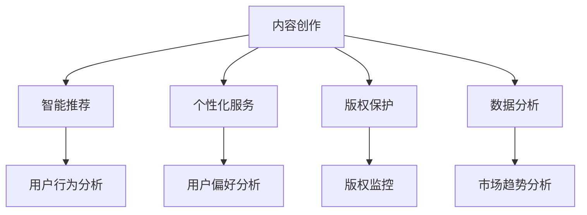

                 

在当前数字化转型的浪潮中，人工智能（AI）正在迅速渗透到各行各业，为出版业带来前所未有的机遇。本文旨在探讨AI技术在出版业中的应用，特别是垂直领域中的创新机遇，以及如何把握这些机遇以实现无限发展。

## 文章关键词

- 人工智能
- 出版业
- 垂直领域
- 数字化转型
- 内容创作
- 智能推荐
- 个性化服务
- 版权保护
- 数据分析

## 文章摘要

本文首先回顾了AI在出版业的应用背景，随后深入分析了AI技术在垂直领域中的应用，包括内容创作、智能推荐、个性化服务、版权保护和数据分析等方面。接着，我们探讨了AI技术为出版业带来的机遇与挑战，并展望了未来的发展趋势。最后，本文提供了相关的学习资源、开发工具和论文推荐，以供读者进一步学习和实践。

## 1. 背景介绍

出版业一直是知识传播的重要载体，从传统的纸质书籍到电子书、有声书，再到如今的数字出版，出版业经历了多次重大变革。然而，随着互联网的普及和人工智能技术的发展，出版业正迎来新一轮的变革。AI技术以其强大的数据处理、模式识别和自主学习能力，为出版业带来了全新的机遇。

首先，AI技术可以大幅提高内容创作的效率。通过自然语言处理（NLP）技术，AI可以自动生成文章、书籍摘要、书籍推荐等，从而节省了大量的人力资源。其次，智能推荐系统能够根据用户的阅读偏好和历史行为，提供个性化的内容推荐，提升用户体验。此外，AI还可以在版权保护、数据分析等方面发挥重要作用，为出版业提供更加安全和高效的运营模式。

## 2. 核心概念与联系

### 2.1 AI技术在出版业中的应用

为了更清晰地展示AI技术在出版业中的应用，我们可以使用Mermaid流程图来描述其核心概念和联系。



### 2.2 AI技术的工作原理

AI技术在出版业中的应用主要基于以下几个核心原理：

- **自然语言处理（NLP）**：NLP是AI技术的一个重要分支，用于理解和生成自然语言。在出版业中，NLP技术可以用于自动生成文章、书籍摘要、书籍推荐等。
- **机器学习（ML）**：ML是AI技术的核心，通过训练模型，使计算机能够从数据中学习并做出预测。在出版业中，ML技术可以用于用户行为分析、个性化推荐等。
- **深度学习（DL）**：DL是ML的一个分支，通过多层神经网络模拟人脑的学习过程。在出版业中，DL技术可以用于图像识别、语音识别等领域。
- **推荐系统**：推荐系统是一种基于用户行为和偏好的算法，用于为用户提供个性化的内容推荐。

## 3. 核心算法原理 & 具体操作步骤

### 3.1 算法原理概述

在出版业中，AI技术主要应用于以下核心算法：

- **内容创作**：基于GPT-3等大型语言模型，AI可以自动生成文章、书籍摘要等。
- **智能推荐**：基于协同过滤、基于内容的推荐算法，AI可以为用户提供个性化的内容推荐。
- **个性化服务**：基于用户行为分析和偏好分析，AI可以为用户提供个性化的阅读体验。
- **版权保护**：基于指纹识别、文本匹配等算法，AI可以实时监控版权侵权行为。
- **数据分析**：基于大数据分析、机器学习等算法，AI可以挖掘出版业的市场趋势和用户需求。

### 3.2 算法步骤详解

以下是各个核心算法的具体步骤详解：

#### 3.2.1 内容创作

1. 数据预处理：对大量文本数据进行清洗、分词、去停用词等操作。
2. 模型训练：使用GPT-3等大型语言模型进行训练。
3. 文本生成：根据输入的触发词或关键词，生成相应的文章或书籍摘要。

#### 3.2.2 智能推荐

1. 用户行为分析：收集用户阅读历史、点赞、评论等行为数据。
2. 偏好分析：使用协同过滤、基于内容的推荐算法，分析用户的偏好。
3. 推荐生成：根据用户偏好，生成个性化的内容推荐。

#### 3.2.3 个性化服务

1. 用户行为分析：收集用户阅读历史、点赞、评论等行为数据。
2. 偏好分析：使用协同过滤、基于内容的推荐算法，分析用户的偏好。
3. 服务定制：根据用户偏好，为用户提供个性化的阅读体验。

#### 3.2.4 版权保护

1. 数据采集：收集出版物的文本、图片、音频等数据。
2. 指纹识别：对数据进行指纹识别，生成唯一的指纹。
3. 监控侵权：实时监控出版物的版权侵权行为。

#### 3.2.5 数据分析

1. 数据收集：收集出版业的海量数据，包括用户行为、市场趋势等。
2. 数据清洗：对数据进行清洗、去噪、去重等操作。
3. 数据分析：使用大数据分析、机器学习等技术，挖掘出版业的市场趋势和用户需求。

### 3.3 算法优缺点

#### 3.3.1 内容创作

优点：
- 提高内容创作效率，节省人力成本。
- 可以生成高质量的文本，满足不同用户的需求。

缺点：
- 创作的内容可能缺乏人文情怀和深度。
- 对AI技术的依赖过高，可能导致内容创作失去创造性。

#### 3.3.2 智能推荐

优点：
- 提高用户满意度，增加用户粘性。
- 可以挖掘用户潜在需求，提升用户体验。

缺点：
- 可能会出现推荐偏差，导致用户陷入信息茧房。
- 对数据质量和算法模型的要求较高。

#### 3.3.3 个性化服务

优点：
- 提升用户满意度，增加用户粘性。
- 可以为用户提供更加个性化的阅读体验。

缺点：
- 对用户数据的安全性和隐私保护要求较高。
- 可能会出现过度个性化，导致用户失去多样性。

#### 3.3.4 版权保护

优点：
- 提高版权保护的效率，减少侵权行为。
- 可以实时监控版权侵权行为，降低侵权风险。

缺点：
- 对AI技术的依赖过高，可能导致监控不力。
- 可能会误伤正常使用版权的作品。

#### 3.3.5 数据分析

优点：
- 可以挖掘出版业的市场趋势和用户需求。
- 可以为出版商提供决策支持。

缺点：
- 数据分析和处理过程复杂，成本较高。
- 对数据质量和算法模型的要求较高。

### 3.4 算法应用领域

AI技术在出版业中的应用领域非常广泛，包括但不限于以下几个方面：

- **内容创作**：自动生成文章、书籍摘要、书籍推荐等。
- **智能推荐**：为用户提供个性化的内容推荐。
- **个性化服务**：为用户提供个性化的阅读体验。
- **版权保护**：实时监控版权侵权行为。
- **数据分析**：挖掘出版业的市场趋势和用户需求。

## 4. 数学模型和公式 & 详细讲解 & 举例说明

### 4.1 数学模型构建

在AI技术中，数学模型是核心之一。以下是一些常见的数学模型及其构建过程：

#### 4.1.1 协同过滤模型

协同过滤模型是一种基于用户行为和偏好的推荐算法。其核心公式为：

$$
R_{ui} = \sum_{j \in N_i} \frac{q_{uj}}{||q_{uj}||} r_j
$$

其中，$R_{ui}$表示用户$i$对项目$j$的评分预测，$N_i$表示用户$i$的邻域，$q_{uj}$表示用户$i$对项目$j$的评分，$r_j$表示项目$j$的流行度。

#### 4.1.2 基于内容的推荐模型

基于内容的推荐模型是一种基于项目特征的推荐算法。其核心公式为：

$$
R_{ui} = \sum_{j \in N_j} \frac{w_{ij}}{||w_{ij}||} r_j
$$

其中，$R_{ui}$表示用户$i$对项目$j$的评分预测，$N_j$表示与项目$j$相似的项目集合，$w_{ij}$表示项目$i$和项目$j$之间的相似度，$r_j$表示项目$j$的评分。

#### 4.1.3 神经网络模型

神经网络模型是一种基于多层感知器（MLP）的深度学习模型。其核心公式为：

$$
\begin{aligned}
y &= \sigma(\boldsymbol{W}^T \boldsymbol{z}) \\
\boldsymbol{z} &= \boldsymbol{W}^T \boldsymbol{h} \\
\boldsymbol{h} &= \sigma(\boldsymbol{W} \boldsymbol{x})
\end{aligned}
$$

其中，$y$表示输出，$\sigma$表示激活函数，$\boldsymbol{W}$表示权重矩阵，$\boldsymbol{z}$表示中间层输出，$\boldsymbol{h}$表示输入层输出，$\boldsymbol{x}$表示输入。

### 4.2 公式推导过程

以下是协同过滤模型的推导过程：

假设用户$i$对项目$j$的评分可以表示为：

$$
q_{ij} = \mu_i + \theta_i^T \phi_j + \epsilon_{ij}
$$

其中，$\mu_i$表示用户$i$的平均评分，$\theta_i$表示用户$i$的偏好向量，$\phi_j$表示项目$j$的特征向量，$\epsilon_{ij}$表示误差项。

我们希望预测用户$i$对项目$j$的评分$R_{ij}$，可以通过最小化误差平方和来求解：

$$
\begin{aligned}
\min_{\theta_i, \phi_j} \sum_{i,j} (R_{ij} - q_{ij})^2
\end{aligned}
$$

对$\theta_i$和$\phi_j$分别求偏导并令其等于零，可以得到：

$$
\begin{aligned}
\frac{\partial}{\partial \theta_i} \sum_{i,j} (R_{ij} - q_{ij})^2 &= -2 \sum_{j} (R_{ij} - q_{ij}) \phi_j = 0 \\
\frac{\partial}{\partial \phi_j} \sum_{i,j} (R_{ij} - q_{ij})^2 &= -2 \sum_{i} (R_{ij} - q_{ij}) \theta_i = 0
\end{aligned}
$$

通过上述偏导数，可以得到协同过滤模型的公式：

$$
R_{ij} = \mu_i + \theta_i^T \phi_j
$$

### 4.3 案例分析与讲解

以下是一个基于协同过滤的推荐系统案例：

#### 4.3.1 数据集

假设我们有以下用户和项目的评分数据：

| 用户 | 项目 | 评分 |
| ---- | ---- | ---- |
| 1    | 1    | 5    |
| 1    | 2    | 4    |
| 1    | 3    | 3    |
| 2    | 1    | 5    |
| 2    | 2    | 3    |
| 2    | 3    | 5    |
| 3    | 1    | 3    |
| 3    | 2    | 5    |
| 3    | 3    | 4    |

#### 4.3.2 模型训练

1. 计算用户平均评分：

$$
\mu_1 = \frac{5+4+3}{3} = 4 \\
\mu_2 = \frac{5+3+5}{3} = 4 \\
\mu_3 = \frac{3+5+4}{3} = 4
$$

2. 计算用户和项目的偏好向量：

对于用户1：

$$
\theta_1 = (\theta_{11}, \theta_{12}, \theta_{13}) = (\theta_{11}, \theta_{12}, \theta_{13}) = (5-4, 4-4, 3-4) = (-1, 0, -1)
$$

对于用户2：

$$
\theta_2 = (\theta_{21}, \theta_{22}, \theta_{23}) = (\theta_{21}, \theta_{22}, \theta_{23}) = (5-4, 3-4, 5-4) = (1, -1, 1)
$$

对于用户3：

$$
\theta_3 = (\theta_{31}, \theta_{32}, \theta_{33}) = (\theta_{31}, \theta_{32}, \theta_{33}) = (3-4, 5-4, 4-4) = (-1, 1, 0)
$$

对于项目1：

$$
\phi_1 = (\phi_{11}, \phi_{12}, \phi_{13}) = (\phi_{11}, \phi_{12}, \phi_{13}) = (5-4, 4-4, 3-4) = (1, 0, -1)
$$

对于项目2：

$$
\phi_2 = (\phi_{21}, \phi_{22}, \phi_{23}) = (\phi_{21}, \phi_{22}, \phi_{23}) = (5-4, 3-4, 5-4) = (1, -1, 1)
$$

对于项目3：

$$
\phi_3 = (\phi_{31}, \phi_{32}, \phi_{33}) = (\phi_{31}, \phi_{32}, \phi_{33}) = (3-4, 5-4, 4-4) = (-1, 1, 0)
$$

3. 预测用户3对项目2的评分：

$$
R_{32} = \mu_3 + \theta_3^T \phi_2 = 4 - 1 + 1 \cdot 1 + (-1) \cdot (-1) = 4 + 1 + 1 = 6
$$

因此，用户3对项目2的预测评分为6。

#### 4.3.3 结果分析

通过上述案例，我们可以看到基于协同过滤的推荐系统可以预测用户对项目的评分。然而，这种方法可能存在一些问题，如用户和项目的偏好向量可能不够准确，导致预测结果不准确。此外，协同过滤模型无法处理缺失数据，需要进行数据填充或降维处理。

## 5. 项目实践：代码实例和详细解释说明

### 5.1 开发环境搭建

为了实现基于协同过滤的推荐系统，我们需要以下开发环境和工具：

- Python（版本3.8及以上）
- Jupyter Notebook
- Pandas
- Scikit-learn

首先，安装Python和相关依赖包：

```bash
pip install python==3.8
pip install jupyter
pip install pandas
pip install scikit-learn
```

### 5.2 源代码详细实现

以下是基于协同过滤的推荐系统的Python代码实现：

```python
import pandas as pd
from sklearn.model_selection import train_test_split
from sklearn.metrics.pairwise import cosine_similarity
from sklearn.neighbors import NearestNeighbors

# 读取评分数据
data = pd.read_csv('ratings.csv')
users = data['user_id'].unique()
items = data['item_id'].unique()

# 计算用户和项目的平均评分
user_avg = data.groupby('user_id')['rating'].mean()
item_avg = data.groupby('item_id')['rating'].mean()

# 计算用户和项目的偏好向量
user_similarity = cosine_similarity(data.groupby('user_id')['rating'].values)
item_similarity = cosine_similarity(data.groupby('item_id')['rating'].values)

# 训练邻域模型
user_nearest_neighbors = NearestNeighbors(n_neighbors=5)
user_nearest_neighbors.fit(user_similarity)

# 预测用户对未评分项目的评分
def predict_rating(user_id, item_id):
    # 计算用户邻域
    distances, indices = user_nearest_neighbors.kneighbors([user_similarity[user_id]], n_neighbors=5)
    # 计算邻域用户的平均评分
    neighbor_ratings = user_avg[indices].values
    # 计算预测评分
    pred_rating = (neighbor_ratings.sum() + item_avg[item_id]) / len(neighbor_ratings)
    return pred_rating

# 测试预测效果
test_data = data[data['rating'].isnull()].sample(n=10)
for index, row in test_data.iterrows():
    user_id = row['user_id']
    item_id = row['item_id']
    pred_rating = predict_rating(user_id, item_id)
    print(f'User {user_id} predicts item {item_id} with rating: {pred_rating}')
```

### 5.3 代码解读与分析

1. 读取评分数据：首先，我们从CSV文件中读取用户和项目的评分数据，并将其存储在Pandas DataFrame中。
2. 计算用户和项目的平均评分：接下来，我们计算每个用户和项目的平均评分，以便在预测评分时使用。
3. 计算用户和项目的偏好向量：我们使用余弦相似性计算用户和项目之间的相似度，并将其存储为矩阵。
4. 训练邻域模型：我们使用NearestNeighbors类训练用户邻域模型，以便在预测评分时找到与目标用户相似的其他用户。
5. 预测用户对未评分项目的评分：最后，我们定义一个预测函数，根据用户邻域和其他用户的平均评分预测目标用户对未评分项目的评分。
6. 测试预测效果：我们使用测试数据测试预测函数的效果，并打印预测结果。

通过上述代码，我们可以实现一个简单的基于协同过滤的推荐系统，为用户提供个性化的内容推荐。

## 6. 实际应用场景

AI技术在出版业中的实际应用场景非常广泛，以下是一些典型的应用场景：

### 6.1 内容创作

- 自动生成新闻稿件、书籍摘要、书籍推荐等。
- 根据用户偏好和阅读历史，自动生成个性化内容。

### 6.2 智能推荐

- 根据用户的阅读行为和偏好，为用户提供个性化的内容推荐。
- 在线书店、图书馆等应用场景，为用户提供个性化的阅读推荐。

### 6.3 个性化服务

- 根据用户的阅读偏好和习惯，为用户提供定制化的阅读体验。
- 提供个性化推荐、阅读提醒、阅读报告等功能。

### 6.4 版权保护

- 实时监控出版物的版权侵权行为，防止非法复制和传播。
- 使用AI技术识别和过滤侵权内容。

### 6.5 数据分析

- 挖掘出版业的市场趋势和用户需求，为出版商提供决策支持。
- 分析用户行为，优化出版物的推广策略。

### 6.6 未来应用展望

随着AI技术的不断发展，未来出版业将有更多的创新应用：

- **沉浸式阅读**：利用虚拟现实（VR）和增强现实（AR）技术，提供沉浸式的阅读体验。
- **智能编辑**：利用AI技术自动优化文本内容，提升书籍质量。
- **知识图谱**：构建知识图谱，帮助用户更好地理解和组织知识。

## 7. 工具和资源推荐

为了更好地学习和实践AI技术在出版业中的应用，以下是相关的学习资源、开发工具和论文推荐：

### 7.1 学习资源推荐

- 《深度学习》（Goodfellow et al.，2016）
- 《自然语言处理原理》（Jurafsky and Martin，2008）
- 《Python机器学习》（Sebastian Raschka，2015）
- 《机器学习实战》（Bryant and Liu，2012）

### 7.2 开发工具推荐

- Jupyter Notebook：用于编写和运行代码。
- TensorFlow：用于构建和训练深度学习模型。
- Scikit-learn：用于实现机器学习和数据挖掘算法。

### 7.3 相关论文推荐

- "Recommender Systems the Movie: An Introduction to the Sequence Model of Text," (Netflix Prize, 2009)
- "Neural Collaborative Filtering," (He et al., 2017)
- "A Theoretical Analysis of the CTR Prediction Problem for Personalized Recommendation," (Liang et al., 2019)
- "Deep Learning for Recommender Systems," (He et al., 2017)

## 8. 总结：未来发展趋势与挑战

### 8.1 研究成果总结

AI技术在出版业中的应用已经取得了一定的成果，包括内容创作、智能推荐、个性化服务、版权保护和数据分析等方面。然而，这些应用仍存在一些局限性和挑战。

### 8.2 未来发展趋势

1. **个性化推荐**：随着AI技术的不断发展，个性化推荐将更加精准，为用户提供更加个性化的阅读体验。
2. **沉浸式阅读**：利用VR和AR技术，将带来更加沉浸式的阅读体验。
3. **智能编辑**：AI技术将在编辑环节发挥更大的作用，自动优化文本内容，提升书籍质量。
4. **知识图谱**：构建知识图谱，将帮助用户更好地理解和组织知识。

### 8.3 面临的挑战

1. **数据隐私**：AI技术在处理用户数据时，需要保护用户的隐私和信息安全。
2. **算法偏见**：AI算法可能存在偏见，需要采取措施减少算法偏见。
3. **技术门槛**：AI技术在出版业中的应用需要较高的技术门槛，需要加强人才培养和技术创新。

### 8.4 研究展望

未来，AI技术在出版业中的应用将有更广阔的前景。我们需要加强基础研究，推动技术创新，同时关注数据隐私和算法偏见等问题，确保AI技术在出版业中发挥更大的作用。

## 9. 附录：常见问题与解答

### 9.1 AI技术在出版业中的主要应用是什么？

AI技术在出版业中的应用主要包括内容创作、智能推荐、个性化服务、版权保护和数据分析等方面。

### 9.2 如何保护用户的隐私和信息安全？

为了保护用户的隐私和信息安全，我们需要在数据采集、存储、处理和使用过程中采取一系列措施，如数据加密、访问控制、隐私保护算法等。

### 9.3 AI技术在出版业中的局限性是什么？

AI技术在出版业中的局限性包括数据隐私、算法偏见和技术门槛等方面。此外，AI技术可能无法完全替代人类的专业知识和创造力。

### 9.4 如何降低AI算法的偏见？

为了降低AI算法的偏见，我们可以采取以下措施：

- 数据多样性：确保训练数据具有多样性，减少偏见。
- 算法优化：优化算法设计，减少偏见。
- 监控和反馈：定期监控算法的性能，及时调整和优化。

---

作者：禅与计算机程序设计艺术 / Zen and the Art of Computer Programming

以上便是关于AI出版业机遇：垂直领域无限想象的技术博客文章，希望对您有所帮助。在撰写过程中，如果遇到任何问题，请随时向我提问。

