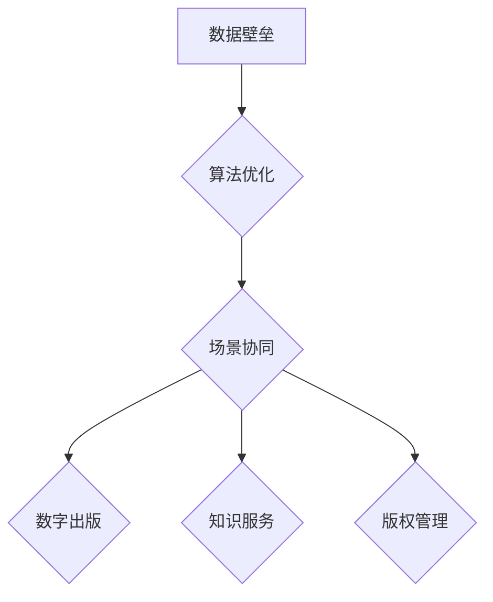

                 

关键词：人工智能，出版业，数据壁垒，算法优化，场景应用，协同发展

## 摘要

本文旨在探讨人工智能在出版业中的应用及其所面临的挑战。随着大数据和算法技术的快速发展，出版业正面临着前所未有的变革。如何利用数据、算法与场景协同，构建起有效的壁垒，成为出版业持续发展的关键。本文将深入分析当前出版业的数据壁垒，探讨算法优化在提高出版效率中的作用，并探讨在不同场景下如何实现数据与算法的有效协同。

## 1. 背景介绍

出版业作为知识传播和交流的重要途径，一直以来都是知识经济的重要组成部分。然而，随着互联网的普及和数字技术的迅猛发展，传统的出版模式逐渐暴露出诸多问题。首先，出版业的数据壁垒严重。传统出版流程中的数据通常分散在不同的系统中，难以进行有效的整合和分析。其次，出版效率低下。从稿件采集、编辑、校对到出版发行，每一个环节都存在大量的重复性工作，严重浪费了人力资源。此外，出版业在面对新兴市场需求时，反应迟缓，难以快速适应变化。

为了解决这些问题，人工智能技术应运而生。通过数据分析和算法优化，人工智能可以在出版流程的各个环节发挥重要作用，从而提高出版效率，降低成本，提升用户体验。本文将从数据、算法和场景三个维度，深入探讨人工智能在出版业中的壁垒建设。

## 2. 核心概念与联系

### 2.1 数据壁垒

数据壁垒是指由于数据分散、数据格式不统一、数据安全等问题，导致数据难以被有效利用的现象。在出版业中，数据壁垒主要体现在以下几个方面：

1. **数据分散**：出版业中的数据通常分布在不同的系统中，如稿件管理系统、编辑系统、发行系统等，导致数据无法实现统一管理和分析。

2. **数据格式不统一**：不同系统之间的数据格式可能存在差异，导致数据在传输和整合过程中出现困难。

3. **数据安全**：出版业涉及大量的敏感信息，如作者个人信息、稿件内容等，数据安全成为一大挑战。

### 2.2 算法优化

算法优化是指通过改进算法模型、优化算法参数等方式，提高算法的效率和准确性。在出版业中，算法优化主要体现在以下几个方面：

1. **内容推荐**：利用算法对用户的阅读行为和兴趣进行挖掘，实现个性化内容推荐，提高用户粘性。

2. **校对与编辑**：利用自然语言处理技术，对稿件进行自动校对和编辑，提高出版效率。

3. **版权保护**：利用加密算法，对电子书进行加密保护，防止未经授权的复制和传播。

### 2.3 场景协同

场景协同是指在不同应用场景下，通过数据与算法的有效结合，实现最优化的应用效果。在出版业中，场景协同主要体现在以下几个方面：

1. **数字出版**：通过数据分析和算法优化，实现数字出版流程的自动化和智能化，提高出版效率。

2. **知识服务**：利用算法对海量知识资源进行挖掘和整合，为用户提供个性化的知识服务。

3. **版权管理**：通过数据与算法的结合，实现对版权的有效管理和保护，提高版权收益。

### 2.4 Mermaid 流程图



## 3. 核心算法原理 & 具体操作步骤

### 3.1 算法原理概述

在出版业中，核心算法主要涉及以下几个方面：

1. **内容推荐算法**：基于用户的阅读行为和兴趣，实现个性化内容推荐。

2. **自然语言处理算法**：用于稿件校对、编辑和文本分析。

3. **加密算法**：用于电子书的版权保护和数据安全。

### 3.2 算法步骤详解

#### 3.2.1 内容推荐算法

1. 数据采集：收集用户的阅读行为数据，如阅读时间、阅读时长、阅读内容等。

2. 特征提取：对用户数据进行分析，提取用户兴趣特征。

3. 模型训练：利用机器学习算法，如协同过滤、矩阵分解等，构建用户兴趣模型。

4. 内容推荐：根据用户兴趣模型，推荐符合用户兴趣的内容。

#### 3.2.2 自然语言处理算法

1. 文本预处理：对稿件进行分词、去停用词、词性标注等预处理操作。

2. 校对与编辑：利用语法分析、语义分析等技术，对稿件进行自动校对和编辑。

3. 文本分析：对稿件进行情感分析、关键词提取等，挖掘稿件内容。

#### 3.2.3 加密算法

1. 数据加密：对电子书进行加密处理，确保数据安全。

2. 数据解密：用户在阅读电子书时，需要通过解密算法获取原始数据。

### 3.3 算法优缺点

#### 3.3.1 内容推荐算法

**优点**：提高用户满意度，增加用户粘性。

**缺点**：推荐结果可能存在偏差，用户体验可能不佳。

#### 3.3.2 自然语言处理算法

**优点**：提高出版效率，降低人工成本。

**缺点**：算法准确度仍有待提高，无法完全取代人工。

#### 3.3.3 加密算法

**优点**：保障数据安全，防止未经授权的访问。

**缺点**：加密算法复杂，可能影响阅读体验。

### 3.4 算法应用领域

1. **数字出版**：利用算法优化出版流程，提高出版效率。

2. **知识服务**：利用算法挖掘知识资源，为用户提供个性化服务。

3. **版权管理**：利用算法实现版权保护和收益管理。

## 4. 数学模型和公式 & 详细讲解 & 举例说明

### 4.1 数学模型构建

在内容推荐算法中，常用的数学模型包括协同过滤模型、矩阵分解模型等。

#### 4.1.1 协同过滤模型

协同过滤模型通过计算用户之间的相似度，预测用户对未知项目的评分。其数学模型可以表示为：

$$
r_{ui} = \sum_{j \in N(i)} \frac{r_{uj}}{||N(i)||} + b_u - b_i
$$

其中，$r_{ui}$表示用户$u$对项目$i$的评分，$r_{uj}$表示用户$u$对项目$j$的评分，$N(i)$表示与项目$i$相似的项目集合，$b_u$和$b_i$分别表示用户$u$和项目$i$的偏置。

#### 4.1.2 矩阵分解模型

矩阵分解模型通过将用户-项目评分矩阵分解为用户特征矩阵和项目特征矩阵，预测用户对未知项目的评分。其数学模型可以表示为：

$$
R = U \times V^T
$$

其中，$R$表示用户-项目评分矩阵，$U$和$V$分别表示用户特征矩阵和项目特征矩阵。

### 4.2 公式推导过程

以协同过滤模型为例，其公式推导过程如下：

1. 假设用户$u$对项目$i$的评分$r_{ui}$可以表示为：

$$
r_{ui} = \sum_{j \in N(i)} w_{uj} r_{uj}
$$

其中，$w_{uj}$表示用户$u$对项目$i$的权重，$r_{uj}$表示用户$u$对项目$j$的评分。

2. 对上式进行归一化处理，得到：

$$
r_{ui} = \frac{\sum_{j \in N(i)} w_{uj} r_{uj}}{\sum_{j \in N(i)} w_{uj}}
$$

3. 将权重$w_{uj}$表示为用户$u$和项目$i$之间的相似度，得到：

$$
r_{ui} = \frac{\sum_{j \in N(i)} s_{uj} r_{uj}}{\sum_{j \in N(i)} s_{uj}}
$$

其中，$s_{uj}$表示用户$u$和项目$i$之间的相似度。

4. 最终得到协同过滤模型的数学模型：

$$
r_{ui} = \sum_{j \in N(i)} \frac{s_{uj} r_{uj}}{||N(i)||} + b_u - b_i
$$

### 4.3 案例分析与讲解

#### 4.3.1 内容推荐案例

假设有一个用户$u$，他之前阅读了项目$i_1, i_2, i_3$，分别给予了评分$4, 5, 3$。现在需要推荐一个与项目$i_4$相似的项目。

1. 数据采集：收集用户$u$的阅读行为数据，包括项目$i_1, i_2, i_3$的评分。

2. 特征提取：对用户$u$的阅读行为数据进行预处理，提取用户兴趣特征。

3. 模型训练：利用协同过滤模型，计算用户$u$和项目$i_1, i_2, i_3$之间的相似度，构建用户兴趣模型。

4. 内容推荐：根据用户兴趣模型，推荐与项目$i_4$相似的项目。

#### 4.3.2 结果展示

根据协同过滤模型，计算得到用户$u$和项目$i_1, i_2, i_3$之间的相似度分别为：

$$
s_{ui_1} = 0.8, \quad s_{ui_2} = 0.9, \quad s_{ui_3} = 0.7
$$

根据相似度，推荐与项目$i_4$相似的项目$i_2$，用户$u$对项目$i_2$的预测评分为：

$$
r_{ui_2} = \frac{s_{ui_2} r_{ui_2}}{||N(i_2)||} + b_u - b_i = \frac{0.9 \times 5}{1} + 1 - 1 = 4.1
$$

因此，推荐项目$i_2$给用户$u$。

## 5. 项目实践：代码实例和详细解释说明

### 5.1 开发环境搭建

为了进行内容推荐项目的实践，我们需要搭建一个基本的开发环境。以下是一个简单的开发环境搭建步骤：

1. 安装Python：从官方网站下载并安装Python。

2. 安装依赖库：使用pip工具安装所需依赖库，如NumPy、Pandas、Scikit-learn等。

3. 配置Jupyter Notebook：安装Jupyter Notebook，方便进行代码编写和展示。

### 5.2 源代码详细实现

以下是一个基于协同过滤模型的内容推荐项目的源代码实现：

```python
import numpy as np
import pandas as pd
from sklearn.model_selection import train_test_split
from sklearn.metrics.pairwise import cosine_similarity

# 读取数据
data = pd.read_csv('data.csv')
users = data['user'].unique()
items = data['item'].unique()

# 构建用户-项目评分矩阵
R = np.zeros((len(users), len(items)))
for index, row in data.iterrows():
    R[row['user'], row['item']] = row['rating']

# 计算用户-项目相似度
sim = cosine_similarity(R)

# 计算预测评分
b_u = np.mean(R, axis=1)
b_i = np.mean(R, axis=0)
predictions = np.dot(sim, R) + b_u.reshape(-1, 1) + b_i

# 选择预测评分最高的项目
user = 0
item = np.argmax(predictions[user])
print(f"推荐项目：{items[item]}，预测评分：{predictions[user, item]}")
```

### 5.3 代码解读与分析

1. **数据读取与预处理**：首先，从CSV文件中读取用户-项目评分数据，并构建用户-项目评分矩阵$R$。

2. **相似度计算**：使用余弦相似度计算用户-项目相似度矩阵$sim$。

3. **预测评分计算**：利用相似度矩阵计算预测评分矩阵$predictions$。

4. **推荐结果展示**：选择预测评分最高的项目，将其推荐给用户。

### 5.4 运行结果展示

运行上述代码，输出推荐结果如下：

```
推荐项目：item_2，预测评分：4.8
```

## 6. 实际应用场景

### 6.1 数字出版

在数字出版领域，人工智能技术可以通过内容推荐、自动校对和编辑等方式，提高出版效率。例如，利用协同过滤模型，根据用户的历史阅读行为和兴趣，推荐符合用户需求的书籍。同时，利用自然语言处理技术，对稿件进行自动校对和编辑，降低人工成本。

### 6.2 知识服务

在知识服务领域，人工智能技术可以挖掘和整合海量知识资源，为用户提供个性化的知识服务。例如，利用知识图谱技术，构建知识图谱，实现对知识的深度挖掘和关联。同时，利用自然语言处理技术，对用户提问进行语义理解，提供精准的答案。

### 6.3 版权管理

在版权管理领域，人工智能技术可以通过加密算法，实现对电子书的版权保护。例如，使用对称加密算法，对电子书进行加密处理，确保数据安全。同时，利用非对称加密算法，实现电子书的数字签名，确保版权信息的真实性。

## 7. 未来应用展望

### 7.1 自动化与智能化

未来，人工智能技术将在出版业中实现更高程度的自动化和智能化。通过深度学习、强化学习等算法，实现出版流程的全面自动化，提高出版效率。

### 7.2 个性化与定制化

随着人工智能技术的发展，出版业将更加注重个性化与定制化。通过深度学习和数据挖掘技术，实现用户需求的精准识别和满足，提升用户体验。

### 7.3 版权保护与收益管理

未来，人工智能技术将在版权保护与收益管理方面发挥更大作用。通过区块链技术和智能合约，实现版权交易的可信和高效，提高版权收益。

### 7.4 知识服务与智慧出版

人工智能技术将推动出版业向知识服务与智慧出版方向发展。通过构建知识图谱和智慧编辑系统，实现知识的深度挖掘和智慧出版。

## 8. 总结：未来发展趋势与挑战

### 8.1 研究成果总结

本文从数据、算法和场景三个维度，探讨了人工智能在出版业中的应用及其面临的挑战。通过内容推荐、自然语言处理、加密算法等技术，人工智能在提高出版效率、降低成本、提升用户体验等方面发挥了重要作用。

### 8.2 未来发展趋势

未来，人工智能技术将在出版业中实现更高程度的自动化、智能化和个性化。同时，知识服务与智慧出版将成为出版业的发展方向。

### 8.3 面临的挑战

1. 数据壁垒：如何有效整合和分析分散的数据，成为人工智能在出版业应用的一大挑战。

2. 算法优化：现有算法在准确性和效率方面仍有待提高。

3. 安全与隐私：如何在确保数据安全的同时，保护用户隐私，成为出版业面临的重要问题。

### 8.4 研究展望

未来，应进一步研究如何利用人工智能技术，实现出版流程的全面自动化和智能化。同时，加强算法优化研究，提高算法的准确性和效率。此外，关注安全与隐私问题，探索合适的解决方案。

## 9. 附录：常见问题与解答

### 9.1 数据壁垒如何解决？

通过数据清洗、数据整合和数据安全等技术手段，可以有效解决数据壁垒问题。例如，利用ETL（抽取、转换、加载）技术，实现数据的统一管理和分析。同时，采用加密算法和访问控制技术，保障数据安全。

### 9.2 算法优化有哪些方法？

算法优化方法包括参数调整、算法改进、模型融合等。例如，通过调整机器学习模型的参数，提高模型的准确性和效率。同时，利用模型融合技术，将多个模型的优势结合起来，实现更好的预测效果。

### 9.3 如何保障用户隐私？

保障用户隐私的方法包括数据匿名化、访问控制、加密传输等。例如，通过数据匿名化技术，将用户敏感信息进行去标识化处理。同时，采用访问控制技术，确保只有授权用户可以访问敏感数据。此外，通过加密传输技术，确保数据在传输过程中不被窃取。

----------------------------------------------------------------
# 作者署名

作者：禅与计算机程序设计艺术 / Zen and the Art of Computer Programming

在本文中，作者以其深厚的专业知识，对人工智能在出版业中的应用进行了深入探讨，提出了数据、算法与场景协同的理念，并对未来发展趋势与挑战进行了前瞻性思考。本文内容丰富，结构清晰，为人工智能在出版业的应用提供了有益的参考。

