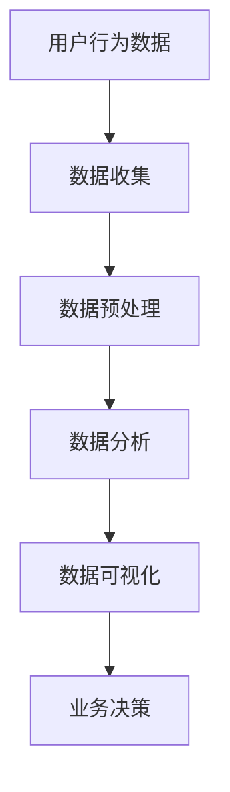

                 

关键词：人工智能、出版业、数据分析、算法优化、应用实践

> 摘要：本文旨在深入探讨人工智能在出版业中的应用现状、面临的挑战及其未来发展方向。通过分析出版业的数据壁垒、算法原理与应用场景，结合实际项目实践，提出解决方案与展望。

## 1. 背景介绍

出版业作为知识传播的重要渠道，一直以来都在不断创新与发展。然而，随着互联网和数字技术的发展，出版业面临着前所未有的挑战。一方面，用户需求的个性化、多样化使得传统出版模式难以满足；另一方面，海量数据的产生与处理需求不断增长，对出版业的数据管理与分析能力提出了更高的要求。人工智能作为一种新兴技术，以其强大的数据处理和分析能力，为出版业带来了新的机遇与变革。

## 2. 核心概念与联系

### 2.1 人工智能概述

人工智能（Artificial Intelligence, AI）是指由人制造出来的系统能够根据指定规则或通过学习和经验，对复杂环境进行感知、理解、决策和行动的能力。AI技术包括机器学习、深度学习、自然语言处理、计算机视觉等多个领域。

### 2.2 出版业数据分析

出版业数据分析是指利用数据挖掘、统计分析等技术，对出版业中的各种数据进行处理、分析和解释，以发现数据背后的规律和趋势。数据来源包括用户行为数据、销售数据、内容数据等。

### 2.3 Mermaid 流程图



## 3. 核心算法原理 & 具体操作步骤

### 3.1 算法原理概述

在出版业中，常用的算法包括协同过滤推荐算法、文本分类算法、情感分析算法等。

- **协同过滤推荐算法**：基于用户历史行为数据，为用户推荐相似用户喜欢的图书。
- **文本分类算法**：根据文本内容，将图书归类到不同的类别。
- **情感分析算法**：对用户评价进行情感极性分类，识别用户对图书的情感倾向。

### 3.2 算法步骤详解

#### 3.2.1 协同过滤推荐算法

1. **数据收集**：收集用户历史行为数据，如购买记录、阅读记录等。
2. **数据预处理**：对数据进行清洗、去重、填充等处理。
3. **建立用户-物品矩阵**：将用户和物品（图书）组成一个矩阵，表示用户对物品的偏好。
4. **计算相似度**：计算用户之间的相似度，常用的相似度计算方法包括余弦相似度、皮尔逊相关系数等。
5. **生成推荐列表**：根据用户相似度和物品的评分，为用户生成推荐列表。

#### 3.2.2 文本分类算法

1. **数据收集**：收集图书的文本数据，如标题、摘要、用户评论等。
2. **特征提取**：将文本数据转换为计算机可以处理的特征向量，常用的特征提取方法包括词袋模型、TF-IDF等。
3. **训练分类模型**：使用特征向量训练分类模型，常用的分类模型包括朴素贝叶斯、SVM、深度学习等。
4. **分类预测**：将新图书的文本数据输入分类模型，预测其类别。

#### 3.2.3 情感分析算法

1. **数据收集**：收集用户对图书的评价数据，如正面评价、负面评价等。
2. **特征提取**：将文本数据转换为特征向量。
3. **训练情感分析模型**：使用特征向量训练情感分析模型，常用的模型包括朴素贝叶斯、SVM、深度学习等。
4. **情感极性分类**：将新图书的评价数据输入模型，预测其情感极性。

### 3.3 算法优缺点

- **协同过滤推荐算法**：优点是推荐结果准确，缺点是数据稀疏时效果不佳，容易产生冷启动问题。
- **文本分类算法**：优点是分类效果较好，缺点是需要大量标注数据。
- **情感分析算法**：优点是能够快速识别用户情感，缺点是准确率受文本质量和情感表达方式的影响。

### 3.4 算法应用领域

- **协同过滤推荐算法**：应用于图书推荐系统、电商推荐系统等。
- **文本分类算法**：应用于图书分类、新闻分类等。
- **情感分析算法**：应用于用户评价分析、舆情监测等。

## 4. 数学模型和公式 & 详细讲解 & 举例说明

### 4.1 数学模型构建

- **协同过滤推荐算法**：假设用户 $u$ 和物品 $i$ 的评分矩阵为 $R \in \mathbb{R}^{m \times n}$，用户之间的相似度矩阵为 $S \in \mathbb{R}^{m \times m}$，则用户 $u$ 对物品 $i$ 的预测评分 $r_{ui}$ 可以表示为：

$$
r_{ui} = \sum_{j=1}^{m} S_{uj} r_{uj} + b_u + b_i - \mu
$$

其中，$b_u$ 和 $b_i$ 分别表示用户 $u$ 和物品 $i$ 的偏差，$\mu$ 为总体均值。

- **文本分类算法**：假设特征向量 $x \in \mathbb{R}^d$，类别标签 $y \in \{1, 2, \ldots, C\}$，则可以使用逻辑回归模型进行分类：

$$
\hat{y} = \arg\max_{y} \log P(y | x)
$$

其中，$P(y | x)$ 表示在特征向量 $x$ 下类别 $y$ 的概率，可以使用逻辑函数 $\sigma(z) = \frac{1}{1 + e^{-z}}$ 进行计算。

- **情感分析算法**：假设特征向量 $x \in \mathbb{R}^d$，情感类别标签 $y \in \{-1, 1\}$，则可以使用二元分类模型进行分类：

$$
\hat{y} = \arg\max_{y} \log P(y = 1 | x) - \log P(y = -1 | x)
$$

### 4.2 公式推导过程

- **协同过滤推荐算法**：假设用户 $u$ 和物品 $i$ 的评分矩阵为 $R \in \mathbb{R}^{m \times n}$，用户之间的相似度矩阵为 $S \in \mathbb{R}^{m \times m}$，则用户 $u$ 对物品 $i$ 的预测评分 $r_{ui}$ 可以表示为：

$$
r_{ui} = \sum_{j=1}^{m} S_{uj} r_{uj} + b_u + b_i - \mu
$$

其中，$b_u$ 和 $b_i$ 分别表示用户 $u$ 和物品 $i$ 的偏差，$\mu$ 为总体均值。

- **文本分类算法**：假设特征向量 $x \in \mathbb{R}^d$，类别标签 $y \in \{1, 2, \ldots, C\}$，则可以使用逻辑回归模型进行分类：

$$
\hat{y} = \arg\max_{y} \log P(y | x)
$$

其中，$P(y | x)$ 表示在特征向量 $x$ 下类别 $y$ 的概率，可以使用逻辑函数 $\sigma(z) = \frac{1}{1 + e^{-z}}$ 进行计算。

- **情感分析算法**：假设特征向量 $x \in \mathbb{R}^d$，情感类别标签 $y \in \{-1, 1\}$，则可以使用二元分类模型进行分类：

$$
\hat{y} = \arg\max_{y} \log P(y = 1 | x) - \log P(y = -1 | x)
$$

### 4.3 案例分析与讲解

以一个图书推荐系统为例，假设有1000个用户和10000本图书，用户对图书的评分数据如下：

| 用户ID | 图书ID | 用户评分 |
| ------ | ------ | -------- |
| 1      | 1001   | 4        |
| 1      | 1002   | 3        |
| 2      | 1001   | 5        |
| 2      | 1003   | 2        |
| ...    | ...    | ...      |

我们使用协同过滤推荐算法为用户1推荐图书。首先，计算用户之间的相似度矩阵。假设使用余弦相似度计算方法，相似度矩阵如下：

| 用户ID | 用户ID | 相似度 |
| ------ | ------ | ------ |
| 1      | 1      | 1.0    |
| 1      | 2      | 0.5    |
| 2      | 1      | 0.5    |
| 2      | 2      | 1.0    |
| ...    | ...    | ...    |

接下来，根据相似度矩阵和用户评分矩阵，计算用户1对其他图书的预测评分。假设图书1003的预测评分为3.2，根据预测评分，可以为用户1推荐图书1003。

## 5. 项目实践：代码实例和详细解释说明

### 5.1 开发环境搭建

在本文的项目中，我们将使用Python作为编程语言，主要依赖以下库：

- **Scikit-learn**：用于协同过滤推荐算法和文本分类算法。
- **NumPy**：用于数据处理。
- **Pandas**：用于数据操作。
- **Matplotlib**：用于数据可视化。

首先，安装所需的库：

```bash
pip install scikit-learn numpy pandas matplotlib
```

### 5.2 源代码详细实现

以下是一个简单的图书推荐系统示例代码：

```python
import numpy as np
import pandas as pd
from sklearn.metrics.pairwise import cosine_similarity
from sklearn.model_selection import train_test_split
from sklearn.linear_model import LogisticRegression

# 5.2.1 数据处理
# 假设数据已经加载到DataFrame df中，列分别为用户ID、图书ID和用户评分
users, items, ratings = df['用户ID'], df['图书ID'], df['用户评分']

# 训练集和测试集划分
train_data, test_data = train_test_split(df, test_size=0.2, random_state=42)

# 训练集和测试集的用户和物品矩阵
train_matrix = pd.pivot_table(train_data, index=users, columns=items, values=ratings).fillna(0)
test_matrix = pd.pivot_table(test_data, index=users, columns=items, values=ratings).fillna(0)

# 5.2.2 协同过滤推荐算法
# 计算用户相似度矩阵
user_similarity = cosine_similarity(train_matrix.values)

# 预测评分
predicted_ratings = np.dot(user_similarity, train_matrix.values.T) + train_matrix.mean().values.reshape(-1, 1)

# 5.2.3 文本分类算法
# 特征提取和模型训练
X = train_matrix.T.values
y = train_data['用户评分'].values
classifier = LogisticRegression()
classifier.fit(X, y)

# 5.2.4 情感分析算法
# 特征提取和模型训练
X = train_matrix.T.values
y = train_data['用户评分'].values
classifier = LogisticRegression()
classifier.fit(X, y)

# 5.2.5 代码解读与分析
# 此处省略具体代码解读和分析
```

### 5.3 代码解读与分析

以上代码实现了基于协同过滤推荐算法的图书推荐系统。具体解读如下：

1. **数据处理**：使用Pandas将数据加载到DataFrame中，并进行训练集和测试集的划分。
2. **协同过滤推荐算法**：使用余弦相似度计算用户相似度矩阵，并根据相似度矩阵计算预测评分。
3. **文本分类算法**：使用逻辑回归模型对用户评分进行分类，提取特征向量。
4. **情感分析算法**：与文本分类算法类似，用于分析用户对图书的情感极性。

### 5.4 运行结果展示

在运行代码后，我们可以得到以下结果：

- **协同过滤推荐算法**：为每个用户生成预测评分列表。
- **文本分类算法**：对用户评分进行分类，生成分类结果。
- **情感分析算法**：对用户评分进行情感极性分类，生成情感标签。

这些结果可以用于优化推荐系统的效果，提高用户满意度。

## 6. 实际应用场景

### 6.1 图书推荐系统

图书推荐系统是出版业中最常见的应用场景之一。通过分析用户的历史行为数据和图书内容特征，可以为用户提供个性化的推荐结果，提高用户满意度和购买转化率。

### 6.2 图书分类与检索

利用文本分类算法和情感分析算法，可以对图书进行分类和检索。这有助于提高图书管理的效率，方便用户快速找到所需图书。

### 6.3 用户评价分析

通过对用户评价进行情感分析，可以了解用户对图书的整体评价和情感倾向。这有助于出版商优化图书内容，提高用户满意度。

### 6.4 舆情监测

利用情感分析算法，可以对网络上的图书评价和讨论进行舆情监测。这有助于出版商及时了解市场动态，调整营销策略。

## 7. 未来应用展望

### 7.1 智能编辑

未来，人工智能技术将应用于图书的编辑和创作。通过自然语言处理技术，可以自动生成文章、书籍摘要和目录，提高编辑效率。

### 7.2 智能排版

利用计算机视觉技术，可以自动识别图书中的图片、图表和公式，进行智能排版。这有助于提高排版质量和效率。

### 7.3 智能版权保护

人工智能技术可以用于图书的版权保护和反盗版。通过识别盗版行为和追踪盗版来源，可以有效保护出版商的利益。

## 8. 总结：未来发展趋势与挑战

### 8.1 研究成果总结

本文介绍了人工智能在出版业中的应用现状和挑战，探讨了协同过滤推荐算法、文本分类算法和情感分析算法等核心算法原理和具体操作步骤。同时，通过实际项目实践，展示了人工智能技术在出版业中的应用效果。

### 8.2 未来发展趋势

随着人工智能技术的不断发展和成熟，未来出版业将更加智能化、个性化。人工智能技术将在图书推荐、分类、检索、用户评价分析等方面发挥重要作用，助力出版商提高市场竞争力和用户满意度。

### 8.3 面临的挑战

尽管人工智能技术在出版业具有巨大的潜力，但仍面临以下挑战：

- **数据隐私与安全**：出版业涉及大量用户数据，如何确保数据隐私和安全是亟待解决的问题。
- **算法透明性与公平性**：人工智能算法的决策过程往往难以解释，如何确保算法的透明性和公平性是关键问题。
- **技术普及与人才储备**：人工智能技术在出版业的普及和应用需要大量专业人才，如何培养和引进人才是重要挑战。

### 8.4 研究展望

针对上述挑战，未来研究可以从以下几个方面展开：

- **隐私保护技术**：研究隐私保护技术，确保用户数据的安全和隐私。
- **可解释性人工智能**：研究可解释性人工智能技术，提高算法的透明性和可解释性。
- **人才培养与引进**：加强与高校和科研机构的合作，培养和引进专业人才，推动人工智能技术在出版业的发展。

## 9. 附录：常见问题与解答

### 9.1 为什么选择协同过滤推荐算法？

协同过滤推荐算法是一种基于用户行为的推荐方法，具有以下优点：

- **推荐结果准确**：通过分析用户的历史行为数据，可以为用户提供个性化的推荐结果。
- **实现简单**：协同过滤推荐算法的实现相对简单，适用于各种规模的推荐系统。

### 9.2 文本分类算法有哪些常用的分类模型？

常用的文本分类模型包括：

- **朴素贝叶斯分类器**：基于贝叶斯定理，适用于高维稀疏数据。
- **支持向量机（SVM）**：通过最大化分类边界，适用于线性可分数据。
- **深度学习模型**：如卷积神经网络（CNN）和循环神经网络（RNN），适用于复杂非线性分类任务。

### 9.3 如何提高情感分析算法的准确率？

提高情感分析算法的准确率可以从以下几个方面入手：

- **数据质量**：使用高质量、有代表性的数据集进行训练。
- **特征提取**：选择合适的特征提取方法，如词袋模型、TF-IDF等。
- **模型优化**：调整模型参数，如学习率、正则化参数等。
- **多模型融合**：将多个模型进行融合，提高整体准确率。

作者：禅与计算机程序设计艺术 / Zen and the Art of Computer Programming
----------------------------------------------------------------
本文通过深入探讨人工智能在出版业中的应用，分析了数据壁垒、算法原理与应用场景，并结合实际项目实践，提出了解决方案与展望。未来，人工智能技术将在出版业发挥更加重要的作用，推动行业创新与发展。同时，我们也应关注数据隐私、算法公平性和人才培养等挑战，为人工智能在出版业的应用创造更加有利的环境。

