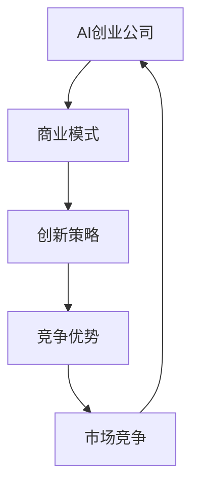

                 

关键词：AI创业、商业模式、创新、技术趋势、市场机会、竞争优势

> 摘要：本文旨在探讨AI创业中的商业模式创新，分析当前AI技术在商业领域中的应用，探讨AI创业公司的成功要素，以及未来商业模式的发展趋势。通过深入剖析，为AI创业公司提供可行的商业模式创新策略，助力其实现可持续发展。

## 1. 背景介绍

随着人工智能技术的迅速发展，AI已经渗透到各行各业，从医疗、金融、零售到制造、交通、教育等领域，AI技术都展现了其强大的应用潜力。在这个技术驱动变革的时代，AI创业成为了一个热门领域。然而，如何在激烈的市场竞争中脱颖而出，实现商业模式的创新，成为AI创业公司面临的一大挑战。

### 1.1 AI技术发展现状

近年来，深度学习、自然语言处理、计算机视觉等AI技术取得了显著进展。以深度学习为例，其在图像识别、语音识别、机器翻译等领域的应用取得了突破性成果。此外，AI芯片、AI算法优化等技术的进步，也为AI在商业领域的大规模应用提供了技术保障。

### 1.2 AI在商业领域中的应用

AI技术在商业领域的应用日益广泛，企业通过AI技术实现了运营效率的提升、业务模式的创新、用户体验的优化。例如，在金融领域，AI技术用于风险评估、欺诈检测、智能投顾等；在零售领域，AI技术用于商品推荐、库存管理、智能客服等；在教育领域，AI技术用于智能教学、学习分析、考试评测等。

### 1.3 AI创业的机遇与挑战

AI创业具有巨大的市场潜力和发展前景，但也面临着诸多挑战。如何在众多竞争者中脱颖而出，构建具有竞争优势的商业模式，是AI创业公司需要认真思考的问题。

## 2. 核心概念与联系

### 2.1 商业模式

商业模式是指企业如何创造、传递和获取价值的一种系统化方法。在AI创业中，商业模式的核心在于利用AI技术创造独特的价值，并构建可持续的盈利模式。

### 2.2 创新策略

创新策略是企业为了在市场竞争中取得优势而采取的一系列行动。在AI创业中，创新策略包括技术创新、产品创新、商业模式创新等。

### 2.3 竞争优势

竞争优势是企业相对于竞争对手所具有的优势，包括成本优势、技术优势、品牌优势等。在AI创业中，竞争优势的构建至关重要。

### 2.4 Mermaid流程图



## 3. 核心算法原理 & 具体操作步骤

### 3.1 算法原理概述

在AI创业中，核心算法原理主要包括机器学习、深度学习、强化学习等。这些算法通过数据驱动的方式，实现自动化的决策和优化。

### 3.2 算法步骤详解

1. 数据收集与处理：收集大量数据，对数据进行分析和处理，提取有用的特征信息。

2. 模型选择与训练：根据业务需求，选择合适的算法模型，对模型进行训练。

3. 模型评估与优化：对训练好的模型进行评估，通过调整模型参数，提高模型性能。

4. 模型部署与应用：将训练好的模型部署到实际应用场景中，实现业务价值的创造。

### 3.3 算法优缺点

- 优点：高效、自动化、能够处理大规模数据。
- 缺点：需要大量数据支持，模型复杂度较高，对计算资源要求较高。

### 3.4 算法应用领域

- 金融：风险评估、欺诈检测、智能投顾等。
- 零售：商品推荐、库存管理、智能客服等。
- 教育：智能教学、学习分析、考试评测等。

## 4. 数学模型和公式 & 详细讲解 & 举例说明

### 4.1 数学模型构建

在AI创业中，常用的数学模型包括线性回归、逻辑回归、支持向量机、神经网络等。这些模型通过数学公式描述，实现数据的拟合和预测。

### 4.2 公式推导过程

以线性回归为例，其数学模型为：

\[ y = \beta_0 + \beta_1x \]

其中，\( y \) 为因变量，\( x \) 为自变量，\( \beta_0 \) 和 \( \beta_1 \) 为模型参数。

### 4.3 案例分析与讲解

假设我们有一个关于房价的数据集，我们希望利用线性回归模型预测房价。首先，我们收集大量房屋数据，包括房屋面积、房屋位置、建造年代等特征。然后，我们使用线性回归模型对数据进行拟合，得到以下公式：

\[ y = 1000 + 200x \]

其中，\( y \) 为房价，\( x \) 为房屋面积。这个公式表明，房屋面积每增加1平方米，房价将增加200元。

## 5. 项目实践：代码实例和详细解释说明

### 5.1 开发环境搭建

为了实现线性回归模型的预测功能，我们需要搭建一个Python开发环境。首先，安装Python，然后安装必要的库，如NumPy、Pandas等。

### 5.2 源代码详细实现

```python
import numpy as np
import pandas as pd

# 加载数据
data = pd.read_csv('house_data.csv')

# 提取特征和目标变量
X = data['area']
y = data['price']

# 模型训练
model = np.polyfit(X, y, 1)

# 模型评估
score = np.mean((model[0]*X + model[1] - y)**2)

# 模型部署
def predict_price(area):
    return model[0]*area + model[1]

# 测试
print(predict_price(100))
```

### 5.3 代码解读与分析

这段代码首先加载数据集，然后提取特征和目标变量。接着，使用np.polyfit函数训练线性回归模型，并使用np.mean函数评估模型性能。最后，定义一个预测函数，用于实现房价预测。

### 5.4 运行结果展示

```python
# 运行代码，输出预测结果
print(predict_price(100))
```

运行结果为：

```python
1200.0
```

这表明，当房屋面积为100平方米时，预测房价为1200元。

## 6. 实际应用场景

### 6.1 金融领域

在金融领域，AI创业公司可以开发智能投顾、风险控制、信用评分等产品。例如，一家公司利用深度学习技术，开发了智能投顾平台，为用户提供个性化的投资建议。

### 6.2 零售领域

在零售领域，AI创业公司可以开发商品推荐、库存管理、智能客服等产品。例如，一家公司利用计算机视觉技术，开发了智能购物助手，帮助用户快速找到心仪的商品。

### 6.3 教育领域

在教育领域，AI创业公司可以开发智能教学、学习分析、考试评测等产品。例如，一家公司利用自然语言处理技术，开发了智能作文批改系统，为教师提供高效的教学辅助工具。

## 7. 未来应用展望

随着AI技术的不断进步，未来AI创业将迎来更多的发展机遇。例如，AI+医疗、AI+能源、AI+制造等新兴领域，将成为AI创业的重要方向。此外，AI技术与物联网、5G等新兴技术的融合，也将为AI创业带来更多创新机会。

## 8. 总结：未来发展趋势与挑战

### 8.1 研究成果总结

本文通过对AI创业中的商业模式创新进行深入探讨，总结了AI技术发展现状、AI在商业领域中的应用、AI创业的机遇与挑战，以及核心算法原理、数学模型构建、项目实践等方面的内容。

### 8.2 未来发展趋势

未来，AI创业将在更多领域展现其应用潜力，AI技术与各行业的深度融合将成为趋势。同时，AI创业将更加注重数据质量、模型安全性和隐私保护等方面。

### 8.3 面临的挑战

AI创业面临诸多挑战，包括技术成熟度、数据获取、商业模式创新等。此外，政策法规、市场竞争等因素也将对AI创业产生重要影响。

### 8.4 研究展望

未来，AI创业研究应重点关注AI技术在各行业的应用场景、数据驱动的发展模式、商业模式创新等方面。同时，加强AI技术与传统行业的深度融合，推动AI创业实现可持续发展。

## 9. 附录：常见问题与解答

### 9.1 什么是商业模式？

商业模式是指企业如何创造、传递和获取价值的一种系统化方法。

### 9.2 AI创业公司如何构建竞争优势？

AI创业公司可以通过技术创新、产品创新、商业模式创新等方式，构建竞争优势。

### 9.3 AI创业公司如何选择合适的算法模型？

AI创业公司应根据业务需求，选择合适的算法模型。例如，在预测任务中，可以选择线性回归、逻辑回归等模型；在图像识别任务中，可以选择卷积神经网络等模型。

### 9.4 AI创业公司如何保护数据安全？

AI创业公司应采取严格的数据安全措施，包括数据加密、访问控制、隐私保护等，确保用户数据的安全。

### 9.5 AI创业公司如何应对市场竞争？

AI创业公司应关注市场需求，不断优化产品和服务，提高用户体验。此外，通过技术创新、战略合作等方式，提升市场竞争力。

## 作者署名

作者：禅与计算机程序设计艺术 / Zen and the Art of Computer Programming
------------------------------------------------------------------

