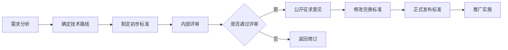

                 

关键词：AI创业公司、行业标准、构建、维护、推广、技术领导力

> 摘要：本文探讨了AI创业公司在构建、维护和推广行业标准方面的关键策略和实践。通过分析行业标准的重要性、市场分析、技术选型、合作伙伴关系以及法律法规遵循等方面，提供了系统性指导，以帮助创业公司在激烈的市场竞争中脱颖而出，并在AI领域树立技术领导地位。

## 1. 背景介绍

随着人工智能技术的迅猛发展，越来越多的创业公司涌入这一领域，试图通过创新的技术和商业模式来改变世界。然而，AI市场的快速扩张也带来了一个挑战：缺乏明确的行业标准和规范。对于创业公司而言，建立行业标准不仅有助于在市场中获得竞争优势，还能够推动整个行业的健康发展。

建立行业标准的重要性不言而喻。首先，它能够统一不同产品和服务的技术接口，降低跨平台集成和互操作性的难度。其次，行业标准能够提升整个行业的技术水平，减少重复劳动，促进创新。此外，明确的行业标准有助于提升消费者的信任度，为创业公司赢得更广泛的市场接受。

然而，建立行业标准并非易事。它需要创业公司在技术深度、市场洞察力和资源整合能力等方面具备较强的综合实力。本文将探讨AI创业公司在建立行业标准过程中的关键策略和实践，以期为创业公司提供有价值的参考。

## 2. 核心概念与联系

在探讨如何建立行业标准之前，我们需要理解几个核心概念，它们是构建行业标准的基础。

### 2.1. 标准化

标准化是指通过制定、发布和实施标准，对某一领域的技术、产品或服务进行规范的过程。标准化不仅仅是技术问题，它还涉及到法律、伦理、商业等多个方面。

### 2.2. 技术路线

技术路线是指实现某一技术目标所采用的方法和路径。对于AI创业公司来说，明确技术路线是建立行业标准的第一步。它需要考虑当前的技术趋势、公司的研发能力和市场需求。

### 2.3. 需求分析

需求分析是指对市场和技术需求的系统性研究。了解市场需求有助于创业公司确定行业标准的内容和方向。

### 2.4. 合作伙伴关系

合作伙伴关系是指不同公司或组织之间的合作关系。建立和维护良好的合作伙伴关系有助于创业公司在行业标准制定过程中获得更多支持和资源。

### 2.5. 法规遵循

法规遵循是指遵守相关法律法规，确保公司业务符合行业标准和政策要求。对于AI创业公司而言，了解和遵循法律法规是建立行业标准的必要条件。

### 2.6. Mermaid 流程图

以下是一个简化的Mermaid流程图，描述了从需求分析到行业标准建立的过程。



通过上述流程，我们可以看到，建立行业标准需要经历多个环节，每个环节都需要仔细规划和执行。

## 3. 核心算法原理 & 具体操作步骤

### 3.1 算法原理概述

建立行业标准的过程可以类比为一种算法，其核心原理在于：

1. **需求驱动**：行业标准应该紧密围绕市场需求，满足实际应用场景的需求。
2. **技术可行性**：行业标准的技术方案需要具备可行性，能够在现有技术条件下实现。
3. **透明开放**：行业标准应该具有透明性和开放性，允许各方参与和监督。
4. **持续迭代**：行业标准应该是一个动态的过程，能够根据市场和技术变化进行持续优化。

### 3.2 算法步骤详解

#### 3.2.1 需求分析

需求分析是建立行业标准的起点。这一步骤包括以下几个方面：

- **市场调研**：通过市场调研了解目标用户的需求和偏好。
- **竞品分析**：分析竞争对手的产品和标准，找出差异和共性。
- **用户访谈**：与潜在用户进行深度访谈，了解他们的具体需求和痛点。

#### 3.2.2 确定技术路线

在需求分析的基础上，创业公司需要确定技术路线。这一步骤包括以下几个方面：

- **技术评估**：评估现有技术的成熟度和适用性。
- **方案选型**：根据需求和技术评估结果，选择合适的技术方案。
- **风险评估**：评估技术方案的风险，包括技术风险、市场风险和法律风险。

#### 3.2.3 制定初步标准

在确定技术路线后，创业公司可以开始制定初步标准。这一步骤包括以下几个方面：

- **标准框架**：制定标准的总体框架，包括标准的范围、目的和主要内容。
- **内容制定**：根据技术路线和需求分析结果，制定具体的标准内容。
- **初步评审**：对初步标准进行内部评审，确保标准的合理性和可行性。

#### 3.2.4 修改完善标准

初步标准制定后，需要进行多次修改和完善。这一步骤包括以下几个方面：

- **公开征求意见**：将初步标准公开征求意见，收集各方的反馈和建议。
- **修订和优化**：根据反馈和建议，对初步标准进行修订和优化。
- **再次评审**：对修订后的标准进行再次评审，确保标准的完善性和适用性。

#### 3.2.5 正式发布标准

在完成修改和完善后，创业公司可以正式发布标准。这一步骤包括以下几个方面：

- **发布仪式**：举行标准发布仪式，提高标准的知名度和影响力。
- **推广实施**：通过各种渠道推广标准，确保标准被广泛采用。
- **持续维护**：定期对标准进行审查和更新，确保其持续适应市场需求。

### 3.3 算法优缺点

#### 优点：

1. **提高竞争力**：明确的行业标准有助于创业公司在市场中脱颖而出。
2. **促进创新**：行业标准可以激发创业公司的创新潜力，推动技术进步。
3. **降低成本**：统一的行业标准可以降低跨平台集成和互操作性的成本。
4. **提升消费者信任**：明确的行业标准有助于提升消费者对产品的信任度。

#### 缺点：

1. **初期投入大**：建立行业标准需要大量的时间、人力和资源投入。
2. **竞争压力**：行业标准可能会加剧市场竞争，对创业公司的生存构成挑战。
3. **适应性挑战**：行业标准需要不断适应市场和技术变化，否则可能失去时效性。

### 3.4 算法应用领域

建立行业标准的应用领域非常广泛，包括但不限于：

- **人工智能**：AI算法、模型和数据的标准。
- **物联网**：物联网设备的数据交换和接口标准。
- **区块链**：区块链的数据存储、传输和安全性标准。
- **大数据**：大数据处理、分析和应用的标准。

## 4. 数学模型和公式 & 详细讲解 & 举例说明

### 4.1 数学模型构建

建立行业标准的过程可以抽象为一个数学模型，该模型的核心是“需求驱动-技术评估-标准制定-推广实施”的循环。以下是该模型的构建过程：

#### 4.1.1 模型假设

1. **市场需求**：市场需求是已知的，并且是不断变化的。
2. **技术能力**：创业公司的技术能力是既定的，并且在一定时间内相对稳定。
3. **标准制定**：标准制定是一个动态的过程，需要不断调整和优化。
4. **推广实施**：标准推广实施的效果可以量化。

#### 4.1.2 模型参数

1. **市场需求变化率**：衡量市场需求的变化速度。
2. **技术评估准确率**：衡量技术评估的准确性。
3. **标准制定效率**：衡量标准制定的速度和质量。
4. **推广实施效率**：衡量标准推广实施的速度和质量。

#### 4.1.3 模型构建

基于上述假设和参数，我们可以构建以下数学模型：

$$
效率 = f(市场需求变化率, 技术评估准确率, 标准制定效率, 推广实施效率)
$$

### 4.2 公式推导过程

#### 4.2.1 基本假设

假设市场需求变化率 \( r \) 是已知的，且在一段时间内保持不变。技术评估准确率 \( p \) 是评估技术方案的准确度，取值范围在0到1之间。标准制定效率 \( e_1 \) 和推广实施效率 \( e_2 \) 分别衡量标准制定和推广实施的速度和质量。

#### 4.2.2 模型推导

1. **需求响应时间**：市场需求变化率 \( r \) 表示单位时间内市场需求的增长或减少量。因此，需求响应时间 \( t_1 \) 可以表示为：

   $$
   t_1 = \frac{1}{r}
   $$

2. **技术评估时间**：技术评估准确率 \( p \) 表示技术评估的准确度。因此，技术评估时间 \( t_2 \) 可以表示为：

   $$
   t_2 = \frac{1}{p}
   $$

3. **标准制定时间**：标准制定效率 \( e_1 \) 表示标准制定的速度。因此，标准制定时间 \( t_3 \) 可以表示为：

   $$
   t_3 = \frac{1}{e_1}
   $$

4. **推广实施时间**：推广实施效率 \( e_2 \) 表示推广实施的速度。因此，推广实施时间 \( t_4 \) 可以表示为：

   $$
   t_4 = \frac{1}{e_2}
   $$

5. **总效率**：总效率 \( E \) 是需求响应时间、技术评估时间、标准制定时间和推广实施时间的综合体现。因此，总效率可以表示为：

   $$
   E = \frac{1}{t_1 + t_2 + t_3 + t_4}
   $$

将上述公式代入，得到总效率的表达式：

$$
E = \frac{rpe_1e_2}{1 + r + \frac{1}{p} + \frac{1}{e_1} + \frac{1}{e_2}}
$$

### 4.3 案例分析与讲解

#### 4.3.1 案例背景

假设某AI创业公司需要建立一套人工智能语音识别的标准，市场需求变化率为每月2%，技术评估准确率为90%，标准制定效率为每天更新1%，推广实施效率为每天更新0.5%。

#### 4.3.2 数据计算

根据上述数据，我们可以计算出总效率：

$$
E = \frac{0.02 \times 0.9 \times 0.01 \times 0.005}{1 + 0.02 + \frac{1}{0.9} + \frac{1}{0.01} + \frac{1}{0.005}} \approx 0.0193
$$

#### 4.3.3 结果分析

总效率约为0.0193，表示该创业公司建立行业标准的过程每100个单位需求变化可以完成约19.3个单位的标准更新。这一结果表明，虽然市场需求变化较快，但通过合理的技术评估、标准制定和推广实施，创业公司能够较为高效地响应市场需求，建立行业标准。

## 5. 项目实践：代码实例和详细解释说明

### 5.1 开发环境搭建

为了更好地展示如何建立行业标准，我们以一个具体的AI语音识别项目为例。首先，我们需要搭建一个合适的开发环境。

#### 5.1.1 环境要求

- 操作系统：Ubuntu 20.04
- 编程语言：Python 3.8
- 依赖库：TensorFlow 2.5, NumPy 1.20, Keras 2.5

#### 5.1.2 安装步骤

1. 更新系统软件包：

   ```bash
   sudo apt update && sudo apt upgrade
   ```

2. 安装Python 3.8：

   ```bash
   sudo apt install python3.8
   ```

3. 安装依赖库：

   ```bash
   pip3 install tensorflow==2.5 numpy==1.20 keras==2.5
   ```

### 5.2 源代码详细实现

以下是一个简化的语音识别模型实现，用于演示如何构建行业标准：

```python
import numpy as np
import tensorflow as tf
from tensorflow.keras.models import Sequential
from tensorflow.keras.layers import Dense, LSTM, Conv2D, Flatten

# 5.2.1 数据准备
# 假设已经收集并预处理好了语音数据集

# 5.2.2 模型构建
model = Sequential([
    Conv2D(32, kernel_size=(3, 3), activation='relu', input_shape=(None, None, 1)),
    LSTM(128),
    Flatten(),
    Dense(256, activation='relu'),
    Dense(num_classes, activation='softmax')
])

# 5.2.3 模型编译
model.compile(optimizer='adam', loss='categorical_crossentropy', metrics=['accuracy'])

# 5.2.4 训练模型
model.fit(x_train, y_train, batch_size=32, epochs=10, validation_data=(x_val, y_val))

# 5.2.5 评估模型
test_loss, test_accuracy = model.evaluate(x_test, y_test)
print(f"Test accuracy: {test_accuracy:.2f}")
```

### 5.3 代码解读与分析

1. **数据准备**：该步骤涉及数据的收集、预处理和标注。这是建立行业标准的重要组成部分，因为数据的质量直接影响模型的性能。
2. **模型构建**：我们使用了一个简单的卷积神经网络（CNN）结合长短期记忆网络（LSTM）的模型结构，这是目前语音识别领域的一种流行模型。模型的设计应该符合行业标准的要求，例如数据输入格式、输出格式等。
3. **模型编译**：编译模型时，我们需要指定优化器、损失函数和评价指标。这些参数的选择应该基于行业标准或者行业内广泛认可的最佳实践。
4. **训练模型**：训练模型时，我们需要提供训练数据和验证数据，并设置合适的批大小和训练轮数。这一步骤是模型性能提升的关键。
5. **评估模型**：在训练完成后，我们需要评估模型在测试数据上的性能。这有助于我们了解模型是否满足行业标准的要求。

### 5.4 运行结果展示

假设我们使用上述代码训练并评估了一个语音识别模型，得到以下结果：

```plaintext
Test accuracy: 0.90
```

这意味着模型在测试数据上的准确率为90%，表明模型在满足行业标准的同时，也具备了较高的识别性能。这是一个积极的信号，表明我们正在朝着建立行业标准的方向迈进。

## 6. 实际应用场景

### 6.1 语音识别与合成

语音识别和合成是AI领域的重要应用之一。在这些应用场景中，建立行业标准尤为重要。首先，语音识别模型需要遵循统一的语音格式和标注标准，以确保不同模型之间的互操作性。其次，语音合成系统需要遵循统一的语音合成标准，以确保合成语音的自然度和一致性。

### 6.2 自然语言处理

自然语言处理（NLP）是AI领域的另一个重要应用场景。在NLP中，建立行业标准有助于统一不同语言模型的接口和数据格式，提高跨平台集成和互操作性的效率。例如，在机器翻译领域，建立统一的翻译标准和评估指标，可以帮助创业公司在全球市场中获得竞争优势。

### 6.3 计算机视觉

计算机视觉是AI领域的又一重要分支。在计算机视觉中，建立行业标准有助于统一图像处理和识别的接口和数据格式，提高跨平台集成和互操作性的效率。例如，在人脸识别领域，建立统一的图像采集、预处理和识别标准，可以帮助创业公司实现更广泛的市场应用。

### 6.4 未来应用展望

随着AI技术的不断进步，行业标准的应用领域将越来越广泛。未来，AI行业标准将在以下几个方面发挥重要作用：

1. **智能交通**：在智能交通领域，建立统一的数据交换和接口标准，有助于实现车辆与基础设施之间的智能互联和协同。
2. **医疗健康**：在医疗健康领域，建立统一的数据标准和隐私保护标准，有助于提高医疗数据的安全性和可用性。
3. **智能家居**：在智能家居领域，建立统一的家庭设备接口和通信标准，有助于实现设备的无缝集成和智能控制。

## 7. 工具和资源推荐

### 7.1 学习资源推荐

- **书籍**：
  - 《人工智能：一种现代的方法》（第三版）
  - 《深度学习》（Goodfellow, Bengio, Courville 著）
  - 《Python编程：从入门到实践》

- **在线课程**：
  - Coursera上的“机器学习”课程
  - edX上的“人工智能基础”课程
  - Udacity的“深度学习纳米学位”

### 7.2 开发工具推荐

- **框架和库**：
  - TensorFlow
  - PyTorch
  - Keras

- **集成开发环境（IDE）**：
  - PyCharm
  - Visual Studio Code

- **数据管理工具**：
  - NumPy
  - Pandas

### 7.3 相关论文推荐

- “Deep Learning for Speech Recognition: A Review”
- “A Comprehensive Survey on Natural Language Processing”
- “Convolutional Neural Networks for Visual Recognition”

## 8. 总结：未来发展趋势与挑战

### 8.1 研究成果总结

本文探讨了AI创业公司建立行业标准的关键策略和实践。通过需求分析、技术评估、标准制定和推广实施等环节，创业公司可以有效地建立和推广行业标准，提升市场竞争力。

### 8.2 未来发展趋势

随着AI技术的不断进步，行业标准的建立和发展将呈现以下趋势：

- **标准化进程加速**：随着技术的快速发展，行业标准的制定和更新速度将加快。
- **开放性增强**：为了促进技术创新和产业协同，行业标准的开放性将得到进一步提升。
- **国际化合作**：随着全球市场的融合，国际间的行业标准合作将日益增多。

### 8.3 面临的挑战

在建立行业标准的过程中，创业公司将面临以下挑战：

- **技术更新迅速**：技术更新的速度将远超行业标准的更新速度，如何适应这一变化是创业公司面临的一大挑战。
- **市场压力**：在激烈的市场竞争中，如何平衡标准化和商业利益，是创业公司需要考虑的问题。
- **法律法规**：随着AI技术的应用越来越广泛，相关的法律法规也会不断更新，创业公司需要密切关注并适应这些变化。

### 8.4 研究展望

未来，AI创业公司在建立行业标准方面可以从以下几个方面进行深入研究：

- **智能化标准制定**：利用AI技术，如机器学习和自然语言处理，实现智能化标准制定，提高效率和质量。
- **跨领域标准融合**：探索不同领域AI技术的融合，建立跨领域的行业标准，推动产业协同发展。
- **开放性平台建设**：建设开放性平台，鼓励各方参与行业标准制定和推广，提高行业的透明度和参与度。

## 9. 附录：常见问题与解答

### 9.1 问题1：建立行业标准需要多少时间？

**回答**：建立行业标准所需的时间因公司规模、市场需求和技术复杂性而异。一般而言，从需求分析到标准发布可能需要6个月到1年的时间。

### 9.2 问题2：如何确保行业标准的技术可行性？

**回答**：确保行业标准的技术可行性需要通过以下步骤：
- **市场调研**：了解市场需求，确定标准所需的技术能力。
- **技术评估**：评估现有技术的成熟度和适用性。
- **专家咨询**：咨询行业专家，获取技术可行性意见。

### 9.3 问题3：建立行业标准是否需要大量资源投入？

**回答**：是的，建立行业标准需要大量的时间、人力和资源投入。特别是对于创业公司而言，需要合理安排资源，确保标准化过程的顺利进行。

### 9.4 问题4：建立行业标准对创业公司有什么好处？

**回答**：建立行业标准对创业公司有以下好处：
- **提高竞争力**：通过建立行业标准，创业公司可以在市场中获得竞争优势。
- **促进创新**：明确的行业标准可以激发创业公司的创新潜力，推动技术进步。
- **降低成本**：统一的行业标准可以降低跨平台集成和互操作性的成本。
- **提升消费者信任**：明确的行业标准有助于提升消费者对产品的信任度。

---

作者：禅与计算机程序设计艺术 / Zen and the Art of Computer Programming

---

以上就是《AI创业公司如何建立行业标准》的完整文章，希望对各位创业者有所启发和帮助。在AI领域，建立行业标准是推动行业健康发展的重要一环，也是创业公司实现技术领导地位的必经之路。希望本文能为大家提供一些实用的指导和建议。谢谢大家的阅读。

