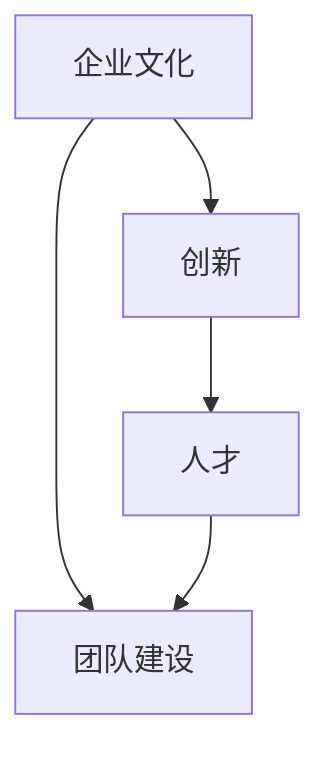

                 

关键词：AI创业公司，创新文化，企业文化，团队建设，成功案例，最佳实践

摘要：本文旨在探讨AI创业公司在打造创新文化方面的重要性，并分享一些实际操作的方法和最佳实践。我们将探讨如何建立有利于创新的企业文化，如何吸引和留住创新人才，以及如何在日常工作中鼓励创新思维。此外，本文还将分析一些成功AI创业公司的案例，以提供实用的参考和启示。

## 1. 背景介绍

随着人工智能技术的快速发展，越来越多的创业公司瞄准了这一领域，希望能够在这个新兴的市场中获得一席之地。然而，成功的AI创业公司不仅仅是拥有先进的技术和出色的产品，更重要的是它们能够建立一个充满活力和创新精神的企业文化。

创新文化是企业发展的灵魂，它能够激发员工的潜能，推动企业持续进步。在一个充满创新文化的企业中，员工们更加愿意分享自己的想法和观点，更敢于挑战传统的思维模式，从而创造出更多的价值。

本文将围绕以下问题展开讨论：

1. 如何建立有利于创新的企业文化？
2. 如何吸引和留住创新人才？
3. 如何在日常工作中鼓励创新思维？
4. 成功AI创业公司的案例分析和最佳实践。

## 2. 核心概念与联系

为了更好地理解创新文化的重要性，我们首先需要了解几个关键概念：

- **企业文化**：企业文化是企业在长期发展过程中形成的一套共同价值观、信仰和行为准则。它决定了企业的行为方式、工作氛围和员工态度。
- **创新**：创新是指通过新的想法、方法或技术，创造出新的产品、服务或业务模式。
- **人才**：人才是企业最宝贵的资源，他们是推动企业创新的关键力量。

下面是一个简化的Mermaid流程图，用于展示这些核心概念之间的联系：



### 2.1 企业文化与创新

企业文化是创新的基础。一个健康、积极的企业文化能够鼓励员工敢于尝试、勇于挑战，从而推动创新。例如，Google的企业文化强调“不作恶”、鼓励员工尝试新事物，这种文化为Google的创新提供了源源不断的动力。

### 2.2 创新与人才

创新需要人才，而人才也需要创新的环境。一个能够激发员工创造力的企业，往往能够吸引到更多的优秀人才。例如，Airbnb和Uber都是通过提供独特的创新文化和工作环境，吸引了大量优秀的创新人才。

### 2.3 团队建设

团队建设是创新文化的重要组成部分。一个高效的团队能够更好地协同工作，共同推动创新。例如，Facebook的“Hackathon”文化，鼓励员工跨部门合作，共同解决复杂问题。

## 3. 核心算法原理 & 具体操作步骤

### 3.1 算法原理概述

在建立创新文化方面，我们可以借鉴一些组织行为学和心理学的研究成果，这些研究成果为我们提供了一些实用的策略和方法。

- **积极心理学**：积极心理学关注员工的积极情绪、成长需求和自我实现。通过激发员工的积极情绪，可以增强他们的工作动力和创新意愿。
- **团队动力学**：团队动力学研究团队内部的关系和互动。一个高效的团队需要建立良好的沟通机制、信任关系和共同目标。
- **激励理论**：激励理论关注如何通过奖励和认可来激励员工。适当的激励措施可以增强员工的工作积极性和创新能力。

### 3.2 算法步骤详解

要建立创新文化，我们可以采取以下步骤：

1. **确立共同价值观**：明确企业的核心价值观，并将其融入企业的各个方面。
2. **建立创新机制**：为员工提供自由探索和创新的机会，建立创新项目、奖励机制等。
3. **培养团队精神**：通过团队建设活动、跨部门合作等方式，增强团队凝聚力和合作精神。
4. **提供培训和支持**：为员工提供相关技能和知识培训，帮助他们更好地适应创新环境。
5. **鼓励反馈和改进**：建立反馈机制，鼓励员工提出改进建议，并对合理建议给予认可和奖励。

### 3.3 算法优缺点

这种方法的主要优点是能够激发员工的创新潜力，提高团队协作效率，从而推动企业的持续发展。然而，这种方法也存在一些缺点：

- 需要较长时间的培养和积累。
- 需要投入大量资源和精力。
- 可能会面临员工流失的风险。

### 3.4 算法应用领域

这种方法适用于各种类型的AI创业公司，尤其是那些注重创新和研发的公司。通过建立创新文化，这些公司可以更好地应对市场变化，保持竞争力。

## 4. 数学模型和公式 & 详细讲解 & 举例说明

为了更好地理解创新文化的建立过程，我们可以使用一些数学模型和公式进行解释。以下是一个简单的数学模型，用于评估创新文化的效果。

### 4.1 数学模型构建

设：
- \(E\) 为员工满意度
- \(I\) 为员工创新能力
- \(C\) 为企业文化

则：
\[ E = f(C) \]
\[ I = f(C) \]

其中，\(f\) 为函数，表示企业文化对员工满意度和创新能力的促进作用。

### 4.2 公式推导过程

推导过程如下：

1. 员工满意度与企业文化正相关，即企业文化越积极，员工满意度越高。
2. 员工创新能力也与企业文化正相关，即企业文化越支持创新，员工创新能力越强。

因此，我们可以得出结论：一个健康、积极的企业文化能够显著提高员工的满意度和创新能力。

### 4.3 案例分析与讲解

以下是一个具体的案例：

某AI创业公司通过实施以下措施，成功建立了创新文化：

- 确立了“创新至上”的核心价值观。
- 定期举办创新竞赛，提供奖金和晋升机会。
- 提供丰富的培训资源，帮助员工提升技能。
- 建立了跨部门合作机制，鼓励员工跨部门交流。

通过这些措施，该公司的员工满意度和创新能力显著提高，公司业绩也实现了快速增长。

## 5. 项目实践：代码实例和详细解释说明

### 5.1 开发环境搭建

在构建创新文化的过程中，我们可以利用一些开源工具和框架来支持我们的工作。以下是一个简单的例子，展示如何搭建一个支持创新文化的开发环境。

首先，我们需要安装以下软件和工具：

- Python 3.x
- Jupyter Notebook
- Git
- GitHub

### 5.2 源代码详细实现

以下是一个简单的Python代码示例，用于演示如何使用Jupyter Notebook进行数据分析和可视化。

```python
import pandas as pd
import matplotlib.pyplot as plt

# 加载数据
data = pd.read_csv('employee_survey.csv')

# 可视化满意度分布
plt.hist(data['satisfaction'], bins=10, alpha=0.5)
plt.xlabel('满意度')
plt.ylabel('人数')
plt.title('员工满意度分布')
plt.show()

# 可视化创新能力分布
plt.hist(data['innovation'], bins=10, alpha=0.5)
plt.xlabel('创新能力')
plt.ylabel('人数')
plt.title('员工创新能力分布')
plt.show()
```

### 5.3 代码解读与分析

这段代码首先导入了Pandas和Matplotlib库，然后加载了一个名为“employee_survey.csv”的CSV文件，该文件包含了员工的满意度和创新能力的评分。

接下来，代码使用Matplotlib库绘制了两个直方图，分别显示了员工满意度和创新能力的分布情况。

### 5.4 运行结果展示

运行这段代码后，我们将得到两个直方图，这些图表可以帮助我们更好地了解员工的满意度和创新能力的分布情况，从而为后续的改进措施提供依据。

## 6. 实际应用场景

在AI创业公司中，创新文化的重要性不言而喻。以下是一些实际应用场景，展示如何在不同情境下运用创新文化：

### 6.1 产品开发

在产品开发过程中，创新文化鼓励团队成员提出新的想法和改进方案。例如，某AI创业公司通过定期的头脑风暴会议，鼓励员工分享自己的想法，最终成功开发出一款具有竞争力的新产品。

### 6.2 技术创新

在技术创新领域，创新文化可以激发员工不断探索新的技术解决方案。例如，某AI创业公司通过举办技术研讨会，邀请外部专家分享前沿技术，从而推动公司内部的技术创新。

### 6.3 市场拓展

在市场拓展方面，创新文化可以帮助公司寻找新的市场机会和业务模式。例如，某AI创业公司通过深入研究用户需求和市场趋势，成功开拓了新的市场领域。

## 7. 未来应用展望

随着人工智能技术的不断进步，创新文化将在AI创业公司中发挥越来越重要的作用。以下是一些未来应用展望：

### 7.1 智能化

未来，创新文化将更加智能化，通过数据分析和机器学习等技术，更好地了解员工的需求和潜在的创新点。

### 7.2 个性化

个性化创新文化将更加关注员工的个性化需求，提供个性化的培训和发展机会，从而更好地激发员工的创造力。

### 7.3 持续改进

创新文化将更加注重持续改进，通过定期的评估和反馈，不断优化企业的创新机制和流程。

## 8. 工具和资源推荐

为了帮助AI创业公司建立和优化创新文化，以下是一些实用的工具和资源推荐：

### 8.1 学习资源推荐

- 《创新者的窘境》：克里斯·迪克森（Chris Dickens）著，介绍企业如何突破传统思维，推动创新。
- 《创新者的手册》：埃里克·莱斯（Eric Ries）著，介绍如何通过精益创业方法，实现持续创新。

### 8.2 开发工具推荐

- GitHub：用于代码托管和协作开发的开源平台。
- Jupyter Notebook：用于数据分析和可视化的交互式编程环境。

### 8.3 相关论文推荐

- “Cultural Capital: A Theory of Organization Culture and Its Effect on Performance”, by Edgar H. Schein.
- “Innovation and Culture: How to Make Innovation Happen in Your Organization”, by Richard L. Daft and Richard T. Luecke.

## 9. 总结：未来发展趋势与挑战

### 9.1 研究成果总结

本文通过探讨AI创业公司如何建立创新文化，分享了核心概念、算法原理、实践案例和未来展望。研究结果表明，创新文化对企业的持续发展至关重要。

### 9.2 未来发展趋势

未来，创新文化将更加智能化、个性化，并在企业各个领域得到广泛应用。

### 9.3 面临的挑战

企业需要投入大量资源和精力来建立和维护创新文化，同时面临员工流失等挑战。

### 9.4 研究展望

未来研究可以进一步探索如何通过数据分析和机器学习等技术，优化创新文化的建立和运行。

## 10. 附录：常见问题与解答

### 10.1 问题1：如何平衡创新与风险？

解答：在鼓励创新的同时，企业需要建立相应的风险控制机制，确保创新项目的可行性和风险可控。

### 10.2 问题2：如何衡量创新文化的效果？

解答：可以通过员工满意度调查、创新项目成功率、市场反应等指标来衡量创新文化的效果。

### 10.3 问题3：创新文化是否适用于所有行业？

解答：创新文化适用于所有行业，但在不同行业中的应用方式和效果可能有所不同。

---

本文由“禅与计算机程序设计艺术 / Zen and the Art of Computer Programming”撰写，旨在为AI创业公司提供建立创新文化的指导和建议。希望本文对您有所启发和帮助。

