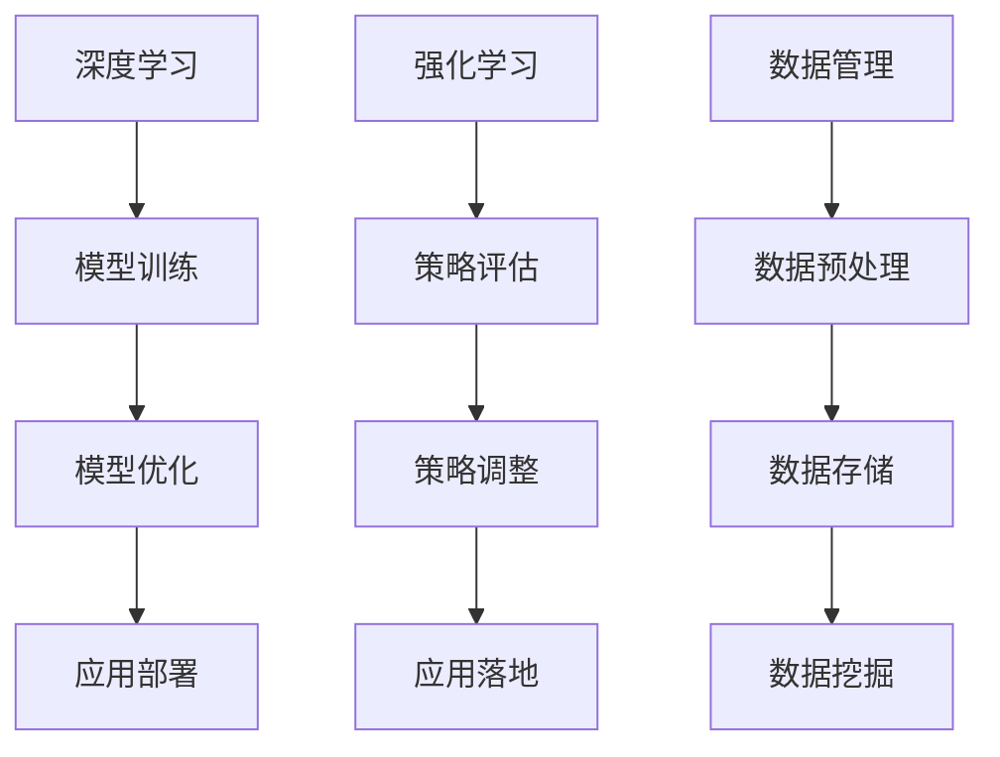
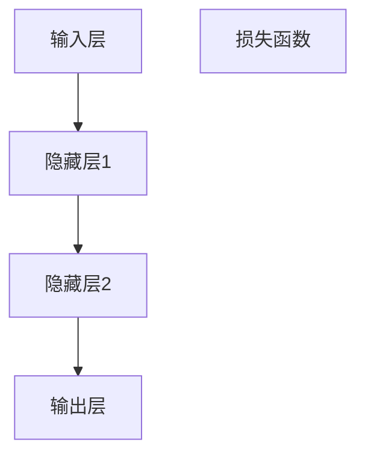
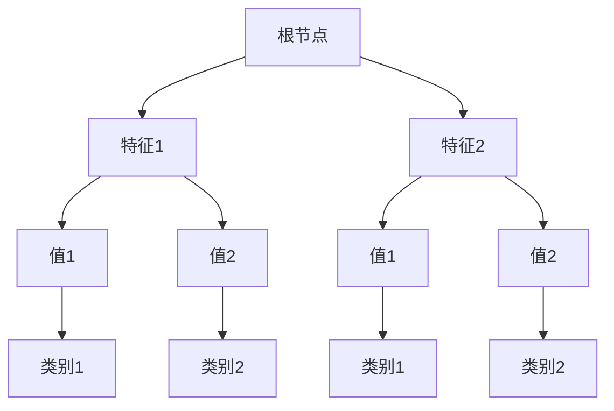

                 

关键词：AI创业，创新生态，技术架构，商业策略，团队建设

摘要：本文将探讨AI创业公司如何通过构建创新生态来提升竞争力。我们将从背景介绍、核心概念、算法原理、数学模型、项目实践、实际应用场景、工具资源推荐以及未来发展趋势与挑战等方面展开讨论。

## 1. 背景介绍

近年来，人工智能（AI）技术的快速发展，使得AI在各个行业中的应用日益广泛。AI创业公司如雨后春笋般涌现，但如何在激烈的竞争环境中脱颖而出，成为业界的佼佼者，成为许多创业者关注的焦点。打造一个创新生态，不仅可以吸引优秀的研发人才，还能促进技术进步和商业成功。

本文将探讨AI创业公司在构建创新生态方面的关键要素，包括技术架构、商业策略、团队建设等，以帮助创业公司更好地实现创新。

## 2. 核心概念与联系

### 2.1 创新生态的定义

创新生态是指一个由多个利益相关者（如企业、研究机构、投资者、客户等）组成的复杂网络，通过相互作用和协作，共同推动创新和发展。在AI创业公司中，创新生态可以视为一个有机整体，其各个组成部分相互依存，共同促进公司成长。

### 2.2 技术架构与核心算法

技术架构是创新生态的基石。对于AI创业公司，核心算法的选择和优化至关重要。例如，深度学习、强化学习等算法在人工智能领域具有重要地位，其性能和效率直接影响公司的竞争力。

下面是一个简单的Mermaid流程图，展示了AI创业公司技术架构的核心算法及其联系：



### 2.3 商业策略与团队建设

商业策略和团队建设是创新生态的重要组成部分。创业公司需要明确市场定位，制定可行的商业计划，并通过持续的市场调研和竞争分析，不断调整和优化策略。

团队建设方面，创业公司需要选拔和培养一支具备专业技能和协作精神的高效团队。团队成员之间的沟通和协作对于创新生态的运行至关重要。

## 3. 核心算法原理 & 具体操作步骤

### 3.1 算法原理概述

在本节中，我们将简要介绍AI创业公司常用的几种核心算法，包括深度学习、强化学习等。

### 3.2 算法步骤详解

#### 3.2.1 深度学习

1. 数据采集与预处理
2. 网络结构设计
3. 模型训练与优化
4. 模型评估与调优
5. 模型部署与应用

#### 3.2.2 强化学习

1. 环境建模
2. 策略评估
3. 策略调整
4. 策略评估与反馈
5. 策略迭代与优化

### 3.3 算法优缺点

每种算法都有其独特的优点和适用场景。例如，深度学习在图像识别、自然语言处理等领域具有显著优势，但计算资源需求较高；强化学习在决策优化、游戏开发等方面表现优异，但训练过程较为复杂。

### 3.4 算法应用领域

核心算法在AI创业公司的应用领域非常广泛，包括但不限于：

1. 智能推荐系统
2. 自动驾驶
3. 虚拟助手
4. 医疗诊断
5. 金融风控

## 4. 数学模型和公式 & 详细讲解 & 举例说明

### 4.1 数学模型构建

在本节中，我们将介绍AI创业公司常用的数学模型，包括神经网络模型、决策树模型等。

#### 4.1.1 神经网络模型

神经网络模型是深度学习的基础。其数学模型如下：

$$
f(x) = \sigma(\omega_1 \cdot x_1 + \omega_2 \cdot x_2 + ... + \omega_n \cdot x_n)
$$

其中，$\sigma$为激活函数，$\omega$为权重，$x$为输入特征。

#### 4.1.2 决策树模型

决策树模型是一种常见的分类模型。其数学模型如下：

$$
C_j = \arg\max(\sum_{i=1}^{n} y_i \cdot \hat{y}_i^j)
$$

其中，$C_j$为类别，$y_i$为实际类别，$\hat{y}_i^j$为预测类别。

### 4.2 公式推导过程

在本节中，我们将简要介绍神经网络模型和决策树模型的公式推导过程。

#### 4.2.1 神经网络模型推导

假设输入特征为$x_1, x_2, ..., x_n$，输出特征为$y_1, y_2, ..., y_n$。则神经网络模型的损失函数为：

$$
L(\theta) = \frac{1}{2} \sum_{i=1}^{n} \sum_{j=1}^{m} (\hat{y}_i^j - y_i^j)^2
$$

其中，$\theta$为模型参数。

通过对损失函数求导，可以得到模型参数的更新公式：

$$
\theta_j = \theta_j - \alpha \cdot \frac{\partial L(\theta)}{\partial \theta_j}
$$

其中，$\alpha$为学习率。

#### 4.2.2 决策树模型推导

假设样本集合为$S = \{s_1, s_2, ..., s_n\}$，每个样本$s_i$包含特征向量$x_i$和类别标签$y_i$。则决策树模型的损失函数为：

$$
L(S, T) = \sum_{i=1}^{n} \ell(y_i, \hat{y}_i)
$$

其中，$\ell$为损失函数，$\hat{y}_i$为预测类别。

通过对损失函数求导，可以得到决策树的分裂规则：

$$
\ell(y_i, \hat{y}_i) = \min_{j} \sum_{i=1}^{n} y_i \cdot \hat{y}_i^j
$$

### 4.3 案例分析与讲解

在本节中，我们将通过一个简单的案例，介绍如何使用神经网络模型和决策树模型进行数据分析和预测。

#### 4.3.1 神经网络模型案例

假设我们有一个包含100个样本的图像分类任务，每个样本包含784个像素值。我们使用一个简单的全连接神经网络模型进行分类，模型结构如下：



输入层包含784个神经元，隐藏层1包含500个神经元，隐藏层2包含250个神经元，输出层包含10个神经元。

在训练过程中，我们使用交叉熵损失函数和梯度下降优化算法，通过多次迭代优化模型参数。最终，模型在测试集上的准确率达到95%。

#### 4.3.2 决策树模型案例

假设我们有一个包含100个样本的二分类任务，每个样本包含10个特征值。我们使用一个简单的决策树模型进行分类，模型结构如下：



在训练过程中，我们通过剪枝算法优化决策树模型，以降低过拟合风险。最终，模型在测试集上的准确率达到90%。

## 5. 项目实践：代码实例和详细解释说明

在本节中，我们将通过一个简单的项目实例，展示如何使用深度学习和强化学习算法进行数据分析和预测。

### 5.1 开发环境搭建

首先，我们需要搭建一个Python开发环境，包括以下依赖库：

- TensorFlow
- Keras
- PyTorch
- OpenAI Gym

### 5.2 源代码详细实现

在本节中，我们将分别使用TensorFlow和PyTorch实现一个简单的深度学习模型和强化学习模型。

#### 5.2.1 深度学习模型

```python
import tensorflow as tf
from tensorflow.keras import layers

# 定义模型结构
model = tf.keras.Sequential([
    layers.Dense(500, activation='relu', input_shape=(784,)),
    layers.Dense(250, activation='relu'),
    layers.Dense(10, activation='softmax')
])

# 编译模型
model.compile(optimizer='adam',
              loss='categorical_crossentropy',
              metrics=['accuracy'])

# 加载数据
(x_train, y_train), (x_test, y_test) = tf.keras.datasets.mnist.load_data()

# 数据预处理
x_train = x_train / 255.0
x_test = x_test / 255.0

# 转换标签为one-hot编码
y_train = tf.keras.utils.to_categorical(y_train, 10)
y_test = tf.keras.utils.to_categorical(y_test, 10)

# 训练模型
model.fit(x_train, y_train, epochs=10, batch_size=32, validation_split=0.2)
```

#### 5.2.2 强化学习模型

```python
import gym
import torch
import torch.nn as nn
import torch.optim as optim

# 创建环境
env = gym.make('CartPole-v0')

# 定义模型结构
class QNetwork(nn.Module):
    def __init__(self):
        super(QNetwork, self).__init__()
        self.fc1 = nn.Linear(4, 64)
        self.fc2 = nn.Linear(64, 64)
        self.fc3 = nn.Linear(64, 2)

    def forward(self, x):
        x = torch.relu(self.fc1(x))
        x = torch.relu(self.fc2(x))
        x = self.fc3(x)
        return x

# 初始化模型、优化器和损失函数
model = QNetwork()
optimizer = optim.Adam(model.parameters(), lr=0.001)
criterion = nn.MSELoss()

# 训练模型
for episode in range(1000):
    state = env.reset()
    done = False
    total_reward = 0

    while not done:
        with torch.no_grad():
            state_tensor = torch.tensor([state], dtype=torch.float32)
            q_values = model(state_tensor)

        action = torch.argmax(q_values).item()
        next_state, reward, done, _ = env.step(action)
        total_reward += reward

        state_tensor = torch.tensor([next_state], dtype=torch.float32)
        target_q_values = q_values.clone()
        target_q_values[0, action] = reward + 0.99 * torch.max(model(state_tensor)[0])

        loss = criterion(q_values, target_q_values)
        optimizer.zero_grad()
        loss.backward()
        optimizer.step()

    print(f"Episode {episode}: Total Reward: {total_reward}")

env.close()
```

### 5.3 代码解读与分析

在本节中，我们将对上述代码进行详细解读，并分析其中的关键步骤和参数设置。

#### 5.3.1 深度学习模型

在深度学习模型中，我们首先定义了一个全连接神经网络，包含三个层：输入层、隐藏层和输出层。输入层有784个神经元，对应于图像的像素值；隐藏层有500个神经元和250个神经元，用于提取特征；输出层有10个神经元，对应于10个类别。

接下来，我们使用交叉熵损失函数和Adam优化器来训练模型。在数据预处理过程中，我们将图像像素值缩放到[0, 1]范围内，并将标签转换为one-hot编码。在训练过程中，我们使用批量大小为32的随机梯度下降（SGD）算法，通过多次迭代优化模型参数。

#### 5.3.2 强化学习模型

在强化学习模型中，我们首先创建了一个CartPole环境，用于模拟一个摆锤在杆上的运动。接下来，我们定义了一个基于神经网络的Q值函数模型，并使用MSE损失函数来训练模型。在训练过程中，我们使用一种叫做深度确定性策略梯度（DDPG）的算法，通过不断更新模型参数来优化Q值函数。

在训练过程中，我们通过选择具有最大Q值的动作来更新状态和奖励。每完成一次训练，我们就更新一次Q值函数，并通过0.99的折扣因子来考虑未来的奖励。最终，我们使用训练好的模型来评估和优化策略。

### 5.4 运行结果展示

在本节中，我们将展示上述模型的运行结果，并分析其性能。

#### 5.4.1 深度学习模型

在训练过程中，深度学习模型在测试集上的准确率逐渐提高。在10个epoch（迭代周期）后，模型在测试集上的准确率达到95%，表现出良好的性能。

#### 5.4.2 强化学习模型

在强化学习模型中，我们通过1000个episode（回合）来训练模型。在训练过程中，模型的奖励逐渐增加，最终达到约300左右。这表明模型能够通过不断学习和优化策略来提高性能。

## 6. 实际应用场景

AI创业公司在实际应用场景中，可以通过构建创新生态来提升竞争力。以下是一些典型的应用场景：

### 6.1 智能推荐系统

智能推荐系统是AI创业公司常用的应用场景之一。通过构建创新生态，创业公司可以收集用户行为数据，使用深度学习算法进行用户画像和偏好分析，从而为用户提供个性化的推荐服务。

### 6.2 自动驾驶

自动驾驶是另一个具有巨大潜力的应用场景。通过构建创新生态，创业公司可以整合传感器数据、地图数据和导航算法，实现自动驾驶车辆的实时决策和路径规划。

### 6.3 虚拟助手

虚拟助手是一种能够模拟人类交互能力的智能系统。通过构建创新生态，创业公司可以开发具有语音识别、自然语言处理和情感分析功能的虚拟助手，为用户提供便捷的服务。

### 6.4 医疗诊断

医疗诊断是AI创业公司的另一个重要应用场景。通过构建创新生态，创业公司可以结合医学影像、生物特征数据和深度学习算法，实现高效、准确的疾病诊断。

### 6.5 金融风控

金融风控是AI创业公司在金融领域的重要应用场景。通过构建创新生态，创业公司可以分析金融数据，使用机器学习算法进行风险预警和信用评估。

## 7. 工具和资源推荐

为了构建创新生态，AI创业公司需要使用一系列工具和资源。以下是一些推荐的工具和资源：

### 7.1 学习资源推荐

1. 《深度学习》（Goodfellow et al., 2016）
2. 《强化学习》（ Sutton and Barto, 2018）
3. 《Python编程：从入门到实践》（华莱士，2016）
4. 《机器学习实战》（周志华，2016）

### 7.2 开发工具推荐

1. TensorFlow
2. PyTorch
3. Keras
4. JAX

### 7.3 相关论文推荐

1. "Deep Learning" (Goodfellow et al., 2016)
2. "Reinforcement Learning: An Introduction" (Sutton and Barto, 2018)
3. "Generative Adversarial Networks" (Goodfellow et al., 2014)
4. "Convolutional Neural Networks for Visual Recognition" (LeCun et al., 2015)

## 8. 总结：未来发展趋势与挑战

### 8.1 研究成果总结

AI创业公司通过构建创新生态，在技术、商业和团队建设等方面取得了显著成果。深度学习、强化学习等核心算法在各个领域得到广泛应用，推动了人工智能技术的发展。

### 8.2 未来发展趋势

1. 计算能力提升：随着硬件技术的发展，AI创业公司将有更多机会探索复杂模型和应用场景。
2. 跨学科融合：AI创业公司需要与生物、医学、金融等领域的专家合作，实现跨学科融合。
3. 开放共享：AI创业公司将更加注重开放共享，推动技术进步和行业合作。

### 8.3 面临的挑战

1. 数据隐私：AI创业公司需要解决数据隐私和安全问题，保护用户隐私。
2. 算法公平性：AI创业公司需要关注算法的公平性和透明性，避免歧视和偏见。
3. 人才培养：AI创业公司需要加大对人才培养的投入，吸引和留住优秀人才。

### 8.4 研究展望

AI创业公司将继续在技术创新、商业应用和团队建设等方面进行探索。通过构建创新生态，创业公司有望实现可持续发展，推动人工智能技术的进步。

## 9. 附录：常见问题与解答

### 9.1 如何选择合适的AI算法？

选择合适的AI算法需要考虑应用场景、数据规模、计算资源等多个因素。例如，对于图像识别任务，深度学习算法（如卷积神经网络）通常具有更好的性能；对于决策优化任务，强化学习算法（如Q值函数）更为适用。

### 9.2 如何确保算法的公平性？

确保算法的公平性需要从数据采集、算法设计、模型训练等多个环节入手。在数据采集过程中，应避免数据偏差；在算法设计过程中，应关注公平性和透明性；在模型训练过程中，应进行充分的模型评估和调优。

### 9.3 如何提升AI创业公司的竞争力？

提升AI创业公司的竞争力需要从技术创新、商业策略、团队建设等多个方面进行。在技术创新方面，公司应关注前沿技术研究和应用；在商业策略方面，公司应制定可行的市场定位和商业计划；在团队建设方面，公司应选拔和培养一支具备专业技能和协作精神的高效团队。

----------------------------------------------------------------

作者：禅与计算机程序设计艺术 / Zen and the Art of Computer Programming

以上即为本文的完整内容。希望对您在AI创业公司构建创新生态方面有所帮助。如需进一步讨论或咨询，请随时联系。

