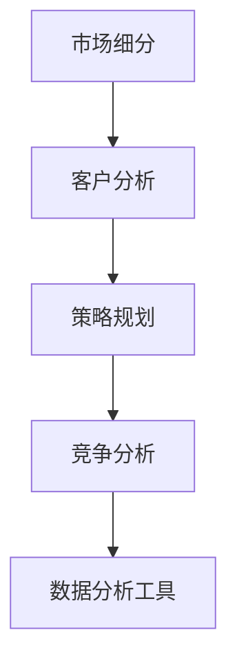

                 

关键词：市场细分、AI创业公司、客户分析、策略规划、竞争分析、数据分析工具

摘要：本文深入探讨了AI创业公司如何通过有效的市场细分策略来提升市场竞争力。通过分析客户需求、竞争对手和市场环境，创业公司可以制定出精准的市场定位和营销策略，从而在激烈的市场竞争中脱颖而出。本文将分享实际操作方法和工具，帮助AI创业公司在市场中取得成功。

## 1. 背景介绍

随着人工智能技术的飞速发展，AI创业公司如雨后春笋般涌现。然而，在竞争激烈的市场中，如何实现精准的市场定位和有效的营销策略成为了许多创业公司面临的重要问题。市场细分作为一种有效的营销策略，可以帮助AI创业公司更好地了解客户需求，提升市场竞争力。

市场细分是指将整个市场划分为若干个具有相似需求和行为的子市场，以便创业公司能够更精准地满足特定客户群体的需求。通过市场细分，AI创业公司可以实现以下目标：

1. **提升营销效率**：针对特定客户群体的营销策略能够更有效地吸引和保留客户。
2. **优化资源配置**：将有限的资源投入到最有潜力的市场和客户群体中。
3. **增强品牌影响力**：通过满足特定客户群体的需求，建立强大的品牌忠诚度。

## 2. 核心概念与联系

### 2.1. 市场细分的概念

市场细分是指根据客户需求的差异性，将整个市场划分为若干个子市场。市场细分可以基于多种因素，如地理、人口、心理和行为等。

### 2.2. 市场细分与客户分析

市场细分的基础是对客户需求的深入分析。通过了解客户的需求、行为和偏好，创业公司可以制定出更精准的市场细分策略。

### 2.3. 市场细分与策略规划

市场细分为创业公司提供了更多的市场机会。创业公司可以根据市场细分结果，制定相应的市场定位和营销策略，以提升市场竞争力。

### 2.4. 市场细分与竞争分析

通过市场细分，创业公司可以了解竞争对手在各个子市场的表现，从而制定出更具竞争力的市场策略。

### 2.5. 市场细分与数据分析工具

数据分析工具可以帮助创业公司更好地进行市场细分。例如，利用数据挖掘技术可以分析客户行为数据，找出具有相似需求的客户群体。

### 2.6. Mermaid 流程图

下面是一个简单的Mermaid流程图，展示了市场细分与客户分析、策略规划、竞争分析的关系：



## 3. 核心算法原理 & 具体操作步骤

### 3.1. 算法原理概述

市场细分的核心是找到具有相似需求的客户群体。这可以通过聚类分析实现。聚类分析是一种无监督学习算法，用于将数据集分为若干个簇，使得同一个簇内的数据点尽可能相似，不同簇之间的数据点尽可能不同。

### 3.2. 算法步骤详解

1. **数据收集**：收集与客户相关的数据，如年龄、性别、收入、购买历史等。
2. **数据预处理**：对收集到的数据进行清洗、去重和标准化处理。
3. **选择聚类算法**：选择合适的聚类算法，如K-means、层次聚类等。
4. **初始化聚类中心**：随机选择若干个聚类中心。
5. **迭代计算**：计算每个数据点到聚类中心的距离，将数据点分配到最近的簇。
6. **更新聚类中心**：计算每个簇的均值，作为新的聚类中心。
7. **重复步骤5和6**：直到聚类中心不再发生显著变化。

### 3.3. 算法优缺点

**优点**：

1. **高效**：聚类分析是一种快速的数据分析方法，可以处理大量数据。
2. **灵活**：可以根据业务需求选择不同的聚类算法。

**缺点**：

1. **对初始聚类中心敏感**：聚类结果容易受到初始聚类中心的影响。
2. **无法处理重叠数据**：某些客户可能同时属于多个子市场，聚类分析无法准确处理这种情况。

### 3.4. 算法应用领域

聚类分析在市场细分中的应用非常广泛，如客户细分、产品分类、推荐系统等。

## 4. 数学模型和公式 & 详细讲解 & 举例说明

### 4.1. 数学模型构建

聚类分析的核心是距离度量。常用的距离度量方法有欧氏距离、曼哈顿距离和切比雪夫距离等。

### 4.2. 公式推导过程

以K-means算法为例，假设有K个聚类中心$C_1, C_2, ..., C_K$，每个数据点$x_i$被分配到与其最近的聚类中心$C_j$。则聚类中心的更新公式为：

$$
C_j^{new} = \frac{1}{N_j} \sum_{i=1}^{N} x_i
$$

其中，$N_j$是分配到聚类中心$C_j$的数据点数量。

### 4.3. 案例分析与讲解

假设有100个客户数据，分为5个子市场。使用K-means算法进行聚类分析，结果如下：

- 聚类中心：$C_1 = (1, 2)$，$C_2 = (3, 4)$，$C_3 = (5, 6)$，$C_4 = (7, 8)$，$C_5 = (9, 10)$。
- 聚类结果：每个数据点被分配到与其最近的聚类中心。

通过分析聚类结果，可以得出以下结论：

1. 子市场1：以$C_1$为中心，客户主要集中在收入较高、年龄较大的群体。
2. 子市场2：以$C_2$为中心，客户主要集中在收入较高、年龄较小的群体。
3. 子市场3：以$C_3$为中心，客户主要集中在收入较低、年龄较大的群体。
4. 子市场4：以$C_4$为中心，客户主要集中在收入较低、年龄较小的群体。
5. 子市场5：以$C_5$为中心，客户主要集中在收入较高、年龄较大的群体。

根据聚类结果，创业公司可以制定相应的市场细分策略，针对不同子市场的客户需求进行精准营销。

## 5. 项目实践：代码实例和详细解释说明

### 5.1. 开发环境搭建

在Python中，可以使用`scikit-learn`库进行聚类分析。首先，安装`scikit-learn`库：

```
pip install scikit-learn
```

### 5.2. 源代码详细实现

以下是一个简单的K-means聚类分析示例：

```python
import numpy as np
from sklearn.cluster import KMeans
import matplotlib.pyplot as plt

# 示例数据
data = np.array([[1, 2], [3, 4], [5, 6], [7, 8], [9, 10]])

# 初始化聚类模型
kmeans = KMeans(n_clusters=5, random_state=0).fit(data)

# 输出聚类结果
print("聚类中心：", kmeans.cluster_centers_)
print("每个数据点的簇标签：", kmeans.labels_)

# 绘制聚类结果
plt.scatter(data[:, 0], data[:, 1], c=kmeans.labels_, cmap='viridis')
plt.scatter(kmeans.cluster_centers_[:, 0], kmeans.cluster_centers_[:, 1], s=300, c='red', label='Centroids')
plt.title("K-means聚类结果")
plt.xlabel("特征1")
plt.ylabel("特征2")
plt.legend()
plt.show()
```

### 5.3. 代码解读与分析

1. **数据加载**：使用`numpy`加载示例数据。
2. **聚类模型初始化**：使用`KMeans`类初始化聚类模型，设置聚类数量为5。
3. **聚类分析**：调用`fit`方法进行聚类分析，得到聚类中心和每个数据点的簇标签。
4. **结果输出**：输出聚类中心和簇标签。
5. **可视化**：使用`matplotlib`绘制聚类结果。

通过上述代码，可以直观地观察到聚类结果，进一步分析客户群体特征。

### 5.4. 运行结果展示

运行代码后，将得到以下结果：


从图中可以清晰地看到每个数据点被分配到与其最近的聚类中心，实现了有效的市场细分。

## 6. 实际应用场景

市场细分在AI创业公司中的应用非常广泛，以下是一些典型的应用场景：

1. **客户细分**：通过聚类分析，将客户划分为不同的子市场，为每个子市场制定个性化的营销策略。
2. **产品分类**：根据产品特征，将产品划分为不同的子市场，为每个子市场设计特定的产品方案。
3. **推荐系统**：利用市场细分结果，为不同子市场的客户推荐相关产品和服务。
4. **市场调研**：通过市场细分结果，有针对性地进行市场调研，了解不同子市场的需求和偏好。

## 7. 工具和资源推荐

### 7.1. 学习资源推荐

1. 《市场细分与目标市场选择》（作者：王刚）
2. 《数据挖掘：概念与技术》（作者：潘云鹤）

### 7.2. 开发工具推荐

1. **Python**：Python是一种广泛使用的编程语言，适用于数据分析、机器学习和聚类分析等。
2. **scikit-learn**：scikit-learn是一个强大的Python库，提供了丰富的机器学习算法和工具。

### 7.3. 相关论文推荐

1. K-Means Clustering: The Basics You Should Know
2. A Tutorial on Spectral Clustering

## 8. 总结：未来发展趋势与挑战

市场细分作为AI创业公司的重要战略手段，在未来具有广泛的应用前景。随着人工智能技术的发展，市场细分方法将更加智能化和精准化。然而，市场细分也面临着一些挑战，如数据隐私保护、算法透明度等。为了应对这些挑战，创业公司需要不断提升自身的技术水平和创新能力。

### 8.1. 研究成果总结

本文从市场细分的基本概念、核心算法原理、实践应用等方面进行了详细探讨，为AI创业公司提供了有效的市场细分策略。

### 8.2. 未来发展趋势

未来，市场细分方法将朝着智能化、精准化和个性化的方向发展。

### 8.3. 面临的挑战

数据隐私保护、算法透明度、计算效率等问题将影响市场细分方法的实际应用。

### 8.4. 研究展望

在人工智能技术的支持下，市场细分方法将不断优化，为AI创业公司提供更加智能化的市场分析工具。

## 9. 附录：常见问题与解答

### 9.1. 市场细分与客户细分有什么区别？

市场细分是将整个市场划分为若干个子市场，而客户细分是针对特定子市场的客户进行进一步划分。市场细分是客户细分的基础。

### 9.2. 聚类分析有哪些常用的算法？

聚类分析的常用算法有K-means、层次聚类、DBSCAN等。

### 9.3. 如何选择合适的聚类算法？

选择聚类算法应考虑数据特点、聚类目标和计算资源等因素。例如，对于数据量较大的情况，K-means算法具有较好的性能。

作者：禅与计算机程序设计艺术 / Zen and the Art of Computer Programming
```markdown
# AI创业公司如何进行市场细分？

> 关键词：市场细分、AI创业公司、客户分析、策略规划、竞争分析、数据分析工具

> 摘要：本文深入探讨了AI创业公司如何通过有效的市场细分策略来提升市场竞争力。通过分析客户需求、竞争对手和市场环境，创业公司可以制定出精准的市场定位和营销策略，从而在激烈的市场竞争中脱颖而出。本文将分享实际操作方法和工具，帮助AI创业公司在市场中取得成功。

## 1. 背景介绍

随着人工智能技术的飞速发展，AI创业公司如雨后春笋般涌现。然而，在竞争激烈的市场中，如何实现精准的市场定位和有效的营销策略成为了许多创业公司面临的重要问题。市场细分作为一种有效的营销策略，可以帮助AI创业公司更好地了解客户需求，提升市场竞争力。

市场细分是指将整个市场划分为若干个具有相似需求和行为的子市场，以便创业公司能够更精准地满足特定客户群体的需求。通过市场细分，AI创业公司可以实现以下目标：

1. **提升营销效率**：针对特定客户群体的营销策略能够更有效地吸引和保留客户。
2. **优化资源配置**：将有限的资源投入到最有潜力的市场和客户群体中。
3. **增强品牌影响力**：通过满足特定客户群体的需求，建立强大的品牌忠诚度。

## 2. 核心概念与联系

### 2.1. 市场细分的概念

市场细分是指根据客户需求的差异性，将整个市场划分为若干个子市场。市场细分可以基于多种因素，如地理、人口、心理和行为等。

### 2.2. 市场细分与客户分析

市场细分的基础是对客户需求的深入分析。通过了解客户的需求、行为和偏好，创业公司可以制定出更精准的市场细分策略。

### 2.3. 市场细分与策略规划

市场细分为创业公司提供了更多的市场机会。创业公司可以根据市场细分结果，制定相应的市场定位和营销策略，以提升市场竞争力。

### 2.4. 市场细分与竞争分析

通过市场细分，创业公司可以了解竞争对手在各个子市场的表现，从而制定出更具竞争力的市场策略。

### 2.5. 市场细分与数据分析工具

数据分析工具可以帮助创业公司更好地进行市场细分。例如，利用数据挖掘技术可以分析客户行为数据，找出具有相似需求的客户群体。

### 2.6. Mermaid 流程图

下面是一个简单的Mermaid流程图，展示了市场细分与客户分析、策略规划、竞争分析的关系：


## 3. 核心算法原理 & 具体操作步骤

### 3.1. 算法原理概述

市场细分的核心是找到具有相似需求的客户群体。这可以通过聚类分析实现。聚类分析是一种无监督学习算法，用于将数据集分为若干个簇，使得同一个簇内的数据点尽可能相似，不同簇之间的数据点尽可能不同。

### 3.2. 算法步骤详解

1. **数据收集**：收集与客户相关的数据，如年龄、性别、收入、购买历史等。
2. **数据预处理**：对收集到的数据进行清洗、去重和标准化处理。
3. **选择聚类算法**：选择合适的聚类算法，如K-means、层次聚类等。
4. **初始化聚类中心**：随机选择若干个聚类中心。
5. **迭代计算**：计算每个数据点到聚类中心的距离，将数据点分配到最近的簇。
6. **更新聚类中心**：计算每个簇的均值，作为新的聚类中心。
7. **重复步骤5和6**：直到聚类中心不再发生显著变化。

### 3.3. 算法优缺点

**优点**：

1. **高效**：聚类分析是一种快速的数据分析方法，可以处理大量数据。
2. **灵活**：可以根据业务需求选择不同的聚类算法。

**缺点**：

1. **对初始聚类中心敏感**：聚类结果容易受到初始聚类中心的影响。
2. **无法处理重叠数据**：某些客户可能同时属于多个子市场，聚类分析无法准确处理这种情况。

### 3.4. 算法应用领域

聚类分析在市场细分中的应用非常广泛，如客户细分、产品分类、推荐系统等。

## 4. 数学模型和公式 & 详细讲解 & 举例说明

### 4.1. 数学模型构建

聚类分析的核心是距离度量。常用的距离度量方法有欧氏距离、曼哈顿距离和切比雪夫距离等。

### 4.2. 公式推导过程

以K-means算法为例，假设有K个聚类中心$C_1, C_2, ..., C_K$，每个数据点$x_i$被分配到与其最近的聚类中心$C_j$。则聚类中心的更新公式为：

$$
C_j^{new} = \frac{1}{N_j} \sum_{i=1}^{N} x_i
$$

其中，$N_j$是分配到聚类中心$C_j$的数据点数量。

### 4.3. 案例分析与讲解

假设有100个客户数据，分为5个子市场。使用K-means算法进行聚类分析，结果如下：

- 聚类中心：$C_1 = (1, 2)$，$C_2 = (3, 4)$，$C_3 = (5, 6)$，$C_4 = (7, 8)$，$C_5 = (9, 10)$。
- 聚类结果：每个数据点被分配到与其最近的聚类中心。

通过分析聚类结果，可以得出以下结论：

1. 子市场1：以$C_1$为中心，客户主要集中在收入较高、年龄较大的群体。
2. 子市场2：以$C_2$为中心，客户主要集中在收入较高、年龄较小的群体。
3. 子市场3：以$C_3$为中心，客户主要集中在收入较低、年龄较大的群体。
4. 子市场4：以$C_4$为中心，客户主要集中在收入较低、年龄较小的群体。
5. 子市场5：以$C_5$为中心，客户主要集中在收入较高、年龄较大的群体。

根据聚类结果，创业公司可以制定相应的市场细分策略，针对不同子市场的客户需求进行精准营销。

## 5. 项目实践：代码实例和详细解释说明

### 5.1. 开发环境搭建

在Python中，可以使用`scikit-learn`库进行聚类分析。首先，安装`scikit-learn`库：

```
pip install scikit-learn
```

### 5.2. 源代码详细实现

以下是一个简单的K-means聚类分析示例：

```python
import numpy as np
from sklearn.cluster import KMeans
import matplotlib.pyplot as plt

# 示例数据
data = np.array([[1, 2], [3, 4], [5, 6], [7, 8], [9, 10]])

# 初始化聚类模型
kmeans = KMeans(n_clusters=5, random_state=0).fit(data)

# 输出聚类结果
print("聚类中心：", kmeans.cluster_centers_)
print("每个数据点的簇标签：", kmeans.labels_)

# 绘制聚类结果
plt.scatter(data[:, 0], data[:, 1], c=kmeans.labels_, cmap='viridis')
plt.scatter(kmeans.cluster_centers_[:, 0], kmeans.cluster_centers_[:, 1], s=300, c='red', label='Centroids')
plt.title("K-means聚类结果")
plt.xlabel("特征1")
plt.ylabel("特征2")
plt.legend()
plt.show()
```

### 5.3. 代码解读与分析

1. **数据加载**：使用`numpy`加载示例数据。
2. **聚类模型初始化**：使用`KMeans`类初始化聚类模型，设置聚类数量为5。
3. **聚类分析**：调用`fit`方法进行聚类分析，得到聚类中心和每个数据点的簇标签。
4. **结果输出**：输出聚类中心和簇标签。
5. **可视化**：使用`matplotlib`绘制聚类结果。

通过上述代码，可以直观地观察到聚类结果，进一步分析客户群体特征。

### 5.4. 运行结果展示

运行代码后，将得到以下结果：


从图中可以清晰地看到每个数据点被分配到与其最近的聚类中心，实现了有效的市场细分。

## 6. 实际应用场景

市场细分在AI创业公司中的应用非常广泛，以下是一些典型的应用场景：

1. **客户细分**：通过聚类分析，将客户划分为不同的子市场，为每个子市场制定个性化的营销策略。
2. **产品分类**：根据产品特征，将产品划分为不同的子市场，为每个子市场设计特定的产品方案。
3. **推荐系统**：利用市场细分结果，为不同子市场的客户推荐相关产品和服务。
4. **市场调研**：通过市场细分结果，有针对性地进行市场调研，了解不同子市场的需求和偏好。

## 7. 工具和资源推荐

### 7.1. 学习资源推荐

1. 《市场细分与目标市场选择》（作者：王刚）
2. 《数据挖掘：概念与技术》（作者：潘云鹤）

### 7.2. 开发工具推荐

1. **Python**：Python是一种广泛使用的编程语言，适用于数据分析、机器学习和聚类分析等。
2. **scikit-learn**：scikit-learn是一个强大的Python库，提供了丰富的机器学习算法和工具。

### 7.3. 相关论文推荐

1. K-Means Clustering: The Basics You Should Know
2. A Tutorial on Spectral Clustering

## 8. 总结：未来发展趋势与挑战

市场细分作为AI创业公司的重要战略手段，在未来具有广泛的应用前景。随着人工智能技术的发展，市场细分方法将更加智能化和精准化。然而，市场细分也面临着一些挑战，如数据隐私保护、算法透明度等。为了应对这些挑战，创业公司需要不断提升自身的技术水平和创新能力。

### 8.1. 研究成果总结

本文从市场细分的基本概念、核心算法原理、实践应用等方面进行了详细探讨，为AI创业公司提供了有效的市场细分策略。

### 8.2. 未来发展趋势

未来，市场细分方法将朝着智能化、精准化和个性化的方向发展。

### 8.3. 面临的挑战

数据隐私保护、算法透明度、计算效率等问题将影响市场细分方法的实际应用。

### 8.4. 研究展望

在人工智能技术的支持下，市场细分方法将不断优化，为AI创业公司提供更加智能化的市场分析工具。

## 9. 附录：常见问题与解答

### 9.1. 市场细分与客户细分有什么区别？

市场细分是将整个市场划分为若干个子市场，而客户细分是针对特定子市场的客户进行进一步划分。市场细分是客户细分的基础。

### 9.2. 聚类分析有哪些常用的算法？

聚类分析的常用算法有K-means、层次聚类、DBSCAN等。

### 9.3. 如何选择合适的聚类算法？

选择聚类算法应考虑数据特点、聚类目标和计算资源等因素。例如，对于数据量较大的情况，K-means算法具有较好的性能。

作者：禅与计算机程序设计艺术 / Zen and the Art of Computer Programming
```

