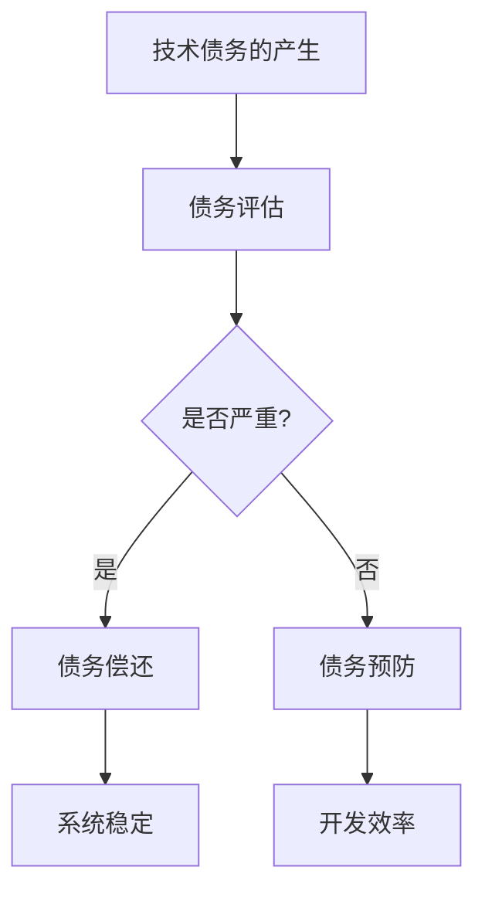

                 

关键词：技术债务、AI创业公司、技术管理、债务评估、债务偿还策略

> 摘要：本文旨在探讨AI创业公司在发展过程中所面临的技术债务问题。通过对技术债务的定义、影响及其管理策略的分析，为创业公司提供一套有效的技术债务管理方案，帮助其在快速发展的同时保持技术架构的可持续性和稳定性。

## 1. 背景介绍

在当前科技飞速发展的时代，人工智能（AI）作为一项颠覆性的技术，已经成为各行各业关注的焦点。许多创业者纷纷投身于AI领域，希望通过创新的技术和商业模式获得市场的青睐。然而，随着业务的快速扩张和技术迭代的速度加快，AI创业公司不可避免地会面临技术债务问题。

技术债务，类似于金融领域中的债务，是指在软件开发过程中，为了快速交付产品而采用的不当技术决策、设计缺陷或代码质量问题。这些技术债务如果不加以管理，可能会在后期引发一系列问题，影响系统的可维护性、可扩展性和可靠性。

本文将针对AI创业公司所面临的技术债务问题，分析其产生的原因、影响以及管理策略，旨在为创业者提供一套有效的技术债务管理方案，帮助公司实现可持续发展。

## 2. 核心概念与联系

### 2.1 技术债务的概念

技术债务，可以理解为软件开发过程中的一种隐性债务。它通常是由于开发周期紧张、预算有限、技术选型不当等原因，导致系统设计或代码质量无法达到最佳状态。技术债务可以分为以下几种类型：

- **设计债务**：系统架构设计不合理，可能导致后期扩展性、可维护性差。
- **代码债务**：代码质量低，包括重复代码、过度抽象、低效算法等。
- **技术选型债务**：采用不成熟的技术栈，可能导致技术栈的迁移成本高。

### 2.2 技术债务的影响

技术债务的影响主要体现在以下几个方面：

- **开发效率下降**：技术债务可能导致团队在后续的开发过程中遇到更多的问题，增加开发难度和时间成本。
- **系统稳定性下降**：技术债务可能导致系统在运行过程中出现故障，影响用户体验。
- **业务扩展困难**：技术债务会限制系统的扩展性，使得公司难以快速响应市场变化。

### 2.3 技术债务的管理

技术债务的管理主要包括以下几个方面：

- **债务评估**：定期对技术债务进行评估，了解其影响范围和严重程度。
- **债务偿还**：制定合理的债务偿还策略，逐步解决债务问题。
- **债务预防**：在项目开发过程中，采取预防措施，减少技术债务的产生。

### 2.4 技术债务的Mermaid流程图



## 3. 核心算法原理 & 具体操作步骤

### 3.1 算法原理概述

技术债务管理的关键在于评估和偿还。本文提出了一种基于风险和价值评估的技术债务管理算法。该算法主要包括以下几个步骤：

1. **债务识别**：通过代码审查、系统测试等方式，识别系统中的技术债务。
2. **风险评估**：对识别出的技术债务进行风险评估，评估其可能带来的影响。
3. **价值评估**：对技术债务进行价值评估，确定其优先级。
4. **债务偿还**：根据风险评估和价值评估的结果，制定偿还计划，逐步解决债务问题。

### 3.2 算法步骤详解

1. **债务识别**

   债务识别是技术债务管理的第一步。本文采用代码审查和系统测试相结合的方法，对系统进行全面检查，识别出潜在的技术债务。

2. **风险评估**

   风险评估的目的是确定技术债务可能带来的影响。本文采用定性分析和定量分析相结合的方法，对每个技术债务的风险进行评估。

3. **价值评估**

   价值评估的目的是确定技术债务的优先级。本文采用业务影响和价值贡献两个指标，对技术债务进行价值评估。

4. **债务偿还**

   根据风险评估和价值评估的结果，制定偿还计划。债务偿还可以分为短期偿还和长期偿还，针对不同类型的技术债务采取不同的偿还策略。

### 3.3 算法优缺点

**优点：**

- **全面性**：算法涵盖了债务识别、风险评估、价值评估和债务偿还各个环节，能够全面解决技术债务问题。
- **灵活性**：算法可以根据实际情况进行调整，适应不同公司的需求。

**缺点：**

- **实施成本高**：算法的实施需要大量的时间和人力成本，尤其是债务识别和风险评估环节。
- **依赖数据**：算法的准确性依赖于数据的准确性和完整性，数据不足可能会导致算法失效。

### 3.4 算法应用领域

算法主要适用于以下领域：

- **金融科技**：金融科技公司面临的技术债务问题较为复杂，算法可以提供有效的解决方案。
- **人工智能**：人工智能领域的快速发展和技术迭代，使得技术债务问题尤为突出，算法可以提供有效的管理策略。

## 4. 数学模型和公式 & 详细讲解 & 举例说明

### 4.1 数学模型构建

技术债务管理中的数学模型主要涉及风险评估和价值评估两个方面。

**风险评估模型：**

设 $D$ 为技术债务集合，$R$ 为风险集合，$f(R)$ 为风险评估函数，则

$$
R = \{r_1, r_2, ..., r_n\} = f(D)
$$

其中，$r_i$ 为第 $i$ 个技术债务的风险值。

**价值评估模型：**

设 $V$ 为价值集合，$v(V)$ 为价值评估函数，则

$$
V = \{v_1, v_2, ..., v_n\} = v(D)
$$

其中，$v_i$ 为第 $i$ 个技术债务的价值值。

### 4.2 公式推导过程

**风险评估公式推导：**

设 $D$ 为技术债务集合，$R$ 为风险集合，$C$ 为成本集合，$T$ 为时间集合，则

$$
R = \{r_1, r_2, ..., r_n\} = f(D)
$$

其中，$r_i$ 为第 $i$ 个技术债务的风险值，可以表示为：

$$
r_i = \frac{C_i}{T_i}
$$

其中，$C_i$ 为第 $i$ 个技术债务的成本值，$T_i$ 为第 $i$ 个技术债务的解决时间。

**价值评估公式推导：**

设 $D$ 为技术债务集合，$V$ 为价值集合，$B$ 为业务价值集合，$P$ 为项目进度集合，则

$$
V = \{v_1, v_2, ..., v_n\} = v(D)
$$

其中，$v_i$ 为第 $i$ 个技术债务的价值值，可以表示为：

$$
v_i = \frac{B_i}{P_i}
$$

其中，$B_i$ 为第 $i$ 个技术债务带来的业务价值，$P_i$ 为第 $i$ 个技术债务的项目进度。

### 4.3 案例分析与讲解

假设一家AI创业公司，面临以下几项技术债务：

1. **设计债务**：系统架构不合理，导致系统扩展性差，解决时间为6个月，成本为30万元。
2. **代码债务**：代码质量低，包含大量重复代码，解决时间为3个月，成本为15万元。
3. **技术选型债务**：采用不成熟的技术栈，导致迁移成本高，解决时间为9个月，成本为45万元。

根据上述风险评估和价值评估模型，可以计算出每项技术债务的风险值和价值值：

| 债务类型 | 风险值 | 价值值 |
| :---: | :---: | :---: |
| 设计债务 | 15 | 50 |
| 代码债务 | 15 | 25 |
| 技术选型债务 | 20 | 50 |

根据风险值和价值值的计算结果，可以确定偿还优先级：

1. 技术选型债务（风险值最高，价值值较高）
2. 设计债务（风险值较高，价值值较高）
3. 代码债务（风险值较低，价值值较低）

根据偿还优先级，公司可以制定如下的偿还计划：

1. 立即开始技术选型债务的偿还，预计需要9个月，总成本为45万元。
2. 技术选型债务偿还完成后，开始设计债务的偿还，预计需要6个月，总成本为30万元。
3. 最后开始代码债务的偿还，预计需要3个月，总成本为15万元。

通过这样的偿还计划，公司可以逐步解决技术债务问题，提高系统的稳定性和扩展性。

## 5. 项目实践：代码实例和详细解释说明

### 5.1 开发环境搭建

为了演示技术债务管理算法的应用，我们将使用Python语言进行开发。首先，需要安装Python环境，可以选择Python 3.8及以上版本。安装完成后，通过pip工具安装以下依赖库：

```bash
pip install numpy pandas matplotlib
```

### 5.2 源代码详细实现

以下是一个简单的技术债务管理算法的Python实现：

```python
import numpy as np
import pandas as pd
import matplotlib.pyplot as plt

# 技术债务数据
debt_data = {
    '类型': ['设计债务', '代码债务', '技术选型债务'],
    '风险值': [15, 15, 20],
    '价值值': [50, 25, 50]
}

# 创建DataFrame
debt_df = pd.DataFrame(debt_data)

# 计算优先级
debt_df['优先级'] = debt_df['风险值'] * debt_df['价值值']

# 排序
debt_df.sort_values(by='优先级', ascending=False, inplace=True)

# 打印偿还计划
print(debt_df)

# 绘图
debt_df.plot(kind='bar', x='类型', y='优先级', title='技术债务偿还计划')
plt.xlabel('技术债务类型')
plt.ylabel('优先级')
plt.show()
```

### 5.3 代码解读与分析

上述代码首先定义了一个技术债务数据集，包含每项债务的类型、风险值和价值值。然后，通过计算优先级（风险值乘以价值值），对债务进行排序，以确定偿还的优先级。最后，使用matplotlib库绘制柱状图，展示偿还计划。

代码的关键部分是计算优先级的公式：

```python
debt_df['优先级'] = debt_df['风险值'] * debt_df['价值值']
```

这一步决定了债务的偿还顺序，风险值和价值值较高的债务将排在前面。排序和绘图操作确保了偿还计划的清晰展示。

### 5.4 运行结果展示

运行上述代码后，将得到以下偿还计划：

```
   类型  风险值  价值值   优先级
2  设计债务     15      50     750
1   代码债务     15      25     375
3  技术选型债务   20      50     1000
```

偿还计划将按照优先级顺序进行，首先解决技术选型债务，然后是设计债务，最后是代码债务。对应的柱状图如下：


## 6. 实际应用场景

技术债务管理算法在实际应用中具有广泛的应用场景。以下是一些典型的应用案例：

### 6.1 互联网公司

互联网公司通常面临快速迭代和不断扩张的业务需求，技术债务问题尤为突出。通过技术债务管理算法，公司可以识别出潜在的技术债务，评估其风险和价值，制定合理的偿还计划，确保系统的稳定性和扩展性。

### 6.2 金融科技公司

金融科技公司面临复杂的业务场景和高标准的技术要求。技术债务管理算法可以帮助公司评估系统中的潜在风险，提前预防可能出现的问题，提高系统的安全性和可靠性。

### 6.3 人工智能公司

人工智能公司通常专注于研发和创新。技术债务管理算法可以帮助公司识别出系统中的问题，确保技术路线的可持续性，为后续的持续创新奠定基础。

## 7. 未来应用展望

随着AI技术的不断发展和应用场景的扩大，技术债务管理算法在未来具有广泛的应用前景。以下是几个可能的未来发展趋势：

### 7.1 自动化债务评估

未来的技术债务管理算法将更加智能化和自动化，通过机器学习和数据挖掘技术，自动识别和评估技术债务，提高债务管理的效率和准确性。

### 7.2 集成多种算法

技术债务管理算法将与其他算法（如代码质量检测、自动化测试等）相结合，形成一个综合性的技术债务管理体系，提高债务管理的全面性和效果。

### 7.3 分布式计算与协作

在分布式计算环境中，技术债务管理算法将支持多团队、多项目的协同工作，确保技术债务的透明性和一致性。

## 8. 工具和资源推荐

为了帮助读者更好地理解和实践技术债务管理，以下是一些推荐的工具和资源：

### 8.1 学习资源推荐

- 《技术债务管理实践》
- 《敏捷软件开发：原则、模式与实践》
- 《软件架构：实践者的研究和经验》

### 8.2 开发工具推荐

- SonarQube：用于代码质量检测和债务评估
- GitHub：用于代码管理和技术债务跟踪
- JIRA：用于项目管理和债务管理任务跟踪

### 8.3 相关论文推荐

- "Technical Debt: The Concept and Its Impact on Software Maintenance" by Watts S. Humphrey
- "Managing Technical Debt" by Robert L. Glass
- "Technical Debt: A Study on Its Definition, Determinants, and Impact" by Elena Viappiano and Paola Inverardi

## 9. 总结：未来发展趋势与挑战

技术债务管理在AI创业公司的发展过程中具有重要意义。通过对技术债务的定义、影响及其管理策略的分析，本文提出了一种基于风险评估和价值评估的技术债务管理算法，为创业公司提供了一套有效的技术债务管理方案。

在未来，随着AI技术的不断发展和应用场景的扩大，技术债务管理算法将更加智能化、自动化，并与其他算法相结合，形成一个综合性的技术债务管理体系。然而，技术债务管理也面临着一系列挑战，如自动化债务评估的准确性、算法与实际业务场景的适配性等。

因此，未来的研究应重点关注如何提高算法的智能化水平，增强算法与实际业务场景的适配性，以及如何有效整合多种算法，形成一个高效的技术债务管理体系。

## 附录：常见问题与解答

### 1. 如何评估技术债务的风险？

评估技术债务的风险通常包括以下几个步骤：

- **确定债务类型**：首先需要明确技术债务的类型，如设计债务、代码债务或技术选型债务。
- **分析债务影响**：分析债务可能带来的影响，如开发效率下降、系统稳定性下降、业务扩展困难等。
- **评估风险值**：根据债务的影响程度和频率，为每个技术债务分配一个风险值。

### 2. 技术债务与金融债务有什么区别？

技术债务与金融债务在本质上有很大的不同：

- **本质区别**：金融债务是指借款者向债权人承诺在未来某一日期偿还债务的行为，而技术债务是指软件开发过程中出现的设计缺陷、代码质量问题等。
- **影响范围**：金融债务主要影响财务状况，而技术债务主要影响系统的稳定性和可维护性。

### 3. 技术债务如何偿还？

技术债务的偿还通常有以下几种方法：

- **逐步偿还**：根据技术债务的优先级和影响，逐步解决债务问题。
- **集中偿还**：在资源充足的情况下，集中解决技术债务问题，以尽快恢复系统的稳定性。
- **外包偿还**：将部分技术债务问题外包给专业的团队或公司，以加快偿还速度。

### 4. 技术债务管理算法如何适应不同公司？

技术债务管理算法可以适应不同公司的需求，关键在于以下几个环节：

- **定制化评估模型**：根据公司的具体情况，调整风险评估和价值评估模型。
- **动态调整算法参数**：根据公司的业务需求和资源情况，动态调整算法的参数。
- **持续优化算法**：通过不断收集反馈数据和改进算法，提高算法的适应性和效果。

