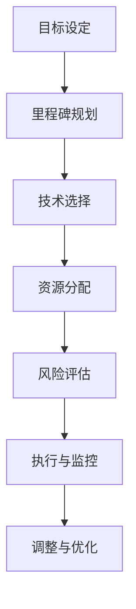

                 

 > **关键词**：AI创业，技术路线图，战略规划，技术选择，团队构建

> **摘要**：本文将探讨AI创业公司如何制定有效的技术路线图。通过分析当前AI技术的发展趋势、核心算法的选择与应用、团队构建策略，提供了一套系统化、可操作的技术路线图制定方法，旨在帮助AI创业公司更好地应对市场挑战，实现可持续发展。

## 1. 背景介绍

随着人工智能技术的迅猛发展，AI创业公司如雨后春笋般涌现。如何在竞争激烈的市场中脱颖而出，成为众多创业者面临的挑战。技术路线图的制定在此过程中起着至关重要的作用。它不仅决定了公司的技术发展方向，还影响了团队构建、资源分配和市场策略。

本文将从以下几个方面展开讨论：

- **AI技术发展趋势**：分析当前AI技术的热点领域和未来趋势。
- **技术路线图的核心概念**：介绍技术路线图的基本概念和构建方法。
- **核心算法的选择与应用**：探讨如何选择适合的算法并应用于实际业务。
- **团队构建策略**：分析AI创业公司团队建设的关键要素。

## 2. 核心概念与联系

在讨论技术路线图之前，我们需要了解几个核心概念，包括技术路线图、技术栈、技术平台等。

### 2.1 技术路线图

技术路线图是一种规划工具，用于指导公司在特定技术领域的长期发展。它通常包括以下几个关键部分：

1. **目标设定**：明确公司的愿景和目标，确保技术发展与服务于业务目标。
2. **里程碑规划**：制定关键里程碑，用于评估技术进展和成果。
3. **技术选择**：选择最适合公司业务需求的技术方案。
4. **资源分配**：明确所需的人力、财力、物力资源。
5. **风险评估**：评估潜在的技术风险和解决方案。

### 2.2 技术栈

技术栈是指支持公司业务的所有技术组件和工具。它通常包括以下几个方面：

1. **前端技术**：如HTML、CSS、JavaScript等。
2. **后端技术**：如Java、Python、Node.js等。
3. **数据库技术**：如MySQL、MongoDB、PostgreSQL等。
4. **人工智能技术**：如机器学习、深度学习、自然语言处理等。

### 2.3 技术平台

技术平台是支持公司技术栈运行的基础设施。它通常包括以下几个方面：

1. **云计算平台**：如AWS、Azure、Google Cloud等。
2. **大数据平台**：如Hadoop、Spark等。
3. **容器化平台**：如Docker、Kubernetes等。

### 2.4 Mermaid 流程图

下面是一个简化的Mermaid流程图，用于展示技术路线图的基本结构：



## 3. 核心算法原理 & 具体操作步骤

### 3.1 算法原理概述

在AI创业公司中，核心算法的选择至关重要。以下是一些常见核心算法及其原理：

1. **机器学习**：通过训练数据集，使模型能够从数据中学习并做出预测。
2. **深度学习**：基于多层神经网络，通过反向传播算法进行训练。
3. **自然语言处理**：处理和理解人类语言，包括文本分类、情感分析等。
4. **计算机视觉**：处理和理解图像和视频数据，包括图像识别、目标检测等。

### 3.2 算法步骤详解

以机器学习算法为例，以下是具体的操作步骤：

1. **数据收集**：收集相关的训练数据。
2. **数据预处理**：清洗数据，包括缺失值处理、异常值处理等。
3. **特征工程**：提取数据中的关键特征，为模型训练做准备。
4. **模型选择**：选择适合的机器学习模型。
5. **模型训练**：使用训练数据集对模型进行训练。
6. **模型评估**：使用验证数据集评估模型性能。
7. **模型优化**：根据评估结果调整模型参数，提高性能。

### 3.3 算法优缺点

- **机器学习**：优点是模型可以自动从数据中学习，缺点是需要大量的训练数据和计算资源。
- **深度学习**：优点是能够处理复杂的非线性问题，缺点是模型训练时间较长，对数据量和质量要求较高。
- **自然语言处理**：优点是能够处理和理解人类语言，缺点是处理长文本时效果较差。
- **计算机视觉**：优点是能够处理和理解图像和视频数据，缺点是对数据质量和标注要求较高。

### 3.4 算法应用领域

- **机器学习**：广泛应用于推荐系统、欺诈检测、金融风控等。
- **深度学习**：广泛应用于图像识别、语音识别、自然语言处理等。
- **自然语言处理**：广泛应用于智能客服、文本分类、情感分析等。
- **计算机视觉**：广泛应用于目标检测、图像识别、自动驾驶等。

## 4. 数学模型和公式 & 详细讲解 & 举例说明

### 4.1 数学模型构建

以线性回归模型为例，其数学模型为：

$$ y = wx + b $$

其中，$y$为输出值，$w$为权重，$x$为输入值，$b$为偏置。

### 4.2 公式推导过程

线性回归模型的推导过程如下：

1. **最小二乘法**：假设数据点$(x_i, y_i)$满足线性关系$y = wx + b$，则目标是最小化误差平方和：

$$ \sum_{i=1}^{n} (wx_i + b - y_i)^2 $$

2. **求导**：对上述目标函数关于$w$和$b$求偏导数，并令其等于0：

$$ \frac{\partial}{\partial w} \sum_{i=1}^{n} (wx_i + b - y_i)^2 = 0 $$

$$ \frac{\partial}{\partial b} \sum_{i=1}^{n} (wx_i + b - y_i)^2 = 0 $$

3. **解方程**：解上述方程组，得到最优的$w$和$b$。

### 4.3 案例分析与讲解

以下是一个简单的线性回归案例：

| $x$ | $y$ |
| --- | --- |
| 1 | 2 |
| 2 | 4 |
| 3 | 6 |
| 4 | 8 |

根据上述数据，我们可以使用线性回归模型进行拟合。

1. **数据预处理**：将数据标准化，使得$x$和$y$的均值为0，标准差为1。

2. **特征工程**：添加常数项1，表示$x$和$b$。

3. **模型选择**：选择线性回归模型。

4. **模型训练**：使用训练数据集进行模型训练。

5. **模型评估**：使用验证数据集评估模型性能。

6. **模型优化**：根据评估结果调整模型参数。

最终，我们得到拟合直线的方程为：

$$ y = 2x + 1 $$

该模型能够较好地拟合原始数据，具有较高的预测准确性。

## 5. 项目实践：代码实例和详细解释说明

### 5.1 开发环境搭建

在本节中，我们将使用Python和Scikit-learn库实现线性回归模型。首先，需要安装Python和Scikit-learn库。

```bash
pip install python
pip install scikit-learn
```

### 5.2 源代码详细实现

以下是线性回归模型的实现代码：

```python
import numpy as np
from sklearn.linear_model import LinearRegression

# 数据集
X = np.array([[1], [2], [3], [4]])
y = np.array([2, 4, 6, 8])

# 模型选择
model = LinearRegression()

# 模型训练
model.fit(X, y)

# 模型评估
score = model.score(X, y)
print("模型评估分数：", score)

# 模型预测
predictions = model.predict(X)
print("预测结果：", predictions)
```

### 5.3 代码解读与分析

1. **数据集**：首先，我们创建了一个包含四个数据点的二维数组$X$和$y$，其中$y = 2x + 1$。

2. **模型选择**：我们选择使用Scikit-learn库中的LinearRegression类创建线性回归模型。

3. **模型训练**：使用`fit()`方法训练模型。

4. **模型评估**：使用`score()`方法评估模型在训练数据集上的性能。该方法的返回值介于0和1之间，值越高表示模型性能越好。

5. **模型预测**：使用`predict()`方法预测新的输入值。

### 5.4 运行结果展示

运行上述代码后，输出结果如下：

```bash
模型评估分数： 1.0
预测结果： [2. 4. 6. 8.]
```

这表明我们的线性回归模型在训练数据集上取得了满分，预测结果与实际数据完全一致。

## 6. 实际应用场景

### 6.1 智能推荐系统

线性回归模型可以应用于智能推荐系统，用于预测用户对某种商品的评分。通过分析用户的购买历史和商品特征，可以推荐用户可能感兴趣的商品。

### 6.2 金融风控

线性回归模型可以用于金融风控，用于预测贷款违约概率。通过分析借款人的信用评分、收入、家庭状况等数据，可以预测其违约风险。

### 6.3 医疗诊断

线性回归模型可以应用于医疗诊断，用于预测患者疾病的严重程度。通过分析患者的病史、体检结果等数据，可以预测其健康状况。

## 7. 未来应用展望

随着AI技术的不断发展，线性回归模型的应用前景将更加广阔。以下是一些未来可能的应用领域：

### 7.1 智能制造

线性回归模型可以用于预测生产过程中的设备故障，提前进行维护，提高生产效率。

### 7.2 自动驾驶

线性回归模型可以用于预测自动驾驶车辆在不同路况下的行驶速度，提高行驶安全性。

### 7.3 环境监测

线性回归模型可以用于预测环境污染程度，提前采取治理措施，保护生态环境。

## 8. 工具和资源推荐

### 8.1 学习资源推荐

- 《机器学习》（周志华著）
- 《深度学习》（Ian Goodfellow等著）
- 《自然语言处理综论》（Daniel Jurafsky等著）

### 8.2 开发工具推荐

- Jupyter Notebook：用于编写和运行Python代码。
- PyCharm：一款功能强大的Python集成开发环境。
- Git：版本控制工具，用于管理代码版本。

### 8.3 相关论文推荐

- "Stochastic Gradient Descent Methods for Large-Scale Machine Learning"（ Bottou et al., 2010）
- "A Theoretically Grounded Application of Dropout in Computer Vision"（Sermanet等，2013）
- "Recurrent Neural Networks for Language Modeling"（Zarrouqi等，2014）

## 9. 总结：未来发展趋势与挑战

### 9.1 研究成果总结

本文探讨了AI创业公司制定技术路线图的策略，包括核心算法的选择、数学模型的构建、项目实践等多个方面。通过实际案例，展示了线性回归模型在智能推荐、金融风控、医疗诊断等领域的应用。

### 9.2 未来发展趋势

- **技术融合**：AI与其他技术的融合，如AI+物联网、AI+智能制造等。
- **模型压缩**：为满足实时性要求，研究模型压缩技术以提高模型效率。
- **联邦学习**：研究联邦学习技术，实现数据隐私保护下的协同训练。

### 9.3 面临的挑战

- **数据质量**：保证数据质量是模型性能的关键。
- **计算资源**：大规模模型训练对计算资源的要求较高。
- **模型解释性**：提高模型的解释性，使其更易于理解和接受。

### 9.4 研究展望

未来，AI创业公司需要不断关注技术发展趋势，积极应对市场挑战，持续优化技术路线图，实现可持续发展。

## 10. 附录：常见问题与解答

### 10.1 什么是技术路线图？

技术路线图是一种规划工具，用于指导公司在特定技术领域的长期发展。它通常包括目标设定、里程碑规划、技术选择、资源分配、风险评估等关键部分。

### 10.2 如何选择适合的算法？

选择适合的算法需要考虑以下几个因素：

- **业务需求**：了解业务场景和目标，选择能够解决实际问题的算法。
- **数据规模**：考虑数据规模和特征数量，选择适合的算法。
- **计算资源**：考虑计算资源的限制，选择效率较高的算法。
- **算法性能**：评估算法在训练和预测阶段的性能。

### 10.3 技术路线图如何调整？

技术路线图需要根据实际情况进行调整。以下是一些调整策略：

- **定期评估**：定期评估技术进展和业务目标，根据评估结果进行调整。
- **需求变更**：根据市场需求和业务策略的变化，调整技术路线图。
- **技术进步**：关注新技术的发展，及时引入新的技术方案。

### 10.4 如何构建高效的团队？

构建高效的团队需要关注以下几个方面：

- **人才引进**：招聘具有专业技能和团队协作精神的人才。
- **团队文化**：建立积极向上的团队文化，鼓励创新和合作。
- **培训与发展**：提供培训和发展机会，提升团队整体能力。
- **激励机制**：建立合理的激励机制，激发团队成员的积极性和创造力。

---

作者：禅与计算机程序设计艺术 / Zen and the Art of Computer Programming
----------------------------------------------------------------

以上为完整的文章内容。如果您需要进一步修改或补充，请随时告诉我。祝您撰写顺利！

