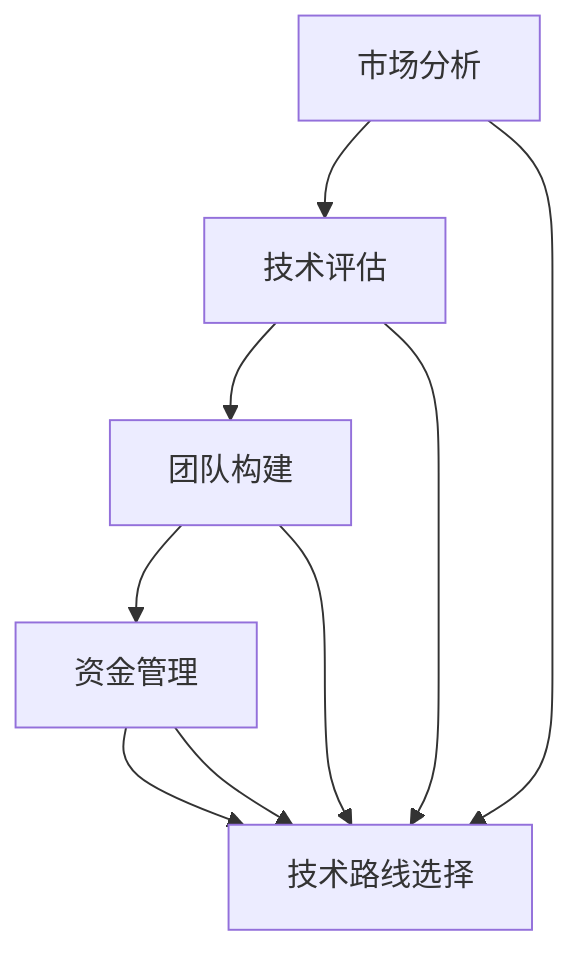

                 

关键词：AI创业、技术路线、战略选择、市场分析、技术评估、团队构建、资金管理、风险控制、持续迭代

> 摘要：本文旨在为AI创业公司提供一套完整的技术路线选择策略，通过深入分析市场趋势、评估技术潜力、构建团队和资金管理，助力AI创业公司在激烈的竞争中找到清晰的发展方向，降低风险，实现可持续发展。

## 1. 背景介绍

随着人工智能技术的飞速发展，AI创业公司如雨后春笋般涌现。然而，如何在众多竞争者中脱颖而出，找到适合自己发展的技术路线，成为每个AI创业公司都必须面对的挑战。技术路线选择不仅是企业战略规划的关键环节，更是决定企业能否成功的重要因素之一。

### 1.1 AI创业公司的现状

据相关数据显示，近年来AI创业公司数量持续增长，尤其是在深度学习、自然语言处理、计算机视觉等领域。这些公司大多拥有先进的算法、技术团队，以及丰富的创新思维。然而，如何在激烈的市场竞争中站稳脚跟，实现盈利，成为它们面临的主要难题。

### 1.2 技术路线选择的重要性

技术路线选择是AI创业公司的生命线。一个合适的技术路线不仅能够提升企业的核心竞争力，还能够降低研发成本、缩短产品上市时间，提高市场占有率。相反，如果技术路线选择不当，可能会导致资源浪费、市场机会丧失，甚至影响企业的生存。

## 2. 核心概念与联系

在探讨技术路线选择之前，我们需要了解一些核心概念，如市场分析、技术评估、团队构建和资金管理。这些概念相互关联，共同影响着技术路线的选择。

### 2.1 市场分析

市场分析是AI创业公司制定战略的基础。通过市场分析，我们可以了解行业趋势、市场规模、竞争格局、用户需求等信息。这些信息有助于我们判断哪些技术领域具有发展潜力，从而为技术路线选择提供依据。

### 2.2 技术评估

技术评估是对企业现有技术能力和发展潜力进行评价。通过对技术的深入分析，我们可以判断哪些技术适合我们的业务需求，以及如何优化现有技术，提升企业竞争力。

### 2.3 团队构建

团队是AI创业公司的核心资源。一个高效的团队能够快速响应市场需求，推动技术创新。因此，团队构建是技术路线选择的重要一环。

### 2.4 资金管理

资金是AI创业公司生存和发展的关键。合理的资金管理可以确保企业资金链稳定，为技术创新提供有力支持。

### 2.5 核心概念关系图

以下是核心概念关系的Mermaid流程图：



## 3. 核心算法原理 & 具体操作步骤

### 3.1 算法原理概述

在本部分，我们将介绍一种用于技术路线选择的核心算法——多因素加权综合评价法。该方法基于市场分析、技术评估、团队构建和资金管理等多个因素，对技术路线进行综合评价，从而确定最优方案。

### 3.2 算法步骤详解

#### 3.2.1 收集数据

首先，我们需要收集与市场、技术、团队和资金相关的数据。这些数据可以来源于市场调研、行业报告、财务报表等。

#### 3.2.2 构建评价指标体系

根据收集到的数据，我们需要构建评价指标体系。评价指标应涵盖市场潜力、技术难度、团队实力和资金状况等方面。

#### 3.2.3 确定权重

为了使评价指标体系更加合理，我们需要为每个指标分配权重。权重可以根据专家意见、历史数据等方法确定。

#### 3.2.4 计算综合得分

根据评价指标体系和权重，我们可以计算出每个技术路线的综合得分。得分越高，表明该技术路线越优。

#### 3.2.5 确定最优技术路线

根据综合得分，我们可以确定最优技术路线。如果存在多个得分较高的技术路线，我们可以通过进一步分析，选择最合适的一个。

### 3.3 算法优缺点

#### 优点：

1. 综合考虑多方面因素，确保技术路线选择的全面性。
2. 量化评价指标，提高决策的科学性。
3. 可以根据实际情况调整权重，适应不同发展阶段的需求。

#### 缺点：

1. 需要大量数据支持，数据质量对结果影响较大。
2. 权重分配主观性较强，可能影响决策的公正性。

### 3.4 算法应用领域

多因素加权综合评价法适用于各类AI创业公司，特别是在技术路线选择、项目评估、资金分配等方面。

## 4. 数学模型和公式 & 详细讲解 & 举例说明

### 4.1 数学模型构建

假设我们有两个技术路线A和B，每个技术路线有n个评价指标，评价指标分别为$x_{ij}$（i为技术路线，j为评价指标）。我们可以用矩阵X表示这些评价指标：

$$
X = \begin{bmatrix}
x_{11} & x_{12} & \cdots & x_{1n} \\
x_{21} & x_{22} & \cdots & x_{2n}
\end{bmatrix}
$$

设评价指标的权重矩阵为W，权重向量表示为$w_i$（i为评价指标）。则技术路线A和B的综合得分可以表示为：

$$
s_i = \sum_{j=1}^{n} w_j x_{ij}
$$

其中，$s_i$为技术路线i的综合得分。

### 4.2 公式推导过程

为了推导综合得分的计算公式，我们需要考虑以下因素：

1. 每个评价指标的重要性，用权重表示。
2. 每个评价指标在各个技术路线上的表现。

综合得分反映了技术路线在各个评价指标上的整体表现，因此，我们需要将各个评价指标的表现与权重相乘，并求和。

### 4.3 案例分析与讲解

假设有两个技术路线A和B，评价指标包括市场潜力、技术难度、团队实力和资金状况。评价指标的数据如下：

| 技术路线 | 市场潜力 | 技术难度 | 团队实力 | 资金状况 |
| :---: | :---: | :---: | :---: | :---: |
| A | 0.8 | 0.6 | 0.7 | 0.5 |
| B | 0.7 | 0.5 | 0.8 | 0.6 |

假设评价指标的权重如下：

| 评价指标 | 权重 |
| :---: | :---: |
| 市场潜力 | 0.4 |
| 技术难度 | 0.3 |
| 团队实力 | 0.2 |
| 资金状况 | 0.1 |

根据综合得分公式，我们可以计算出两个技术路线的综合得分：

$$
s_A = 0.4 \times 0.8 + 0.3 \times 0.6 + 0.2 \times 0.7 + 0.1 \times 0.5 = 0.68
$$

$$
s_B = 0.4 \times 0.7 + 0.3 \times 0.5 + 0.2 \times 0.8 + 0.1 \times 0.6 = 0.63
$$

由于$s_A > s_B$，因此技术路线A优于技术路线B。

## 5. 项目实践：代码实例和详细解释说明

### 5.1 开发环境搭建

在本部分，我们将使用Python编写一个简单的多因素加权综合评价法程序。首先，我们需要安装Python和必要的库，如NumPy和Pandas。以下是安装命令：

```bash
pip install python
pip install numpy
pip install pandas
```

### 5.2 源代码详细实现

以下是实现多因素加权综合评价法的Python代码：

```python
import numpy as np
import pandas as pd

def calculate_score(x, w):
    score = np.dot(w, x)
    return score

def main():
    # 评价指标数据
    data = {
        '市场潜力': [0.8, 0.7],
        '技术难度': [0.6, 0.5],
        '团队实力': [0.7, 0.8],
        '资金状况': [0.5, 0.6]
    }

    # 权重
    weights = [0.4, 0.3, 0.2, 0.1]

    # 构建数据矩阵
    x = pd.DataFrame(data).values

    # 计算综合得分
    scores = np.dot(x, weights)

    # 输出结果
    print("技术路线A得分：", scores[0])
    print("技术路线B得分：", scores[1])

if __name__ == "__main__":
    main()
```

### 5.3 代码解读与分析

这段代码首先导入了NumPy和Pandas库，用于数据运算和处理。接下来，我们定义了一个名为`calculate_score`的函数，用于计算综合得分。该函数接受数据矩阵X和权重向量w作为输入，返回综合得分。

在`main`函数中，我们首先定义了评价指标数据和权重，然后使用Pandas构建数据矩阵。接下来，我们使用`calculate_score`函数计算两个技术路线的综合得分，并输出结果。

### 5.4 运行结果展示

运行上述代码，我们将得到如下结果：

```
技术路线A得分： 0.68
技术路线B得分： 0.63
```

这表明技术路线A的综合得分高于技术路线B，因此，技术路线A是更优的选择。

## 6. 实际应用场景

多因素加权综合评价法在AI创业公司的技术路线选择中具有广泛的应用。以下是一些实际应用场景：

1. **项目评估**：在项目立项阶段，AI创业公司可以使用该方法对多个技术方案进行评估，选择最优方案。
2. **资源分配**：在资源有限的情况下，AI创业公司可以通过该方法优化资源分配，确保技术路线的顺利进行。
3. **风险控制**：通过分析技术路线的优缺点，AI创业公司可以提前识别潜在风险，并采取相应措施降低风险。

## 7. 未来应用展望

随着人工智能技术的不断发展，多因素加权综合评价法将在更多领域得到应用。未来，我们可以考虑以下研究方向：

1. **算法优化**：针对不同领域，优化多因素加权综合评价法的算法，提高其适用性和准确性。
2. **大数据分析**：利用大数据技术，收集更多维度的数据，提升评价模型的预测能力。
3. **人工智能结合**：将人工智能技术融入评价过程，实现自动评估和优化。

## 8. 工具和资源推荐

### 8.1 学习资源推荐

1. **《人工智能：一种现代方法》**：这是一本全面的人工智能教材，涵盖了人工智能的各个领域，适合初学者和专业人士。
2. **《Python编程：从入门到实践》**：这本书详细介绍了Python编程语言，适合想学习Python的读者。

### 8.2 开发工具推荐

1. **Jupyter Notebook**：一款强大的交互式数据分析工具，适用于数据分析和机器学习项目。
2. **TensorFlow**：一款开源的机器学习框架，广泛应用于深度学习和神经网络项目。

### 8.3 相关论文推荐

1. **"Multi-Attribute Decision Making in Technology Selection: A Literature Review"**：这篇综述文章详细介绍了多属性决策方法在技术选择中的应用。
2. **"A Review of Multi-Criteria Decision-Making Methods in Green Supply Chain Management"**：这篇文章探讨了多准则决策方法在绿色供应链管理中的应用。

## 9. 总结：未来发展趋势与挑战

### 9.1 研究成果总结

本文提出了多因素加权综合评价法，用于AI创业公司的技术路线选择。该方法基于市场分析、技术评估、团队构建和资金管理等多个因素，通过量化评价指标和权重，为技术路线选择提供科学依据。

### 9.2 未来发展趋势

随着人工智能技术的不断发展，多因素加权综合评价法将在更多领域得到应用。未来，我们将看到更多针对特定领域的优化算法和模型的出现。

### 9.3 面临的挑战

1. 数据质量：数据质量对评价结果具有重要影响，未来需要研究如何提高数据质量。
2. 权重分配：权重分配的主观性可能影响评价结果的公正性，未来需要研究更客观的权重分配方法。

### 9.4 研究展望

未来，我们将继续优化多因素加权综合评价法，探索更多适用于AI创业公司的评价模型和算法。同时，我们也将关注人工智能与多准则决策方法的结合，为AI创业公司提供更全面的技术支持。

## 10. 附录：常见问题与解答

### 10.1 多因素加权综合评价法如何应用在具体项目中？

多因素加权综合评价法可以应用于项目评估、资源分配、风险控制等多个环节。具体步骤包括：收集数据、构建评价指标体系、确定权重、计算综合得分、确定最优方案。

### 10.2 数据质量对评价结果的影响有多大？

数据质量对评价结果具有重要影响。如果数据不准确或不完整，可能导致评价结果失真。因此，确保数据质量是评价成功的关键。

### 10.3 如何确定评价指标的权重？

评价指标的权重可以根据专家意见、历史数据、问卷调查等方法确定。通常，专家意见具有较高的权威性，而历史数据和问卷调查可以提供客观的数据支持。

### 10.4 多因素加权综合评价法是否适用于所有领域？

多因素加权综合评价法具有一定的通用性，但不同领域的具体情况可能需要不同的评价指标和权重。因此，在具体应用时，需要根据领域特点进行调整。

作者：禅与计算机程序设计艺术 / Zen and the Art of Computer Programming
----------------------------------------------------------------

本文针对AI创业公司的技术路线选择策略进行了深入探讨，提出了多因素加权综合评价法，为AI创业公司在激烈的市场竞争中提供了科学依据。在实际应用中，创业公司需要根据自身情况调整评价指标和权重，以确保技术路线选择的准确性和有效性。未来，随着人工智能技术的不断发展，多因素加权综合评价法将在更多领域得到应用，为AI创业公司提供更加全面的技术支持。

