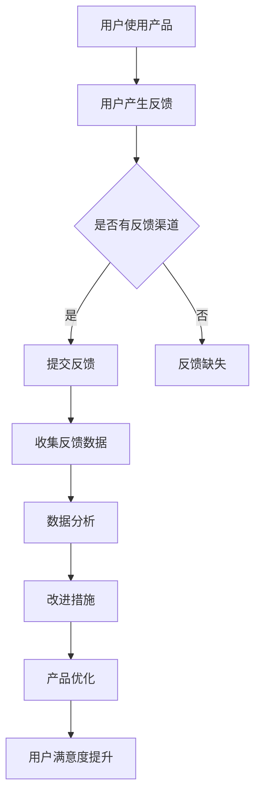

                 

关键词：用户反馈，数据分析，AI创业公司，反馈渠道，改进措施，用户体验

摘要：本文旨在探讨AI创业公司在产品开发和用户服务过程中，如何有效地收集和分析用户反馈，以及基于分析结果制定相应的改进措施。通过梳理反馈渠道、数据收集与分析方法，以及具体的改进措施，帮助创业公司提升产品质量和用户满意度，实现可持续发展。

## 1. 背景介绍

在当今快速发展的AI领域中，创业公司面临着激烈的竞争和不断变化的市场需求。为了在竞争中获得优势，AI创业公司必须密切关注用户需求，不断优化产品功能和用户体验。然而，用户需求的多样性和复杂性使得收集和分析用户反馈成为一个具有挑战性的任务。有效的用户反馈收集和分析不仅能够帮助公司了解用户实际需求，还能为产品改进提供有力依据。

本文将探讨以下几个方面的内容：

- 反馈渠道的选择和优化
- 用户反馈的数据收集方法
- 用户反馈的数据分析方法
- 基于分析结果的改进措施

通过以上内容的阐述，本文旨在为AI创业公司提供一套系统的用户反馈收集与分析策略，以帮助公司在激烈的市场竞争中脱颖而出。

## 2. 核心概念与联系

### 2.1 用户反馈

用户反馈是指用户在使用产品或服务过程中，对产品或服务的满意度、功能需求、体验感受等方面的主观评价和意见。用户反馈是创业公司了解用户需求、改进产品质量和优化用户体验的重要依据。

### 2.2 数据收集方法

数据收集方法是指创业公司在收集用户反馈时所采用的技术手段和策略。常见的用户反馈数据收集方法包括问卷调查、用户访谈、在线反馈表单、社交媒体监测等。

### 2.3 数据分析方法

数据分析方法是指创业公司在收集到用户反馈数据后，对数据进行分析和处理的技术手段。常用的数据分析方法包括数据挖掘、文本分析、聚类分析等。

### 2.4 改进措施

改进措施是指创业公司根据用户反馈数据分析结果，对产品功能和用户体验进行优化和改进的具体行动。常见的改进措施包括功能优化、界面调整、性能提升等。

### 2.5 Mermaid 流程图

以下是一个用户反馈收集与分析的Mermaid流程图示例：



## 3. 核心算法原理 & 具体操作步骤

### 3.1 算法原理概述

用户反馈收集与分析的核心算法原理主要包括以下三个方面：

1. 数据收集：通过多种渠道收集用户反馈数据，确保数据的全面性和真实性。
2. 数据分析：对收集到的用户反馈数据进行分析和处理，提取有价值的信息。
3. 改进措施：根据分析结果制定具体的改进措施，优化产品功能和用户体验。

### 3.2 算法步骤详解

1. 数据收集：

- 采用问卷调查、用户访谈、在线反馈表单等渠道收集用户反馈数据。
- 通过社交媒体监测、用户行为数据分析等手段，挖掘潜在的用户需求。

2. 数据分析：

- 使用数据挖掘、文本分析等技术，对用户反馈数据进行处理和分析。
- 对用户反馈进行分类、归一化等预处理操作，以便后续分析。

3. 改进措施：

- 根据用户反馈数据，分析产品功能和用户体验的不足之处。
- 制定具体的改进措施，如功能优化、界面调整、性能提升等。
- 对改进措施进行验证和评估，确保其有效性和可行性。

### 3.3 算法优缺点

1. 优点：

- 能够快速了解用户需求，为产品改进提供有力依据。
- 通过数据驱动的方式，提高产品优化效率和效果。

2. 缺点：

- 用户反馈数据的多样性和复杂性可能导致分析结果的偏差。
- 需要投入大量时间和资源进行数据收集和分析。

### 3.4 算法应用领域

用户反馈收集与分析算法在以下领域具有广泛应用：

- 互联网产品：如电商平台、社交平台、内容平台等。
- 移动应用：如智能手机应用、平板电脑应用等。
- 物联网设备：如智能家居设备、智能穿戴设备等。
- 企业级应用：如企业管理系统、客户关系管理系统等。

## 4. 数学模型和公式 & 详细讲解 & 举例说明

### 4.1 数学模型构建

用户反馈数据分析中，常见的数学模型包括：

1. 描述性统计模型：用于描述用户反馈数据的整体特征，如平均值、中位数、众数等。
2. 聚类分析模型：用于将用户反馈数据按照相似性进行分类，如K-means算法、层次聚类算法等。
3. 回归分析模型：用于分析用户反馈数据与产品性能之间的关系，如线性回归、多项式回归等。

### 4.2 公式推导过程

以下是一个简单的线性回归模型的公式推导过程：

1. 假设用户反馈数据 \(y\) 与产品性能 \(x\) 之间存在线性关系：

   $$y = \beta_0 + \beta_1x + \epsilon$$

   其中，\(\beta_0\) 和 \(\beta_1\) 分别为模型的参数，\(\epsilon\) 为误差项。

2. 将上述方程转化为最小二乘形式：

   $$\min_{\beta_0, \beta_1} \sum_{i=1}^{n}(y_i - \beta_0 - \beta_1x_i)^2$$

   其中，\(n\) 为样本数量。

3. 对上述方程求导，并令导数为零，得到：

   $$\frac{\partial}{\partial \beta_0}\sum_{i=1}^{n}(y_i - \beta_0 - \beta_1x_i)^2 = 0$$

   $$\frac{\partial}{\partial \beta_1}\sum_{i=1}^{n}(y_i - \beta_0 - \beta_1x_i)^2 = 0$$

4. 解上述方程组，得到参数 \(\beta_0\) 和 \(\beta_1\) 的最优估计值。

### 4.3 案例分析与讲解

以下是一个基于线性回归模型的用户反馈数据分析案例：

1. 数据集描述：

   假设我们收集到一个包含用户反馈数据（满意度评分）和产品性能数据（响应时间）的数据集，如下表所示：

   | 用户ID | 满意度评分 | 响应时间（ms） |
   | ------ | ---------- | -------------- |
   | 1      | 4          | 200            |
   | 2      | 3          | 250            |
   | 3      | 5          | 300            |
   | 4      | 2          | 400            |
   | 5      | 4          | 350            |

2. 数据预处理：

   对数据集进行归一化处理，以便后续分析。

3. 模型构建：

   使用线性回归模型，拟合用户满意度评分与响应时间之间的关系。

4. 模型评估：

   计算模型的预测误差，评估模型的效果。

5. 改进措施：

   根据模型分析结果，针对响应时间较长的用户，优化产品性能，提高用户满意度。

## 5. 项目实践：代码实例和详细解释说明

### 5.1 开发环境搭建

1. 安装Python环境，版本要求3.6及以上。
2. 安装数据分析相关库，如NumPy、Pandas、Scikit-learn等。

### 5.2 源代码详细实现

以下是一个基于Python的线性回归模型用户反馈数据分析的示例代码：

```python
import numpy as np
import pandas as pd
from sklearn.linear_model import LinearRegression
from sklearn.model_selection import train_test_split

# 读取数据集
data = pd.read_csv('user_feedback.csv')
X = data[['response_time']]  # 产品性能数据
y = data['satisfaction_score']  # 用户满意度评分

# 数据集划分
X_train, X_test, y_train, y_test = train_test_split(X, y, test_size=0.2, random_state=42)

# 模型构建
model = LinearRegression()
model.fit(X_train, y_train)

# 模型评估
score = model.score(X_test, y_test)
print('模型评估分数：', score)

# 预测用户满意度评分
predictions = model.predict(X_test)
print('用户满意度评分预测结果：', predictions)

# 改进措施
# 根据预测结果，针对响应时间较长的用户，优化产品性能
```

### 5.3 代码解读与分析

1. 代码首先读取用户反馈数据集，提取产品性能数据和用户满意度评分。
2. 数据集划分成训练集和测试集，用于模型训练和评估。
3. 使用线性回归模型拟合用户满意度评分与响应时间之间的关系。
4. 计算模型评估分数，评估模型效果。
5. 根据模型预测结果，针对响应时间较长的用户，优化产品性能。

## 6. 实际应用场景

用户反馈收集与分析在AI创业公司的实际应用场景包括：

1. 产品功能优化：根据用户反馈，优化产品功能，提高用户满意度。
2. 用户体验提升：通过分析用户反馈，改进用户体验，提升用户留存率。
3. 市场需求洞察：挖掘用户反馈中的潜在需求，为产品创新提供方向。
4. 售后服务改进：根据用户反馈，改进售后服务，提高用户满意度。

## 7. 未来应用展望

随着人工智能技术的不断发展，用户反馈收集与分析在AI创业公司的应用前景包括：

1. 智能化反馈分析：利用自然语言处理技术，实现用户反馈的自动化分析。
2. 个性化推荐：基于用户反馈，为用户提供个性化的产品推荐。
3. 智能客服：结合用户反馈和对话系统，实现智能客服机器人。
4. 社交网络分析：利用用户反馈，挖掘社交网络中的用户需求和趋势。

## 8. 工具和资源推荐

### 8.1 学习资源推荐

1. 《Python数据分析实战》
2. 《机器学习实战》
3. 《深度学习》

### 8.2 开发工具推荐

1. Jupyter Notebook：用于数据分析和模型构建。
2. PyCharm：Python集成开发环境。
3. Tableau：数据可视化工具。

### 8.3 相关论文推荐

1. "User Behavior Analysis in Online Social Networks"
2. "A Survey on User Feedback Analysis in Software Engineering"
3. "Deep Learning for User Behavior Prediction"

## 9. 总结：未来发展趋势与挑战

### 9.1 研究成果总结

本文总结了AI创业公司在用户反馈收集与分析方面的核心概念、算法原理、具体操作步骤和实际应用场景。通过用户反馈收集与分析，公司可以更好地了解用户需求，优化产品功能和用户体验。

### 9.2 未来发展趋势

随着人工智能技术的发展，用户反馈收集与分析将向智能化、个性化、实时化方向迈进。未来，公司有望通过更加智能化的算法和技术，实现用户反馈的自动化分析，提高产品优化效率。

### 9.3 面临的挑战

用户反馈数据的多样性和复杂性，以及数据隐私保护等问题，是AI创业公司在用户反馈收集与分析过程中面临的挑战。公司需要不断探索和创新，以应对这些挑战。

### 9.4 研究展望

未来，用户反馈收集与分析领域的研究将重点关注以下几个方面：

1. 智能化反馈分析算法的研究与优化。
2. 用户隐私保护技术的研发与应用。
3. 用户反馈数据与其他数据的融合分析。

## 9. 附录：常见问题与解答

### 9.1 问题1：如何确保用户反馈数据的真实性？

解答：为了确保用户反馈数据的真实性，公司可以采用以下措施：

1. 采用匿名反馈方式，降低用户反馈的顾虑。
2. 设计合理的反馈问题，引导用户提供真实有效的反馈。
3. 对用户反馈进行筛选和验证，剔除异常数据。

### 9.2 问题2：如何处理大量的用户反馈数据？

解答：针对大量的用户反馈数据，公司可以采用以下策略：

1. 数据预处理：对用户反馈数据进行清洗、归一化等预处理操作，提高数据质量。
2. 分阶段分析：将用户反馈数据分为不同阶段进行分析，如产品上线初期、中期、后期等。
3. 利用数据挖掘和文本分析技术，挖掘用户反馈中的关键信息和趋势。

作者：禅与计算机程序设计艺术 / Zen and the Art of Computer Programming
--------------------------------------------------------------------

