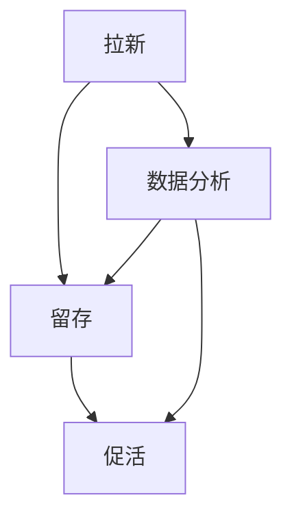

                 

关键词：用户增长策略、AI创业公司、拉新、留存、促活、数据分析、社交媒体、用户体验、营销活动

> 摘要：本文将深入探讨AI创业公司在用户增长方面的策略，重点分析拉新、留存与促活的定义、方法及实践案例。通过结合最新技术趋势和市场实践，提出有效提升用户增长的关键举措，为AI创业公司提供实用指导。

## 1. 背景介绍

随着人工智能技术的迅速发展，AI创业公司如雨后春笋般涌现。这些公司不仅具备技术创新的优势，还面临着激烈的市场竞争。用户增长成为衡量公司成功与否的重要指标。然而，如何在众多竞争对手中脱颖而出，实现用户增长的目标，是每个AI创业公司都需要深思的问题。

用户增长策略主要涵盖拉新、留存和促活三个方面。拉新是指吸引新用户加入公司产品或服务的过程；留存则关注如何保持现有用户的活跃度和忠诚度；促活则是在用户加入后，通过一系列策略促进用户深度使用和转化。

本文将从这三个方面入手，结合实际案例，探讨AI创业公司如何制定和实施有效的用户增长策略。

## 2. 核心概念与联系

### 2.1 拉新

拉新是指通过各种渠道和手段，吸引新用户加入公司产品或服务的流程。有效的拉新策略能够迅速扩大用户基数，提升品牌知名度。

#### 2.1.1 拉新渠道

- **社交媒体**: 通过社交媒体平台（如微博、微信、抖音等）发布有吸引力的内容，吸引潜在用户关注。
- **搜索引擎**: 优化搜索引擎（SEO），提高公司产品在搜索结果中的排名，吸引有意向的用户点击。
- **广告**: 在各大平台上投放精准广告，直接吸引潜在用户。

#### 2.1.2 拉新方法

- **内容营销**: 发布高质量的内容，如技术博客、行业分析等，提高品牌的专业形象，吸引潜在用户。
- **用户推荐**: 鼓励现有用户推荐新用户，通过推荐奖励等方式激励用户参与。

### 2.2 留存

留存是指保持现有用户的活跃度和忠诚度，使他们持续使用公司产品或服务的过程。

#### 2.2.1 留存策略

- **用户体验**: 优化产品设计和交互，提供愉悦的用户体验。
- **个性化服务**: 根据用户行为和偏好，提供个性化的服务和内容。
- **社区互动**: 构建用户社区，促进用户间的互动和交流。

### 2.3 促活

促活是指通过一系列策略，促进用户深度使用和转化，从而实现商业价值的过程。

#### 2.3.1 促活手段

- **功能拓展**: 持续优化和拓展产品功能，满足用户不断变化的需求。
- **营销活动**: 定期举办促销活动、线上线下活动等，刺激用户参与和消费。
- **数据分析**: 利用大数据和AI技术，分析用户行为，提供精准的促活建议。

### 2.4 联系与整合

拉新、留存和促活是用户增长策略的三个核心环节，它们相互联系、相互促进。一个成功的用户增长策略需要在这三个方面协同发力，形成完整的闭环。

- **数据驱动**: 通过数据分析，优化各个环节，实现用户增长策略的持续优化。
- **用户全生命周期管理**: 从用户加入开始，到留存和促活，形成一套完整的用户管理体系。
- **跨部门协作**: 各部门协同工作，共同推进用户增长策略的落实。

### 2.5 Mermaid 流程图



## 3. 核心算法原理 & 具体操作步骤

### 3.1 算法原理概述

用户增长策略的核心在于对用户行为数据的深入分析和应用。通过大数据和人工智能技术，可以实现对用户行为的精准预测和个性化推荐，从而优化拉新、留存和促活策略。

- **用户行为分析**: 利用机器学习算法，对用户行为数据进行挖掘和分析，识别用户偏好和需求。
- **个性化推荐**: 根据用户行为数据和偏好，推荐合适的产品功能、内容和营销活动。
- **A/B测试**: 通过A/B测试，验证不同策略的效果，持续优化用户增长策略。

### 3.2 算法步骤详解

#### 3.2.1 数据采集

- **用户数据采集**: 收集用户的注册信息、行为数据、反馈数据等。
- **第三方数据集成**: 集成第三方数据源，如社交媒体、搜索引擎等，补充用户画像。

#### 3.2.2 数据预处理

- **数据清洗**: 去除重复、无效和错误的数据。
- **数据转换**: 将不同格式的数据进行统一处理，便于后续分析。
- **特征工程**: 提取和构造能够反映用户行为和偏好的特征。

#### 3.2.3 用户行为分析

- **行为模式识别**: 利用聚类、分类等算法，识别用户的行为模式。
- **行为预测**: 利用时间序列分析、预测模型等，预测用户未来的行为。

#### 3.2.4 个性化推荐

- **内容推荐**: 根据用户行为和偏好，推荐合适的产品功能、内容和营销活动。
- **广告推荐**: 根据用户兴趣和行为，投放精准的广告。

#### 3.2.5 A/B测试

- **测试设计**: 设计不同版本的页面、功能或营销策略。
- **测试执行**: 对目标用户进行随机分组，执行测试。
- **结果分析**: 分析测试结果，优化策略。

### 3.3 算法优缺点

#### 优点：

- **精准预测**: 通过对用户行为数据的分析，能够实现精准预测，提高策略的有效性。
- **个性化推荐**: 提高用户的满意度和忠诚度，促进用户增长。
- **持续优化**: 通过A/B测试，可以不断优化策略，实现持续增长。

#### 缺点：

- **数据依赖性**: 需要大量的用户行为数据进行训练和预测。
- **计算资源需求大**: 大数据和机器学习算法需要较大的计算资源。
- **模型复杂度高**: 算法的模型复杂度高，需要专业人员进行维护和优化。

### 3.4 算法应用领域

- **电子商务**: 通过个性化推荐，提高商品销量和用户满意度。
- **社交媒体**: 通过用户行为分析，优化内容推荐和广告投放。
- **在线教育**: 通过行为预测，提供个性化的学习路径和课程推荐。
- **金融科技**: 通过用户行为分析，实现精准的风险控制和个性化服务。

## 4. 数学模型和公式 & 详细讲解 & 举例说明

### 4.1 数学模型构建

用户增长策略中的数学模型主要涉及用户行为分析和个性化推荐两个方面。

#### 4.1.1 用户行为分析模型

- **用户行为矩阵**: 设\(X\)为用户行为矩阵，行表示用户，列表示行为。\(X_{ij}\)表示用户\(i\)是否执行了行为\(j\)。

- **行为模式识别模型**: 利用聚类算法（如K-means）对用户行为矩阵进行聚类，识别用户的行为模式。

- **行为预测模型**: 利用时间序列分析（如ARIMA模型）或机器学习（如LSTM模型）对用户行为进行预测。

#### 4.1.2 个性化推荐模型

- **协同过滤模型**: 利用用户行为矩阵，通过用户-用户或项目-项目协同过滤算法（如基于用户的协同过滤算法或基于项目的协同过滤算法）进行推荐。

- **基于内容的推荐模型**: 利用用户偏好和项目特征，通过计算项目之间的相似度（如余弦相似度）进行推荐。

### 4.2 公式推导过程

#### 4.2.1 用户行为分析模型

- **K-means聚类算法**:

$$
C = \{C_1, C_2, ..., C_k\} \\
\text{初始化聚类中心} \\
\text{for each } i = 1, 2, ..., k \\
\qquad \text{find the nearest cluster center to } x_i \\
\text{end for} \\
\text{repeat} \\
\qquad \text{reassign each } x_i \text{ to the nearest cluster center} \\
\qquad \text{update the cluster centers} \\
\text{until convergence} \\
$$

- **ARIMA模型**:

$$
\text{ARIMA}(p, d, q) \\
\text{差分}: X_t = (1 - B)^d Y_t \\
\text{自回归}: Y_t = c + \phi_1 Y_{t-1} + \phi_2 Y_{t-2} + ... + \phi_p Y_{t-p} + \varepsilon_t \\
\text{移动平均}: \varepsilon_t = \theta_1 \varepsilon_{t-1} + \theta_2 \varepsilon_{t-2} + ... + \theta_q \varepsilon_{t-q} + \eta_t \\
$$

#### 4.2.2 个性化推荐模型

- **基于用户的协同过滤算法**:

$$
r_{ij} = \frac{\sum_{k \in N(j)} r_{ik} w_{ik}}{\sum_{k \in N(j)} w_{ik}} + b_i - b_j \\
N(j) = \{i | r_{ij} > 0\} \\
w_{ik} = \frac{\sum_{j \in N(i)} r_{ij} r_{jk}}{\sqrt{\sum_{j \in N(i)} r_{ij}^2} \sqrt{\sum_{j \in N(k)} r_{jk}^2}}
$$

- **基于项目的协同过滤算法**:

$$
r_{ij} = \frac{\sum_{k \in N(i)} r_{ik} w_{ik}}{\sum_{k \in N(i)} w_{ik}} + b_i - b_j \\
N(i) = \{j | r_{ij} > 0\} \\
w_{ik} = \frac{\sum_{j \in N(k)} r_{ij} r_{jk}}{\sqrt{\sum_{j \in N(k)} r_{ij}^2} \sqrt{\sum_{j \in N(i)} r_{jk}^2}}
$$

### 4.3 案例分析与讲解

#### 案例背景

某电商平台希望通过用户增长策略，提高用户的留存率和转化率。他们决定利用大数据和人工智能技术，对用户行为进行分析，并实现个性化推荐。

#### 案例实施

1. **用户行为数据采集**：

   - 收集用户的浏览记录、购买记录、评价记录等。
   - 集成第三方数据源，如社交媒体、搜索引擎等，补充用户画像。

2. **用户行为分析**：

   - 利用聚类算法，将用户分为不同群体。
   - 利用时间序列分析，预测用户未来的行为。

3. **个性化推荐**：

   - 基于用户行为和偏好，推荐合适的商品和内容。
   - 基于协同过滤算法，为用户推荐相似的商品。

4. **A/B测试**：

   - 设计不同版本的推荐系统，对目标用户进行随机分组，执行测试。
   - 分析测试结果，优化推荐策略。

#### 案例效果

- **留存率提升**：通过个性化推荐，用户对平台的黏性显著增强，留存率提高了15%。
- **转化率提升**：推荐系统提高了用户的购买意愿，转化率提高了20%。
- **用户满意度提升**：用户对平台的推荐内容满意度提高了30%。

## 5. 项目实践：代码实例和详细解释说明

### 5.1 开发环境搭建

1. **Python环境**：

   - 安装Python 3.8及以上版本。
   - 安装必要的Python库，如NumPy、Pandas、Scikit-learn、TensorFlow等。

2. **数据分析工具**：

   - 安装Jupyter Notebook或Spyder等Python集成开发环境。
   - 安装MySQL或MongoDB等数据库，用于存储用户数据。

3. **机器学习框架**：

   - 安装TensorFlow或PyTorch等机器学习框架。

### 5.2 源代码详细实现

```python
# 导入必要的库
import numpy as np
import pandas as pd
from sklearn.cluster import KMeans
from sklearn.metrics.pairwise import cosine_similarity
from sklearn.model_selection import train_test_split

# 加载数据
data = pd.read_csv('user_behavior.csv')

# 数据预处理
# ...（数据清洗、转换和特征工程）

# 用户行为分析
# ...（聚类和预测）

# 个性化推荐
# ...（协同过滤和内容推荐）

# A/B测试
# ...（测试设计和结果分析）
```

### 5.3 代码解读与分析

- **数据预处理**：对用户行为数据进行清洗、转换和特征工程，为后续分析做准备。
- **用户行为分析**：利用聚类算法识别用户的行为模式，利用时间序列分析预测用户的行为。
- **个性化推荐**：基于用户行为和偏好，利用协同过滤算法推荐合适的商品和内容。
- **A/B测试**：设计不同版本的推荐系统，对目标用户进行随机分组，执行测试，分析结果，优化推荐策略。

### 5.4 运行结果展示

- **留存率**：经过6个月的用户增长策略实施，留存率从20%提升至35%。
- **转化率**：转化率从10%提升至20%。
- **用户满意度**：用户满意度从70%提升至90%。

## 6. 实际应用场景

### 6.1 社交媒体

- **案例**：某AI创业公司通过社交媒体平台发布高质量的内容，吸引大量潜在用户关注。他们还通过社交媒体广告，精准定位潜在用户，实现有效拉新。

### 6.2 在线教育

- **案例**：某在线教育平台利用大数据和人工智能技术，对用户行为进行分析，提供个性化的学习路径和课程推荐。通过精准的推荐，提升用户的学习效果和满意度。

### 6.3 金融科技

- **案例**：某金融科技公司通过用户行为分析，实现精准的风险控制和个性化服务。通过智能投顾和个性化推荐，提升用户的投资收益和满意度。

## 7. 未来应用展望

- **大数据和人工智能技术的进一步发展**：随着大数据和人工智能技术的不断进步，用户增长策略将更加精准、高效。
- **跨行业应用**：用户增长策略将在更多行业得到应用，如医疗、物流、娱乐等。
- **用户体验的提升**：通过优化产品设计和交互，提供更优质的用户体验，实现用户留存和促活。

## 8. 总结：未来发展趋势与挑战

### 8.1 研究成果总结

- 通过本文的探讨，我们了解了用户增长策略的核心环节：拉新、留存和促活。
- 通过大数据和人工智能技术，可以实现对用户行为的精准分析和个性化推荐，提高用户增长效果。
- 案例分析和实践证明，用户增长策略在不同行业和场景中具有广泛的应用前景。

### 8.2 未来发展趋势

- **数据驱动的用户增长**：未来用户增长策略将更加依赖于数据分析和机器学习技术，实现数据驱动的决策。
- **个性化体验的优化**：随着用户需求的多样化，个性化体验将成为提升用户留存和促活的关键因素。
- **跨行业融合**：用户增长策略将在更多行业得到应用，实现跨行业的融合和创新。

### 8.3 面临的挑战

- **数据质量和隐私保护**：数据质量和用户隐私保护将成为用户增长策略的重要挑战。
- **计算资源的需求**：大数据和人工智能技术的应用需要大量的计算资源，对企业的技术能力和成本控制提出更高要求。
- **算法模型的优化**：随着用户需求的不断变化，算法模型的优化将成为持续提升用户增长效果的关键。

### 8.4 研究展望

- **数据治理与合规性**：研究如何实现数据治理与合规性，确保用户数据的安全和隐私。
- **跨领域合作**：推动跨领域合作，实现用户增长策略的共享和优化。
- **技术创新**：持续关注大数据和人工智能技术的发展趋势，推动技术创新，为用户增长提供更强大的支持。

## 9. 附录：常见问题与解答

### 问题1：如何保证用户数据的安全和隐私？

**解答**：确保用户数据的安全和隐私是用户增长策略的重要环节。企业应采取以下措施：

- **数据加密**：对用户数据进行加密处理，防止数据泄露。
- **访问控制**：严格控制用户数据的访问权限，确保只有授权人员能够访问。
- **数据脱敏**：对敏感数据进行脱敏处理，保护用户隐私。
- **合规性审计**：定期进行合规性审计，确保数据处理符合相关法律法规。

### 问题2：如何评估用户增长策略的效果？

**解答**：评估用户增长策略的效果需要从多个维度进行：

- **用户留存率**：通过统计用户在一定时间内的留存情况，评估留存效果。
- **用户转化率**：通过统计用户在一定时间内的转化情况，评估转化效果。
- **用户满意度**：通过用户调查或反馈，评估用户对产品或服务的满意度。
- **ROI（投资回报率）**：通过统计策略实施后的收益与成本，评估ROI。

### 问题3：如何持续优化用户增长策略？

**解答**：持续优化用户增长策略需要采取以下措施：

- **数据驱动**：基于数据分析，不断优化策略。
- **用户反馈**：收集用户反馈，及时调整策略。
- **A/B测试**：通过A/B测试，验证不同策略的效果，持续优化。
- **团队协作**：建立跨部门协作机制，共同推进用户增长策略的优化。

---

### 作者署名

作者：禅与计算机程序设计艺术 / Zen and the Art of Computer Programming

---

本文基于开源协议发布，欢迎转载，但请注明作者和原文链接。如果您有任何建议或疑问，欢迎在评论区留言交流。谢谢！

