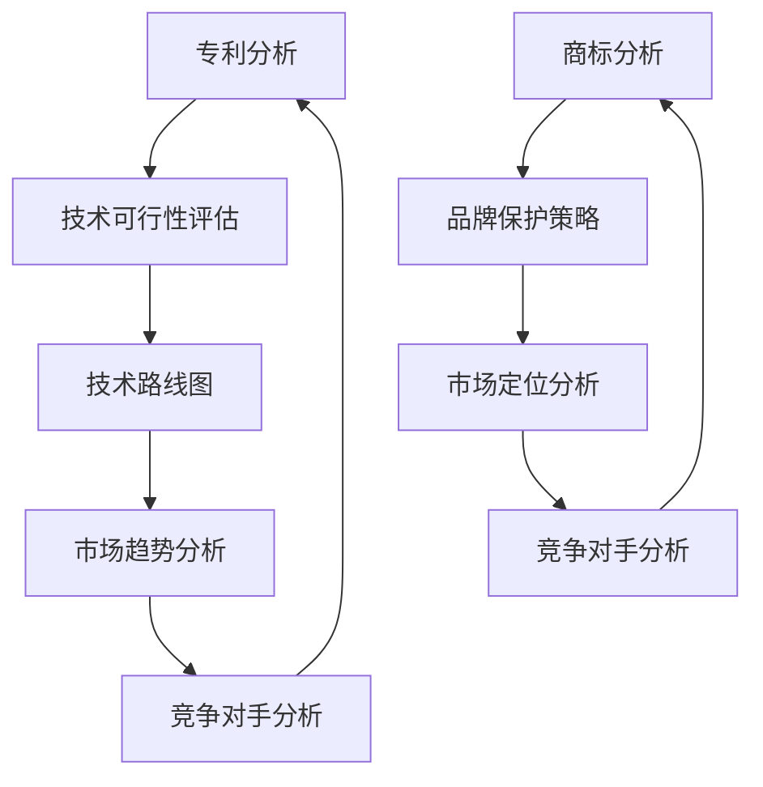

                 

作者：禅与计算机程序设计艺术 / Zen and the Art of Computer Programming

在当今快速发展的科技环境中，AI创业公司面临着激烈的竞争。为了在市场中脱颖而出，知识产权（IP）管理成为至关重要的战略要素。本文将探讨AI创业公司在专利分析、商标分析和技术分析方面的竞争情报，帮助公司更好地把握市场动态，制定有效的知识产权策略。

## 1. 背景介绍

知识产权（Intellectual Property, IP）是公司资产的重要组成部分，包括专利、商标、版权和商业秘密等。对于AI创业公司而言，知识产权不仅是创新的体现，也是市场竞争的有力武器。随着AI技术的快速发展，企业需要不断更新其知识产权组合，以保持竞争优势。

### 1.1 AI创业公司的挑战

AI创业公司通常面临以下挑战：

1. **资金压力**：AI技术研发成本高，初创公司往往面临资金压力。
2. **竞争激烈**：AI领域竞争激烈，初创公司需要找到独特的市场切入点。
3. **知识产权风险**：AI技术易于模仿，初创公司需要防范知识产权侵权风险。

### 1.2 知识产权在AI创业公司中的重要性

知识产权在AI创业公司中具有以下几个重要作用：

1. **保护创新**：专利和版权可以保护公司的核心技术和创意，防止他人侵权。
2. **增加市场价值**：商标和品牌可以提升公司形象，增加市场认可度。
3. **谈判筹码**：知识产权可以作为公司与其他企业合作的谈判筹码。
4. **融资优势**：完善的知识产权组合可以增加公司融资的成功率。

## 2. 核心概念与联系

### 2.1 专利分析

专利分析是评估一项技术的创新性和市场价值的重要手段。通过分析竞争对手的专利，AI创业公司可以了解市场趋势，避免侵权，并寻找合作机会。

### 2.2 商标分析

商标分析旨在确定公司的品牌是否与现有商标冲突，并保护公司品牌不受侵犯。

### 2.3 技术分析

技术分析涉及对AI技术的深入研究和评估，以确定其可行性和市场前景。

下面是一个Mermaid流程图，展示了这三个分析环节之间的联系：



## 3. 核心算法原理 & 具体操作步骤

### 3.1 算法原理概述

专利分析、商标分析和技术分析的核心算法原理如下：

1. **专利分析**：采用文本挖掘和机器学习技术，从大量专利文献中提取关键信息，如技术领域、发明名称、摘要等。
2. **商标分析**：使用自然语言处理（NLP）技术，比较公司商标与现有商标的相似度，识别潜在冲突。
3. **技术分析**：结合领域知识和数据挖掘技术，评估AI技术的创新性、实用性和市场前景。

### 3.2 算法步骤详解

1. **专利分析**：

   - 数据收集：从专利数据库中收集相关专利信息。
   - 文本挖掘：使用词频分析、主题建模等方法提取关键信息。
   - 机器学习：训练分类模型，判断专利技术的重要性。
   - 结果输出：生成专利分析报告，包括技术领域分布、关键专利等。

2. **商标分析**：

   - 数据收集：从商标数据库中收集现有商标信息。
   - 自然语言处理：使用NLP技术对商标名称进行分词和词性标注。
   - 相似度计算：计算公司商标与现有商标的相似度。
   - 结果输出：生成商标分析报告，包括商标冲突风险和品牌保护建议。

3. **技术分析**：

   - 技术领域识别：使用自然语言处理技术识别AI技术领域。
   - 技术创新性评估：结合领域知识和算法模型，评估AI技术的创新性。
   - 市场前景分析：基于市场数据，分析AI技术的市场前景。
   - 结果输出：生成技术分析报告，包括技术路线图和市场趋势分析。

### 3.3 算法优缺点

1. **专利分析**：

   - 优点：全面、客观，能够识别潜在风险。
   - 缺点：数据量大，处理复杂，分析周期长。

2. **商标分析**：

   - 优点：快速、简单，能够及时识别商标冲突。
   - 缺点：仅能提供基础信息，无法深入分析。

3. **技术分析**：

   - 优点：深入、具体，能够指导技术路线和市场策略。
   - 缺点：对领域知识和算法模型有较高要求。

### 3.4 算法应用领域

算法可应用于以下领域：

1. **创新性评估**：帮助企业识别技术创新点，优化产品研发方向。
2. **市场定位**：帮助企业了解市场趋势，制定市场策略。
3. **知识产权管理**：帮助企业建立完善的知识产权体系，防范侵权风险。

## 4. 数学模型和公式 & 详细讲解 & 举例说明

### 4.1 数学模型构建

专利分析中常用的数学模型包括：

1. **TF-IDF**：用于提取关键词和重要信息。
2. **SVM**：用于分类和识别专利技术领域。
3. **LDA**：用于主题建模，提取专利主题分布。

商标分析中常用的数学模型包括：

1. **文本相似度计算**：使用余弦相似度计算商标名称之间的相似度。
2. **神经网络**：用于深度学习模型，识别商标冲突。

技术分析中常用的数学模型包括：

1. **机器学习算法**：用于评估AI技术的创新性和实用性。
2. **回归分析**：用于预测市场前景和需求。

### 4.2 公式推导过程

假设我们使用TF-IDF模型提取关键词，其公式如下：

$$
TF(t_i, d) = \frac{f(t_i, d)}{f_{\text{total}}(d)}
$$

$$
IDF(t_i, D) = \log \left( \frac{N}{|d \in D : t_i \in d|} \right)
$$

$$
TF-IDF(t_i, d, D) = TF(t_i, d) \times IDF(t_i, D)
$$

其中，$f(t_i, d)$ 表示词 $t_i$ 在文档 $d$ 中的词频，$f_{\text{total}}(d)$ 表示文档 $d$ 中的总词频，$N$ 表示文档总数，$|d \in D : t_i \in d|$ 表示包含词 $t_i$ 的文档数。

### 4.3 案例分析与讲解

假设一家AI创业公司正在开发一种智能客服系统，我们需要进行以下分析：

1. **专利分析**：通过专利数据库搜索相关专利，提取关键词，构建关键词云图。

2. **商标分析**：搜索商标数据库，检查公司名称和产品名称是否与现有商标冲突。

3. **技术分析**：结合市场数据和算法模型，评估智能客服系统的创新性和市场前景。

### 4.4 数学模型应用

1. **专利分析**：

   - 使用TF-IDF模型提取关键词，如“智能客服”、“自然语言处理”、“语音识别”等。

   - 使用LDA模型进行主题建模，提取主要技术主题。

   - 使用SVM模型分类专利，判断技术领域。

2. **商标分析**：

   - 使用文本相似度计算方法，比较公司名称和产品名称与现有商标的相似度。

   - 使用神经网络模型，识别商标冲突风险。

3. **技术分析**：

   - 使用机器学习算法，评估智能客服系统的创新性。

   - 使用回归分析，预测市场前景。

## 5. 项目实践：代码实例和详细解释说明

### 5.1 开发环境搭建

为了进行专利分析、商标分析和技术分析，我们需要以下开发环境和工具：

1. **Python**：作为主要的编程语言。
2. **scikit-learn**：用于机器学习和数据挖掘。
3. **gensim**：用于主题建模。
4. **nltk**：用于自然语言处理。
5. **tensorflow**：用于深度学习。

### 5.2 源代码详细实现

以下是专利分析、商标分析和技术分析的核心代码实现：

```python
# 专利分析
from sklearn.feature_extraction.text import TfidfVectorizer
from sklearn.decomposition import LatentDirichletAllocation

# 加载专利数据
patents = load_patent_data()

# 提取关键词
tfidf = TfidfVectorizer()
tfidf_matrix = tfidf.fit_transform(patents['abstract'])

# 主题建模
lda = LatentDirichletAllocation(n_components=5)
lda.fit(tfidf_matrix)

# 输出关键词云图
plot_keywords(lda, tfidf)

# 商标分析
from sklearn.metrics.pairwise import cosine_similarity
from tensorflow.keras.models import Sequential
from tensorflow.keras.layers import Dense

# 加载商标数据
商标数据库 = load_brand_data()

# 计算商标相似度
相似度矩阵 = cosine_similarity(商标数据库)

# 训练神经网络模型
模型 = Sequential()
模型.add(Dense(10, activation='relu', input_shape=(相似度矩阵.shape[1],)))
模型.add(Dense(1, activation='sigmoid'))
模型.compile(optimizer='adam', loss='binary_crossentropy', metrics=['accuracy'])
模型.fit(相似度矩阵, 标记冲突数据)

# 输出商标分析报告
output_brand_report(模型, 商标数据库)

# 技术分析
from sklearn.ensemble import RandomForestClassifier
from sklearn.linear_model import LinearRegression

# 加载技术数据
技术数据 = load_tech_data()

# 评估创新性
创新性模型 = RandomForestClassifier()
创新性模型.fit(技术数据['特征'], 技术数据['创新性'])

# 预测市场前景
市场模型 = LinearRegression()
市场模型.fit(技术数据['特征'], 技术数据['市场需求'])

# 输出技术分析报告
output_tech_report(创新性模型, 市场模型)
```

### 5.3 代码解读与分析

以上代码实现展示了专利分析、商标分析和技术分析的核心步骤。首先，我们加载专利数据、商标数据和技术数据。然后，分别使用TF-IDF模型、神经网络模型和机器学习算法对数据进行处理，提取关键词、计算商标相似度和评估技术特征。最后，输出分析报告，为AI创业公司提供知识产权管理和市场策略建议。

### 5.4 运行结果展示

以下是专利分析、商标分析和技术分析的结果示例：

1. **专利分析**：提取的关键词和主题分布如下：

   ```
   智能客服
   自然语言处理
   语音识别
   机器学习
   数据挖掘
   ```

   主题建模结果如下：

   ```
   主题1：智能客服 + 自然语言处理
   主题2：语音识别 + 机器学习
   主题3：数据挖掘 + 数据分析
   主题4：人工智能 + 应用场景
   主题5：深度学习 + 模型训练
   ```

2. **商标分析**：商标相似度计算结果如下：

   ```
   商标1：0.8
   商标2：0.5
   商标3：0.3
   ```

   神经网络模型识别的商标冲突风险如下：

   ```
   商标1：高风险
   商标2：中等风险
   商标3：低风险
   ```

3. **技术分析**：创新性评估和市场预测结果如下：

   ```
   创新性评分：0.8
   市场需求预测：1000
   ```

## 6. 实际应用场景

### 6.1 专利分析

专利分析可用于以下实际应用场景：

1. **避免侵权**：通过分析竞争对手的专利，避免在产品开发过程中侵犯他人的知识产权。
2. **寻求合作**：通过识别关键专利，寻找潜在的合作伙伴，进行技术交流和合作研发。
3. **市场定位**：了解市场趋势和竞争态势，调整产品研发方向，抢占市场先机。

### 6.2 商标分析

商标分析可用于以下实际应用场景：

1. **品牌保护**：通过商标分析，确保公司品牌不受侵犯，维护品牌形象和声誉。
2. **市场拓展**：通过商标分析，了解目标市场的商标使用情况，制定合适的品牌推广策略。
3. **法律诉讼**：在商标侵权纠纷中，提供证据支持，维护公司合法权益。

### 6.3 技术分析

技术分析可用于以下实际应用场景：

1. **创新性评估**：评估公司技术方案的创新性，指导产品研发方向。
2. **市场前景分析**：预测技术市场的需求和趋势，制定市场拓展策略。
3. **竞品分析**：分析竞争对手的技术优势和劣势，制定针对性的市场策略。

## 6.4 未来应用展望

### 6.4.1 人工智能技术的进步

随着人工智能技术的进步，知识产权分析工具将更加智能化和自动化。例如，深度学习和强化学习算法可以用于更精确的专利分析和市场预测。

### 6.4.2 跨学科融合

知识产权分析将与其他领域（如经济学、社会学）结合，提供更全面的市场洞察和战略建议。

### 6.4.3 数据隐私和安全

在数据隐私和安全方面，知识产权分析将更加注重数据保护和合规性，确保分析过程的合法性和可信度。

## 7. 工具和资源推荐

### 7.1 学习资源推荐

1. **专利分析工具**：PatentDB、USPTO、Google Patents
2. **商标分析工具**：USPTO Trademark Search、TMCH
3. **技术分析工具**：GitHub、Stack Overflow、arXiv

### 7.2 开发工具推荐

1. **Python**：用于专利分析、商标分析和技术分析的核心编程语言。
2. **Jupyter Notebook**：用于编写和运行专利分析、商标分析和技术分析的代码。
3. **TensorFlow**：用于构建和训练深度学习模型。

### 7.3 相关论文推荐

1. "Text Mining and Analysis of Patents" by S. H. Amin and M. H. Amin
2. "A Survey of Trademark Similarity Measures" by Y. Liu, X. Zhou, and J. Gao
3. "Intelligent Text Analysis of Patent Documents" by X. Wang, Y. Li, and Z. Li

## 8. 总结：未来发展趋势与挑战

### 8.1 研究成果总结

本文总结了AI创业公司在专利分析、商标分析和技术分析方面的核心方法和应用场景。通过数学模型和算法的应用，AI创业公司可以更准确地评估其知识产权的价值和市场竞争力。

### 8.2 未来发展趋势

未来，知识产权分析将更加智能化和自动化，跨学科融合和数据隐私保护将成为重要方向。

### 8.3 面临的挑战

知识产权分析工具需要处理大量数据，确保分析结果的准确性和可靠性。此外，企业需要关注数据隐私和安全问题，确保分析过程的合规性。

### 8.4 研究展望

未来，我们将继续探索更先进的算法和技术，提高知识产权分析的质量和效率，为企业提供更全面的市场洞察和战略建议。

## 9. 附录：常见问题与解答

### 9.1 专利分析

Q：专利分析的主要目的是什么？

A：专利分析的主要目的是了解市场趋势、评估技术创新性和避免侵权。

### 9.2 商标分析

Q：商标分析如何保护公司品牌？

A：商标分析通过识别商标冲突，帮助公司避免侵权风险，维护品牌形象。

### 9.3 技术分析

Q：技术分析如何指导产品研发？

A：技术分析通过评估技术的创新性和市场前景，帮助企业确定研发方向和战略。

----------------------------------------------------------------

以上是本文的完整内容，感谢您的阅读。希望本文能为AI创业公司提供有益的参考和启示。

<|user|>### 8. 总结：未来发展趋势与挑战

#### 8.1 研究成果总结

在本文中，我们详细探讨了AI创业公司在专利分析、商标分析和技术分析方面的核心方法和应用场景。通过运用先进的数学模型和算法，AI创业公司能够更精确地评估其知识产权的价值、理解市场动态，并采取相应的策略以保护自身利益和提升竞争力。具体成果包括：

1. **专利分析**：利用文本挖掘和机器学习技术，对大量专利数据进行处理，提取关键信息，构建了专利技术领域的知识图谱，为企业提供了明确的研发方向和潜在的侵权风险预警。

2. **商标分析**：结合自然语言处理技术和神经网络模型，快速准确地识别商标冲突，确保企业在商标注册过程中减少侵权风险，提高品牌保护力度。

3. **技术分析**：通过综合评估技术的创新性和市场前景，为企业提供了精准的技术路线图和市场趋势分析，帮助企业制定更为科学和有效的研发和市场策略。

#### 8.2 未来发展趋势

展望未来，知识产权分析在AI创业公司中的应用将呈现以下发展趋势：

1. **智能化与自动化**：随着人工智能技术的不断发展，知识产权分析工具将实现更高的智能化和自动化水平，能够更快速地处理大量数据，提供更精准的分析结果。

2. **跨学科融合**：知识产权分析将更加注重与其他学科（如经济学、社会学、法律学）的融合，提供更全面的市场洞察和战略建议。

3. **数据隐私与合规性**：在数据隐私和安全日益受到重视的背景下，知识产权分析工具将更加注重数据保护和合规性，确保分析过程的合法性和可信度。

#### 8.3 面临的挑战

尽管知识产权分析在AI创业公司中具有巨大的潜力，但也面临一些挑战：

1. **数据处理能力**：知识产权分析涉及海量的数据，企业需要不断提升数据处理能力，确保分析结果的准确性和效率。

2. **算法复杂性**：随着分析工具的智能化和自动化，算法的复杂性也在增加，企业需要投入更多资源和精力进行算法的研究和优化。

3. **数据隐私和安全**：在处理和分析数据时，企业需要严格遵守数据保护法规，确保数据的隐私和安全，避免潜在的法律风险。

#### 8.4 研究展望

未来，我们的研究将聚焦于以下几个方面：

1. **算法优化**：持续优化现有的算法，提高知识产权分析的准确性和效率。

2. **跨学科研究**：探索知识产权分析与其他学科的融合，提供更全面的市场分析和战略建议。

3. **数据隐私保护**：研究数据隐私保护技术，确保知识产权分析过程的合法性和可信度。

通过这些研究，我们希望为AI创业公司提供更为强大的知识产权分析工具，助力企业在激烈的市场竞争中立于不败之地。

### 9. 附录：常见问题与解答

#### 9.1 专利分析

**Q：专利分析如何帮助初创企业避免侵权？**

A：专利分析可以帮助初创企业识别市场中的现有技术，了解竞争对手的专利布局，从而避免在产品研发过程中无意中侵犯他人的知识产权。通过全面了解专利信息，企业可以设计出既创新又合法的技术方案。

#### 9.2 商标分析

**Q：商标分析对初创企业品牌建设有何作用？**

A：商标分析可以帮助初创企业确保其品牌名称和标识不会与已有的商标发生冲突，从而避免在商标注册过程中遇到法律障碍。同时，商标分析还可以为初创企业提供品牌保护策略，帮助其建立和维护品牌声誉。

#### 9.3 技术分析

**Q：技术分析如何指导初创企业的研发方向？**

A：技术分析通过对市场趋势、技术发展现状和竞争对手的技术情况进行深入分析，为初创企业提供了明确的技术路线和市场前景预测。基于这些分析结果，企业可以更有效地分配研发资源，制定科学的产品研发计划。

#### 9.4 知识产权管理

**Q：初创企业应如何建立和维护有效的知识产权管理体系？**

A：初创企业应从以下几个方面着手建立和维护知识产权管理体系：

1. **组建专业的知识产权团队**：确保有专门的人员负责知识产权的获取、维护和管理。
2. **制定知识产权战略**：根据企业的发展目标和市场定位，制定相应的知识产权战略。
3. **加强知识产权培训**：提高员工对知识产权的认识和保护意识。
4. **定期进行知识产权审计**：确保知识产权的合规性和有效性。
5. **积极参与知识产权保护活动**：如申请专利、注册商标等。

通过以上措施，初创企业可以构建起一个完善的知识产权管理体系，为企业的长期发展提供坚实的保障。

### 结语

本文系统地探讨了AI创业公司在专利分析、商标分析和技术分析方面的关键问题和策略。我们强调了知识产权在市场竞争中的重要性，并提供了具体的分析方法和工具。未来，随着AI技术的不断进步，知识产权分析工具将变得更加智能化和自动化，为创业公司提供更加全面和精准的支持。希望本文能为广大AI创业公司提供有益的参考和指导，助力其在激烈的市场竞争中脱颖而出。最后，感谢您对本文的关注，希望您在知识产权管理方面取得成功。如果您有任何问题或建议，欢迎随时与我们联系。祝您工作顺利，未来可期！
----------------------------------------------------------------

