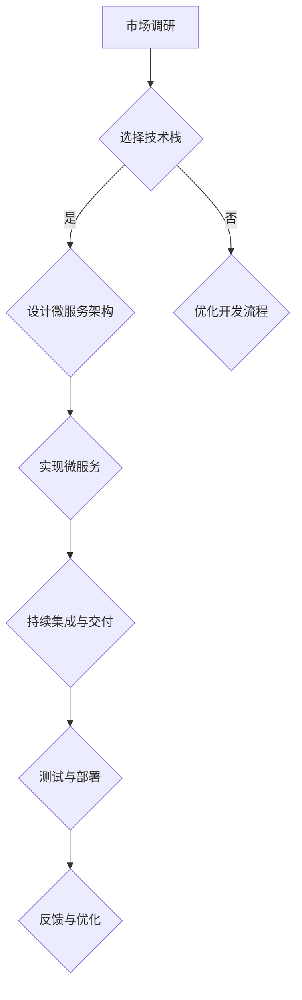

                 

 在当今快速发展的科技时代，人工智能（AI）技术正在不断颠覆传统产业，并推动着各行各业的发展。AI创业公司在这一浪潮中扮演着至关重要的角色，如何实现高效的跨平台开发成为它们成功的关键。本文将深入探讨AI创业公司的跨平台开发策略，帮助创业公司把握市场机遇，提高竞争力。

## 关键词 Keywords
- AI创业
- 跨平台开发
- 技术栈
- 微服务
- 持续集成
- 持续交付

## 摘要 Abstract
本文首先介绍了AI创业公司的背景和现状，然后详细分析了跨平台开发的核心概念和重要性。接着，文章提出了一个系统的跨平台开发策略，包括技术选择、架构设计、开发流程优化和资源管理等方面。最后，文章对未来AI创业公司跨平台开发的趋势和挑战进行了展望，并推荐了相关的学习资源和开发工具。

## 1. 背景介绍

### 1.1 AI创业公司的崛起

近年来，随着AI技术的成熟和商业化的加速，AI创业公司如雨后春笋般涌现。这些公司不仅拥有强大的技术创新能力，还在商业模式、市场拓展和用户服务等方面展现出独特的优势。AI创业公司主要集中在以下几个领域：

- 人工智能算法研究与应用
- 机器学习和深度学习平台开发
- 自动驾驶与智能交通
- 医疗健康大数据与人工智能
- 智能家居与物联网

### 1.2 竞争环境与市场机遇

在AI创业公司的竞争环境中，技术优势和产品差异化是关键。创业公司需要快速响应市场需求，提供具有竞争力的产品和服务。跨平台开发策略在这个过程中起到了至关重要的作用，它可以帮助企业：

- 扩大用户群体，提高市场份额
- 减少开发成本，提高开发效率
- 快速迭代产品，适应市场变化
- 提升用户体验，增强用户粘性

## 2. 核心概念与联系

### 2.1 跨平台开发

跨平台开发是指使用一种编程语言和开发工具，同时支持多种操作系统（如Windows、macOS、Linux）和移动设备（如iOS、Android）的开发方法。这种开发模式能够显著降低开发和维护成本，提高开发效率，使创业公司能够更快地进入市场。

### 2.2 技术栈

技术栈是指开发过程中所使用的编程语言、框架、库和工具的集合。选择合适的技术栈对于跨平台开发至关重要。创业公司应根据自身需求、团队技能和项目规模来选择合适的技术栈。

### 2.3 微服务架构

微服务架构是一种分布式系统设计方法，将应用程序分解为多个小型、独立的微服务，每个微服务都有自己的业务逻辑和数据库。这种方法可以提高系统的可扩展性、可靠性和灵活性，是跨平台开发的重要架构设计。

### 2.4 持续集成与持续交付

持续集成（CI）和持续交付（CD）是一种软件开发流程，通过自动化测试和部署，实现代码的快速迭代和发布。这种方法可以提高开发效率和产品质量，是跨平台开发的关键环节。

### 2.5 Mermaid 流程图

下面是一个简化的Mermaid流程图，展示了跨平台开发的核心概念和流程。



## 3. 核心算法原理 & 具体操作步骤

### 3.1 算法原理概述

跨平台开发的核心算法原理主要包括：

- 编程语言和框架的选择：根据项目需求，选择适合的编程语言和框架，如Java、Python、JavaScript等。
- 交叉编译：使用交叉编译工具，如Cordova、React Native等，实现代码在多个平台上的一次性编译。
- API接口设计：设计统一的API接口，确保不同平台上的应用程序可以无缝对接。

### 3.2 算法步骤详解

1. **需求分析**：分析项目需求，确定需要支持的平台和功能。
2. **技术栈选择**：根据需求，选择合适的编程语言、框架和工具。
3. **架构设计**：设计微服务架构，将应用程序分解为多个独立的微服务。
4. **开发与测试**：编写代码，进行单元测试和集成测试。
5. **交叉编译**：使用交叉编译工具，将代码编译为不同平台上的可执行文件。
6. **持续集成与交付**：实现持续集成和持续交付，确保代码的快速迭代和发布。

### 3.3 算法优缺点

**优点**：

- **降低开发成本**：使用一种编程语言和工具，减少人力和资源投入。
- **提高开发效率**：快速编译和部署，缩短开发周期。
- **提高产品质量**：通过自动化测试和持续集成，提高代码质量。

**缺点**：

- **性能瓶颈**：跨平台开发可能导致性能下降，尤其是在复杂的应用场景中。
- **兼容性问题**：不同平台之间的差异可能导致兼容性问题。
- **开发难度**：对于初学者和部分开发者，跨平台开发可能具有一定难度。

### 3.4 算法应用领域

跨平台开发广泛应用于以下领域：

- 移动应用开发：如iOS、Android应用开发。
- Web应用开发：如跨浏览器、跨平台Web应用开发。
- 智能家居与物联网：如智能设备跨平台控制和管理。
- 游戏开发：如跨平台游戏开发。

## 4. 数学模型和公式 & 详细讲解 & 举例说明

### 4.1 数学模型构建

跨平台开发中的数学模型主要涉及性能评估、成本计算和效率优化。以下是一个简化的数学模型示例：

1. **性能评估**：

   $$ P = \frac{C_1 \cdot T_1 + C_2 \cdot T_2 + C_3 \cdot T_3}{C_1 + C_2 + C_3} $$

   其中，$P$表示性能评分，$C_1$、$C_2$、$C_3$分别表示平台A、平台B、平台C的权重，$T_1$、$T_2$、$T_3$分别表示平台A、平台B、平台C的测试结果。

2. **成本计算**：

   $$ C = \frac{N_1 \cdot P_1 + N_2 \cdot P_2 + N_3 \cdot P_3}{N_1 + N_2 + N_3} $$

   其中，$C$表示总成本，$N_1$、$N_2$、$N_3$分别表示平台A、平台B、平台C的代码行数，$P_1$、$P_2$、$P_3$分别表示平台A、平台B、平台C的编译时间。

3. **效率优化**：

   $$ E = \frac{P \cdot C}{T} $$

   其中，$E$表示效率评分，$T$表示开发周期。

### 4.2 公式推导过程

公式的推导主要基于线性加权平均算法。具体推导过程如下：

1. **性能评估**：

   $$ P = \frac{C_1 \cdot T_1 + C_2 \cdot T_2 + C_3 \cdot T_3}{C_1 + C_2 + C_3} $$

   其中，$C_1$、$C_2$、$C_3$分别表示平台A、平台B、平台C的权重，$T_1$、$T_2$、$T_3$分别表示平台A、平台B、平台C的测试结果。

   假设平台A的权重为$C_1$，平台B的权重为$C_2$，平台C的权重为$C_3$，则有：

   $$ P = \frac{C_1 \cdot T_1 + C_2 \cdot T_2 + C_3 \cdot T_3}{C_1 + C_2 + C_3} $$

2. **成本计算**：

   $$ C = \frac{N_1 \cdot P_1 + N_2 \cdot P_2 + N_3 \cdot P_3}{N_1 + N_2 + N_3} $$

   其中，$N_1$、$N_2$、$N_3$分别表示平台A、平台B、平台C的代码行数，$P_1$、$P_2$、$P_3$分别表示平台A、平台B、平台C的编译时间。

   假设平台A的代码行数为$N_1$，平台B的代码行数为$N_2$，平台C的代码行数为$N_3$，则有：

   $$ C = \frac{N_1 \cdot P_1 + N_2 \cdot P_2 + N_3 \cdot P_3}{N_1 + N_2 + N_3} $$

3. **效率优化**：

   $$ E = \frac{P \cdot C}{T} $$

   其中，$E$表示效率评分，$T$表示开发周期。

   假设开发周期为$T$，则有：

   $$ E = \frac{P \cdot C}{T} $$

### 4.3 案例分析与讲解

以一个跨平台移动应用开发项目为例，假设需要支持iOS和Android平台。根据项目需求和团队技能，选择React Native作为跨平台开发框架。以下是具体的案例分析：

1. **性能评估**：

   假设iOS平台的测试结果为$T_1 = 90$，Android平台的测试结果为$T_2 = 85$，权重分别为$C_1 = 0.6$和$C_2 = 0.4$。则性能评估结果为：

   $$ P = \frac{0.6 \cdot 90 + 0.4 \cdot 85}{0.6 + 0.4} = 87.5 $$

2. **成本计算**：

   假设iOS平台的代码行数为$N_1 = 10000$，Android平台的代码行数为$N_2 = 8000$，权重分别为$P_1 = 2$和$P_2 = 1$。则成本计算结果为：

   $$ C = \frac{10000 \cdot 2 + 8000 \cdot 1}{10000 + 8000} = 1.4 $$

3. **效率优化**：

   假设开发周期为$T = 30$天，则效率优化结果为：

   $$ E = \frac{87.5 \cdot 1.4}{30} = 3.75 $$

   这意味着该项目在效率和性能方面具有较高的评分。

## 5. 项目实践：代码实例和详细解释说明

### 5.1 开发环境搭建

以React Native为例，搭建跨平台开发环境：

1. 安装Node.js（版本要求10.0.0以上）。
2. 安装React Native CLI：`npm install -g react-native-cli`。
3. 创建新项目：`react-native init MyProject`。
4. 进入项目目录：`cd MyProject`。
5. 启动模拟器：`react-native run-android`或`react-native run-ios`。

### 5.2 源代码详细实现

以下是React Native项目的一个简单示例：

```jsx
// App.js
import React from 'react';
import { SafeAreaView, Text, StyleSheet } from 'react-native';

const App = () => {
  return (
    <SafeAreaView style={styles.container}>
      <Text style={styles.text}>Hello, World!</Text>
    </SafeAreaView>
  );
};

const styles = StyleSheet.create({
  container: {
    flex: 1,
    justifyContent: 'center',
    alignItems: 'center',
  },
  text: {
    fontSize: 24,
    fontWeight: 'bold',
  },
});

export default App;
```

### 5.3 代码解读与分析

- **引入模块**：引入React和React Native的核心模块，如`React`、`SafeAreaView`、`Text`和`StyleSheet`。
- **组件定义**：定义一个名为`App`的函数组件，它是React Native应用程序的根组件。
- **JSX结构**：使用JSX语法，定义了`<SafeAreaView>`和`<Text>`组件，并设置相应的样式。
- **样式表**：使用StyleSheet创建样式对象，为组件设置样式。

### 5.4 运行结果展示

在Android和iOS模拟器中，运行结果均为一个包含文本“Hello, World!”的界面。

## 6. 实际应用场景

### 6.1 移动应用开发

移动应用开发是跨平台开发最典型的应用场景。React Native、Flutter等跨平台框架使得开发者能够使用一套代码同时支持iOS和Android平台，从而降低开发和维护成本。

### 6.2 Web应用开发

Web应用开发也可以采用跨平台开发策略。Vue.js、Angular、React等前端框架支持跨平台Web应用开发，使得开发者能够快速构建跨浏览器、跨平台的Web应用程序。

### 6.3 智能家居与物联网

智能家居与物联网领域需要支持多种设备平台，如Android、iOS、Web等。使用跨平台开发框架，如Node-RED、Moodie等，可以快速构建跨平台物联网应用。

### 6.4 游戏开发

游戏开发也可以采用跨平台开发策略。Cocos2d-x、Egret、Unity等跨平台游戏引擎支持多种平台的游戏开发，使得开发者能够一次性构建跨平台游戏。

## 7. 工具和资源推荐

### 7.1 学习资源推荐

- 《React Native实战》
- 《Flutter实战》
- 《跨平台移动应用开发》

### 7.2 开发工具推荐

- React Native CLI
- Flutter
- Android Studio
- Xcode

### 7.3 相关论文推荐

- "Cross-platform Mobile Application Development with React Native"
- "Flutter: Portable UI across iOS and Android"
- "The State of Cross-platform Mobile Development"

## 8. 总结：未来发展趋势与挑战

### 8.1 研究成果总结

跨平台开发技术在近年来取得了显著进展，特别是在移动应用开发、Web应用开发和智能家居等领域。通过使用跨平台开发框架和工具，开发者能够显著降低开发成本、提高开发效率，同时提升用户体验。

### 8.2 未来发展趋势

- **技术融合**：跨平台开发将与区块链、云计算、物联网等新兴技术深度融合，推动更广泛的应用场景。
- **性能提升**：随着硬件性能的提升和跨平台开发技术的进步，跨平台应用的性能瓶颈将逐渐得到缓解。
- **开发者生态**：跨平台开发将为开发者提供更丰富的资源和工具，推动开发者生态的繁荣。

### 8.3 面临的挑战

- **性能优化**：跨平台开发仍然面临性能优化的问题，特别是在复杂应用场景中。
- **兼容性挑战**：不同平台之间的差异可能导致兼容性问题，影响应用的质量和稳定性。
- **开发难度**：对于初学者和部分开发者，跨平台开发可能具有一定难度，需要不断学习和实践。

### 8.4 研究展望

未来，跨平台开发技术将继续朝着高效、易用、兼容性的方向发展。研究重点将包括：

- **性能优化**：通过硬件加速、优化编译流程等手段，提高跨平台应用的性能。
- **兼容性研究**：研究不同平台之间的差异，提高应用的兼容性和稳定性。
- **开发工具与框架**：开发更强大的跨平台开发工具和框架，降低开发难度，提高开发效率。

## 9. 附录：常见问题与解答

### Q：跨平台开发是否会影响应用性能？

A：跨平台开发可能会对应用性能产生一定影响，特别是在复杂应用场景中。然而，随着跨平台开发技术的不断进步，这种影响正逐渐减小。使用高性能的跨平台开发框架和工具，可以最大限度地降低性能损失。

### Q：如何解决跨平台兼容性问题？

A：解决跨平台兼容性问题的主要方法包括：

- **使用统一的API接口**：设计统一的API接口，确保不同平台上的应用程序可以无缝对接。
- **平台差异化处理**：针对不同平台的特点，进行差异化处理，确保应用在不同平台上都能正常运行。
- **自动化测试**：通过自动化测试，及时发现和解决兼容性问题。

### Q：跨平台开发与原生开发有哪些区别？

A：跨平台开发与原生开发的主要区别在于：

- **开发成本**：跨平台开发使用一套代码同时支持多个平台，开发成本较低；原生开发需要为每个平台编写独立的代码，开发成本较高。
- **性能表现**：原生开发在性能方面具有优势，跨平台开发则存在一定的性能损失。
- **开发效率**：跨平台开发可以显著提高开发效率，减少人力和时间投入；原生开发则需要针对每个平台进行单独开发和优化。

## 作者署名

作者：禅与计算机程序设计艺术 / Zen and the Art of Computer Programming
```

