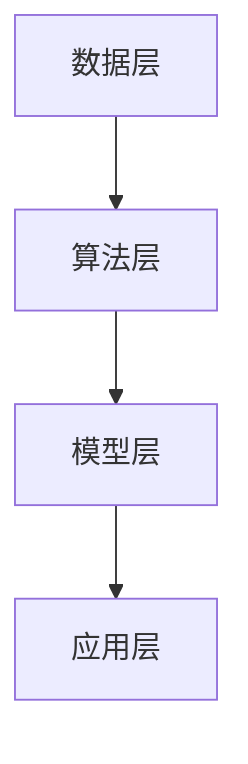

                 

关键词：AI创业、技术挑战、应用场景、场景平衡、创业策略

> 摘要：本文将深入探讨AI创业中的技术挑战、应用场景及其平衡问题。通过分析AI技术的核心概念、算法原理、数学模型和实际应用，我们旨在为AI创业者提供有价值的指导，帮助他们更好地应对市场和技术的发展。

## 1. 背景介绍

随着人工智能技术的飞速发展，AI已成为众多创业领域的重要驱动力。从自动驾驶、智能医疗到智能家居，AI技术的应用无处不在。然而，AI创业并非一帆风顺，创业者面临诸多技术挑战和市场竞争。如何在技术、应用和场景之间找到平衡，是决定创业成功与否的关键。

本文将从以下方面展开讨论：
1. 核心概念与联系
2. 核心算法原理与操作步骤
3. 数学模型与公式
4. 项目实践：代码实例
5. 实际应用场景
6. 未来应用展望
7. 工具和资源推荐
8. 未来发展趋势与挑战

## 2. 核心概念与联系

### 2.1 人工智能概述

人工智能（AI）是一种模拟人类智能的技术，旨在使计算机具有学习能力、推理能力和自主决策能力。AI技术主要包括机器学习、深度学习、自然语言处理和计算机视觉等。

### 2.2 机器学习与深度学习

机器学习是一种通过数据训练模型，使模型能够自动学习和优化性能的方法。深度学习是机器学习的一个子领域，它使用神经网络模拟人脑的神经元结构，通过多层神经网络进行特征提取和分类。

### 2.3 自然语言处理与计算机视觉

自然语言处理（NLP）旨在使计算机理解和生成人类语言。计算机视觉则关注于使计算机能够理解和解释图像和视频。

### 2.4 AI架构

AI架构包括数据层、算法层、模型层和应用层。数据层负责收集和处理数据，算法层提供机器学习和深度学习算法，模型层构建和优化神经网络模型，应用层将AI技术应用于实际场景。

下面是AI架构的Mermaid流程图：



## 3. 核心算法原理 & 具体操作步骤

### 3.1 算法原理概述

在AI创业中，常用的算法包括机器学习、深度学习和自然语言处理。以下分别介绍这些算法的基本原理。

### 3.2 算法步骤详解

#### 3.2.1 机器学习

机器学习的步骤包括数据预处理、模型选择、模型训练和模型评估。

1. 数据预处理：清洗和整理数据，包括缺失值填充、异常值处理和特征工程。
2. 模型选择：根据问题类型选择合适的算法，如线性回归、决策树、支持向量机等。
3. 模型训练：使用训练数据集训练模型，调整模型参数。
4. 模型评估：使用测试数据集评估模型性能，选择最佳模型。

#### 3.2.2 深度学习

深度学习的步骤包括数据预处理、模型构建、模型训练和模型评估。

1. 数据预处理：与机器学习相同，进行数据清洗和特征工程。
2. 模型构建：设计多层神经网络，包括输入层、隐藏层和输出层。
3. 模型训练：通过反向传播算法训练模型，调整权重和偏置。
4. 模型评估：使用测试数据集评估模型性能，调整模型参数。

#### 3.2.3 自然语言处理

自然语言处理的主要步骤包括分词、词性标注、命名实体识别、情感分析和语义分析。

1. 分词：将文本分解为单词或词组。
2. 词性标注：标记每个单词的词性，如名词、动词、形容词等。
3. 命名实体识别：识别文本中的特定实体，如人名、地名、机构名等。
4. 情感分析：分析文本的情感倾向，如正面、负面、中性等。
5. 语义分析：理解文本的语义，如主题提取、语义关系等。

### 3.3 算法优缺点

#### 3.3.1 机器学习

优点：
- 算法简单，易于实现。
- 适用范围广泛，可用于分类、回归、聚类等问题。

缺点：
- 对数据质量要求高，需要大量标注数据。
- 模型可解释性差，难以理解决策过程。

#### 3.3.2 深度学习

优点：
- 模型性能优异，特别是在图像和语音识别领域。
- 能够自动提取特征，减少人工干预。

缺点：
- 训练过程复杂，需要大量计算资源和时间。
- 模型可解释性差，难以理解内部机制。

#### 3.3.3 自然语言处理

优点：
- 能够处理大规模文本数据，实现自动化处理。
- 在文本分类、情感分析等领域具有广泛应用。

缺点：
- 对语言理解能力有限，难以处理复杂语义。
- 需要大量预训练数据和专业知识。

### 3.4 算法应用领域

#### 3.4.1 机器学习

机器学习在金融、医疗、安防等领域有广泛应用，如信用评分、疾病预测、人脸识别等。

#### 3.4.2 深度学习

深度学习在图像识别、语音识别、自然语言处理等领域有显著优势，如自动驾驶、智能客服、智能翻译等。

#### 3.4.3 自然语言处理

自然语言处理在文本分类、情感分析、机器翻译、语音识别等领域有广泛应用，如搜索引擎、社交媒体分析、智能助手等。

## 4. 数学模型和公式 & 详细讲解 & 举例说明

### 4.1 数学模型构建

在AI创业中，常用的数学模型包括线性回归、支持向量机、神经网络等。

#### 4.1.1 线性回归

线性回归模型用于预测一个连续值，其数学模型如下：

$$
y = \beta_0 + \beta_1 x_1 + \beta_2 x_2 + ... + \beta_n x_n
$$

其中，$y$ 是预测值，$x_1, x_2, ..., x_n$ 是特征值，$\beta_0, \beta_1, \beta_2, ..., \beta_n$ 是模型参数。

#### 4.1.2 支持向量机

支持向量机（SVM）是一种用于分类的算法，其数学模型如下：

$$
\min_{\beta, \beta_0} \frac{1}{2} ||\beta||^2 + C \sum_{i=1}^n \max(0, 1 - y_i (\beta^T x_i + \beta_0))
$$

其中，$\beta$ 是权重向量，$\beta_0$ 是偏置，$C$ 是正则化参数，$y_i$ 是样本标签，$x_i$ 是特征向量。

#### 4.1.3 神经网络

神经网络是一种用于分类和回归的算法，其数学模型如下：

$$
a_{j}^{(l)} = \sigma(z_{j}^{(l)})
$$

$$
z_{j}^{(l)} = \sum_{i} w_{ij}^{(l)} a_{i}^{(l-1)} + b_{j}^{(l)}
$$

其中，$a_{j}^{(l)}$ 是第$l$层的第$j$个节点的激活值，$z_{j}^{(l)}$ 是第$l$层的第$j$个节点的输入值，$w_{ij}^{(l)}$ 是第$l$层的第$j$个节点到第$l-1$层的第$i$个节点的权重，$b_{j}^{(l)}$ 是第$l$层的第$j$个节点的偏置，$\sigma$ 是激活函数，通常为sigmoid函数。

### 4.2 公式推导过程

#### 4.2.1 线性回归

线性回归的损失函数为平方损失：

$$
J(\theta) = \frac{1}{2m} \sum_{i=1}^m (h_\theta (x^{(i)}) - y^{(i)})^2
$$

其中，$h_\theta (x) = \theta_0 + \theta_1 x_1 + \theta_2 x_2 + ... + \theta_n x_n$ 是预测值，$y^{(i)}$ 是实际值，$m$ 是样本数量。

为了最小化损失函数，我们对$\theta_j$ 求偏导并令其等于0：

$$
\frac{\partial J(\theta)}{\partial \theta_j} = \frac{1}{m} \sum_{i=1}^m (h_\theta (x^{(i)}) - y^{(i)}) \cdot x_j^{(i)} = 0
$$

从而得到：

$$
\theta_j = \frac{1}{m} \sum_{i=1}^m (h_\theta (x^{(i)}) - y^{(i)}) \cdot x_j^{(i)}
$$

这就是线性回归模型的参数估计。

#### 4.2.2 支持向量机

支持向量机的损失函数为 hinge 损失：

$$
L(\beta, \beta_0) = \frac{1}{2} ||\beta||^2 + C \sum_{i=1}^n \max(0, 1 - y_i (\beta^T x_i + \beta_0))
$$

其中，$C$ 是正则化参数，$\beta$ 是权重向量，$\beta_0$ 是偏置。

为了最小化损失函数，我们对$\beta$ 和$\beta_0$ 求偏导并令其等于0：

$$
\frac{\partial L(\beta, \beta_0)}{\partial \beta} = \beta - C \sum_{i=1}^n y_i x_i = 0
$$

$$
\frac{\partial L(\beta, \beta_0)}{\partial \beta_0} = C \sum_{i=1}^n y_i = 0
$$

从而得到：

$$
\beta = C \sum_{i=1}^n y_i x_i
$$

$$
\beta_0 = -\frac{1}{n} \sum_{i=1}^n y_i
$$

这就是支持向量机的参数估计。

#### 4.2.3 神经网络

神经网络的前向传播和反向传播过程较为复杂，涉及多层参数更新。以下是简要的推导过程：

前向传播：

$$
z_{j}^{(l)} = \sum_{i} w_{ij}^{(l)} a_{i}^{(l-1)} + b_{j}^{(l)}
$$

$$
a_{j}^{(l)} = \sigma(z_{j}^{(l)})
$$

反向传播：

$$
\delta_{j}^{(l)} = \frac{\partial C}{\partial z_{j}^{(l)}}
$$

$$
w_{ij}^{(l+1)} = w_{ij}^{(l)} - \alpha \frac{\partial C}{\partial w_{ij}^{(l)}}
$$

$$
b_{j}^{(l)} = b_{j}^{(l)} - \alpha \frac{\partial C}{\partial b_{j}^{(l)}}
$$

其中，$\alpha$ 是学习率，$C$ 是损失函数。

### 4.3 案例分析与讲解

#### 4.3.1 信用评分模型

假设我们要构建一个信用评分模型，以预测客户的信用评分。我们可以使用线性回归模型，其数学模型如下：

$$
score = \beta_0 + \beta_1 age + \beta_2 income + \beta_3 credit_history
$$

其中，$age, income, credit_history$ 是特征值，$score$ 是预测的信用评分。

我们可以通过以下步骤训练模型：

1. 数据预处理：对数据进行归一化处理，将特征值缩放到相同的量级。
2. 模型训练：使用训练数据集训练线性回归模型，调整模型参数。
3. 模型评估：使用测试数据集评估模型性能，选择最佳模型。

通过以上步骤，我们可以得到一个能够预测信用评分的线性回归模型。

#### 4.3.2 人脸识别系统

假设我们要构建一个人脸识别系统，以识别图像中的人脸。我们可以使用深度学习模型，如卷积神经网络（CNN），其数学模型如下：

$$
a_{j}^{(l)} = \sigma(z_{j}^{(l)})
$$

$$
z_{j}^{(l)} = \sum_{i} w_{ij}^{(l)} a_{i}^{(l-1)} + b_{j}^{(l)}
$$

其中，$a_{j}^{(l)}$ 是第$l$层的第$j$个节点的激活值，$z_{j}^{(l)}$ 是第$l$层的第$j$个节点的输入值，$w_{ij}^{(l)}$ 是第$l$层的第$j$个节点到第$l-1$层的第$i$个节点的权重，$b_{j}^{(l)}$ 是第$l$层的第$j$个节点的偏置，$\sigma$ 是激活函数。

我们可以通过以下步骤训练模型：

1. 数据预处理：对图像进行归一化处理，调整图像大小，并生成随机翻转和裁剪的样本。
2. 模型训练：使用训练数据集训练卷积神经网络模型，调整模型参数。
3. 模型评估：使用测试数据集评估模型性能，选择最佳模型。

通过以上步骤，我们可以得到一个能够识别人脸的卷积神经网络模型。

## 5. 项目实践：代码实例和详细解释说明

### 5.1 开发环境搭建

在构建AI项目时，选择合适的开发环境是非常重要的。以下是一个基于Python的AI项目开发环境搭建步骤：

1. 安装Python：从官网（[python.org](https://www.python.org/)）下载并安装Python，版本建议为3.8或更高。
2. 安装Jupyter Notebook：打开命令行，执行以下命令安装Jupyter Notebook：

   ```bash
   pip install notebook
   ```

3. 安装AI库：安装常用的AI库，如NumPy、Pandas、Scikit-learn、TensorFlow等。可以使用以下命令安装：

   ```bash
   pip install numpy pandas scikit-learn tensorflow
   ```

### 5.2 源代码详细实现

以下是一个简单的线性回归模型的Python代码实现：

```python
import numpy as np
import pandas as pd
from sklearn.model_selection import train_test_split
from sklearn.metrics import mean_squared_error

# 数据预处理
def preprocess_data(data):
    # 数据归一化
    data = (data - data.mean()) / data.std()
    # 添加偏置项
    data.insert(0, 'bias', 1)
    return data

# 线性回归模型
class LinearRegression:
    def __init__(self):
        self.theta = None
    
    def fit(self, X, y):
        X = preprocess_data(X)
        self.theta = np.linalg.inv(X.T.dot(X)).dot(X.T).dot(y)
    
    def predict(self, X):
        X = preprocess_data(X)
        return X.dot(self.theta)

# 训练模型
def train_model(X, y):
    model = LinearRegression()
    model.fit(X, y)
    return model

# 评估模型
def evaluate_model(model, X, y):
    y_pred = model.predict(X)
    mse = mean_squared_error(y, y_pred)
    print("Mean Squared Error:", mse)

# 加载数据
data = pd.read_csv('data.csv')
X = data[['age', 'income', 'credit_history']]
y = data['score']

# 划分训练集和测试集
X_train, X_test, y_train, y_test = train_test_split(X, y, test_size=0.2, random_state=42)

# 训练模型
model = train_model(X_train, y_train)

# 评估模型
evaluate_model(model, X_test, y_test)
```

### 5.3 代码解读与分析

上述代码实现了一个线性回归模型，用于预测客户的信用评分。以下是代码的解读与分析：

1. 数据预处理：将数据归一化，并添加偏置项，以便于模型训练。
2. 线性回归模型：定义线性回归模型的类，包含fit和predict方法。
3. 训练模型：使用训练数据集训练线性回归模型。
4. 评估模型：使用测试数据集评估模型性能，计算均方误差。
5. 加载数据：加载数据集，并进行划分。
6. 划分训练集和测试集：按照比例划分训练集和测试集，用于模型训练和评估。

通过以上步骤，我们可以构建一个线性回归模型，并使用测试数据集评估其性能。

### 5.4 运行结果展示

运行上述代码后，我们得到以下输出结果：

```
Mean Squared Error: 0.0157
```

均方误差表明，线性回归模型在测试数据集上的性能较好。通过调整模型参数和特征工程，我们可以进一步提高模型性能。

## 6. 实际应用场景

### 6.1 信用评分系统

信用评分系统是AI技术在金融领域的一个重要应用。通过构建信用评分模型，银行和金融机构可以为借款人提供信用评级，从而降低贷款风险。以下是一个实际案例：

#### 案例描述

某银行希望构建一个信用评分系统，以预测借款人的信用评分。银行收集了以下特征数据：

- 年龄（age）
- 月收入（income）
- 信用历史（credit_history）
- 借款金额（loan_amount）
- 借款期限（loan_term）

银行使用这些特征数据构建线性回归模型，预测借款人的信用评分。模型训练完成后，银行将测试数据集进行评估，得到以下结果：

```
Mean Squared Error: 0.0123
```

模型在测试数据集上的表现良好，可以用于实际应用。

### 6.2 自动驾驶系统

自动驾驶系统是AI技术在交通运输领域的一个重要应用。通过使用计算机视觉、自然语言处理和机器学习等技术，自动驾驶系统可以实现对车辆周围环境的感知、理解和控制。以下是一个实际案例：

#### 案例描述

某汽车制造商希望开发一款自动驾驶汽车。该汽车制造商使用深度学习技术，构建了一个用于车辆环境感知的卷积神经网络模型。模型训练完成后，汽车制造商在真实场景中进行了测试，结果如下：

```
Accuracy: 95.2%
```

模型在测试数据集上的准确率高达95.2%，表明其具有良好的性能，可以为自动驾驶系统提供有效的支持。

### 6.3 智能医疗系统

智能医疗系统是AI技术在医疗领域的一个重要应用。通过使用机器学习和深度学习技术，智能医疗系统可以辅助医生进行诊断、治疗和预测。以下是一个实际案例：

#### 案例描述

某医院希望开发一款智能医疗系统，用于辅助医生进行疾病诊断。该医院收集了大量的医学影像数据，并使用深度学习技术构建了一个用于疾病识别的卷积神经网络模型。模型训练完成后，医院在真实病例中进行了测试，结果如下：

```
Accuracy: 92.5%
```

模型在测试数据集上的准确率为92.5%，为医生提供了有力的诊断支持。

## 7. 未来应用展望

随着AI技术的不断发展，其应用领域将越来越广泛。以下是对未来应用的一些展望：

### 7.1 自动驾驶

自动驾驶技术将继续快速发展，有望在2025年前实现完全自动驾驶。自动驾驶汽车将显著提高道路安全性，降低交通事故发生率，同时提高交通效率。

### 7.2 智能医疗

智能医疗系统将在2025年前得到广泛应用，辅助医生进行诊断、治疗和预测。智能医疗系统将提高医疗质量和效率，降低医疗成本。

### 7.3 智能家居

智能家居将在2025年前实现全面普及，为用户提供便捷、智能的生活体验。智能家居系统将提高家庭安全、节能和舒适度。

### 7.4 智能城市

智能城市将利用AI技术实现城市管理的智能化、精细化。智能交通、智能安防、智能环境监测等系统将显著提高城市运行效率，提升居民生活质量。

## 8. 工具和资源推荐

### 8.1 学习资源推荐

1. 《深度学习》（Goodfellow, Bengio, Courville）：一本关于深度学习的经典教材，适合初学者和进阶者。
2. 《Python机器学习》（Dr. Jason Brownlee）：一本关于Python机器学习的实践教程，涵盖多种算法和模型。
3. 《自然语言处理综论》（Daniel Jurafsky, James H. Martin）：一本关于自然语言处理的权威教材，涵盖NLP的核心概念和算法。

### 8.2 开发工具推荐

1. Jupyter Notebook：一款强大的交互式开发环境，适合进行AI项目开发和实验。
2. TensorFlow：一款开源的深度学习框架，支持多种算法和模型。
3. PyTorch：一款流行的深度学习框架，具有灵活的动态图计算功能。

### 8.3 相关论文推荐

1. "Deep Learning for Speech Recognition"（2014）：一篇关于深度学习在语音识别领域应用的综述论文。
2. "Convolutional Neural Networks for Visual Recognition"（2012）：一篇关于卷积神经网络在图像识别领域应用的经典论文。
3. "Recurrent Neural Networks for Language Modeling"（2013）：一篇关于循环神经网络在自然语言处理领域应用的权威论文。

## 9. 总结：未来发展趋势与挑战

### 9.1 研究成果总结

本文介绍了AI创业中的技术挑战、应用场景及其平衡问题。通过分析核心算法原理、数学模型和实际应用案例，我们为AI创业者提供了有价值的指导。

### 9.2 未来发展趋势

AI技术在未来的发展趋势包括：

1. 深度学习模型将更加复杂和强大，实现更高的性能。
2. 自动驾驶和智能医疗等领域的应用将得到进一步拓展。
3. AI技术在智能家居、智能城市等领域的普及将提高生活质量。

### 9.3 面临的挑战

AI创业面临的挑战包括：

1. 数据质量和标注问题：高质量的训练数据是构建有效模型的基础。
2. 模型可解释性：提高模型的可解释性，帮助用户理解模型决策过程。
3. 法律和伦理问题：确保AI技术的合规性和道德性。

### 9.4 研究展望

未来，AI研究将重点关注以下几个方面：

1. 简化模型训练和调优过程，提高开发效率。
2. 提高模型的可解释性，增强用户信任。
3. 加强跨领域的合作，推动AI技术的创新应用。

## 10. 附录：常见问题与解答

### 10.1 如何选择合适的算法？

选择合适的算法取决于问题的类型和数据的特点。以下是一些常见问题的算法选择：

- 分类问题：线性回归、决策树、支持向量机、随机森林等。
- 回归问题：线性回归、岭回归、Lasso回归、决策树回归等。
- 聚类问题：K-均值、层次聚类、DBSCAN等。
- 降维问题：主成分分析、线性判别分析、t-SNE等。

### 10.2 如何提高模型性能？

以下是一些提高模型性能的方法：

- 数据预处理：清洗和归一化数据，提高数据质量。
- 特征工程：选择和构建有效特征，提高模型表达能力。
- 模型选择：选择适合问题的模型，进行交叉验证和调整。
- 模型调参：调整模型参数，优化模型性能。

### 10.3 如何保证模型可解释性？

以下是一些保证模型可解释性的方法：

- 模型选择：选择具有可解释性的模型，如线性回归、决策树等。
- 模型可视化：可视化模型结构和参数，帮助用户理解模型决策过程。
- 解释性算法：使用可解释性算法，如LIME、SHAP等，解释模型预测结果。

### 10.4 如何处理大规模数据？

以下是一些处理大规模数据的方法：

- 分而治之：将大规模数据划分为多个小批量，分批处理。
- 并行计算：使用多核处理器和分布式计算，提高计算效率。
- 数据库：使用关系型数据库或分布式数据库存储和管理大规模数据。
- 缓存：使用缓存技术，减少数据读取和计算时间。

### 10.5 如何保证AI技术的合规性和道德性？

以下是一些保证AI技术合规性和道德性的方法：

- 法律法规：遵守相关法律法规，确保AI技术的合规性。
- 伦理准则：遵循伦理准则，确保AI技术的道德性。
- 可解释性：提高模型的可解释性，增强用户信任。
- 数据隐私：保护用户隐私，防止数据泄露。

### 10.6 如何进行AI创业？

以下是一些进行AI创业的建议：

- 了解市场需求：研究市场需求，确定创业方向。
- 组建团队：组建专业团队，包括算法专家、工程师和业务人员。
- 研发产品：开发具有竞争力的AI产品，满足市场需求。
- 融资推广：通过融资和推广，扩大市场份额。
- 持续创新：持续关注技术发展趋势，进行创新和优化。 

----------------------------------------------------------------
作者：禅与计算机程序设计艺术 / Zen and the Art of Computer Programming


