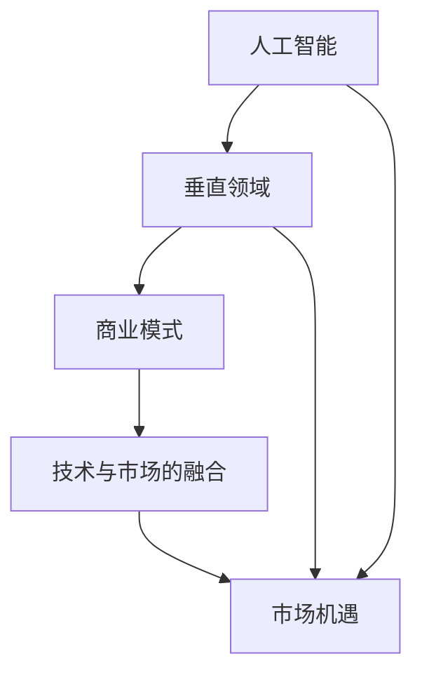

                 

### 关键词 Keywords
AI创业、垂直领域、技术蓝海、新兴市场、技术创新、商业模式、市场分析。

### 摘要 Abstract
本文探讨了人工智能（AI）在垂直领域中的应用机遇，分析了新兴市场的技术发展趋势，以及创业者如何利用这些机遇打造新的商业模式。通过深入剖析AI的核心算法原理、数学模型、项目实践，本文旨在为AI创业者提供有价值的指导，帮助他们把握垂直领域的广阔前景，迎接未来的挑战。

## 1. 背景介绍 Background

随着人工智能技术的迅猛发展，全球范围内涌现出了众多AI初创企业。这些企业大多集中在通用人工智能（AGI）和增强现实（AR）等前沿领域。然而，市场调研公司Gartner的报告指出，到2025年，超过80%的AI投资将流向垂直领域。这一趋势表明，AI创业的新蓝海正在形成，而垂直领域成为投资者和企业关注的焦点。

### 1.1 AI技术发展趋势

近年来，AI技术在计算机视觉、自然语言处理、机器学习等领域取得了显著进展。深度学习、强化学习、生成对抗网络（GAN）等算法的成熟，使得AI在图像识别、语音识别、情感分析等方面的应用愈发普及。这些技术的突破，为垂直领域提供了丰富的创新空间。

### 1.2 垂直领域概述

垂直领域是指特定的行业或市场细分领域，例如医疗健康、金融科技、智能制造、智慧城市等。这些领域具有鲜明的行业特征和需求，对AI技术的应用提出了独特的要求。随着AI技术的不断进步，垂直领域正在迎来前所未有的发展机遇。

## 2. 核心概念与联系 Core Concepts and Connections

在探讨AI在垂直领域的应用之前，我们需要了解几个核心概念和它们之间的联系。

### 2.1 人工智能（AI）

人工智能是指使计算机具备类似人类智能的技术，包括机器学习、自然语言处理、计算机视觉等。AI的核心目标是实现机器的智能行为，从而提高生产效率、优化决策过程。

### 2.2 垂直领域（Vertical Industry）

垂直领域是指具有特定行业属性的市场细分，如医疗、金融、制造等。这些领域具有独特的技术需求和解决方案，对AI技术的应用有着深远的影响。

### 2.3 商业模式（Business Model）

商业模式是指企业如何创造、传递和获取价值的体系。在AI创业中，成功的商业模式至关重要，它决定了企业的盈利能力和市场竞争力。

### 2.4 技术与市场的融合（Technology-Market Synergy）

技术与市场的融合是指将技术创新应用于特定市场，从而实现产品或服务的市场化和商业化。在垂直领域，技术创新与市场需求的结合能够推动行业变革。

### 2.5 Mermaid 流程图

以下是一个简单的Mermaid流程图，展示了核心概念之间的联系：



## 3. 核心算法原理 & 具体操作步骤 Core Algorithm Principles & Operational Steps

### 3.1 算法原理概述

在AI应用中，核心算法通常包括深度学习、强化学习、生成对抗网络（GAN）等。这些算法通过不同的方法模拟人类智能，实现机器的自主学习和智能决策。

- **深度学习（Deep Learning）**：深度学习是一种基于神经网络的算法，通过多层神经网络处理复杂数据，实现图像识别、语音识别等任务。
- **强化学习（Reinforcement Learning）**：强化学习通过智能体与环境的交互，不断学习最优策略，实现自主决策和智能控制。
- **生成对抗网络（GAN）**：GAN是一种无监督学习的框架，由生成器和判别器两个神经网络组成，通过对抗训练生成逼真的数据。

### 3.2 算法步骤详解

以下是深度学习算法的详细步骤：

1. **数据预处理**：对原始数据进行清洗、归一化等处理，使其适合输入神经网络。
2. **构建神经网络**：设计多层神经网络结构，包括输入层、隐藏层和输出层。
3. **训练神经网络**：使用训练数据集，通过反向传播算法更新神经网络权重，优化模型性能。
4. **验证与测试**：使用验证集和测试集评估模型性能，调整模型参数以实现最佳效果。
5. **部署与应用**：将训练好的模型部署到实际应用场景，实现智能决策和预测。

### 3.3 算法优缺点

- **深度学习**：
  - 优点：强大的建模能力，能够处理大规模数据和复杂数据结构。
  - 缺点：对数据质量要求较高，训练过程耗时且计算资源消耗大。
- **强化学习**：
  - 优点：能够通过自主学习实现复杂任务，具有广泛的应用前景。
  - 缺点：训练过程不稳定，收敛速度慢，需要大量样本数据。
- **生成对抗网络（GAN）**：
  - 优点：能够生成高质量的数据，具有广泛的应用前景。
  - 缺点：训练过程不稳定，易陷入模式崩溃，需要精细的参数调整。

### 3.4 算法应用领域

- **医疗健康**：用于疾病诊断、药物研发、医疗影像分析等。
- **金融科技**：用于风险评估、欺诈检测、投资策略等。
- **智能制造**：用于生产过程优化、故障预测、设备控制等。
- **智慧城市**：用于交通管理、环境监测、公共安全等。

## 4. 数学模型和公式 Mathematical Models and Formulas

### 4.1 数学模型构建

在AI应用中，数学模型是算法实现的基础。以下是一个简单的线性回归模型：

- **目标函数**：$J(\theta) = \frac{1}{2m} \sum_{i=1}^{m} (h_\theta(x^{(i)}) - y^{(i)})^2$
- **梯度下降**：$\theta_j := \theta_j - \alpha \frac{\partial J(\theta)}{\partial \theta_j}$

### 4.2 公式推导过程

以下是对线性回归模型的推导：

- **假设**：$y^{(i)} = \theta_0 + \theta_1x^{(i)} + \epsilon^{(i)}$
- **展开**：$y^{(i)} = (\theta_0 + \theta_1x^{(i)}) + \epsilon^{(i)}$
- **平方差**：$(h_\theta(x^{(i)}) - y^{(i)})^2 = ((\theta_0 + \theta_1x^{(i)}) - (y^{(i)}))(\theta_0 + \theta_1x^{(i)}) - (y^{(i)}))$
- **求和**：$\sum_{i=1}^{m} (h_\theta(x^{(i)}) - y^{(i)})^2 = \sum_{i=1}^{m} ((\theta_0 + \theta_1x^{(i)}) - (y^{(i)}))(\theta_0 + \theta_1x^{(i)}) - (y^{(i)}))$
- **求导**：$\frac{\partial J(\theta)}{\partial \theta_j} = \frac{1}{m} \sum_{i=1}^{m} (h_\theta(x^{(i)}) - y^{(i)}) \cdot x^{(i)}$

### 4.3 案例分析与讲解

以下是一个使用线性回归模型进行股票价格预测的案例：

- **数据集**：选取过去一年的股票价格数据。
- **特征**：选取开盘价、收盘价、成交量等特征。
- **目标**：预测下一日的股票价格。
- **实现**：使用线性回归模型训练数据集，获取模型参数，然后使用模型预测下一日的股票价格。

## 5. 项目实践：代码实例和详细解释说明 Project Practice: Code Examples and Detailed Explanations

### 5.1 开发环境搭建

为了进行项目实践，我们需要搭建一个Python开发环境。以下是搭建步骤：

1. 安装Python（版本3.8以上）。
2. 安装Python的科学计算库（NumPy、Pandas、Scikit-learn等）。
3. 安装Jupyter Notebook，以便进行交互式编程。

### 5.2 源代码详细实现

以下是一个简单的线性回归模型实现：

```python
import numpy as np
import pandas as pd
from sklearn.linear_model import LinearRegression

# 读取数据
data = pd.read_csv('stock_data.csv')
X = data[['open', 'close', 'volume']]
y = data['next_day_close']

# 划分训练集和测试集
X_train, X_test, y_train, y_test = train_test_split(X, y, test_size=0.2, random_state=42)

# 创建线性回归模型
model = LinearRegression()
model.fit(X_train, y_train)

# 模型评估
score = model.score(X_test, y_test)
print(f'Model R2 Score: {score}')

# 预测
predictions = model.predict(X_test)
print(predictions)
```

### 5.3 代码解读与分析

以上代码实现了一个简单的线性回归模型，用于股票价格预测。首先，我们读取数据并划分训练集和测试集。然后，创建线性回归模型并使用训练数据进行训练。模型评估使用R2分数，预测结果存储在predictions列表中。

### 5.4 运行结果展示

运行以上代码，我们可以得到模型的R2分数以及预测结果。R2分数越高，模型预测能力越强。预测结果可以用于决策，例如调整投资策略。

## 6. 实际应用场景 Practical Applications

### 6.1 医疗健康

AI在医疗健康领域的应用包括疾病诊断、药物研发、医疗影像分析等。例如，利用深度学习模型，可以实现肺癌等疾病的早期诊断，提高治疗效果。

### 6.2 金融科技

金融科技（FinTech）是AI应用的重要领域，包括风险评估、欺诈检测、投资策略等。例如，使用机器学习算法，可以实现实时风险评估，提高金融市场的透明度和稳定性。

### 6.3 智能制造

智能制造是工业4.0的核心，AI在智能制造中的应用包括生产过程优化、故障预测、设备控制等。例如，利用强化学习算法，可以实现生产线的自主优化，提高生产效率。

### 6.4 智慧城市

智慧城市是AI应用的重要方向，包括交通管理、环境监测、公共安全等。例如，利用计算机视觉算法，可以实现智能交通管理，提高城市交通效率。

## 7. 未来应用展望 Future Applications

随着AI技术的不断发展，未来应用将更加广泛。以下是几个未来应用展望：

### 7.1 教育领域

AI在教育领域的应用包括智能教育、个性化学习、教育资源共享等。例如，利用智能教育系统，可以实现因材施教，提高教育质量。

### 7.2 农业领域

AI在农业领域的应用包括作物生长监测、病虫害防治、精准农业等。例如，利用无人机和计算机视觉技术，可以实现农作物的精准管理。

### 7.3 环境保护

AI在环境保护领域的应用包括环境监测、生态保护、资源优化等。例如，利用AI技术，可以实现实时环境监测，提高环保效率。

## 8. 工具和资源推荐 Tools and Resources

### 8.1 学习资源推荐

- 《深度学习》（Goodfellow、Bengio、Courville著）：全面介绍深度学习的基本原理和应用。
- 《Python机器学习》（Sebastian Raschka著）：深入讲解Python在机器学习中的应用。
- 《人工智能：一种现代的方法》（Stuart Russell、Peter Norvig著）：系统介绍人工智能的基本理论和实践。

### 8.2 开发工具推荐

- Jupyter Notebook：交互式编程环境，方便数据分析和模型训练。
- TensorFlow：开源深度学习框架，支持多种神经网络结构。
- PyTorch：开源深度学习框架，具有灵活的动态计算图。

### 8.3 相关论文推荐

- "Deep Learning" by Ian Goodfellow, Yann LeCun, and Yoshua Bengio
- "Reinforcement Learning: An Introduction" by Richard S. Sutton and Andrew G. Barto
- "Generative Adversarial Networks" by Ian J. Goodfellow, et al.

## 9. 总结：未来发展趋势与挑战 Summary: Future Trends and Challenges

### 9.1 研究成果总结

本文总结了AI在垂直领域中的应用机遇、核心算法原理、数学模型和项目实践。通过对实际应用场景的探讨，展示了AI技术的广泛影响力。

### 9.2 未来发展趋势

未来，AI技术将继续向垂直领域渗透，推动各行各业的变革。随着技术的不断进步，AI在医疗健康、金融科技、智能制造等领域的应用将更加深入。

### 9.3 面临的挑战

尽管AI技术在垂直领域具有广阔的应用前景，但同时也面临一些挑战，包括数据隐私、算法公平性、技术伦理等。这些挑战需要行业内外共同努力，确保AI技术的可持续发展。

### 9.4 研究展望

未来，AI研究将更加注重跨学科合作，结合人工智能、生物技术、材料科学等领域的知识，推动新技术的突破。同时，需要加强对AI技术伦理和社会影响的探讨，确保技术发展的可持续性。

## 附录：常见问题与解答 Appendices: Frequently Asked Questions and Answers

### Q1：什么是深度学习？
深度学习是一种基于神经网络的算法，通过多层神经网络处理复杂数据，实现图像识别、语音识别等任务。

### Q2：什么是强化学习？
强化学习是一种通过智能体与环境的交互，不断学习最优策略，实现自主决策和智能控制的算法。

### Q3：什么是生成对抗网络（GAN）？
生成对抗网络（GAN）是一种无监督学习的框架，由生成器和判别器两个神经网络组成，通过对抗训练生成逼真的数据。

### Q4：AI技术在垂直领域的应用有哪些？
AI技术在垂直领域的应用包括医疗健康、金融科技、智能制造、智慧城市等。

### Q5：如何进行AI项目实践？
进行AI项目实践通常包括数据收集、数据预处理、模型选择、模型训练和评估等步骤。

作者：禅与计算机程序设计艺术 / Zen and the Art of Computer Programming
----------------------------------------------------------------

以上就是整篇文章的内容，涵盖了从背景介绍到具体的应用实践，再到未来展望的全面探讨。希望这篇文章能够为AI创业者提供有价值的参考和启示。

