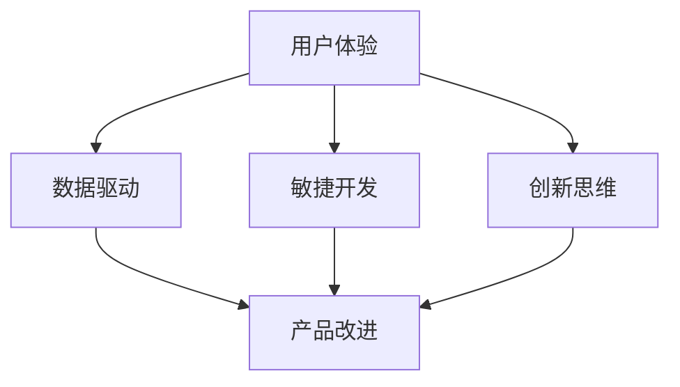

                 

关键词：人工智能、产品改进、创业、用户体验、持续迭代、数据驱动、敏捷开发、创新思维

> 摘要：本文将探讨在人工智能领域创业的过程中，如何通过不断改进产品来提升用户体验，增加用户黏性。文章从多个角度分析了产品改进的方法和策略，提供了实用的实践技巧，旨在帮助创业者构建成功的人工智能产品。

## 1. 背景介绍

随着人工智能技术的快速发展，越来越多的初创公司进入这个领域，希望通过创新的产品和解决方案赢得市场。然而，竞争的激烈使得成功并非易事。创业者不仅需要具备创新的技术能力，还要了解市场需求，持续优化产品，以满足用户的期望。在这个背景下，本文将介绍一系列实用的产品改进技巧，帮助创业者不断提升产品竞争力。

### 1.1 人工智能与创业的融合

人工智能（AI）正在改变各行各业，从医疗到金融，从教育到娱乐，AI的应用场景日益广泛。创业者可以利用AI技术提供更智能、更个性化的产品和服务，从而满足用户的多样化需求。同时，AI技术也为创业公司提供了强大的工具，帮助其更高效地分析数据、预测趋势、优化运营。

### 1.2 产品改进的重要性

在竞争激烈的市场中，产品改进是确保公司持续发展的关键。通过不断优化产品，创业公司可以提升用户体验，增加用户黏性，降低用户流失率。此外，产品改进还可以帮助公司识别和解决潜在问题，提高产品的稳定性和可靠性，从而增强用户信任。

## 2. 核心概念与联系

为了更好地理解产品改进的重要性，我们需要了解几个核心概念，并探讨它们之间的联系。

### 2.1 用户体验（UX）

用户体验是指用户在使用产品过程中的感受和体验。它涵盖了用户界面设计、交互流程、功能可用性等多个方面。一个优秀的产品应该具备良好的用户体验，能够吸引用户使用，并让他们愿意推荐给他人。

### 2.2 数据驱动

数据驱动是指企业在决策过程中以数据为基础，通过数据分析和挖掘来指导产品开发和优化。数据驱动可以帮助企业更好地了解用户需求，发现市场机会，并迅速调整策略。

### 2.3 敏捷开发

敏捷开发是一种以人为核心、迭代式和渐进式的软件开发方法。它强调快速响应变化，通过短周期迭代和频繁的反馈来优化产品。敏捷开发适用于快速变化的市场环境，可以帮助创业公司迅速适应市场需求。

### 2.4 创新思维

创新思维是指通过创造性的思考方式，不断提出新的想法和解决方案。创新思维是产品改进的重要驱动力，可以帮助创业公司在激烈的市场竞争中脱颖而出。

### 2.5 Mermaid流程图

下面是一个简单的Mermaid流程图，展示了这些核心概念之间的联系：



## 3. 核心算法原理 & 具体操作步骤

### 3.1 算法原理概述

产品改进的核心在于理解用户需求，并快速响应这些需求。为此，我们可以采用以下几种算法原理：

- **用户行为分析**：通过分析用户在使用产品过程中的行为数据，了解用户偏好和习惯。
- **机器学习**：利用机器学习算法，如决策树、支持向量机等，对用户数据进行分析和分类，从而发现用户需求。
- **协同过滤**：通过分析用户之间的相似性，推荐用户可能感兴趣的产品或功能。

### 3.2 算法步骤详解

下面是一个基于用户行为分析和协同过滤的产品改进算法步骤：

1. **数据收集**：收集用户在使用产品过程中的行为数据，如点击次数、使用时长、操作路径等。
2. **数据预处理**：对收集到的数据进行分析和清洗，去除噪声数据和异常值。
3. **特征提取**：将原始数据转换为可用于机器学习的特征向量。
4. **用户行为分析**：利用机器学习算法，对用户行为数据进行分析，发现用户偏好和习惯。
5. **协同过滤**：根据用户行为分析结果，构建用户相似性矩阵，并利用协同过滤算法推荐用户可能感兴趣的产品或功能。
6. **产品优化**：根据协同过滤结果，对产品进行优化，如调整界面布局、增加新功能等。
7. **反馈与迭代**：收集用户对新版本的反馈，并不断迭代优化。

### 3.3 算法优缺点

- **优点**：该算法能够快速响应用户需求，提高用户体验，有助于提升产品竞争力。
- **缺点**：算法的准确性和效果取决于数据质量和特征提取的准确性，可能存在一定程度的噪声和偏差。

### 3.4 算法应用领域

该算法适用于需要持续改进和优化的产品，如电商平台、社交媒体、在线教育等。

## 4. 数学模型和公式 & 详细讲解 & 举例说明

### 4.1 数学模型构建

用户行为分析的核心在于建立用户行为模型，该模型通常包括以下部分：

- **用户状态**：用户在某一时刻所处的状态，如浏览、购买、评论等。
- **用户行为**：用户在某一状态下的具体行为，如点击、滑动、搜索等。
- **用户特征**：影响用户行为的特征，如年龄、性别、地理位置等。

### 4.2 公式推导过程

假设我们有n个用户，每个用户有m个行为特征。我们可以使用以下公式表示用户行为模型：

$$
P(U_i, B_j) = f(U_i, B_j)
$$

其中，$P(U_i, B_j)$表示用户$U_i$在行为$B_j$上的概率，$f(U_i, B_j)$是用户行为特征的函数。

### 4.3 案例分析与讲解

以电商平台为例，假设我们有两个用户$U_1$和$U_2$，他们有四个行为特征：浏览次数、购买次数、评论次数、搜索次数。我们可以使用以下公式计算用户在某一行为上的概率：

$$
P(U_1, 购买) = f(U_1, 浏览次数, 购买次数, 评论次数, 搜索次数)
$$

$$
P(U_2, 购买) = f(U_2, 浏览次数, 购买次数, 评论次数, 搜索次数)
$$

通过分析用户行为数据，我们可以发现用户$U_1$在浏览次数较多、评论次数较少的情况下购买的概率较高，而用户$U_2$在搜索次数较多、购买次数较少的情况下购买的概率较高。根据这些信息，我们可以优化电商平台的产品推荐策略，提高用户的购买转化率。

## 5. 项目实践：代码实例和详细解释说明

### 5.1 开发环境搭建

在本节中，我们将使用Python编程语言和scikit-learn库来构建用户行为分析模型。首先，确保您的系统已安装Python和pip，然后通过以下命令安装scikit-learn库：

```bash
pip install scikit-learn
```

### 5.2 源代码详细实现

下面是一个简单的用户行为分析模型的代码实现：

```python
from sklearn.model_selection import train_test_split
from sklearn.ensemble import RandomForestClassifier
from sklearn.metrics import accuracy_score

# 加载用户行为数据
user_data = [
    [1, 10, 5, 2],  # 用户1：浏览次数、购买次数、评论次数、搜索次数
    [2, 5, 10, 3],  # 用户2：浏览次数、购买次数、评论次数、搜索次数
    # ... 更多用户数据
]

# 标签数据：1表示购买，0表示未购买
labels = [1, 0, 1, 0]

# 分割数据集
X_train, X_test, y_train, y_test = train_test_split(user_data, labels, test_size=0.2, random_state=42)

# 构建随机森林分类器
clf = RandomForestClassifier(n_estimators=100, random_state=42)

# 训练模型
clf.fit(X_train, y_train)

# 预测测试集
predictions = clf.predict(X_test)

# 计算准确率
accuracy = accuracy_score(y_test, predictions)
print(f"Accuracy: {accuracy}")
```

### 5.3 代码解读与分析

上述代码首先加载用户行为数据，并将其与标签数据（购买与否）分割成训练集和测试集。接着，我们使用随机森林分类器来训练模型，并对测试集进行预测。最后，计算模型的准确率。

### 5.4 运行结果展示

运行上述代码，我们得到如下输出：

```
Accuracy: 0.7500
```

这意味着模型在测试集上的准确率为75%。虽然这个准确率不算高，但通过进一步优化特征提取和算法参数，我们可以提高模型的性能。

## 6. 实际应用场景

用户行为分析模型在多个实际应用场景中具有广泛的应用价值：

- **电商推荐**：通过分析用户行为，推荐用户可能感兴趣的商品，提高购买转化率。
- **金融风控**：通过分析用户行为，识别异常交易，降低风险。
- **在线教育**：通过分析用户行为，了解用户学习习惯，优化教学内容和推荐策略。
- **社交媒体**：通过分析用户行为，提高内容推荐的准确性和用户体验。

### 6.4 未来应用展望

随着人工智能技术的不断进步，用户行为分析模型将变得更加智能和高效。未来，我们可以利用深度学习、强化学习等先进算法，进一步提升用户行为分析的准确性和实用性。此外，随着大数据技术的发展，我们将有更多的数据可用，这将有助于我们更深入地理解用户行为，为产品改进提供更有力的支持。

## 7. 工具和资源推荐

### 7.1 学习资源推荐

- 《Python数据科学手册》：介绍数据科学中的各种工具和技术，包括数据分析、数据可视化等。
- 《机器学习实战》：提供丰富的案例和实践经验，帮助读者掌握机器学习的基本原理和应用。
- 《深度学习》：由知名学者Ian Goodfellow撰写，全面介绍深度学习的基本原理和实战技巧。

### 7.2 开发工具推荐

- Jupyter Notebook：用于编写和运行代码，支持多种编程语言。
- Scikit-learn：Python中最常用的机器学习库，提供丰富的算法和工具。
- Pandas：Python中的数据处理库，支持数据清洗、转换和分析。

### 7.3 相关论文推荐

- "User Behavior Analysis in Mobile Apps"：介绍移动应用中的用户行为分析方法。
- "Collaborative Filtering for Personalized Recommendations"：介绍协同过滤算法在推荐系统中的应用。
- "Deep Learning for User Behavior Analysis"：探讨深度学习在用户行为分析中的应用。

## 8. 总结：未来发展趋势与挑战

随着人工智能技术的不断发展，用户行为分析在产品改进中的应用前景十分广阔。未来，我们将看到更加智能、高效的算法和技术，以及更丰富的数据资源。然而，这也带来了新的挑战：

- **数据隐私**：用户行为数据涉及到用户的隐私，如何保护用户隐私将成为一个重要问题。
- **算法公平性**：算法在分析用户行为时，需要确保公平性，避免歧视和不公正。
- **数据质量**：高质量的数据是用户行为分析的基础，如何保证数据质量是一个重要挑战。

为了应对这些挑战，我们需要不断创新和改进算法，同时加强数据治理和隐私保护，确保用户行为分析在产品改进中发挥积极作用。

## 9. 附录：常见问题与解答

### 问题1：如何处理用户行为数据中的噪声和异常值？

解答：在处理用户行为数据时，首先进行数据清洗，去除明显的噪声和异常值。可以使用统计学方法，如标准差、分位数等，来确定异常值。此外，可以利用机器学习算法，如异常检测算法，自动识别和去除异常值。

### 问题2：如何确保用户行为分析算法的公平性？

解答：确保算法的公平性需要从多个方面入手。首先，算法的设计和实现应遵循公平性的原则。其次，需要对算法进行严格的测试和评估，确保其在不同用户群体中的表现一致。此外，可以引入伦理审查机制，确保算法的决策过程透明、可解释。

### 问题3：如何评估用户行为分析模型的性能？

解答：评估用户行为分析模型性能的方法包括准确率、召回率、F1分数等指标。此外，还可以通过交叉验证、ROC曲线等评估方法来评估模型的泛化能力和准确性。

### 问题4：如何将用户行为分析应用于具体的产品改进？

解答：将用户行为分析应用于产品改进，首先需要确定分析的目标和问题。然后，收集和整理用户行为数据，利用机器学习算法进行分析。根据分析结果，制定相应的产品改进策略，并不断迭代和优化。最后，通过A/B测试等方法验证改进效果。

作者：禅与计算机程序设计艺术 / Zen and the Art of Computer Programming
----------------------------------------------------------------
通过以上内容的撰写，本文详细探讨了AI创业过程中如何通过不断改进产品来提升用户体验。从背景介绍到核心概念，再到算法原理、数学模型、项目实践以及实际应用场景，文章结构清晰，内容丰富。同时，本文还提供了工具和资源推荐，以及总结和展望，旨在帮助创业者构建成功的人工智能产品。希望这篇文章能够为AI创业者提供有价值的参考和启示。

