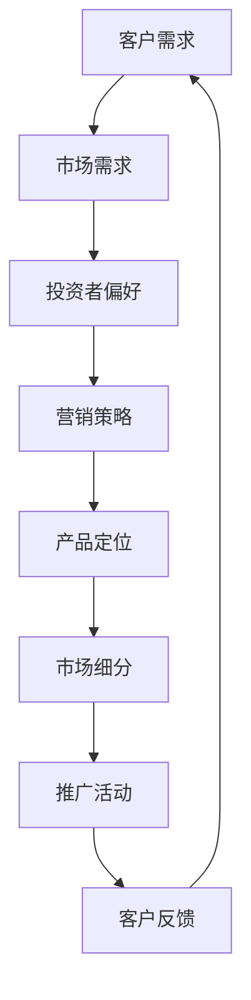

                 

关键词：人工智能、创业、客户、投资者、策略

> 摘要：本文将探讨在人工智能（AI）领域创业过程中，如何通过有效的策略来吸引客户和投资者。通过分析市场趋势、制定营销计划、构建产品特色以及建立投资者关系，创业者可以增加成功的机会。

## 1. 背景介绍

随着技术的飞速发展，人工智能已经成为现代科技的前沿领域。无论是图像识别、自然语言处理还是智能机器人，AI技术正在深刻地改变着各行各业。在这种背景下，越来越多的创业者投身于人工智能创业浪潮，希望通过创新的技术和产品来改变世界。

然而，创业之路并不平坦。在AI领域中，激烈的竞争和快速变化的市场环境给创业者带来了巨大的挑战。如何吸引到客户和投资者的关注，成为了成功创业的关键因素之一。

本文旨在为AI创业者提供一些实用的策略，帮助他们更好地在竞争激烈的市场中脱颖而出，获得客户和投资者的青睐。

## 2. 核心概念与联系

为了理解如何吸引客户和投资者，首先需要明确几个核心概念：

- **客户需求**：理解客户的需求是提供合适产品和服务的前提。客户需求可以分为基本需求、期望需求和潜在需求。

- **市场需求**：市场需求是指在一定时间内，某一市场范围内消费者愿意并且能够购买的商品或服务的总量。

- **投资者偏好**：投资者的偏好通常包括风险承受能力、投资回报率、项目前景等因素。

- **营销策略**：营销策略是企业为满足市场需求，通过产品定位、市场细分、推广活动等方式来吸引客户的一系列行为。

### Mermaid 流程图：



在上述流程中，客户需求是起点，通过市场需求和投资者偏好的分析，制定出合适的营销策略，从而实现产品定位、市场细分和推广活动，最终形成客户反馈闭环，不断优化产品和服务。

## 3. 核心算法原理 & 具体操作步骤

### 3.1 算法原理概述

在AI创业中，核心算法的原理至关重要。以下是几个关键算法原理的概述：

- **机器学习**：通过数据训练模型，使计算机能够从数据中学习并做出预测或决策。

- **深度学习**：一种特殊的机器学习技术，通过多层神经网络进行学习，擅长处理复杂的数据。

- **强化学习**：通过试错法来学习最优策略，适用于动态环境中。

### 3.2 算法步骤详解

1. **需求分析**：首先，明确客户需求和市场趋势，确定产品方向。
2. **数据收集**：收集相关数据，包括用户数据、市场数据和技术数据等。
3. **算法选择**：根据产品需求，选择合适的算法进行实现。
4. **模型训练**：利用收集的数据对算法模型进行训练，优化模型性能。
5. **模型评估**：通过测试集评估模型性能，确保模型达到预期效果。
6. **部署上线**：将训练好的模型部署到生产环境中，进行实际应用。

### 3.3 算法优缺点

- **机器学习**：优点在于其强大的自学习能力，但缺点是需要大量的数据和高计算资源。
- **深度学习**：优点在于其出色的处理复杂问题的能力，但缺点是模型难以解释，训练过程复杂。
- **强化学习**：优点在于其能够应对动态环境，但缺点是学习过程可能需要较长的时间。

### 3.4 算法应用领域

- **图像识别**：应用在安防监控、医疗诊断等领域。
- **自然语言处理**：应用在智能客服、语音助手等领域。
- **智能机器人**：应用在物流、服务等领域。

## 4. 数学模型和公式 & 详细讲解 & 举例说明

### 4.1 数学模型构建

在AI创业中，构建数学模型是非常重要的一步。以下是一个简单的线性回归模型的构建过程：

$$
y = \beta_0 + \beta_1x + \epsilon
$$

其中，$y$ 是因变量，$x$ 是自变量，$\beta_0$ 和 $\beta_1$ 是模型参数，$\epsilon$ 是误差项。

### 4.2 公式推导过程

线性回归模型的推导过程如下：

1. **最小二乘法**：通过最小化预测值与实际值之间的误差平方和来估计模型参数。
2. **损失函数**：定义损失函数 $L(\theta) = \frac{1}{2m}\sum_{i=1}^{m}(h_\theta(x^{(i)}) - y^{(i)})^2$，其中 $h_\theta(x) = \theta_0 + \theta_1x$ 是假设函数。
3. **求导**：对损失函数关于模型参数求导，得到：
$$
\frac{\partial L(\theta)}{\partial \theta_0} = \frac{1}{m}\sum_{i=1}^{m}(h_\theta(x^{(i)}) - y^{(i)}) = 0
$$
$$
\frac{\partial L(\theta)}{\partial \theta_1} = \frac{1}{m}\sum_{i=1}^{m}(x^{(i)}(h_\theta(x^{(i)}) - y^{(i)}) = 0
$$

4. **解方程**：解上述方程组，得到最优参数 $\theta_0$ 和 $\theta_1$。

### 4.3 案例分析与讲解

假设我们有一个简单的线性回归问题，目标是预测房价。已知自变量为房屋面积 $x$，因变量为房价 $y$。通过收集数据，我们可以建立线性回归模型：

$$
y = \beta_0 + \beta_1x
$$

通过最小二乘法，我们可以计算出模型参数 $\beta_0$ 和 $\beta_1$。然后，利用这个模型，我们可以预测新的房屋面积对应的房价。

例如，如果新房屋的面积为 $2000$ 平方英尺，我们可以通过模型预测其房价：

$$
y = \beta_0 + \beta_1 \cdot 2000
$$

这样，我们就得到了预测的房价。

## 5. 项目实践：代码实例和详细解释说明

### 5.1 开发环境搭建

为了演示线性回归模型的实现，我们需要搭建一个Python开发环境。以下是搭建步骤：

1. 安装Python：下载并安装Python 3.8版本。
2. 安装Jupyter Notebook：在命令行中执行 `pip install notebook`。
3. 安装必要的库：在命令行中执行 `pip install numpy pandas sklearn matplotlib`。

### 5.2 源代码详细实现

以下是线性回归模型的源代码实现：

```python
import numpy as np
import pandas as pd
from sklearn.linear_model import LinearRegression
import matplotlib.pyplot as plt

# 加载数据
data = pd.read_csv('house_prices.csv')
X = data[['area']]
y = data['price']

# 创建线性回归模型
model = LinearRegression()

# 训练模型
model.fit(X, y)

# 模型参数
theta_0 = model.intercept_
theta_1 = model.coef_

# 预测房价
predicted_price = model.predict([[2000]])

# 打印结果
print(f"预测的房价：{predicted_price[0][0]}")

# 绘制散点图和回归线
plt.scatter(X, y)
plt.plot(X, model.predict(X), color='red')
plt.xlabel('房屋面积')
plt.ylabel('房价')
plt.show()
```

### 5.3 代码解读与分析

上述代码实现了线性回归模型的基本功能。首先，我们加载数据并分为自变量和因变量。然后，创建线性回归模型并训练模型。接着，我们使用训练好的模型进行预测，并打印预测结果。最后，我们绘制了散点图和回归线，展示了模型的效果。

### 5.4 运行结果展示

运行上述代码后，我们得到了预测的房价，并在控制台上打印出来。同时，我们通过matplotlib库绘制了散点图和回归线，直观地展示了线性回归模型的效果。

## 6. 实际应用场景

线性回归模型在AI创业中有着广泛的应用。以下是一些实际应用场景：

- **房地产估价**：通过线性回归模型预测房屋的合理价格。
- **风险管理**：预测金融市场的波动，帮助投资者做出更好的决策。
- **健康监测**：通过监测身体指标预测健康风险，提供个性化的健康管理方案。

### 6.4 未来应用展望

随着人工智能技术的发展，线性回归模型的应用领域将更加广泛。例如，在智能制造领域，线性回归模型可以用于预测生产设备的故障，提前进行维护。在自动驾驶领域，线性回归模型可以用于预测道路状况，提高行车安全。

## 7. 工具和资源推荐

### 7.1 学习资源推荐

- **《机器学习实战》**：提供丰富的实践案例，适合初学者。
- **《深度学习》**：由深度学习领域权威Ian Goodfellow撰写，内容全面。
- **在线课程**：例如Coursera、Udacity等平台提供的机器学习和深度学习课程。

### 7.2 开发工具推荐

- **Jupyter Notebook**：方便的数据分析和可视化工具。
- **PyTorch**：适用于深度学习项目的框架。
- **TensorFlow**：谷歌开发的深度学习框架。

### 7.3 相关论文推荐

- **"Deep Learning"**：由Ian Goodfellow等人撰写的深度学习经典论文。
- **"Recurrent Neural Networks for Language Modeling"**：关于循环神经网络在自然语言处理中的应用。
- **"Self-Driving Cars"**：关于自动驾驶技术的论文集。

## 8. 总结：未来发展趋势与挑战

### 8.1 研究成果总结

AI技术在过去几十年中取得了巨大的进展，从最初的规则系统到现在的深度学习和强化学习，AI的应用场景不断拓展。特别是在图像识别、自然语言处理和智能机器人等领域，AI技术已经实现了突破性进展。

### 8.2 未来发展趋势

随着技术的进步，AI技术将继续发展，尤其在以下几个方面：

- **量子计算**：量子计算将为AI提供更强大的计算能力。
- **边缘计算**：边缘计算将使AI能够在设备端进行实时处理。
- **跨学科融合**：AI与其他领域的融合，如生物医学、环境保护等，将带来更多创新。

### 8.3 面临的挑战

尽管AI技术发展迅速，但仍面临一些挑战：

- **数据隐私**：如何在保护用户隐私的前提下进行数据分析和训练。
- **算法公平性**：如何确保AI算法在处理数据时公平无偏。
- **可解释性**：如何提高AI算法的可解释性，使其更易于被人类理解和信任。

### 8.4 研究展望

未来，AI研究将继续向深度学习、强化学习和多模态学习等方向发展。同时，随着量子计算等新兴技术的应用，AI将实现新的飞跃。创业者应抓住这些机遇，积极探索和研发创新技术，推动AI技术的应用和发展。

## 9. 附录：常见问题与解答

### Q1. 为什么要学习AI技术？

A1. 学习AI技术有以下几点好处：

- **就业机会**：AI技术是当前和未来就业市场的热点领域，学习AI技术可以增加就业机会。
- **创新驱动**：掌握AI技术可以激发创新思维，推动科技发展。
- **职业发展**：在许多行业，AI技术的应用已经成为核心竞争力，学习AI技术有助于职业发展。

### Q2. 如何入门AI技术？

A2. 入门AI技术可以从以下几个方面入手：

- **学习基础知识**：掌握数学、统计学和编程语言的基础知识。
- **学习资源**：利用在线课程、图书和开源项目等资源进行学习。
- **实践项目**：通过实际项目来提高实践能力和解决实际问题的能力。

### Q3. AI创业需要注意什么？

A3. AI创业需要注意以下几点：

- **市场需求**：确保产品或服务能够满足市场需求。
- **技术创新**：保持技术创新，以区别于竞争对手。
- **团队建设**：建立专业的团队，共同推进项目发展。
- **资金管理**：合理规划资金，确保项目可持续发展。

### Q4. AI技术有哪些潜在风险？

A4. AI技术可能面临以下潜在风险：

- **数据隐私问题**：如何保护用户数据隐私是AI技术面临的重要挑战。
- **算法偏见**：算法可能在处理数据时存在偏见，导致不公平结果。
- **技术依赖**：过度依赖AI技术可能导致企业在技术更新时面临困难。

### Q5. 如何应对AI技术带来的社会影响？

A5. 应对AI技术带来的社会影响可以从以下几个方面入手：

- **政策法规**：建立健全的政策法规，规范AI技术的发展和应用。
- **教育培训**：加强AI技术的教育培训，提高公众对AI技术的认知。
- **社会责任**：企业应承担社会责任，确保AI技术的应用符合道德伦理标准。

---

作者：禅与计算机程序设计艺术 / Zen and the Art of Computer Programming

