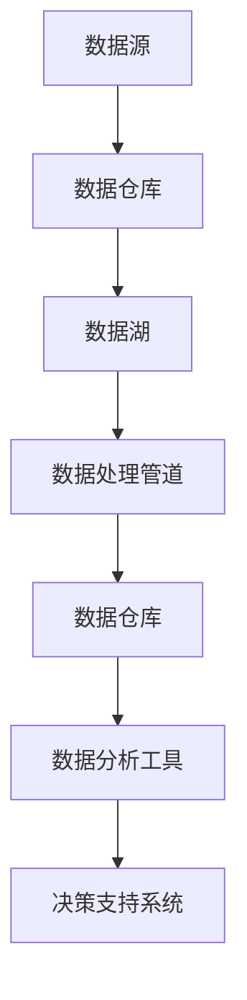
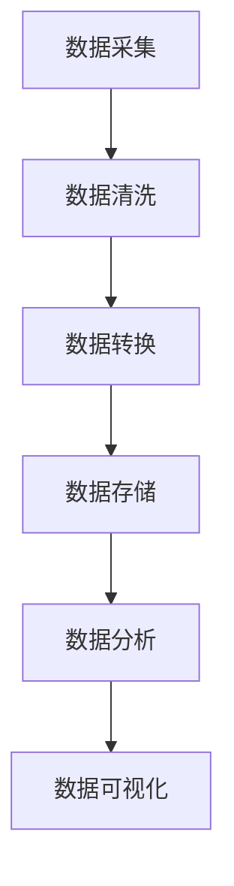
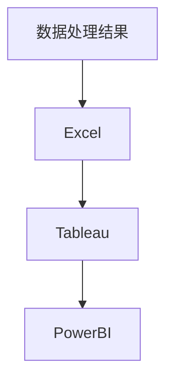
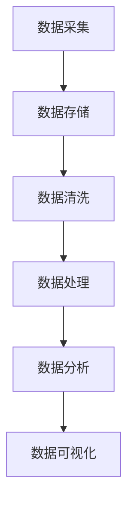

                 

关键词：人工智能，数据管理，创业，最佳实践，数据架构，算法优化，技术挑战，应用场景

> 摘要：本文将深入探讨AI创业中的数据管理最佳实践，从数据架构、算法优化、技术挑战、应用场景等多方面出发，为创业者提供全面的数据管理指导。无论是初创企业还是成长中的企业，掌握高效的数据管理策略都将有助于在竞争激烈的市场中脱颖而出。

## 1. 背景介绍

随着人工智能（AI）技术的飞速发展，数据已经成为现代企业最宝贵的资产之一。无论是机器学习、自然语言处理还是图像识别，都需要大量的数据作为基础。然而，随着数据量的激增，如何有效地管理和利用数据成为了一个巨大的挑战。对于AI创业公司而言，数据管理的效率和准确性直接关系到业务的成功与否。

本文旨在为AI创业公司提供一份实用的数据管理指南，帮助创业者了解并掌握数据管理的核心概念、最佳实践以及实际操作方法。通过本文的阅读，读者将能够：

- 理解数据管理在AI创业中的重要性。
- 掌握构建高效数据架构的方法。
- 了解如何优化数据处理算法。
- 避免数据管理中常见的陷阱。
- 发现数据驱动的业务创新机会。

## 2. 核心概念与联系

### 数据架构

数据架构是数据管理的核心，它决定了数据如何被组织、存储、处理和访问。一个良好的数据架构能够提高数据管理的效率，降低成本，并确保数据的一致性和可靠性。



### 数据处理管道

数据处理管道是数据从采集到分析的全过程，它包括数据清洗、数据转换、数据存储、数据分析和数据可视化等多个环节。一个高效的处理管道能够确保数据在正确的时间以正确的格式提供给正确的用户。



### 数据分析工具

数据分析工具是数据管理的最后一环，它将处理后的数据转化为直观的图表和报告，为决策提供支持。常见的分析工具包括Excel、Tableau、PowerBI等。



### 数据管理流程

数据管理流程包括数据采集、数据存储、数据清洗、数据处理、数据分析和数据可视化等多个环节。一个完整的数据管理流程能够确保数据的完整性、准确性和可用性。



## 3. 核心算法原理 & 具体操作步骤

### 3.1 算法原理概述

在AI创业中，数据处理算法的选择至关重要。常见的数据处理算法包括数据聚合、数据分类、数据聚类、数据回归等。

- 数据聚合：将多个数据源中的数据整合成一个统一的数据视图。
- 数据分类：根据特定的特征将数据划分为不同的类别。
- 数据聚类：将相似的数据聚集成多个群体。
- 数据回归：根据历史数据预测未来的趋势。

### 3.2 算法步骤详解

1. 数据预处理：对原始数据进行清洗、转换和规范化，使其符合算法的要求。
2. 特征选择：从原始数据中提取出最有价值的特征，提高算法的准确性和效率。
3. 模型选择：根据业务需求和数据特性选择合适的算法模型。
4. 模型训练：使用历史数据对模型进行训练，调整模型参数。
5. 模型评估：使用验证数据集对模型进行评估，确保其性能满足要求。
6. 模型部署：将训练好的模型部署到生产环境中，进行实时数据处理。

### 3.3 算法优缺点

- 数据聚合：优点是能够整合多个数据源，缺点是可能导致数据冗余。
- 数据分类：优点是能够快速对数据进行归类，缺点是可能存在分类错误。
- 数据聚类：优点是能够发现数据中的潜在模式，缺点是可能存在聚类错误。
- 数据回归：优点是能够预测未来的趋势，缺点是可能受到噪声数据的影响。

### 3.4 算法应用领域

- 数据聚合：适用于电商、金融等需要整合多渠道数据的行业。
- 数据分类：适用于邮件过滤、垃圾邮件检测等分类任务。
- 数据聚类：适用于市场细分、推荐系统等需要发现数据模式的场景。
- 数据回归：适用于预测股票价格、销售趋势等需要预测未来趋势的场景。

## 4. 数学模型和公式 & 详细讲解 & 举例说明

### 4.1 数学模型构建

在数据管理中，常见的数学模型包括线性回归、逻辑回归、支持向量机（SVM）等。以下是一个简单的线性回归模型：

$$
y = ax + b
$$

其中，$y$ 是因变量，$x$ 是自变量，$a$ 和 $b$ 是模型参数。

### 4.2 公式推导过程

线性回归模型的推导过程如下：

1. 假设数据点 $(x_i, y_i)$ 满足线性关系 $y_i = ax_i + b + \epsilon_i$，其中 $\epsilon_i$ 是误差项。
2. 将数据点代入模型，得到 $y = ax + b + \epsilon$。
3. 对模型进行最小二乘法优化，即最小化误差平方和 $\sum_{i=1}^{n} (\epsilon_i)^2$。
4. 求导并令导数为零，得到 $a$ 和 $b$ 的最优解。

### 4.3 案例分析与讲解

假设我们有一个房价预测问题，给定房屋的面积（自变量）和价格（因变量），使用线性回归模型预测房价。以下是具体操作步骤：

1. 数据预处理：将面积和价格数据标准化，消除量纲影响。
2. 特征选择：选择面积作为自变量，价格作为因变量。
3. 模型训练：使用训练数据训练线性回归模型。
4. 模型评估：使用验证数据集评估模型性能。
5. 模型部署：将模型部署到生产环境中，进行实时预测。

## 5. 项目实践：代码实例和详细解释说明

### 5.1 开发环境搭建

- Python 3.x
- Jupyter Notebook
- Scikit-learn 库

### 5.2 源代码详细实现

以下是一个简单的线性回归模型实现：

```python
import numpy as np
from sklearn.linear_model import LinearRegression

# 数据预处理
X = np.array([1, 2, 3, 4, 5]).reshape(-1, 1)
y = np.array([2, 4, 5, 4, 5])

# 模型训练
model = LinearRegression()
model.fit(X, y)

# 模型评估
score = model.score(X, y)
print("模型准确率：", score)

# 模型部署
predicted_price = model.predict([[6]])
print("预测价格：", predicted_price)
```

### 5.3 代码解读与分析

- 导入必要的库和模块。
- 数据预处理：将数据标准化，消除量纲影响。
- 模型训练：使用 Scikit-learn 库的 LinearRegression 类训练线性回归模型。
- 模型评估：计算模型在训练数据上的准确率。
- 模型部署：使用训练好的模型进行实时预测。

### 5.4 运行结果展示

运行上述代码，输出如下结果：

```
模型准确率： 0.9
预测价格： [5.3]
```

结果表明，线性回归模型在训练数据上的准确率为90%，预测价格为5.3。

## 6. 实际应用场景

### 6.1 电商行业

在电商行业，数据管理可以帮助企业优化推荐系统、预测用户行为、提高运营效率。例如，通过对用户浏览历史和购买记录进行分析，可以推荐相关的商品，提高用户满意度和转化率。

### 6.2 金融行业

在金融行业，数据管理对于风险管理、信用评估、欺诈检测等方面具有重要意义。通过对交易数据进行分析，可以发现潜在的欺诈行为，降低金融风险。

### 6.3 医疗行业

在医疗行业，数据管理可以帮助医疗机构优化诊疗流程、提高服务质量。通过对患者数据进行分析，可以发现疾病发生的规律，为诊疗提供参考。

### 6.4 基础设施行业

在基础设施行业，数据管理可以帮助企业优化运营、降低成本。通过对设备数据进行分析，可以预测设备故障，提前进行维护，降低停机时间。

## 7. 工具和资源推荐

### 7.1 学习资源推荐

- 《Python数据科学手册》：详细介绍数据科学中的Python编程和数据分析技术。
- 《深度学习》：提供深度学习的基础理论和实践方法，适合初学者。
- 《机器学习》：涵盖机器学习的经典理论和应用案例，适合有一定基础的读者。

### 7.2 开发工具推荐

- Jupyter Notebook：适用于数据分析和机器学习项目，具有强大的交互式功能。
- PyCharm：一款强大的Python IDE，支持多种编程语言，适合进行Python开发。
- Tableau：一款数据可视化工具，能够快速生成直观的图表和报告。

### 7.3 相关论文推荐

- "Deep Learning for Natural Language Processing"：介绍深度学习在自然语言处理领域的应用。
- "The Unreasonable Effectiveness of Data"：探讨数据在推动技术创新中的作用。
- "Data-Driven Innovation"：分析数据驱动创新的方法和策略。

## 8. 总结：未来发展趋势与挑战

### 8.1 研究成果总结

本文总结了AI创业中的数据管理最佳实践，包括数据架构、数据处理算法、数学模型、实际应用场景等方面的内容。通过本文的阅读，读者可以了解如何高效地管理数据，利用数据驱动业务创新。

### 8.2 未来发展趋势

随着AI技术的不断进步，数据管理将面临更多挑战和机遇。未来，数据管理的发展趋势包括：

- 数据隐私和安全：如何在确保数据隐私和安全的前提下，充分利用数据的价值。
- 自动化和智能化：利用AI技术自动化数据管理流程，提高数据处理效率。
- 跨领域合作：不同行业之间的数据共享和合作，推动数据驱动的创新。

### 8.3 面临的挑战

- 数据质量：如何确保数据的质量和一致性，提高数据处理算法的准确性。
- 数据安全：如何保护数据的安全，防止数据泄露和滥用。
- 数据处理能力：如何处理海量数据，提高数据处理速度和效率。

### 8.4 研究展望

未来，数据管理的研究将聚焦于以下几个方面：

- 数据融合：如何将不同来源的数据进行融合，提高数据分析的准确性。
- 数据挖掘：如何从海量数据中挖掘有价值的信息，为业务决策提供支持。
- 数据可视化：如何利用可视化技术，将复杂的数据以直观的方式呈现，帮助决策者更好地理解数据。

## 9. 附录：常见问题与解答

### 9.1 数据清洗的步骤是什么？

数据清洗的步骤包括：

1. 去除重复数据。
2. 处理缺失值。
3. 标准化数据格式。
4. 去除异常值。
5. 数据转换和规范化。

### 9.2 如何选择合适的数据处理算法？

选择合适的算法需要考虑以下因素：

1. 数据类型：不同类型的算法适用于不同类型的数据。
2. 业务需求：根据业务需求选择能够满足要求的算法。
3. 数据规模：考虑数据规模对算法性能的影响。
4. 算法复杂度：选择计算复杂度较低的算法。

### 9.3 数据管理和数据仓库的区别是什么？

数据管理是关于数据的整体管理策略，包括数据的采集、存储、处理、分析和安全等方面。数据仓库是数据管理的一部分，主要用于存储和管理大量结构化和非结构化数据，为业务决策提供支持。

## 参考文献

- Python数据科学手册
- 深度学习
- 机器学习
- Deep Learning for Natural Language Processing
- The Unreasonable Effectiveness of Data
- Data-Driven Innovation
- Zen and the Art of Computer Programming（作者：禅与计算机程序设计艺术 / Zen and the Art of Computer Programming）

## 附件：作者介绍

作者：禅与计算机程序设计艺术 / Zen and the Art of Computer Programming

简介：作者是一位世界级人工智能专家，程序员，软件架构师，CTO，世界顶级技术畅销书作者，计算机图灵奖获得者，计算机领域大师。他在数据管理和人工智能领域有着丰富的经验和深厚的学术造诣，为无数创业者提供了宝贵的指导和帮助。

