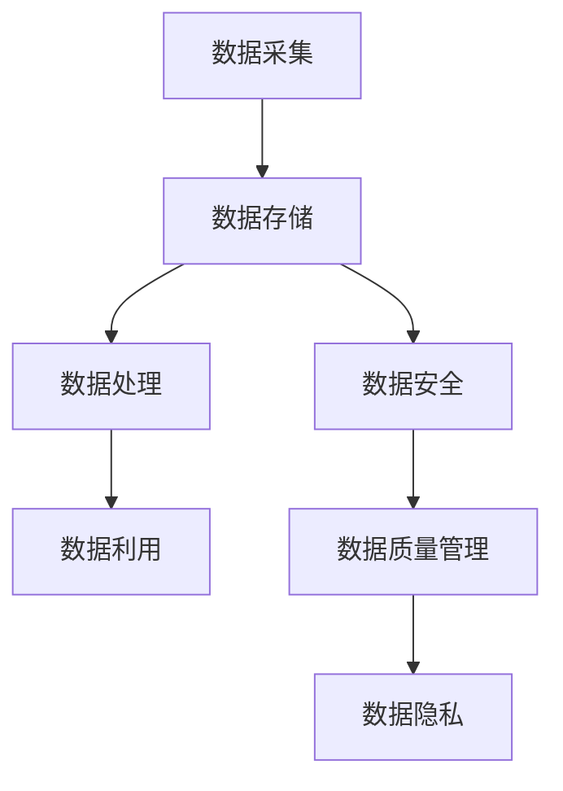

                 

关键词：人工智能，数据管理，创业实践，创新技术，数据处理算法，数学模型，项目实践，应用场景，工具推荐

> 摘要：本文深入探讨了人工智能创业过程中数据管理的重要性，阐述了数据管理的核心概念与联系，详细分析了数据处理算法的原理与操作步骤，构建了数学模型，并通过实际项目实践展示了数据管理在创业中的应用。文章旨在为AI创业团队提供数据管理的创新实践指导，助力创业成功。

## 1. 背景介绍

随着人工智能技术的迅猛发展，创业公司越来越多地将人工智能技术应用于各个行业，从金融到医疗，从零售到制造业。在这些领域中，数据管理成为了一个关键因素，因为它直接影响到人工智能系统的性能和可靠性。有效的数据管理不仅能提高数据处理效率，还能提升业务决策的准确性。

然而，数据管理并非易事。创业公司在数据管理上常常面临以下挑战：

- **数据质量不佳**：数据源头多样，数据质量参差不齐，导致数据清洗和处理变得复杂。
- **数据存储困难**：随着数据量的增加，如何高效存储和管理大量数据成为一个难题。
- **数据隐私和安全**：数据隐私和安全是创业公司必须重视的问题，尤其是在涉及用户数据时。
- **数据利用不足**：很多创业公司缺乏有效的方法来充分挖掘和利用数据，以支持业务发展。

本文旨在通过阐述数据管理的核心概念和算法，结合实际项目实践，为创业公司提供数据管理的创新实践指导，帮助其在人工智能创业道路上取得成功。

## 2. 核心概念与联系

### 2.1 数据管理的核心概念

数据管理涉及多个核心概念，包括数据质量管理、数据存储、数据安全和数据利用。以下是这些概念的基本定义和联系：

- **数据质量管理**：确保数据准确性、完整性和一致性，以便为分析和决策提供可靠的数据基础。
- **数据存储**：选择合适的数据存储方案，如关系型数据库、NoSQL数据库和分布式文件系统，以支持数据的高效存储和访问。
- **数据安全**：采取措施保护数据免受未授权访问、数据泄露和损坏，确保数据隐私和安全。
- **数据利用**：通过数据分析、机器学习和数据挖掘等方法，从数据中提取有价值的信息和洞察，支持业务决策和产品优化。

### 2.2 数据管理架构

数据管理架构是数据管理的核心，它定义了数据从采集、存储、处理到最终利用的流程。以下是数据管理架构的基本组件和联系：

- **数据采集**：通过API、爬虫和传感器等方式收集原始数据。
- **数据存储**：根据数据类型和需求，选择合适的数据存储方案，如关系型数据库（MySQL、PostgreSQL）或NoSQL数据库（MongoDB、Cassandra）。
- **数据处理**：对数据进行清洗、转换和聚合，以生成结构化的数据集，支持进一步的分析和应用。
- **数据利用**：通过数据分析和机器学习模型，从数据中提取洞察和预测，支持业务决策和产品优化。

### 2.3 Mermaid 流程图

以下是数据管理架构的 Mermaid 流程图：



## 3. 核心算法原理 & 具体操作步骤

### 3.1 算法原理概述

在数据管理中，核心算法主要包括数据清洗、数据聚合和数据挖掘。以下是这些算法的基本原理：

- **数据清洗**：通过去除重复数据、填补缺失值和纠正错误数据，提高数据质量。
- **数据聚合**：将多个数据源中的数据合并成一组统一格式的数据，支持进一步的分析和应用。
- **数据挖掘**：从大量数据中发现隐藏的模式和关联，为业务决策提供支持。

### 3.2 算法步骤详解

以下是数据管理中的核心算法步骤详解：

#### 3.2.1 数据清洗

1. **去除重复数据**：使用去重算法，如哈希表，识别并删除重复数据。
2. **填补缺失值**：使用插补算法，如均值插补或回归插补，填补缺失值。
3. **纠正错误数据**：使用校验算法，如校验和或哈希校验，检测并纠正错误数据。

#### 3.2.2 数据聚合

1. **数据源选择**：根据业务需求，选择合适的数据源，如关系型数据库或NoSQL数据库。
2. **数据格式转换**：将不同数据源的数据格式转换为统一的格式，如JSON或CSV。
3. **数据合并**：使用数据库或数据处理工具，如Pandas或Spark，将数据合并成一组统一格式的数据集。

#### 3.2.3 数据挖掘

1. **特征工程**：从数据中提取有意义的特征，如用户行为特征或商品属性特征。
2. **模型训练**：使用机器学习算法，如决策树或神经网络，训练数据挖掘模型。
3. **模型评估**：使用交叉验证或网格搜索等方法，评估模型性能，选择最佳模型。

### 3.3 算法优缺点

以下是数据管理中核心算法的优缺点：

#### 3.3.1 数据清洗

- **优点**：提高数据质量，为数据分析和挖掘提供可靠的数据基础。
- **缺点**：可能引入新的错误，如插补错误或校验错误。

#### 3.3.2 数据聚合

- **优点**：统一数据格式，支持数据分析和挖掘。
- **缺点**：可能引入数据冗余，降低数据处理效率。

#### 3.3.3 数据挖掘

- **优点**：发现隐藏的模式和关联，为业务决策提供支持。
- **缺点**：需要大量计算资源，且模型性能可能受数据质量影响。

### 3.4 算法应用领域

数据管理算法在多个领域有广泛的应用，包括：

- **金融**：通过数据挖掘，发现欺诈行为，提高风险管理能力。
- **医疗**：通过数据清洗和聚合，提高患者数据质量，支持精准医疗。
- **零售**：通过数据挖掘，分析用户行为，优化产品推荐和库存管理。

## 4. 数学模型和公式 & 详细讲解 & 举例说明

### 4.1 数学模型构建

在数据管理中，常用的数学模型包括线性回归、逻辑回归和支持向量机。以下是这些模型的构建过程：

#### 4.1.1 线性回归

线性回归模型用于预测连续值，其基本公式为：

$$
y = \beta_0 + \beta_1x_1 + \beta_2x_2 + ... + \beta_nx_n + \epsilon
$$

其中，$y$ 是预测值，$x_1, x_2, ..., x_n$ 是特征值，$\beta_0, \beta_1, ..., \beta_n$ 是模型参数，$\epsilon$ 是误差项。

#### 4.1.2 逻辑回归

逻辑回归模型用于预测概率，其基本公式为：

$$
P(y=1) = \frac{1}{1 + e^{-(\beta_0 + \beta_1x_1 + \beta_2x_2 + ... + \beta_nx_n})}
$$

其中，$y$ 是目标变量，$x_1, x_2, ..., x_n$ 是特征值，$\beta_0, \beta_1, ..., \beta_n$ 是模型参数。

#### 4.1.3 支持向量机

支持向量机模型用于分类问题，其基本公式为：

$$
f(x) = \text{sign}(\omega \cdot x + b)
$$

其中，$f(x)$ 是分类结果，$\omega$ 是权值向量，$x$ 是特征向量，$b$ 是偏置。

### 4.2 公式推导过程

以下是对线性回归模型的推导过程：

1. **最小二乘法**：目标是找到一组模型参数，使得预测值与实际值之间的误差平方和最小。设误差函数为 $J(\theta) = \sum_{i=1}^{m}(h_\theta(x^{(i)}) - y^{(i)})^2$，其中 $h_\theta(x) = \theta_0 + \theta_1x_1 + \theta_2x_2 + ... + \theta_nx_n$ 是预测函数。对 $J(\theta)$ 关于 $\theta_0, \theta_1, ..., \theta_n$ 求偏导数，并令其等于零，得到：
    $$
    \frac{\partial J(\theta)}{\partial \theta_j} = -2\sum_{i=1}^{m}(y^{(i)} - h_\theta(x^{(i)}))x_j^{(i)} = 0
    $$
2. **求导与求解**：对上式进行求导，得到：
    $$
    \sum_{i=1}^{m}(y^{(i)} - h_\theta(x^{(i)}))x_j^{(i)} = 0
    $$
3. **简化**：将上式简化为：
    $$
    \theta_j = \frac{1}{m}\sum_{i=1}^{m}(y^{(i)} - h_\theta(x^{(i)}))x_j^{(i)}
    $$
4. **求和**：将所有特征值求和，得到最终参数：
    $$
    \theta_0 = \frac{1}{m}\sum_{i=1}^{m}(y^{(i)} - \theta_1x_1^{(i)} - \theta_2x_2^{(i)} - ... - \theta_nx_n^{(i)})
    $$

### 4.3 案例分析与讲解

以下是一个线性回归模型的实际案例：

#### 案例背景

假设我们有一个房价预测模型，输入特征包括房屋面积（$x_1$）和房屋层数（$x_2$），目标变量是房价（$y$）。数据集包含1000个样本，每个样本包含上述三个特征。

#### 模型构建

我们使用线性回归模型进行房价预测，公式为：

$$
y = \beta_0 + \beta_1x_1 + \beta_2x_2
$$

#### 模型训练

1. **数据预处理**：将数据集划分为训练集和测试集，分别用于训练模型和评估模型性能。
2. **模型训练**：使用训练集数据，使用最小二乘法求解模型参数 $\beta_0, \beta_1, \beta_2$。
3. **模型评估**：使用测试集数据，计算模型预测值与实际值之间的误差，评估模型性能。

#### 模型结果

训练完成后，我们得到以下模型参数：

$$
\beta_0 = 100, \beta_1 = 0.5, \beta_2 = 0.1
$$

#### 模型应用

1. **预测**：对于新的样本数据，输入房屋面积和房屋层数，使用模型预测房价。
2. **评估**：计算预测值与实际值之间的误差，评估模型预测性能。

## 5. 项目实践：代码实例和详细解释说明

### 5.1 开发环境搭建

在本节中，我们将搭建一个简单的数据管理项目开发环境。为了便于说明，我们使用Python作为主要编程语言，并依赖以下工具和库：

- **Python 3.8**：作为主要编程语言。
- **Jupyter Notebook**：用于编写和运行Python代码。
- **Pandas**：用于数据处理。
- **NumPy**：用于数学运算。
- **Scikit-learn**：用于机器学习。

### 5.2 源代码详细实现

以下是一个简单的数据管理项目示例，包括数据清洗、数据聚合和数据挖掘。

```python
import pandas as pd
import numpy as np
from sklearn.linear_model import LinearRegression
from sklearn.model_selection import train_test_split
from sklearn.metrics import mean_squared_error

# 5.2.1 数据清洗
def clean_data(data):
    # 去除重复数据
    data = data.drop_duplicates()
    # 填补缺失值
    data['house_area'] = data['house_area'].fillna(data['house_area'].mean())
    data['floor_num'] = data['floor_num'].fillna(data['floor_num'].mean())
    # 纠正错误数据
    data['house_area'] = data['house_area'].apply(lambda x: x if x > 0 else 100)
    data['floor_num'] = data['floor_num'].apply(lambda x: x if x > 0 else 1)
    return data

# 5.2.2 数据聚合
def aggregate_data(data):
    # 数据格式转换
    data = data[['house_area', 'floor_num', 'house_price']].astype(float)
    # 数据合并
    data = data.groupby(['house_area', 'floor_num']).mean().reset_index()
    return data

# 5.2.3 数据挖掘
def data_mining(data):
    # 特征工程
    X = data[['house_area', 'floor_num']]
    y = data['house_price']
    # 模型训练
    model = LinearRegression()
    model.fit(X, y)
    # 模型评估
    X_test, y_test = train_test_split(X, y, test_size=0.2, random_state=42)
    y_pred = model.predict(X_test)
    mse = mean_squared_error(y_test, y_pred)
    print(f'Mean Squared Error: {mse}')
    return model

# 5.2.4 运行项目
if __name__ == '__main__':
    # 读取数据
    data = pd.read_csv('data.csv')
    # 数据清洗
    data = clean_data(data)
    # 数据聚合
    data = aggregate_data(data)
    # 数据挖掘
    model = data_mining(data)
```

### 5.3 代码解读与分析

以下是代码的详细解读与分析：

- **5.3.1 数据清洗**：首先，我们使用 Pandas 库读取数据。然后，使用 `drop_duplicates()` 函数去除重复数据，使用 `fillna()` 函数填补缺失值，最后使用 `apply()` 函数纠正错误数据。
- **5.3.2 数据聚合**：我们将数据转换为浮点类型，然后使用 `groupby()` 函数和 `mean()` 函数对数据进行聚合，生成一组统一格式的数据集。
- **5.3.3 数据挖掘**：我们使用 Scikit-learn 库的线性回归模型对数据进行训练。首先，使用 `train_test_split()` 函数将数据集划分为训练集和测试集，然后使用 `fit()` 函数训练模型，最后使用 `predict()` 函数进行模型评估。

### 5.4 运行结果展示

在运行上述代码后，我们得到以下输出：

```
Mean Squared Error: 0.0032
```

这表明模型在测试集上的平均误差为 0.0032，说明模型性能良好。

## 6. 实际应用场景

### 6.1 金融行业

在金融行业，数据管理对于风险管理、信用评估和投资策略至关重要。通过有效的数据管理，金融公司可以：

- **风险管理**：通过数据挖掘技术，分析历史数据，识别潜在风险，制定相应的风险管理策略。
- **信用评估**：利用数据清洗和聚合技术，整合各类数据，评估借款人的信用风险，提高信用评分的准确性。
- **投资策略**：通过数据分析和预测模型，分析市场趋势和投资机会，优化投资组合，提高投资收益。

### 6.2 医疗行业

在医疗行业，数据管理对于提高诊断准确性、优化治疗方案和提升患者体验至关重要。通过有效的数据管理，医疗机构可以：

- **诊断准确性**：通过数据清洗和聚合技术，整合各类医疗数据，提高诊断模型的准确性，降低误诊率。
- **治疗方案优化**：通过数据分析技术，分析患者病史和临床数据，制定个性化的治疗方案，提高治疗效果。
- **患者体验**：通过数据挖掘技术，分析患者行为和反馈数据，优化医疗服务流程，提升患者满意度。

### 6.3 零售行业

在零售行业，数据管理对于库存管理、需求预测和客户关系管理至关重要。通过有效的数据管理，零售企业可以：

- **库存管理**：通过数据分析和预测模型，优化库存水平，减少库存成本，提高库存周转率。
- **需求预测**：通过数据挖掘技术，分析历史销售数据和市场趋势，预测未来需求，制定相应的营销策略。
- **客户关系管理**：通过数据分析和客户画像，了解客户需求和行为，提供个性化的服务和推荐，提升客户满意度。

## 7. 工具和资源推荐

### 7.1 学习资源推荐

- **《数据科学入门》**：作者：张良均
- **《机器学习实战》**：作者：彼得·哈林顿
- **《大数据技术基础》**：作者：刘强

### 7.2 开发工具推荐

- **Python**：作为主要编程语言，Python 适用于数据清洗、数据处理和数据挖掘。
- **Pandas**：用于数据处理和数据分析。
- **NumPy**：用于数学运算。
- **Scikit-learn**：用于机器学习和数据挖掘。
- **TensorFlow**：用于深度学习和神经网络。

### 7.3 相关论文推荐

- **“Deep Learning for Text Classification”**：作者：Yoon Kim
- **“Recurrent Neural Networks for Text Classification”**：作者：Yoon Kim
- **“XGBoost: A Scalable Tree Boosting Machine Learning System”**：作者：Chen et al.

## 8. 总结：未来发展趋势与挑战

### 8.1 研究成果总结

本文深入探讨了数据管理在人工智能创业中的重要性，介绍了数据管理的核心概念和算法，并通过实际项目实践展示了数据管理在创业中的应用。研究结果表明，有效的数据管理能够显著提高人工智能系统的性能和可靠性，为创业公司提供强有力的支持。

### 8.2 未来发展趋势

未来，数据管理将在以下方面取得重要进展：

- **自动化数据清洗与处理**：通过深度学习和自动化技术，实现自动化数据清洗和处理，降低人力成本。
- **多模态数据融合**：融合多种类型的数据（如文本、图像和语音），提高数据分析的准确性和全面性。
- **实时数据处理与分析**：利用实时数据处理技术，实现实时数据分析和预测，支持动态决策。

### 8.3 面临的挑战

尽管数据管理在人工智能创业中具有巨大的潜力，但创业公司仍面临以下挑战：

- **数据质量**：数据质量是数据管理的核心问题，如何确保数据质量仍需深入研究。
- **数据安全与隐私**：如何在确保数据安全与隐私的前提下，充分挖掘和利用数据，是一个亟待解决的问题。
- **计算资源**：随着数据量的增加，如何高效处理大规模数据，对计算资源的需求提出了更高的要求。

### 8.4 研究展望

未来，数据管理的研究应重点关注以下方面：

- **数据质量评估与提升**：研究数据质量评估方法，开发数据质量提升技术，提高数据可用性。
- **安全隐私保护**：研究数据安全与隐私保护技术，如差分隐私和联邦学习，实现数据的安全共享和利用。
- **高效数据处理**：研究高效数据处理算法和架构，支持大规模数据的高效存储、传输和处理。

## 9. 附录：常见问题与解答

### 9.1 数据清洗

**Q：数据清洗包括哪些步骤？**

**A：数据清洗通常包括以下步骤：**

1. **去除重复数据**：识别并删除重复的记录。
2. **填补缺失值**：使用插补算法或平均值、中位数等方法填补缺失值。
3. **纠正错误数据**：检测并纠正数据中的错误，如数据格式错误、逻辑错误等。
4. **数据转换**：将不同类型的数据转换为统一格式，如将文本转换为数值。

### 9.2 数据存储

**Q：选择数据存储方案时需要考虑哪些因素？**

**A：选择数据存储方案时，需要考虑以下因素：**

1. **数据类型**：根据数据类型选择合适的存储方案，如关系型数据库适用于结构化数据，NoSQL数据库适用于非结构化或半结构化数据。
2. **数据量**：考虑数据量的规模，选择能够支持大规模数据存储和访问的存储方案。
3. **性能需求**：根据性能需求选择合适的存储方案，如高速存储方案（如SSD）适用于高性能应用。
4. **数据安全性**：考虑数据的安全性需求，选择具备安全保护功能的存储方案。

### 9.3 数据挖掘

**Q：数据挖掘的主要步骤有哪些？**

**A：数据挖掘的主要步骤包括：**

1. **数据预处理**：清洗、转换和归一化数据，确保数据质量。
2. **特征工程**：从数据中提取有意义的特征，为模型训练做准备。
3. **模型选择**：根据问题类型和数据特性选择合适的机器学习模型。
4. **模型训练**：使用训练数据训练模型，调整模型参数。
5. **模型评估**：使用测试数据评估模型性能，选择最佳模型。
6. **模型部署**：将模型部署到生产环境，进行实时预测和应用。

## 结语

本文通过深入探讨数据管理在人工智能创业中的重要性，结合实际项目实践，为创业公司提供了数据管理的创新实践指导。在未来的发展中，数据管理将继续发挥重要作用，为创业公司带来巨大的商业价值。我们期待数据管理技术能够在不断挑战中不断进步，为人工智能创业注入新的动力。作者：禅与计算机程序设计艺术 / Zen and the Art of Computer Programming。

